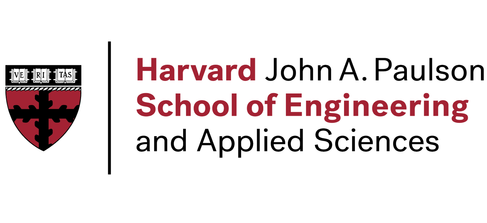
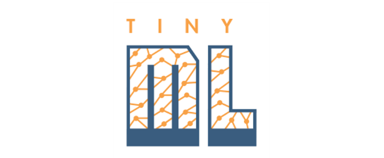
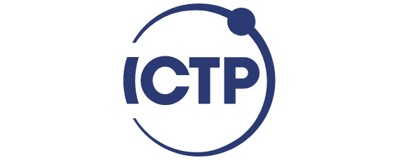
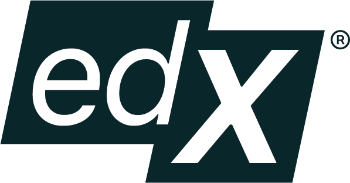
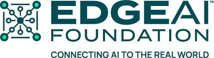
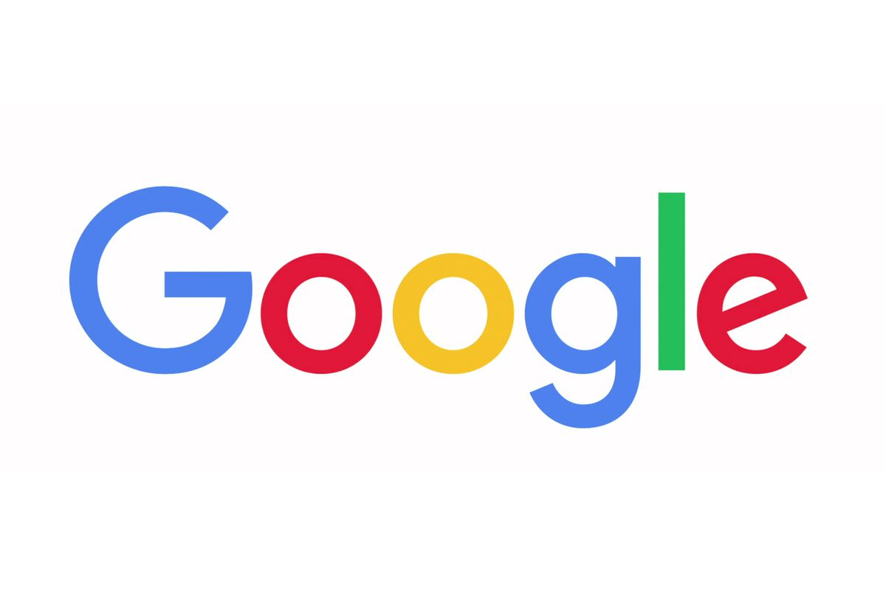
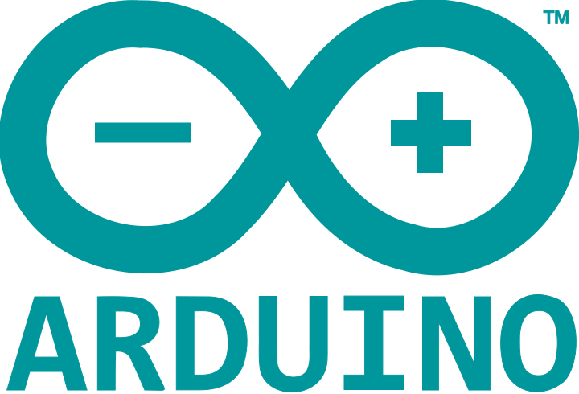
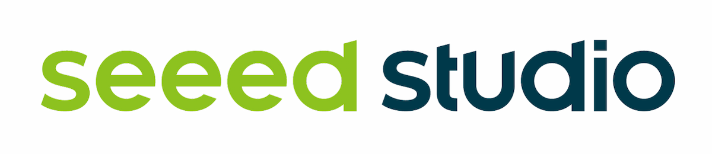

::: {.content-visible when-format="html"}

```{=html}
<div class="community-opening" style="padding-bottom: 1.5rem;">
  <p class="opening-eyebrow">PARTNERS & SPONSORS</p>
  <h1 class="opening-title">The organizations behind<br/>the curriculum.</h1>
  <p class="opening-body">From hardware kits in Nairobi to the MIT Press hardcover — none of this happens without partners who believe AI engineering education is worth investing in.</p>
</div>
```

## Institutional Partners {#institutional}

The academic institutions and organizations that anchor the AI engineering curriculum and its global network.

```{=html}
<div class="partner-tier">
  <div class="partner-grid">

    <a href="https://seas.harvard.edu" target="_blank" rel="noopener" class="partner-card">
      <div class="partner-card-logo">
        
      </div>
      <h3>Harvard SEAS</h3>
      <p>Home of CS 249r and the ML Systems curriculum.</p>
    </a>

    <a href="https://mitpress.mit.edu" target="_blank" rel="noopener" class="partner-card">
      <div class="partner-card-logo">
        
      </div>
      <h3>MIT Press</h3>
      <p>Publisher of the two-volume hardcover edition.</p>
    </a>

    <a href="https://www.tinyml.org" target="_blank" rel="noopener" class="partner-card">
      <div class="partner-card-logo">
        
      </div>
      <h3>tinyML Foundation</h3>
      <p>Non-profit advancing ML on embedded devices — co-founded the education initiative that grew into this curriculum.</p>
    </a>

    <a href="https://www.ictp.it" target="_blank" rel="noopener" class="partner-card">
      <div class="partner-card-logo">
        
      </div>
      <h3>ICTP</h3>
      <p>Co-host of the global Academic Network and annual SciTinyML workshops in Trieste.</p>
    </a>

    <a href="https://www.edx.org" target="_blank" rel="noopener" class="partner-card">
      <div class="partner-card-logo">
        
      </div>
      <h3>edX</h3>
      <p>Platform for the TinyML Professional Certificate (4 courses).</p>
    </a>

    <a href="https://www.edgeaifoundation.org" target="_blank" rel="noopener" class="partner-card">
      <div class="partner-card-logo">
        
      </div>
      <h3>Edge AI Foundation</h3>
      <p>Supporting edge AI education and research communities.</p>
    </a>

    <a href="https://datascience.harvard.edu" target="_blank" rel="noopener" class="partner-card">
      <div class="partner-card-logo">
        
      </div>
      <h3>Harvard Data Science Initiative</h3>
      <p>Interdisciplinary data science research and education at Harvard.</p>
    </a>

    <a href="https://extension.harvard.edu" target="_blank" rel="noopener" class="partner-card">
      <div class="partner-card-logo">
        
      </div>
      <h3>Harvard Extension School</h3>
      <p>Making Harvard courses accessible to a global audience.</p>
    </a>

    <a href="https://www.nsf.gov" target="_blank" rel="noopener" class="partner-card">
      <div class="partner-card-logo">
        
      </div>
      <h3>National Science Foundation</h3>
      <p>Funding ML systems research and educational infrastructure.</p>
    </a>

  </div>
</div>
```

## Industry Sponsors {#sponsors}

The companies that provide funding, hardware, and platform access to bring AI engineering education to classrooms worldwide.

```{=html}
<div class="partner-tier">
  <div class="partner-grid">

    <a href="https://google.com" target="_blank" rel="noopener" class="partner-card">
      <div class="partner-card-logo">
        
      </div>
      <h3>Google</h3>
      <p>Founding sponsor of the edX course series and TensorFlow Lite ecosystem.</p>
    </a>

    <a href="https://www.arduino.cc" target="_blank" rel="noopener" class="partner-card">
      <div class="partner-card-logo">
        
      </div>
      <h3>Arduino</h3>
      <p>Hardware partner — every partner university receives Arduino ML kits for hands-on labs.</p>
    </a>

    <a href="https://www.edgeimpulse.com" target="_blank" rel="noopener" class="partner-card">
      <div class="partner-card-logo">
        
      </div>
      <h3>Edge Impulse</h3>
      <p>Platform partner for embedded ML development and Coursera courses.</p>
    </a>

    <a href="https://www.seeedstudio.com" target="_blank" rel="noopener" class="partner-card">
      <div class="partner-card-logo">
        
      </div>
      <h3>Seeed Studio</h3>
      <p>Hardware partner providing XIAO and Grove ecosystem for deployment labs.</p>
    </a>

  </div>
</div>
```

## Become a Partner {#become}

```{=html}
<div class="sponsor-cta-banner">
  <div class="sponsor-cta-icon"><i class="fas fa-heart"></i></div>
  <h3>Support AI Engineering Education</h3>
  <p>$500 ships a hardware kit to a university classroom that needs it. Your sponsorship directly funds hardware and curriculum materials for 40+ universities across six continents.</p>
  <div class="sponsor-cta-actions">
    <a href="https://opencollective.com/mlsysbook" target="_blank" rel="noopener" class="cta-btn-primary">
      <i class="fas fa-hand-holding-heart"></i> Support on Open Collective
    </a>
    <a href="mailto:edu@tinyML.org" class="cta-btn-secondary">
      <i class="fas fa-envelope"></i> Contact Us
    </a>
  </div>
  <p class="sponsor-cta-note">We welcome partnerships in hardware, cloud credits, curriculum co-development, and translation support.</p>
</div>
```

:::
