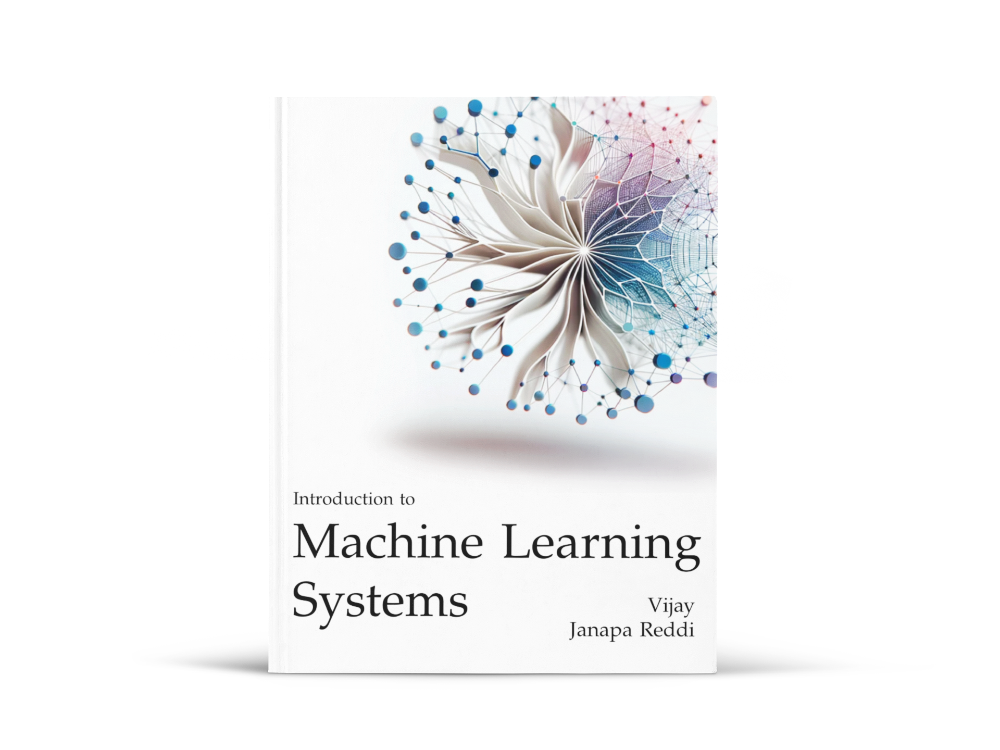
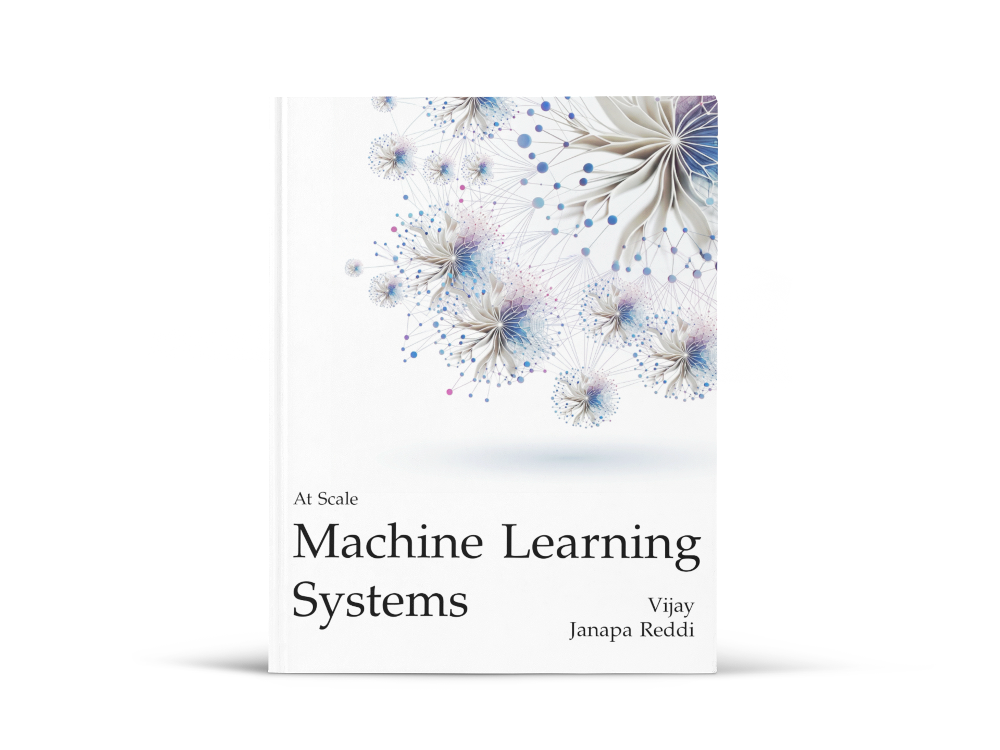
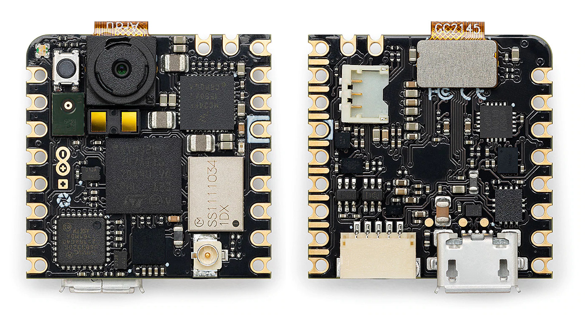

::: {.content-visible when-format="html"}

```{=html}
<div id="mls-neural-bg" aria-hidden="true"></div>
<div class="mls-landing mls-landing-v3">

<!-- ═══ Snap 1: The Textbook ═══ -->
<section class="mls-section mls-section-hero">
<div class="mls-landing-grid">
  <div class="mls-landing-left">
    <p class="mls-hero-eyebrow">TWO-VOLUME TEXTBOOK</p>
    <h1 class="mls-hero-title">Machine Learning<br/>Systems.</h1>
    <p class="mls-hero-tagline">The physics of AI engineering.</p>
    <p class="mls-hero-intro">A rigorous, principles-first treatment of how ML systems are built, optimized, and deployed — from a single machine to fleet-scale infrastructure.</p>
    <p class="mls-hero-badge">Harvard University &middot; MIT Press 2026</p>
  </div>

  <div class="mls-landing-right">
    <div class="mls-volumes">
      <div class="mls-vol-card">
        <a href="book/vol1/" class="mls-vol-card-link" title="Open Volume I">
          <span class="mls-vol-cover-wrap"></span>
          <p class="mls-vol-title">Volume I</p>
          <p class="mls-vol-subtitle">Introduction to Machine Learning Systems</p>
        </a>
        <p class="mls-vol-downloads">
          <span class="visually-hidden">Volume I downloads:</span>
          <a href="book/vol1/" target="_blank" rel="noopener">HTML</a>
          <a href="book/vol1/assets/downloads/Machine-Learning-Systems-Vol1.pdf" target="_blank" rel="noopener">PDF</a>
          <a href="book/vol1/assets/downloads/Machine-Learning-Systems-Vol1.epub" target="_blank" rel="noopener">EPUB</a>
        </p>
      </div>
      <div class="mls-vol-card">
        <a href="book/vol2/" class="mls-vol-card-link" title="Open Volume II">
          <span class="mls-vol-cover-wrap"></span>
          <p class="mls-vol-title">Volume II</p>
          <p class="mls-vol-subtitle">Machine Learning Systems at Scale</p>
        </a>
        <p class="mls-vol-downloads">
          <span class="visually-hidden">Volume II downloads:</span>
          <a href="book/vol2/" target="_blank" rel="noopener">HTML</a>
          <a href="book/vol2/assets/downloads/Machine-Learning-Systems-Vol2.pdf" target="_blank" rel="noopener">PDF</a>
          <a href="book/vol2/assets/downloads/Machine-Learning-Systems-Vol2.epub" target="_blank" rel="noopener">EPUB</a>
        </p>
      </div>
    </div>
  </div>
</div>

<div class="mls-scroll-indicator" role="button" tabindex="0" aria-label="Scroll to curriculum section">
  <span>Explore the Curriculum</span>
  <div class="mls-scroll-arrow">&darr;</div>
</div>
</section>

<!-- ═══ Snap 2: The Curriculum — Rich Cards ═══ -->
<section class="mls-section mls-section-richcards" id="curriculum">

  <div class="mls-cards-header">
    <h2 class="mls-cards-title">A complete curriculum for ML systems engineering.</h2>
  </div>

  <div class="mls-rich-grid">

    <!-- Row 1 -->

    <!-- Labs -->
    <a href="labs/" class="mls-rich-card" data-accent="explore">
      <div class="mls-rich-card-info">
        <p class="mls-cur-verb">EXPLORE</p>
        <h3 class="mls-cur-name">Labs</h3>
        <p class="mls-cur-desc">Interactive Marimo notebooks. Change a parameter, see what breaks, build intuition.</p>
      </div>
      <div class="mls-rich-card-demo">
        <svg viewBox="0 0 300 170" xmlns="http://www.w3.org/2000/svg" preserveAspectRatio="xMidYMid slice">
          <rect width="300" height="170" fill="#eef2f7"/>
          <!-- Header bar -->
          <rect width="300" height="22" fill="#dce6f0"/>
          <text x="10" y="15" font-size="8.5" fill="#2d6da3" font-weight="700" font-family="Inter,Helvetica,sans-serif">Lab 15 · Sustainable AI</text>
          <rect x="248" y="5" width="44" height="12" rx="6" fill="#2d6da3" opacity="0.15"/>
          <text x="270" y="14.5" font-size="6.5" fill="#2d6da3" text-anchor="middle" font-weight="600" font-family="Inter,Helvetica,sans-serif">Explore</text>
          <!-- Map shifted down by 20 -->
          <g transform="translate(0,20)">
          <path d="M0.0,17.5L8.4,20.0L5.9,21.5L0.1,20.1L300.0,20.9L297.8,21.2L299.4,23.1L286.3,25.1L285.1,29.3L280.7,32.5L279.9,27.7L287.1,22.9L283.4,24.5L280.6,23.8L279.2,25.7L268.5,25.8L262.6,29.4L266.6,29.8L267.8,31.5L264.1,37.4L256.3,41.9L257.6,45.8L255.4,46.3L254.4,42.0L250.9,42.6L251.4,40.9L248.4,42.3L249.1,43.8L252.0,43.8L249.3,45.9L251.6,48.6L251.4,51.5L246.6,56.0L238.2,58.5L241.1,63.8L238.7,67.1L237.6,67.8L233.4,63.8L232.7,67.3L236.9,73.9L232.0,68.5L231.0,60.9L228.5,61.6L226.2,56.0L222.5,57.1L216.9,61.8L216.5,66.4L214.6,68.4L210.5,57.2L208.7,57.6L205.3,53.8L197.8,53.6L190.0,50.0L193.2,55.0L197.0,53.0L199.8,56.4L195.7,60.9L186.2,64.5L179.1,50.4L178.3,52.0L177.0,50.1L181.2,59.5L185.6,65.2L187.2,66.3L192.6,65.0L192.5,66.1L190.5,70.6L182.7,78.9L184.0,87.2L179.0,91.5L179.7,94.8L177.1,96.4L177.1,98.6L172.9,102.7L166.3,104.0L159.8,90.1L161.4,83.9L157.3,75.9L158.2,72.4L153.6,69.8L142.5,71.0L136.1,64.7L135.8,57.1L145.1,45.2L157.9,43.9L159.3,44.2L158.6,46.8L165.9,49.8L168.0,47.6L178.1,49.2L180.1,44.5L173.0,44.5L171.8,42.1L177.9,40.0L184.8,40.0L180.6,37.3L182.6,35.6L178.2,38.0L175.6,36.2L173.1,39.5L174.0,40.8L169.0,41.3L170.0,43.6L168.7,44.7L166.3,40.2L161.0,36.9L160.5,38.3L165.4,41.5L164.1,41.3L163.4,43.3L157.4,38.0L152.6,39.1L148.2,44.4L142.6,44.3L142.2,39.1L148.8,38.3L149.0,36.7L146.2,34.4L156.8,30.4L157.1,27.4L158.8,26.9L159.1,30.0L166.4,29.6L168.0,27.2L170.1,27.5L169.5,25.7L174.3,25.0L167.8,24.4L167.9,22.3L171.2,20.7L168.5,20.2L164.9,22.7L165.7,24.9L163.2,28.2L160.8,28.9L158.6,25.4L154.7,26.2L154.9,22.8L170.5,15.8L184.2,18.8L177.7,19.5L180.8,21.8L186.6,19.9L186.2,17.9L188.5,18.1L188.6,19.4L194.8,17.6L200.0,18.1L200.5,16.8L207.1,18.3L205.6,15.8L208.3,14.1L210.7,14.8L211.4,18.0L209.4,19.7L210.4,19.9L212.5,18.5L210.9,15.5L212.2,14.3L212.7,15.6L217.9,15.2L217.1,13.6L237.0,10.3L245.1,11.8L241.2,13.2L255.8,13.7L259.4,16.0L267.1,14.3L291.3,17.8L292.0,16.6L298.8,17.2L0.0,17.5Z M74.5,17.1L77.2,19.0L78.7,16.8L81.1,17.0L82.3,18.7L72.4,23.3L71.1,25.9L73.1,27.4L81.4,29.0L83.4,32.3L84.5,31.2L83.5,29.4L86.2,27.9L84.6,26.0L84.9,23.1L88.5,23.0L92.0,24.1L93.6,26.5L96.2,24.7L103.6,31.5L94.7,33.1L90.7,36.0L95.8,34.0L96.3,36.5L100.2,36.7L95.5,38.7L96.3,37.3L94.1,37.4L91.1,39.1L91.7,40.3L87.1,42.1L86.7,44.0L86.4,42.4L86.9,45.4L82.2,48.8L83.0,54.0L79.9,49.9L71.8,50.2L69.0,51.8L68.4,56.3L69.8,58.9L72.7,59.6L77.5,57.0L75.9,61.8L80.7,62.5L80.1,65.5L81.5,67.5L86.0,67.8L90.2,64.6L90.3,67.4L91.7,64.9L93.2,66.2L98.4,66.1L102.4,70.0L107.2,71.5L108.0,75.1L116.7,77.4L121.1,81.1L117.5,86.5L115.9,93.3L110.3,95.7L105.2,103.7L101.3,103.3L102.7,105.3L101.9,106.8L95.7,109.2L97.1,110.5L93.9,113.0L95.0,115.1L90.8,119.9L87.5,118.6L88.2,114.1L87.0,113.9L89.4,110.3L88.1,111.0L91.4,90.3L86.7,87.2L82.3,80.1L82.6,75.9L85.7,71.8L84.5,67.7L82.6,69.0L78.6,66.7L77.1,63.9L63.8,59.8L54.4,48.5L58.8,55.7L56.5,54.4L46.3,41.4L46.1,34.8L47.8,35.8L47.6,34.2L43.8,32.6L38.3,26.6L27.4,24.3L23.6,25.7L24.5,23.9L18.0,28.3L12.7,29.7L19.1,25.9L15.0,26.1L11.6,23.8L16.0,21.0L9.9,20.3L15.3,19.9L11.0,18.0L19.5,15.5L36.2,17.6L46.3,16.5L59.3,18.8L61.5,17.7L69.9,18.9L71.5,17.4L69.6,16.6L70.7,15.1L74.5,17.1Z M0.0,145.6L30.7,145.9L22.0,144.7L22.6,143.4L19.3,142.6L28.0,141.9L20.6,140.9L18.0,139.1L23.9,139.5L28.2,137.8L55.0,136.4L66.1,137.8L63.6,135.5L93.4,135.7L93.5,131.1L101.8,127.7L95.3,131.6L98.5,133.9L98.9,136.8L85.6,138.9L88.6,139.9L85.0,141.0L101.5,144.3L126.2,141.9L120.2,140.3L135.4,137.6L144.3,134.1L172.6,133.7L178.2,132.1L182.2,133.1L195.4,129.8L207.4,131.6L206.6,134.9L208.2,135.2L223.3,130.2L229.8,131.2L235.7,129.6L238.5,130.8L244.7,129.9L249.9,131.1L262.6,129.4L264.6,130.8L292.7,134.7L286.3,138.5L289.2,140.6L283.2,142.5L298.6,145.4L0.0,145.6Z M269.6,86.5L277.6,96.7L277.6,100.8L275.0,106.2L271.9,107.5L267.2,106.7L265.2,103.7L264.0,104.4L264.8,102.4L263.3,104.1L259.4,101.2L248.4,104.2L245.9,103.5L245.1,93.1L250.7,91.4L255.1,86.7L258.0,87.5L259.9,84.4L263.7,84.9L262.9,87.5L266.8,89.8L268.8,83.9L269.6,86.5Z M127.4,5.4L132.6,6.1L123.4,6.5L139.8,7.3L133.3,8.2L135.2,8.2L133.6,9.4L134.6,10.8L131.9,11.1L133.9,13.1L129.3,14.7L131.9,16.1L128.0,16.5L131.4,16.6L116.8,20.5L113.9,24.9L109.8,24.3L107.0,22.0L105.0,19.0L107.6,16.7L104.4,17.0L107.2,16.2L103.5,15.3L104.4,14.5L101.2,12.1L88.9,10.0L99.8,6.6L127.4,5.4Z" class="lab-map-land" fill="#b8d4e8" stroke="#4a90c4" stroke-width="0.5"/>
          <!-- Datacenter dots -->
          <circle cx="158" cy="23" r="3" fill="#64748b" stroke="#fff" stroke-width="1" opacity="0.5"/>
          <circle cx="152" cy="34" r="3" fill="#64748b" stroke="#fff" stroke-width="1" opacity="0.5"/>
          <circle cx="236" cy="74" r="3" fill="#64748b" stroke="#fff" stroke-width="1" opacity="0.5"/>
          <circle cx="72" cy="40" r="3" fill="#64748b" stroke="#fff" stroke-width="1" opacity="0.5"/>
          <circle cx="211" cy="59" r="3" fill="#64748b" stroke="#fff" stroke-width="1" opacity="0.5"/>
          <circle cx="167" cy="32" r="3" fill="#64748b" stroke="#fff" stroke-width="1" opacity="0.5"/>
          <!-- Animated active dot -->
          <circle r="5" stroke="#fff" stroke-width="1.5">
            <animate attributeName="cx" values="158;158;152;152;236;236;72;72;211;211;167;167;158" keyTimes="0;0.14;0.167;0.31;0.333;0.48;0.5;0.64;0.667;0.81;0.833;0.97;1" dur="15s" repeatCount="indefinite"/>
            <animate attributeName="cy" values="23;23;34;34;74;74;40;40;59;59;32;32;23" keyTimes="0;0.14;0.167;0.31;0.333;0.48;0.5;0.64;0.667;0.81;0.833;0.97;1" dur="15s" repeatCount="indefinite"/>
            <animate attributeName="fill" values="#2d8a4e;#2d8a4e;#3d9e5a;#3d9e5a;#d4a017;#d4a017;#c87b2a;#c87b2a;#c44;#c44;#e05252;#e05252;#2d8a4e" keyTimes="0;0.14;0.167;0.31;0.333;0.48;0.5;0.64;0.667;0.81;0.833;0.97;1" dur="15s" repeatCount="indefinite"/>
          </circle>
          <!-- Pulse ring -->
          <circle fill="none" stroke-width="1.5" opacity="0">
            <animate attributeName="cx" values="158;158;152;152;236;236;72;72;211;211;167;167;158" keyTimes="0;0.14;0.167;0.31;0.333;0.48;0.5;0.64;0.667;0.81;0.833;0.97;1" dur="15s" repeatCount="indefinite"/>
            <animate attributeName="cy" values="23;23;34;34;74;74;40;40;59;59;32;32;23" keyTimes="0;0.14;0.167;0.31;0.333;0.48;0.5;0.64;0.667;0.81;0.833;0.97;1" dur="15s" repeatCount="indefinite"/>
            <animate attributeName="stroke" values="#2d8a4e;#2d8a4e;#3d9e5a;#3d9e5a;#d4a017;#d4a017;#c87b2a;#c87b2a;#c44;#c44;#e05252;#e05252;#2d8a4e" keyTimes="0;0.14;0.167;0.31;0.333;0.48;0.5;0.64;0.667;0.81;0.833;0.97;1" dur="15s" repeatCount="indefinite"/>
            <animate attributeName="r" values="5;20;5" dur="1.5s" repeatCount="indefinite"/>
            <animate attributeName="opacity" values="0.6;0;0.6" dur="1.5s" repeatCount="indefinite"/>
          </circle>
          </g>
        </svg>
      </div>
    </a>

    <!-- TinyTorch -->
    <a href="tinytorch/" class="mls-rich-card" data-accent="build">
      <div class="mls-rich-card-info">
        <p class="mls-cur-verb">BUILD</p>
        <h3 class="mls-cur-name">TinyTorch</h3>
        <p class="mls-cur-desc">Build your own ML framework from scratch across 20 progressive modules. Zero magic.</p>
      </div>
      <div class="mls-rich-card-demo">
        <svg viewBox="0 0 260 140" xmlns="http://www.w3.org/2000/svg" preserveAspectRatio="xMidYMid slice">
          <!-- Terminal fills entire card -->
          <rect width="260" height="140" fill="#1e1e2e"/>
          <!-- Title bar -->
          <rect width="260" height="22" fill="#2a2a3a"/>
          <circle cx="14" cy="11" r="4" fill="#ff5f57"/>
          <circle cx="26" cy="11" r="4" fill="#febc2e"/>
          <circle cx="38" cy="11" r="4" fill="#28c840"/>
          <text x="130" y="14" font-size="7" fill="#666" text-anchor="middle" font-family="monospace">tinytorch — tensor.py</text>
          <!-- Code lines -->
          <text x="12" y="40" font-size="9" font-family="monospace"><tspan fill="#c586c0">class</tspan><tspan fill="#ddd"> </tspan><tspan fill="#4ec9b0">Tensor</tspan><tspan fill="#ddd">:</tspan></text>
          <text x="26" y="56" font-size="9" font-family="monospace"><tspan fill="#c586c0">def</tspan><tspan fill="#ddd"> </tspan><tspan fill="#dcdcaa">__init__</tspan><tspan fill="#ddd">(self, data):</tspan></text>
          <text x="40" y="72" font-size="9" font-family="monospace"><tspan fill="#ddd">self.data = data</tspan></text>
          <text x="40" y="88" font-size="9" font-family="monospace"><tspan fill="#ddd">self.grad = </tspan><tspan fill="#b5cea8">0.0</tspan></text>
          <text x="40" y="104" font-size="9" font-family="monospace"><tspan fill="#ddd">self._backward = </tspan><tspan fill="#c586c0">lambda</tspan><tspan fill="#ddd">: </tspan><tspan fill="#569cd6">None</tspan></text>
          <!-- Blinking cursor -->
          <rect x="12" y="112" width="6" height="11" fill="#a56520">
            <animate attributeName="opacity" values="1;0;1" dur="1.2s" repeatCount="indefinite"/>
          </rect>
        </svg>
      </div>
    </a>

    <!-- Row 2 -->

    <!-- Hardware Kits -->
    <a href="kits/" class="mls-rich-card" data-accent="deploy">
      <div class="mls-rich-card-info">
        <p class="mls-cur-verb">DEPLOY</p>
        <h3 class="mls-cur-name">Hardware Kits</h3>
        <p class="mls-cur-desc">Deploy ML to Arduino, Raspberry Pi, and Jetson. Real memory limits, real power budgets.</p>
      </div>
      <div class="mls-rich-card-demo">
        
      </div>
    </a>

    <!-- MLSys-im -->
    <a href="mlsysim/" class="mls-rich-card" data-accent="model">
      <div class="mls-rich-card-info">
        <p class="mls-cur-verb">MODEL</p>
        <h3 class="mls-cur-name">MLSys&middot;im</h3>
        <p class="mls-cur-desc">First-principles performance modeling. One command, every bottleneck.</p>
      </div>
      <div class="mls-rich-card-demo">
        <svg viewBox="0 0 260 140" xmlns="http://www.w3.org/2000/svg" preserveAspectRatio="xMidYMid slice">
          <rect width="260" height="140" fill="#f8f6fc"/>
          <!-- CLI bar -->
          <rect width="260" height="24" fill="#ebe5f5"/>
          <text x="10" y="16" font-size="8" font-family="monospace"><tspan fill="#6a4da8" font-weight="700">$ mlsysim</tspan><tspan fill="#8b6ec0"> eval</tspan><tspan fill="#6a4da8"> llama-3-70b</tspan><tspan fill="#999"> --batch </tspan><tspan fill="#c87b2a" font-weight="600">1</tspan></text>
          <!-- Axes -->
          <line x1="30" y1="125" x2="248" y2="125" stroke="#6a4da8" stroke-width="1" opacity="0.3"/>
          <line x1="30" y1="125" x2="30" y2="32" stroke="#6a4da8" stroke-width="1" opacity="0.3"/>
          <!-- Roofline curve -->
          <path d="M30,112 L120,46 L248,46" fill="none" stroke="#6a4da8" stroke-width="2.5" opacity="0.6"/>
          <!-- Shaded region -->
          <path d="M30,112 L120,46 L248,46 L248,125 L30,125 Z" fill="#6a4da8" opacity="0.05"/>
          <!-- Ridge line -->
          <line x1="120" y1="46" x2="120" y2="125" stroke="#6a4da8" stroke-width="0.8" stroke-dasharray="4,3" opacity="0.25"/>
          <!-- Animated workload dot -->
          <circle r="6" stroke="#fff" stroke-width="1.5">
            <animate attributeName="cx" values="65;65;120;120;200;200;65" keyTimes="0;0.28;0.33;0.61;0.66;0.95;1" dur="9s" repeatCount="indefinite"/>
            <animate attributeName="cy" values="85;85;46;46;46;46;85" keyTimes="0;0.28;0.33;0.61;0.66;0.95;1" dur="9s" repeatCount="indefinite"/>
            <animate attributeName="fill" values="#c87b2a;#c87b2a;#3d9e5a;#3d9e5a;#e05252;#e05252;#c87b2a" keyTimes="0;0.28;0.33;0.61;0.66;0.95;1" dur="9s" repeatCount="indefinite"/>
          </circle>
          <!-- Region labels -->
          <text x="50" y="104" font-size="7.5" fill="#6a4da8" font-family="Inter,sans-serif" opacity="0.4">mem-bound</text>
          <text x="168" y="64" font-size="7.5" fill="#6a4da8" font-family="Inter,sans-serif" opacity="0.4">compute-bound</text>
          <!-- Batch labels -->
          <text x="73" y="79" fill="#c87b2a" font-size="8" font-weight="600" font-family="Inter,sans-serif" opacity="0.8">b=1</text>
          <text x="128" y="40" fill="#3d9e5a" font-size="8" font-weight="600" font-family="Inter,sans-serif" opacity="0.8">b=32</text>
          <text x="208" y="40" fill="#e05252" font-size="8" font-weight="600" font-family="Inter,sans-serif" opacity="0.8">b=128</text>
          <!-- Axis labels -->
          <text x="140" y="137" font-size="7" fill="#6a4da8" font-family="Inter,sans-serif" opacity="0.35" text-anchor="middle">Arithmetic Intensity</text>
          <text x="17" y="80" font-size="7" fill="#6a4da8" font-family="Inter,sans-serif" opacity="0.35" transform="rotate(-90,17,80)">FLOP/s</text>
        </svg>
      </div>
    </a>

    <!-- Row 3 -->

    <!-- StaffML -->
    <a href="interviews/staffml/" class="mls-rich-card" data-accent="practice">
      <div class="mls-rich-card-info">
        <p class="mls-cur-verb">PRACTICE</p>
        <h3 class="mls-cur-name">StaffML</h3>
        <p class="mls-cur-desc">Physics-grounded interview questions for ML systems roles. Vault, drills, and mock interviews.</p>
      </div>
      <div class="mls-rich-card-demo">
        <svg viewBox="0 0 260 140" xmlns="http://www.w3.org/2000/svg" preserveAspectRatio="xMidYMid slice">
          <rect width="260" height="140" fill="#fef8f8"/>
          <!-- Back card shadow -->
          <rect x="18" y="8" width="220" height="94" rx="5" fill="#b33" opacity="0.06" transform="rotate(-2,128,55)"/>
          <!-- Mid card -->
          <rect x="14" y="6" width="220" height="94" rx="5" fill="#fff" stroke="#b33" stroke-width="0.8" opacity="0.5" transform="rotate(1,124,53)"/>
          <!-- Front card -->
          <rect x="10" y="4" width="220" height="94" rx="5" fill="#fff" stroke="#b33" stroke-width="1.2"/>
          <!-- Domain pill -->
          <rect x="18" y="12" width="44" height="13" rx="6.5" fill="#e3f2fd"/>
          <text x="40" y="22" font-size="7.5" fill="#4a90c4" text-anchor="middle" font-weight="700" font-family="Inter,sans-serif">Cloud</text>
          <!-- Question text -->
          <text x="18" y="39" font-size="7" fill="#333" font-family="Inter,sans-serif">A 70B model needs 1,000 req/s.</text>
          <text x="18" y="50" font-size="7" fill="#333" font-family="Inter,sans-serif">Walk through your hardware</text>
          <text x="18" y="61" font-size="7" fill="#333" font-family="Inter,sans-serif">selection and parallelism strategy.</text>
          <!-- Rubric bars -->
          <text x="18" y="76" font-size="6" fill="#999" font-family="Inter,sans-serif">Hardware</text>
          <rect x="64" y="70" width="120" height="5" rx="2.5" fill="#eee"/><rect x="64" y="70" width="102" height="5" rx="2.5" fill="#4a90c4" opacity="0.6"/>
          <text x="18" y="88" font-size="6" fill="#999" font-family="Inter,sans-serif">Parallelism</text>
          <rect x="64" y="82" width="120" height="5" rx="2.5" fill="#eee"/><rect x="64" y="82" width="108" height="5" rx="2.5" fill="#3d9e5a" opacity="0.6"/>
          <text x="18" y="100" font-size="6" fill="#999" font-family="Inter,sans-serif">Trade-offs</text>
          <rect x="64" y="94" width="120" height="5" rx="2.5" fill="#eee"/><rect x="64" y="94" width="90" height="5" rx="2.5" fill="#c87b2a" opacity="0.6"/>
          <!-- Domain tags -->
          <rect x="10" y="110" width="36" height="16" rx="8" fill="#e3f2fd"/>
          <text x="28" y="121" font-size="7" fill="#4a90c4" text-anchor="middle" font-weight="600" font-family="Inter,sans-serif">Cloud</text>
          <rect x="52" y="110" width="30" height="16" rx="8" fill="#e8f5e9"/>
          <text x="67" y="121" font-size="7" fill="#2d7a2d" text-anchor="middle" font-weight="600" font-family="Inter,sans-serif">Edge</text>
          <rect x="88" y="110" width="38" height="16" rx="8" fill="#fff3e0"/>
          <text x="107" y="121" font-size="7" fill="#c87b2a" text-anchor="middle" font-weight="600" font-family="Inter,sans-serif">Mobile</text>
          <rect x="132" y="110" width="42" height="16" rx="8" fill="#fce4ec"/>
          <text x="153" y="121" font-size="7" fill="#c44" text-anchor="middle" font-weight="600" font-family="Inter,sans-serif">TinyML</text>
        </svg>
      </div>
    </a>

    <!-- Instructor Hub -->
    <a href="instructors/" class="mls-rich-card" data-accent="adopt">
      <div class="mls-rich-card-info">
        <p class="mls-cur-verb">ADOPT</p>
        <h3 class="mls-cur-name">Instructor Hub</h3>
        <p class="mls-cur-desc">The AI Engineering Blueprint: two-semester syllabi, pedagogy guide, rubrics, and TA handbook.</p>
      </div>
      <div class="mls-rich-card-demo">
        <svg viewBox="0 0 260 140" xmlns="http://www.w3.org/2000/svg" preserveAspectRatio="xMidYMid slice">
          <rect width="260" height="140" fill="#f4f9f4"/>
          <!-- Blueprint grid lines -->
          <line x1="0" y1="32" x2="260" y2="32" stroke="#1d6a1d" stroke-width="0.3" opacity="0.1"/>
          <line x1="0" y1="66" x2="260" y2="66" stroke="#1d6a1d" stroke-width="0.3" opacity="0.1"/>
          <line x1="0" y1="100" x2="260" y2="100" stroke="#1d6a1d" stroke-width="0.3" opacity="0.1"/>
          <line x1="130" y1="0" x2="130" y2="140" stroke="#1d6a1d" stroke-width="0.3" opacity="0.1"/>
          <!-- Title block -->
          <text x="130" y="14" font-size="9" fill="#1d6a1d" text-anchor="middle" font-weight="700" font-family="Inter,sans-serif">The Blueprint — Course Architecture</text>
          <text x="130" y="25" font-size="7" fill="#1d6a1d" text-anchor="middle" font-family="Inter,sans-serif" opacity="0.5">ML Systems · Two-Semester Curriculum</text>
          <!-- Module boxes: 2×2 grid -->
          <rect x="8" y="34" width="118" height="28" rx="4" fill="#d4edda" stroke="#1d6a1d" stroke-width="0.8"/>
          <text x="16" y="46" font-size="7" fill="#1d6a1d" font-weight="700" font-family="Inter,sans-serif">Semester 1: Foundations</text>
          <text x="16" y="56" font-size="6" fill="#1d6a1d" font-family="Inter,sans-serif" opacity="0.6">16 wks · Vol I · 8 assignments</text>
          <rect x="134" y="34" width="118" height="28" rx="4" fill="#d4edda" stroke="#1d6a1d" stroke-width="0.8"/>
          <text x="142" y="46" font-size="7" fill="#1d6a1d" font-weight="700" font-family="Inter,sans-serif">Semester 2: At Scale</text>
          <text x="142" y="56" font-size="6" fill="#1d6a1d" font-family="Inter,sans-serif" opacity="0.6">16 wks · Vol II · capstone</text>
          <rect x="8" y="68" width="118" height="28" rx="4" fill="#e8f5e9" stroke="#1d6a1d" stroke-width="0.8"/>
          <text x="16" y="80" font-size="7" fill="#1d6a1d" font-weight="700" font-family="Inter,sans-serif">Assessment</text>
          <text x="16" y="90" font-size="6" fill="#1d6a1d" font-family="Inter,sans-serif" opacity="0.6">Rubrics · Peer review · Grading</text>
          <rect x="134" y="68" width="118" height="28" rx="4" fill="#e8f5e9" stroke="#1d6a1d" stroke-width="0.8"/>
          <text x="142" y="80" font-size="7" fill="#1d6a1d" font-weight="700" font-family="Inter,sans-serif">Teaching Staff</text>
          <text x="142" y="90" font-size="6" fill="#1d6a1d" font-family="Inter,sans-serif" opacity="0.6">Pedagogy · TA handbook</text>
          <!-- Stamp -->
          <rect x="185" y="104" width="60" height="24" rx="4" fill="none" stroke="#1d6a1d" stroke-width="1.5" stroke-dasharray="3,2" opacity="0.4" transform="rotate(-5,215,116)"/>
          <text x="215" y="119" font-size="8" fill="#1d6a1d" text-anchor="middle" font-weight="700" font-family="Inter,sans-serif" opacity="0.4" transform="rotate(-5,215,119)">READY</text>
        </svg>
      </div>
    </a>

    <!-- Row 4 -->

    <!-- Lecture Slides -->
    <a href="slides/" class="mls-rich-card" data-accent="teach">
      <div class="mls-rich-card-info">
        <p class="mls-cur-verb">TEACH</p>
        <h3 class="mls-cur-name">Lecture Slides</h3>
        <p class="mls-cur-desc">35 Beamer decks with speaker notes and 266 original SVG diagrams. Drop in and teach.</p>
      </div>
      <div class="mls-rich-card-demo">
        <svg viewBox="0 0 260 140" xmlns="http://www.w3.org/2000/svg" preserveAspectRatio="xMidYMid slice">
          <rect width="260" height="140" fill="#fff"/>
          <!-- Top nav bar -->
          <rect width="260" height="18" fill="#2d3748"/>
          <text x="10" y="12" font-size="6" fill="#fff" font-family="Inter,sans-serif" opacity="0.4">Intro</text>
          <text x="34" y="12" font-size="6" fill="#fff" font-family="Inter,sans-serif" opacity="0.4">Systems</text>
          <text x="68" y="12" font-size="6" fill="#fff" font-family="Inter,sans-serif" opacity="0.4">DNN</text>
          <rect x="87" y="3" width="40" height="12" rx="2" fill="#4a90c4" opacity="0.5"/>
          <text x="107" y="12" font-size="6" fill="#fff" font-family="Inter,sans-serif" font-weight="700" text-anchor="middle">Training</text>
          <text x="140" y="12" font-size="6" fill="#fff" font-family="Inter,sans-serif" opacity="0.4">Accel</text>
          <text x="168" y="12" font-size="6" fill="#fff" font-family="Inter,sans-serif" opacity="0.4">Deploy</text>
          <text x="198" y="12" font-size="6" fill="#fff" font-family="Inter,sans-serif" opacity="0.4">Ethics</text>
          <!-- Slide title -->
          <text x="16" y="36" font-size="10" fill="#1a202c" font-weight="700" font-family="Inter,sans-serif">The Iron Law of ML Systems</text>
          <!-- Equation -->
          <rect x="16" y="43" width="228" height="18" rx="3" fill="#edf2f7"/>
          <text x="130" y="56" font-size="10" fill="#2d3748" text-anchor="middle" font-family="monospace" font-weight="600">T = D/BW + O/(R·η) + L</text>
          <!-- Bullet points -->
          <circle cx="20" cy="73" r="2" fill="#4a90c4"/>
          <text x="28" y="76" font-size="7" fill="#4a5568" font-family="Inter,sans-serif"><tspan font-weight="600" fill="#1a202c">Data Term</tspan> — memory bandwidth</text>
          <circle cx="20" cy="88" r="2" fill="#3d9e5a"/>
          <text x="28" y="91" font-size="7" fill="#4a5568" font-family="Inter,sans-serif"><tspan font-weight="600" fill="#1a202c">Compute Term</tspan> — utilization η ≤ 0.7</text>
          <circle cx="20" cy="103" r="2" fill="#c87b2a"/>
          <text x="28" y="106" font-size="7" fill="#4a5568" font-family="Inter,sans-serif"><tspan font-weight="600" fill="#1a202c">Latency Term</tspan> — orchestration overhead</text>
          <!-- Footer -->
          <rect y="122" width="260" height="18" fill="#f7fafc"/>
          <text x="10" y="134" font-size="6" fill="#a0aec0" font-family="Inter,sans-serif">Harvard University · ML Systems</text>
          <text x="250" y="134" font-size="6" fill="#a0aec0" font-family="Inter,sans-serif" text-anchor="end">12 / 38</text>
        </svg>
      </div>
    </a>

    <!-- Newsletter -->
    <a href="community/" class="mls-rich-card" data-accent="follow">
      <div class="mls-rich-card-info">
        <p class="mls-cur-verb">FOLLOW</p>
        <h3 class="mls-cur-name">Newsletter</h3>
        <p class="mls-cur-desc">Updates on the curriculum, new chapters, and what the community is building.</p>
      </div>
      <div class="mls-rich-card-demo">
        <svg viewBox="0 0 260 140" xmlns="http://www.w3.org/2000/svg" preserveAspectRatio="xMidYMid slice">
          <rect width="260" height="140" fill="#fafafa"/>
          <!-- Header bar -->
          <rect width="260" height="28" fill="#2d3748"/>
          <text x="14" y="19" font-size="9.5" fill="#fff" font-weight="700" font-family="Inter,sans-serif">MLSysBook Weekly</text>
          <!-- Items with colored dots -->
          <circle cx="20" cy="48" r="3.5" fill="#3d9e5a"/>
          <text x="30" y="51" font-size="7.5" fill="#555" font-family="Inter,sans-serif">New: Vol II Ch. 14 — Fault Tolerance</text>
          <circle cx="20" cy="68" r="3.5" fill="#4a90c4"/>
          <text x="30" y="71" font-size="7.5" fill="#555" font-family="Inter,sans-serif">Updated: TinyTorch Module 12</text>
          <circle cx="20" cy="88" r="3.5" fill="#c87b2a"/>
          <text x="30" y="91" font-size="7.5" fill="#555" font-family="Inter,sans-serif">Community: 500+ PRs merged</text>
          <circle cx="20" cy="108" r="3.5" fill="#6a4da8"/>
          <text x="30" y="111" font-size="7.5" fill="#555" font-family="Inter,sans-serif">Milestone: 23,000 GitHub stars</text>
          <!-- Footer -->
          <line x1="14" y1="122" x2="246" y2="122" stroke="#e0e0e0" stroke-width="0.8"/>
          <text x="130" y="134" font-size="7" fill="#999" text-anchor="middle" font-weight="600" font-family="Inter,sans-serif">Join 12,000+ subscribers</text>
        </svg>
      </div>
    </a>

  </div>

<div class="mls-scroll-indicator mls-scroll-2" role="button" tabindex="0" aria-label="Scroll to support section">
  <span>Support the Mission</span>
  <div class="mls-scroll-arrow">&darr;</div>
</div>
</section>

<!-- ═══ Snap 3: Impact & Support ═══ -->
<section class="mls-section mls-section-impact" id="support">

  <div class="mls-impact-top">
    <p class="mls-impact-eyebrow">OUR MISSION</p>
    <p class="mls-impact-headline">AI education should be<br/>free and open to everyone.</p>
    <p class="mls-impact-mission">Everyone calls AI the new electricity — but electricity is useless without engineers who can build the infrastructure. The world needs people who understand the systems underneath. That knowledge should be accessible to anyone willing to learn. This textbook is open source, community-driven, and always will be.</p>
  </div>

  <div class="mls-reader-map">
    <div class="mls-looker-wrap">
      <iframe
        src="https://lookerstudio.google.com/embed/reporting/e7192975-a8a0-453d-b6fe-1580ac054dbf/page/0pNbE"
        title="Global readership map — 243,000+ readers across 180+ countries"
        allowfullscreen="allowfullscreen"
        loading="lazy"
        sandbox="allow-storage-access-by-user-activation allow-scripts allow-same-origin allow-popups allow-popups-to-escape-sandbox">
      </iframe>
    </div>
  </div>

  <div class="mls-impact-bottom">
    <p class="mls-impact-stats-line"><span id="gh-reader-num">243,000+</span> readers &middot; <span id="gh-star-num">23,000+</span> stars &middot; 180+ countries</p>

    <div class="mls-goal-block">
      <p class="mls-impact-goal">Next milestone: <strong>100,000 ★ by 2027</strong> — we're at <span id="gh-star-num">23,000+</span></p>
      <p class="mls-impact-goal-sub">Every star signals to universities, foundations, and employers that this resource matters — and helps the next student or professor discover it.</p>
    </div>

    <div class="mls-star-row">
      <a href="https://github.com/harvard-edge/cs249r_book" target="_blank" rel="noopener" class="mls-footer-btn mls-btn-star">
        <svg width="16" height="16" viewBox="0 0 16 16" fill="#e3b341" aria-hidden="true" focusable="false"><path d="M8 .25a.75.75 0 01.673.418l1.882 3.815 4.21.612a.75.75 0 01.416 1.279l-3.046 2.97.719 4.192a.75.75 0 01-1.088.791L8 12.347l-3.766 1.98a.75.75 0 01-1.088-.79l.72-4.194L.818 6.374a.75.75 0 01.416-1.28l4.21-.611L7.327.668A.75.75 0 018 .25z"/></svg>
        Star on GitHub
      </a>
    </div>

    <p class="mls-impact-sponsors"><a href="about/">Meet our sponsors &amp; partners &rarr;</a></p>
  </div>

</section>

</div>

<script src="neural-bg.js"></script>
<script>
// Clickable scroll indicators
document.querySelectorAll('.mls-scroll-indicator').forEach(ind => {
  const target = ind.classList.contains('mls-scroll-2') ? '#support' : '#curriculum';
  ind.addEventListener('click', () => {
    document.querySelector(target)?.scrollIntoView({ behavior: 'smooth' });
  });
  ind.addEventListener('keydown', (e) => {
    if (e.key === 'Enter' || e.key === ' ') {
      e.preventDefault();
      document.querySelector(target)?.scrollIntoView({ behavior: 'smooth' });
    }
  });
});

// Fetch live GitHub star count
fetch('https://api.github.com/repos/harvard-edge/cs249r_book')
  .then(r => r.json())
  .then(d => {
    if (d.stargazers_count) {
      const fmt = d.stargazers_count.toLocaleString();
      const el = document.getElementById('gh-star-num');
      if (el) el.textContent = fmt;
    }
  })
  .catch(() => {});
</script>
```

:::
