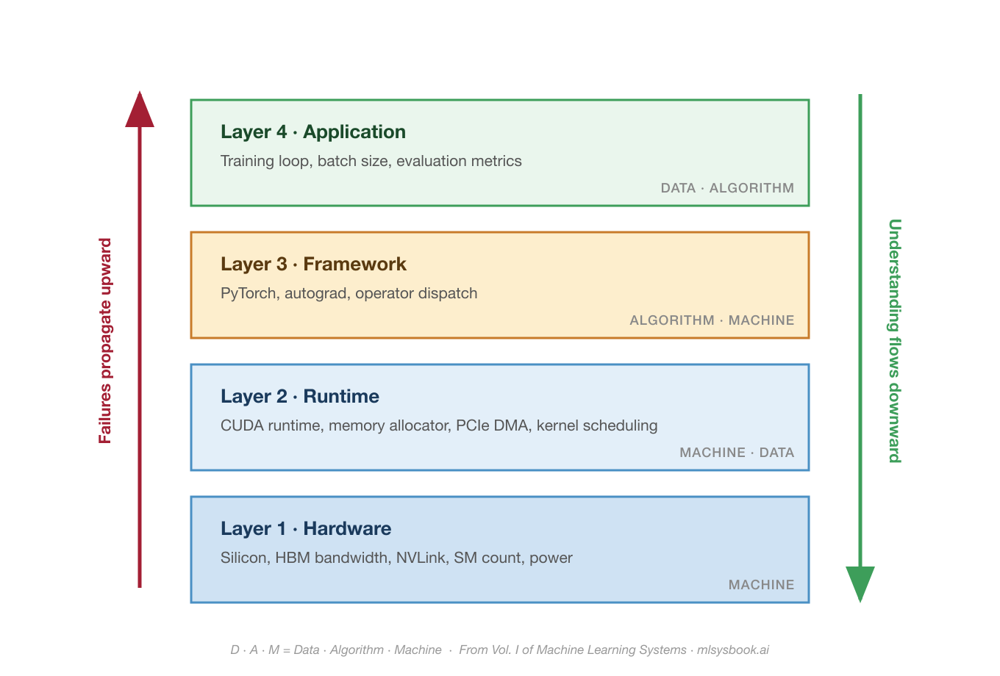

<!--
  STATUS: DRAFT v5
  Thesis: "failures propagate upward, understanding flows downward"
  Figure: figures/essay-03-stack-overlay.png (converged after 2 rounds of review)
  REMAINING:
  - [ ] Verify workforce data URLs are live at publish time
  - [ ] Confirm figure path when moving from drafts/ to posts/
-->

At a [PyTorch Foundation event at NeurIPS](https://neurips.cc/virtual/2025/loc/san-diego/128674) last year, I asked a room full of ML engineers two questions.

How many of you have actually built any part of PyTorch?

Three hands went up. In a room of hundreds. All three were PyTorch engineers from Meta, the company that builds PyTorch.

Then I asked a different question. What happens between `loss.backward()` and the GPU computing a gradient?

Silence.

Between that one line of Python and actual silicon, there are roughly a dozen layers: the autograd engine walks a computation graph, the dispatcher selects operator implementations, cuDNN or cuBLAS picks a kernel, the CUDA runtime schedules it onto a stream, the GPU memory manager allocates and frees buffers, and the hardware executes thousands of parallel threads. Most engineers interact with all of this through three method calls.

Here is why that matters. Systems engineers have long known that abstractions leak and errors surface where they are easiest to detect, not where they originate. Restated for the ML era: **failures propagate upward through the stack. Understanding flows downward.** A hardware constraint at the bottom manifests as an incomprehensible error at the top. The only way to diagnose it is to trace downward through layers that most practitioners have never seen. That asymmetry, with failures going one direction and understanding the other, is the most expensive gap in the AI industry.

## The Gap in Numbers

The [2024 Stack Overflow Developer Survey](https://survey.stackoverflow.co/2024/) found that 62 percent of developers now use AI tools in their work, with another 14 percent planning to. When the same survey asked about building or fine-tuning ML systems, the number fell into the low single digits. The gap between people who call the API and people who work on the systems underneath widens every year.

The pipeline is not catching up. Walk through any top ML curriculum and you will find courses on model architectures, optimization theory, and evaluation metrics. You will rarely find courses on GPU programming, memory hierarchies, or distributed training. We are scaling the supply of people who can use AI. We are not scaling the supply of people who understand what happens when they do.

Worth being precise here. Chip Huyen's [AI Engineering](https://www.oreilly.com/library/view/ai-engineering/9781098166298/) book covers one side of this gap, which is focused on building applications on top of foundation models through prompt engineering, RAG, fine-tuning, and evaluation. That is the application layer, and it is genuinely its own discipline. What [mlsysbook.ai](https://mlsysbook.ai) means by AI Engineering is the other side. The physics of the systems underneath. From silicon to serving. How the layers actually work, and why they break the way they do.

Both disciplines need to exist. Right now only one of them is being taught at scale.

## Where Failures Live

The [previous essay](https://buttondown.com/mlsysbook/archive/the-model-is-not-the-product/) introduced the D.A.M taxonomy (**Data**, **Algorithm**, **Machine**) as a diagnostic lens. The 100:1 ratio tells you the gap exists. It does not tell you where. For that, you need to see the stack.

Every layer does a different job. The **Hardware** sets the physical ceiling, silicon and bandwidth and power. The **Runtime** moves data between CPU and GPU, allocates memory, schedules kernels. The **Framework** translates math into hardware instructions, manages autograd, dispatches operators. The **Application** is where you live, batch size and training loop and metrics. An error at the top almost always has a cause at the bottom. That is the gap a builder sees through.

Here is what it looks like when a failure crosses layers.

You are training a 7B parameter model. You set batch size to 64, a reasonable statistical choice. Training crashes. The error reads "CUDA out of memory."

An API user reduces the batch size or requests a bigger GPU.

A builder traces the memory. For a 7B parameter model in FP16, the weights alone occupy ~14 GB. The gradients add another ~14 GB. Adam's two optimizer state vectors, typically kept in FP32 for numerical stability, add roughly ~28 GB more. That is ~56 GB before a single activation is stored. Now batch 64 starts generating forward-pass activations, which scale with both batch size and sequence length, and the [combined footprint pushes past](https://huggingface.co/docs/transformers/v4.20.1/en/perf_train_gpu_one) the 80 GB of HBM on an A100. The error is not about your batch size. It is about four different memory consumers at four different layers of the stack that your batch size decision activated simultaneously.

The fix could be activation checkpointing (trade compute for memory at the framework layer), gradient accumulation (change the training loop at the application layer), or mixed-precision training (reduce the bytes per parameter at the hardware layer). Each fix operates at a different layer. Choosing the right one requires seeing through the stack, not just reacting to the error message.

This is what "failures up, understanding down" means in practice. A single choice at Layer 4 activated three memory consumers sitting at three different layers, and the error message that surfaced at the top only made sense once you traced the cause to the bottom.

The same pattern holds everywhere. A [data pipeline on CPU starves the GPU](https://pytorch.org/tutorials/recipes/recipes/tuning_guide.html), and the model looks fine while the runtime quietly fails to feed the hardware fast enough. A switch to FP16 training crashes after 2,000 steps, not because the math is wrong, but because [FP16's dynamic range](https://docs.nvidia.com/deeplearning/performance/mixed-precision-training/index.html) tops out at ~65,504, and your loss values exceeded that ceiling. BF16 exists specifically to solve this.

An H100 is rated for trillions of arithmetic operations per second, but that peak only matters if your workload can actually use it. The [roofline model](https://en.wikipedia.org/wiki/Roofline_model), a concept from computer architecture that most ML courses never teach, answers this in one calculation. Divide your operation count by the bytes you move. If the result falls below the hardware's compute-to-bandwidth ratio, you are memory-bound, and no amount of faster arithmetic will help. The fix is not more compute. It is less data movement.

Every one of these failures started at one layer and was misdiagnosed at another. The builder sees through the layers. The user sees only the error message.

## The Boundary Problem

The failures are bad enough technically. They are worse organizationally.

In most teams, the model researcher and the infrastructure engineer report to different managers. One optimizes accuracy; the other optimizes utilization. Neither owns the boundary between the framework and the hardware. When a model that worked in a notebook fails at scale, both sides point at each other. The builder's gap is not just a knowledge problem. It maps to org charts, job titles, and career ladders.

The companies that close this gap do it by putting people who can trace across layers on the same team. The [previous essay](https://buttondown.com/mlsysbook/archive/the-model-is-not-the-product/) described one such case, where a company turned a hardware constraint into an architectural advantage because their engineers could reason across the entire stack. They published at a computer architecture conference, not an AI one.

The most reliable signal of someone who works across boundaries is **how they debug**. When training crashes with "CUDA out of memory," an API user increases the GPU count. A builder checks gradient accumulation buffers, activation memory, optimizer state, and whether the [computation graph is being retained](https://pytorch.org/docs/stable/notes/faq.html#my-model-reports-cuda-runtime-error-2-out-of-memory) unnecessarily. Debugging is understanding made visible.

## Building Downward

Seeing the gap is one thing. Closing it requires building across layers yourself.

At Harvard, I have been building an ML framework from scratch with the support of a global community of [contributors](https://github.com/harvard-edge/cs249r_book?tab=readme-ov-file#-tinytorch-contributors) who file bugs, open pull requests, and sharpen the material. It is called [TinyTorch](https://mlsysbook.ai/tinytorch/), and it is 20 modules that walk you from raw tensor operations to a working transformer, and then through profiling, quantization, pruning, and hardware acceleration. You build autograd by hand and discover why `loss.backward()` is expensive. You write tensor storage and see why memory layout determines GPU throughput. You implement an optimizer and learn firsthand that Adam stores 3x the memory of SGD. Then you profile, quantize, and accelerate what you built. That last part is where most curricula stop.

You cannot debug what you did not build. I keep saying this because it keeps being true. The only reliable path from the top of the stack to the bottom is to have built something at every layer along the way.

## What Is Next

Everything above is one machine. One node, 1 to 8 GPUs, shared memory.

At fleet scale, meaning 1,000 to 100,000 GPUs connected by InfiniBand fabric and coordinated by distributed runtimes, the "failures up, understanding down" problem multiplies. Every layer boundary becomes a network boundary. Every memory wall becomes a bandwidth wall. And failure stops being an exception. During the 54-day Llama 3 pre-training run on 16,384 GPUs, [Meta recorded 419 unexpected hardware interruptions](https://arxiv.org/abs/2407.21783), roughly one every three hours. That is the empirical footprint of the builder's gap at scale.

If the gap is expensive at one machine, it is existential at ten thousand. That is the next essay.

## Your Turn

Think about the last time a system you worked on broke unexpectedly.

Which layer of the stack did the failure *actually* live in? And which layer did you look at first?

If those are different layers, you have found your builder's gap. The failure went up. Your understanding needs to go down.

Vijay

---

*This newsletter closes the builder's gap in public, essay by essay, from silicon to serving. Forward this to someone debugging a system they cannot see through. If you are not on the list yet, [subscribe](https://mlsysbook.ai/book/#subscribe). The next essay goes to the fleet, with more to follow on benchmarks, inference, and the return of the hardware lottery.*

[MLSysBook](https://mlsysbook.ai) · [Subscribe](https://mlsysbook.ai/book/#subscribe) · [TinyTorch](https://mlsysbook.ai/tinytorch/) · [GitHub](https://github.com/harvard-edge/cs249r_book)
