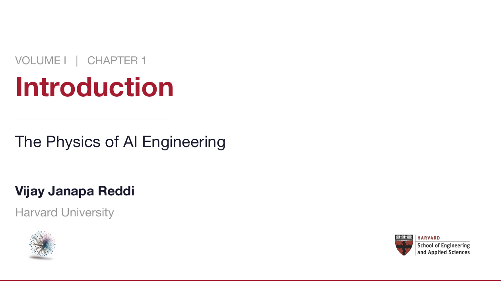
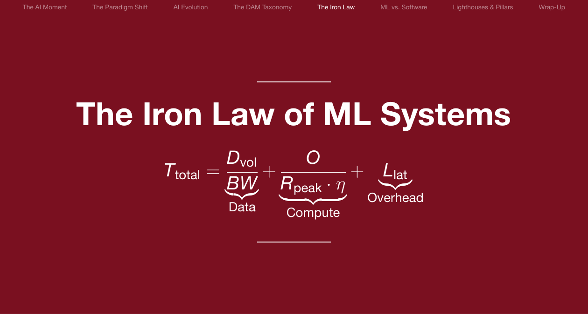
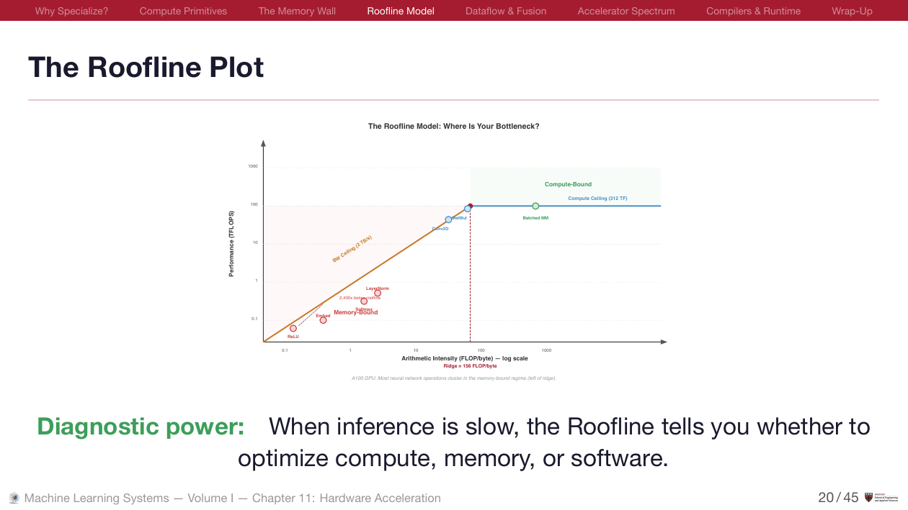
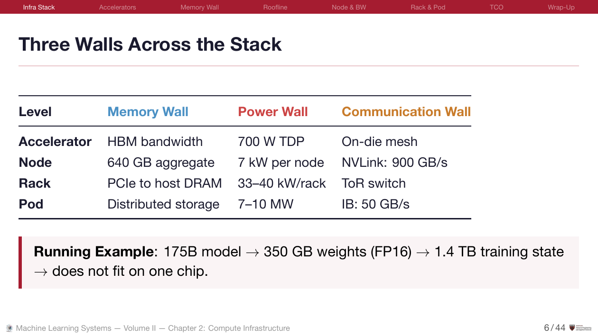
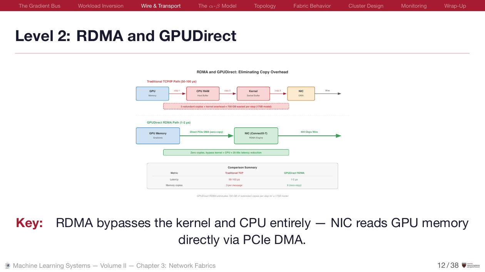
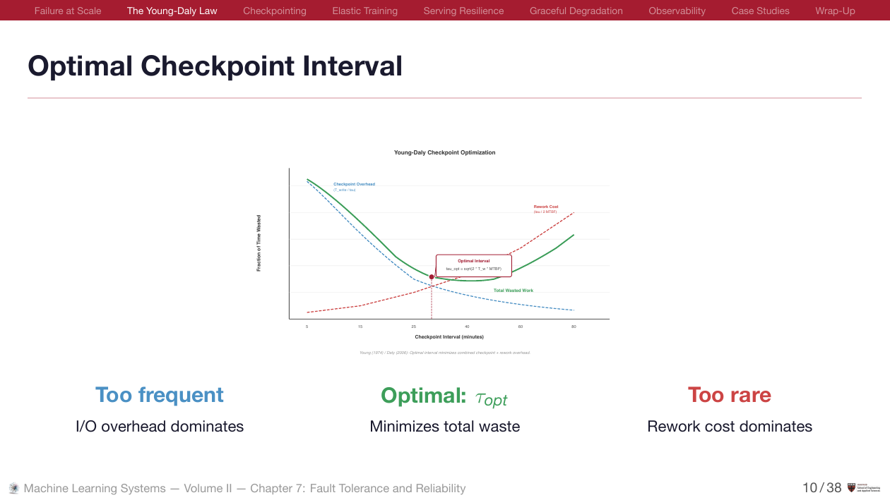
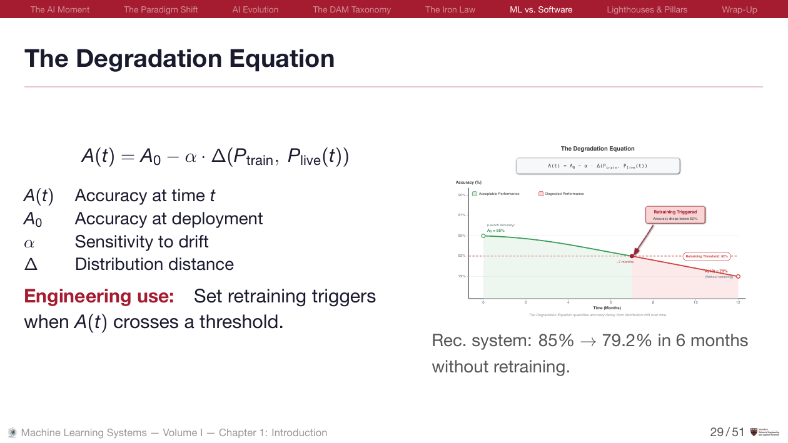

```{=html}
<style>
/* ── Stats Row ────────────────────────────────────────────────────── */
.stats-row {
  display: flex;
  gap: 2rem;
  flex-wrap: wrap;
  margin: 0.5rem 0 2rem;
  padding-bottom: 1.5rem;
  border-bottom: 1px solid #e2e8f0;
}
.stat {
  text-align: center;
}
.stat-num {
  font-size: 1.6rem;
  font-weight: 700;
  color: #BE185D;
  display: block;
  line-height: 1.2;
}
.stat-lbl {
  font-size: 0.75rem;
  color: #64748b;
  text-transform: uppercase;
  letter-spacing: 0.05em;
}

/* ── Action Buttons ───────────────────────────────────────────────── */
.action-row {
  display: flex;
  gap: 0.75rem;
  flex-wrap: wrap;
  margin-bottom: 2.5rem;
}
.action-row a {
  display: inline-block;
  padding: 0.5rem 1.2rem;
  border-radius: 7px;
  font-weight: 600;
  font-size: 0.88rem;
  text-decoration: none;
  transition: all 0.2s;
}
.btn-accent {
  background: #BE185D;
  color: white !important;
}
.btn-accent:hover { background: #db2777; }
.btn-outline {
  border: 1.5px solid #e2e8f0;
  color: #475569 !important;
}
.btn-outline:hover { border-color: #BE185D; color: #fff !important; background: #BE185D; }

/* ── Section Headers ──────────────────────────────────────────────── */
.section-header {
  font-size: 1.1rem;
  font-weight: 700;
  margin: 2.5rem 0 0.75rem;
  padding: 0.5rem 0.75rem;
  background: #fdf2f8;
  border-left: 4px solid #BE185D;
  border-radius: 0 6px 6px 0;
  color: #1a1a2e;
}

/* ── Volume Cards ─────────────────────────────────────────────────── */
.vol-grid {
  display: grid;
  grid-template-columns: repeat(auto-fit, minmax(340px, 1fr));
  gap: 1.25rem;
  margin: 1rem 0 0;
}
@media (max-width: 500px) {
  .vol-grid { grid-template-columns: 1fr; }
}
.vol-card {
  background: #ffffff;
  border: 1px solid #e2e8f0;
  border-radius: 10px;
  padding: 1.5rem;
  transition: all 0.2s;
  text-decoration: none !important;
  color: inherit !important;
  position: relative;
  overflow: hidden;
  display: block;
}
.vol-card:hover {
  border-color: #BE185D;
  box-shadow: 0 4px 16px rgba(190, 24, 93, 0.08);
}
.vol-card::before {
  content: '';
  position: absolute;
  top: 0; left: 0; width: 4px; height: 100%;
  background: #BE185D;
}
.vol-card .tag {
  font-size: 0.7rem;
  font-weight: 700;
  text-transform: uppercase;
  letter-spacing: 0.08em;
  color: #BE185D;
  margin-bottom: 0.25rem;
  display: block;
}
.vol-card h3 {
  font-size: 1.1rem;
  font-weight: 700;
  margin: 0 0 0.4rem 0;
  border: none !important;
  padding: 0 !important;
}
.vol-card p {
  font-size: 0.88rem;
  color: #5a6369;
  line-height: 1.45;
  margin-bottom: 0.5rem;
}
.vol-card .card-meta {
  font-size: 0.75rem;
  color: #94a3b8;
  border-top: 1px solid #f1f5f9;
  padding-top: 0.5rem;
  margin: 0;
}

/* ── Inventory Table ──────────────────────────────────────────────── */
.inv-table {
  width: 100%;
  border-collapse: collapse;
  margin: 0 0 0.5rem;
}
.inv-table td {
  padding: 0.6rem 0.75rem;
  border-bottom: 1px solid #f1f5f9;
  vertical-align: top;
  font-size: 0.9rem;
}
.inv-table td:first-child {
  width: 150px;
  font-weight: 600;
  color: #1a1a2e;
  white-space: nowrap;
}
.inv-table td:nth-child(2) {
  color: #4a5568;
}
.inv-table td:last-child {
  width: 100px;
  text-align: right;
}
.inv-table a {
  color: #BE185D !important;
  text-decoration: none;
  font-weight: 500;
  font-size: 0.82rem;
}
.inv-table a:hover { text-decoration: underline; }
.inv-table tr:hover { background: #fefbfc; }

/* ── Footer CTA ───────────────────────────────────────────────────── */
.footer-box {
  background: #fdf2f8;
  border: 1px solid #fce7f3;
  border-radius: 10px;
  padding: 1.5rem 2rem;
  text-align: center;
  margin-top: 2.5rem;
}
.footer-box h3 {
  font-size: 1.15rem;
  margin: 0 0 0.3rem;
  border: none !important;
  padding: 0 !important;
}
.footer-box p {
  color: #64748b;
  font-size: 0.9rem;
  margin: 0 0 1rem;
}
.coming-soon {
  display: inline-block;
  padding: 0.15rem 0.6rem;
  background: rgba(190, 24, 93, 0.1);
  color: #BE185D;
  border-radius: 20px;
  font-size: 0.7rem;
  font-weight: 600;
  vertical-align: middle;
}

/* ── Carousel Controls ───────────────────────────────────────────── */
#slideCarousel {
  position: relative;
}
#slideCarousel .carousel-control-prev,
#slideCarousel .carousel-control-next {
  width: 40px; height: 40px;
  top: 50%; transform: translateY(-50%);
  background: rgba(0,0,0,0.5);
  border-radius: 50%;
  opacity: 0.7;
  transition: opacity 0.2s;
}
#slideCarousel .carousel-control-prev { left: 8px; }
#slideCarousel .carousel-control-next { right: 8px; }
#slideCarousel .carousel-control-prev:hover,
#slideCarousel .carousel-control-next:hover { opacity: 1; }
#slideCarousel .carousel-control-prev-icon,
#slideCarousel .carousel-control-next-icon {
  width: 16px; height: 16px;
}
#slideCarousel .carousel-indicators {
  bottom: -8px;
}
#slideCarousel .carousel-indicators button {
  width: 8px; height: 8px;
  border-radius: 50%;
  background: #94a3b8;
  border: none;
  opacity: 0.5;
  margin: 0 4px;
}
#slideCarousel .carousel-indicators button.active {
  background: #BE185D;
  opacity: 1;
}
</style>

<!-- Stats -->
<div class="stats-row">
  <div class="stat"><span class="stat-num">35</span><span class="stat-lbl">Beamer Decks</span></div>
  <div class="stat"><span class="stat-num">178</span><span class="stat-lbl">TinyML Slides</span></div>
  <div class="stat"><span class="stat-num">3</span><span class="stat-lbl">Tracks</span></div>
  <div class="stat"><span class="stat-num">~38 hrs</span><span class="stat-lbl">Teaching Time</span></div>
  <div class="stat"><span class="stat-num">266</span><span class="stat-lbl">SVG Diagrams</span></div>
</div>

<!-- Slide Preview Carousel -->
<div id="slideCarousel" class="carousel slide mb-4" data-bs-ride="carousel" data-bs-interval="4000">
  <div class="carousel-inner" style="background: #1a1a2e; border: 1px solid #2a2a3e; border-radius: 10px; padding: 0.5rem;">
    <div class="carousel-item active">
      
      <p style="text-align:center; font-size: 0.8rem; color: #94a3b8; margin-top: 0.5rem;">Vol I · Ch 1: Title Slide — Custom Beamer Theme</p>
    </div>
    <div class="carousel-item">
      
      <p style="text-align:center; font-size: 0.8rem; color: #94a3b8; margin-top: 0.5rem;">Vol I · Ch 1: The Iron Law — Focus Slides for Key Equations</p>
    </div>
    <div class="carousel-item">
      
      <p style="text-align:center; font-size: 0.8rem; color: #94a3b8; margin-top: 0.5rem;">Vol I · Ch 11: The Roofline Model — Original SVG Diagrams</p>
    </div>
    <div class="carousel-item">
      
      <p style="text-align:center; font-size: 0.8rem; color: #94a3b8; margin-top: 0.5rem;">Vol II · Ch 2: Three Walls — Quantitative Systems Tables</p>
    </div>
    <div class="carousel-item">
      
      <p style="text-align:center; font-size: 0.8rem; color: #94a3b8; margin-top: 0.5rem;">Vol II · Ch 3: RDMA &amp; GPUDirect — Semantic Color Diagrams</p>
    </div>
    <div class="carousel-item">
      
      <p style="text-align:center; font-size: 0.8rem; color: #94a3b8; margin-top: 0.5rem;">Vol II · Ch 7: Optimal Checkpointing — Math + Visualization</p>
    </div>
    <div class="carousel-item">
      
      <p style="text-align:center; font-size: 0.8rem; color: #94a3b8; margin-top: 0.5rem;">Vol I · Ch 1: The Degradation Equation — Every Slide Has Speaker Notes</p>
    </div>
  </div>
  <button class="carousel-control-prev" type="button" data-bs-target="#slideCarousel" data-bs-slide="prev">
    <span class="carousel-control-prev-icon"></span>
  </button>
  <button class="carousel-control-next" type="button" data-bs-target="#slideCarousel" data-bs-slide="next">
    <span class="carousel-control-next-icon"></span>
  </button>
  <div class="carousel-indicators">
    <button type="button" data-bs-target="#slideCarousel" data-bs-slide-to="0" class="active"></button>
    <button type="button" data-bs-target="#slideCarousel" data-bs-slide-to="1"></button>
    <button type="button" data-bs-target="#slideCarousel" data-bs-slide-to="2"></button>
    <button type="button" data-bs-target="#slideCarousel" data-bs-slide-to="3"></button>
    <button type="button" data-bs-target="#slideCarousel" data-bs-slide-to="4"></button>
    <button type="button" data-bs-target="#slideCarousel" data-bs-slide-to="5"></button>
    <button type="button" data-bs-target="#slideCarousel" data-bs-slide-to="6"></button>
  </div>
</div>
<p style="text-align: center; font-size: 0.82rem; color: #64748b; margin-top: -0.5rem; margin-bottom: 1.5rem;">Preview of Beamer slides (Vol I &amp; II) — 7 of 1,099 shown. Every slide includes speaker notes and timing guidance.</p>

<!-- Actions -->
<div class="action-row">
  <a href="https://github.com/harvard-edge/cs249r_book/releases/tag/slides-latest" class="btn-accent" target="_blank">Download All (PDF + PPTX)</a>
  <a href="teaching.html" class="btn-outline">Teaching Guide</a>
  <a href="https://github.com/harvard-edge/cs249r_book/tree/dev/slides" class="btn-outline" target="_blank">View Source</a>
</div>

<!-- Volume Cards -->
<div class="section-header">Slide Decks</div>
<div class="vol-grid">
  <a href="vol1.html" class="vol-card">
    <span class="tag">Volume I</span>
    <h3>Introduction to Machine Learning Systems</h3>
    <p>17 decks covering the full single-machine ML stack: data engineering, neural computation, architectures, frameworks, training, compression, hardware, serving, and operations.</p>
    <div class="card-meta">570 slides · 141 SVGs · ~19 hrs · 145 active learning moments</div>
  </a>
  <a href="vol2.html" class="vol-card">
    <span class="tag">Volume II</span>
    <h3>Machine Learning Systems at Scale</h3>
    <p>18 decks covering distributed infrastructure: compute clusters, network fabrics, distributed training, fault tolerance, fleet orchestration, inference at scale, and governance.</p>
    <div class="card-meta">529 slides · 125 SVGs · ~19 hrs · 163 active learning moments</div>
  </a>
  <a href="tinyml.html" class="vol-card">
    <span class="tag">TinyML</span>
    <h3>Tiny Machine Learning</h3>
    <p>Complete edX courseware: ML fundamentals, keyword spotting, visual wake words, anomaly detection, embedded deployment on Arduino, and MLOps at scale.</p>
    <div class="card-meta">178 slide decks · 127 readings · 5 chapters · 4 courses</div>
  </a>
</div>

<!-- What's Included -->
<div class="section-header">What's Included</div>
<table class="inv-table">
  <tr>
    <td>Speaker Notes</td>
    <td>Every slide has timing estimates, teaching guidance, common student errors, and discussion prompts.</td>
    <td><a href="teaching.html">Guide &rarr;</a></td>
  </tr>
  <tr>
    <td>Active Learning</td>
    <td>5+ exercises per deck: predict, calculate, discuss, peer instruction, retrieval practice, muddiest point.</td>
    <td><a href="teaching.html#active-learning-1">Details &rarr;</a></td>
  </tr>
  <tr>
    <td>SVG Diagrams</td>
    <td>266 original vector diagrams with semantic colors. Editable source files — not locked images.</td>
    <td><a href="https://github.com/harvard-edge/cs249r_book/tree/dev/slides" target="_blank">Source &rarr;</a></td>
  </tr>
  <tr>
    <td>PowerPoint</td>
    <td>Every deck available as PPTX for presenter mode and annotations. Image-based (not editable).</td>
    <td><a href="https://github.com/harvard-edge/cs249r_book/releases/tag/slides-latest" target="_blank">Download &rarr;</a></td>
  </tr>
  <tr>
    <td>Beamer Source</td>
    <td>Full LaTeX source with custom theme. Fork, customize, rebuild with <code>make</code>.</td>
    <td><a href="teaching.html#customizing-the-slides">Customize &rarr;</a></td>
  </tr>
  <tr>
    <td>Semester Plans</td>
    <td>16-week schedules for Vol I, Vol II, a combined 32-week plan, and a 10–12 week TinyML syllabus.</td>
    <td><a href="teaching.html#suggested-semester-plans">Plans &rarr;</a></td>
  </tr>
</table>

<!-- Related Resources -->
<div class="section-header">Related Resources</div>
<table class="inv-table">
  <tr>
    <td>Textbook</td>
    <td>The slides are derived from this two-volume open textbook. Read online or download PDF.</td>
    <td><a href="https://mlsysbook.ai/vol1/">Vol I</a> · <a href="https://mlsysbook.ai/vol2/">Vol II</a></td>
  </tr>
  <tr>
    <td>Instructor Blueprint</td>
    <td>Syllabi, assessment rubrics, TA guide, and course customization — the full teaching toolkit.</td>
    <td><a href="https://mlsysbook.ai/instructors/">Blueprint &rarr;</a></td>
  </tr>
  <tr>
    <td>Interactive Labs</td>
    <td>33 browser-based labs powered by MLSys·im. Pair with slides for hands-on learning.</td>
    <td><a href="https://mlsysbook.ai/labs/">Labs &rarr;</a></td>
  </tr>
  <tr>
    <td>Hardware Kits</td>
    <td>Arduino, Raspberry Pi, and Seeed deployment labs for TinyML and edge AI.</td>
    <td><a href="https://mlsysbook.ai/kits/">Kits &rarr;</a></td>
  </tr>
</table>

<!-- Audio CTA -->
<div class="footer-box">
  <h3>Audio Lectures <span class="coming-soon">Coming Soon</span></h3>
  <p>AI-generated narration synchronized to each slide deck. Designed for self-paced learning and flipped classroom use.</p>
  <a href="teaching.html" class="btn-accent">Teaching Guide</a>
  <a href="https://github.com/harvard-edge/cs249r_book" class="btn-outline" target="_blank">GitHub</a>
</div>
```
