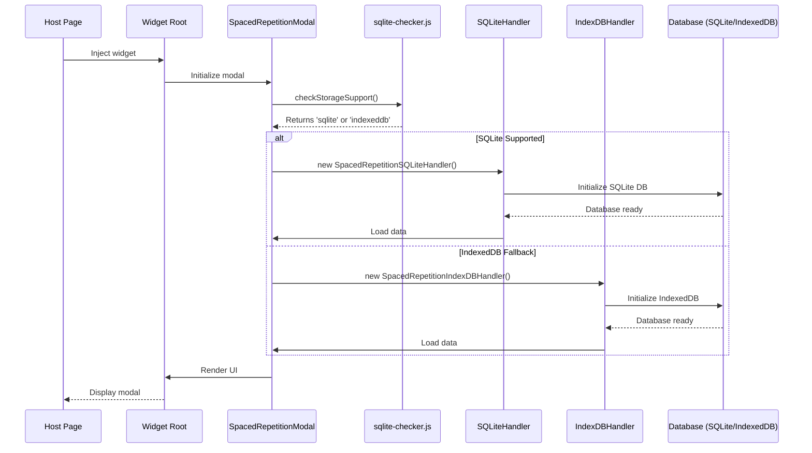
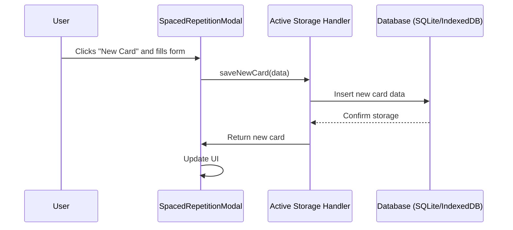

# Spaced Repetition System Architecture

## Overview

The Spaced Repetition System is a comprehensive flashcard management system built as a widget component that can be injected into any webpage. It provides AI-assisted card creation, intelligent review scheduling, and multiple storage backends for data persistence. The system prioritizes using a browser-based SQLite database (`sqlocal`) for performance and falls back to IndexedDB if SQLite is not available.

## System Architecture

```mermaid
graph TB
    subgraph "Widget Injection Layer"
        HostPage[Host Webpage]
        ShadowDOM[Shadow DOM Container]
        WidgetRoot[Widget Root Element]
    end
    
    subgraph "Spaced Repetition Core"
        Modal[SpacedRepetitionModal<br/>Main Orchestrator]
        
        subgraph "Storage Layer"
            style Storage Layer fill:#f9f9f9,stroke:#333,stroke-width:2px
            SQLiteHandler[SpacedRepetitionSQLiteHandler<br/>✅ PRIMARY]
            IndexDBHandler[SpacedRepetitionIndexDBHandler<br/>FALLBACK]
            BaseHandler[SpacedRepetitionStorageHandler<br/>Base Abstract Class]
        end
        
        subgraph "UI Handlers"
            EventHandler[SpacedRepetitionEventHandler]
            UIHandler[SpacedRepetitionUIHandler]
            InteractionHandler[SpacedRepetitionInteractionHandler]
            FloatingControls[FloatingControlsHandler]
            DeckCreation[DeckCreationHandler]
        end
        
        subgraph "Data Models"
            FlashCard[FlashCard Class<br/>Core Data Model]
            Chapter[Chapter Management]
            Tags[Tag System]
        end
        
        subgraph "Visualization"
            Stats[SpacedRepetitionStats<br/>Chart.js Analytics]
            Viz[SpacedRepetitionVisualization<br/>D3.js Visualizations]
        end
    end
    
    subgraph "Storage Backends"
        SQLite[(SQLite<br/>SQLocal)]
        IndexedDB[(IndexedDB<br/>SocratiqDB)]
    end
    
    subgraph "External Services"
        DuckAI[DuckAI Agent<br/>AI Card Generation]
        Cloudflare[Cloudflare Proxy]
    end
    
    %% Connections
    HostPage --> ShadowDOM
    ShadowDOM --> WidgetRoot
    WidgetRoot --> Modal
    
    Modal --> BaseHandler
    BaseHandler <|-- SQLiteHandler
    BaseHandler <|-- IndexDBHandler
    
    SQLiteHandler --> SQLite
    IndexDBHandler --> IndexedDB
    
    Modal --> EventHandler
    Modal --> UIHandler
    Modal --> InteractionHandler
    Modal --> FloatingControls
    Modal --> DeckCreation
    
    Modal --> FlashCard
    Modal --> Chapter
    Modal --> Tags
    
    Modal --> Stats
    Modal --> Viz
    
    InteractionHandler --> DuckAI
    DuckAI --> Cloudflare
    
    %% Styling
    classDef primary fill:#90EE90,stroke:#333,stroke-width:2px
    classDef fallback fill:#FFB6C1,stroke:#333,stroke-width:2px
    classDef storage fill:#87CEEB,stroke:#333,stroke-width:2px
    classDef external fill:#FFE4B5,stroke:#333,stroke-width:2px
    
    class SQLiteHandler,SQLite primary
    class IndexDBHandler,IndexedDB fallback
    class BaseHandler storage
    class DuckAI,Cloudflare external
```

## Core Components

### 1. Main Orchestrator (`spaced-repetition-modal-handler.js`)

**Purpose**: Central coordinator that manages the entire spaced repetition system.

**Key Responsibilities**:
- Creates and manages the modal UI.
- Initializes the appropriate storage handler (`SQLite` or `IndexedDB`) based on browser capabilities.
- Instantiates and coordinates all sub-handlers.
- Manages theme detection and styling.
- Handles flashcard rendering.
- Manages Ink MDE editors for card editing.
- Coordinates data flow between components.

**Key Methods**:
- `initializeStorage()`: Detects storage support and initializes the appropriate handler.
- `createModal()`: Builds the modal HTML with theme-aware styling.
- `saveNewCard()`: Handles the logic for saving a new card.
- `renderChapters()`: Renders the list of decks/chapters.

### 2. Storage Architecture

The storage layer is designed to be robust, with a primary high-performance backend and a fallback for wider compatibility.

#### Storage Handler Priority
1.  **`SpacedRepetitionSQLiteHandler` (Primary)**: Uses `sqlocal` to run SQLite in the browser. This is the preferred backend for its performance and powerful query capabilities.
2.  **`SpacedRepetitionIndexDBHandler` (Fallback)**: Used if SQLite is not supported by the browser. Provides a reliable NoSQL-based storage solution.

#### Base Handler (`storage-handler.js`)
**Purpose**: An abstract base class that defines the common interface for all storage handlers. It provides foundational functionality that is extended by the specific storage implementations.

**Key Features**:
- Defines the storage API contract (e.g., `saveToLocalStorage`, `getAllChapters`).
- Manages in-memory data structures for the current deck and tags.
- Provides a debounced save queue to batch write operations.

#### SQLite Handler (`storage-handler-sqlite.js`) ✅ **PRIMARY**
**Purpose**: The primary storage backend, using `sqlocal` to provide a relational database in the browser.

**Key Features**:
- Leverages WebAssembly (WASM) for high-performance database operations.
- Supports complex SQL queries, including JOINs and transactions.
- Persists data to the origin private file system for fast I/O.
- Handles database initialization and table creation.
- `createInitialDeck()` method now persists the introductory deck to the database.

#### IndexedDB Handler (`spaced-repetition-indexdb.js`) FALLBACK
**Purpose**: A fallback storage backend for browsers that do not support the APIs required for `sqlocal`.

**Key Features**:
- Uses the browser's native IndexedDB API.
- Provides an asynchronous, transactional NoSQL data store.
- Implements the same interface as the `SpacedRepetitionStorageHandler`.
- Ensures functionality across a wider range of browsers.

### 3. Data Models

#### FlashCard Class (`spaced-repetition.js`)
**Purpose**: The core data model representing an individual flashcard.

**Properties**:
```javascript
{
    id: string,                    // Unique identifier
    question: string,              // Card question
    answer: string,                // Card answer
    repetitions: number,           // Number of times reviewed
    easeFactor: number,            // Difficulty multiplier (2.5 default)
    interval: number,              // Days until next review
    nextReviewDate: Date,          // When to review next
    reviewHistory: Array,          // History of review ratings
    lastReviewQuality: number,     // Last review rating (0-5)
    tags: Array,                   // Associated tags
    chapter: number              // Parent chapter number
}
```

### 4. UI Handlers
The UI is managed by a set of dedicated handlers, each with a specific responsibility.

- **`SpacedRepetitionEventHandler`**: Manages user interactions, button clicks, and keyboard shortcuts.
- **`SpacedRepetitionUIHandler`**: Manages UI updates, such as the progress bar and tag lists.
- **`SpacedRepetitionInteractionHandler`**: Handles import/export functionality.
- **`FloatingControlsHandler`**: Manages the floating action buttons.
- **`DeckCreationHandler`**: Handles the UI and logic for creating new decks.
- **`SpacedRepetitionInitializationHandler`**: Manages the initial setup for first-time users, including the creation of the introductory deck.

## Data Flow

### 1. Initialization Flow
The system first checks for SQLite support and then initializes the appropriate storage handler.



### 2. New Card Flow


## Key Recent Changes

### Storage Layer Improvements (December 2024)
- **SQLite First**: The application now attempts to use `sqlocal` (SQLite) as the primary database and falls back to `IndexedDB` if it's not supported.
- **Fixed `t.exec` Error**: The `sqlite-checker.js` was updated to use the correct API for `sqlocal`, resolving a critical initialization error.
- **Initial Deck Creation**: The introductory deck and card are now correctly created and persisted to the database for first-time users.
- **Race Condition Fixed**: Removed a redundant, non-awaited call to `initializeStorage()` to prevent race conditions during initialization.

### SQLite Implementation Fixes (December 2024)
- **Transaction Management**: Fixed SQLite transaction handling by replacing `this.db.transaction()` calls with explicit `BEGIN TRANSACTION`/`COMMIT`/`ROLLBACK` statements.
- **Table Creation**: Ensured all required tables (`chapters`, `cards`, `card_tags`, `review_history`, `current_chapter`) are created during database initialization.
- **Method Implementation**: Added missing `createChapter()` and `addChapter()` methods to the SQLite handler.
- **Error Handling**: Improved error handling with proper fallback to IndexedDB when SQLite operations fail.
- **Scope Issues**: Fixed variable scope issues in catch blocks that were causing "sql is not defined" errors.

### UI/UX Improvements (December 2024)
- **Theme Management**: Centralized theme detection and application through `ThemeManager` class for consistent dark/light mode support.
- **Dynamic Styling**: KBD elements and deck buttons now dynamically adapt to theme changes.
- **Selected Deck Highlighting**: Improved selected deck button visibility in dark mode with better contrast and border styling.
- **Delete Functionality**: Added hover-activated trash can icons for deck deletion with browser confirm dialogs.
- **Deck Button Layout**: Improved deck button layout with card count on upper right and delete button on lower right.

### Storage Backend Details

#### SQLite Handler (`storage-handler-sqlite.js`)
**Database Schema**:
```sql
-- Chapters table
CREATE TABLE chapters (
    chapter INTEGER PRIMARY KEY,
    title TEXT NOT NULL,
    is_current BOOLEAN DEFAULT 0
);

-- Cards table
CREATE TABLE cards (
    id TEXT PRIMARY KEY,
    chapter INTEGER NOT NULL,
    question TEXT NOT NULL,
    answer TEXT NOT NULL,
    created TEXT NOT NULL,
    repetitions INTEGER DEFAULT 0,
    easeFactor REAL DEFAULT 2.5,
    interval INTEGER DEFAULT 0,
    nextReviewDate TEXT,
    lastReviewQuality INTEGER DEFAULT 0,
    FOREIGN KEY(chapter) REFERENCES chapters(chapter)
);

-- Card tags table
CREATE TABLE card_tags (
    card_id TEXT NOT NULL,
    tag TEXT NOT NULL,
    PRIMARY KEY (card_id, tag),
    FOREIGN KEY(card_id) REFERENCES cards(id)
);

-- Review history table
CREATE TABLE review_history (
    date TEXT PRIMARY KEY,
    count INTEGER DEFAULT 0
);

-- Current chapter tracking
CREATE TABLE current_chapter (
    id INTEGER PRIMARY KEY DEFAULT 1,
    chapter INTEGER,
    title TEXT,
    FOREIGN KEY(chapter) REFERENCES chapters(chapter)
);
```

**Key Methods**:
- `initializeDatabase()`: Creates SQLite database and all required tables
- `createChapter(chapterData)`: Creates a new chapter/deck
- `addChapter(chapterData)`: Alias for createChapter
- `saveToLocalStorage()`: Saves cards and chapters to SQLite
- `loadFromLocalStorage()`: Loads data from SQLite into memory
- `deleteChapter(chapterNum)`: Deletes a chapter and all its cards

**Transaction Management**:
- Uses explicit `BEGIN TRANSACTION`/`COMMIT`/`ROLLBACK` instead of `this.db.transaction()`
- Proper error handling with rollback on failures
- Automatic transaction management for individual operations

This updated architecture provides a more robust and performant system by prioritizing SQLite while maintaining broad browser compatibility through the IndexedDB fallback.
