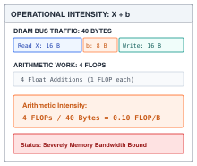
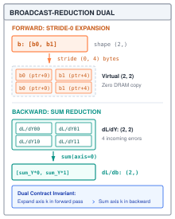
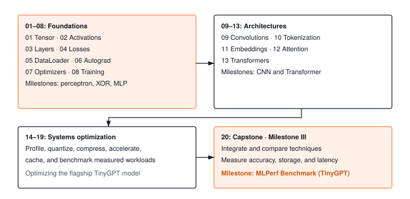

# Introduction {.unnumbered}

The modern era of artificial intelligence is defined by an explosion of excitement and capability. Models converse, write software, synthesize biomolecules, and reason across complex domains in real time. Yet beneath the headlines, demos, and billion-parameter benchmarks lies an unsung hero: the software glue that holds the entire machine learning ecosystem together. That glue is the **deep learning framework**.

In computing history, the compiler was the quintessential systems breakthrough. In the early days of computing, programmers manually wrestled with assembly instructions and machine registers until optimizing compilers arrived as the foundational bridge, transforming abstract human logic (expressions, control flow, and data structures) into the physical realities of processor execution pipelines. Today, the machine learning framework plays that exact historical role. It is the modern compiler and runtime operating system for artificial intelligence. It takes high-level mathematical intent, such as tensors, non-linear activations, dynamic computational graphs, and loss objectives, and bridges them directly to physical silicon: streaming through memory buses, fitting within cache hierarchies, saturating execution units, and coordinating parallel hardware accelerators. Without the framework, deep learning is merely blackboard mathematics; with it, mathematics becomes physical, scalable execution.

When a practitioner writes a standard training step:

```python
y = model(x)
loss = criterion(y, target)
loss.backward()
optimizer.step()
```

that deceptively simple syntax conceals a massive orchestration cascade. A layer retrieves persistent parameter tensors from memory, vector kernels dispatch floating-point arithmetic, an automatic differentiation tape records a dynamic directed acyclic graph (DAG), loss functions guard against IEEE 754 underflow, and an optimizer translates gradient vectors into parameter trajectory updates.

This book follows those execution paths through TinyTorch's reference implementation. The source defines what runs; the commentary explains why it is architected that way. In the tradition of classic systems commentaries, TinyTorch provides an open, self-contained reference framework where every layer, tape, and kernel can be inspected, traced, and executed on physical hardware.

---

## The Evolution of Frameworks: From Static Graphs to Modern Compilers

The software that powers deep learning has undergone relentless churn over the past two decades. Understanding how and why frameworks evolved illuminates why their inner architectures look the way they do today:

1. **The First Generation: Static Graphs and Declarative Engines (2007–2015).** Early frameworks, including Theano, Caffe, and early TensorFlow (v1.x with `tf.Session` and `sess.run()`), required developers to define the entire computational graph upfront before feeding a single byte of data. This "define-and-run" paradigm allowed the framework to optimize graph execution globally, fuse operations, and plan static memory reuse before runtime. However, it came at a catastrophic cost to developer ergonomics: debugging required inspecting symbolic placeholder nodes rather than concrete values, standard Python `if` statements and `for` loops could not be used inside graphs, and runtime errors pointed to impenetrable C++ engine traces rather than the user's Python lines.

2. **The Second Generation: Dynamic Graphs and Eager Execution (2015–2020).** Chainer pioneered, and PyTorch popularized, the "define-by-run" revolution. In eager execution, tensors are standard Python objects, operations execute immediately upon invocation, and a dynamic **autograd tape** records the graph on the fly as data flows forward. Developers could set standard Python breakpoints (`pdb`), use native Python control flow, print intermediate tensor shapes, and rapidly prototype dynamic architectures like recurrent networks and tree-LSTMs. The developer experience was transformative, and eager execution quickly captured the global machine learning research community.

3. **The Third Generation: The Compiler Convergence (2020–Present).** Yet eager execution introduced a severe systems penalty: dispatching thousands of micro-operations one by one from Python saturates the CPU, prevents inter-operator fusion, and drowns the hardware memory bus in temporary memory allocations. Modern frameworks (such as JAX with functional transformations and XLA, along with PyTorch 2.0 with `torch.compile`, TorchDynamo, and Triton) have converged on a synthesis: **eager developer ergonomics backed by whole-program just-in-time compilation**. The runtime captures Python execution into an **Intermediate Representation (IR)** graph, analyzes data dependencies across operator boundaries, fuses memory-bound kernels, and generates optimized machine code for physical accelerators.

### The Universal Invariants Beneath the Churn

Libraries, syntax, and APIs will inevitably continue to change. Over the past fifteen years, frameworks have risen to dominance only to be superseded: Torch yielded to Caffe; Caffe yielded to TensorFlow; TensorFlow yielded to PyTorch; and JAX, Mojo, and specialized MLIR compilers continue to push the boundaries of systems performance.

Yet beneath all of this churn, **every deep learning framework that has ever been built relies on the exact same five foundational systems pillars**:

1. **Strided Memory Layouts:** How contiguous bytes in physical DRAM or high-bandwidth memory (HBM) are indexed via dimension shapes, strides, and offsets without copying.

2. **Parallel Execution and Kernel Dispatch:** How mathematical operations (GEMM, convolutions, activations) lower into vectorized hardware instructions and contract inner dimensions across cache hierarchies.

3. **Reverse-Mode Automatic Differentiation:** How a directed acyclic graph (DAG) of dependencies records operations and traverses backward to evaluate the chain rule and accumulate parameter sensitivities.

4. **Stateful Parameter Lifecycle and Optimization:** How persistent weights are distinguished from ephemeral activations, discovered across container hierarchies, and updated along loss trajectories via momentum and adaptive moments.

5. **Memory Lifecycle and Caching Architecture:** How memory allocation overhead, cache line reuse (such as Key-Value context caching), buffer lifetimes, and IEEE 754 numerical stability conquer the physical memory wall.

If you only learn a specific framework's high-level API by memorizing the parameters of `torch.nn.Linear` or `tf.keras.layers.Dense`, your knowledge becomes obsolete with the next industry transition. But if you master the **five structural pillars** that govern the runtime underneath, you understand every framework that has ever existed, and you possess the mental blueprint required to engineer the frameworks of the future.

This is the purpose of **TinyTorch**. Rather than forcing you to wade through millions of lines of C++ template metaprogramming, device drivers, and vendor-specific wrappers, TinyTorch isolates these five universal pillars in their purest, most transparent executable form.

---

## How a Framework Engineer Thinks: From Concept to Execution

To understand that engine, we must shift our perspective. A machine learning practitioner looks at a script and asks: *Is the loss decreasing, and is the model converging?* A framework engineer looks at the exact same script and asks: *Where was that memory buffer allocated? Is this tensor contiguous in memory, or will non-contiguous strides force an expensive clone before kernel dispatch? Is Python interpreter dispatch overhead dominating the actual hardware execution time? Did this operation return a zero-copy strided view or allocate a fresh array? Can this operation safely mutate a buffer in place without corrupting saved values on the autograd tape? Does the autograd tape retain unnecessary intermediate tensors in memory? Will broadcasting across the batch dimension require an accumulation reduction in the backward pass?*

Framework engineering is the discipline of **invariants**: the non-negotiable physical and mathematical contracts governing tensor shapes, memory strides, buffer lifetimes, and numerical precision that ensure execution is both bit-accurate and hardware-efficient.

Instead of abstract math, we trace physical bytes streaming through silicon. To see how a framework engineer approaches an operation, consider a concrete micro-trace: adding a bias vector to a mini-batch of activations.

In logical coordinates, an activation matrix $X$ has shape `(2, 2)` with values `[[1.0, 2.0], [3.0, 4.0]]`, and a bias vector $b$ has shape `(2,)` with values `[10.0, 20.0]`. In physical hardware, DRAM knows nothing of 2D grids; it is a flat, 1D address space:
- Activation tensor $X$ occupies a contiguous 16-byte buffer: four 32-bit floats at byte offsets `0x00`, `0x04`, `0x08`, and `0x0C`, with row-major strides of `(8, 4)` bytes.
- Bias vector $b$ occupies an 8-byte buffer: two 32-bit floats at byte offsets `0x00` and `0x04`, with stride `(4,)` bytes.

When $X + b$ executes, how does the hardware evaluate the broadcast across both rows without duplicating the bias in DRAM? The framework constructs a zero-stride view with logical strides `(0, 4)` bytes. Iterating down the row axis adds zero bytes to the bias memory pointer. The CPU execution units fetch the identical 8 bytes directly from L1 data cache for each row: zero extra bytes allocated, zero memory bus waste.

Now calculate the physical memory traffic:
- Read activations: 16 bytes streamed from DRAM.
- Read bias: 8 bytes read once and retained in L1 cache.
- Write output: 16 bytes written back to DRAM.
- Total memory traffic: 40 bytes transferred across the memory bus.
- Arithmetic computation: 4 floating-point additions (4 FLOPs).

The operational intensity is $4 \text{ FLOPs} / 40 \text{ bytes} = 0.1 \text{ FLOPs/byte}$. On hardware capable of 100 GFLOPs per second but constrained by 20 GB/s memory bandwidth, this operation runs at a tiny fraction of peak execution speed: it is hopelessly memory bandwidth bound. This is how a framework engineer reads code: not just checking that the output matches `[[11.0, 22.0], [13.0, 24.0]]`, but tracking the bytes, calculating the operational intensity, and auditing the memory bus.

::: {.column-margin}
{width="100%" fig-alt="Operational intensity micro-trace for matrix-bias addition: 40 bytes of DRAM bus traffic versus 4 floating-point operations yields 0.10 FLOPs per byte, illustrating memory bandwidth starvation."}

*Operational intensity micro-trace: 4 FLOPs over 40 DRAM bytes yields 0.1 FLOPs/byte, placing simple tensor addition deep inside the memory-bound regime.*
:::

In Module 01, `Tensor.__add__` passes the operands to `Add.apply`. The inherited `Function.apply` extracts their NumPy arrays, calls the operation's `forward` method, and wraps the returned array in a new Tensor. NumPy performs the broadcast addition, reusing the bias across the rows without requiring us to repeat it in the input. Neither operand changes; the result has its own storage. Following these calls separates the public expression from the mechanism that computes it, without requiring the rest of the Tensor class to be understood at once.

The caller can therefore rely on three facts: the values are the rowwise sums, the output shape is `(2, 2)`, and the inputs remain unchanged. Such a property that must remain true is an *invariant*. A useful reading order makes these obligations explicit:

::: {#chk-welcome-execution-path .callout-checkpoint title="Checkpoint: Following an execution path"}

1. **Find entry point**: Find the entry point and its caller. Record the input shapes and the result the caller expects.
2. **Follow values**: Follow the values and state through the calls that serve this example. Distinguish a returned value from a mutation of an existing object.
3. **State the invariant**: State the invariant that must hold when the call returns, such as a matching shape or an unchanged parameter.
4. **Trace a small input**: Trace a small input by hand, then compare it with the code and its tests. Change one assumption to expose the boundary of the contract.
5. **Compare cost**: Once the mechanism is clear, identify its cost and compare it with the alternative in the production bridge. Check which costs the implementation measures and which it estimates.

:::

The source is organized to support more than the current example. Module 01 contains fields reserved for gradients, but they need not be understood to follow addition. Module 06 extends operation dispatch to record the graph needed for differentiation. Deferring those fields is a reading strategy: the forward computation provides a stable starting point for the later explanation of learning.

### Contracts Across Module Boundaries: The Broadcast-Reduction Invariant

The bias example also illustrates a fundamental systems principle: every operation establishes a contract that downstream execution depends on.

In forward execution, broadcasting expands the bias from shape `(2,)` to `(2, 2)` by projecting virtual strides across the batch dimension. But notice the downstream obligation this creates: parameters in physical memory have fixed shapes. The bias buffer contains exactly two numbers. When the framework eventually traverses backward during learning to update parameters, it encounters four error contributions (one for each element in the output grid). If the framework failed to sum those contributions back across the broadcast dimension, it would attempt to update a 2-element parameter with a 4-element tensor, corrupting memory.

This is the **Broadcast-Reduction Dual Invariant**: *any forward operation that expands a dimension through broadcasting incurs a strict contract to reduce that dimension through summation during the backward pass.*

::: {.column-margin}
{width="100%" fig-alt="The Broadcast-Reduction Dual Invariant: forward pass expands parameter b with stride (0, 4) to shape (2, 2) without copying; backward pass sums incoming (2, 2) gradients along axis 0 back to shape (2,) to match physical buffer storage."}

*The Broadcast-Reduction Dual Invariant: Expanding a dimension forward via stride 0 requires summing along that dimension in reverse-mode autograd to preserve physical parameter shape.*
:::

We defer the mathematical mechanics of automatic differentiation until Module 06. However, the architectural lesson applies on Day 1: a framework operation cannot be designed in isolation. It must be engineered to honor the contracts of its consumers, preserving shapes, strides, and memory invariants across the entire pipeline.

---

## Progressive Disclosure

A tensor addition can be studied before a trainable model exists. The first part therefore develops forward computation before deriving its reverse traversal and connecting gradients to updates. The next part reuses that training machinery for images and sequences. Measurement and optimization follow a working baseline, so a proposed improvement has something concrete to preserve and compare against.

The source sometimes contains supporting fields or hooks needed by a later module. The commentary identifies the path needed now and returns to those hooks when their role can be explained. Production comparisons follow the local mechanism; they are not prerequisites for running it.

The roadmap in @tbl-pedagogical-roadmap names what each chapter builds and the question it answers. Modules 01 through 20 use the source directory with the matching two-digit prefix under `tinytorch/src/`, such as `01_tensor/` for @sec-tensors and `18_memoization/` for @sec-memoization. Syntheses I, II, and III integrate modules 01–08, 09–13, and 14–20, respectively; @sec-extensions adds no source module.

| Chapter | What you build | The question it answers |
| :--- | :--- | :--- |
| **01. Tensors** | A NumPy-backed array wrapper with shape operations | How do tensor operations preserve values and shapes, and where are arrays copied? |
| **02. Activations** | The nonlinear functions (ReLU, sigmoid, GELU) applied between layers | Why does a stack of linear layers collapse into one, and what prevents the collapse? |
| **03. Layers** | Linear layers with weights and biases, plus dropout | How are parameters organized and initialized, and what changes between training and inference? |
| **04. Losses** | Cross-entropy and its relatives, computed without overflow | How do predictions become one number to minimize, without floating point blowing up? |
| **05. DataLoader** | Datasets, per-epoch shuffling, and collating samples into batches | How do separate samples become a stream of batches, and why does the order matter? |
| **06. Autograd** | Reverse-mode automatic differentiation on a recorded tape | What does `loss.backward()` actually do? |
| **07. Optimizers** | Gradient descent with momentum, and AdamW | Why is plain gradient descent slow, and what do adaptive optimizers change? |
| **08. Training Loop** | The zero, forward, loss, backward, step loop, with clipping and schedules | When must gradients be cleared, computed, and applied to parameters? |
| **Synthesis I** | XOR and handwritten digits, learned by an MLP (Milestones 01–03) | Can the components learn a nonlinear decision rule and classify small images? |
| **09. Convolutions** | Two-dimensional convolution and pooling with explicit loops | How do local windows share weights and accumulate gradients? |
| **10. Tokenization** | Byte-pair encoding, which turns text into integer tokens | How does text become numbers, and why subwords rather than characters or words? |
| **11. Embeddings** | Lookup tables from token IDs to vectors, plus position encodings | How does an integer token become something a network can learn from, and how does the model know word order? |
| **12. Attention** | Scaled dot-product attention with a causal mask | How does each token decide which earlier tokens to look at? |
| **13. Transformers** | The GPT-2 style block, stacked into a model | How do attention, feed-forward layers, normalization, and residual connections fit together? |
| **Synthesis II** | CNNs and a generative language model trained and sampled from (Milestones 04–05) | Does each architecture earn its place against a baseline, and can the transformer generate text? |
| **14. Profiling** | Timing and counting tools, and the roofline model | Where does the time go, and is an operation limited by arithmetic or by memory? |
| **15. Quantization** | Integer-code quantization and float32 reconstruction | How does rounding change values, and which storage savings are simulated? |
| **16. Compression** | Pruning, low-rank factorization, and distillation | How do you shrink a model, and what accuracy does each method cost? |
| **17. Acceleration** | Fusion and tiling experiments in NumPy | Which overheads change when operations are combined, and which remain? |
| **18. The KV Cache** | Caching attention keys and values during generation | Which earlier computations can generation reuse, and what work still grows with context? |
| **19. Benchmarking** | Measurement discipline: warmup, repetition, and percentiles | How do you measure a speedup you can trust? |
| **20. The Capstone** | An evaluation harness for optimization experiments | Do individual improvements survive composition and measurement? |
| **Synthesis III** | The MLPerf Optimization Olympics: accuracy, memory, and latency measured together, with the Pareto frontier computed from them (Milestone 06) | Did the optimizations pay off on all three axes at once? |
| **21. Extensions** | Custom C++, Metal, and Triton kernels, timed against your Module 17 kernels in Milestone 07 | What does leaving NumPy gain, and what does it cost? |

: **The TinyTorch Roadmap**: Modules 01 through 20 map to source directories under `tinytorch/src/`; synthesis chapters integrate earlier modules, and @sec-extensions measures the optional hardware extensions. {#tbl-pedagogical-roadmap tbl-colwidths="[22,36,42]"}

The roadmap is also a dependency guide. The optimization chapters require a working model and a measurement method; the architecture chapters require tensor operations and a training loop. A synthesis chapter tests the handoff between those pieces, rather than introducing another independent abstraction.

### Reading Flows and Evidence of Understanding

The framework develops across six interconnected execution flows. Each flow begins with a concrete computation and finishes with a contract that the next flow can rely upon. @tbl-reading-flows summarizes the path to trace through each flow and the concrete evidence that demonstrates mastery.

| Flow | Modules | Execution path to follow | Evidence of understanding |
| :--- | :--- | :--- | :--- |
| **Forward computation** | @sec-tensors through @sec-dataloader | Tensor operation $\to$ activation $\to$ layer $\to$ loss, with batches supplied by a dataset and loader | Trace values and shapes; distinguish parameters from activations and array storage from Tensor wrappers. |
| **Learning** | @sec-autograd through @sec-training, [Synthesis I](synthesis_01.qmd#sec-milestone-1) | Recorded operation $\to$ backward traversal $\to$ parameter gradients $\to$ optimizer update | Explain broadcast reduction, graph lifetime, gradient accumulation, and normalization by the actual sample count. |
| **Vision** | @sec-convolutions | Image batch $\to$ convolution $\to$ pooling and normalization $\to$ loss | Trace one window and the contributions to its gradients; explain shared parameters and receptive fields. |
| **Language** | @sec-tokenization through @sec-transformers, [Synthesis II](synthesis_02.qmd#sec-milestone-2) | Text $\to$ token IDs $\to$ embeddings $\to$ attention $\to$ transformer outputs | Keep token, batch, head, and feature axes distinct; trace a causal attention computation before generation. |
| **Measurement & optimization** | @sec-profiling through @sec-acceleration | Baseline measurement $\to$ one transformation $\to$ correctness comparison $\to$ measurement | Separate elapsed time from analytical counts; distinguish an algorithmic demonstration from changed physical execution. |
| **Reuse & evaluation** | @sec-memoization through @sec-extensions, [Synthesis III](synthesis_03.qmd#sec-milestone-3) | Cache update $\to$ cached attention $\to$ controlled comparison $\to$ integrated evaluation | Identify cached state, reset, and capacity behavior; explain remaining context work and verify metrics. |

: **The Six Reading Flows of TinyTorch**: Execution paths to follow and the concrete evidence of understanding expected at each synthesis milestone. {#tbl-reading-flows tbl-colwidths="[20,24,28,28]"}

---

## What TinyTorch Is

TinyTorch has twenty source modules under `tinytorch/src/`, corresponding to Modules 01 through 20. Each source file combines executable Python with notebook prose, solution markers, inline tests, and demonstrations. Generated notebooks live under `modules/`; exported library code lives under the nested `tinytorch/` package. Changes to the instructor reference belong in `src/`, from which these other forms are rebuilt.

A TinyTorch Tensor wraps a NumPy array. NumPy performs elementwise arithmetic, matrix multiplication, and reductions; TinyTorch supplies the framework logic around those operations. The constructor creates float32 array storage. Consequently, a NumPy operation that can return a view does not establish that the enclosing Tensor operation is a zero-copy view. The tensor chapter follows the actual constructor and operation path to make that boundary visible.

{#fig-physical-stack width="100%" fig-alt="The physical execution stack showing CPython object metadata, NumPy C float32 buffer, OS virtual page translation, and CPU cache hierarchy down to physical DRAM."}

The book's registered code listings are extracted from source symbols. The extraction removes notebook and exercise scaffolding so the commentary can discuss a function without reproducing an assignment cell in full. Small illustrative examples and worked traces accompany these listings. The source remains the authority for the complete implementation, including validation and tests outside the displayed excerpt.

The modules and the book are organized in four parts, summarized in @tbl-architectural-tiers.

| Part | Chapters | What it covers |
| :--- | :--- | :--- |
| **Part I: The Core Engine** | 1 to 8, Synthesis I | Tensors, activations, layers, losses, data loading, automatic differentiation, optimizers, and the training loop. Everything needed to train a neural network from scratch. |
| **Part II: Deep Architectures** | 9 to 13, Synthesis II | Convolutions for images. Tokenization, embeddings, attention, and the transformer block for text, culminating in training TinyGPT from scratch. |
| **Part III: Systems and Acceleration** | 14 to 20, Synthesis III | Measuring where time goes, then testing ways to reduce it: quantization, compression, operator fusion, the KV cache, and honest benchmarking in the MLPerf capstone. |
| **Part IV: Extensions** | 21 | What compiled kernels and GPUs gain over NumPy, measured, and what they cost. |

: **The Four Parts of TinyTorch**: The core engine supports architectures, optimization experiments, and a final production comparison. {#tbl-architectural-tiers tbl-colwidths="[26,20,54]"}

@Fig-framework-roadmap follows the twenty source modules through their integration in the capstone. Its last two boxes subdivide Part III; the production comparisons in Part IV add no source module. The six milestone labels name historical workloads in the code repository, which the book groups into three synthesis chapters; a seventh milestone, custom kernels, accompanies @sec-extensions.

{#fig-framework-roadmap width="100%" fig-alt="Module sequence from 01–08 foundations to 09–13 architectures, then 14–19 optimization experiments and the module 20 capstone."}

### TinyGPT: The Flagship Workload and Dual Pathways

A systems curriculum requires an application workload demanding enough to stress every layer of the software runtime. A simple feedforward classifier on synthetic points can verify that backpropagation computes correct numerical derivatives, but it cannot expose the physical memory wall. A small two-layer network fits entirely inside a CPU's L1 cache; it experiences no memory-bandwidth starvation, requires no sequence-length scaling, and exercises no dynamic state reuse.

For this reason, **TinyGPT serves as the flagship workload of the entire curriculum**.

While TinyGPT is our premier vehicle because its sequence length and attention mechanism push the hardware memory hierarchy to its absolute limits, the systems principles you master are universal. The exact same profiling, INT8 quantization, pruning, kernel lowering (such as `im2col` spatial GEMM expansion), and operator fusion techniques apply directly to computer vision models like LeNet CNNs and dense edge networks. In the capstone Optimization Olympics, you evaluate all three workload classes side by side.

The curriculum is structured around a deliberate two-stage arc:

1. **The First Half (Modules 01–13): Building and Training TinyGPT.**
   You do not have to wait until the end of the book to experience generative AI. In Part I (Modules 01–08), you build the core execution engine: strided tensor storage, activations, parameter containers, losses, mini-batch loaders, reverse-mode autograd, and AdamW. In Part II (Modules 09–13), you construct tokenization, embeddings, multi-head causal attention, and stacked transformer blocks. By **Module 13 and Synthesis II**, you train TinyGPT from scratch on Shakespeare and watch it generate coherent text one token at a time. The working generative model arrives right at the midpoint of your journey.

2. **The Second Half (Modules 14–20): Accelerating TinyGPT and Vision.**
   Once you have models generating predictions and text, you face the reality of production machine learning systems: naive models are slow, memory-bound, and wasteful. In standard autoregressive sampling, every new token recomputes attention across the entire preceding context, creating an $O(S^2)$ memory-traffic catastrophe. Part III subjects your models to systematic systems performance engineering:
   - Profiling Roofline memory walls across linear, convolutional, and attention layers (Module 14)
   - Quantizing projection weights to INT8 (Module 15)
   - Pruning redundant weights and low-rank factorization (Module 16)
   - Fusing memory-bound operations and lowering convolutions to GEMM (Module 17)
   - Eliminating prefix recomputation with a Key-Value cache (Module 18)
   - Benchmarking under MLPerf discipline in the Optimization Olympics (Modules 19–20, Synthesis III)

#### Dual Pathways and the Two-Semester Curriculum

This two-stage architecture enables two distinct, fully supported learning pathways through the book, which naturally map to a two-semester academic sequence:

- **Pathway 1 / Semester 1: Building Generative AI from Scratch (Modules 01 to 13).**
  Starting from first principles, you build every layer of the stack from raw array memory up to a generative language model. This track is designed for students and practitioners who want complete, end-to-end mastery of how deep learning software functions. The semester culminates in Milestone 05: training TinyGPT on Shakespeare, generating Python source code with TinyCopilot under compiler gates, and closing the generative autoregressive loop.

- **Pathway 2 / Semester 2: Deep Learning Systems and Acceleration (Modules 14 to 20 and @sec-extensions).**
  Systems programmers, compiler engineers, and hardware architects who already understand deep learning mathematics often want to focus exclusively on systems performance: cache dynamics, memory bandwidth saturation, quantization arithmetic, kernel fusion, and inference serving. Because TinyTorch provides pre-exported, validated reference libraries (`tinytorch.core` and `tinytorch.models.transformer`), readers on this track can take our out-of-the-box reference TinyGPT and CNN models and jump directly into Module 14. You immediately begin profiling memory bottlenecks, quantizing tensors, and building KV caches without needing to code earlier layers by hand. The semester culminates in Milestone 06: competing in the MLPerf Optimization Olympics across dense, vision, and generative LLM serving divisions.

### The Milestone Progression: Recreating Deep Learning History

Alongside the modular chapters, the repository provides seven executable milestone workloads via the Tito CLI (`tito milestone run 01` through `07`); the seventh, custom kernels, belongs to @sec-extensions. Each milestone recreates a pivotal historical breakthrough using exclusively the code you have built up to that point. @Tbl-milestones-curriculum details the progression, the required modules, and how the repository workloads map to the book's three synthesis chapters.

| Milestone ID | Historical Era | Required Modules | Core Investigation | Book Synthesis Chapter |
| :--- | :--- | :--- | :--- | :--- |
| **01** | **The Perceptron (1958)** | 01–03 | Forward pass with random weights on linearly separable data; demonstrates that without training the decision boundary, and so the accuracy, is left to chance. | Synthesis I ([Synthesis I](synthesis_01.qmd#sec-milestone-1), Part 1) |
| **02** | **The XOR Crisis (1969)** | 01–03 | Minsky and Papert's linear separability proof; proves that no single-layer hyperplane can separate XOR coordinates. | Synthesis I ([Synthesis I](synthesis_01.qmd#sec-milestone-1), Part 2) |
| **03** | **The MLP Revival (1986)** | 01–07 | Rumelhart et al.'s backpropagation; hidden units fold the plane to solve XOR with 100% accuracy and scale to TinyDigits. | Synthesis I ([Synthesis I](synthesis_01.qmd#sec-milestone-1), Part 3) |
| **04** | **The CNN Revolution (1998)** | 01–07, 09 | LeNet spatial parameter sharing and pooling; evaluates parameter count reduction versus loop arithmetic on images. | Synthesis II ([Synthesis II](synthesis_02.qmd#sec-milestone-2), Part 1) |
| **05** | **The Transformer Era (2017–2020)** | 01–08, 10–13 | Vaswani et al. (2017) and Brown et al. (GPT-3, 2020); trains TinyGPT on Shakespeare, validates sequence routing, trains TinyCopilot on Python code with AST compiler gating, and investigates conversational overfitting. | Synthesis II ([Synthesis II](synthesis_02.qmd#sec-milestone-2), Part 2) |
| **06** | **MLPerf to ChatGPT Serving (2018–Present)** | 01–04, 06, 07, 09, 11–19 | Systems benchmarking from MLPerf discipline (Reddi et al., 2018) to modern production LLM serving (ChatGPT, 2022); measures TinyGPT, CNNs, and MLPs under KV-caching and INT8 quantization and reports the Pareto frontier computed from those measurements. | [Synthesis III](synthesis_03.qmd#sec-milestone-3) |

: **The Six Historical Milestones of TinyTorch**: Chronological breakthroughs in machine learning history, executed via `tito milestone run 01` through `06` (Milestone 07, custom kernels, accompanies @sec-extensions), and their alignment with the book's three synthesis chapters. {#tbl-milestones-curriculum tbl-colwidths="[12,18,16,36,18]"}

### Implementation Boundaries to Preserve

TinyTorch serves as an *executable architectural specification* rather than a competitor to multi-million-line production runtimes. To keep the framework inspectable, we maintain deliberate pedagogical firewalls:

- **NumPy storage vs. zero-copy views**: TinyTorch's `Tensor` constructor creates float32 NumPy array storage. A NumPy view inside an operation does not imply that the returned `Tensor` shares that storage without copying.
- **Synchronous single-thread loading**: The reference `DataLoader` forms batches synchronously. Multiprocess worker queues, asynchronous prefetching, pinned host memory, and non-blocking device transfers belong to the production bridge.
- **In-memory micro-datasets vs. distributed streaming corpora**: TinyTorch bundles curated, closed-world micro-datasets (such as TinyDigits, TinyPy, and TinyShakespeare) under 450 KB directly in the repository. This guarantees that training epochs complete in seconds on a single CPU core and intermediate activations fit on a single terminal screen for debugging. Multi-gigabyte web crawls, distributed sharding, and remote cloud object stores belong to production data engines.
- **Explicit convolution loops**: Reference convolution exposes sliding-window spatial loops to make weight sharing and receptive fields transparent. Vectorized `im2col` GEMM expansions and Winograd kernels are discussed as systems alternatives.
- **Simulated INT8 quantization**: Quantization demonstrates integer codes, dynamic scale factors, and zero-point alignment while retaining float32 containers, isolating numerical mechanics before discussing bit-level hardware packing.
- **Compression and distillation**: Knowledge distillation combines differentiable student loss with frozen teacher logits. Low-rank factorization illustrates parameter efficiency without conflating it with a full LoRA serving harness.
- **Algorithmic fusion vs. hardware SRAM residency**: NumPy operator fusion experiments demonstrate intermediate memory traffic reductions. They do not claim physical GPU register residency or compiler kernel generation.
- **Static KV cache allocation**: The Key-Value cache preallocates memory up to a maximum context window and advances a write head. It is not an elastic ring buffer or paged virtual memory manager.
- **Honest benchmarking**: Measurement discipline separates cold-start warmup effects from steady-state percentiles. Microbenchmark speedups do not automatically compose into end-to-end workload speedups.

---

## How Each Chapter Is Organized

Every chapter in TinyTorch follows a deliberate **Hourglass Architecture**:

1. **The Problem (The ML "Why")**: We motivate why the mathematical operation or physical necessity arises in deep learning before writing code.
2. **The Idea (Systems Invariants)**: We establish representations, data structures, shapes, memory layouts, and correctness contracts.
3. **The Code**: At the narrowest point of the hourglass, we inspect the exact source implementation, extracted from the repository at build time so it cannot drift from what you run.
4. **A Worked Trace**: We follow a small, hand-verifiable numerical example through that code, so you can check your understanding against real values rather than against a description of them.
5. **From TinyTorch to Production**: We expand wide again, examining how production engines (PyTorch ATen, cuDNN, CUTLASS, Triton, vLLM) scale the concept across distributed clusters and specialized silicon.

The chapter summary establishes what later chapters rely on, followed by further reading pointing to the original foundational papers.

### Navigating the Text: Signposts and Callouts

Because systems engineering relies on progressive disclosure, the margins contain continuous cross-referencing signposts:

- ↩ **`Jump back`**: Directs you back to where a prerequisite concept, memory layout, or invariant was first derived (e.g., @sec-tensors or @sec-autograd).
- ↪ **`Jump ahead`**: Previews where a baseline component is revisited, optimized, or accelerated in later chapters (e.g., @sec-profiling or @sec-memoization).

Four semantic callout tiers provide specialized engineering perspectives throughout each chapter:

- 📐 **Napkin Math** (`.callout-notebook`): Quantitative calculations for memory footprints, FLOP budgets, cache line utilization, and roofline operational intensity.
- ⚙️ **Systems Perspectives** (`.callout-perspective`): Production insights detailing how real-world frameworks (PyTorch ATen C++, CUDA, cuBLAS) engineer the equivalent subsystem.
- 🛑 **Checkpoints** (`.callout-checkpoint`): Non-negotiable correctness invariants, common silent bugs (such as accidental gradient accumulation), and edge-case validation.
- 📜 **War Stories** (`.callout-war-story`): Real-world production incidents, numerical catastrophes (NaN overflows), and architectural lessons from large-scale model deployments.

---

## What You Need to Know Coming In

Following `x @ weight` requires familiarity with Python method calls and matrix multiplication. Following `loss.backward()` additionally requires partial derivatives and the chain rule. The starting prerequisites are working Python, including classes and indexing, and basic matrix arithmetic. The tensor chapter develops shapes and broadcasting through examples. Derivatives and probability enter when learning and prediction require them; their framework-specific uses are explained where they arise.

Systems discussion starts from arrays in memory and the distinction between storing a value and computing it. The chapters explain the mechanisms needed by the reference implementation. Familiarity with an elementary derivative or a probability distribution will help when those concepts appear, but the opening chapters do not require an understanding of automatic differentiation or sampling. No GPU programming, C++, or compiler construction is needed to execute TinyTorch. Those topics appear later as production comparisons.

---

## Reading, Experimenting, and Returning

A worked trace can be read on paper and then checked in a notebook. The narrative track explains the design and follows selected calls; the lab track puts those calls beside assertions, demonstrations, and experiments. Keeping the source open alongside the chapter makes it possible to inspect a helper when its behavior becomes relevant without losing the chapter's main path.

The current instructor notebooks contain complete solutions. Reading them is an active task: predict an output before executing a cell, identify the assertion that checks the prediction, and try a boundary case that could invalidate it. Reimplementing a function provides another exercise, with the reference and tests available for comparison.

On a first reading, stay with the chapter's chosen path until you can explain its input, output, and state. On a return visit, begin with the summary, reconstruct the worked trace without running it, and then follow the source calls that resolve any uncertainty. A useful test of understanding is to change the example's shape or reuse one input and predict what else must change. The chapter order supplies prerequisites; the summaries and source symbols provide entry points for rereading.

---

## Running and Testing the Code

The inline tests exercise functions close to their definitions. The separate `tests/` tree checks additional numerical cases and interactions between modules. Both matter: a loss must compute the intended number and preserve the information needed to differentiate it; a training loop must normalize accumulated gradients correctly even when the last batch is smaller.

After completing the repository's TinyTorch environment setup, the following commands run from the TinyTorch package root, the directory containing `src/`, `tools/`, and `pyproject.toml`. The export command regenerates notebooks and the library from the instructor sources, so it belongs in a reference checkout rather than a notebook containing unexported learner edits.

```bash
# Use the activated TinyTorch development environment.
python3 tools/check_reference.py
python3 -m tito.main dev export --all
python3 tools/release_check.py
```

The first command builds a temporary package from source and checks targeted regressions. The release check validates structure, runs the test suite, and executes notebooks in order in fresh interpreters, making only earlier modules available to each notebook. These checks provide evidence for particular contracts; they do not establish that every possible input or optimization is correct.

A reader can begin without running the suite. The first chapter starts with the array inside a Tensor, follows an operation to its result, and establishes the shape and storage behavior on which the rest of the framework depends.
