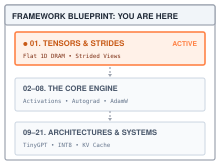
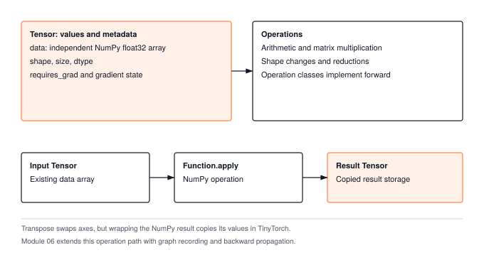
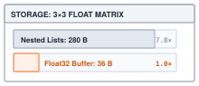
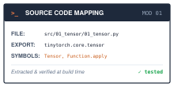

# Tensors and Strided Memory {#sec-tensors}

::: {.column-margin}
{width="100%" fig-alt="TinyTorch execution datapath blueprint highlighting Module 01 Tensors and Strides as the active foundational subsystem."}

*Framework Datapath: Module 01 lays the physical 1D DRAM storage and strided coordinate foundation for the entire framework.*
:::

Every machine learning system—from the smallest training script to production infrastructure like PyTorch or JAX—is fundamentally an engine for transforming numerical arrays. Whether ingesting a batch of images, projecting token embeddings through transformer layers, or computing gradients during backpropagation, the universal medium of exchange across the framework is the **tensor**.

A **tensor** is a multidimensional array of numerical values organized along a defined sequence of coordinate axes. A single number is a scalar (a 0-dimensional tensor); an ordered list of numbers is a vector (1-dimensional); a rectangular grid is a matrix (2-dimensional); and higher-order tensors represent batches of sequence or spatial data. The tensor's **shape** is an integer tuple specifying how many entries each dimension contains—for example, $(B, S, D)$ for a batch of $B$ sequences of length $S$ with hidden dimension $D$.

In deep learning mathematics, tensors appear as abstract multidimensional objects. But physical hardware—the CPU or GPU memory subsystem—has no concept of multidimensional grids. Memory is a flat, one-dimensional ribbon of sequential byte addresses in physical DRAM. A machine learning framework's first and most critical job is therefore **stratified memory management**: projecting multidimensional coordinates onto a one-dimensional address space, and executing structural operations like slicing, broadcasting, and transpositions without duplicating millions of floating-point numbers across the memory bus.

Take the six values `[[1, 2, 3], [4, 5, 6]]`. Adding `[10, 20, 30]` should produce `[[11, 22, 33], [14, 25, 36]]`; transposing should produce `[[1, 4], [2, 5], [3, 6]]`. The first operation changes the values. The second changes which coordinates name them. A framework must represent both computations and decide whether their results share storage with the input.

A computer stores numbers at memory addresses, so a matrix needs a rule that translates a row and column into an address. A **stride** is the distance between entries along one dimension. With rows stored consecutively, moving right in our matrix skips one value and moving down skips three. Exchanging those distances lets an array read the transpose without moving the six values.

Module 01 uses two levels of this mechanism. NumPy describes arrays with shapes and strides; its **views** are array objects that reinterpret existing storage. TinyTorch wraps arrays in `Tensor` objects, and its constructor copies into a fresh float32 buffer. Consequently, `np.transpose(x.data)` shares storage with `x`, while `x.transpose()` does not. The operation path in @fig-tensor-strides locates this copying boundary. Following addition and transpose through `Function.apply` will give us the interface that every later chapter uses.

{#fig-tensor-strides fig-alt="Input Tensor, Function.apply, and result Tensor form a sequence. NumPy computes the result, then Tensor construction copies its storage."}

---

## The Problem

The obvious way to hold a matrix in Python is a list of lists. It reads well, it indexes as `matrix[row][col]`, and it is how most of us wrote our first matrix multiply.

```python
import sys

matrix = [
    [1.0, 2.0, 3.0],
    [4.0, 5.0, 6.0],
    [7.0, 8.0, 9.0],
]

payload = 9 * 4                      # nine 32-bit floats, 4 bytes each
list_bytes = (sys.getsizeof(matrix)
            + sum(sys.getsizeof(row) for row in matrix)
            + sum(sys.getsizeof(x) for row in matrix for x in row))
print(f"float32 payload: {payload} bytes, nested-list objects: {list_bytes} bytes")
```

::: {.column-margin}
{width="100%" fig-alt="Storage overhead comparison showing nested Python lists occupying 280 bytes versus a contiguous float32 buffer occupying 36 bytes."}

*Nested Python lists expand storage by ~8× over a contiguous float32 buffer.*
:::

The first count is always 36 bytes. The second depends on the Python implementation and includes the outer list, the three row lists, and the nine float objects. It does not measure a process's total memory use. Nor is 36 bytes the total cost of a NumPy array or Tensor; those objects also have metadata. The useful comparison is how storage grows as we add values. A float32 array adds four bytes per value to its data buffer, whereas nested lists hold references to separately represented Python numbers. Converting to float32 also changes numerical precision, which is acceptable for the exact integers in this example.

::: {#nbk-tensor-memory-scaling .callout-notebook title="Napkin Math: Tensor flat buffer versus pointer graphs"}

**Problem**: For a moderate batch tensor of shape $(1024, 768)$ in float32, how much memory is consumed by a contiguous array descriptor versus nested Python lists?

**Flat buffer calculation**:
$$\text{Elements} = 1024 \times 768 = 786{,}432$$
$$\text{Storage} = 786{,}432 \times 4\text{ bytes} \approx 3.15\text{ MB}$$

**Nested list overhead**:
Each Python `float` object contains a reference count and type pointer ($24$ bytes on 64-bit CPython). The inner lists require $8$ bytes per pointer plus list container metadata ($56$ bytes). The outer list requires $1024$ pointers ($8\text{ KB}$) plus $56$ bytes:
$$\text{List payload} \approx 786{,}432 \times (24 + 8) + 1024 \times 64 \approx 25.17\text{ MB}$$

**Systems insight**: Contiguous float32 storage achieves an $8.0\times$ memory reduction over nested Python lists while eliminating $786{,}432$ pointer indirections that thrash hardware data caches during matrix operations.

:::

The organization causes a second cost. Transposing a list of lists requires new row lists and a reference to each value in its new position. The float objects themselves need not be duplicated, but the new arrangement still requires work proportional to the number of entries. With an array descriptor, the same rearrangement can be expressed by changing shape and strides. TinyTorch deliberately copies when it wraps the resulting view; understanding both steps prevents us from calling its transpose free.

The comparison in @tbl-memory-comparison reflects a shared cause. A list of lists makes the *shape* part of the storage. The rows are physical objects, so changing the rows changes the storage. What we want is the opposite arrangement, in which the numbers sit in one flat run of memory and the shape is a separate, cheap description of how to read them.

| Property | Nested Python lists | TinyTorch `Tensor` |
| :--- | :--- | :--- |
| Where the numbers live | Scattered `float` objects, reached through two layers of pointers | One flat buffer, values side by side |
| Storage per value | A reference plus a Python float object; implementation-dependent | 4 bytes in the float32 data buffer |
| Cost of a transpose | New row lists holding references to the values | NumPy changes metadata; the `Tensor` wrapper then copies the values |
| Cost of adding a vector to every row | A copy of the vector per row, or a Python loop | Broadcast reads avoid duplicating the vector; the result still allocates |

: What changes when the shape is separated from the storage. {#tbl-memory-comparison tbl-colwidths="[28,36,36]"}

---

## The Idea

Store the numbers in a single flat buffer, in row order, and keep three pieces of metadata alongside it. The **shape** says how many entries each dimension has. The **strides** say how far to move in the buffer when you advance one step along each dimension. The **offset** says where in the buffer the tensor's first element sits. Indexing becomes arithmetic on these three. Some changes of shape can then be expressed by editing metadata alone; others require the values to be copied.

### Row-major layout and strides

Take a matrix of shape $(2, 3)$ and write its rows one after another into the buffer, so the buffer is contiguous[^fn-contiguous-flat-buffer] and row-major.[^fn-row-major-strides] Moving one column to the right means moving one slot in the buffer. Moving one row down means skipping a whole row, three slots. The strides are therefore $(3, 1)$.

[^fn-contiguous-flat-buffer]: **Contiguous** memory occupies consecutive addresses. In this chapter, a C-contiguous array is one whose logical entries occur consecutively when visited in row-major order. Owning a consecutive block of memory does not by itself establish that traversal order.

[^fn-row-major-strides]: **Row-major** order stores a matrix one complete row after another, so the last index varies fastest. Column-major order stores one complete column after another. The nested-list constructor used here creates row-major storage.

The same reasoning extends to any number of dimensions. For a shape $(D_0, D_1, \dots, D_{N-1})$, the stride of the last dimension is $1$, and each earlier stride is the next stride multiplied by the next dimension's size, because advancing one step there has to skip everything nested inside it:

$$S_{N-1} = 1, \qquad S_k = S_{k+1} \times D_{k+1} \quad \text{for } k = N-2, \dots, 0$$

For shape $(2, 3, 4)$ this gives $S_2 = 1$, $S_1 = 4$, and $S_0 = 12$. Advancing one matrix in the batch skips 12 elements, one row skips 4, one column skips 1.

### The coordinate mapping equation

With strides in hand, locating any coordinate $(i_0, i_1, \dots, i_{N-1})$ in the buffer is one dot product:

$$\text{index} = \text{offset} + \sum_{k=0}^{N-1} i_k \times S_k$$

This equation describes an array view. We first use it to explain what NumPy can do without moving values, then follow the module's wrapper to see when TinyTorch copies those values. Shape describes the logical coordinates; strides describe their physical layout. Neither alone tells us whether another object shares the storage.

### Transposition is a swap

A transpose exchanges rows and columns. In the mapping equation, that is the same as exchanging the roles of $i_0$ and $i_1$, which is the same as swapping the two shape entries and the two stride entries. The matrix with shape $(2, 3)$ and strides $(3, 1)$ becomes a view with shape $(3, 2)$ and strides $(1, 3)$ over the *same* buffer. Nothing is copied. The transposed view walks the buffer in column order because its strides tell it to.

### Broadcasting is a zero stride

::: {.column-margin}
**↪ Jump ahead:** @sec-layers
*Broadcast strides allow parameter bias vectors to add across mini-batches without memory copies.*
:::


A bias vector `[10, 20, 30]` must supply the same values to both rows of our matrix. We can describe those reads with shape $(2, 3)$ and strides $(0, 1)$. Moving to the next row skips zero slots, so both rows read the original three values. For a vector of length $D$ used across $B$ rows, the mapping is

$$\text{index} = i \times 0 + j \times 1 = j$$

and the row index $i$ has no effect on where we read. Every row maps onto the same $D$ values. The vector now *behaves* as a $(B, D)$ matrix at zero extra memory, and it did so through the same equation that handles every other tensor. NumPy and PyTorch call this **broadcasting**.

For the forward pass, the contract is simple: compatible dimensions either agree or one of them is 1, and each output coordinate reads the corresponding value from each operand. The `Add` listing below relies on this rule when it adds one bias vector to several rows. A later consequence, developed in @sec-autograd, is that contributions from those rows must be summed when computing the bias's gradient; no backward machinery is needed to use broadcasting here.

![**Broadcasting with stride zero**: An operand vector of shape `(3,)` is broadcast across batch rows by assigning stride `0` along the row axis. The coordinate mapping equation reads the identical memory buffer `[10, 20, 30]` across multiple rows without allocating or duplicating any physical storage.](assets/images/diagrams/01_stride-zero-broadcast.svg){#fig-stride-zero-broadcast fig-alt="Left panel shows matrix A of shape (2, 3) with strides (3, 1). Right panel shows vector B broadcast to (2, 3) with stride 0 along axis 0, sharing buffer storage without duplication."}

### Contiguity is a property you can check

After a transpose or a broadcast, the buffer is unchanged but the view no longer walks it in plain row order. Our transposed matrix has shape $(3, 2)$ and strides $(1, 3)$, whereas row-major strides for that new shape would be $(2, 1)$. The broadcast view repeats locations because its row stride is zero. For arrays whose dimensions all exceed one, matching the formula for the array's own shape establishes C-contiguity. A dimension of length one is an exception because we never step along it; its stride does not affect the traversal. Empty arrays are another special case. NumPy's [array flags documentation](https://numpy.org/doc/stable/reference/generated/numpy.ndarray.flags.html) describes these cases, so `C_CONTIGUOUS` is the authoritative check. NumPy can read these layouts through their strides. Writes need more care: a broadcast view can map several coordinates to one location, and `np.broadcast_to` returns a read-only view. TinyTorch avoids sharing the returned tensor with its input by copying at construction. Its `contiguous()` method additionally requests row-major layout, which is a separate property from owning the buffer.

---

## The Code

::: {.column-margin}
{width="100%" fig-alt="Source code mapping card for Module 01 showing file path, exported package, and tested primitives."}

*Source Code Mapping: Module 01 extracts Tensor, Function.apply, and strided coordinate indexing directly from the working repository.*
:::

The shape-and-stride description belongs to NumPy's `ndarray`. Module 01 adds an owned array and a common operation interface around it. We can read the constructor first to establish what a returned Tensor guarantees, then follow the calls that produce one.

### The Tensor class

The constructor establishes the array and the fields used by the Tensor methods.



The first branch unwraps an existing Tensor to its `.data`; the second stacks a list of Tensors along a new first axis. For example, two shape-`(3,)` tensors become one shape-`(2, 3)` array. The `np.array` call then copies the supplied values into float32 storage. The nine numbers in the nested-list example occupy 36 bytes of data. The shape, size, and dtype lines are conveniences that copy fields the array already carries. The four lines after them reserve state for later learning operations. A tensor needs room for a gradient, and for a record of the operation that produced it, and Module 06 fills those in; until then they are bookkeeping fields that the forward computation does not use. The NumPy array handles layout and its starting address; the Tensor does not duplicate those fields. In the worked trace, `A.data.strides` reports the array's strides in bytes rather than elements.

One property of the constructor matters more than it looks. It always copies. Whatever array it is handed, `np.array` allocates a fresh buffer for the result, so separately constructed tensors own separate buffers. Returning an existing tensor, or assigning to the public `.data` attribute, is outside that constructor guarantee. That simplification prevents an ordinary returned operation result from modifying its input through shared storage. Direct writes through `.data` or `.numpy()` can still change a tensor; copying does not make the object immutable. The transpose listing below shows the cost of this ownership rule.

### What the array is doing: a model of strides

::: {#chk-stride-arithmetic-model .callout-checkpoint title="Checkpoint: Stride arithmetic model"}

**Model scope**: The next listing is not in Module 01. It is the arithmetic NumPy performs inside the array that `Tensor` wraps, written out so it can be read. The worked trace checks it against NumPy's own numbers.

:::

For the six-value matrix, `A[1, 2]` must find slot $1 \times 3 + 2 \times 1 = 5$, whose value is 6. A transpose must make that same value available at coordinate `(2, 1)` by swapping the shape and strides. Four functions express the calculation. `contiguous_strides` computes row-order strides; `physical_index` maps a valid coordinate to a slot; `transpose` exchanges two axes; and `broadcast_to` supplies zero strides where a dimension is repeated. This small model assumes positive dimension sizes and valid coordinates. It describes array reads, without implementing storage or mutation.

```python
def contiguous_strides(shape):
    """Row-major strides, in elements, computed from the last dimension leftward."""
    strides = [1] * len(shape)
    for k in range(len(shape) - 2, -1, -1):
        strides[k] = strides[k + 1] * shape[k + 1]
    return tuple(strides)

def physical_index(strides, offset, indices):
    """The mapping equation: one slot number for an N-D coordinate."""
    return offset + sum(i * s for i, s in zip(indices, strides))

def transpose(shape, strides, dim0, dim1):
    """Swap two dimensions. The buffer is untouched."""
    shape, strides = list(shape), list(strides)
    shape[dim0], shape[dim1] = shape[dim1], shape[dim0]
    strides[dim0], strides[dim1] = strides[dim1], strides[dim0]
    return tuple(shape), tuple(strides)

def broadcast_to(shape, strides, target):
    """Stretch size-1 dimensions to the target shape with stride 0. No copy."""
    pad = len(target) - len(shape)
    if pad < 0:
        raise ValueError("broadcasting cannot remove dimensions")
    shape, strides = (1,) * pad + tuple(shape), (0,) * pad + tuple(strides)
    out = []
    for dim, stride, want in zip(shape, strides, target):
        if dim == want:
            out.append(stride)
        elif dim == 1:
            out.append(0)              # stretched: reread the same slot
        else:
            raise ValueError(f"cannot broadcast {shape} to {target}")
    return tuple(target), tuple(out)
```

`physical_index` never looks at the data or asks which kind of view it is serving. The strides carry that information, so a transposed or broadcast view takes the same path as a fresh one. Neither `transpose` nor `broadcast_to` allocates a new data buffer. Broadcasting `[10, 20, 30]` across two rows still reads only three stored values.

NumPy reports strides in bytes. A $(2, 3)$ array of 4-byte floats therefore shows `(12, 4)` where the model says `(3, 1)`, and its transpose shows `(4, 12)`. Dividing NumPy's strides by `data.itemsize` converts them to the model's element units. `flags["C_CONTIGUOUS"]` checks row order, and `np.ascontiguousarray` provides that order when needed. The worked trace checks both properties separately from storage sharing.

### Operations as objects

The naive way to give `Tensor` a `+` is to write the arithmetic inside `__add__`. Module 01 does something that looks roundabout, and the reason is five chapters away. Each kind of operation has a class with a `forward` method that computes the result from raw arrays and a `backward` method that Module 06 fills in. Each call creates an instance, an *operation object*. The object brings the operation and its inputs together during the call. The current `apply` does not attach it to the returned tensor; @sec-autograd will add that recording step. For now, the useful structure is a single place to unwrap inputs, run array arithmetic, and wrap the output. Here is the base class, from Module 01.



The constructor stores the input tensors and any parameters the operation needs, an axis for a reduction, a shape for a reshape. The `apply` classmethod is the only entry point the rest of the framework uses. It builds the operation object, unwraps every input to its NumPy array, calls `forward` on the arrays, and wraps the result in a new `Tensor`. `forward` receives arrays rather than Tensors. The final wrap goes through the constructor above, so every result from this path owns a fresh buffer. A helper turns scalars into tensors so that `x + 1` works.



With those two in place, the operator method on `Tensor` is one line, and the operation class is barely more.





Follow `A + b` for `A.shape == (2, 3)` and `b = Tensor([10, 20, 30])`. Python calls `A.__add__(b)`. `_as_tensor(b)` returns the existing Tensor unchanged, and `Add.apply(A, b)` stores those two inputs on an operation object. `apply` passes their `.data` arrays to `Add.forward`. NumPy's addition reads the bias once per output coordinate according to the broadcasting rule, producing `[[11, 22, 33], [14, 25, 36]]`. The final `Tensor(...)` copies that result and returns shape `(2, 3)`. Neither input is mutated.

The broadcast avoids allocating a repeated bias matrix; it does not avoid allocating the sum. In this implementation, NumPy produces the sum array and Tensor construction then copies it. An explicit `np.broadcast_to` view in the worked trace makes the repeated reads visible, but `Add.forward` calls only `a + b`. NumPy implements the broadcasting within that operation, as described in its [broadcasting guide](https://numpy.org/doc/stable/user/basics.broadcasting.html).

### Matrix multiplication

The other operation a linear layer needs is matrix multiplication. For two matrices, Module 01 makes the output-row and output-column loops explicit and delegates each inner dot product to NumPy.



The entry path is `A @ B` → `Tensor.__matmul__` → `Tensor.matmul`. Before constructing a `MatMul` operation, `_validate_matmul_shapes` requires a Tensor operand, rejects scalars, and checks the contracted dimensions. Our shape-`(2, 3)` matrix can multiply a shape-`(3, 2)` matrix, but cannot multiply another shape-`(2, 3)` matrix. A mismatch raises before the output loops begin. Batched inputs also depend on NumPy's batch-broadcasting rules.

For `A @ A.transpose()`, `M = 2`, `K = 3`, and `N = 2`. The zero-filled result has shape `(2, 2)`. At `i = 0, j = 1`, the inner call reads `[1, 2, 3]` and `[4, 5, 6]`, computes $1\times4 + 2\times5 + 3\times6 = 32$, and assigns `result_data[0, 1]`. Repeating for the other coordinates gives `[[14, 32], [32, 77]]`. `Function.apply` wraps that array, leaving both operands unchanged. Inputs involving a vector or a batch take the `np.matmul` branch instead of the two explicit output loops.

The dot product accepts strided inputs, so a view does not need to be copied merely to be read correctly. Layout can still affect the time required to read it. A row of a row-major array is contiguous; its column skips a row between values. In this particular product, the right operand has already been transposed, so its columns are contiguous. We must inspect each operand's strides before drawing a performance conclusion.

### Transpose, ownership, and row order

The product needs shape `(3, 2)` from a `(2, 3)` input. `Tensor.transpose` builds the axis list `[0, 1]`, swaps its last two entries to `[1, 0]`, and passes `(1, 0)` to `Permute.apply`. An explicit pair such as `transpose(0, 2)` swaps those axes instead. For a scalar or vector with no explicit axes, there are no two dimensions to exchange, so the method takes the `Copy.apply` path and preserves the shape.





`np.transpose` implements the axis rearrangement illustrated by the model. It returns a view with the shape and stride entries swapped and the buffer untouched, and the worked trace confirms that the view shares memory with the original. Then `apply` wraps that view in a new `Tensor`, and the constructor copies. The TinyTorch result therefore has independent storage, even though the intermediate NumPy view does not. The copy is not a plain row-major one, though. For this transpose, `np.array` preserves column-major order, so the new buffer keeps strides `(4, 12)`. The returned Tensor owns its memory and is still not C-contiguous. This example does not imply that copying preserves every possible slice's exact strides.

The constructor has already paid for an independent buffer, but that buffer is still in column-major order. `contiguous()` answers a different request: arrange the same logical values in row-major order. Some consumers can use arbitrary strides, and matrix libraries can often accept a transpose directly; others require a particular layout. Copying for ownership and copying for layout therefore belong on separate lines of the cost ledger.





`Copy.forward` calls `np.ascontiguousarray`. For a non-contiguous input, that call writes the values into row-major order; for an already contiguous input, NumPy can return the same array. The final `.reshape(a.shape)` preserves a scalar's shape `()`, since `np.ascontiguousarray` alone would promote it to `(1,)`. `Function.apply` then constructs a `Tensor`, adding one copy whether or not a layout conversion already occurred. Thus `Tensor.contiguous()` always returns a separate tensor, even when no layout conversion was needed. The method is intentionally simple, but it is not a no-cost check.

The three results in @fig-tensor-storage-transpose have identical logical values but differ in storage sharing or row order. Buffer B makes the ownership copy visible; Buffer C shows the reordered output of `contiguous()`.

{#fig-tensor-storage-transpose width="5in" fig-alt="The original 2 by 3 matrix and its NumPy transpose share Buffer A, ordered 1 through 6. TinyTorch transpose has separate Buffer B in the same order. Its contiguous result has Buffer C ordered 1, 4, 2, 5, 3, 6. Element strides are respectively (3, 1), (1, 3), (1, 3), and (2, 1)."}

The other shape operations follow the same path. `reshape` checks the requested element count and calls `Reshape.apply`; indexing calls `Slice.apply`; both wrap their array result in a new tensor. TinyTorch's `view` is an alias for `reshape`, so it does not promise the storage sharing that a production `view` API may promise. These methods preserve values and change their organization, while arithmetic such as `Add` changes values. Following each method to `apply` makes that distinction visible without reading the whole class at once.

---

## A Worked Trace

The following script exercises the model and the module together on a $2 \times 3$ matrix. It needs the model functions from above and an installed `tinytorch` package.

```python
import numpy as np
from tinytorch.core.tensor import Tensor

A = Tensor([[1.0, 2.0, 3.0],
            [4.0, 5.0, 6.0]])
print("A       ", A.shape, A.data.strides, A.data.flags["C_CONTIGUOUS"])
print("model   ", contiguous_strides(A.shape))

V = np.transpose(A.data)                       # what Permute.forward does
print("view    ", V.shape, V.strides, V.flags["C_CONTIGUOUS"])
print("model   ", transpose(A.shape, contiguous_strides(A.shape), 0, 1))
print("V[1,0]  ", V[1, 0], " V[2,1]", V[2, 1])
print("shared  ", np.shares_memory(V, A.data))

C = np.ascontiguousarray(V)                    # what Copy.forward does
print("copy    ", C.ravel().tolist(), C.strides)

b = np.array([10.0, 20.0, 30.0], dtype=np.float32)
B = np.broadcast_to(b, (2, 3))                 # expose the reads used by broadcasting
print("bias    ", B.shape, B.strides, " B[1,2] =", B[1, 2])
print("model   ", broadcast_to(b.shape, contiguous_strides(b.shape), (2, 3)))

print("A + b   ", (A + Tensor(b)).data.tolist())
At = A.transpose()
print("A @ A.T ", (A @ At).data.tolist())
print("A.T     ", At.data.strides, At.data.flags["C_CONTIGUOUS"], np.shares_memory(At.data, A.data))
print("contig  ", At.contiguous().data.strides, At.contiguous().data.flags["C_CONTIGUOUS"])
```

```
A        (2, 3) (12, 4) True
model    (3, 1)
view     (3, 2) (4, 12) False
model    ((3, 2), (1, 3))
V[1,0]   2.0  V[2,1] 6.0
shared   True
copy     [1.0, 4.0, 2.0, 5.0, 3.0, 6.0] (8, 4)
bias     (2, 3) (0, 4)  B[1,2] = 30.0
model    ((2, 3), (0, 1))
A + b    [[11.0, 22.0, 33.0], [14.0, 25.0, 36.0]]
A @ A.T  [[14.0, 32.0], [32.0, 77.0]]
A.T      (4, 12) False False
contig   (8, 4) True
```

Every model line agrees with the NumPy output above it once byte strides are divided by four. In lines 4--7, the fresh array `A` has strides `(12, 4)`, matching `contiguous_strides` element strides $(3, 1)$ for 4-byte floats, and `A.data.flags["C_CONTIGUOUS"]` confirms it is contiguous. In lines 9--13, `V = np.transpose(A.data)` constructs a strided view with swapped strides `(4, 12)` (element strides $(1, 3)$) without touching buffer memory; line 13 confirms `np.shares_memory(V, A.data)` is `True`. In line 12, the mapping equation resolves `V[1, 0]` to physical slot $1 \times 1 + 0 \times 3 = 1$ (value `2.0`) and `V[2, 1]` to slot $2 \times 1 + 1 \times 3 = 5$ (value `6.0`). In lines 15--16, `np.ascontiguousarray` allocates a *second* physical buffer in which the transposed values sit in row order, `[1, 4, 2, 5, 3, 6]`, with the strides `(8, 4)` that the formula gives a $(3, 2)$ shape.

The bias trace in lines 18--21 is the stride-0 mechanism in the open. After padding, the vector has shape $(1, 3)$ and strides $(0, 1)$; stretching the first dimension from 1 to 2 leaves the zero in place, and NumPy reports the same thing as `(0, 4)` in line 20. Every coordinate of the $(2, 3)$ view resolves to one of three slots, as the repeated indices in @tbl-stride0-trace show.

| Coordinate $(i, j)$ | $i \times 0 + j \times 1$ | Slot | Value |
| :---: | :---: | :---: | :---: |
| $(0, 0)$ | $0$ | $0$ | `10.0` |
| $(0, 1)$ | $1$ | $1$ | `20.0` |
| $(0, 2)$ | $2$ | $2$ | `30.0` |
| $(1, 0)$ | $0$ | $0$ | `10.0` |
| $(1, 1)$ | $1$ | $1$ | `20.0` |
| $(1, 2)$ | $2$ | $2$ | `30.0` |

: Stride-0 broadcast of a length-3 vector to shape $(2, 3)$. Six coordinates, three slots, no copy. {#tbl-stride0-trace tbl-colwidths="[25,35,20,20]"}

In line 23, `A + b` uses the same broadcast reads inside `Add.forward`, and the result `[[11, 22, 33], [14, 25, 36]]` shows each row receiving the same bias. In lines 24--25, the matrix product multiplies $\mathbf{A}$ by its own transpose, $\begin{bmatrix} 14 & 32 \\ 32 & 77 \end{bmatrix}$, with `MatMul.forward` reading its right operand through the transposed strides and never noticing. Lines 26--27 trace the module's own transpose rather than the raw view. `A.transpose()` owns a separate buffer, so `shares_memory` is false in line 26, but that buffer keeps the transposed strides `(4, 12)` and is not contiguous; line 27 shows it takes `contiguous()` to produce the row-order `(8, 4)` layout. The first call copies for ownership; the second requests row order and wraps that result in another owned buffer.

---

## From TinyTorch to Production

The transposed NumPy view in the trace illustrates an alternative to TinyTorch's ownership rule. PyTorch's transpose operations normally return views sharing the original storage. Changes through such a view can therefore affect its base tensor. PyTorch's `view()` also requires shared storage and raises when the requested shape cannot be represented with compatible strides. `reshape()` may return either a view or a copy. Its `contiguous()` returns the input when it already has the requested layout, and copies otherwise. These contracts are described in the [PyTorch tensor views documentation](https://docs.pytorch.org/docs/stable/tensor_view.html).

A copy becomes necessary when the layout a consumer requires differs from the one available. The cost is proportional to the amount of data moved, while changing a view's metadata does not copy the entries. Some numerical routines accept transposed inputs directly, so a transpose alone is not evidence that a copy is necessary. TinyTorch's `np.dot` calls already show this distinction. NumPy reads their operands through the available strides.

Layout also affects access patterns. Reading adjacent values can reuse data brought into a processor's cache, a small memory near the arithmetic units. A strided walk may use less of each fetched block before moving elsewhere. That is a reason to measure the consuming operation, not a guarantee that one layout is always faster. Module 01's row-versus-column experiment measures elapsed time for a particular matrix and access pattern; it does not count cache misses or predict a universal speedup.

::: {#psp-pytorch-strides .callout-perspective title="Systems Perspective: Zero-copy views in PyTorch ATen"}

**The ATen storage contract**: In PyTorch's native C++ core (ATen), a `torch::Tensor` is an envelope around a `c10::TensorImpl`. The `TensorImpl` stores sizes, strides, and a storage offset pointing into a refcounted `c10::Storage` heap allocation:

```
[Tensor Envelope] ---> [TensorImpl: sizes, strides, offset] ---> [Storage: raw byte buffer]
```

**Zero-copy view mutation**: When code executes `t.transpose(0, 1)` or `t[::2]`, ATen creates a new `TensorImpl` pointing to the exact same `Storage` instance in $O(1)$ time, modifying only strides and offsets. No byte copies traverse PCIe or CPU memory buses.

**The safety invariant**: Because views share memory, an in-place mutation immediately mutates the underlying `Storage`. When an operation involves a stride-0 broadcasted tensor, PyTorch detects that multiple logical coordinates map to identical physical addresses and raises `RuntimeError: in-place operation on a view...`, preventing corrupted concurrent memory writes.

:::

| Operation | TinyTorch (Module 01) | PyTorch comparison |
| :--- | :--- | :--- |
| Storage and layout | An owned float32 NumPy array; `data.strides` uses bytes | Tensor metadata describes storage and element strides |
| Transpose | NumPy view followed by an owned Tensor copy | A view sharing storage |
| Broadcasted addition | Repeated input reads; allocated sum and wrapper copy | Repeated input reads; allocated sum |
| Contiguity check | `data.flags["C_CONTIGUOUS"]` | `.is_contiguous()` |
| Request row order | `Copy` requests row order; Tensor construction always copies | `.contiguous()` can return the input unchanged |
| Change shape | `reshape()` and `view()` both return owned copies | `view()` requires shared storage; `reshape()` may copy |

: Ownership and layout contracts at the Tensor boundary. {#tbl-tinytorch-vs-pytorch tbl-colwidths="[22,38,40]"}

The distinction in @tbl-tinytorch-vs-pytorch explains why similarly named methods can have different costs. Before inserting `contiguous()`, identify the required layout and inspect the existing one. Before writing through a result, establish whether it shares storage. A shape tells us where an entry belongs logically; strides tell us how to reach it; ownership tells us whether a write can affect another object.

---

## Summary

Module 01 gives later code two contracts. A `Tensor` holds float32 data with a definite shape, and each operation reaches NumPy through `Function.apply`. NumPy's strides explain how transpose and broadcast views read existing storage; the wrapper explains why TinyTorch's returned tensors generally own fresh storage instead. The worked trace separates those questions with `data.strides` and `np.shares_memory`. This distinction lets us reason about a result's values, layout, and copying independently. The next step in @sec-activations uses the same operation boundary to transform each value without changing its shape.

---

## Exercises

1. **Permutation.** Generalize the model's `transpose(shape, strides, dim0, dim1)` to `permute(shape, strides, *dims)`, which reorders all dimensions at once. For a tensor of shape $(B, C, H, W)$ with row-major strides, write out the shape and strides that `permute(0, 2, 3, 1)` produces, and confirm against the strides and `C_CONTIGUOUS` flag NumPy reports for `np.transpose(A.data, (0, 2, 3, 1))` that the result is a non-contiguous view of the same buffer when all four dimensions exceed one. Use a concrete shape such as `(2, 3, 4, 5)` for the check.
2. **Slicing.** Write a zero-copy `slice(shape, strides, offset, dim, start, end, step)` for the model. Work out how the offset, `shape[dim]`, and `strides[dim]` must change, including the case `step > 1`, and check your answer against the strides NumPy reports for `A.data[:, 1::2]`, which is what Module 01's `Slice.forward` returns.
3. **When is a view possible?** Write `can_view(tensor, new_shape) -> bool`, which returns whether `new_shape` can be produced by recomputing strides alone. Restrict the model to positive strides and dimensions larger than one. Two adjacent dimensions can be merged into one only when a certain relation holds between their strides; state it, and use it to explain why the transposed matrix in the worked trace cannot be viewed as a length-6 vector.
4. **Ownership.** Predict the effect of `V = np.transpose(A.data); V[0, 0] = 99` on `A`, then compare with `T = A.transpose(); T.data[0, 0] = 99` using a fresh `A`. Check both predictions with `np.shares_memory`. Trace the difference to the exact constructor call.
5. **Broadcast and validation.** For `A.shape == (2, 3)`, predict the shapes and values of `A + Tensor([10, 20, 30])` and `A + Tensor([[10], [20]])`. Check why `A + Tensor([10, 20])` raises. Then explain why `A @ A` fails even though `A + A` succeeds, identifying the helper that catches the matrix-product mismatch.
