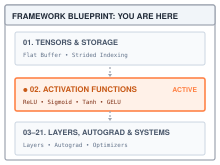
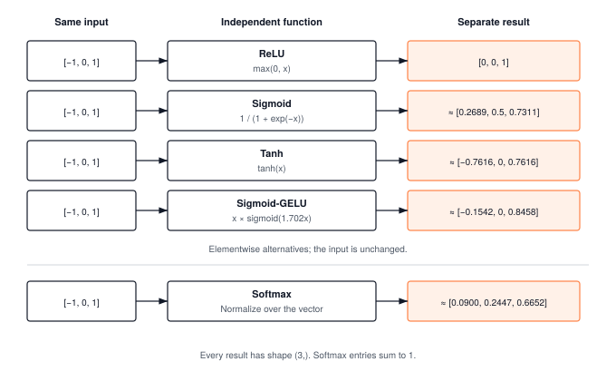
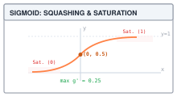
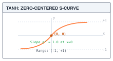
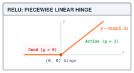
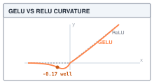

# Activation Functions {#sec-activations}

::: {.column-margin}
{width="100%" fig-alt="TinyTorch execution datapath blueprint highlighting Module 02 Activations as the active subsystem."}

*Framework Blueprint: Module 02 introduces non-linear activation functions that bend representation space between linear transformations.*
:::


The core premise of deep learning is the ability to learn complex, non-linear representations from data. Yet if a neural network consists solely of linear transformations—matrix multiplications and bias additions—it suffers a fatal mathematical collapse: the composition of any number of linear maps is itself just a single linear map ($\mathbf{W}_2(\mathbf{W}_1 \mathbf{x} + \mathbf{b}_1) + \mathbf{b}_2 = \mathbf{W}_{\text{eff}}\mathbf{x} + \mathbf{b}_{\text{eff}}$). Without non-linearity, a 100-layer deep network has no more expressive power than a single linear layer. To bend representation space and learn intricate decision boundaries, deep architectures require **activation functions**.

From a framework and systems standpoint, activation functions introduce a distinct operational class. While tensor operations in @sec-tensors established physical 1D memory buffers and strided coordinate views, activations are shape-preserving, elementwise or reduction operators executed at immense scale. Building an activation engine forces the systems architect to resolve three core concerns:
1. **Operator abstraction**: How does the runtime apply mathematical transformations to underlying buffers through a uniform, composable boundary (`Function.apply`)?
2. **Memory traffic**: An elementwise activation performs a few arithmetic operations for every value it reads and writes, so its arithmetic intensity is low, and on hardware with fast arithmetic its cost is usually set by moving the array rather than computing on it (@sec-profiling makes this precise).
3. **The autograd contract**: Each activation must preserve the necessary forward state so that reverse-mode automatic differentiation (@sec-autograd) can compute local derivatives during backpropagation.

This chapter builds the non-linear foundation of TinyTorch, implementing the core activation zoo—ReLU, Sigmoid, Tanh, GELU, and Softmax—and establishing the contracts that allow @sec-layers to stack them into deep, trainable neural networks.

{#fig-activation-zoo fig-alt="Five independent rows transform the same vector [-1, 0, 1] into separate results of shape (3,). ReLU returns [0, 0, 1]; sigmoid, tanh, and sigmoid-GELU preserve per-element correspondence. Softmax returns approximately [0.0900, 0.2447, 0.6652], summing to one. Inputs remain unchanged."}

---

## The Problem

::: {.column-margin}
**↩ Jump back:** @sec-tensors
*Elementwise activation kernels operate directly over contiguous 1D memory buffers.*
:::


With one input, consider a first layer that computes $h = 2x + 1$ and a second that computes $y = 3h - 2$. At $x = 1$, the intermediate value is $h = 3$ and the result is $y = 7$. Substitution gives $y = 6x + 1$, a single multiply-and-add with the same result. Adding the second layer changed the coefficients, but not the kind of function available.

The layer traditionally called linear includes a bias, so mathematically it is an affine map, a linear map plus a constant shift. It maps an input row vector $\mathbf{x}$ to $\mathbf{x}\mathbf{W} + \mathbf{b}$, where $\mathbf{W}$ is a matrix of weights and $\mathbf{b}$ is a vector of biases. Stack two of them, feeding the output of the first into the second:

$$\mathbf{h} = \mathbf{x}\mathbf{W}_1 + \mathbf{b}_1, \qquad \mathbf{y} = \mathbf{h}\mathbf{W}_2 + \mathbf{b}_2$$

Substitute the first equation into the second and multiply out:

$$\mathbf{y} = (\mathbf{x}\mathbf{W}_1 + \mathbf{b}_1)\mathbf{W}_2 + \mathbf{b}_2 = \mathbf{x}\,(\mathbf{W}_1\mathbf{W}_2) + (\mathbf{b}_1\mathbf{W}_2 + \mathbf{b}_2)$$

The right-hand side has the form $\mathbf{x}\mathbf{W}_{\text{eff}} + \mathbf{b}_{\text{eff}}$ with $\mathbf{W}_{\text{eff}} = \mathbf{W}_1\mathbf{W}_2$ and $\mathbf{b}_{\text{eff}} = \mathbf{b}_1\mathbf{W}_2 + \mathbf{b}_2$. That is a single linear layer. Nothing in the argument depends on there being exactly two layers. Apply it again and a third layer folds into the same form, and so on for a hundred. Matrix multiplication is associative, so the product of any number of weight matrices is just another weight matrix.

Here is the collapse in code, using the `Tensor` from @sec-tensors with its `@` and `+`, and two-element vectors so that every number can be checked by hand. The input and the biases are written as $1 \times 2$ matrices (one row) so that `@` applies to them directly.

```python
from tinytorch.core.tensor import Tensor

x = Tensor([[1.0, 2.0]])
W1, b1 = Tensor([[2.0, 0.0], [1.0, 3.0]]), Tensor([[0.5, -0.5]])
W2, b2 = Tensor([[1.0, 2.0], [3.0, 1.0]]), Tensor([[1.0, 0.0]])

# Two layers, one after the other.
h = x @ W1 + b1
y_deep = h @ W2 + b2

# One layer, with the weights folded together ahead of time.
W_eff = W1 @ W2
b_eff = b1 @ W2 + b2
y_folded = x @ W_eff + b_eff

print("two layers:", y_deep.data.tolist())    # [[22.0, 14.5]]
print("one layer: ", y_folded.data.tolist())  # [[22.0, 14.5]]
print("W_eff:", W_eff.data.tolist(), " b_eff:", b_eff.data.tolist())
```

The two paths agree exactly for these small values. Algebraically the equivalence holds for every input; floating-point evaluations can differ because folding changes the order of arithmetic. In @tbl-linear-collapse-trace the intermediate values sit side by side so we can confirm the fold by hand. The middle row shows what the second layer receives; the last row shows that the folded weights $\mathbf{W}_{\text{eff}} = \begin{bmatrix} 2 & 4 \\ 10 & 5 \end{bmatrix}$ and $\mathbf{b}_{\text{eff}} = [0, 0.5]$ land on the same answer in one step.

| Path | Input | Weights, bias | Output |
| :--- | :--- | :--- | :--- |
| Layer 1 | $\mathbf{x} = [1, 2]$ | $\mathbf{W}_1, \mathbf{b}_1$ | $\mathbf{h} = [4.5, 5.5]$ |
| Layer 2 | $\mathbf{h} = [4.5, 5.5]$ | $\mathbf{W}_2, \mathbf{b}_2$ | $\mathbf{y} = [22, 14.5]$ |
| Folded | $\mathbf{x} = [1, 2]$ | $\mathbf{W}_1\mathbf{W}_2,\ \mathbf{b}_1\mathbf{W}_2 + \mathbf{b}_2$ | $\mathbf{y} = [22, 14.5]$ |

: Two linear layers in sequence versus the single layer they fold into, on the input $\mathbf{x} = [1, 2]$. {#tbl-linear-collapse-trace tbl-colwidths="[15,25,35,25]"}

The reason this hurts is what a single linear layer cannot do. Take the four points of the XOR truth table, $(0,0)$ and $(1,1)$ labeled 0, $(0,1)$ and $(1,0)$ labeled 1, and ask a linear function $f(x_1, x_2) = a x_1 + b x_2 + c$ to score the 1s above some threshold $t$ and the 0s below it. Adding the two "below" conditions gives $a + b + 2c < 2t$; adding the two "above" conditions gives $a + b + 2c > 2t$. Both cannot hold, so no linear function separates the points, and by the collapse above no *stack* of linear functions can either. A hundred layers and a million weights are no better than a single line through the plane. Milestone I revisits this example with a two-layer network that solves it, once we have the missing piece.

---

## The Idea

The missing piece is a function $\sigma$ that is applied to every element of a layer's output and is not linear. With it between the layers,

$$\mathbf{h} = \sigma(\mathbf{x}\mathbf{W}_1 + \mathbf{b}_1), \qquad \mathbf{y} = \mathbf{h}\mathbf{W}_2 + \mathbf{b}_2$$

and the substitution trick fails, because $\sigma(\mathbf{x}\mathbf{W}_1)\mathbf{W}_2$ cannot be rewritten as $\mathbf{x}$ times some matrix. A one-element example makes the point. With ReLU, the function that replaces negatives by zero, $\text{ReLU}(-3 \times -2) = 6$ while $\text{ReLU}(-3) \times (-2) = 0$. The function does not commute with multiplication, so it cannot be pushed through the weights and absorbed. Each layer now bends the space it receives before the next layer draws a line through it, which is how a network builds a boundary that one linear layer cannot represent. ReLU networks produce boundaries made from straight pieces; smooth activations can produce smooth curves.

{#fig-space-folding-relu fig-alt="Left panel shows linear collapse where XOR points cannot be separated by a single hyperplane. Right panel shows ReLU folding negative inputs along axes, enabling a linear boundary to cleanly separate positive and negative classes."}

Breaking the collapse is only the first requirement. The function also has to be inexpensive to evaluate across a whole array and responsive enough that changing the incoming values can change the result. A nearly flat function loses that responsiveness. @sec-autograd will turn this observation into derivatives and gradients, the quantities used to decide how weights should change during training. Here the output values and the shapes of the curves are enough to compare the choices in @tbl-activation-zoo.

| Activation | Rule | Output behavior | Limitation |
| :--- | :--- | :--- | :--- |
| Sigmoid | $1/(1 + e^{-x})$ | Squashes toward 0 and 1 | Nearly flat in both tails |
| Tanh | $\tanh(x)$ | Squashes toward $-1$ and 1 | Nearly flat in both tails |
| ReLU | $\max(0, x)$ | Keeps positives, zeros negatives | Discards every negative input |
| GELU (Module 02) | $x\,\sigma(1.702x)$ | Smooth gate; small negatives can pass | More arithmetic than ReLU; an approximation to exact GELU |

: Four elementwise choices. Here $\sigma$ denotes sigmoid; Softmax is discussed separately because it couples entries. {#tbl-activation-zoo tbl-colwidths="[15,25,28,32]"}

### Sigmoid and saturation

::: {.column-margin}
{width="100%" fig-alt="Sigmoid activation S-curve showing midpoint (0, 0.5) and saturation zones approaching 0 and 1."}

*Sigmoid squashes inputs to $(0, 1)$ with maximum gradient $0.25$ at origin, saturating in extreme tails.*
:::

The **sigmoid** maps zero to $0.5$, $-1$ to about $0.269$, and $1$ to about $0.731$. Its mathematical range is $(0, 1)$, useful when an output represents a probability. The endpoints are approached but never reached in exact arithmetic; float32 can round sufficiently extreme results to exactly 0 or 1.

At the ends of the curve, large input changes produce small output changes. For example, increasing the input from 5 to 6 moves the output only from about $0.9933$ to $0.9975$. This flattening is called **saturation**. @sec-autograd explains why saturated activations can weaken the signal used to update earlier weights, a problem called vanishing gradients. Saturation is already visible in the forward values, without implementing training.

### Tanh

::: {.column-margin}
{width="100%" fig-alt="Tanh zero-centered S-curve showing midpoint (0, 0) and saturation asymptotes at -1 and +1."}

*Tanh provides a zero-centered $(-1, 1)$ range with unit gradient at origin, retaining saturation cliffs in extreme tails.*
:::

The **hyperbolic tangent** rescales sigmoid according to $\tanh(x) = 2\sigma(2x) - 1$. It maps zero to zero, $-1$ to about $-0.762$, and $1$ to about $0.762$. Unlike sigmoid, it can pass both signs to the next layer. Its mathematical range is $(-1, 1)$, although float32 can round to either endpoint. Changing the range does not remove saturation; at large positive or negative inputs this curve also becomes nearly flat. A symmetric function alone does not guarantee that a particular batch of outputs has mean zero.

### ReLU

::: {.column-margin}
{width="100%" fig-alt="ReLU piecewise linear hinge showing zero output for negative inputs and linear identity ramp for positive inputs."}

*ReLU eliminates negative saturation via a hard zero hinge, preserving gradient flow ($g=1$) for positive inputs.*
:::

The **rectified linear unit**, $\text{ReLU}(x) = \max(0, x)$, gives up on squashing. Positive inputs pass through unchanged and negative inputs become zero. Increasing a positive input from 5 to 6 therefore increases the output by exactly 1. Increasing a negative input from $-6$ to $-5$ changes nothing. The implementation needs only an elementwise maximum with zero.

The zero branch has a cost. If every example gives a unit a negative input, its output carries no information about changes within that branch. Such a unit is called a **dead unit**. @sec-autograd will explain when it receives no learning signal; changes elsewhere in the network can still change its inputs, so a currently inactive unit is not necessarily permanently inactive. If inputs are distributed symmetrically around zero, ReLU also sets about half of them to zero. @sec-layers uses this effect to reason about the scale of a layer's starting weights.

::: {#chk-dying-relu-saturation .callout-checkpoint title="Checkpoint: Dying ReLU and saturation traps"}

**Mechanism**: If a large gradient updates weights such that an artificial neuron outputs negative values across the entire dataset, its output remains permanently $0$. Because $\frac{\partial}{\partial x}\text{ReLU}(x) = 0$ for $x < 0$, backpropagation injects zero gradient into upstream weights, creating an unrecoverable "dead unit."

**Invariant check**: Saturated units (in sigmoid/tanh) or dead units (in ReLU) collapse effective model capacity. Monitoring the percentage of inactive activations during training provides an early warning before training diverges.

:::

### GELU

::: {.column-margin}
{width="100%" fig-alt="Plot comparing GELU curvature with ReLU, highlighting the smooth negative dip to -0.17 at x = -0.75."}

*GELU allows small negative gradients through its -0.17 dip before asymptotically saturating at zero.*
:::

A gate is a multiplier that controls how much of a value passes through. ReLU uses a hard gate, either 0 or 1. GELU, the **Gaussian error linear unit**, replaces it with a smooth multiplier. The exact definition is $x\Phi(x)$, where $\Phi(x)$ is the fraction of a standard normal bell curve lying to the left of $x$. That bell curve is centered at zero with standard deviation one; $\Phi(0)=0.5$ and $\Phi(1)\approx0.8413$. This probability interpretation defines the gate, but applying GELU does not draw a random sample.

TinyTorch approximates the gate with the sigmoid already introduced:

$$\operatorname{GELU}_{\text{TinyTorch}}(x) = x\,\sigma(1.702x).$$

At $x=-1$, the gate is about $0.1542$, giving an output of $-0.1542$. At $x=1$, it is about $0.8458$, giving $0.8458$. Negative inputs can therefore affect the next layer, unlike ReLU's zero branch. Very negative inputs still produce outputs close to zero, so smoothness does not promise strong responsiveness everywhere. The approximation also differs from exact GELU, whose outputs at $-1$ and $1$ are about $-0.1587$ and $0.8413$. The worked trace follows the sigmoid form that the code actually computes.

---

## The Code

::: {.column-margin}
{width="100%" fig-alt="Source code mapping card for Module 02 Activations showing file path, exported package, and tested primitives."}

*Source Code Mapping: Module 02 extracts elementwise activations (ReLU, Sigmoid, Tanh, GELU) and Softmax normalization directly from the working repository.*
:::

### Two classes per activation

A layer might turn a batch of two examples into a $2 \times 3$ array. Applying `ReLU()` to that array changes its values but leaves the next layer with the same two rows and three columns. The same rule works on a vector or a larger array because each output depends only on the input at that position.

Module 02 writes each activation as a pair of classes, and the pair is the pattern every later module follows. The first is an *operation*, a subclass of @sec-tensors's `Function` whose `forward` takes a NumPy array and returns one. @sec-autograd will teach the framework to retain this object as a record of the call and add a `backward` method for computing gradients. The second is a *layer*, a plain class that @sec-layers's containers can hold: it reports no parameters, its `forward` takes a `Tensor` and hands it to the operation through `apply`, and `__call__` makes `y = f(x)` work. Here is the sigmoid pair, the layer first.



Three things to notice. `parameters()` returns an empty list because @sec-layers's containers will ask every component for its learnable parameters, and an activation has none. `forward` contains no arithmetic at all; `SigmoidFunction.apply` unwraps the tensor, runs the operation on the array, and wraps the result in a fresh `Tensor`, exactly as @sec-tensors showed for `Add`. Neither class examines the shape. An elementwise function does not care whether the array is a vector or a four-dimensional batch of images, and NumPy walks whatever strides the array has, so a transposed input needs no special handling.

### The four operations

With the wrapping settled, each operation's `forward` is its formula written on an array. ReLU and tanh are one NumPy call each.





Sigmoid needs an additional numerical safeguard. The formula $1 / (1 + e^{-v})$ asks for $e^{-v}$, and a hidden unit's input can be any size at all, including large magnitudes when the initial weights have a poor scale. Feed it $v = -1000$ and the naive transcription computes $e^{1000}$, far beyond the largest number a 64-bit float can hold. Python's `math.exp` raises `OverflowError` on the spot. NumPy returns `inf` with a warning and then evaluates $1 / (1 + \infty) = 0$, which hides an overflowing intermediate behind a plausible final value. Tests that raise on overflow expose the problem. Here is the trick. The same function has a second form, $e^{v} / (1 + e^{v})$, whose exponent is $+v$, so it overflows for large positive $v$ instead. Choose whichever form keeps the exponent non-positive, the first when $v \ge 0$ and the second when $v < 0$, and neither branch can overflow for any input.



The crucial line computes `z = exp(-abs(x))`. Every exponent is nonpositive, so `z` stays between zero and one. For nonnegative inputs, the result is `1 / (1 + z)`; for negative inputs it is `z / (1 + z)`. `np.where` selects between these results per element. NumPy evaluates both candidate arrays before selecting, but both are safe because they share the bounded `z`. This implementation does not need to silence overflow in a discarded sigmoid branch. At zero either division gives $0.5$; at $-1000$, `z` rounds to zero and the negative branch returns zero safely.

::: {.column-margin}
**↪ Jump ahead:** @sec-acceleration
*Operator fusion combines activation arithmetic with linear layers, slashing DRAM round-trips.*
:::

GELU is defined as $x\,\Phi(x)$, where the Gaussian fraction can be computed using Python's `math.erf`, the error function. Module 02 instead approximates that fraction. It uses the approximation $x\,\sigma(1.702x)$, the sigmoid form, because it reuses the operation just written and expresses the gate using NumPy array operations.



This is a different numerical function from the exact GELU. Its approximation error and derivative must therefore be checked against the sigmoid form actually implemented; the approximation exercise compares the forms on a grid. Notice that the call is `SigmoidFunction().forward`, the array-level method, not `Sigmoid()` on a tensor. Inside an operation everything is NumPy; tensor wrapping happens at the boundary that `apply` guards. The temporary `SigmoidFunction` call is array arithmetic inside GELU, not a separate Tensor operation. The `errstate` around scaling allows extreme finite inputs to reach infinite gate arguments, where sigmoid saturates safely. The second guard handles the otherwise invalid product $-\infty \times 0$, and the final `where` supplies its intended limiting output, zero.

For `y = Sigmoid()(x)`, read the calls in order: `Sigmoid.__call__` delegates to `Sigmoid.forward`, which selects `SigmoidFunction.apply`; `apply` passes `x.data` to the operation and constructs `y` from its result. The wrapper decides which operation runs, the operation decides the numerical formula, and `apply` decides how arrays cross the tensor boundary. A test can check the formula directly on an array, then check shape preservation and unchanged input through the public wrapper. These are different failure points, so one test should not stand in for both.

### Calling one

@sec-layers's `Sequential` will call an activation exactly the way it calls a layer, `y = f(x)`. Before that container relies on the interface, we can check both values and ownership. Transposing a $2 \times 3$ input changes its logical shape to $(3, 2)$; the activation must follow those new positions rather than flattening the old row order. NumPy handles the array strides. TinyTorch's transpose then wraps its result in independently owned storage, so the transposed Tensor is not a zero-copy alias of the original.

The example builds a $2 \times 3$ tensor, applies `ReLU`, and then applies it again to the transpose.

```python
import numpy as np
from tinytorch.core.tensor import Tensor
from tinytorch.core.activations import ReLU

x = Tensor([[-3.0, -1.0, -0.75],
            [ 0.0,  1.0,  3.0]])

relu = ReLU()
y = relu(x)
print(y.shape, y.data.tolist())           # (2, 3) [[0.0, 0.0, 0.0], [0.0, 1.0, 3.0]]

xt = x.transpose()                       # shape (3, 2), independent storage
yt = relu(xt)
print(yt.shape, yt.data.tolist())         # (3, 2) [[0.0, 0.0], [0.0, 1.0], [0.0, 3.0]]
print(x.data.tolist())                    # input untouched
assert not np.shares_memory(x.data, xt.data)
assert not np.shares_memory(xt.data, yt.data)
```

The transposed call's output is the transpose of the first output, and neither activation call changes its input. The assertions check ownership separately from numerical equality. The return contract is a fresh Tensor with the same shape, containing transformed values and sharing no storage with the input. NumPy first computes the result array, then `apply` constructs the Tensor's own copy. That copy makes ownership simple, but it also adds memory traffic.

### Softmax couples a row

For scores `[1, 2, 3]`, Softmax returns approximately `[0.0900, 0.2447, 0.6652]`. The outputs are nonnegative and sum to one, so they can represent relative probabilities among three choices. Unlike sigmoid, increasing one score changes the other outputs too because every entry shares the same denominator.

`Softmax.forward(x, dim=-1)` calls `SoftmaxFunction.apply(x, dim=dim)`. The `dim` argument becomes an attribute of that operation instance; it chooses which axis to normalize. For an input with shape $(2, 3)$ and `dim=-1`, the operation handles each row independently. Its maximum and sum arrays have shape $(2, 1)$ because `keepdims=True` retains the reduced axis. NumPy can then broadcast those values across their original rows.



The formula exponentiates each score and divides by the row's exponential sum. To avoid asking for an enormous exponential, the code subtracts the row maximum first. For `[1, 2, 3]`, the shifted scores are `[-2, -1, 0]`, the exponentials are approximately `[0.1353, 0.3679, 1]`, and their sum is `1.5032`. Division gives the probabilities above. Subtracting a common constant does not change the normalized ratios, since its exponential factor cancels between numerator and denominator.

A difference between extreme finite scores may round to negative infinity; `errstate` permits that result because its exponential is correctly zero.

A score of `-inf` excludes an entry because its exponential is zero. For a fully excluded row, the maximum is also `-inf`. The `safe_max` guard replaces that maximum with zero before subtraction, avoiding `-inf - -inf`. The resulting exponentials are all zero; `safe_sum` replaces their zero sum with one so division leaves zeros. This row means no available choices, not a probability distribution. @sec-attention will use excluded entries for attention masks. Positive infinity and NaN scores are outside this contract.

```python
import numpy as np
from tinytorch.core.tensor import Tensor
from tinytorch.core.activations import Softmax

scores = Tensor([[1.0, 2.0, 3.0],
                 [-np.inf, -np.inf, -np.inf]])
probabilities = Softmax()(scores, dim=-1)
np.testing.assert_allclose(probabilities.data[0],
                           [0.09003057, 0.24472847, 0.66524096], atol=1e-7)
np.testing.assert_array_equal(probabilities.data[1], [0.0, 0.0, 0.0])
assert probabilities.shape == scores.shape
```

---

## A Worked Trace

A useful trace follows the intermediate value that selects the output. Sigmoid forms a bounded exponential; GELU forms a sigmoid gate and multiplies by the original input. The following program sends six values through the array-level operations, just as `apply` does. Every array has shape `(6,)`.

```python
import numpy as np
from tinytorch.core.activations import SigmoidFunction, ReLUFunction, GELUFunction

v = np.array([-3.0, -1.0, -0.75, 0.0, 1.0, 3.0], dtype=np.float32)
s = SigmoidFunction().forward(v)
r = ReLUFunction().forward(v)
gate = SigmoidFunction().forward(1.702 * v)
g = GELUFunction().forward(v)
np.testing.assert_allclose(g, v * gate)

print("    x  sigmoid   relu  GELU gate     GELU")
for i in range(len(v)):
    print(f"{v[i]:5.2f} {s[i]:8.4f} {r[i]:6.2f}"
          f" {gate[i]:10.4f} {g[i]:8.4f}")
```

In line 4, `v` defines six sample points spanning negative, zero, and positive domains. Lines 5--6 compute standard Sigmoid and ReLU activations via their `forward` methods. In lines 7--8, `gate` evaluates the sigmoid factor $\sigma(1.702x)$ and `g` computes the complete GELU activation; line 9 validates the identity $g = v \cdot \text{gate}$ with `assert_allclose`.

In @tbl-activation-numerical-trace (printed by lines 11--14), the GELU output is the product of the first and fourth columns. At $-1$, a small positive gate ($0.1542$) lets a small negative value through ($-0.1542$); at zero, the gate is $0.5$ but the product is still zero. These are consequences of the multiplication, not special cases added to the function.

| Input $x$ | Sigmoid | ReLU | GELU gate $\sigma(1.702x)$ | GELU output |
| :---: | :---: | :---: | :---: | :---: |
| $-3.00$ | $0.0474$ | $0$ | $0.0060$ | $-0.0181$ |
| $-1.00$ | $0.2689$ | $0$ | $0.1542$ | $-0.1542$ |
| $-0.75$ | $0.3208$ | $0$ | $0.2181$ | $-0.1636$ |
| $0.00$ | $0.5000$ | $0$ | $0.5000$ | $0.0000$ |
| $1.00$ | $0.7311$ | $1$ | $0.8458$ | $0.8458$ |
| $3.00$ | $0.9526$ | $3$ | $0.9940$ | $2.9819$ |

: Forward values and the intermediate gate in Module 02's sigmoid-form GELU. {#tbl-activation-numerical-trace tbl-colwidths="[15,18,15,30,22]"}

The trace also distinguishes a formula from its name. Exact GELU at $-1$ is approximately $-0.1587$, while the implementation gives $-0.1542$. A regression test should compare to the sigmoid form actually chosen. A test against the exact form needs an explicit approximation tolerance.

There is a short preview of learning in these values. A local slope measures how much the output changes per small input change. Sigmoid's largest slope is $0.25$; ReLU's positive branch has slope 1 and its negative branch has slope zero. Ten factors of $0.25$ multiply to about $9.5\times10^{-7}$, while ten factors of 1 remain 1. This isolates the activations' contribution to shrinking a change as it travels through a computation. A complete network also contains weights. @sec-autograd introduces derivatives and tracks all those factors together, rather than treating this activation-only calculation as a prediction of a network's gradient.

---

## From TinyTorch to Production

A ReLU on six float32 values produces a 24-byte result. NumPy reads the input and writes its result array; TinyTorch then copies that result into the returned Tensor. Scaling this same interface to millions of elements makes ownership and temporary storage part of the cost, even though the numerical rule is still a maximum with zero.

Production frameworks can change that storage policy. PyTorch's `ReLU(inplace=True)` overwrites its input rather than allocating a separate result. That option trades ownership safety for reuse of storage; another caller may still need the original values. TinyTorch's ReLU always returns independently owned output. [PyTorch ReLU documentation](https://docs.pytorch.org/docs/2.14/generated/torch.nn.ReLU.html).

A second alternative is **fusion**, evaluating neighboring operations together. A matrix multiplication followed by ReLU can, in principle, apply the maximum before writing each result to memory. It avoids writing an unactivated array only to read it back immediately. This requires an implementation that can combine the operations; calling TinyTorch's ordinary matrix multiplication and ReLU separately does not fuse them. @sec-acceleration will study such transformations, and @sec-extensions will discuss implementations outside NumPy.

::: {#nbk-activations-inplace-sram-footprint .callout-notebook title="Napkin math: bytes moved by a separate activation"}
For an array of shape $(32, 512, 3072)$ stored in float32, the element count is $32 \times 512 \times 3072 = 50{,}331{,}648$. At four bytes per element, one array occupies $201{,}326{,}592$ bytes, about $201\text{ MB}$.

An ideal separate ReLU pass reads one input array and writes one output array, about $403\text{ MB}$ in total. TinyTorch also copies the NumPy result into its Tensor, adding another array read and write. That gives about $805\text{ MB}$ of logical array traffic for this reference path, before any other framework bookkeeping.

These are byte counts, not measured transfers from physical memory or a latency prediction. Caches, allocation, and the execution environment affect elapsed time. The count explains why reducing temporary arrays can matter even when the arithmetic is cheap. In-place evaluation saves an allocation but still reads and writes the values; fusion can eliminate the intermediate pass itself.
:::

For such a simple function, memory movement can dominate arithmetic. An operation is called **memory-bound** when moving its data is the limiting cost. That diagnosis requires measurement on a particular implementation and workload; it does not follow from a universal GPU timing ratio. Sigmoid and GELU make this especially worth checking in TinyTorch because their NumPy expressions create several temporary arrays, not one shared loop for the entire activation.

::: {#psp-fused-activation-cuda .callout-perspective title="Systems Perspective: Fused activation kernels in GPU execution"}

**The memory bandwidth wall**: In modern deep learning accelerators, arithmetic units (e.g., NVIDIA Tensor Cores) execute floating-point operations orders of magnitude faster than high-bandwidth memory (HBM) can supply operands. A separate activation kernel spends ~90% of its execution time waiting on memory round-trips:

$$\text{Time} \approx \frac{\text{Bytes Read} + \text{Bytes Written}}{\text{Peak Memory Bandwidth}}$$

**Kernel fusion**: Compilers like PyTorch Inductor or Triton fuse the activation directly into the epilogue of the preceding GEMM (matrix multiplication). Instead of writing the unactivated result to DRAM and reading it back, the GPU keeps intermediate matrix products in fast on-chip registers (RF) or shared memory (SRAM), applies the activation elementwise, and writes only the final activated tensor back to HBM.

:::

Numerical choices also remain visible at the production boundary. PyTorch's `GELU` defaults to $x\Phi(x)$ and offers the tanh approximation

$$0.5x\left(1 + \tanh\left(\sqrt{2/\pi}\,(x + 0.044715x^3)\right)\right).$$

Neither is TinyTorch's sigmoid approximation. Matching an API name therefore does not establish numerical identity; comparisons need to name the formula as well as the input dtype. [PyTorch GELU documentation](https://docs.pytorch.org/docs/2.14/generated/torch.nn.GELU.html).

| Concern | TinyTorch reference | Production alternative |
| :--- | :--- | :--- |
| Visiting elements | NumPy operations follow array shapes and strides | A device implementation can combine operations in one loop or kernel |
| Output ownership | `apply` copies the result into a fresh Tensor | In-place operations reuse input storage when allowed |
| Intermediate storage | Sigmoid and GELU create several array temporaries | Fusion can avoid materializing intermediate arrays |
| GELU formula | $x\,\sigma(1.702x)$ | Exact Gaussian form or a specified approximation |
| Sigmoid stability | Both candidate divisions share bounded $e^{-\lvert x\rvert}$ | Implementation may use another stable numerical formula |

: The reference makes array ownership and numerical formulas explicit. Production alternatives must preserve the intended observable behavior. {#tbl-activation-tinytorch-vs-pytorch tbl-colwidths="[22,39,39]"}

The distinction in @tbl-activation-tinytorch-vs-pytorch gives two separate checks for an optimization. First compare the intended numerical behavior, including approximation choices. Then compare memory ownership and measurements. An implementation that is faster because it overwrites a still-needed input has changed the program's contract.

---

## Summary

The caller writes `y = activation(x)`. The wrapper selects an operation; `Function.apply` unwraps `x.data`; the operation computes on arrays; and Tensor construction gives `y` its own storage. Every activation preserves shape and leaves the input unchanged. The four elementwise functions transform each position independently, while Softmax uses a shared maximum and sum along its chosen axis.

The numerical mechanisms are small but consequential. ReLU keeps positives and zeros negatives. Tanh and sigmoid saturate; sigmoid avoids overflow by keeping its exponent nonpositive. GELU multiplies the input by an approximate sigmoid gate. Softmax subtracts a maximum before exponentiating and returns zeros for fully excluded slices. These rules let a reader reconstruct the implementation rather than memorize its API.

@sec-layers adds the tensors an activation does not own: trainable weights and biases. Its containers can compose those layers with the activation wrappers because both accept a Tensor, return a Tensor, and answer `parameters()`. The next design problem is collecting the trainable values and choosing their initial scale.

---

## Exercises

1. **Trace values and ownership.** Start with the $2 \times 3$ input in the calling example. Predict `Sigmoid()(x.transpose())`, then check its shape, its values, and `np.shares_memory` against the transposed input. Change one output entry and verify that neither input changes. Explain which call establishes independent storage.
2. **Leaky ReLU.** Implement `LeakyReLUFunction` with `forward` returning `np.where(x > 0, x, 0.01 * x)`, plus a `LeakyReLU` wrapper following the existing pair. Predict its output on `[-3, -1, 0, 1, 3]`. Compare two nearby negative inputs to show how this rule retains a response that plain ReLU discards. Check that its wrapper preserves shape and returns no parameters.
3. **Softmax axis and exclusion.** Apply Softmax to `[[1, 2, 3], [3, 2, 1]]` along `dim=0` and `dim=-1`. Predict which sums equal one in each case before executing. Replace one entire row with `-np.inf`, repeat both calls, and explain why an excluded row and an excluded normalization slice are not always the same thing.
4. **GELU approximations.** Compute exact GELU as `0.5*x*(1 + math.erf(x / math.sqrt(2)))` for each scalar in a grid from $-4$ to $4$ in steps of $0.01$. Compare it with the tanh formula in the production section and the sigmoid form in `GELUFunction`. Report the largest absolute errors and their input locations. Choose a tolerance that would accept the intended approximation while rejecting an accidental implementation of ReLU.
