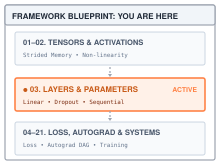
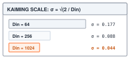
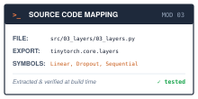

# Layers, Parameters, and Initialization {#sec-layers}

::: {.column-margin}
{width="100%" fig-alt="TinyTorch execution datapath blueprint highlighting Module 03 Layers as the active subsystem."}

*Framework Blueprint: Module 03 encapsulates stateful weights and modular execution into composable layer blocks.*
:::


Deep learning models are not solitary mathematical equations; they are modular compositions of stateful, parameterized building blocks. As architectures grow in depth, raw tensor math must be organized into clean modules that bundle weights, biases, and forward computation rules. Furthermore, deep networks require systematic numerical initialization to prevent signal variance from vanishing or exploding across layers, as well as distinct operational behaviors during training versus inference (such as stochastic zeroing in Dropout).

In PyTorch, defining and executing a parameterized layer takes only a few lines:

```python
import torch
import torch.nn as nn

# Linear projection layer with variance-scaled initialization
layer = nn.Linear(in_features=784, out_features=128)
x = torch.randn(32, 784)  # Batch of 32 vectors
y = layer(x)               # Forward: y = x @ W^T + b

print("Weight shape:", layer.weight.shape)  # (128, 784)
print("Bias shape:", layer.bias.shape)      # (128,)
print("Output shape:", y.shape)             # (32, 128)
```

Underneath that clean interface, the framework resolves several fundamental systems responsibilities:
1. **Persistent state versus ephemeral activations:** The layer creates persistent parameter tensors (`weight` and `bias`) that live across training iterations, distinct from the transient activation tensors allocated during each forward step.
2. **Variance-scaled parameter initialization:** Rather than initializing weights with raw unscaled random noise (which causes activations to explode or vanish exponentially with depth), the constructor scales initial weight variance inversely with fan-in.
3. **Hierarchical parameter discovery:** The layer registers its weights in an internal container hierarchy so optimizers can traverse the model and retrieve all trainable parameters in a single call (`model.parameters()`).

Building upon the memory buffers of @sec-tensors and activations of @sec-activations, this chapter encapsulates stateful parameters into reusable, composable layer blocks. Before building these abstractions, we must inspect what breaks when multi-layer networks are implemented with raw, unmanaged tensors.

{#fig-layers-container}

---

## The Problem

::: {.column-margin}
**↩ Jump back:** @sec-activations
*Weight initialization variance scaling accounts for non-linear activation compression (e.g., ReLU).*
:::


Write a three-layer network with nothing but tensors. You allocate `W1`, `b1`, `W2`, `b2`, `W3`, `b3`, write the forward pass as three matrix multiplies with a ReLU between each, and the code runs. Then three things go wrong.

First, the numbers. The weights need starting values, and the obvious choice is standard normal noise, `randn`. The loop in @lst-layers-variance-run uses a hidden width of 1024 to make the change in activation spread visible as depth grows.

::: {#lst-layers-variance-run lst-pos="H" lst-cap="**Unscaled initialization**: A ReLU stack exposes growth in pre-activation variance."}
```python
import numpy as np

rng = np.random.default_rng(0)
D = 1024
h = rng.standard_normal((256, D)).astype(np.float32)
for layer in range(1, 16):
    W = rng.standard_normal((D, D)).astype(np.float32)
    z = h @ W
    h = np.maximum(0.0, z)  # ReLU
    if layer in (1, 5, 10, 15):
        variance = np.var(z, dtype=np.float64)
        print(f"layer {layer:2d}: variance of z = {variance:.2e}")
```
:::

On my machine, with seed 0, that prints the following.

```
layer  1: variance of z = 1.03e+03
layer  5: variance of z = 6.78e+13
layer 10: variance of z = 2.34e+27
layer 15: variance of z = 8.50e+40
```

Every layer multiplies the spread of the signal by about 500. By layer 15 the pre-activations are around $10^{20}$ in size, and at that rate they pass the largest number float32 can hold ($3.4 \times 10^{38}$) near layer 29 and turn into `inf`, then `NaN`. Shrink the weights instead, say `randn * 0.001`, and the same table runs the other way, toward zero. There is a correct scale, it depends on the layer's width, and a bare tensor does not know it.

Second, bookkeeping. When you hand the network to an optimizer (@sec-optimizers) it needs every trainable tensor and nothing else. With six loose variables you pass a list by hand. With sixty you forget one, and that layer silently never learns.

Third, mode. Some layers do one thing while training and another when the trained network is used. If that switch is a global flag you set by hand, you will forget it, and the deployed model will behave like a noisy training run.

All three are the same gap. A tensor holds numbers; it does not hold the knowledge of how it is meant to be used. A layer does.

---

## The Idea

::: {.column-margin}
**↪ Jump ahead:** @sec-quantization
*Compacts 32-bit floating-point layer weight matrices into 8-bit integers (INT8).*
:::


### A layer owns parameters and implements a forward rule

For distinct layers, the design resembles a tree. Each `Linear` holds its weight and optional bias; each container holds references to its child layers. Asking the root for parameters means asking each child for the tensors it owns. The result is a new Python list containing references to the original tensors, so an optimizer can later change the same values that the forward pass reads. A second copy of the numbers would break that connection.

Sharing adds an important case to that picture. A child can occur twice, or appear inside a nested container as well as directly in the parent. `Sequential.parameters()` keeps the first occurrence of each tensor by object identity. Two different tensors with equal values remain two parameters; the same tensor reached twice remains one. The forward pass still executes every child occurrence. Parameter ownership and execution order therefore require different traversals.

### The right starting scale

Consider a layer with four inputs per output. With independent, centered inputs of variance 1 and independent, centered weights of variance 1, each product contributes variance 1, and summing four products gives variance 4. Giving each weight variance $1/4$ instead keeps the sum's variance at 1. Variance is the average squared distance from the mean; it measures the spread we saw growing in the loop.

For a general width, take one output $y = \sum_{j=1}^{D_{\text{in}}} x_j w_j$, where $D_{\text{in}}$ is the layer's **fan-in**,[^fn-fan-in-layer-width] the number of inputs each output reads. Under the same independence and zero-mean assumptions, the variance of each product is the product of the variances, and the variances of the independent terms add:

$$\text{Var}(y) = D_{\text{in}} \cdot \text{Var}(x) \cdot \text{Var}(w).$$

[^fn-fan-in-layer-width]: **Fan-in**: the number of inputs feeding one output of a layer, which for `Linear(in_features, out_features)` is `in_features`; **fan-out** is the number of outputs each input feeds. A 1024-wide layer sums 1024 products per output, and that count, not the weight values, is what decides how much the signal grows.

With $\text{Var}(w) = 1$ and $D_{\text{in}} = 1024$, the first linear operation multiplies the input variance by 1024. For a symmetric input distribution, ReLU halves the second moment, $\mathbb{E}[x^2]$ (the average squared value), rather than exactly halving the variance: its output no longer has mean zero. With independent zero-mean weights in the next layer, that second moment determines the next pre-activation variance. This gives the approximate factor of 512 seen in the loop.

To hold the variance steady, set $D_{\text{in}} \cdot \text{Var}(w) = 1$, or $\text{Var}(w) = 1 / D_{\text{in}}$. This is LeCun's rule and it is what the TinyTorch course module uses. Kaiming initialization accounts for the ReLU halving by doubling the weight variance:

::: {.column-margin}
{width="100%" fig-alt="Kaiming weight standard deviation ladder showing scale decreasing from 0.250 at fan-in 32 down to 0.044 at fan-in 1024."}

*Kaiming weight $\sigma = \sqrt{2/D_{\text{in}}}$ scales inversely with the square root of fan-in.*
:::

$$\text{Var}(w) = \frac{2}{D_{\text{in}}}, \qquad \sigma_w = \sqrt{\frac{2}{D_{\text{in}}}}.$$

Here we call the multiplier on weight *variance* the **gain**, matching the first exercise; a gain on standard deviation would be its square root. The appropriate multiplier depends on the activation and its input distribution. Gain 1 preserves the linear case and is the module's default, rather than a universal prescription for tanh. Xavier Glorot's earlier rule, $\text{Var}(w) = 2 / (D_{\text{in}} + D_{\text{out}})$, splits the difference between keeping the forward signal steady (which wants $1/D_{\text{in}}$) and keeping the backward gradient steady (which wants $1/D_{\text{out}}$; @sec-autograd will introduce that backward computation). Any of these rules can be realized with a normal distribution of the right standard deviation or a uniform one on $[-a, a]$, whose variance is $a^2/3$. For a fixed ratio of input to output width, each rule in @tbl-init-schemes reduces the standard deviation as the inverse square root of width. The activation determines the appropriate constant.

| Scheme | Meant for | Weight variance | Uniform bound $a$ |
| :--- | :--- | :---: | :---: |
| LeCun | linear, tanh (course module default) | $1 / D_{\text{in}}$ | $\sqrt{3 / D_{\text{in}}}$ |
| Xavier (Glorot) | sigmoid, tanh | $2 / (D_{\text{in}} + D_{\text{out}})$ | $\sqrt{6 / (D_{\text{in}} + D_{\text{out}})}$ |
| Kaiming (He) | ReLU | $2 / D_{\text{in}}$ | $\sqrt{6 / D_{\text{in}}}$ |

: **Weight initialization rules**: The scales follow assumptions about the activation and its input distribution; they do not guarantee constant variance in an arbitrary network. {#tbl-init-schemes tbl-colwidths="[18,34,24,24]"}

Rerunning the loop from The Problem with the weights scaled three ways gives @tbl-variance-evolution. Reset `rng` to seed 0 before each run, and multiply each newly drawn `W` by the scale in the column heading. The unscaled column grows and the small-scale column shrinks. Kaiming initialization keeps the pre-activation variance near 2 here. The first layer receives raw inputs of variance 1, so its factor of 2 doubles the variance once; subsequent layers approximately compensate for the ReLU between them.

| Layer | `randn` | `randn * 0.001` | Kaiming, `randn * sqrt(2/1024)` |
| :---: | :---: | :---: | :---: |
| 1 | $1.0 \times 10^{3}$ | $1.0 \times 10^{-3}$ | $2.0$ |
| 5 | $6.8 \times 10^{13}$ | $6.8 \times 10^{-17}$ | $1.9$ |
| 10 | $2.3 \times 10^{27}$ | $2.3 \times 10^{-33}$ | $1.9$ |
| 15 | $8.5 \times 10^{40}$ | $8.5 \times 10^{-50}$ | $2.0$ |

: **Measured variance across depth**: Variance of the pre-activation $z$ at four depths for a 1024-wide ReLU network under three weight scales, from one run of the loop in The Problem with seed 0. Variance is accumulated in float64, allowing the measurement to exceed float32's range even while the activations themselves remain finite. The figures are rounded observations, not exact predictions for other random draws. {#tbl-variance-evolution tbl-colwidths="[12,26,28,34]"}

{#fig-variance-waterfall fig-alt="Variance waterfall comparison showing exploding variance under unscaled initialization, vanishing variance under small initialization, and stable unit-scale variance maintained by Kaiming initialization."}

### Dropout, and why a layer needs a mode

For an activation of value 3 and dropout probability $p=0.5$, half of the random outcomes discard the value and half retain it. Returning either 0 or 3 would average to 1.5. Returning either 0 or 6 instead averages to 3, matching the value passed through at evaluation. That correction is the arithmetic behind dropout, a training technique intended to reduce overfitting.[^fn-overfitting-dropout-motive] Each activation is independently dropped, so later computations cannot always rely on the same inputs being present.

[^fn-overfitting-dropout-motive]: **Overfitting**: fitting training examples, including their noise, so closely that performance on new examples suffers. Dropout perturbs the activations during training; it can reduce reliance on particular combinations of features, but does not guarantee that a model will generalize.

The correction can be placed on either side of training. One convention leaves surviving values unchanged during training and scales them down at evaluation. **Inverted dropout**, which TinyTorch implements, instead divides surviving training activations by the probability of keeping them, $1-p$. Evaluation can then return the original input without performing any scaling or array passes:

$$y_{\text{train}} = \frac{x \cdot m}{1 - p}, \quad m \in \{0, 1\} \text{ with } P(m = 1) = 1 - p, \qquad y_{\text{eval}} = x.$$

For $0 \leq p < 1$, the expected value of $m$ is $1 - p$, so the expected value of $y_{\text{train}}$ is exactly $x$. Training sees a noisy version of what eval sees, with the same average, and the eval path becomes an exact zero-overhead identity. The price is that `Dropout` must know which of the two it is doing, and that is the `training` argument it is called with.

::: {#chk-dropout-inference-mode .callout-checkpoint title="Checkpoint: The dropout evaluation trap"}

**Mechanism**: Inverted dropout scales activations by $\frac{1}{1-p}$ during training. At test time, dropout must be turned off ($y_{\text{eval}} = x$) so predictions remain deterministic.

**Failure mode**: If evaluation runs with `training=True`, inferences become stochastic and activations are scaled up by $\frac{1}{1-p}$ (e.g., $2\times$ when $p=0.5$). Conversely, if training runs with `training=False`, the regularization effect vanishes and downstream weights overfit without gradient noise.

:::

---

## The Code

::: {.column-margin}
{width="100%" fig-alt="Source code mapping card for Module 03 Layers showing file path, exported package, and tested primitives."}

*Source Code Mapping: Module 03 extracts Linear affine transformations, Dropout regularization, and Sequential containers directly from the working repository.*
:::

Module 03 builds on the `Tensor` operators from @sec-tensors and the callable activations from @sec-activations. `Linear.forward` performs its arithmetic through `matmul` and `+`; `Dropout.forward` multiplies tensors after drawing a mask with NumPy. It reads `x.data.shape` only to size that mask. @sec-autograd will teach the tensor operations to record the information needed for gradients, allowing these layer forward methods to remain unchanged.

### The base class

A caller needs two independent operations on a model. `model(x)` computes an output from the current parameter values; `model.parameters()` returns the tensors available for learning. @sec-optimizers's optimizer will take that list and enable gradient tracking on its entries, while @sec-training will use it for training and checkpoints. `Layer` defines the common call and parameter methods without allocating weights itself.



`forward` is abstract, `__call__` turns a layer into something you can call and passes any extra arguments through, and `parameters()` returns an empty list until a subclass says otherwise. Notice what is not here. There is no registry of parameters and no mode flag. Module 03 takes the direct route on both. Each layer that owns trainable tensors lists them in its own `parameters()`, right next to the code that allocated them, and a container collects its children's lists and removes repeated tensor references. [Milestone I](milestone_01.qmd#sec-milestone-1)'s XOR network does exactly this; its `parameters()` returns `self.hidden.parameters() + self.output.parameters()`. The list lives where the tensors live, so it stays short and readable, and the price is that a forgotten entry fails silently: the layer keeps its random weights, the loss may still fall because other layers change, and nothing raises. That silence is the reason PyTorch automates the registration, and the production section shows how. The mode question, which layers need to know whether the network is training, is answered the same direct way: the caller passes `training` as an argument, and `__call__` forwards it.

### Linear

`Linear(2, 3)` packages the opening calculation. Its constructor allocates a `(2, 3)` weight matrix and a `(3,)` bias once; calling the layer with a `(1, 2)` row then returns a `(1, 3)` result. A later call reads the same tensors. The constructor chooses random starting values and their scale, while `forward` only reads them.

The constructor derives the initialization scale from its own width. Module 03 uses LeCun's rule from @tbl-init-schemes, $\text{Var}(w) = 1 / D_{\text{in}}$, so `Linear` draws its weight with standard deviation $\sqrt{1 / D_{\text{in}}}$ (the module's `INIT_SCALE_FACTOR` is 1) and applies $y = xW + b$. The weight is stored as `(in_features, out_features)`, so a batch `x` of shape `(B, in_features)` multiplies it directly. The bias starts at zero; it adds nothing to the initial weighted sum. `rng` is the module's NumPy generator, created once with seed 7, and each constructor consumes the next draw from that generator. Repeated calls therefore create different weights; constructing a new layer does not reset the random sequence.



Notice that `scale` comes from `in_features` alone. With a ReLU after every layer, LeCun's scale lets the next pre-activation variance shrink rather than hold steady, which is the gap Kaiming's gain of 2 closes. The module implements one simple default; the first exercise changes the gain and measures its effect instead of assuming that one initializer suits every network. PyTorch's `nn.Linear` stores the weight the other way around, as `(out_features, in_features)`, and uses a different default distribution; the bridge section takes up both. Notice also that the weights are created without `requires_grad`. The `training` argument controls behavior such as dropout; gradient tracking is a separate concern. Parameters initially have `requires_grad=False`. @sec-optimizers's optimizer enables it when the parameters are supplied for learning.

The forward pass is two tensor operations, `matmul` and `+`, and that choice is doing quiet work. Each returns a fresh `Tensor`. Once @sec-autograd adds gradient recording to tensor operations, the same forward code can connect the result to `weight` and `bias`. The addition of `self.bias` relies on the broadcasting from @sec-tensors: the bias has shape `(out_features,)`, the product has shape `(B, out_features)`, and NumPy reads the same bias values for all $B$ rows without allocating a repeated bias matrix. The addition still allocates its output, and the Tensor constructor copies the returned array into its own storage. That forward efficiency creates an obligation for @sec-autograd. Because the bias influenced every row in the batch, the backward engine will have to sum those gradients across the batch to keep the parameter's shape.

::: {.column-margin}
**Core Invariant: Linear Contraction**\
$$(B, D_{\text{in}}) \times (D_{\text{in}}, D_{\text{out}}) + (D_{\text{out}},) \to (B, D_{\text{out}})$$\
*Inner dimension $D_{\text{in}}$ contracts via row-major GEMM; bias broadcasts with stride 0.*
:::

{#fig-linear-dimension-flow fig-alt="Block diagram illustrating tensor dimension flow: input (B, D_in) multiplies transposed weight (D_in, D_out), followed by stride-zero bias broadcast addition yielding output (B, D_out)."}


### Dropout

`Dropout` gives the `training` argument its job. For the three-element hidden row `[1, 2, 3]`, a keep-drop-keep draw at `p=0.5` produces the scaled mask `[2, 0, 2]` and output `[2, 0, 6]`. On evaluation the same layer returns `[1, 2, 3]`. The probability belongs to the layer, while the mask belongs to one training call.

The constructor validates `p` before storing it. The forward method then delegates its first decision to `_should_apply_dropout`. If that helper says no, the method returns before drawing random numbers. Otherwise it handles `p=1` separately, then asks `_generate_dropout_mask` for an input-shaped mask. That helper draws uniform values, compares each with `1-p`, converts the resulting booleans to float32, and folds the scale into the mask. The final tensor multiplication both zeros and scales the input elements.



The return paths have different ownership behavior. Evaluation and `p=0` return `x` itself, so the output is the same object and no random state is consumed. Training with `p=1` returns `x * 0.0`, which gives a new all-zero tensor for finite inputs and avoids dividing by zero. For `0<p<1`, the method returns `x * mask`, also a new tensor. None of these branches overwrites the input. The multiplication in both training branches will let @sec-autograd propagate zero gradients for dropped elements; replacing it with an unrelated zero tensor would sever that connection.

### Sequential

The worked example needs one object that accepts the input row, calls two linear layers with dropout between them, and returns the final row. `Sequential` supplies that object. It accepts either individual children or a list of children and stores their references in `self.layers`. It does not inherit from `Layer`, but provides the same callable, `forward`, and `parameters` interface.



Calling `Sequential.__call__` forwards the input and `training` argument to `Sequential.forward`, which runs its children in order. Follow the assignment `x = layer.forward(...)`: after each iteration, `x` holds the previous child's output, so the next child must accept that shape. The container does not reshape or repair it.

The `inspect.signature` test handles a second contract. `Dropout.forward` accepts `training`, while `Linear.forward` does not, so the container inspects the signature before making one call. It does not catch a `TypeError` from inside the layer and retry: a genuine layer error must reach the caller. This makes a failing child visible at the point where composition breaks. A nested `Sequential` also accepts `training`, so the argument reaches dropout at every depth. No method stores the flag: a later call with no argument returns to the default `training=True`. Signature inspection adds Python work on every forward pass, a cost of making dispatch explicit in this implementation. Building a small model shows the container doing its two jobs.

```python
from tinytorch.core.layers import Linear, Dropout, Sequential

model = Sequential(Linear(4, 3), Dropout(0.5), Linear(3, 2))
print([p.shape for p in model.parameters()])
```

```
[(4, 3), (3,), (3, 2), (2,)]
```

Four parameter tensors came back, weight before bias within each layer and layer order within the container, and `Dropout` contributed none. In practice a `ReLU` from @sec-activations sits between the two `Linear` layers; it is left out here so the trace below stays short, and [Milestone I](milestone_01.qmd#sec-milestone-1) builds the full version.

Parameter collection follows `self.layers` in that same order, but its `seen` set records `id(param)` before appending. For `shared = Linear(2, 2)` and `Sequential(shared, Sequential(shared))`, the forward pass applies `shared` twice, while `parameters()` returns only `[shared.weight, shared.bias]`. An optimizer should update those tensors once per step. Returning them twice would confuse reuse in the forward computation with ownership of two independent parameters.

---

## A Worked Trace

We trace that same model with weights chosen by hand so every number can be checked on paper. Parameter discovery first. @Tbl-parameter-ledger lists what `model.parameters()` returns and what it costs in memory at four bytes per float32 value. The byte count covers array payloads, excluding Python objects and list overhead. Listed tensors are available for training, although gradient tracking has not yet been enabled.

| Layer | Attribute | Shape | Values | Listed | Bytes |
| :--- | :--- | :---: | :---: | :---: | :---: |
| `Linear(4, 3)` | `weight` | $(4, 3)$ | 12 | yes | 48 |
| `Linear(4, 3)` | `bias` | $(3,)$ | 3 | yes | 12 |
| `Dropout(0.5)` | none | | 0 | | 0 |
| `Linear(3, 2)` | `weight` | $(3, 2)$ | 6 | yes | 24 |
| `Linear(3, 2)` | `bias` | $(2,)$ | 2 | yes | 8 |
| **Total** | 4 tensors | | **23** | | **92** |

: **Parameter storage**: Parameter ledger for `Sequential(Linear(4, 3), Dropout(0.5), Linear(3, 2))`. {#tbl-parameter-ledger tbl-colwidths="[20,16,14,14,16,14]"}

Now the forward pass. We overwrite the random weights with small integers and halves, feed one input row, and supply a particular dropout mask, keep-drop-keep. The explicit mask in @lst-layers-fixed-mask traces one possible training result; it does not claim that the next random call to `model(x)` will select that mask.

::: {#lst-layers-fixed-mask lst-cap="**A fixed dropout draw**: The same parameter tensors support both training and evaluation paths."}
```python
from tinytorch.core.tensor import Tensor

lin1, drop, lin2 = model.layers
lin1.weight.data[:] = [[0.5, -1.0,  0.0],
                       [0.5,  0.5,  1.0],
                       [1.0,  0.0, -1.0],
                       [0.0,  2.0,  2.0]]
lin1.bias.data[:]   = [0.5, 1.0, -1.0]
lin2.weight.data[:] = [[1.0, -1.0],
                       [1.0,  1.0],
                       [0.5,  0.5]]
lin2.bias.data[:]   = [0.0, 1.0]

x = Tensor([[1.0, 2.0, -1.0, 0.5]])
h1 = lin1(x)
print("h1      ", h1.data)

mask = Tensor([[2.0, 0.0, 2.0]])            # the draw we assume: keep, drop, keep
h_drop = h1 * mask
print("h_drop  ", h_drop.data)
print("y_train ", lin2(h_drop).data)

print("y_eval  ", model(x, training=False).data)
```
:::

```
h1       [[1. 2. 3.]]
h_drop   [[2. 0. 6.]]
y_train  [[5. 2.]]
y_eval   [[4.5 3.5]]
```

In @lst-layers-fixed-mask, lines 3--12 overwrite the model's random parameters with exact weights and biases for hand tracing. Line 14 supplies a single input vector `x`, and line 15 evaluates the first affine layer `h1 = lin1(x)`. Check the first hidden unit by hand: its column of `W1` is $[0.5, 0.5, 1.0, 0.0]$, so $x W_1$ gives $0.5 + 1.0 - 1.0 + 0 = 0.5$, and adding the bias $0.5$ makes $1.0$ (printed in line 16 as `[[1. 2. 3.]]`). Before adding the bias, the full product is `[0.5, 1.0, 4.0]`; the bias `[0.5, 1.0, -1.0]` produces `[1.0, 2.0, 3.0]`. The input shape is `(1, 4)`, the hidden and mask shapes are `(1, 3)`, and the final output shape is `(1, 2)`.

In lines 18--21, the inverted dropout mask keeps the first and third units and scales them by $1 / (1 - 0.5) = 2$, yielding `h_drop = [[2. 0. 6.]]` (line 20) and a training prediction `y_train = [[5. 2.]]` (line 21). Line 23 switches to `training=False`, bypassing dropout to produce `y_eval = [[4.5 3.5]]`. @Tbl-dropout-trace contrasts the two computational paths through the second layer.

| Stage | `training=True` | `training=False` |
| :--- | :--- | :--- |
| Input $x$ | $[1.0, 2.0, -1.0, 0.5]$ | $[1.0, 2.0, -1.0, 0.5]$ |
| $h_1 = xW_1 + b_1$ | $[1.0, 2.0, 3.0]$ | $[1.0, 2.0, 3.0]$ |
| Dropout, $p = 0.5$ | mask $[2, 0, 2]$ gives $[2.0, 0.0, 6.0]$ | identity, $[1.0, 2.0, 3.0]$ |
| $y = h W_2 + b_2$ | $[5.0, 2.0]$ | $[4.5, 3.5]$ |

: **One dropout draw and evaluation**: The same input passes through the same weights on the two paths. The training output depends on the mask; the use-time output does not. {#tbl-dropout-trace tbl-colwidths="[24,40,36]"}

The two outputs differ, as they should; training saw a noisy version of the network. The claim from The Idea is that they agree on average. With three units and $p = 0.5$ there are only eight equally likely masks, so @lst-layers-mask-average averages over all of them to check the algebra.

::: {#lst-layers-mask-average lst-cap="**All eight masks**: An exhaustive average checks the affine output expectation."}
```python
import itertools
import numpy as np

outputs = []
for bits in itertools.product([0.0, 2.0], repeat=3):   # all 8 masks, equally likely
    outputs.append(lin2(h1 * Tensor([list(bits)])).data)
print("mean of y_train over all masks:", np.mean(outputs, axis=0))
```
:::

```
mean of y_train over all masks: [[4.5 3.5]]
```

The average equals the evaluation output here because the operation after dropout is affine: averaging commutes with multiplication by `W2` and addition of `b2`. Inverted dropout guarantees the expected activation entering that layer, not equality between the expected training output and evaluation output of an arbitrary nonlinear network. Its local guarantee is enough to remove a separate rescaling step during evaluation.

On return, the model still owns the same four parameter tensors with the same values. The explicit assignments to `.data[:]` changed them before the trace; none of the forward calls changes them. Evaluation also preserves the dropout RNG state. These checks separate three operations that can otherwise look alike: initializing state, deliberately changing state, and reading state to compute a prediction.

---

## From TinyTorch to Production

PyTorch moves parameter bookkeeping into its base class. Assigning an `nn.Parameter` or a child module to an `nn.Module` attribute registers it for later traversal. `parameters()` can then discover nested parameters without a handwritten list in each layer. `train()` and `eval()` set a stored `training` flag recursively; TinyTorch instead forwards a call argument. Both designs need a path from the root model to the components whose behavior or values matter. The [Module documentation](https://docs.pytorch.org/docs/stable/generated/torch.nn.Module.html) describes that registration and mode contract.

The shared interface does not imply identical weight layout or initialization. PyTorch's [Linear documentation](https://docs.pytorch.org/docs/stable/generated/torch.nn.Linear.html) specifies a weight of shape `(out_features, in_features)` and the calculation $xW^T+b$.[^fn-pytorch-weight-layout] Its default uniform bound is $1/\sqrt{D_{\text{in}}}$, giving variance $1/(3D_{\text{in}})$. TinyTorch stores `(in_features, out_features)` and uses a normal draw with variance $1/D_{\text{in}}$. Transferring weights between those conventions requires a transpose, and matching dimensions alone does not establish matching initial values.

[^fn-pytorch-weight-layout]: PyTorch's `nn.Linear` stores weights as `(out_features, in_features)` so that low-level BLAS and cuBLAS routines (`sgemm`) can compute matrix products directly over row-major memory buffers without requiring explicit transposition of weight matrices in GPU SRAM.

PyTorch's [Dropout documentation](https://docs.pytorch.org/docs/stable/generated/torch.nn.Dropout.html) specifies the same inverted scaling and evaluation identity. That mathematical contract does not depend on how a backend schedules the work. TinyTorch exposes separate NumPy steps for the random draw, comparison, scaling, and multiplication, plus Tensor allocations. A production implementation can combine those steps to reduce temporary storage and repeated passes over the arrays. The local contract remains the one we traced: preserve the input's expected value during training and pass it through at evaluation.

::: {#nbk-layers-parameter-memory-budget .callout-notebook title="What one production-sized Linear layer weighs"}
This is a storage and operation count, not a timing measurement. `Linear(4096, 4096)` stores $4096 \times 4096 \times 4 = 67{,}108{,}864$ bytes of float32 weights and $4096 \times 4 = 16{,}384$ bytes of bias. The parameter payload is about $67.1$ MB. A batch of 16 produces $16 \times 4096$ output values, or $262{,}144$ bytes. These counts exclude temporary arrays and Python objects.

The matrix product contains $16 \times 4096 \times 4096 = 268{,}435{,}456$ multiply-accumulate terms. Counting one multiply and one add per term gives approximately $537$ million floating-point operations; adding the bias requires another $65{,}536$ additions. Increasing batch size increases arithmetic and output storage while leaving parameter storage unchanged. Whether the measured call is limited by computation or memory movement depends on the backend and its reuse of those weights. The storage count alone cannot decide that.
:::

::: {#psp-kaiming-fp16-underflow .callout-perspective title="Systems Perspective: Initialization in mixed-precision FP16/BF16"}

**The dynamic range cliff**: In standard IEEE 754 single-precision (`float32`), numbers down to $\sim 1.4 \times 10^{-45}$ are representable. In half-precision (`float16`), the minimum positive subnormal is $5.96 \times 10^{-8}$ and minimum normal is $6.10 \times 10^{-5}$.

**Initialization hazards**: For wide layers (e.g., $D_{\text{in}} = 16384$), Kaiming standard deviation is $\sigma = \sqrt{2/16384} \approx 0.011$. If small initialization is combined with low precision, products can underflow directly to zero during forward execution, effectively pruning random pathways before training begins. Modern distributed training frameworks (like Megatron-LM or DeepSpeed) initialize weights in FP32 before casting to BF16 (which shares FP32's 8-bit exponent) to preserve the dynamic range of small variance weights.

:::

The comparison suggests concrete debugging checks. If a parameter never changes, verify that the model returns the exact tensor read by its forward pass. If the first outputs are too large or too small, inspect the initializer and measure intermediate values before blaming training. If repeated evaluation calls differ, inspect the argument reaching each dropout layer. Each check follows state already visible in the reference.

---

## Summary

A `Linear` constructor allocates weight and optional bias once; `forward` reads those tensors and returns a new result. Its fan-in controls the initial weight scale. `Sequential` executes every child in order but returns each distinct parameter only once. Its `training` argument reaches nested containers and dropout without becoming stored mode state. `Dropout` preserves the input object during evaluation and creates a masked result during training; for $p<1$, its scaling preserves each input element in expectation.

Those contracts are enough to reconstruct the worked path from `(1, 4)` to `(1, 3)` to `(1, 2)`, identify the 23 stored parameter values, and explain why one training output differs from evaluation. @sec-losses takes the next step. A final linear layer supplies one raw score per class; a loss function must combine those scores with the correct label into a scalar that measures the prediction error.

---

## Further reading

- Glorot and Bengio (2010), [Understanding the difficulty of training deep feedforward neural networks](https://proceedings.mlr.press/v9/glorot10a.html), *AISTATS*. The variance argument behind fan-in scaling and the Xavier rule.
- He et al. (2015), [Delving deep into rectifiers](https://arxiv.org/abs/1502.01852), *ICCV*. The same argument redone for ReLU, which gives the factor of two in Kaiming initialization.
- Srivastava et al. (2014), [Dropout: a simple way to prevent neural networks from overfitting](https://jmlr.org/papers/v15/srivastava14a.html), *JMLR*. The dropout layer and the rescaling that keeps its expected output unchanged.

## Exercises

1. **Kaiming gain.** `Linear` uses LeCun's scale. Add a `gain` argument so that `Linear(4, 3, gain=2.0)` draws at the Kaiming scale from @tbl-init-schemes, rerun the variance loop from The Problem with a 15-layer ReLU stack under both scales, and report the variance at layer 15 for each.
2. **Shared parameters.** Set `shared = Linear(2, 2, bias=False)` and its weight to `[[1, 0], [0, 2]]`. Set `model = Sequential(shared, Sequential(shared))`. Predict `model(Tensor([[3, 4]]))`, then check it. How many tensor objects does `parameters()` return, and why would returning two entries be incorrect? Repeat with two separately constructed layers that contain the same weight values.
3. **Mode propagation.** Trace `Sequential(Sequential(Dropout(1.0)))` on `Tensor([[1, 2]])` with `training=False` and `training=True`. Predict values and object identity in each case. Then make a training call followed by a call with no flag. Does the earlier flag persist? Explain the answer from the method signatures.
4. **Weight memory.** For `Linear(4096, 16384)`, compute the parameter payload and the output payload for a batch of 16 rows in float32. Check the counts against `sum(p.data.nbytes for p in layer.parameters())` and the returned tensor's `data.nbytes`. State which allocations these checks exclude.
5. **Dropout's local guarantee.** Apply ReLU to each of the eight training outputs in the worked trace before averaging them. Compare that average with ReLU applied to `y_eval`. Which equality survives, and which fails? Use the intermediate values to explain why preserving the expected input to a nonlinear function does not preserve its expected output.
