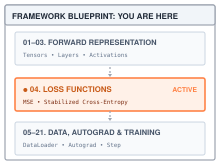
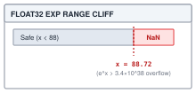
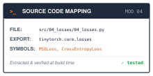

# Losses and Numerical Stability {#sec-losses}

::: {.column-margin}
{width="100%" fig-alt="TinyTorch execution datapath blueprint highlighting Module 04 Losses as the active subsystem."}

*Framework Blueprint: Module 04 evaluates network predictions against targets while guarding against numerical overflow.*
:::


A neural network produces raw, unbounded scores across possible outputs, but learning requires a scalar objective that quantifies prediction error: how far is the model's prediction from ground truth? Different learning tasks require distinct mathematical loss formulations—mean squared error for continuous regression, binary cross-entropy for probabilities, and categorical cross-entropy for multi-class classification.

From a framework and systems standpoint, a loss function is a tensor reduction operator: it ingests high-dimensional batch predictions and ground-truth targets and collapses them into a single scalar that drives gradient descent. However, implementing loss functions on physical hardware exposes the harsh reality of IEEE 754 floating-point arithmetic. Textbook mathematical formulas frequently suffer from catastrophic numerical instability:
1. **Exponential overflow**: Exponentiating large positive raw scores ($e^{1000}$) overflows float32 dynamic range to `+inf`, causing division to produce `nan`.
2. **Logarithmic underflow**: Taking the logarithm of probabilities near zero ($\log(0)$) underflows to `-inf`.
3. **Stable composition**: Computing cross-entropy through a max-shifted log-softmax, so the exponentials never overflow and the logarithm never sees zero, rather than exponentiating, normalizing, and taking a logarithm as separate steps.

This chapter constructs TinyTorch's loss library, defusing the numerical traps of cross-entropy to provide stable scalar objectives that @sec-autograd and @sec-optimizers turn into parameter updates.

@Fig-loss-stability contrasts a direct exponential with the max-shifted path. The worked trace will follow each intermediate value through the implementation.

![Stable cross-entropy on large logits. For `[1000, 1002, 1001]` and target class 1, direct float32 exponentiation overflows. Subtracting the maximum gives `[-2, 0, -1]` and a finite loss of approximately 0.4076.](assets/images/diagrams/04_losses-diag-1.svg){#fig-loss-stability fig-alt="Two paths for logits [1000, 1002, 1001] with target 1. Direct exponentiation gives infinities and NaN loss. Shifting by 1002 gives exponentials [0.1353, 1, 0.3679], sum 1.5032, and target log-probability minus 0.4076. Negation returns scalar loss 0.4076."}

---

## The Problem

::: {.column-margin}
**↩ Jump back:** @sec-activations
*Softmax normalization and the max-subtraction shift prevent catastrophic floating-point overflow.*
:::


A classifier with three classes produces three numbers. Suppose, early in training, they come out as `[100.0, 101.0, 99.0]`. The standard recipe for turning them into probabilities is to exponentiate each one and divide by the sum. Here is that recipe, verbatim, in float32.

```python
import numpy as np

z = np.array([100.0, 101.0, 99.0], dtype=np.float32)
e = np.exp(z)                # [inf, inf, inf]
print(e / np.sum(e))         # [nan nan nan]
```

::: {.column-margin}
{width="100%" fig-alt="Plot showing float32 exponent cliff where e^z overflows to infinity for z greater than 88.72."}

*In float32, $e^z$ overflows to $\infty$ at $z = 88.72$, necessitating the max-shift stabilization.*
:::

NumPy prints an overflow warning and carries on, and every probability comes out as `nan`. The reason is the range of a 32-bit float. The largest finite float32 is about $3.4 \times 10^{38}$, which is $e^{88.72}$, so `exp` of anything above 88.72 returns `inf`. The sigmoid in @sec-activations met the same wall and selected the branch whose exponent was nonpositive; this chapter applies the same idea to a whole row of numbers at once. Once one term is `inf`, the sum is `inf`, and `inf / inf` is not a number. The other direction fails just as quietly. Below about $-104$, `exp` returns an exact `0.0`, so logits of `[-1000, -1002, -1001]` give a sum of zero and `0 / 0`, which is also `nan`.

Logits of 100 are not exotic. @sec-layers showed how fast badly scaled weights inflate activations; a few layers of that and the outputs are in the hundreds. A nonfinite loss is a reason to stop and inspect the batch before updating weights. Nonfinite intermediate values can propagate into the derivatives and weight updates introduced in @sec-autograd and @sec-optimizers. The scalar alone does not tell us which intermediate first failed, so the useful debugging boundary is the input logits and the operations that turn them into a loss.

So the need is concrete. We want a loss for classification that avoids preventable overflow when the input logits and their differences are representable. Stable algebra cannot recover a value that was already converted to `inf` before the loss received it.

---

## The Idea

::: {.column-margin}
**↪ Jump ahead:** @sec-training
*How scalar loss reductions drive backward gradient propagation and parameter updates.*
:::


### A loss is one number, and lower is better

A loss function compares predictions with targets and returns an error score. The losses here are nonnegative, with smaller values indicating better agreement. MSE can reach zero exactly; classification loss approaches zero as the probability of the correct answer approaches one. For regression, where the target is a number, the natural choice is **mean squared error**:

$$\mathcal{L}_{\text{MSE}} = \frac{1}{N} \sum_{i=1}^{N} (\hat{y}_i - y_i)^2$$

Here $N$ is the number of predictions, $\hat{y}_i$ is the model's $i$-th prediction, and $y_i$ is the true value. Squaring makes the error positive and punishes large misses more than small ones. Dividing by $N$ keeps the units as squared error per prediction, so a larger batch does not automatically produce a larger loss. Different samples can still have different mean errors. `MSELoss` will be a few lines, although very large differences can still overflow when squared. Averaging also fixes the meaning of the returned number: duplicating a batch leaves its mean loss unchanged.

### Cross-entropy scores the probability of the right answer

For classification the model outputs a vector $\mathbf{z} = [z_1, \dots, z_C]$ of $C$ raw scores, one per class. These are the **logits**, and they can be any real numbers. To read them as probabilities we apply the **softmax** function:

$$p_i = \frac{e^{z_i}}{\sum_{j=1}^{C} e^{z_j}}$$

Exponentiating makes every entry positive, and dividing by the total makes them sum to one. The largest logit gets the largest probability, and the gap between logits controls how confident the distribution is; that is the "soft" in softmax.

Given the true class $t$, **cross-entropy** is the negative logarithm of the probability the model assigned to it:

$$\mathcal{L}_{\text{CE}} = -\log p_t$$

A few values make the shape of this function clear. If the model gives the right class probability 0.99, the loss is 0.01. At 0.5 it is 0.69. At 0.1 it is 2.30, and at 0.01 it is 4.61. The loss is near zero for a confident correct answer and grows without bound for a confident wrong one, which is exactly the pressure we want training to apply. Here and throughout the chapter, `log` means the natural logarithm, the inverse of the exponential. Statisticians call this quantity the negative log-likelihood,[^fn-nll-cross-entropy] and over a batch of $N$ examples we average it, for the same reason MSE divides by $N$.

[^fn-nll-cross-entropy]: **Negative log-likelihood** (NLL): the negative logarithm of the probability a model assigns to the outcome that actually occurred. For class-index targets without additional weighting or smoothing, this is the log-softmax, select, negate, and average computation implemented below.

The three loss functions in TinyTorch partition the core supervised learning workloads as summarized in @tbl-loss-taxonomy.

| Loss Class | Target Type | Input Domain | Stability Mechanism | Primary Task |
| :--- | :--- | :--- | :--- | :--- |
| `MSELoss` | Continuous $\mathbb{R}$ | Unbounded predictions | Elementwise mean | Regression |
| `BinaryCrossEntropyLoss` | Probabilities $[0, 1]$ | Probabilities in $(0, 1)$ | Epsilon clipping $[\epsilon, 1-\epsilon]$ | Binary classification |
| `CrossEntropyLoss` | Class indices $\{0, \dots, C-1\}$ | Unbounded logits $\mathbb{R}^C$ | Max-shifted log-softmax & gather | Multi-class classification |

: **Loss function taxonomy**: Architectural contracts, input domains, and numerical stabilization strategies across TinyTorch losses. {#tbl-loss-taxonomy tbl-colwidths="[22,20,22,22,14]"}

### The fix: shift before you exponentiate

Softmax has a property that saves it. Multiply the numerator and denominator by the same constant $e^{-c}$ and nothing changes:

$$p_i = \frac{e^{z_i}}{\sum_j e^{z_j}} = \frac{e^{-c} \, e^{z_i}}{e^{-c} \sum_j e^{z_j}} = \frac{e^{z_i - c}}{\sum_j e^{z_j - c}}$$

So we may subtract any constant $c$ from every logit before exponentiating, and the probabilities are identical on paper. On hardware they are not identical, and the choice $c = \max(\mathbf{z})$ is the one that makes the computation safe. After the shift, every logit is at most zero, so every $e^{z_i - c}$ is at most $e^0 = 1$ and exponentiation cannot overflow. And the largest logit becomes exactly zero, so the sum contains at least one term equal to 1 and can never be zero. Tiny terms may still underflow to `0.0`, but a term that small was contributing nothing next to a 1 anyway. Both failures in the previous section are gone.

### Take the logarithm before you divide

The loss never needs the probabilities themselves; it needs $\log p_t$. Taking the logarithm of the shifted softmax turns the division into a subtraction:

$$\log p_i = (z_i - c) - \log \sum_{j=1}^{C} e^{z_j - c}$$

The vector of all $C$ values of $\log p_i$ is the **log-softmax** of $\mathbf{z}$, and the scalar $c + \log \sum_j e^{z_j - c}$ is called the **log-sum-exp** of $\mathbf{z}$. It is a safe way to compute $\log \sum_j e^{z_j}$, and the cross-entropy loss is simply the log-sum-exp minus the target logit. That rearrangement is the algebra. The code keeps one more detail straight, which is that $z_t - c$ must be computed first, as its own small number, before the log of the sum is subtracted. The worked trace shows why, with a case where the other order is wrong in the second decimal place.

::: {#chk-loss-logsumexp-stability .callout-checkpoint title="Checkpoint: LogSumExp numerical stability invariants"}

**The invariant**: In computing $\log \sum_j e^{z_j}$, shifting by $c = \max_j(z_j)$ ensures that every exponent $z_j - c \le 0$, bounding all terms $e^{z_j - c} \in (0, 1]$. Because the maximum element produces $e^0 = 1$, the sum is guaranteed to satisfy $\sum_j e^{z_j - c} \ge 1$, completely precluding both overflow ($\infty$) and underflow to zero ($0$).

**Precision rule**: Always evaluate $(z_t - c) - \log \sum_j e^{z_j - c}$ instead of $z_t - (c + \log \sum_j e^{z_j - c})$. In float32, combining large $c$ with small log-sums obliterates low-order mantissa bits.

:::

---

## The Code

::: {.column-margin}
{width="100%" fig-alt="Source code mapping card for Module 04 Losses showing file path, exported package, and tested primitives."}

*Source Code Mapping: Module 04 extracts MSELoss, numerically stabilized CrossEntropyLoss, and BinaryCrossEntropyLoss directly from the working repository.*
:::

Module 04 follows the pattern @sec-activations set. Each loss is a pair of classes: an operation, a `Function` subclass whose `forward` takes NumPy arrays and returns a numerical result, and a thin wrapper that takes tensors and hands them to the operation through `apply`. The wrapper is what the caller uses. For `MSELoss()(predictions, targets)`, Python enters `MSELoss.__call__`, which calls `forward`, which delegates to `MSEFunction.apply`. That shared method passes the tensors' arrays to `MSEFunction.forward` and wraps its numerical result in a `Tensor`. @sec-autograd will add the record of how the result was computed and the derivative rules that use it.

### A loss is one scalar in a `Tensor`

The loss is the boundary between scoring predictions and deciding how to improve them. This module chooses a scalar mean as the objective. A vector of per-example losses could also be useful, but a caller would then have to specify how to combine or weight its entries. Returning the mean makes that choice explicit once and gives the later training loop a consistent starting point. No call to `backward()` is needed to inspect that contract here.

The cheaper thing to return would be a bare Python float, and for this chapter a float would work. It stops working in @sec-autograd, where `backward()` walks from the loss back through every operation that produced it, and a float has no place to record where it came from. So every loss returns a `Tensor` holding a single value, and `apply` guarantees it: whatever the operation's `forward` returns, even a NumPy scalar, comes back wrapped. `MSELoss` is the smallest pair that satisfies the contract.





The output has shape `()`, NumPy's shape for a scalar. The loss object has no learned parameters or running statistics. Subtraction, squaring, and averaging create results without changing either input array; another loss can safely score the same predictions. @sec-autograd will use this scalar tensor as the starting point for computing derivatives. Notice that `np.mean` averages *all elements*. For predictions and targets of shape `(B, D)`, it divides by `B * D`, not just by `B`. The intended contract is matching shapes; a target of shape `(B,)` against predictions `(B, 1)` would broadcast into `(B, B)` before the mean and score the wrong pairs. The function rejects mismatched or empty shapes before subtraction, so NumPy cannot silently turn this mistake into a different objective. The caller can therefore rely on one scalar mean over corresponding elements, or an error explaining that the input shapes do not match.

### `LogSoftmax`, the max shift in code

For a batch with shape `(2, 3)`, each row holds three class scores. The loss must normalize each row separately: the first example's scores must not affect the second example's probabilities. Later classifiers will increase the number of rows and classes, but this row-wise computation stays the same.

The naive way first computes `e = np.exp(z)`, then `np.log(e / np.sum(e))`. The Problem showed the loud failure, `nan` for any logit past 88.7. There is a quiet one too. Even when nothing overflows, a probability that underflows to `0.0` goes into `log` and comes out `-inf`. In float32, `log(softmax([-110, 0]))` prints `[-inf, 0.]`, where the stable log-probabilities round to `[-110, 0]`; the naive form has thrown away a perfectly finite number. The composition also creates separate intermediate arrays for exponentiation, division, and logarithms.

The fix is The Idea's two moves, in that order. Subtract each row's maximum, so every exponential is at most 1 and every sum is at least 1. Then take the log of the sum and subtract it from the shifted logits, so no probability is ever formed and nothing is ever divided. The operation normalizes along the selected axis `dim` and returns log-probabilities of the same shape. For `(N, C)` classification scores, `dim=-1` selects the class axis; a one-line function wraps it for callers holding a `Tensor`.





Notice two things. The `keepdims=True` keeps the per-row maximum as a column of shape `[N, 1]` rather than a flat vector of length `N`, so that subtracting it from the `[N, C]` logits lines up one maximum with each row; that is the broadcasting rule from @sec-tensors doing the work. And the last line is `x - max_vals - log_sum_exp`, which Python evaluates left to right, so the shift happens first and the log of the sum is subtracted from a number that is already small. Written as `x - (max_vals + log_sum_exp)` it would be equal on paper and wrong in float32, for the reason the trace makes visible. The maximum and the logarithm of the sum have shape `(N, 1)`; the shifted logits and the returned log-probabilities have shape `(N, C)`. `log_softmax(x, dim)` passes the axis through `apply`, which stores it on the new operation as `self.dim` before calling `forward`. No input is overwritten.

### `CrossEntropyLoss` gathers instead of multiplying

Labels identify classes by index: with three classes, each target must be 0, 1, or 2. @sec-dataloader will build the loader that keeps these labels paired with the corresponding inputs. With log-probabilities in hand, the loss has to pick, for row `i`, the entry in column `target[i]`, negate it, and average over the batch.

The textbook formula does not say "pick." It says $-\sum_i y_i \log p_i$, where a one-hot[^fn-one-hot-targets] target puts a 1 at the correct class and zeros elsewhere. For target class 2 among three classes, that vector is `[0, 0, 1]`. Multiplying by it retains only the third log-probability. Build an `[N, C]` matrix of zeros with a single 1 per row, multiply it into the log-probabilities elementwise, and sum across columns. That is $N \times C$ multiplications to keep $N$ numbers. For our `(2, 3)` batch, targets `[0, 1]` would become `[[1, 0, 0], [0, 1, 0]]`: six entries and six multiplications to keep just two numbers. Can we select the two entries directly?

NumPy can. Indexing an array with two integer arrays of the same length pairs them up elementwise, so `log_probs[np.arange(N), target_idx]` pairs row `i` with column `target_idx[i]` and selects `N` entries into a new vector of shape `(N,)`. For `N=2` and targets `[0, 1]`, the pairs are `(row 0, column 0)` and `(row 1, column 1)`. Computing the log-probabilities still visits all `N*C` logits; the saving is in target storage and the selection step.

{#fig-index-gather-memory fig-alt="Left panel shows wasteful dense one-hot matrix multiplication allocating B by C elements. Right panel shows direct sparse index gathering indexing row pointers directly."}





Targets represent integer class IDs, but their storage is float32: `Tensor([0, 1])` contains `[0.0, 1.0]`. `targets.astype(int)` creates the integer array required by the gather. The expected shape is `(N,)`, paired with logits of shape `(N, C)`. Before conversion, the operation checks that the original labels are finite whole numbers and rejects IDs outside the class range. Nothing builds a one-hot matrix merely to multiply most of it by zero. The range check exists because NumPy treats a negative index as counting from the end, so a corrupted label of `-1` would silently select the last class instead of failing. After validation and conversion, the operation calls `LogSoftmax().forward` on the array directly. Calling the tensor wrapper here would add an unnecessary Tensor boundary inside an array computation. The selected log-probabilities form a temporary `(N,)` vector; negating its mean returns a scalar to `apply`, which wraps it for the caller. This forward method does not cache the log-probabilities or change the logits or targets. @sec-autograd will add a derivative rule that recomputes the probabilities from the saved inputs.

[^fn-one-hot-targets]: **One-hot**: a vector with a 1 in the position of the correct class and 0 everywhere else, so a label of class 2 among 5 classes becomes `[0, 0, 1, 0, 0]`. For a batch of $N$ examples it takes $N \times C$ numbers to store what $N$ integers already say, which is why the code indexes with the integers instead.

### `BinaryCrossEntropyLoss`, finite logs through clipping

The binary loss has a different input contract. With probabilities `[0.9, 0.2]` and targets `[1, 0]`, the first example contributes `-log(0.9)` and the second contributes `-log(0.8)`. Their mean is about `0.1643`. A single formula handles both cases: `-(y*log(p) + (1-y)*log(1-p))`. Target 1 keeps the first term; target 0 keeps the second.



The first check rejects mismatched or empty shapes. The next checks require finite probabilities and targets in `[0, 1]`; intermediate target values are allowed, and weight the two logarithms accordingly. `np.clip` then creates a new probability array bounded by `1e-7` and `1-1e-7`, leaving the input unchanged.[^fn-bce-clipping] Both `p` and `1-p` are positive at the logarithms. The two logged arrays and `bce_per_sample` have the input shape, and `np.mean` reduces every element to one scalar, including every output in a `(B, D)` input.

[^fn-bce-clipping]: In exact real analysis, $\lim_{p \to 0^+} p \ln p = 0$. In IEEE 754 floating-point hardware, however, $\ln(0.0) = -\infty$, and the arithmetic expression $0.0 \times (-\infty)$ evaluates immediately to $\text{NaN}$. Bounding $p \in [\epsilon, 1-\epsilon]$ guarantees strictly positive arguments to $\ln(\cdot)$ and finite intermediate values.



The wrapper follows the same path as MSE: `__call__` delegates to `forward`, which enters the operation through `apply` and returns the wrapped scalar. Clipping keeps boundary inputs finite but makes the loss constant beyond its thresholds: predictions `4e-8` and `6e-8` against target 1 both produce about `16.1181`. Increasing the confidence of that wrong prediction no longer changes its score. @sec-autograd will differentiate this actual clipped function, including its flat regions. Cross-entropy on logits avoids this probability-clipping limit by retaining the target's log-probability directly.

### Checking the scalar contract

Here is a short run of MSE and cross-entropy, on numbers small enough to check by hand. I keep a run like this next to every loss I write, because a loss that returns a plausible-looking wrong number is the kind of bug that trains for a week before anyone notices.

```python
import numpy as np
from tinytorch.core.tensor import Tensor
from tinytorch.core.losses import MSELoss, CrossEntropyLoss

logits = Tensor(np.array([[2.0, 1.0, 0.1],
                          [0.5, 1.5, 0.8]], dtype=np.float32))
targets = Tensor(np.array([0, 1]))
loss = CrossEntropyLoss()(logits, targets)
print(f"cross-entropy: {loss.data:.4f}")   # 0.5200
print("shapes:", logits.shape, targets.shape, loss.shape)  # (2, 3) (2,) ()
repeated = CrossEntropyLoss()(
    Tensor(np.concatenate([logits.data, logits.data])),
    Tensor(np.concatenate([targets.data, targets.data])),
)
assert np.allclose(repeated.data, loss.data)  # the objective is a mean

preds = Tensor(np.array([1.0, 2.0, 3.0], dtype=np.float32))
truth = Tensor(np.array([1.5, 2.5, 2.8], dtype=np.float32))
print(f"mse: {MSELoss()(preds, truth).data:.4f}")  # 0.1800
```

The shape print follows the interface through the call: two rows of class scores and two IDs become a scalar with shape `()`. Duplicating both inputs leaves that scalar unchanged, checking the reduction independently of the softmax arithmetic. The MSE value is $(0.5^2 + 0.5^2 + 0.2^2) / 3 = 0.18$. The cross-entropy value comes from the row-by-row trace that follows.

---

## A Worked Trace

@Tbl-losses-ce-trace takes the first row of the batch above, logits $\mathbf{z} = [2.0, 1.0, 0.1]$ with target $t = 0$, and follows it through `LogSoftmax.forward` one line at a time.

| Step | Computation | Value |
| :--- | :--- | :--- |
| 1. Row maximum | $c = \max(\mathbf{z})$ | $2.0$ |
| 2. Shift | $\mathbf{z} - c$ | $[0.0, -1.0, -1.9]$ |
| 3. Exponentiate | $e^{\mathbf{z} - c}$ | $[1.0000, 0.3679, 0.1496]$ |
| 4. Sum | $\sum_j e^{z_j - c}$ | $1.5174$ |
| 5. Log of the sum | $\log 1.5174$ | $0.4170$ |
| 6. Log-probabilities | $(\mathbf{z} - c) - 0.4170$ | $[-0.4170, -1.4170, -2.3170]$ |
| 7. Pick target, negate | $-\log p_0$ | $0.4170$ |

: Hand trace of `log_softmax` and `CrossEntropyLoss` on one row of logits $[2.0, 1.0, 0.1]$ with target class 0. {#tbl-losses-ce-trace tbl-colwidths="[24,36,40]"}

Exponentiating the log-probabilities gives the probabilities $[0.659, 0.242, 0.099]$, which sum to one as they must. The model puts 66 percent on the right class and pays a loss of 0.417 for its remaining doubt. The second row, $[0.5, 1.5, 0.8]$ with target 1, works through the same steps to a loss of 0.623, and the batch mean is $(0.417 + 0.623) / 2 = 0.520$, which matches the printed value.

The same seven steps on the logits that broke the naive formula show the shift doing its job. With $\mathbf{z} = [1000, 1002, 1001]$ and $t = 1$, the naive and stable paths diverge at the very first exponential.

| Step | Naive softmax | Max-shifted log-softmax |
| :--- | :--- | :--- |
| Exponentiate | $e^{1000}, e^{1002}, e^{1001} \to$ `inf` | $c = 1002$, shifted $[-2, 0, -1]$, $e^{\cdot} = [0.1353, 1.0, 0.3679]$ |
| Sum | `inf` | $1.5032$ |
| Normalize or take log | `inf / inf` $=$ `nan` | $\log 1.5032 = 0.4076$ |
| Loss | $-\log($`nan`$) =$ `nan` | $-(0 - 0.4076) = 0.4076$ |

: The naive and max-shifted paths on the extreme logits $[1000, 1002, 1001]$ with target class 1. {#tbl-lse-trace tbl-colwidths="[22,34,44]"}

@Tbl-lse-trace shows that the shifted exponential stage handles only values between 0.1353 and 1, and the answer, 0.4076, is the same loss the row would have if all three logits were 998 smaller. That is the shift invariance from The Idea, now visible as arithmetic.

One last detail hides in the final row. The loss can be written as $\text{LSE}(\mathbf{z}) - z_t = 1002.4076 - 1002$, or as $-((z_t - c) - \log\text{sum}) = -(0 - 0.4076)$. On paper these are equal. In float32 they are not, because a float32 carries about seven significant digits, and $1002.4076$ has already spent four of them on the integer part. Adding $1002$ to $0.4076$ and then subtracting $1002$ throws away the digits that matter.

::: {.content-visible when-format="pdf"}
```{=latex}
\newpage
```
:::

```python
import numpy as np

for base in (1e3, 1e6):
    z = np.array([base, base + 2.0, base + 1.0], dtype=np.float32)
    c = np.max(z)
    log_sum = np.log(np.sum(np.exp(z - c)))     # 0.40760596 in every case
    lse_first = (c + log_sum) - z[1]            # big numbers first
    shift_first = log_sum - (z[1] - c)          # small numbers first
    print(f"logits near {base:.0e}: {lse_first:.6f} vs {shift_first:.6f}")
# logits near 1e+03: 0.407593 vs 0.407606
# logits near 1e+06: 0.437500 vs 0.407606
```

In the snippet above, line 4 constructs test logits with large baseline magnitudes ($10^3$ and $10^6$), and line 5 finds the row maximum $c$. Line 6 computes the stabilized log-sum of exponents. Line 7 evaluates the naive arithmetic ordering `lse_first = (c + log_sum) - z[1]` ("big numbers first"), while line 8 computes TinyTorch's stabilized formulation `shift_first = log_sum - (z[1] - c)` ("small numbers first").

As reported by line 9 in the trailing comments (lines 10--11), at logits near a thousand the error already corrupts the fifth decimal place. At logits near a million, where float32 can only represent multiples of 0.0625, the "big numbers first" form is off by 0.03---a 7 percent error in the loss---while the stabilized form remains accurate to six digits. This is why `LogSoftmax` subtracts the maximum before the log of the sum and why `CrossEntropyFunction` gathers from that array rather than computing the log-sum-exp as a separate scalar. Overflow is the loud failure; loss of precision is the quiet one, and the same subtraction order fixes both.

---

## From TinyTorch to Production

For ordinary class-index targets, PyTorch's `nn.CrossEntropyLoss` implements the same objective as the listing: log-softmax followed by target selection and reduction. Its API also accepts class weights, ignored labels, smoothed labels, and probability targets. Those options change how class or sample contributions are combined; probability targets require a weighted sum across classes. [PyTorch CrossEntropyLoss reference](https://docs.pytorch.org/docs/2.14/generated/torch.nn.CrossEntropyLoss.html).

The input distinction is easy to test before training. For logits `[10, 0]` and target 0, the loss is about `0.0000454`. Passing their softmax probabilities, approximately `[0.999955, 0.0000454]`, to the same loss makes it interpret those two probabilities as new logits and produces about `0.3133`. Both calls return plausible finite numbers, but they score different distributions. A classifier using this loss should therefore return raw logits.

The NumPy listing exposes the memory work as well as the arithmetic. It computes a row maximum, allocates shifted logits, exponentiates them, sums along the class axis, and forms the final log-probabilities with two subtractions. The elementwise results have the size of the logits; the row reductions are smaller. The implementation even evaluates `x - max_vals` again in its final expression. These allocations and repeated reads are visible costs, although source inspection alone does not establish which cost dominates elapsed time on a particular machine.

A production **fused kernel** combines several array operations into one device routine. Instead of writing every intermediate array to the device's main memory and reading it back, it can retain intermediate values in smaller, faster local storage. The Triton softmax tutorial demonstrates this for rows that fit locally. It still writes the output; fusion does not mean no allocation or unlimited local capacity. @sec-acceleration will examine how to combine operations this way. [Triton fused-softmax tutorial](https://triton-lang.org/main/getting-started/tutorials/02-fused-softmax.html).

::: {#psp-fused-cross-entropy .callout-perspective title="Systems Perspective: Fused cross-entropy in large vocabulary models"}

**The vocabulary VRAM bottleneck**: In modern LLMs (such as TinyGPT or LLaMA), vocabulary size $V$ ranges from $32{,}000$ to $128{,}000$. For batch size $B=16$ and sequence length $S=2048$, allocating an un-fused FP32 logits tensor of shape $(B, S, V)$ requires:

$$16 \times 2048 \times 32{,}000 \times 4\text{ bytes} \approx 4.19\text{ GB}$$

Materializing separate intermediate tensors for shifted logits, exponentials, and log-softmax can consume over $16\text{ GB}$ of VRAM just to compute the loss!

**Online LogSumExp fusion**: Production engines (such as Flash-Cross-Entropy or Triton kernels) stream through the vocabulary directly from the final linear layer projection, computing the running maximum and LogSumExp in fast GPU registers (SRAM) without ever materializing the massive $(B, S, V)$ logit tensor in DRAM.

:::

The reason to care about full-size intermediates becomes clear with a storage calculation. Suppose a text model scores 8,192 positions against 32,000 possible tokens, where a token is one piece of text selected from a vocabulary. One float32 logits array holds $8{,}192 \times 32{,}000 = 262{,}144{,}000$ values, or $1{,}048{,}576{,}000$ bytes, about 1.05 GB. Another intermediate of the same shape needs that much storage again. These are array sizes, not measurements of peak memory: the peak depends on which arrays coexist and how the implementation reuses storage. The earlier gather avoids a one-hot target array of this size, while normalization still processes every class score.

Precision is a separate concern. A narrow floating-point format stores fewer significant digits and may have a smaller range. The max shift protects the exponential arguments, but it cannot restore information lost before the loss receives its logits. PyTorch's CUDA autocast mode, which selects arithmetic types for eligible operations, runs eligible `softmax`, `log_softmax`, and `cross_entropy` calls in float32. That policy applies within the specified execution context; it is not a promise about every backend or explicitly typed call. TinyTorch uses float32 tensors throughout. [PyTorch autocast operation reference](https://docs.pytorch.org/docs/2.14/amp.html#cuda-ops-that-can-autocast-to-float32).

| | TinyTorch | PyTorch |
| :--- | :--- | :--- |
| Input | Logits, shape `[N, C]` | Logits, shape `(N, C)` or with extra spatial dimensions |
| Targets | Integer class indices | Indices or class probabilities; `ignore_index`, `label_smoothing`, class weights |
| Stability | Max shift inside `log_softmax` | Same |
| Passes over the logits | Separate reductions and elementwise passes; several full-size temporaries | Specialized kernels can reduce memory traffic |
| Precision | float32 throughout | Eligible loss calls promoted under CUDA autocast |

: What carries over from the TinyTorch loss to `torch.nn.CrossEntropyLoss` and what production adds. {#tbl-losses-tinytorch-vs-pytorch tbl-colwidths="[22,34,44]"}

@Tbl-losses-tinytorch-vs-pytorch summarizes the interface and execution differences. Three checks carry over. Pass logits to cross-entropy and check the shape and label range before tuning training. Keep the calculation in log-space, so an underflowed probability cannot become an infinite loss. Finally, compare with a uniform baseline: equal logits assign each class probability $1/C$, giving loss $\log C$, about 2.30 for ten classes. Random initialization need not produce exactly equal logits, but this baseline gives the returned number a useful scale. Agreement with that baseline does not prove that labels and predictions are paired correctly. A large or nonfinite loss calls for inspecting both the logits and the target contract before changing the optimizer.

---

## Summary

A caller enters a loss wrapper with predictions and targets and receives a scalar `Tensor` with shape `()`. MSE checks matching, nonempty shapes and averages squared differences over every element. Cross-entropy checks `(N, C)` logits and `(N,)` class indices, computes row-wise log-probabilities, selects one value per row, and returns their negative mean. Neither forward computation changes its inputs. Binary cross-entropy accepts probabilities instead and clips them before taking logarithms, creating flat regions near the endpoints.

The numerical invariant is the max shift: for representable finite differences, every shifted logit is nonpositive and at least one is zero. Exponentials are therefore at most 1, and their row sum is at least 1. Keeping the target log-probability in log-space also avoids taking `log(0)`. The precision trace adds an ordering rule: compute `x - max_vals` before subtracting the log of the sum. Production implementations can reduce memory traffic while preserving this objective. @sec-dataloader now asks where the matched batches come from and how to assemble them without losing the pairing between each prediction's input and its label.

---

## Further reading

- Lin et al. (2017), [Focal loss for dense object detection](https://arxiv.org/abs/1708.02002), *ICCV*. A reshaped cross-entropy that shows how the choice of loss changes which examples drive the gradient.
- Müller, Kornblith, and Hinton (2019), [When does label smoothing help?](https://arxiv.org/abs/1906.02629), *NeurIPS*. What happens to cross-entropy's targets and to the learned representation when the one-hot label is softened.

## Exercises

1. **Trace the contract.** Change the worked batch targets from `[0, 1]` to `[2, 0]`. Predict which two log-probabilities the gather selects, calculate their negative mean, then check with `CrossEntropyLoss`. Save copies of both input arrays and verify that the call leaves them unchanged. Finally try targets shaped `(2, 1)`, a fractional label, and an empty batch. Explain which check rejects each input.
2. **Binary cross-entropy with logits.** For one logit $z$, the sigmoid is $\sigma(z)=1/(1+e^{-z})$. Rewrite $-y\log\sigma(z)-(1-y)\log(1-\sigma(z))$ using $\text{softplus}(z)=\log(1+e^z)$, then make softplus safe with the max-shift idea. Test logits `-100`, `0`, and `100` with both binary labels. Compare the real module's clipped probability loss at predictions 0 and 1. Compute both caps in float32 rather than assuming that rounding makes them equal, then test `4e-8` and `6e-8` with target 1 to identify the flat region.
3. **Label smoothing.** A smoothed target distributes a small amount of probability over all classes: $y_i^{\text{smooth}}=(1-\epsilon)y_i+\epsilon/C$, with $0<\epsilon<1$. For three classes, target 0, and $\epsilon=0.1$, write down all three target probabilities and check that they sum to one. Compute the weighted sum of negative log-probabilities and extend `CrossEntropyLoss` to reproduce it. Show why driving the incorrect classes' probabilities to zero now increases the loss. Does adding the same constant to every logit change anything?
4. **Temperature and input precision.** A temperature $T>0$ scales logits as `z / T` before softmax. Predict the limiting probabilities as $T$ approaches zero or grows very large, including a tie for the maximum. Check with `log_softmax`. Then use float32 logits `[1e38, 1e38]` and `T=0.1` to compare dividing first with subtracting the maximum first. Explain why the loss cannot repair infinities introduced before it is called.
