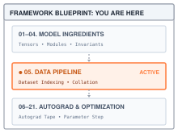
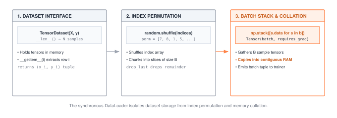
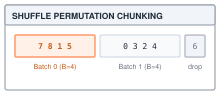
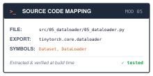

# Data Loading and Batching {#sec-dataloader}

::: {.column-margin}
{width="100%" fig-alt="TinyTorch execution datapath blueprint highlighting Module 05 DataLoader as the active subsystem."}

*Framework Blueprint: Module 05 feeds the compute engine by batching, shuffling, and collating samples into contiguous memory.*
:::


Training neural networks with Stochastic Gradient Descent (SGD) requires balancing gradient accuracy with computational tractability. Computing the true gradient across an entire dataset of millions of samples is computationally prohibitive and prone to trapping models in sharp local minima. Conversely, updating parameters on single samples produces high-variance, noisy gradient trajectories. Mini-batching resolves this tension: it yields stable empirical gradient estimates while random shuffling breaks autocorrelation between consecutive training steps.

From a systems and framework perspective, the data ingestion pipeline is often the primary bottleneck of modern deep learning. Processors and accelerators spend immense time starved of operands if data loading cannot continuously saturate the memory bus. An ML framework must address three core architectural responsibilities:
1. **Separation of concerns**: Decouple dataset storage and random-access sample indexing (`Dataset`) from batching, shuffling, and memory collation logic (`DataLoader`).
2. **Memory packing and tensor collation**: Pack individual scattered samples into contiguous, row-major tensor batches $(B, \dots)$ that modern BLAS and GEMM compute kernels require for high throughput.
3. **Epoch orchestration**: Generate deterministic random permutation arrays to ensure reproducible shuffling, and handle edge-case boundary conditions such as remainder batches (`drop_last`).

This chapter builds TinyTorch's data loading pipeline, establishing the contiguous batch stream that feeds the forward passes of @sec-layers and powers the end-to-end training loop in @sec-training.

{#fig-dataloader-pipeline fig-alt="Dataset interface and TensorDataset feed DataLoader index selection, followed by synchronous sample retrieval and stacking, then a training loop."}

---

## The Problem

::: {.column-margin}
**↩ Jump back:** @sec-tensors
*Batch collation packs scattered dataset samples into contiguous row-major tensor batches.*
:::


Suppose the training data is a list of samples and the labels arrive sorted by class. The obvious loop feeds them one at a time, in file order:

```python
samples = [([i, i + 0.5], 0 if i < 5 else 1) for i in range(10)]   # x_i, y_i

for x, y in samples:          # one sample per step, in stored order
    pass                      # forward(x), loss(y), update
```

This loop misses two opportunities: sharing work across samples and mixing classes within each batch.

The first is waste. @sec-layers built `Linear.forward` as a matrix multiply on a $(B, D)$ input, and every call carries setup work, including Python dispatch and entering the array operation. Some of that cost is paid regardless of $B$, while the result size and numerical work grow with the batch. At $B = 1$ that fixed cost is paid once per sample. At $B = 64$ it is paid once per 64 samples, and the arithmetic itself is the same. Feeding one row at a time throws away the batching that the whole forward pass was designed around.

The second is bias. Group the loop above into fours and look at the labels each group carries:

```python
batches = [samples[i:i + 4] for i in range(0, 10, 4)]
print([[y for _, y in batch] for batch in batches])
# [[0, 0, 0, 0], [0, 1, 1, 1], [1, 1]]
```

The first batch is entirely class 0. Its loss measures only performance on that class, so using it to guide an update gives no information about class 1. Long runs of one class can pull the model toward recent samples and away from earlier ones. @sec-autograd and @sec-optimizers will explain how a loss determines an update. For now, the problem is visible in the labels alone: each successive batch presents a different part of the task. Disk-backed samples add a separate cost, the wait for reading and decoding, which the production section returns to.

::: {#nbk-dataloader-bandwidth-starvation .callout-notebook title="Napkin Math: DataLoader throughput and GPU starvation"}

**Problem**: An accelerator consumes batches of size $B=64$ with $D=768$ float32 values every $2.5\text{ ms}$ ($400\text{ steps/s}$). What host data bandwidth is required to prevent GPU starvation?

**Data consumption rate**:
$$\text{Batch size} = 64 \times 768 \times 4\text{ bytes} = 196{,}608\text{ bytes} \approx 192\text{ KB}$$
$$\text{Throughput} = 196{,}608\text{ bytes} \times 400\text{ steps/s} \approx 78.6\text{ MB/s}$$

**The I/O bottleneck**: If samples are read individually from non-contiguous storage (random SSD reads at $0.1\text{ ms}$ per sample), loading $64$ samples sequentially takes $64 \times 0.1\text{ ms} = 6.4\text{ ms}$, starving the $2.5\text{ ms}$ GPU step and dropping GPU utilization to $\frac{2.5}{2.5 + 6.4} \approx 28\%$.

:::

---

## The Idea

::: {.column-margin}
**↪ Jump ahead:** @sec-training
*The DataLoader mini-batch stream powers the unified five-step training execution loop.*
:::


The separation in @tbl-data-pipeline-layers lets sample access and batching change independently. The order policy determines which samples share a batch.

| Role | Question it answers | Interface |
| :--- | :--- | :--- |
| **Dataset** | How many samples are there, and what is sample $i$? | `__len__()` returns $N$; `__getitem__(i)` returns $(\mathbf{x}_i, y_i)$ |
| **Order** | In what sequence are the indices visited? | A list of the integers $0$ through $N-1$, optionally shuffled once per epoch |
| **DataLoader** | How do $B$ consecutive samples become one tensor? | Walks the order in strides of $B$, stacks each stride into $(B, D)$ |

: The three roles of a data pipeline. Each one can be replaced without touching the other two. {#tbl-data-pipeline-layers tbl-colwidths="[18,42,40]"}

A **Dataset** is any object that can count itself and answer index lookups. It knows nothing about batches or order. That is what makes the split useful. A dataset of ten rows in memory and a dataset of ten million images on disk present the same two methods, and the loader on top of them does not change.

An **epoch** is one complete pass over the dataset, every sample visited exactly once. At the start of each pass the loader writes down the indices $0, 1, \dots, N-1$ and, when `shuffle=True`, shuffles them. The shuffled list is a **permutation**, written $\pi$, of the indices. Position $k$ of the epoch visits sample $\pi(k)$, and because $\pi$ is a rearrangement rather than a redraw, every index appears exactly once. This is sampling *without replacement*. Drawing indices at random *with* replacement would visit some samples twice and others not at all in a given epoch, and the loss would be tuned to whichever samples happened to be drawn more often.

::: {.column-margin}
{width="100%" fig-alt="Index permutation array being shuffled and chunked into mini-batch slices of size B."}

*Index permutation $\pi$ is shuffled each epoch and sliced into non-overlapping mini-batches of size $B$.*
:::

Shuffling removes the fixed class ordering. Under an ideal uniform shuffle, a batch at a fixed position is a uniformly selected subset of the dataset. Write $\ell_i$ for the loss on sample $i$ and $\mathcal{B}$ for the set of $B$ indices in one batch. The batch loss is the average $\frac{1}{B}\sum_{i \in \mathcal{B}} \ell_i$. For example, with losses `[1, 3, 5]` and batch size two, the possible subset means are 2, 3, and 4. Their average is 3, the full-dataset mean. The symbol $\mathbb{E}$ expresses this average over possible selections. For a uniform subset,

$$\mathbb{E}\left[\frac{1}{B}\sum_{i \in \mathcal{B}} \ell_i\right] = \frac{1}{N}\sum_{i=1}^{N} \ell_i,$$

with model parameters held fixed. Actual training changes the parameters between batches, and batches from one permutation are dependent because samples are not repeated. The equation therefore describes a sampling property, not a promise of independent updates or balanced classes in every batch. The worked trace includes an all-zero-label batch even after shuffling.

::: {#chk-dataloader-epoch-invariants .callout-checkpoint title="Checkpoint: DataLoader epoch invariants"}

**Invariant 1: Exact coverage**: Under `shuffle=True`, the loader constructs a permutation $\pi \in S_N$. Across all $\lceil N/B \rceil$ batches, every sample $i \in \{0, \dots, N-1\}$ is visited exactly once per epoch without replacement.

**Invariant 2: Alignment**: Collation must never detach inputs from targets. Row $k$ of batch feature tensor $\mathbf{X}$ must correspond strictly to index $k$ of batch label tensor $\mathbf{Y}$.

:::

Batching fixes the waste problem, and the operation that does it is **collation**: take $B$ samples, each a tensor of shape $(D,)$, and stack them into one tensor of shape $(B, D)$. The rows do not have to come from adjacent places in the dataset; the copy is what makes them adjacent in memory. In this implementation, sample retrieval and tensor construction also copy. Following those calls in the next section separates the necessary collation step from the wrapper's additional allocations.

---

## The Code

::: {.column-margin}
{width="100%" fig-alt="Source code mapping card for Module 05 DataLoader showing file path, exported package, and tested primitives."}

*Source Code Mapping: Module 05 extracts Dataset sample indexing, DataLoader shuffling, and batch collation directly from the working repository.*
:::

The listings use the copying `Tensor` constructor from @sec-tensors. Reading a row and constructing a batch both create fresh input tensors for the model. These copies do not connect the batch back to its source tensor for differentiation; @sec-autograd will distinguish data preparation from recorded model operations. Read the code in the order one request executes: `__iter__` chooses indices, `TensorDataset.__getitem__` returns samples, and `_collate_batch` groups and stacks their fields.

### The dataset contract

Start with what the rest of the framework needs from a dataset. The training loop we write in @sec-training says `for x, y in loader`, and it should say exactly that whether the samples are ten rows in a Python list, sixty thousand handwritten digits in one array in RAM, or ten million JPEG files on disk that each have to be decoded. The model, the loss, and the loop must not change when the data does.

The naive design bakes the data source into the loader, so a loader for in-memory arrays and a loader for image folders become two classes with two copies of the batching logic. So the contract is two methods, `__len__` and `__getitem__`, and nothing else, and Module 05 writes it down as an abstract base class so that forgetting one of them fails at construction rather than in the middle of an epoch.



`TensorDataset` is the dataset for data that is already in memory. It holds any number of tensors that agree on their first dimension, and sample $i$ is row $i$ of each of them.



Look at what `__getitem__` costs. `tensor.data[idx]` is NumPy row indexing, which is a view, the zero-copy trick from @sec-tensors; then `Tensor(...)` wraps it, and @sec-tensors's constructor copies. So fetching a sample copies its $D$ floats into a fresh tensor, 784 floats for a digit, about 3 KB. Module 05 accepts that copy on purpose. The copied sample can be modified without changing the stored dataset. That ownership rule is simple to inspect, but the copy can matter when lookup itself is cheap, as it is for this in-memory dataset. Notice the negative-index handling, which mirrors Python lists so that `dataset[-1]` is the last sample, and the tuple return, which is why the loop can unpack `x, y` without the loader knowing there are two of them. The loader only needs indexed access, even though `TensorDataset` also holds references to the source tensors in its `tensors` attribute. The order of visits is someone else's decision.

### Collation

Now the other side of the contract. `Linear.forward` from @sec-layers computes `x.matmul(W)`, and its input needs a batch dimension. Our loader produces a contiguous array, with row $i$ at positions $iD$ through $iD + D - 1$ and element strides $(D, 1)$. NumPy can multiply strided arrays too; the need here is to assemble separate sample buffers into one array. What the dataset hands us is $B$ separate small tensors, each in its own buffer. Four samples drawn as 7, 8, 1, 5 live in four unrelated allocations. No stride trick makes four buffers look like one $(4, 2)$ tensor.

The naive way is to skip the batch and call `forward` four times, once per sample. That pays the per-call fixed cost from The Problem four times over and leaves us averaging four separate losses by hand, which is the $B = 1$ loop we set out to escape.

Collation allocates a buffer and places each sample's values in its row. `np.stack` performs that step. The next line, `Tensor(batched_data)`, copies the stacked array again. Including `TensorDataset.__getitem__`, each feature value is copied three times on this path: into a sample tensor, into the stacked array, and into the returned batch tensor. For `B` samples of `D` features, that is `3 * B * D` copied values, excluding labels and other fields. This counts work; it does not compare elapsed copy time with matrix arithmetic. The extra copies are the cost of applying the same ownership rule at each boundary.



`np.stack(..., axis=0)` allocates a `(B, D)` array and writes each sample's row at offset $iD$, which is the stride equation from @sec-tensors with strides $(D, 1)$ carried out in C. The method groups by position first, so a dataset that returns `(x, y)` yields one stacked `X` and one stacked `Y`, and a dataset that returns three tensors per sample yields three batches, without the loader having to know. Every sample must have the same number of tensor fields, and the shapes at each field position must agree for `np.stack` to succeed. Variable-length sequences require a dataset that pads them to a common length, or a different collation policy.

{#fig-dataloader-copies-pipeline fig-alt="DataLoader memory lifecycle showing Dataset in RAM, sample Tensor retrieval, np.stack contiguous collation, and batch Tensor construction."}

### The loader

The last piece owns the order. @sec-training's loop is going to read `for epoch in range(E): for x, y in loader:` and expect two things from that inner line, a fresh shuffle when enabled and one batch at a time.

The naive way to get batches is to build them all up front, shuffle the dataset once, cut it into $\lceil N/B \rceil$ tensors, and hand back the list. That list is a second copy of the whole dataset sitting next to the first, another 47 million floats in the 60,000 by 784 case, and it has to be rebuilt every epoch. The naive way to get a random order is worse. Draw $N$ indices at random with replacement and roughly a third of the samples never come up in that epoch, because the chance that a particular index is missed in $N$ draws tends to $1/e$ as $N$ grows.

The generator instead holds one list of $N$ indices, along with the samples for the batch it is preparing. With shuffling enabled, it rearranges that list in place at the start of each pass, walks it in strides of $B$, and asks the dataset for the samples of one stride only when the loop reaches it. The index list costs memory proportional to the dataset length, even with `shuffle=False`. A Python list stores references to integer objects, not packed eight-byte integers. On typical 64-bit CPython, approximately 8 bytes per reference plus 28 bytes per integer gives about 3.6 MB for 100,000 indices, excluding small list overhead; runtime object sizes can differ. The sampled tensors and stacked arrays add temporary storage proportional to a batch, while the dataset itself remains wherever its implementation stores it. No list of all collated batches is built.

One detail remains. Unless $B$ divides $N$, the last stride is short. With $N = 10$ and $B = 4$ the batches have 4, 4, and 2 samples, so an epoch has $\lceil N / B \rceil = 3$ batches. In integer arithmetic that ceiling is `(N + B - 1) // B`. The short batch is real data, and dropping it would mean those samples are never seen in that epoch; the loader keeps it, and the layers handle the smaller $B$ because nothing in `Linear.forward` assumed a particular batch size.



Two things to notice. First, `__iter__` is a generator, so the index list is rebuilt and the permutation drawn fresh every time a `for` loop starts over the loader; that is what "shuffle once per epoch" means in code, and it is how @sec-training can request a fresh shuffle on each pass through its outer loop. Creating the generator does not execute its body; the first `next` request creates and optionally shuffles the indices. Second, a batch is never materialized before it is needed. The generator retains its index list and current sample list while suspended at `yield`; the caller holds the returned batch. The next request resumes the loop and prepares the next batch synchronously. There is no background work between yields, and the caller can increase memory use by retaining old batches. `random.shuffle` mutates the index list, leaving the dataset's stored tensors in place. It consumes Python's random-generator state, so reusing a seed requires resetting that state before iteration. A completed pass visits every index once; stopping early consumes only the requested batches. An empty dataset yields no batches, and construction rejects a nonpositive or noninteger batch size.

---

## A Worked Trace

Ten samples with two features each, $\mathbf{x}_i = [i,\ i + 0.5]$, and labels stored sorted, five zeros followed by five ones. I chose the features so that every row announces its own index, which makes the collated batch easy to read by eye.

```python
import random
import numpy as np
from tinytorch.core.tensor import Tensor
from tinytorch.core.dataloader import TensorDataset, DataLoader

N, D = 10, 2
inputs = Tensor(np.array([[i, i + 0.5] for i in range(N)]))
targets = Tensor(np.array([0 if i < 5 else 1 for i in range(N)]))

dataset = TensorDataset(inputs, targets)
x3, y3 = dataset[3]
print(x3.shape, x3.data.tolist(), y3.data.tolist())          # (2,) [3.0, 3.5] 0.0
print(np.shares_memory(x3.data, inputs.data))                # False: the fetch copied
```

In line 10, `dataset = TensorDataset(inputs, targets)` wraps the ten generated samples. In line 11, `x3, y3 = dataset[3]` indexes the fourth row. Sample 3 is a fresh tensor of shape $(2,)$ holding row index 3 (`[3.0, 3.5]`), and its label is a scalar tensor `0.0` (printed in line 12). Crucially, line 13 shows `shares_memory` is `False`: each indexed lookup copies data out of the underlying storage to ensure memory isolation. Without shuffling, the loader reproduces the sorted-batch problem from the opening; the label rows of the three batches are `[0, 0, 0, 0]`, `[0, 1, 1, 1]`, and `[1, 1]`, and `len(loader)` is $\lceil 10/4 \rceil = 3$.

With `shuffle=True` the order changes. In lines 1--2 of the second snippet, `random.seed(0)` sets the generator seed and `loader = DataLoader(dataset, batch_size=4, shuffle=True)` initializes the shuffled iterator. The loop in lines 3--5 traces two consecutive epochs:

```python
random.seed(0)
loader = DataLoader(dataset, batch_size=4, shuffle=True)
for epoch in range(2):
    for X, Y in loader:
        print(epoch, X.shape, X.data.strides, X.data.ravel().tolist(), Y.data.tolist())
```

With seed 0, I get $\pi_1 = [7, 8, 1, 5, 3, 4, 2, 0, 9, 6]$ in this runtime. Seeding reproduces the sequence within the same runtime; the exact shuffle sequence need not be stable across Python versions. The loader cuts it into groups of four, as @tbl-dataloader-epoch1 records.

| Batch | Slice of $\pi_1$ | Sample indices | Labels | Shape |
| :---: | :---: | :---: | :---: | :---: |
| 0 | `[0:4]` | $[7, 8, 1, 5]$ | $[1, 1, 0, 1]$ | $(4, 2)$ |
| 1 | `[4:8]` | $[3, 4, 2, 0]$ | $[0, 0, 0, 0]$ | $(4, 2)$ |
| 2 | `[8:12]` | $[9, 6]$ | $[1, 1]$ | $(2, 2)$ |

: Epoch 1 with seed 0. Every index appears exactly once across the three batches, and the last batch is short. {#tbl-dataloader-epoch1 tbl-colwidths="[12,20,28,22,18]"}

Batch 0's buffer, read flat, is `[7.0, 7.5, 8.0, 8.5, 1.0, 1.5, 5.0, 5.5]` with shape $(4, 2)$ and strides `(8, 4)` in bytes, which is $(2, 1)$ in elements. These are the four scattered samples from the collation subsection. Sample 7 began at element offset 14 of the dataset's buffer and sample 1 at offset 2; each was copied by the fetch, by `np.stack`, and by the final `Tensor` construction, and now they sit at offsets 0 and 4 of one new buffer, adjacent, in the order the permutation drew them, eight floats in all. The label tensor is `[1.0, 1.0, 0.0, 1.0]` with shape $(4,)$. Batch 1 happens to be all class 0, which is the kind of thing a random draw of four from ten will do now and then; the difference from the sorted loop is that the next epoch draws a fresh permutation, which may change the grouping.

The next pass gives $\pi_2 = [9, 4, 8, 6, 0, 1, 7, 2, 3, 5]$. In @tbl-dataloader-epoch2, the same ten rows now share batches in different groups.

| Batch | Slice of $\pi_2$ | Sample indices | Labels | Shape |
| :---: | :---: | :---: | :---: | :---: |
| 0 | `[0:4]` | $[9, 4, 8, 6]$ | $[1, 0, 1, 1]$ | $(4, 2)$ |
| 1 | `[4:8]` | $[0, 1, 7, 2]$ | $[0, 0, 1, 0]$ | $(4, 2)$ |
| 2 | `[8:12]` | $[3, 5]$ | $[0, 1]$ | $(2, 2)$ |

: Epoch 2 with the same loader. A fresh permutation changes both the order and which samples share a batch. {#tbl-dataloader-epoch2 tbl-colwidths="[12,20,28,22,18]"}

Each index appears exactly once in a completed epoch, and features and labels keep the same index throughout retrieval and collation. Those are invariants. A fresh shuffle can change pairings, as it did in the two tables, but it can also repeat a previous pairing or even a whole permutation. Randomness gives a distribution over orders, not a guarantee that consecutive orders differ.

The short batch exposes a contract that the training loop must preserve. If the three batch-mean losses are `L0`, `L1`, and `L2`, the epoch mean is `(4*L0 + 4*L1 + 2*L2) / 10`, not `(L0 + L1 + L2) / 3`. The loader supplies all ten samples; the trainer in @sec-training must give each sample equal weight when reporting loss or accumulating an update. Keeping the final batch is only useful if the consumer handles its actual size.

### A transform belongs at sample lookup

An image adds axes to the same contract. In a channels-last image, shape `(2, 3, 2)` means two rows, three columns, and two values per pixel. Flipping horizontally must reverse the three columns while keeping each pixel's two values together. Shape alone cannot identify the channel axis: the same tuple could describe two channels of height three and width two. The explicit `layout="HWC"` argument resolves that ambiguity.

```python
from tinytorch.core.dataloader import RandomHorizontalFlip, RandomCrop, Compose

image = np.arange(12).reshape(2, 3, 2)
flip = RandomHorizontalFlip(p=1.0, layout="HWC")
flipped = flip(image)
print(image[0].tolist())    # [[0, 1], [2, 3], [4, 5]]
print(flipped[0].tolist())  # [[4, 5], [2, 3], [0, 1]]
assert flipped.shape == image.shape
```

The flip's entry point first unwraps a Tensor to its NumPy array so both input types follow one implementation. `is_tensor` remembers which wrapper to restore on return.



Validation happens before the random draw, so an invalid number of dimensions fails even when `p=0`. For `HWC`, `axis=-2` selects width; for `HW` and `CHW`, width is the final axis. `np.flip` reverses that axis, and `.copy()` gives the flipped result independent storage. If the probability check does not select a flip, `return x` preserves the original object. A caller that always needs independent storage must therefore establish it before the transform, as `TensorDataset.__getitem__` does.

Cropping composes padding, random position selection, and extraction. With the image above and one pixel of padding, `_pad_image` creates shape `(4, 5, 2)`. A `(2, 3)` crop has top and left positions in `[0, 2]`, inclusive: the padded height minus the target height is two, and the padded width minus the target width is also two.



`target_h, target_w` unpacks the constructor's requested output size. The three branches then select the spatial axes for the layout. In the `HWC` branch, `padded[top:top + target_h, left:left + target_w, :]` leaves the channels untouched. `_random_crop_region` uses an exclusive upper bound of `padded_h - target_h + 1`, and likewise for width, so a crop can reach either padded edge. The slice is a view of the newly padded array; returning a Tensor copies that view, while a NumPy caller receives it directly. Neither path writes into the input image.

The accepted layouts are `HW`, `CHW`, and `HWC`. Omitting `layout` keeps the module's convenience heuristic: a three-dimensional image with first dimension at most four is treated as `CHW`, otherwise as `HWC`. Our short image would be misinterpreted under that heuristic, so explicit layout is part of its input contract. These transforms process individual two- or three-dimensional images, not a batch with an additional leading axis.

The place to invoke the transform is the dataset's `__getitem__`. The loader then calls it once for each requested sample, including on later epochs:

```python
class AugmentedDataset(TensorDataset):
    def __init__(self, images, labels, transform):
        super().__init__(images, labels)
        self.transform = transform

    def __getitem__(self, idx):
        image, label = super().__getitem__(idx)
        return self.transform(image), label

transform = Compose([
    RandomHorizontalFlip(p=0.5, layout="HWC"),
    RandomCrop((2, 3), padding=1, layout="HWC"),
])
images = Tensor(np.stack([image, image + 12]))
labels = Tensor([0, 1])
image_loader = DataLoader(
    AugmentedDataset(images, labels, transform), batch_size=2
)
X, Y = next(iter(image_loader))
assert X.shape == (2, 2, 3, 2)  # batch, height, width, channels
assert Y.data.tolist() == [0.0, 1.0]
```

The copied sample isolates the stored image from transformations. `Compose` passes the result of the flip to the crop; it does not know about epochs or labels. Applying the pipeline once before creating the dataset would instead reuse the same transformed images on every pass. Fresh random draws need not produce different images, but placing the call at lookup gives each visit that opportunity. These draws use the module's NumPy generator, whereas shuffling uses Python's `random`; seeding one does not reset the other.

---

## From TinyTorch to Production

For datasets accessed by index, called map-style datasets in its API, PyTorch keeps indexed lookup separate from sampling and collation. Its tensor dataset indexes stored tensors directly, allowing a row view rather than TinyTorch's copied sample. Tensor fields are then stacked into batches. A configurable sampler and collation function support policies beyond the tuple-of-tensors contract used here. [PyTorch data loading documentation](https://docs.pytorch.org/docs/2.14/data.html).

When `__getitem__` reads and decodes a file, the synchronous design makes the model wait for that work. With no overlap, a step takes loading time plus model-compute time. A background producer can prepare the next batch while the current batch is in use; in an ideal steady state, the slower stage then determines throughput. Worker startup, uneven sample costs, and finite queues keep that ideal from being an automatic speedup.

PyTorch exposes this extension through `num_workers`: zero keeps loading in the main process, while a positive value enables worker processes. `prefetch_factor` controls how many batches each worker prepares in advance. This changes scheduling and memory use while preserving the dataset and collation contracts. [PyTorch data loading documentation](https://docs.pytorch.org/docs/2.14/data.html). TinyTorch leaves scheduling synchronous so one `next` request can be traced from index selection to the returned tensors.

Worker processes also need to hand completed tensors back to the caller. **Shared memory** lets two processes access the same region of RAM; PyTorch's multiprocessing support uses this for CPU tensor storage passed through its queues. Moving storage into shared memory can itself require a copy, so sharing does not mean every part of the handoff is free. [PyTorch multiprocessing notes](https://docs.pytorch.org/docs/2.14/notes/multiprocessing.html).

::: {#psp-dataloader-multiprocess-shm .callout-perspective title="Systems Perspective: POSIX shared memory and page-locked RAM"}

**Inter-process communication (IPC)**: When `num_workers > 0`, Python's `multiprocessing` spawns worker processes. Standard Python `queue.Queue` serializes objects through Unix pipes using `pickle`, thrashing memory with redundant byte copies.

**POSIX shared memory (`/dev/shm`)**: PyTorch bypasses pickle serialization for tensors by writing tensor memory into POSIX shared memory (`shm_open`) or memory-mapped files. The worker sends only an 8-byte file descriptor or handle over the IPC pipe; the main process reconstructs the tensor zero-copy by mapping the identical physical memory pages.

:::

A later transfer to a GPU introduces another boundary. **Pinned memory** is host memory kept resident so the device can use it for direct transfers. PyTorch's `pin_memory=True` prepares batches in that memory. A nonblocking transfer can let the CPU proceed before copying finishes, but actual overlap with GPU computation needs suitable hardware and scheduling. Neither option exists in TinyTorch's NumPy loader. [PyTorch pinned-memory and nonblocking-transfer guide](https://docs.pytorch.org/tutorials/intermediate/pinmem_nonblock.html).

::: {#ws-dataloader-fork-cow-explosion .callout-warning title="Warning: Fork-based copy-on-write memory explosion"}

**The Linux fork hazard**: On Linux/POSIX systems, starting workers via `fork` causes child processes to inherit parent address space marked Copy-on-Write (CoW).

**CPython refcount thrashing**: Every time a worker process touches a Python object (e.g., iterating a large in-memory dataset list), CPython increments its internal reference count. This in-place integer mutation triggers Linux page-fault handlers, copying entire $4\text{ KB}$ memory pages from parent to child. A parent process with $30\text{ GB}$ of RAM can quickly trigger Out-Of-Memory (OOM) fatal kills across 8 workers despite allocating no new data structures. Using `spawn` or flat byte buffers (like `numpy.memmap`) prevents refcount-induced memory duplication.

:::

The comparison in @tbl-dataloader-vs-pytorch locates each extension at the boundary it changes. Indexed access remains usable whether retrieval runs in the caller or in a worker.

| Concern | TinyTorch (this chapter) | PyTorch `torch.utils.data` |
| :--- | :--- | :--- |
| Order | `random.shuffle(indices)` inside `__iter__` | `Sampler` classes; `generator=` for a seeded, reproducible order |
| Lookup | `TensorDataset` copies one row per fetch, in one process | Main-process or worker lookup; tensor rows can be views |
| Collation | `np.stack` inside `_collate_batch` | Configurable collation; tensor fields are stacked |
| Handoff | None (same process) | Shared-memory tensors between worker and main process |
| Host to device | None | Pinned batches can support asynchronous device transfers |
| Short last batch | Always kept | Kept by default; `drop_last=True` discards it |

: What the two loaders share and where they differ. The same indexed-dataset pattern supports configurable sampling and scheduling; TinyTorch keeps the request synchronous. {#tbl-dataloader-vs-pytorch tbl-colwidths="[18,36,46]"}

The reference path gives us a way to diagnose a slow loader without assuming that every option helps. First measure whether time is spent retrieving samples, collating them, or transferring completed batches. More workers address retrieval; they do not remove unnecessary copies in the dataset. Discarding a short batch can give a consumer fixed shapes, but it also discards samples. Reproducibility requires controlling every random source used by both sampling and transformations. Those choices extend the contract only when the caller understands what they change.

---

## Summary

You built the three pieces that turn a pile of samples into a stream of batches: a `Dataset` that answers `len` and index lookups, a per-epoch permutation that fixes the visiting order, and a `DataLoader` that walks the permutation in strides of $B$ and collates each stride into a tuple of contiguous batch tensors by copying samples together. A feature vector becomes a row of a $(B, D)$ tensor; an image retains its spatial and channel axes after the new batch axis. With shuffling enabled, batches come from a permutation rather than repeated independent draws. A completed epoch visits each sample once, and collation must preserve feature-label pairing. The final batch can be smaller, so consumers must use its actual sample count when combining batch means. A transform inside sample lookup can change an image on each visit while keeping its label paired. Production loaders retain these separations and add configurable sampling, worker scheduling, and memory transfers. @sec-autograd takes for granted that each training step receives an input batch and its paired targets, and asks how the gradient of the loss with respect to every parameter is computed from them.

---

## Exercises

1. **A dataset that does not fit in memory**: Implement a `MemmapDataset` whose `__getitem__` reads row $i$ from a flat binary file on disk (with `numpy.memmap`, or a seek-and-read of $D$ floats) instead of from a tensor in RAM. The loader from this chapter should work on it unchanged. Separate the index list, current sample buffers, returned batch, and file mapping when accounting for memory. Which costs grow with sample count, and which grow with batch size?
2. **Weighted sampling**: In a dataset with 99 percent negative and 1 percent positive samples, a uniform permutation cut into batches of 32 produces many batches with no positive sample at all. Implement a `WeightedSampler` that draws indices *with* replacement, index $i$ with probability proportional to a weight $w_i$, and plug it into `DataLoader.__iter__` in place of `random.shuffle`. Which of the two invariants from the worked trace does it give up?
3. **How much prefetching is enough**: Each sample takes $t_{\text{io}} = 5$ ms to read and decode on one CPU core, and one training step takes $t_{\text{compute}} = 8$ ms on the GPU, with batch size 1. Work out the steady-state time per step when (a) loading and compute run in the same thread, (b) one background worker prepares the next sample during compute, and (c) $W$ workers share the loading. For which $W$ does the GPU stop waiting?
4. **Trace image axes and ownership**: For the `(2, 3, 2)` image in the worked trace, predict which values move when `layout="CHW"` replaces `"HWC"`, then check with `p=1`. Change a returned batch value and verify that the stored image is unchanged. Add a counter to `AugmentedDataset.__getitem__` and predict its value after two complete passes and after one early-stopped pass.
