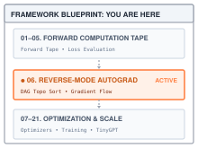
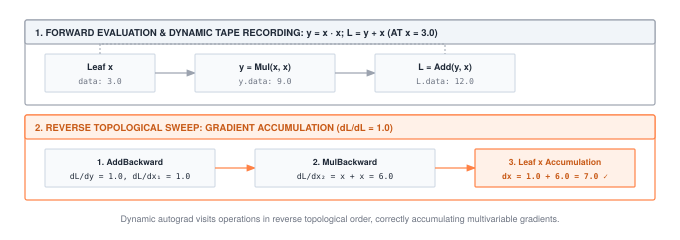
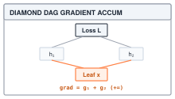
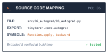

# Automatic Differentiation: Recording the Graph and Walking It Backward {#sec-autograd}

::: {.column-margin}
{width="100%" fig-alt="TinyTorch execution datapath blueprint highlighting Module 06 Autograd as the active subsystem."}

*Framework Blueprint: Module 06 builds the computation DAG and executes reverse-mode automatic differentiation via topological sort.*
:::


The foundational algorithm of modern deep learning is backpropagation: computing the exact partial derivative of a scalar loss with respect to every trainable weight in a network via the multivariable chain rule. These gradients tell the optimizer precisely how to adjust millions of parameters to decrease error.

In PyTorch, automatic differentiation is an effortless four-line ritual:

```python
import torch

# Leaf parameters requiring gradients
x = torch.tensor([[1.0, 2.0]], requires_grad=True)
W = torch.tensor([[0.5, -0.5], [1.0, 0.5]], requires_grad=True)

# Forward pass and scalar loss
loss = torch.relu(x @ W).sum()

# Backward automatic differentiation
loss.backward()

print("Gradient dL/dW:\n", W.grad)
```

Underneath that clean surface, the framework executes a sophisticated runtime engine:
1. **Dynamic tape recording:** As `x @ W`, `relu`, and `sum` execute during the forward pass, the runtime dynamically allocates operational graph nodes, constructing a Directed Acyclic Graph (DAG) that records parent-child dependencies and saves intermediate activations needed for local derivatives.
2. **Reverse topological traversal:** Calling `loss.backward()` triggers a topological sort of the graph from the scalar loss node back to the leaf inputs, guaranteeing that every downstream consumer contributes its partial derivative before an upstream tensor propagates its accumulated gradient.
3. **In-place accumulation and memory cleanup:** Gradients accumulate in-place directly into leaf `.grad` buffers (`param.grad += ...`), while non-leaf intermediate graph edges are unhooked so the runtime can immediately reclaim activation memory.

This chapter constructs TinyTorch's reverse-mode automatic differentiation engine, connecting the forward computations of @sec-tensors through @sec-dataloader with the backward gradient updates required by @sec-optimizers. Before building this engine, we must inspect why naive numerical or manual alternatives fail.

::: {#fig-autograd-dag fig-env="figure" fig-pos="htb" fig-cap="**Forward records and backward contributions**: The upper row computes y = x × x and L = y + x. In the lower row, addition contributes 1 directly to x; multiplication contributes 3 through each input position. All three contributions are needed for the gradient of 7." fig-alt="Two rows show x=3, y=9, L=12 above a backward seed of 1, an addition step, and multiplication contributions 3+3 with total dx=7."}
{width="100%"}
:::

---

## The Problem

::: {.column-margin}
**↩ Jump back:** @sec-tensors
*Reverse topological traversal writes gradient updates directly into leaf tensor `.grad` buffers.*
:::


Gradient descent, which @sec-optimizers turns into a real optimizer, needs one number per weight: the partial derivative of the loss with respect to that weight. For $N$ weights, the gradient contains $N$ values. Each parameter tensor stores its part in an array of the same shape, so a $2 \times 2$ weight matrix needs a $2 \times 2$ gradient.

The obvious way to get a derivative is to nudge a weight and see what happens to the loss. For the small network the rest of the chapter uses (a $1 \times 2$ input, a $2 \times 2$ weight matrix, a ReLU, and a sum), @lst-autograd-finite-difference computes one estimate per weight.

::: {#lst-autograd-finite-difference lst-cap="**A finite-difference baseline**: Caching the unperturbed loss gives five evaluations for four weights."}
```python
import numpy as np

x = np.array([[1.0, 2.0]], dtype=np.float32)
W = np.array([[0.5, -0.5], [1.0, 0.5]], dtype=np.float32)

def loss_fn(W):
    return np.float32(np.sum(np.maximum(0.0, x @ W)))

eps = np.float32(1e-3)
numeric = np.zeros_like(W)
baseline = loss_fn(W)
for i in range(W.shape[0]):
    for j in range(W.shape[1]):
        W_plus = W.copy()
        W_plus[i, j] += eps
        numeric[i, j] = (loss_fn(W_plus) - baseline) / eps   # one extra forward pass per weight

print(np.round(numeric, 4))
# [[0.9999 0.9999]
#  [2.0001 1.9999]]
```
:::

Two things are wrong with this, and both get worse as the model grows. The first is cost. Estimating four derivatives took five forward passes, one per weight plus a baseline. A model with $N$ weights needs $N + 1$ forward passes for a single gradient, and training needs a fresh gradient at every step. The baseline can be shared, but each perturbed weight still needs its own model evaluation. That cost grows with the number of weights even though the desired output remains one scalar loss.

The second is precision. The printed answer is already off in the fourth decimal place, and shrinking `eps` does not fix it. The numerator subtracts two losses that differ only slightly, and float32 keeps about seven significant digits, so the subtraction throws most of them away.[^fn-cancellation-finite-difference] Choose `eps` too large and the estimate is biased; choose it too small and it is noise. The useful range depends on the scale of the inputs and the precision. Finite differences remain valuable as an independent check on a small derivative rule, but this sensitivity and the repeated forward passes make them unsuitable as the training engine.

[^fn-cancellation-finite-difference]: **Catastrophic cancellation**: subtracting two nearly equal floating-point numbers discards the leading digits they share, leaving only the few that differ. Dividing that small difference by `eps` magnifies the effect of rounding in the two loss evaluations.

Handwritten derivative formulas work for the four-weight example, but every change to the model then requires a corresponding change to those formulas. A reusable engine must instead compose the local rules for whichever operations executed. Shared subcomputations should contribute to the derivative without forcing the engine to reevaluate the whole model for each weight.

---

## The Idea

::: {.column-margin}
**↪ Jump ahead:** @sec-optimizers
*How the optimizer transforms computed gradient vectors into stable parameter update trajectories.*
:::


### One rule per operation

In the opening example, increasing $y$ by a small amount increases $L=y+x$ by the same amount. The derivative of $L$ with respect to $y$ is therefore $1$. Through the path $y=x^2$, the derivative of $y$ at $x=3$ is $6$, giving a contribution $1 \times 6$ to the derivative of $L$. This multiplication is the **chain rule**. When $L$ depends on $x$ only through $y$,

$$\frac{\partial L}{\partial x} = \frac{\partial L}{\partial y} \cdot \frac{\partial y}{\partial x}.$$

In the opening example the direct $+x$ supplies a separate contribution, which is added to the contribution through $y$. Each factor in the formula describes one part of that path. The first factor, $\partial L / \partial y$, is about everything downstream of $y$ and nothing upstream. The second, $\partial y / \partial x$, is about one operation and nothing else. If every operation can answer the question "given the gradient of the loss with respect to my output, what is the gradient with respect to my inputs," then no operation ever needs to know what the rest of the network looks like.

That question has a short answer for every operation we use. Addition passes the gradient through unchanged to both inputs, because $\partial(a + b)/\partial a = 1$. ReLU passes it through where the input was positive and blocks it where the input was not, because its derivative is $1$ for positive $z$ and $0$ for negative $z$. At zero the ordinary derivative is undefined; TinyTorch chooses zero. Summing a tensor to a scalar sends the same gradient to every element. Each rule needs only what the operation saw during the forward pass: ReLU needs the sign of its input, and matrix multiplication needs both of its inputs.

Matrix multiplication is the one rule worth writing down. For $Y = AB$ with $A$ of shape $M \times K$ and $B$ of shape $K \times N$, let $G = \partial L / \partial Y$ be the incoming gradient, which has the same shape as $Y$. Then

$$\frac{\partial L}{\partial A} = G B^{T}, \qquad \frac{\partial L}{\partial B} = A^{T} G.$$

For the chapter's concrete input $A=[1,2]$ and incoming gradient $G=[1,1]$, $A^T G$ is $[[1,1],[2,2]]$. Each weight in the first row receives the input value $1$, and each weight in the second row receives $2$, because those values multiply the weights during forward execution. A shape check confirms that the general rule returns one derivative per input element. $G$ is $M \times N$ and $B^T$ is $N \times K$, so $G B^T$ is $M \times K$, the shape of $A$. Likewise $A^T G$ is $K \times N$, the shape of $B$. When both inputs require gradients, backward performs two matrix multiplications, each with the same leading arithmetic count as the forward product. If only the weights require gradients, the rule skips the input-gradient product. This explains why backward work can be comparable to forward work without implying a fixed elapsed-time ratio for every model.

### Reverse order

During the forward pass each result is computed from earlier results, so the tensors and operations form a graph with a direction (from inputs toward the loss) and no cycles (a tensor cannot depend on something computed after it). Reverse mode starts at the loss, where the gradient is trivially $\partial L / \partial L = 1$, and moves toward the inputs.[^fn-reverse-mode-efficiency]

[^fn-reverse-mode-efficiency]: **Forward-mode versus reverse-mode AD**: For a function $f: \mathbb{R}^N \to \mathbb{R}^M$, forward-mode automatic differentiation propagates tangent vectors with cost proportional to the number of inputs $N$. Reverse-mode automatic differentiation propagates cotangent vectors with cost proportional to the number of outputs $M$. Because deep neural networks optimize a single scalar loss ($M=1$) over millions of parameters ($N \gg 1$), reverse-mode AD computes all $N$ parameter gradients in a single backward pass ($O(1)$ sweeps), whereas forward-mode would require $N$ separate forward passes.

The order matters. A tensor's backward rule turns the gradient at that tensor into gradients at its parents, so the rule must not run until the gradient at that tensor is complete. If the tensor feeds two later operations, both of them must have reported back first. The backward traversal therefore needs the reverse of a **topological order**: consumers precede the tensors they read. A depth-first walk from the loss that lists each tensor only after all of its parents produces the opposite order (parents first), and reversing that list gives us the one we want.

### Used twice means add

::: {.column-margin}
{width="100%" fig-alt="Diamond DAG topology showing forward split and backward gradient accumulation at leaf x."}

*Diamond DAGs require gradient accumulation: $\nabla_x = \nabla_{y_1} \frac{\partial y_1}{\partial x} + \nabla_{y_2} \frac{\partial y_2}{\partial x}$.*
:::

When a tensor feeds two operations, the loss depends on it along two paths, and the multivariable chain rule says the total derivative is the sum over paths:

$$\frac{\partial L}{\partial x} = \sum_{k} \frac{\partial L}{\partial y_k} \frac{\partial y_k}{\partial x},$$

where the $y_k$ are the tensors computed directly from $x$. In code the incoming contributions must be added. The implementation accumulates them in `pending` before adding the complete result into `x.grad`. The smallest example is `x + x`. The same tensor is both inputs of one addition, so its gradient is the incoming gradient twice. An engine that overwrote each pending contribution would silently report half the true value, and the mistake would not raise an error. It would just train worse. The same accumulation is what makes a layer whose input is added back to its output work, and it introduces one kind of accumulation: combining paths within a backward call. A separate choice keeps `.grad` between calls, so the training loop must clear it when starting a new gradient estimate.

::: {.column-margin}
**Core Invariant: Fan-In Accumulation**\
$$x.\text{grad} \mathrel{+}= \sum_k \text{vjp}_k$$\
*Silent bug: assigning `=` instead of `+=` drops multi-branch gradients without raising an error.*
:::

{#fig-gradient-fanin-accumulation width="100%" fig-alt="DAG diagram illustrating Node X receiving accumulated gradients from Op A and Op B via multivariable chain rule summation."}


### What the design costs

The multiply in the opening example needs the forward value $x=3$ to produce its two contributions of $3$. ReLU needs its input's sign; matmul needs its operands. TinyTorch keeps references to the input tensors on every operation node and also saves the output tensor. Keeping a reference does not duplicate its array, but it prevents that array from being reclaimed while the node remains reachable. Training therefore retains intermediate results that prediction may no longer need.

The reference keeps all inputs even when a particular rule only needs a shape. After backward releases the links, intermediates with no other references can be reclaimed; any tensors still held by the caller remain alive. During prediction, `no_grad()` prevents these graph links from being retained. The difference is about object lifetime, not a promise that inference always needs exactly one layer's memory.

::: {#nbk-autograd-activation-memory .callout-notebook title="Napkin Math: Autograd activation memory scaling"}

**Problem**: For a 12-layer TinyGPT model with batch size $B=16$, sequence length $S=1024$, and hidden dimension $D=768$, what is the activation memory retained on the forward tape?

**Per-layer activation footprint**:
$$\text{Layer activations} \approx 4 \times (B \times S \times D) \times 4\text{ bytes} \approx 4 \times (16 \times 1024 \times 768) \times 4 \approx 192\text{ MB}$$

**Total tape footprint**:
$$\text{Total activation memory} \approx 12\text{ layers} \times 192\text{ MB} \approx 2.30\text{ GB}$$

**Systems insight**: While model parameters for this configuration occupy only $\sim 340\text{ MB}$, forward activation memory on the autograd tape exceeds parameter memory by nearly $7\times$, making activation management the primary bottleneck during training.


:::

---

## The Code

::: {.column-margin}
{width="100%" fig-alt="Source code mapping card for Module 06 Autograd showing file path, exported package, and tested primitives."}

*Source Code Mapping: Module 06 extracts automatic differentiation, the backward execution tape, and gradient accumulation directly from the working repository.*
:::

The tensor implementation in @sec-tensors left three fields on every `Tensor` with nothing to do: `requires_grad`, `grad`, and `_grad_fn`. It also routed every operation through one method, `Function.apply`, which computed a result and forgot how. This chapter is where all four earn their keep.

### An operation that remembers its inputs

Consider the entry point for the opening multiply. `x * x` calls `Tensor.__mul__`, which delegates to `Mul.apply(x, x)`. @sec-tensors supplied `Function.apply` as the common path for every operation. It constructs a fresh `Mul` node whose `inputs` tuple contains two references to the same tensor. Calling `forward` with the inputs' NumPy arrays produces the value $9$.

If the framework kept only that result, it would lose both the operation and its two input positions. A per-call node preserves them without requiring a separate backward function for the whole model. Its class supplies the rule, while its instance supplies the values from this particular call.



Read `apply` again with this chapter's question in mind. It builds a node that holds the inputs, runs `forward`, and then drops the node. After `apply` returns, no result points back to that node. Keeping the record makes the result a starting point for a later backward traversal. This is the version of `apply` that Module 06 installs in place of the one above.



The output is a new `Tensor` wrapping the array returned by `forward`. The node keeps this tensor as `node.output`, because some derivative rules reuse the output value. If tracking is enabled and any input requires a gradient, `apply` sets `out.requires_grad = True` and stores the node as `out._grad_fn`. For `x * x`, following that link reaches a `Mul` whose two input entries both refer to `x`. Another operation can extend the chain without knowing how the earlier result was computed.

::: {#chk-autograd-inplace-versioning .callout-check title="Sanity Check: In-place mutation corrupts forward activation recordings"}
When a tensor is mutated in place (e.g., `x += 1` or `x.data[0] = 5`), the numerical values saved during forward execution are destroyed. If `backward()` runs later, operations like `Mul` or `ReLU` read the modified values rather than the activations present when the graph was recorded, silently producing corrupt gradients.

Always ensure parameter updates and buffer overwrites occur *after* `loss.backward()` has finished traversing the graph, or isolate mutations inside explicit `no_grad()` contexts.
:::

The `if` line controls whether this record survives the call. A prediction using trainable weights still records operations unless tracking is disabled. Inside `no_grad()`, the output has `requires_grad=False` and no `_grad_fn`; leaving the context restores the previous tracking state. Setting a layer to evaluation mode is a separate decision about behavior such as dropout, and does not disable autograd.

A tensor constructed directly, such as `x` or a weight, has no producing operation. Such a tensor is a **leaf** of this record structure. Backward stops there after accumulating its gradient. TinyTorch also stores `.grad` on visited intermediates, which makes the trace inspectable; the production bridge distinguishes that choice from PyTorch's default.

What each node needs in order to send a gradient back to its inputs is the other half of the operation, the `backward` that @sec-tensors left raising `NotImplementedError`. The rest of this section writes those halves, one class at a time, on the same classes that already implement `forward`.

### The broadcast obligation: reducing gradients

For a concrete bias addition, let the activation batch be `[[1, 2, 3], [4, 5, 6]]` with shape `(2, 3)` and the bias be `[10, 20, 30]` with shape `(3,)`. Forward returns `[[11, 22, 33], [14, 25, 36]]`. NumPy broadcasting reuses each bias entry across rows without requiring an explicitly tiled bias array; the addition still creates a result, and TinyTorch wraps it in its own float32 storage. An upstream gradient `[[1, 2, 3], [4, 5, 6]]` must therefore give the bias `[5, 7, 9]`, summing the two uses of each entry.

If the framework blindly pushed that gradient into the bias, two things would break. First, the shapes would mismatch, crashing the first elementwise update. Second, and worse, the bias gradient would fail to accumulate the contributions from every example in the batch. By the multivariable chain rule, because $b_j$ was added to every row $i$ of the output, its total gradient is the sum across the batch:

$$\frac{\partial L}{\partial b_j} = \sum_{i=0}^{B-1} \frac{\partial L}{\partial y_{i, j}} \frac{\partial y_{i, j}}{\partial b_j} = \sum_{i=0}^{B-1} \frac{\partial L}{\partial y_{i, j}} \times 1 = \sum_{i=0}^{B-1} (\nabla \mathbf{Y})_{i, j}$$

The mathematical summation across the batch becomes an array reduction across the leading axes. TinyTorch enforces this contract with `_reduce_broadcast_grad`, which sums out extra leading dimensions and collapses singleton axes back to the parameter's original shape.



With this helper in place, the backward half of `Add` handles scalars, vectors, and broadcast tensors with the same local rule. The `@method_of(Add)` line above the definition is how Module 06 writes a method onto a class that Module 01 defined; it is the same as writing `backward` inside `class Add`, without editing the earlier module.



The rule itself is one line per input, `grad_a = grad_output`, because $\partial(a + b)/\partial a = 1$. Everything else in the listing is the obligation: check that the input wants a gradient at all, and reduce the gradient to the input's own shape. The walker at the end of this section applies the same reduction to whatever any rule returns, so a rule that forgets it still lands the right shape; `Add` does it here because addition is the rule where the obligation is easiest to see. In the concrete example the helper reduces axis 0, changing `(2, 3)` into `(3,)`. If the bias were stored as `(1, 3)`, it would instead preserve the singleton row axis. The returned gradient must match the original input shape in either case.

### Matrix multiplication, ReLU, and sum

Matrix multiplication is where the weights are. @sec-layers's `Linear` layer is `x @ W` plus a bias, so every weight matrix in an MLP, and later every projection in @sec-attention's attention, receives its gradient through the matmul rule. It is also the rule where the naive approach is most obviously unaffordable. In the general case, an operation that maps a vector of length $n$ to a vector of length $m$ has an $m \times n$ matrix of local derivatives called the Jacobian,[^fn-jacobian-vjp] and the textbook way to apply the chain rule is to build it and multiply. For a linear layer with batch 256 and width 4096, the output has about a million entries and $W$ has nearly seventeen million, so $\partial Y / \partial W$ has roughly $1.8 \times 10^{13}$ entries, about 70 TB in float32, for one layer of one training step.

[^fn-jacobian-vjp]: **Jacobian**: the matrix of all partial derivatives $\partial y_i / \partial x_j$ of a vector-valued function. For a layer with 1024 inputs and 1024 outputs it has a million entries per example, which is why autograd computes gradient-times-Jacobian products instead of the Jacobian itself.

The reference never constructs this array. The matmul rule from The Idea computes only the product that the chain rule needs. $G B^T$ and $A^T G$ are the products of the incoming gradient with that Jacobian, computed directly as two matrix multiplications the size of the forward one, and the gradient for $W$ comes out at $W$'s own size, 67 MB rather than 70 TB. This direct multiplication of an incoming gradient by local derivatives is called a **vector-Jacobian product**, and every backward rule in this chapter computes such a product. The incoming gradient summarizes the loss downstream, so the rule does not need every local partial derivative separately.



The two-dimensional case is the two-line formula from The Idea, and the shapes work out for the same reason. The branches around it are there because the real module has to serve @sec-attention, where attention multiplies batches of matrices at once; `np.swapaxes` transposes only the last two axes so the batch axis is left alone, and vector operands are temporarily promoted to row or column matrices. Removing those added axes afterward lets the same matrix rule cover vector and batched cases without flattening a batch into one outer product.

ReLU and sum are simpler, and they are here because the worked trace needs them. ReLU supplies a nonlinear step, and sum produces a scalar whose backward seed can default to one. Notice what each rule reads from its node, because that is exactly what has to stay in memory until backward runs: matmul read both operands, ReLU reads its input, and sum uses its input to recover the shape and gradient requirement. The node nevertheless retains the full input tensor.





The ReLU mask is the derivative of $\max(0, z)$ evaluated at the forward input. Sum broadcasts its scalar gradient back to the shape it reduced, and `expand_dims` restores an axis removed by `sum(axis=1)` so each row receives its own incoming gradient. A sum of a `(2, 3)` tensor along axis 1 has shape `(2,)`; an incoming `[2, 5]` becomes `[[2], [5]]`, then broadcasts to `[[2, 2, 2], [5, 5, 5]]`.

The same requirement applies to the loss rules from @sec-losses. For example, binary cross-entropy clips a probability into $[10^{-7}, 1-10^{-7}]$ before taking logarithms. Outside that interval its implemented forward value is constant, so the prediction gradient is zero; inside it, the rule differentiates the logarithmic expression. At the two clip boundaries the implementation chooses the derivative from the interior. A backward rule must match the implemented forward function, including such numerical choices.

### Walking the graph backward

The records are in place. What is left is the call the training loop of @sec-training will make once per step, `loss.backward()`, which has to visit every record and leave every leaf holding its gradient.

A tempting walk combines recursion with a visited set. Start at the loss, run its rule, and immediately recurse into each unvisited input. On the straight chain in the worked trace below that gives the right answer, which is what makes it dangerous. For `x = 2`, let `h = x * 2` and `L = h * 3 + h * 4`. The two branches contribute $3$ and $4$ at `h`; its multiply must send $(3+4) \times 2 = 14$ to `x`. If a recursive walk reaches `h` through the first branch and immediately runs its rule, it sends only $3 \times 2 = 6$. When the second branch arrives, the visited set suppresses another traversal of `h`, losing the remaining $8$. Dropping the visited set while propagating the total `.grad` causes a different error: the later traversal also resends the first contribution. No error, a wrong number, and a model that trains a little worse than it should.

The fix is to run no rule until every consumer of its tensor has reported. A topological order guarantees exactly that, and a depth-first walk hands us one for free. The implementation therefore does four things: sorts the graph, seeds the gradient at the loss, walks the order once, and releases the graph.



Before step 1 changes any gradients, the method checks the external seed. A one-element output may omit the seed; `ones_like` then gives it exactly the output shape. An explicit seed must have that same shape, even when NumPy could broadcast it. For an output of shape `(2, 3)`, a seed of shape `(3,)` is rejected: the caller must specify the contribution of each of the six output elements. This entry contract differs from `_reduce_broadcast_grad`, which reverses broadcasting performed by a known forward operation. Silently broadcasting an external seed would invent a caller intent that no operation recorded.

Step 1 is the depth-first walk. It uses an explicit stack rather than recursion so a long chain does not consume one Python call frame per operation. Each first visit pushes an expanded entry onto the stack and then pushes its parents above it, so `topo_order` lists inputs before the tensors computed from them and reversing it puts the loss first and the leaves last. The `seen` set records `id(tensor)`, so tensor identity determines whether it was visited. Two references to the same tensor produce one entry in the order; two distinct tensors with equal values remain distinct.

Step 2 creates `pending = {id(self): gradient}`. In the scalar trace this gives the loss an incoming value of one, expressing that changing the loss changes itself by the same amount. No other tensor has a pending contribution yet.

Step 3 maintains two distinct kinds of gradient state. The local `pending` dictionary starts fresh on every backward call; a tensor's `.grad` may already contain contributions from an earlier call. The rule receives the current call's `grad` from `pending`, never the historical total in `.grad`. Replaying a retained graph therefore adds a new derivative to the leaf without sending the old derivative through the graph a second time.

Step 3 is also where "used twice means add" lives. `pending` holds, for each tensor, the gradient accumulated so far from the consumers already visited. A tensor is only taken from `pending` when the walk reaches it, and by the order's guarantee every consumer has already added its share, so the addition into an existing `pending[id(parent)]` entry combines contributions before that parent is processed. Each node's `backward` returns one gradient per input, in the order the inputs were given, and the walker reduces each one to its input's shape before handing it on. Nothing in the loop knows what any operation does. It only knows the order.

Step 4 severs the `_grad_fn` links after the walk and marks tensors that had a producing operation with `_graph_released`. The marker distinguishes a consumed intermediate from an original leaf. Both now have no `_grad_fn`, but only the leaf is a valid stopping point for a later backward pass. Step 1 checks the marker on every reachable differentiable tensor before step 3 mutates any gradient. A new loss built from an old intermediate therefore raises instead of silently stopping short of its original inputs.

Passing `retain_graph=True` on the earlier call preserves the links so another backward call can traverse them. It does not make the derivatives differentiable: these rules compute NumPy arrays, so retaining the graph does not implement higher-order derivatives. For ordinary training, the next forward pass builds a new graph from the updated parameters. Retention is needed only when more than one backward traversal must use the same forward computation.

{#fig-autograd-pointer-dag width="100%" fig-alt="Autograd pointer DAG showing forward graph links, topological ordering queue, and backward gradient accumulation into leaf parameter buffers."}

---

## A Worked Trace

The network from The Problem is small enough to check by hand. Take an input $\mathbf{x}$, a weight matrix $\mathbf{W}$, and compute a pre-activation, a ReLU, and a scalar loss:

$$\mathbf{x} = \begin{bmatrix} 1.0 & 2.0 \end{bmatrix}, \quad \mathbf{W} = \begin{bmatrix} 0.5 & -0.5 \\ 1.0 & 0.5 \end{bmatrix}, \quad \mathbf{z} = \mathbf{x}\mathbf{W}, \quad \mathbf{a} = \text{ReLU}(\mathbf{z}), \quad L = \sum \mathbf{a}.$$

The forward pass gives

$$
\begin{aligned}
\mathbf{z} &= \begin{bmatrix} 1.0(0.5) + 2.0(1.0) & 1.0(-0.5) + 2.0(0.5) \end{bmatrix} \\
&= \begin{bmatrix} 2.5 & 0.5 \end{bmatrix}, \\
\mathbf{a} &= \begin{bmatrix} 2.5 & 0.5 \end{bmatrix}, \qquad L = 3.0.
\end{aligned}
$$

Both entries of $\mathbf{z}$ are positive, so ReLU passes both through and its mask is all ones. As the forward pass runs, `apply` creates three nodes: a `MatMul` whose inputs are $(\mathbf{x}, \mathbf{W})$, a `ReLUFunction` whose input is $\mathbf{z}$, and a `Sum` whose input is $\mathbf{a}$. The depth-first walk from $L$ lists the tensors as $[\mathbf{W}, \mathbf{x}, \mathbf{z}, \mathbf{a}, L]$, and reversing it gives the backward order $[L, \mathbf{a}, \mathbf{z}, \mathbf{x}, \mathbf{W}]$. The explicit stack pops the last scheduled parent first, placing $\mathbf{W}$ before $\mathbf{x}$ in the initial list. The order between the two leaves does not matter because leaves have no node to run, and @tbl-autograd-trace follows the loop through the three that do.

| Step | Node | Gradient at this tensor | Local rule | Sent to inputs |
| :--- | :--- | :--- | :--- | :--- |
| seed | $L$ | $1.0$ | $\partial L / \partial L = 1$ | (none yet) |
| 1 | $L = \sum \mathbf{a}$ | $1.0$ | broadcast to $\mathbf{a}$'s shape | $\mathbf{a}$ gets $[1.0, 1.0]$ |
| 2 | $\mathbf{a} = \text{ReLU}(\mathbf{z})$ | $[1.0, 1.0]$ | multiply by mask $[1, 1]$ | $\mathbf{z}$ gets $[1.0, 1.0]$ |
| 3 | $\mathbf{z} = \mathbf{x}\mathbf{W}$ | $[1.0, 1.0]$ | $\mathbf{x}^T G$ and $G \mathbf{W}^T$ | $\mathbf{W}$ gets $\begin{bmatrix} 1.0 & 1.0 \\ 2.0 & 2.0 \end{bmatrix}$, $\mathbf{x}$ gets $[0.0, 1.5]$ |
| 4, 5 | $\mathbf{x}$, $\mathbf{W}$ | (leaves) | no node | done |

: The backward loop on the four-weight network. Each rule receives this call's pending gradient and returns contributions for its inputs. Vector entries in the table represent row arrays of shape `(1, 2)`. {#tbl-autograd-trace tbl-colwidths="[8,22,20,22,28]"}

The two matmul results are worth doing by hand once. With $G = [1.0, 1.0]$,

$$
\begin{aligned}
\frac{\partial L}{\partial \mathbf{W}} &= \mathbf{x}^T G
= \begin{bmatrix} 1.0 \\ 2.0 \end{bmatrix}
  \begin{bmatrix} 1.0 & 1.0 \end{bmatrix}
= \begin{bmatrix} 1.0 & 1.0 \\ 2.0 & 2.0 \end{bmatrix}, \\
\frac{\partial L}{\partial \mathbf{x}} &= G \mathbf{W}^T
= \begin{bmatrix} 1.0 & 1.0 \end{bmatrix}
  \begin{bmatrix} 0.5 & 1.0 \\ -0.5 & 0.5 \end{bmatrix}
= \begin{bmatrix} 0.0 & 1.5 \end{bmatrix}.
\end{aligned}
$$

The zero in $\partial L / \partial \mathbf{x}$ has a plain meaning. Raising $x_0$ by a small amount raises $z_0$ by half that amount and lowers $z_1$ by the same half, and since $L$ is $z_0 + z_1$, the two effects cancel. The gradient with respect to $\mathbf{W}$ matches the finite-difference estimate from The Problem to within its noise, which is the check that matters.

Running the real module on the same inputs reproduces the table (@lst-autograd-network-trace). Importing `tinytorch.core.autograd` in line 3 completes the operation classes with their backward methods; before that import, `backward()` raises. In lines 5--6, `x` and `W` are declared with `requires_grad=True`. Lines 8--10 evaluate the forward sequence $z \to a \to L$, attaching operation nodes inspected in lines 11--12 (`<MatMulBackward>`, `<ReLUBackward>`, `<SumBackward>`). In line 14, `L.backward()` seeds the gradient at 1.0 and traverses the tape in reverse topological order, populating `W.grad` and `x.grad` in lines 15--17 to match the hand-derived matrix products in @tbl-autograd-trace exactly.

::: {#lst-autograd-network-trace lst-cap="**Tracing a matrix network**: Three recorded operations produce the weight and input gradients."}
```python
from tinytorch.core.tensor import Tensor
from tinytorch.core.activations import ReLU
import tinytorch.core.autograd          # completes every operation with its backward half

x = Tensor([[1.0, 2.0]], requires_grad=True)
W = Tensor([[0.5, -0.5], [1.0, 0.5]], requires_grad=True)

z = x @ W
a = ReLU()(z)
L = a.sum()
print(L.data, z._grad_fn, a._grad_fn, L._grad_fn)
# 3.0 <MatMulBackward> <ReLUBackward> <SumBackward>

L.backward()
print(W.grad)          # [[1. 1.]
                       #  [2. 2.]]
print(x.grad)          # [[0.  1.5]]
```
:::

The accumulation rule can be checked with a two-line experiment, and it is worth running because `x + x` is the smallest version of a residual connection, where a tensor is added back to something computed from it. In @lst-autograd-shared-input, line 1 creates `x` and line 2 evaluates `(x + x).sum().backward()`. The same tensor occupies both input slots of one `Add` node, so the tape traversal adds to its `pending` entry twice, producing `[[2. 2.]]` in line 3.

::: {#lst-autograd-shared-input lst-cap="**One tensor in two input positions**: The two additions to the pending gradient must both survive."}
```python
x = Tensor([[1.0, 2.0]], requires_grad=True)
(x + x).sum().backward()
print(x.grad)          # [[2. 2.]]
```
:::

::: {#ws-autograd-inplace-residual .callout-war-story title="War Story: The silent overwrite trap in residual connections"}
Residual connections ($y = x + F(x)$) feed a single activation tensor into multiple downstream consumers. If an autograd engine used assignment (`pending[parent] = incoming`) rather than accumulation (`pending[parent] += incoming`), the gradient from the skip connection would overwrite the gradient flowing through the residual sub-block, silently zeroing out feature updates in deep networks.
:::

Replace the `+` in the `pending` update inside `backward` with an assignment and this prints `[[1. 1.]]`, with no error to tell us it is wrong. A shared intermediate adds a second obligation: its local rule must propagate the combined gradient once. The trace in @lst-autograd-retained-graph checks accumulation across separate calls that share a forward intermediate. In lines 1--3, `h = x * 2` branches into `left` and `right`. Line 4 runs `left.backward(retain_graph=True)`, printing `x.grad = [6.]` in line 5. Line 6 runs `right.backward()`, accumulating an additional 8 to yield `x.grad = [14.]` in line 7. In lines 9--12, attempting to backpropagate through `h` a third time raises a `RuntimeError` because the un-retained backward pass released `h`'s computational graph.

::: {#lst-autograd-retained-graph lst-cap="**Gradient and graph lifetimes**: Contributions accumulate across calls, but a released intermediate cannot be traversed again."}
```python
x = Tensor([2.0], requires_grad=True)
h = x * 2
left, right = (h * 3).sum(), (h * 4).sum()
left.backward(retain_graph=True)
print(x.grad)                       # [6.]
right.backward()
print(x.grad)                       # [14.], six from left plus eight from right

try:
    (h * 5).sum().backward()         # new root, but h's graph was released
except RuntimeError:
    print(x.grad)                   # [14.], validation preceded accumulation
```
:::

On the first call (line 4), `h` receives three and sends six to `x`. On the second (line 6), its fresh `pending` entry receives four and sends eight, even though `h.grad` also retains the earlier three. The second call releases `h`'s producing operation. The third call (line 9) reaches that marked intermediate during graph validation and stops before changing `x.grad`. Recomputing `h = x * 2` creates a usable graph; clearing `x.grad` alone does not restore the old one.

---

## From TinyTorch to Production

PyTorch also records executed operations and exposes a result's producing node through `grad_fn`. Its backward engine applies local derivative rules to saved forward values. A production implementation can save only the values a rule needs; TinyTorch keeps every input and its output to make the record easy to inspect. PyTorch also checks version counters to detect changes to saved tensors. [PyTorch autograd mechanics](https://docs.pytorch.org/docs/2.14/notes/autograd.html).

::: {#psp-autograd-cpp-engine .callout-perspective title="Production Bridge: PyTorch's C++ autograd engine and version counters"}
In PyTorch's native C++ core (`torch/csrc/autograd`), every `Tensor` maintains an internal `_version` counter incremented on every in-place mutation. When a backward rule requires saved forward activations (via `ctx.save_for_backward`), it records their version. If any saved tensor's version increments before backward executes, PyTorch immediately raises:
`RuntimeError: one of the variables needed for gradient computation has been modified by an inplace operation`.

PyTorch also executes the reverse traversal using a ready-queue worker thread pool, executing vector-Jacobian products in C++ without Python interpreter or GIL overhead.
:::

That mutation check marks a boundary of this reference. TinyTorch nodes hold references to mutable tensors, not immutable snapshots. If `x` is `[3]` when `y = x * x` runs, changing `x.data` to `[4]` before backward makes the multiply read $4$ and return a gradient of $8$ for a forward calculation performed at $3$. TinyTorch does not detect that mismatch. Parameter updates must follow the backward passes that need the old values; `no_grad()` disables recording but does not make an early mutation safe.

The public gradient-storage contract also differs. With its default arguments, PyTorch accumulates `.grad` on leaf tensors and requires `retain_grad()` to retain an intermediate's gradient. TinyTorch stores gradients on all visited differentiable tensors. Both accumulate across backward calls rather than clearing an existing gradient automatically. PyTorch's `backward` also offers `create_graph` for differentiating derivatives; TinyTorch's NumPy backward rules do not. [PyTorch Tensor.backward](https://docs.pytorch.org/docs/2.14/generated/torch.Tensor.backward.html).

Saved activations add a memory cost whose size depends on the workload. For example, an activation array of shape `(32, 128, 512)` contains $2{,}097{,}152$ values and occupies $8{,}388{,}608$ bytes in float32, about $8.4$ MB. That is an array-size calculation, not a measured training peak. Parameters, accumulated gradients, operation records, temporary arrays, and later optimizer state also occupy memory. Keeping several such activations alive can therefore change whether a model fits, but neither activations nor parameters always dominate.

Production frameworks can trade recomputation for saved-array storage. **Activation checkpointing** keeps selected intermediate values and reruns portions of forward computation when backward needs omitted values. The exact memory saving and extra work depend on which portions are checkpointed; TinyTorch does not implement this policy in Module 06. [PyTorch checkpoint documentation](https://docs.pytorch.org/docs/2.14/checkpoint.html). The transferable invariant remains the same: a rule needs the values belonging to the forward computation being differentiated, whether the implementation retained those values or reconstructed them.

---

## Summary

`Function.apply` connects an output tensor to the operation and inputs that produced it whenever gradient tracking is enabled. Each local `backward` reads that record and returns one contribution per input. `Tensor.backward` validates the seed and graph lifetime, starts a fresh `pending` dictionary, and visits tensors only after their consumers have contributed. Broadcast reduction restores every input's own shape before accumulation.

The two gradient lifetimes are the main contract to remember. `pending` belongs to one call and supplies the derivative propagated through each rule; `.grad` remains on tensors across calls until it is cleared. Graph links have a separate lifetime and are released by default, so clearing `.grad` does not make a consumed graph reusable. At return, differentiable parameters reached by the loss hold accumulated gradients; unused parameters can still have `grad=None`. The optimizer in @sec-optimizers can now turn those gradients into updates, after the forward values needed by backward have served their purpose.

---

## Further Reading

- **Griewank and Walther** (2008). "[Evaluating Derivatives](https://doi.org/10.1137/1.9780898717761)." *SIAM*. The standard reference on reverse-mode differentiation, including its memory cost and checkpointing.
- **Baydin et al.** (2018). "[Automatic differentiation in machine learning: a survey](https://www.jmlr.org/papers/v18/17-468.html)." *JMLR*. Forward and reverse mode side by side, and why machine learning uses the reverse one.
- **Paszke et al.** (2019). "[PyTorch: an imperative style, high-performance deep learning library](https://arxiv.org/abs/1912.01703)." *NeurIPS*. The design of a production tape that records operations as they run, as this chapter's does.
- **Abadi et al.** (2016). "[TensorFlow: a system for large-scale machine learning](https://www.usenix.org/system/files/conference/osdi16/osdi16-abadi.pdf)." *OSDI*. For contrast, how a framework builds and optimizes a static computational graph before executing it (Define-and-Run), unlike our dynamic Define-by-Run tape.
