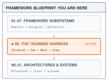
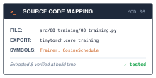
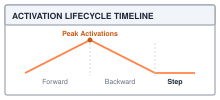

# The Training Engine: The Five-Step Loop {#sec-training}

::: {.column-margin}
{width="100%" fig-alt="TinyTorch execution datapath blueprint highlighting Module 08 Training as the active subsystem."}

*Framework Blueprint: Module 08 enforces the canonical training step cycle and coordinates convergence across epochs.*
:::


Supervised machine learning is the practical execution of empirical risk minimization: repeatedly exposing a parameterized model to training data, evaluating loss, computing gradients, and steering weights toward optimal generalization. However, learning is not a loose script; it is a precisely choreographed state machine where data pipelines, forward models, autograd graphs, and optimizers interact in lockstep.

In PyTorch, the fundamental training step is a five-line contract:

```python
import torch

for epoch in range(num_epochs):
    for batch_x, batch_y in loader:
        optimizer.zero_grad()               # 1. Clear residual gradients
        outputs = model(batch_x)            # 2. Forward pass
        loss = criterion(outputs, batch_y)  # 3. Evaluate loss
        loss.backward()                     # 4. Backward differentiation
        torch.nn.utils.clip_grad_norm_(model.parameters(), max_norm=1.0)
        optimizer.step()                    # 5. Update parameter weights
```

Underneath that rhythmic sequence, the framework orchestrates complex state transitions and memory lifecycles:
1. **The accumulation invariant:** Because autograd accumulates derivatives into leaf buffers (`param.grad += ...`), `.grad` buffers never clear themselves. Omitting `optimizer.zero_grad()` causes subsequent batch gradients to pile on top of earlier ones, corrupting update trajectories into runaway sums.
2. **Global gradient norm bounding:** Gradient clipping computes the collective $L_2$ norm across all registered parameter tensors ($\sqrt{\sum \|\mathbf{g}_i\|_2^2}$) and rescales gradients if they exceed a threshold, preventing sudden loss explosions.
3. **Graph detachment and metric memory safety:** To track running training loss without exhausting GPU memory, the loop extracts scalar metrics with `loss.item()`, severing the computation graph reference so intermediate activations can be reclaimed.

This chapter synthesizes the foundational modules of @sec-tensors through @sec-optimizers into the unified `Trainer` engine, establishing the end-to-end execution loop of TinyTorch. Before building this engine, we must inspect the silent failures that occur when any link in this five-step chain is broken.

::: {#fig-training-pipeline fig-env="figure" fig-pos="htb" fig-cap="**An accumulation window**: Forward, loss, and backward repeat while parameters stay fixed. At the window boundary, the Trainer averages by actual samples, optionally clips, updates parameters, and clears gradients." fig-alt="Two rows of three boxes. The upper row connects forward pass, scalar batch-mean loss, and sample-weighted backward. The lower row connects gradient averaging, optional clipping, and update followed by clearing. A note includes the final partial window."}
{width="100%"}
:::

---

## The Problem

::: {.column-margin}
**↩ Jump back:** @sec-optimizers
*In-place optimizer updates and gradient clipping bound parameter trajectories during training.*
:::


@sec-autograd built `backward()` so that it *adds* into `param.grad` rather than overwriting it. That choice was forced. When two branches of a network share a parameter, its gradient is the sum of both contributions, and adding is how the sum happens. The price is that nothing ever clears `.grad` on its own. Without a clear, the second batch's gradient lands on top of the first, the third on top of both, and the optimizer steps along the running total.

No exception is raised. The loss simply stops behaving. The smallest example that shows it is a single weight $w$ with loss $\tfrac{1}{2}w^2$, whose gradient is $w$ itself, trained with plain gradient descent at learning rate $0.1$.

::: {#lst-training-uncleared-gradient lst-cap="**Uncleared gradients**: The old gradient changes the next update even for one weight."}
```python
import numpy as np

w_ok, w_bad = 1.0, 1.0
grad_bad = 0.0       # the .grad buffer that never gets cleared
lr = 0.1
for step in range(1, 9):
    # correct loop: zero_grad() ran, so the buffer holds only this step's gradient
    grad_ok = w_ok
    w_ok = w_ok - lr * grad_ok
    # forgotten zero_grad(): backward() adds this step's gradient to the old ones
    grad_bad = grad_bad + w_bad
    w_bad = w_bad - lr * grad_bad
    print(f"step {step}   correct w = {w_ok:.4f}   "
          f"forgotten w = {w_bad:+.4f}")
```
:::

```
step 1   correct w = 0.9000   forgotten w = +0.9000
step 2   correct w = 0.8100   forgotten w = +0.7100
step 3   correct w = 0.7290   forgotten w = +0.4490
step 4   correct w = 0.6561   forgotten w = +0.1431
step 5   correct w = 0.5905   forgotten w = -0.1771
step 6   correct w = 0.5314   forgotten w = -0.4796
step 7   correct w = 0.4783   forgotten w = -0.7341
step 8   correct w = 0.4305   forgotten w = -0.9153
```

The correct column walks steadily toward the minimum at zero. The forgotten column crosses zero between steps four and five, then keeps swinging. For this loss, the accumulated gradient creates an undamped oscillation rather than convergence. Other models can oscillate, diverge, or produce nonfinite values. None of those outcomes is needed to identify the bug: the second update already uses a gradient from two different parameter values.

Calling `optimizer.step()` before `loss.backward()` has the same ownership problem. It uses whatever gradients remain, or skips parameters whose gradients are `None`. Leaving dropout active during evaluation changes the predictions being measured. These mistakes need not raise an exception, so the Trainer establishes the order and mode at the entry to each pass.

---

## The Idea

::: {.column-margin}
**↪ Jump ahead:** @sec-milestone-1
*Deploying the five-step training engine to train a multi-layer perceptron from scratch.*
:::


### Five steps, and why the order is forced

Each step of the loop reads state that the previous step wrote, and that dependency is what pins the order down.

| Step | Call | Reads | Writes |
| :--- | :--- | :--- | :--- |
| 1 | `optimizer.zero_grad()` | nothing | every `param.grad` becomes `None` |
| 2 | `outputs = model(inputs)` | `param.data`, the batch | activations and the tape (@sec-autograd) |
| 3 | `loss = loss_fn(outputs, targets)` | `outputs`, `targets` | one scalar, the root of the tape |
| 4 | `loss.backward()` | the tape | every `param.grad`, by accumulation |
| 5 | `optimizer.step()` | `param.grad`, optimizer buffers | `param.data`, optimizer buffers |

: **The five-step state contract**: Each operation reads the state produced by its prerequisites. {#tbl-training-five-step-contract tbl-colwidths="[8,34,28,30]"}

The contract is about which computation an update represents. *Every optimizer step must use the intended objective evaluated at one unchanged set of parameter values.* For a single batch, that objective is the batch mean. Later, accumulation combines several batch means with sample-count weights before stepping. Clearing separates those intentional windows; skipping the clear mixes an old objective into the new one. Moving the parameters before backward finishes is another violation because local rules still read operands from the earlier forward pass. The `Trainer` centralizes this ordering so every epoch observes the same boundaries.

### What the loop remembers

The five steps handle one batch. Around them sit two more loops, one over the batches in a dataset (one pass is an epoch) and one over epochs. The `Trainer` owns the state that outlives a single batch: how many epochs and optimizer steps have completed, the current learning rate, and a history of losses for plotting. It stores `training_mode` and sets `model.training` at the start of each pass. The `_forward` helper also passes the mode to models whose `forward` signature accepts `training`, including the `Sequential` container from @sec-layers. That explicit argument is what reaches its dropout layers.

The model and optimizer retain the parameter objects; the optimizer also retains its update buffers. The Trainer holds references to those collaborators, rather than creating a second set of weights. Batch counters and sample sums are local to one `train_epoch` call, while `epoch`, `step`, and `history` remain on the Trainer when that call returns. These different lifetimes explain both accumulation and the checkpoint boundary.

---

## The Code

::: {.column-margin}
{width="100%" fig-alt="Source code mapping card for Module 08 Training showing file path, exported package, and tested primitives."}

*Source Code Mapping: Module 08 extracts the canonical training loop, cosine learning rate schedules, and gradient clipping directly from the working repository.*
:::

The first two pieces stand alone. The Trainer then needs a model with `forward()` and `parameters()`, a loss with `forward()`, an optimizer, and an iterable of `(inputs, targets)` batches. The DataLoader from @sec-dataloader supplies that iterable; a Python list of batches works as well. Importing Module 08 enables the backward rules from @sec-autograd.

### The schedule

With $\eta = 0.1$, a gradient of $2$ moves a weight by $0.2$ under plain SGD. With $\eta = 0.01$, the same gradient moves it by $0.02$. A schedule changes this multiplier as training progresses without changing the optimizer's update rule. It can allow larger early updates and smaller later ones; whether that helps depends on the objective and the chosen endpoints.

`CosineSchedule` connects a maximum rate to a minimum rate along half a cosine wave over $T$ epochs:

$$\eta_t = \eta_{\min} + \tfrac{1}{2}\,(\eta_{\max} - \eta_{\min})\left(1 + \cos\frac{\pi t}{T}\right)$$

At $t = 0$ the cosine is $1$ and $\eta_0 = \eta_{\max}$. At $t = T$ the cosine is $-1$ and $\eta_T = \eta_{\min}$. In between, the rate falls slowly at first, fastest in the middle, and slowly again at the end, so the run spends a long stretch near the top rate, a long stretch near the floor, and passes quickly through the middle. `CosineSchedule` is that formula wrapped in a class, so the `Trainer` can ask for a rate by epoch number. Its defaults are the module's constants, a peak of 0.1, a floor of 0.01, and 100 epochs.



The guard at the top of `get_lr` returns the floor once `epoch >= total_epochs`. Without it, continuing to evaluate the cosine would eventually raise the rate again. The Trainer asks for `get_lr(self.epoch)` before processing any batches, so every optimizer update in that epoch uses the same scheduled rate. With `total_epochs=4`, four calls to `train_epoch` use indices 0 through 3; index 4 reaches the floor only if training continues for another epoch.

### Clipping

Suppose two parameter tensors have gradients $[3,4]$ and $[0,12]$. Their separate lengths are $5$ and $12$. Clipping each independently to length $2.5$ multiplies the first by $0.5$ and the second by about $0.2083$, changing their relative contributions. The combined gradient points in a different direction.

Global clipping treats the gradients as one long vector. Its length is $13$, so one coefficient, $2.5/13$, scales every entry. For plain SGD without momentum or decay, this also bounds the update length by the learning rate times $2.5$. For Adam or momentum SGD, the clipping operation bounds the current gradient; the optimizer's stored state still participates in the eventual update. The global norm is

$$\|\mathbf{g}\|_{\text{global}} = \sqrt{\sum_{i=1}^{P} \|\mathbf{g}_i\|^2}$$

where $\mathbf{g}_i$ is the gradient of the $i$-th of $P$ parameter tensors and $\|\cdot\|$ is the ordinary Euclidean length. If that global length exceeds a threshold $\gamma_{\max}$, scale every gradient tensor by the same factor $\gamma_{\max} / \|\mathbf{g}\|_{\text{global}}$. Because all tensors are scaled together, the direction of the long vector is unchanged; only its length is clamped to $\gamma_{\max}$. `clip_grad_norm` does this in two passes over the parameters. The first sums squared gradients to get the global norm; the second scales, but only if the norm is over the limit.



Parameters whose `.grad` is `None` contribute nothing to the norm. For the remaining parameters, the function accepts either the NumPy gradient array produced by backward or a Tensor assigned by hand. It replaces the array stored in `param.grad`, or in `param.grad.data` for the Tensor case, with scaled values. An external reference to the old array does not become a reference to the replacement. Squaring in float64 avoids overflowing the norm calculation for large finite float32 gradients.[^fn-clipping-float64] The returned value is the norm before clipping, so a caller can record how much scaling the update required.

[^fn-clipping-float64]: In a deep network with tens of millions of parameters, summing squared float32 gradients ($\sum g_i^2$) can exceed float32's maximum finite bound of $\approx 3.4 \times 10^{38}$ during transient gradient spikes, triggering a premature $\text{inf}$ overflow. Accumulating in IEEE 754 double precision (`float64`) provides dynamic range up to $\approx 1.8 \times 10^{308}$, preventing accumulator overflow before square-root extraction.

### The Trainer and the five steps

`train_epoch` is the public entry for training. It clears gradients, chooses the epoch's learning rate, and repeatedly calls `_process_batch`. That helper performs forward, loss, and backward. When an update is due, `_optimizer_update` averages and optionally clips the gradients, calls `optimizer.step()`, then clears the buffers. This split lets the Trainer process several batches before changing any parameters.

A larger batch requires more live activation storage during backward. Processing four samples together, for example, keeps intermediates for all four until their backward work completes. Processing two samples at a time can release each smaller graph after backward while retaining only the parameter gradients needed to combine their contributions.

The `.grad` buffers can hold the contributions from several **micro-batches**, smaller batches processed before one optimizer update. Run forward, loss, and backward on each micro-batch, releasing its graph afterward, while leaving parameters fixed and preserving their accumulated gradients. Only when the window is complete does the optimizer step. For equal-size batches the desired mean gradient is

$$\mathbf{g} = \sum_{j=1}^{k} \frac{1}{k}\,\nabla \mathcal{L}_j = \frac{1}{k}\sum_{j=1}^{k} \nabla \mathcal{L}_j$$

Here each loss is already a mean over its micro-batch. Dividing each contribution by a configured window length works only if the window contains that many equally sized batches. A short final window needs a smaller denominator. Unequal batches need different weights, or one example in the smaller batch would count more than an example in the larger one.

::: {.column-margin}
{width="100%" fig-alt="Microbatch memory timeline showing forward activation peaks, backward deallocation, gradient accumulation into persistent buffers, and normalized optimizer step."}

*Microbatching caps peak activation RAM to a single microbatch while gradients accumulate.*
:::

The implementation avoids both assumptions by accumulating sample sums. `_process_batch` seeds backward with the current batch's sample count, undoing the averaging in the loss. `_optimizer_update` divides the accumulated parameter gradients by the number of samples actually seen in the window. The batch counter determines when to step; the sample counter determines how much to divide. This requires a loss whose scalar value is a batch mean, as the earlier loss modules provide, rather than an arbitrary summed loss.

::: {#chk-training-gradient-accumulation-scale .callout-check title="Sanity Check: Unequal micro-batches require sample-count weighting"}
A common bug in custom training loops divides accumulated gradients by the number of accumulation steps ($k$) rather than the true number of samples processed. If the final micro-batch has fewer samples (e.g., a batch of 6 following batches of 32), naive division over-weights the final samples by more than $5\times$.

Always accumulate sample-summed gradients and divide by $\sum N_{\text{samples}}$ across the window before clipping and stepping.
:::

The equivalence to a single concatenated batch also assumes that splitting does not change the forward computation for a sample. A deterministic linear model satisfies that assumption. A layer that computes statistics across its batch, or a change in random masks, can make the two forward executions differ even when accumulation weights are correct. Accumulation saves the live activation storage of the larger batch; it does not remove these differences in model behavior.

{#fig-microbatch-memory-timeline width="100%" fig-alt="Memory timeline across microbatches showing forward activation memory peaks, backward deallocations, gradient accumulation, and optimizer step."}



The class body supplies checkpoint helpers and `_forward`. The latter inspects `model.forward` and passes `training=self.training_mode` only when the method accepts that argument. A `Sequential` receives it; a bare `Linear` needs only the input. This dispatch keeps the training loop independent of the model container. The constructor and the two halves of the loop each live in their own source cell.







Follow the values across the two helpers. In `_process_batch`, it reads `inputs.shape[0]`, calls `_forward`, and requests the scalar batch mean from `loss_fn.forward`. Multiplying `np.ones_like(loss.data)` by `batch_size` supplies a seed with exactly the loss shape required by @sec-autograd. The method leaves sample-summed derivatives in `.grad` and returns the corresponding sample-summed loss as a Python float. It neither steps the optimizer nor clears the gradients.

`_optimizer_update(sample_count)` consumes those sums. It first materializes `model.parameters()` as a list, because normalization and clipping must be able to visit the same parameters even if the model returns a generator. It divides each existing gradient by `sample_count`, computes the optional clipping norm on that mean, updates the weights, and clears the buffers. Normalizing before clipping is essential: a threshold applied to a sum would become more restrictive merely because the window contained more samples. The constructor also marks model parameters trainable, but the optimizer must still own the same parameter objects. A flag can enable recording; it cannot add a missing weight to the optimizer's list.

### One epoch

The five steps handle one batch, and a dataset is thousands of them. Something has to walk the `DataLoader` from @sec-dataloader, count the batches waiting for an optimizer step, and set this epoch's learning rate before the first batch. That is `train_epoch`.

The naive loop for accumulation fires an update whenever the batch index is a multiple of $k$. It is one line, and it has a hole. If the loader yields 1001 batches and $k = 4$, the last batch's gradient is computed, added into `.grad`, and never stepped on. Either it is thrown away, or, worse, it is still sitting in the buffers when the next epoch's first `backward()` adds to it, and the first update of the new epoch then includes a gradient computed on last epoch's parameters. That is the contract violation from The Idea, once per epoch, silently.

`train_epoch` starts by clearing old gradients, then maintains both `pending` and `pending_samples`. Every batch increments the first by one and the second by its actual size. A full window calls `_optimizer_update(pending_samples)` and resets both counters. After the loop, a nonempty tail calls the same helper with its own sample count. No gradient is discarded, and a tail receives a full mean-gradient update rather than an update weakened by the nominal window length.



The returned loss uses a separate denominator: total samples in the epoch. `total_loss` adds the sample-summed values returned by `_process_batch`; dividing by `total_samples` gives every observed sample equal weight. It is the mean of losses measured as training progressed, not a new evaluation of the final parameters. Changing accumulation can change the parameter trajectory and therefore the observed losses, but it does not change the reporting weights merely by regrouping the same values. On a successful return, `step` has increased once per optimizer update and `epoch` once for the completed call. The pending counters no longer exist, and all optimizer-owned gradients have been cleared. An empty loader produces the reference implementation's `0.0` loss placeholder and advances the epoch without an update; it is not evidence of a perfectly fitted dataset.

### Evaluation

A binary classifier returning probabilities `[[0.9], [0.1]]` for labels `[[1], [0]]` predicts both labels correctly. Taking `argmax` over each one-column row would instead return zero twice. Evaluation therefore needs a metric appropriate to the loss, as well as a forward pass that leaves the training state undisturbed.

`evaluate` sets `training_mode` and `model.training` to `False`, then calls `_forward` and `loss_fn.forward` inside `no_grad()`. The first change disables dropout in a Sequential; the second prevents autograd from retaining a graph for a backward pass that will never occur. These are separate controls. Turning off recording alone does not turn off dropout.



The evaluation loss uses the same sample weighting as the training report. CrossEntropyLoss computes class accuracy by comparing the largest-logit index with each integer target. BinaryCrossEntropyLoss thresholds probabilities and targets at `>= 0.5` and counts correct binary entries, including every label in a multilabel output. Regression and custom losses return `0.0` as an unused accuracy placeholder. Output width cannot identify the task: a two-column output may represent two regression values.

There is no backward or optimizer update, so existing parameter gradients and weights remain unchanged. The pass still allocates the arrays needed to calculate predictions and losses; `no_grad()` removes their retention for backward, not the forward computation itself. On return, the Trainer remains in evaluation mode and appends the loss to `history['eval_loss']`. The next `train_epoch` explicitly switches training back on.

### Checkpoints

After two Adam updates, restoring only the weights discards the moment estimates and their ages. The next call to `step()` then follows a different trajectory even on identical data. A **checkpoint** preserves the state needed to continue the supported computation: parameters, optimizer state and hyperparameters, schedule settings, clipping configuration, mode, counters, and history. (The word is unrelated to the activation checkpointing of @sec-autograd, which trades recomputation for memory inside one backward pass.)

The naive save is `open(path, 'wb')` followed by `pickle.dump`. Opening for writing truncates the old file to zero bytes first, then the new bytes stream in over the next seconds, and a training job is exactly the kind of process that gets killed during those seconds. A kill that lands mid-write leaves a truncated file that `pickle.load` rejects, and the previous checkpoint is already gone, because the open destroyed it. The crash the checkpoint existed to protect against has now cost the run and the checkpoint together.

The implementation writes to `path + ".tmp"`, closes that file, and calls `os.replace` to replace the checkpoint name. Because the temporary file sits beside the destination, the replacement stays on the same filesystem. Readers see the old complete file or the new complete file instead of a half-written destination. A failed write leaves an existing checkpoint untouched; the exception handler also attempts to remove the temporary file.

Atomic replacement is narrower than durability after power loss. This code does not call `fsync` on the file or directory, and its fixed temporary name assumes one writer per checkpoint path. The mechanism protects the destination from interrupted serialization; it is not a transaction protocol for concurrent writers or a guarantee that all bytes have reached persistent storage.

`save_checkpoint` gathers the state into one dictionary, serializes it with `pickle`, Python's mechanism for writing object data to a byte stream, and performs that write-then-rename. `load_checkpoint` reverses it, copying parameter values back into the live tensors so the model, optimizer, schedule, and counters agree.





The dictionaries come from the helpers on the class. The model helper copies every parameter's array, keyed by position in `parameters()`; the schedule helper records the three numbers a `CosineSchedule` holds; and the optimizer helper is the one worth reading, because it decides which of @sec-optimizers's state survives a restart.



The entry stores optimizer hyperparameters, the global call counter, per-parameter update counts, and the arrays returned by `get_momentum_state()`. For SGD those arrays are velocities; for Adam and AdamW they are the two moment buffers. Loading restores this state on an already constructed optimizer. The model helper checks parameter counts and shapes before replacing their data arrays with copies. It preserves the Tensor objects, so the optimizer's references still reach the model's weights. Matching architecture, parameter order, and optimizer class remain the caller's responsibility. Restoring `grad_clip_norm` also matters: a resumed Trainer with default clipping disabled must not take an unclipped update when the saved run used clipping. An older checkpoint without this field leaves the current configuration unchanged.

The supported save point is an epoch boundary, after pending gradients have been applied and cleared. With the same next batch and a deterministic model, restored SGD, Adam, and AdamW take the same next update as uninterrupted training, including bias correction and decay. The file does not preserve random generator state, an unfinished accumulation window, loader position, or later nonparameter buffers such as running normalization statistics. Older checkpoints that lack optimizer ages cannot promise exact continuation. Exercise 3 checks the supported boundary before considering these additional states. A failed load is not a rollback operation: counters and other fields may already have changed before a later compatibility check raises, so an incompatible checkpoint should be rejected rather than treated as a partial resume.

---

## A Worked Trace

The smallest run that exercises all five steps is a model with one weight, one training sample, and mean squared error, traced in @tbl-training-loop-trace. Take $w = 0.5$, input $x = 1$, target $y = 1$, and plain gradient descent at $\eta = 0.1$. The loss is $(wx - y)^2$ and its gradient with respect to $w$ is $2(wx - y)\,x$.

| Iteration | 1. `zero_grad` | 2. forward $wx$ | 3. loss $(wx-y)^2$ | 4. backward $\partial \mathcal{L}/\partial w$ | 5. step $w - \eta\,\text{grad}$ |
| :--- | :--- | :--- | :--- | :--- | :--- |
| 1 | `grad = None` | $0.500$ | $0.2500$ | $2(0.5 - 1)(1) = -1.000$ | $0.5 + 0.1 = \mathbf{0.600}$ |
| 2 | `grad = None` | $0.600$ | $0.1600$ | $2(0.6 - 1)(1) = -0.800$ | $0.6 + 0.08 = \mathbf{0.680}$ |
| 3 | `grad = None` | $0.680$ | $0.1024$ | $2(0.68 - 1)(1) = -0.640$ | $0.68 + 0.064 = \mathbf{0.744}$ |

: **A one-weight update**: Each iteration's forward reads the $w$ that the previous update wrote. {#tbl-training-loop-trace tbl-colwidths="[10,14,14,16,24,22]"}

The residual $wx - y$ shrinks by a factor of $0.8$ each time, so the loss falls by $0.64$ and $w$ approaches $1$. In @lst-training-single-weight-run, lines 8--10 initialize `model = Linear(1, 1, bias=False)` with $w = 0.5$ and construct a `Trainer` with `SGD(lr=0.1)` and `MSELoss()`. Lines 11--12 create a single-element `TensorDataset` and `DataLoader`. In lines 13--15, the loop trains for three epochs, reproducing the exact sequence from @tbl-training-loop-trace ($w \to 0.600, 0.680, 0.744$). The Trainer adds bookkeeping, not arithmetic.

::: {#lst-training-single-weight-run lst-cap="**A one-weight training run**: Three epochs follow the arithmetic in the worked trace."}
```python
from tinytorch.core.tensor import Tensor
from tinytorch.core.layers import Linear
from tinytorch.core.losses import MSELoss
from tinytorch.core.optimizers import SGD
from tinytorch.core.dataloader import TensorDataset, DataLoader
from tinytorch.core.training import Trainer

model = Linear(1, 1, bias=False)
model.weight.data[:] = 0.5
trainer = Trainer(model, SGD(model.parameters(), lr=0.1), MSELoss())
dataset = TensorDataset(Tensor([[1.0]]), Tensor([[1.0]]))
loader = DataLoader(dataset, batch_size=1)
for it in range(1, 4):
    loss = trainer.train_epoch(loader)
    print(f"epoch {it}: loss = {loss:.4f}  w -> {model.weight.data[0, 0]:.3f}")
```
:::

```
epoch 1: loss = 0.2500  w -> 0.600
epoch 2: loss = 0.1600  w -> 0.680
epoch 3: loss = 0.1024  w -> 0.744
```

A short accumulation window exposes a bug that the one-sample default cannot. In @lst-training-unequal-batches, lines 1--3 initialize the same model to zero with `SGD(lr=0.1)`. Lines 4--7 define two unequal batches: batch 0 has shape `(2, 1)` (two examples with target 1) and batch 1 has shape `(1, 1)` (one example with target 3). Line 8 calls `trainer.train_epoch(batches, accumulation_steps=4)`. The first batch contributes a weighted gradient sum of $-4$, and the second contributes $-6$. Line 9 prints the resulting epoch-averaged loss $11/3 = 3.666667$ and weight $0.333333$ (from step $\eta \cdot 10/3$). In line 11, `model.weight.grad` is confirmed to be `None`, verifying that the window update successfully cleared pending gradients.

::: {#lst-training-unequal-batches lst-cap="**Unequal batches in one window**: The final partial window averages three samples before updating."}
```python
model = Linear(1, 1, bias=False)
model.weight.data[:] = 0.0
trainer = Trainer(model, SGD(model.parameters(), lr=0.1), MSELoss())
batches = [
    (Tensor([[1.0], [1.0]]), Tensor([[1.0], [1.0]])),
    (Tensor([[1.0]]), Tensor([[3.0]])),
]
loss = trainer.train_epoch(batches, accumulation_steps=4)
print(f"loss={loss:.6f}, weight={model.weight.data[0, 0]:.6f}")
# loss=3.666667, weight=0.333333
print(trainer.step, model.weight.grad)
# 1 None
```
:::

The first batch has shape `(2, 1)` and the second `(1, 1)`; both produce a scalar loss and a weight gradient of shape `(1, 1)`. The state in @tbl-training-window-state shows what survives each helper return while the weight stays at zero.

| Point in the call | Pending batches | Pending samples | Weight gradient | Loss sum |
| :--- | :--- | :--- | :--- | :--- |
| Epoch entry, after clearing | 0 | 0 | `None` | 0 |
| After first batch | 1 | 2 | $-4$ | 2 |
| After second batch | 2 | 3 | $-10$ | 11 |
| Inside the tail update, after averaging | 2 | 3 | $-10/3$ | 11 |
| Epoch return | local state ends | local state ends | `None` | reported as $11/3$ |

: **One unequal accumulation window**: The gradient and loss sums use the same sample weights. The optimizer changes the weight only after the final division. {#tbl-training-window-state tbl-colwidths="[34,16,16,18,16]"}

Only two batches arrived, although the configured window length was four. The tail still gets one update using all three samples, and the reported loss is `(2 * 1 + 1 * 9) / 3`. `None` confirms that the update cleared the gradients. This trace checks the meaning of the counters as well as the arithmetic, which a falling loss curve alone would not establish.

The clipping example from the code discussion uses two nonzero gradient tensors. Take $\mathbf{g}_1 = [3, 4]$ and $\mathbf{g}_2 = [0, 12]$ with $\gamma_{\max} = 2.5$. Both tensors contribute to the global norm in @tbl-gradient-clipping-trace.

| Quantity | Value |
| :--- | :--- |
| Sum of squares | $3^2 + 4^2 + 0^2 + 12^2 = 169$ |
| Global norm | $\sqrt{169} = 13.00$ |
| Clip coefficient | $2.5 / 13 \approx 0.1923$ |
| $\mathbf{g}_1$ after clipping | $[0.5769, 0.7692]$, norm $0.9615$ |
| $\mathbf{g}_2$ after clipping | $[0, 2.3077]$ |

: **Global-norm clipping**: One coefficient preserves the direction of the concatenated vector; its new length is $2.5$. Entries are rounded to four decimal places. {#tbl-gradient-clipping-trace tbl-colwidths="[40,60]"}

The cosine schedule with $\eta_{\max} = 0.10$, $\eta_{\min} = 0.01$, and $T = 4$ gives five boundary values in @tbl-cosine-schedule-trace. The first four training epochs use indices 0 through 3; the fifth uses the floor at index 4.

| Epoch $t$ | $\cos(\pi t / 4)$ | $\tfrac{1}{2}(1 + \cos)$ | $\eta_t = 0.01 + 0.09 \times \text{factor}$ |
| :--- | :--- | :--- | :--- |
| 0 | $+1.0000$ | $1.0000$ | $\mathbf{0.1000}$ |
| 1 | $+0.7071$ | $0.8536$ | $\mathbf{0.0868}$ |
| 2 | $0.0000$ | $0.5000$ | $\mathbf{0.0550}$ |
| 3 | $-0.7071$ | $0.1464$ | $\mathbf{0.0232}$ |
| 4 | $-1.0000$ | $0.0000$ | $\mathbf{0.0100}$ |

: **Cosine schedule boundaries**: The drop is smallest at the ends and largest in the middle. {#tbl-cosine-schedule-trace tbl-colwidths="[16,24,24,36]"}

The one-weight, clipping, and schedule calculations can also be checked directly with NumPy.

::: {#lst-training-arithmetic-checks lst-pos="H" lst-cap="**Checking the arithmetic**: NumPy reproduces the gradient, clipping, and schedule calculations."}
```python
import numpy as np

# One weight, one sample, mean squared error, plain SGD with lr = 0.1
w, x, y, lr = 0.5, 1.0, 1.0, 0.1
for it in range(1, 4):
    grad = None                    # 1. zero_grad
    pred = w * x                   # 2. forward
    loss = (pred - y) ** 2         # 3. loss
    grad = 2 * (pred - y) * x      # 4. backward
    w = w - lr * grad              # 5. step
    print(f"iteration {it}: pred = {pred:.3f}  loss = {loss:.4f}  "
          f"grad = {grad:+.3f}  w -> {w:.3f}")

# Global-norm clipping on two gradient tensors, max_norm = 2.5
g1, g2 = np.array([3.0, 4.0]), np.array([0.0, 12.0])
global_norm = np.sqrt(np.sum(g1 ** 2) + np.sum(g2 ** 2))
coef = min(1.0, 2.5 / global_norm)
print(f"global norm {global_norm:.2f}, coefficient {coef:.4f}")
print(f"g1 -> {(g1 * coef).tolist()}")

# Cosine schedule, max_lr = 0.10, min_lr = 0.01, four epochs
for t in range(5):
    lr_t = 0.01 + 0.5 * (0.10 - 0.01) * (1.0 + np.cos(np.pi * t / 4))
    print(f"epoch {t}: lr = {lr_t:.4f}")
```
:::

A restart should preserve the next update, not merely recover a plausible weight. Reuse the Trainer and the unequal batches from the accumulation trace, whose weight is now one third. Set clipping to `0.5`, save, and load into a fresh model with a different learning rate and no clipping configured.

::: {#lst-training-checkpoint-continuation lst-pos="H" lst-cap="**Checking a resumed update**: A fresh Trainer recovers the saved clipping configuration and next update."}
```python
import tempfile
from pathlib import Path

trainer.grad_clip_norm = 0.5
restored_model = Linear(1, 1, bias=False)
restored = Trainer(
    restored_model, SGD(restored_model.parameters(), lr=0.9), MSELoss())
with tempfile.TemporaryDirectory() as directory:
    path = Path(directory) / "resume.pkl"
    trainer.save_checkpoint(path)
    restored.load_checkpoint(path)

assert restored.optimizer.lr == trainer.optimizer.lr == 0.1
assert restored.grad_clip_norm == 0.5
expected_loss = trainer.train_epoch(batches, accumulation_steps=4)
actual_loss = restored.train_epoch(batches, accumulation_steps=4)
np.testing.assert_allclose(actual_loss, expected_loss)
np.testing.assert_allclose(restored_model.weight.data, model.weight.data)
print(f"resumed weight={restored_model.weight.data[0, 0]:.6f}")
# resumed weight=0.383333
```
:::

The next mean gradient is $-8/3$, which clipping changes to $-0.5$. SGD adds $0.05$ to the saved weight. Both Trainers finish with `epoch=2`, `step=2`, and cleared gradients. Without restoring the clipping threshold, the new Trainer would use the larger, unclipped update even though it loaded the correct weight and learning rate.

---

## From TinyTorch to Production

The reference loop makes two decisions separately: what objective a gradient represents, and how to execute the operations that produce it. Production systems can change execution without changing the first decision. A gradient accumulation implementation still needs the correct sample denominator, whether its arrays live in NumPy or on an accelerator.

Evaluation retains the separation between mode and recording. [PyTorch's autograd notes](https://docs.pytorch.org/docs/2.14/notes/autograd.html#evaluation-mode-nn-module-eval) distinguish `model.eval()`, which changes layer behavior, from `torch.no_grad()`, which disables graph recording. The resulting memory reduction depends on which intermediates the training graph would otherwise retain, so it does not establish a fixed ratio between evaluation and training batch sizes.

PyTorch's [global clipping implementation](https://docs.pytorch.org/docs/main/generated/torch.nn.utils.clip_grad_norm_.html) can apply operations across lists of tensors through a `foreach` path when supported. This reduces per-tensor dispatch overhead, but it is not a guarantee that the entire clipping operation uses one GPU kernel. With mixed precision, a separate scaling mechanism may multiply the loss to keep small derivatives representable. The accumulated gradients must then be unscaled before comparing their norm to the clipping threshold, as shown in the [mixed-precision examples](https://docs.pytorch.org/docs/main/notes/amp_examples.html). This is the same requirement as normalizing sample sums before clipping in TinyTorch: the threshold must see gradients in the intended units.

::: {#psp-training-mixed-precision-scaling .callout-perspective title="Production Bridge: Loss scaling in FP16 / BF16 mixed-precision training"}
In 16-bit floating point training (FP16), gradients smaller than $2^{-24} \approx 6 \times 10^{-8}$ underflow to zero. Production engines wrap the training loop with a dynamic loss scaler (`torch.cuda.amp.GradScaler`):
1. Multiply forward loss by scale factor $S$ (e.g., $65{,}536$) before backward so gradients stay within FP16 dynamic range.
2. Unscale gradients ($\mathbf{g} \leftarrow \mathbf{g} / S$) before gradient clipping and optimizer stepping.
3. If nonfinite values (`inf`/`nan`) appear, skip `optimizer.step()` and halve $S$ to re-stabilize the training trajectory.
:::

A schedule's unit is also part of its contract. PyTorch's [CosineAnnealingLR](https://docs.pytorch.org/docs/main/generated/torch.optim.lr_scheduler.CosineAnnealingLR.html) advances on calls to `scheduler.step()`. A caller can place those calls at epoch or update boundaries, with the horizon expressed in the corresponding units. TinyTorch makes a simpler choice, looking up a rate by the epoch counter and holding it fixed throughout that pass.

For checkpointing, PyTorch's [general checkpoint example](https://docs.pytorch.org/tutorials/beginner/saving_loading_models.html#saving-loading-a-general-checkpoint-for-inference-and-or-resuming-training) saves the model and optimizer state dictionaries together with training metadata. Reproducing a particular run can require additional state, such as random generators and the loader's position, as well as deterministic execution. Saving those fields is a separate concern from protecting the destination file during a write. TinyTorch exposes both boundaries with an explicit state dictionary and temporary-file replacement; it does not implement a complete snapshot of the process.

| Concern | TinyTorch `Trainer` | PyTorch |
| :--- | :--- | :--- |
| The five steps | `_process_batch` + `_optimizer_update` | Written by hand, same order |
| Evaluation | `training=False` through `_forward`, inside `no_grad()` | `model.eval()` + `torch.no_grad()` |
| Clipping | Global norm, NumPy passes over tensors | Global norm, optional multi-tensor path |
| Schedule | Epoch-indexed lookup before training | Caller chooses epoch or update units |
| Accumulation | Sum sample-weighted gradients; divide by actual window samples before clipping | Same weighting required; dividing by $k$ assumes equal full batches |
| Checkpoint | Parameters, optimizer buffers and ages, configuration, counters, history | State dictionaries plus application-selected run state |

: **The same contracts at different scales**: Execution choices and saved state vary, while an update still requires correctly weighted gradients at fixed parameters. {#tbl-training-production-bridge tbl-colwidths="[18,38,44]"}

The comparison in @tbl-training-production-bridge gives a useful review order for a training program. First identify where parameters can change and where gradients are cleared. Then check the sample denominator, the units seen by clipping, and the state restored before the next update. A loss curve can suggest a problem; these boundaries identify the computation the program actually performed.

---

## Summary

A call to `train_epoch` clears old gradients, sets the epoch's learning rate, and enters `_process_batch` for each batch. That helper returns a sample-summed loss and leaves sample-summed derivatives in parameter gradients. `_optimizer_update` divides by actual window samples, clips if configured, updates the shared weights, and clears gradients. This boundary handles both unequal batches and a short final window.

Evaluation changes mode and disables recording while preserving weights and existing gradients. Checkpointing preserves parameters, optimizer buffers and ages, hyperparameters, clipping, schedule settings, counters, and history at an epoch boundary. With a matching deterministic model and the same next batch, this state preserves the next update; random execution and loader position require additional state. Milestone I uses these contracts to test the complete engine on XOR and handwritten digits. The next layer mechanisms can then build on a loop whose state transitions are explicit.

::: {#chk-milestone-02-03 .callout-checkpoint title="Milestones 02 & 03 Unlocked: The XOR Crisis and MLP Revival"}
You have now built the entire learning stack (Modules 01–08). You can run:

```bash
tito milestone run 02  # Recreate the 1969 XOR crisis (max 75% accuracy)
tito milestone run 03  # Solve XOR (100%) and train TinyDigits (85%+)
```

These milestones recreate the historical breakthrough of Rumelhart, Hinton, and Williams (1986). Turn to @sec-milestone-1 to walk through the mathematical proof and execution trace of this synthesis.
:::

---

## Further reading

- Pascanu, Mikolov, and Bengio (2013), [On the difficulty of training recurrent neural networks](https://arxiv.org/abs/1211.5063), *ICML*. Exploding gradients and the norm clipping that `clip_grad_norm` implements.
- Loshchilov and Hutter (2017), [SGDR: stochastic gradient descent with warm restarts](https://arxiv.org/abs/1608.03983), *ICLR*. The cosine schedule behind `CosineSchedule`.
