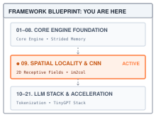
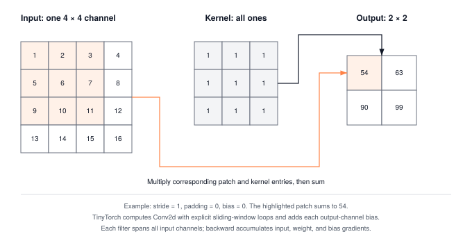
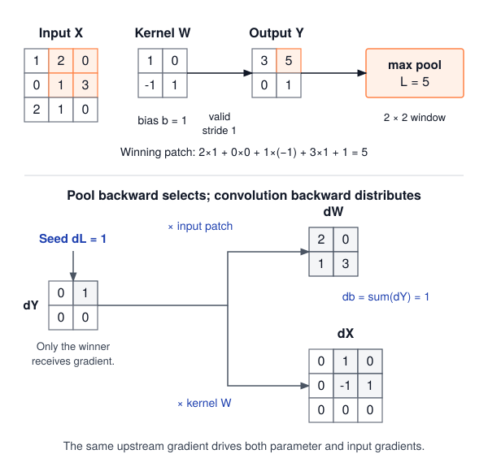

# Convolutions: Sliding Windows and the im2col Trick {#sec-convolutions}

::: {.column-margin}
{width="100%" fig-alt="TinyTorch execution datapath blueprint highlighting Module 09 Convolutions as the active subsystem."}

*Framework Blueprint: Module 09 exploits 2D spatial locality by lowering sliding receptive field convolutions to optimized GEMM matrix multiplication.*
:::


Visual and spatial data exhibit two fundamental physical properties: spatial locality and translation equivariance. Neighboring pixels share strong local correlations, and a visual feature, such as an edge, corner, or texture, maintains identical semantic meaning regardless of where it appears in an image. Fully connected dense layers ignore this spatial structure: flattening an image into a 1D vector gives every pixel its own weight to every hidden unit, causing parameter counts to explode with image size while discarding 2D geometry.

In PyTorch, applying a 2D convolution is expressed in a concise module declaration:

```python
import torch
import torch.nn as nn

# 1 input channel, 4 filters of size 3x3, stride 1, padding 1
conv = nn.Conv2d(in_channels=1, out_channels=4, kernel_size=3, padding=1)
images = torch.randn(8, 1, 28, 28)  # Batch of 8 single-channel images
feature_maps = conv(images)

print("Weight shape:", conv.weight.shape)      # (4, 1, 3, 3)
print("Output shape:", feature_maps.shape)    # (8, 4, 28, 28)
```

Underneath that simple call, the runtime orchestrates several complex systems mechanisms:
1. **Drastic parameter reduction through weight sharing:** Instead of learning separate weights for every pixel coordinate, the layer slides a tiny $(3 \times 3)$ filter bank across the entire image. Four filters across one channel require only 36 weight floats (plus 4 biases), slashing parameter memory by orders of magnitude.
2. **The `im2col` lowering transformation:** While nested loops sliding across 2D patches are conceptually straightforward, they are slow on hardware. Production frameworks extract overlapping 2D spatial patches into a large column matrix (`im2col`), lowering the 4D convolution into a single high-throughput General Matrix Multiply (GEMM).
3. **Autograd gradient scattering:** During backpropagation, output gradients at every spatial coordinate accumulate back into the shared kernel weights, while gradients scatter backward across overlapping input receptive fields.

This chapter expands TinyTorch into spatial representation learning. It implements 2D convolution and max pooling as direct loops inside the autograd framework, then lowers the convolution to a matrix multiply with `im2col`. Before building these kernels, we must inspect the parameter explosion that occurs when dense layers are applied directly to images.

::: {#fig-conv-topology fig-cap="**One filter, four windows**: The highlighted input patch supplies the first output. Moving the same kernel across the remaining positions produces the other three values." fig-alt="A four-by-four grid containing 1 through 16, a three-by-three all-ones kernel, and a two-by-two output containing 54, 63, 90, and 99. The upper-left input patch and output are highlighted."}
{width="100%"}
:::

---

## The Problem

::: {.column-margin}
**↩ Jump back:** @sec-layers
*The `im2col` lowering transformation converts spatial sliding windows into standard GEMM operations.*
:::


Take a modest color photo, $224 \times 224$ pixels with three color channels. Flattened, that is $224 \times 224 \times 3 = 150{,}528$ input numbers. A `Linear` layer from those inputs to 1,024 hidden units needs a weight for every (input, output) pair, so its weight matrix has $150{,}528 \times 1{,}024 \approx 154$ million entries. In float32 that is about 617 MB for the first layer alone, before a single deeper layer or a single gradient buffer. Napkin math, but the conclusion holds at any reasonable image size. A dense first layer on raw pixels is enormous.

Size is the smaller of the two problems. The larger one is that a `Linear` layer has no idea the input was ever a picture. Every input index is just a column of $W$. A fixed permutation of the input pixels can be undone by applying the matching permutation to the columns of its weight matrix. The set of functions the layer can represent is unchanged, because nothing in $XW^T + b$ encodes that pixel $(3, 4)$ is next to pixel $(3, 5)$. The layer has to discover neighborhoods from data, and it has to discover them separately at every location. A vertical edge in the top-left corner and the same edge shifted ten pixels right touch disjoint sets of weights, so the network learns the detector twice, or as many times as there are places an edge can appear.

We want a layer that spends its weights on *what* a pattern looks like, not on *where* it is.

---

## The Idea

::: {.column-margin}
**↪ Jump ahead:** @sec-acceleration
*How hardware accelerators optimize convolution memory layouts and high-throughput GEMM tiling.*
:::


### A filter that slides

A **convolution** replaces the giant weight matrix with a small grid of weights, called a **filter** (or kernel), typically $3 \times 3$ or $5 \times 5$. The filter is placed over the top-left corner of the image, the overlapping pixels are multiplied by the matching filter weights, the products are summed, and the sum becomes one output pixel. Then the filter slides one step to the right and the same weights produce the next output pixel, and so on across and down the image.

With input $X$ of height $H$ and width $W$, a $K \times K$ filter $w$, and a scalar bias $b$, the output at row $h$ and column $c$ is

$$Y[h, c] = b + \sum_{i=0}^{K-1} \sum_{j=0}^{K-1} X[h + i,\; c + j] \cdot w[i, j].$$

Each output pixel sees only a $K \times K$ neighborhood of the input, its **receptive field**, and every output pixel is computed with the same $K^2 + 1$ numbers. That sharing is the whole point. At stride 1, shifting the input shifts the output correspondingly wherever the compared windows do not encounter a changed boundary. Finite-image padding and larger strides limit this correspondence. This property is called **translation equivariance**, and it means a filter that learns to detect a vertical edge detects it everywhere at no extra cost in parameters.

### Channels, padding, stride

Real images have several channels (red, green, blue), and a useful layer produces several output planes, called **feature maps**, one per filter. TinyTorch, like PyTorch, stores an image batch as a 4D tensor with shape $[N, C, H, W]$, meaning $N$ images, each with $C$ channels of $H \times W$ pixels. A filter then spans all input channels, so a layer with $C_{\text{in}}$ input channels and $C_{\text{out}}$ filters holds a weight tensor of shape $[C_{\text{out}}, C_{\text{in}}, K, K]$ plus one bias per filter. Output pixel $(h, c)$ of filter $o$ sums over the input channels too:

$$Y[n, o, h, c] = b[o] + \sum_{\text{ch}=0}^{C_{\text{in}}-1} \sum_{i=0}^{K-1} \sum_{j=0}^{K-1} X[n, \text{ch}, h S + i,\; c S + j] \cdot W[o, \text{ch}, i, j].$$

The channel formula indexes the padded input when padding is enabled. Two choices determine which windows it visits. **Padding** $P$ adds a border of $P$ zero pixels around each input plane, allowing windows to extend beyond its edges. The amount of padding determines whether the output shrinks, stays the same size, or grows. **Stride** $S$ is how far the filter jumps between output pixels; a stride of 2 visits every other position. The number of filter positions that fit along one axis, and therefore the output size, is

$$H_{\text{out}} = \left\lfloor \frac{H + 2P - K}{S} \right\rfloor + 1,$$

and the same for width. The formula is worth memorizing, because it is the source of most shape errors in convolutional networks. For a $3 \times 3$ filter, padding 1 and stride 1 keep the size ($32 \to 32$), padding 0 shrinks it by two ($32 \to 30$), and stride 2 roughly halves it ($32 \to 15$).

Count the parameters. A $3 \times 3$ layer taking 3 channels to 64 filters holds $64 \times 3 \times 3 \times 3 + 64 = 1{,}792$ numbers, and it works on a $224 \times 224$ photo or a $2000 \times 2000$ one without changing. The dense layer from The Problem needed 154 million and was tied to one image size.

{#fig-conv-params}


### Max pooling

**Max pooling** is the second layer we build, and it shrinks the planes a convolution produces. A $2 \times 2$ window with stride 2 slides over each channel independently and keeps only the largest value in each window, halving both height and width. It has no weights. It also makes the network a little tolerant to small shifts, since moving a strong activation one pixel within its window does not change the pooled output. The output-size formula is the same one as for convolution.

### How far a stack of layers can see

One convolution's output pixel sees a $K \times K$ patch. Stack layers and the patch grows, because each output of a later layer combines several outputs of the earlier one. A layer adds $K - 1$ positions of reach at its own depth, and one position at that depth spans as many input pixels as the product of the strides below it. The **receptive field** $r_\ell$ of layer $\ell$, measured in input pixels along one axis, therefore follows

$$r_\ell = r_{\ell-1} + (K_\ell - 1)\prod_{i<\ell} S_i, \qquad r_0 = 1.$$

Three stacked $3 \times 3$ convolutions at stride 1 see 3, then 5, then 7 pixels. One $7 \times 7$ filter would see the same patch with $49$ weights per pair of input and output channels, where the stack uses $3 \times 9 = 27$ and applies a nonlinearity between each layer; that trade is the design argument behind the VGG family of networks. Pooling layers count as well. @sec-milestone-2's network runs a $3 \times 3$ convolution and then $2 \times 2$ pooling at stride 2, so its receptive field is 3 after the convolution and $3 + (2 - 1) \cdot 1 = 4$ after the pool. A $3 \times 3$ convolution placed after that pool would add $(3 - 1) \cdot 2 = 4$ more, reaching 8 of the image's 8 pixels.

### The im2col trick

Look again at the single-output formula. Each output pixel is a dot product between two lists of $C_{\text{in}} K^2$ numbers, the flattened patch under the filter and the flattened filter. That means the entire layer is a matrix multiply in disguise. Write every patch the filter visits as one row of a matrix, with $N \cdot H_{\text{out}} \cdot W_{\text{out}}$ rows of length $C_{\text{in}} K^2$, and write every filter as one column of a second matrix, with $C_{\text{in}} K^2$ rows and $C_{\text{out}}$ columns. Their product has one row per output position and one column per filter, and reshaping it gives the $[N, C_{\text{out}}, H_{\text{out}}, W_{\text{out}}]$ output. Building the patch matrix is called **im2col** ("image to column"), and the four steps are

::: {.column-margin}
{width="100%" fig-alt="IM2COL receptive field patch unrolled into a matrix row vector, multiplying memory footprint by 9x."}

*im2col unrolls spatial 2D patches into GEMM matrix rows, expanding memory footprint by $K_h \times K_w = 9\times$.*
:::

1. unroll every $K \times K \times C_{\text{in}}$ patch into a row of $X_{\text{col}}$, shape $[N H_{\text{out}} W_{\text{out}},\; C_{\text{in}} K^2]$;
2. flatten every filter into a column of $W_{\text{col}}$, shape $[C_{\text{in}} K^2,\; C_{\text{out}}]$;
3. compute $Y_{\text{col}} = X_{\text{col}} W_{\text{col}}$, shape $[N H_{\text{out}} W_{\text{out}},\; C_{\text{out}}]$;
4. add the bias and reshape to $[N, C_{\text{out}}, H_{\text{out}}, W_{\text{out}}]$.

The matrix multiplication performs the same dot products. The Code section counts the extra storage and separates that analytical cost from elapsed time, which depends on the workload and machine.

{#fig-im2col-lowering-gemm width="100%" fig-alt="Diagram showing input feature patches unrolled into matrix X_col, kernel weights into W_col, their GEMM matrix product Y_col, and reshape to output tensor."}

### The backward pass

A single term makes the backward rule concrete. If a weight $w=2$ multiplies an input $x=3$ and the output receives gradient $g=4$, the contribution to the weight gradient is $gx=12$ and the contribution to the input gradient is $gw=8$. Convolution repeats this product rule across its windows and adds contributions wherever an input or shared weight appears again. Call the incoming gradient $G = \partial \mathcal{L} / \partial Y$, with the same shape as the output. Since $Y$ is a sum of terms $X[\ldots] \cdot W[\ldots]$, each output pixel contributes its gradient value times the input pixel it multiplied to the weight's gradient, and its gradient value times the weight to the input pixel's gradient:

$$
\begin{aligned}
\frac{\partial \mathcal{L}}{\partial W[o, \text{ch}, i, j]} &= \sum_{n, h, c} G[n, o, h, c] \cdot X[n, \text{ch}, hS + i, cS + j], \\
\frac{\partial \mathcal{L}}{\partial b[o]} &= \sum_{n, h, c} G[n, o, h, c].
\end{aligned}
$$

The input gradient is the mirror image, scattering $G[n, o, h, c] \cdot W[o, \text{ch}, i, j]$ back onto input pixel $(hS + i, cS + j)$. The window loops accumulate input and weight gradients; a separate reduction sums the bias gradient.[^fn-col2im-scatter] Max pooling has no weights, and its gradient goes entirely to the one input pixel that won each window; the others receive zero.

[^fn-col2im-scatter]: In lowered matrix formulations, input gradient accumulation is computed via the **col2im** operation, the adjoint of im2col. Because sliding windows overlap, col2im cannot simply reshape $G_{\text{col}}$; it must accumulate overlapping entries using a scatter-add ($+=$) reduction into the spatial input buffer.


---

## The Code

::: {.column-margin}
{width="100%" fig-alt="Source code mapping card for Module 09 Convolutions showing file path, exported package, and tested primitives."}

*Source Code Mapping: Module 09 extracts Conv2d spatial convolution, im2col buffer unrolling, and MaxPool2d downsampling directly from the working repository.*
:::

Consider `conv = Conv2d(1, 2, 3, stride=2, padding=1)` applied to an input of shape `(1, 1, 4, 4)`. Calling `conv(x)` enters `Conv2d.__call__`, then `forward`. The layer validates the four axes and computes the spatial output size before calling `Conv2dFunction.apply(x, weight, bias, layer=self)`. The two filters have shape `(2, 1, 3, 3)`, and the result will have shape `(1, 2, 2, 2)`. The batch axis survives; the output-channel axis counts filters; the final two axes count valid window positions.

`apply` is the boundary established in @sec-autograd. It gives `Conv2dFunction.forward` NumPy arrays for the arithmetic while retaining the input tensors as the parents of the output. The operation calls the layer’s shape, padding, and convolution helpers through `self.layer`. Each helper can therefore be tested independently, yet the complete call produces a tensor whose gradient record still points to the image, weights, and bias. Calling a helper directly and wrapping its array in a new `Tensor` would preserve the output values but omit that record.

### Output size and padding

Before any filter slides, the layer must settle its output dimensions and its border behavior.

The size question comes first because every layer allocates its output before it computes a single value, and the layer after it needs that shape to allocate its own. Get it wrong by one and the network fails three layers later with an error that names the wrong layer. `_compute_output_shape` is the formula from The Idea, and `forward` rejects a nonpositive spatial output before entering the loops. A mismatched input-channel count also raises at this boundary, so a caller gets an error at the layer responsible for the mismatch.



The border question is what padding is for. A $3 \times 3$ filter with no padding shrinks the image by two pixels per layer, so a $32 \times 32$ input is $12 \times 12$ after ten layers, and the pixels near the edge get less attention than the ones in the middle (a corner pixel is covered by exactly one filter position, a center pixel by nine). For this kernel, padding 1 preserves the output size and lets windows include every edge pixel, although boundary pixels still appear in fewer windows than interior pixels. The naive way to handle a border is a bounds check inside the innermost loop, an `if` on every one of the roughly 87 million multiplies a $224 \times 224$ color photo needs from a single 64-filter layer. The better way is to build the padded image once, before the loops, and then let every loop run as if there were no edge at all.



Only the two spatial axes get padded; batch and channel are untouched. With positive padding, `np.pad` creates a separate array and leaves the caller's input unchanged. With padding 0, the helper returns the input array itself, which the convolution only reads. The loop writes into a separate output array; padding is temporary storage for this call, not a trainable parameter.

### The direct convolution

The direct implementation is a readable reference for every alternative. The im2col model and gradient checks below must reproduce its values. For one $224 \times 224$ image through `Conv2d(3, 64, 3, padding=1)`, the loops perform $224 \times 224 \times 64 \times 3 \times 3 \times 3=86{,}704{,}128$ multiply-adds. Four loops pick an output position; three more form its dot product. This count describes work, not elapsed time. Python indexing and loop overhead make the implementation useful for tracing small examples rather than predicting production throughput.



For the `(1, 1, 4, 4)` stride-2 example, `_apply_padding` makes a `(1, 1, 6, 6)` array. At output position `(oh=1, ow=0)`, the window starts at padded position `(2, 0)`, because each output index is multiplied by stride 2. Kernel position `(k_h=1, k_w=2)` then reads padded position `(3, 2)`, which is original image position `(2, 1)` after subtracting the one-pixel border. The outer `out_ch` loop changes the filter used with that same window. Every visit adds a product into `conv_sum`; only after the window is complete does the helper write one output value.

The operation that autograd records is a thin wrapper around the helpers. Its `forward` receives the arrays, asks the layer for the output shape, pads, convolves, and adds the bias to each output channel.



The `self.layer` it reaches for is a parameter of the operation, passed as `layer=self` when the layer calls `apply`, which is how a `Function` that works on bare arrays can borrow the stride, padding, and helpers that live on the layer.

### Pooling

With padding chosen to preserve spatial size, a convolution hands the next layer a plane the same size as the one it received, and that gets expensive to keep doing. Run the numbers for the first layer of a photo network. The $224 \times 224$ color input holds 150,528 numbers. After `Conv2d(3, 64, 3, padding=1)` there are $64 \times 224 \times 224 = 3{,}211{,}264$ of them, 12.8 MB in float32 for a single image, and a second $3 \times 3$ layer with 64 input and 64 output channels does about 1.85 billion multiplies per image, 21 times what the first layer did, because its dot products are 576 long instead of 27. Left at full resolution, every later layer pays that. There is a second problem. A $3 \times 3$ filter widens what one output pixel can see by only two pixels per layer, so at full resolution it takes over a hundred layers before any output has seen the whole 224-wide picture.

The cheap fix is to shrink the planes between convolutions. Max pooling slides a $2 \times 2$ window with stride 2 over each channel and keeps the largest value in each window. That quarters the stored activations for even spatial dimensions and costs no weights. It also doubles the distance between neighboring pooled positions in the original image, so a subsequent convolution reaches farther across that image. In code it replaces the dot product with a running `max` and runs per channel, so it has no channel loop inside the window.



`MaxPool2d(2)` defaults to stride `(2, 2)`, while `MaxPool2d((2, 3))` defaults to `(2, 3)`. Height and width use their own stride, so rectangular windows tile without accidental overlap. An explicit integer stride applies to both axes. The layer follows `__call__` → `forward` → `_compute_pool_output_shape` → `MaxPool2dFunction.apply`. The operation pads if needed and calls `_maxpool_loops`; a kernel that cannot fit raises before an empty output can reach the next layer.

The module retains the input through `Function.apply`; its backward method scans each window again to recover the winning position. It selects the first valid maximum in row-major order when values tie. The gradient uses `+=` because overlapping windows can select the same input more than once. Max-pool padding contains negative infinity rather than zero, so it cannot defeat a finite negative activation. Backward excludes padding from its candidates, including when real input values are also negative infinity.

Average pooling changes the reduction, not the geometry. For a window `[[1, 2], [3, 4]]`, max pooling returns 4 and sends a unit gradient to the lower-right element; average pooling returns 2.5 and sends 0.25 to each element. `AvgPool2d` always divides by the full kernel area, including zero-padding positions. A corner window containing one real value 4 and three padded zeros therefore returns 1, and a unit upstream gradient gives that real input 0.25. The padded shares have no input owner and are removed when backward crops the gradient. Both pooling layers return an empty parameter list; their operation records exist to train earlier layers.

### im2col

::: {#chk-conv-im2col-scope .callout-checkpoint title="Checkpoint: Model implementation versus module code"}
Module 09 stops at the loops. The two functions in this section are the chapter's own NumPy model of the trick GPU libraries use, and the worked trace checks that they reproduce the module's numbers. @sec-acceleration builds im2col into the package and times it against these loops.
:::

The direct loops spend time on more than arithmetic. Each multiply requires Python to execute loop control and NumPy scalar indexing. The array accesses are structured, but writing the computation as scalar Python operations does not hand an entire dot product to NumPy's compiled matrix-multiplication routine. im2col changes that execution boundary.

Look at the direct routine again. The three innermost loops form a dot product between two lists of $C_{\text{in}} K^2$ numbers, the flattened patch under the filter and the flattened filter, and every output pixel is one of those dot products. We can move those dot products into one matrix operation, paying the Python loop overhead per copied patch instead of per multiply. Copy each patch the filter visits into the row of a matrix, flatten each filter into a column, and let one `matmul` do every dot product at once. The `matmul` operation from @sec-tensors already delegates matrix arithmetic to NumPy; the chapter model uses the same numerical primitive.

For a $32 \times 32$ color image with sixteen $3 \times 3$ filters and padding 1, both formulations perform 442,368 multiplies. The patch matrix contains 27,648 numbers, compared with 3,072 in the input. These are exact element counts for this shape, not memory measurements or timing results. Neighboring patches repeat input pixels, up to nine appearances per interior pixel. Moving the dot products into one matrix multiplication trades that extra copying and storage for less Python work; whether it improves elapsed time must be measured on the same input, dtype, and execution environment.

The model in @lst-conv-im2col-model walks the same output positions as the loops, but instead of multiplying it copies the patch into a row. The order inside a row (channel, then filter row, then filter column) is the order `ravel` produces and the order `reshape` gives the flattened filters, so the dot products pair the right numbers.

::: {#lst-conv-im2col-model lst-cap="**An array-only convolution model**: The patch buffer exposes the storage cost of turning windows into a matrix."}
```python
import numpy as np

def im2col(x, K, stride=1, padding=0):
    """Return patches (one row per position), H_out, and W_out."""
    x = np.pad(x, ((0, 0), (0, 0), (padding, padding), (padding, padding)))
    N, C, H, W = x.shape
    H_out = (H - K) // stride + 1
    W_out = (W - K) // stride + 1
    patches = np.empty((N * H_out * W_out, C * K * K), dtype=x.dtype)
    r = 0
    for n in range(N):
        for oh in range(H_out):
            for ow in range(W_out):
                patch = x[n, :, oh * stride:oh * stride + K,
                          ow * stride:ow * stride + K]
                patches[r] = patch.ravel()
                r += 1
    return patches, H_out, W_out

def conv2d_im2col(x, weight, bias, stride=1, padding=0):
    """x: (N, C_in, H, W); weight: (C_out, C_in, K, K); bias: (C_out,)."""
    N, C_out, K = x.shape[0], weight.shape[0], weight.shape[2]
    patches, H_out, W_out = im2col(x, K, stride, padding)
    product = patches @ weight.reshape(C_out, -1).T + bias
    planes = product.reshape(N, H_out, W_out, C_out)
    return planes.transpose(0, 3, 1, 2)
```
:::

The multiplies all happen inside the `@`. Everything around it is copying and reshaping. `patches` holds $N H_{\text{out}} W_{\text{out}} C_{\text{in}} K^2$ numbers where the input held $N C_{\text{in}} H W$, which gives the ninefold storage expansion in the example above. The last line uses NumPy views to arrange the output axes: the product comes out with the output channel as its last axis, and a `reshape` plus a `transpose` present it as $[N, C_{\text{out}}, H_{\text{out}}, W_{\text{out}}]$ without moving a number. This helper supports square filters and scalar stride/padding. It is an array-only comparison model; the module also accepts rectangular kernels, and its tensor operations retain the gradient graph.

::: {.column-margin}
**Core Invariant: Spatial Unfolding**\
$$\text{Patch } (C_{\text{in}}, K, K) \to \text{Row in } X_{\text{col}}$$\
*Converts nested 4D spatial sliding windows into a single BLAS GEMM at the expense of $K^2$ memory expansion.*
:::

{#fig-im2col-unfolding width="100%" fig-alt="Diagram of im2col lowering: 2D sliding receptive field unfolds into column vector, filter bank unfolds into rows, resulting in single matrix multiplication."}


::: {#nbk-convolutions-im2col-footprint .callout-notebook title="Napkin Math: im2col memory expansion ratio"}

**Problem**: For a batch of $B=32$ feature maps with $C_{\text{in}}=64$ channels and spatial dimensions $112 \times 112$, what is the memory overhead of lowering a $3 \times 3$ convolution via explicit im2col?

**Input tensor storage**:
$$\text{Input memory} = 32 \times 64 \times 112 \times 112 \times 4\text{ bytes} \approx 102.8\text{ MB}$$

**Lowered im2col matrix storage**:
$$\text{im2col matrix} = (32 \times 112 \times 112) \times (64 \times 3 \times 3) \times 4\text{ bytes} \approx 924.8\text{ MB}$$

**Systems insight**: Explicit im2col duplicates input values by $K_h \times K_w = 9.0\times$ in memory. For deep vision models, explicit im2col buffers quickly overwhelm device RAM, motivating production libraries (cuDNN) to use *implicit GEMM* where addresses are computed in hardware registers on the fly without materializing the patch matrix in DRAM.

:::

::: {.content-visible when-format="pdf"}
```{=latex}
\clearpage
```
:::

### The gradients

The training loop needs the gradient of every parameter at each step. A centered finite-difference check would rerun the forward pass twice per tested parameter: 3,584 forwards to check all 1,792 parameters of `Conv2d(3, 64, 3)`. That makes numerical differentiation useful for checking a small sample, not for implementing each update. The product rule from The Idea computes all gradients by revisiting the windows once. The operation returns one gradient per tensor input it consumed: the image, the weights, and, when present, the bias.



Where the forward pass read `input_val * weight_val` and wrote to `output`, the backward pass reads `grad_val` and accumulates into two separate buffers. `grad_weight` receives `input_val * grad_val`; `grad_input_padded` receives `weight_val * grad_val`. Their shapes match the weights and padded input. Neither operation changes the parameter values; the optimizer does that later. Notice the bias gradient. Because the bias vector of shape `[C_out]` was broadcast across the batch dimension $N$ and both spatial dimensions $(H_{\text{out}}, W_{\text{out}})$ during the forward pass, its derivative sums upstream gradients over those three axes, expressed by `grad_output[:, out_ch, :, :].sum()`. The broadcast-reduction contract reappears inside spatial convolution. Notice also the last few lines, which strip the padding border off the input gradient, because the zeros we added have no owner to receive a gradient. The tensor's `backward()` reaches this method through the record that `apply` made, without the caller knowing.

### The layer

Finally the layer object, because the routines above are helpers and operations and the rest of TinyTorch works with layers. The optimizer from @sec-optimizers asks each layer for `parameters()`, and `Sequential` from @sec-layers calls `forward`, so `Conv2d` needs the same two methods `Linear` has. The one decision hiding in the constructor is the initial scale of the weights, and the wrong choice here produces a wrong number, not a slow one. This convolution uses a normal distribution with standard deviation $\sqrt{2 / \text{fan\_in}}$, whose factor of 2 compensates for the ReLU that follows, and the trap is what fan-in means for a filter. It is not the number of pixels in the image. Each output pixel sums $C_{\text{in}} K^2$ products, 27 for the first layer of a color network, so that is the fan-in.[^fn-kaiming-init] Use the image size instead, 150,528 for a $224 \times 224$ photo, and the weights come out about 75 times too small; the first layer's activations inherit that smaller scale. Repeating such under-scaling through a network can leave very small signals at the loss.

[^fn-kaiming-init]: **Kaiming (He) initialization** sets weight variance $\text{Var}(W) = 2 / \text{fan\_in}$ where $\text{fan\_in} = C_{\text{in}} \cdot K_h \cdot K_w$. The factor of 2 accounts for half the activations being zeroed out by subsequent ReLU nonlinearities ($\mathbb{E}[\max(0, x)^2] = \frac{1}{2} \text{Var}(x)$), maintaining constant activation variance across arbitrarily deep convolutional networks.








`Conv2d(3, 64, 3)` has exactly the 1,792 numbers counted earlier, and `parameters()` hands them to an optimizer the same way `Linear` did. `forward` validates the input, computes the output shape, and hands the tensors and itself to `Conv2dFunction.apply`, which records the operation so that a later `backward()` can find the gradient method above. The fan-in counts the same local connections used by the forward loop, so changing image size does not change the initialization scale.

### Batch normalization and layer state

For one channel containing `[[0, 1], [2, 3]]`, the mean is 1.5 and the variance is 1.25. With `gamma=1`, `beta=0`, and the default small denominator offset, `BatchNorm2d` returns approximately `[[-1.342, -0.447], [0.447, 1.342]]`. Even one image has several values per channel, so a batch of one does not generally normalize to zeros.

The layer performs this calculation separately for each channel. For a tensor `(N, C, H, W)`, `_get_stats` reduces axes `(0, 2, 3)` and leaves one mean and variance per channel. `BatchNorm2dFunction.forward` reshapes those arrays to `(1, C, 1, 1)`, normalizes each activation, and applies learned scale `gamma` and shift `beta`. The input and output shapes match; the tensor broadcasting contract applies to whole image planes.

There are two kinds of persistent state on the layer. `gamma` and `beta` are tensors returned by `parameters()`, so the optimizer updates them from gradients. `running_mean` and `running_var` are NumPy arrays updated by `_get_stats` during each training forward call. With the default momentum 0.1, the new running value combines 0.9 of the old value and 0.1 of the current batch statistic. For the four-value example, the initial running mean 0 becomes 0.15, and the initial running variance 1 becomes 1.025. TinyTorch uses the population variance from `np.var` for both normalization and this update. These arrays do not belong in the optimizer’s parameter list. A training forward changes them even if no backward or optimizer step follows.



Calling `bn.eval()` changes which statistics the next forward uses. It reads the running arrays and leaves them unchanged; `bn.train()` restores batch statistics and running updates. Evaluation mode does not disable autograd. The operation receives the mode as an argument to `apply` and still has a backward rule, but that rule treats the running statistics as constants. A model containing BatchNorm must propagate its mode changes to these layers before validation, or validation data will change the statistics and each prediction will depend on the other examples in its batch.

The backward calculation explains why the mode is part of the operation record. In training, changing one activation changes its channel’s mean and variance, which changes every normalized activation in that channel. `BatchNorm2dFunction.backward` therefore combines the direct gradient with two reductions, `sum_grad` and `sum_grad_norm`, that account for those dependencies. In evaluation only the direct scale by `gamma * inv_std` remains. Both modes sum over `(0, 2, 3)` for `grad_beta` and sum `grad_output * normalized` over those axes for `grad_gamma`. The saved `normalized_data` and `inv_std` let backward use the quantities from this particular forward call.

These spatial layers connect to the existing training loop through their tensor outputs and parameter lists. A classifier can pass `conv(x)` through normalization, activation, and pooling, then call `pooled.reshape(batch_size, -1)` before a `Linear` layer. Using `Tensor(pooled.data.reshape(...))` instead would detach the features; the classifier could still receive gradients while the convolution stopped learning. After a complete forward, the loss traverses the recorded operations backward, and the optimizer updates the parameters returned by the convolution, normalization, and classifier layers.

---

## A Worked Trace

One image, one channel, $3 \times 3$ pixels, one $2 \times 2$ filter with bias $1$, no padding, stride 1:

$$X = \begin{bmatrix} 1 & 2 & 0 \\ 0 & 1 & 3 \\ 2 & 1 & 0 \end{bmatrix}, \qquad w = \begin{bmatrix} 1 & 0 \\ -1 & 1 \end{bmatrix}, \qquad b = 1.$$

The output is $\lfloor (3 - 2)/1 \rfloor + 1 = 2$ pixels on each side. The filter visits four positions, and each row of the trace in @tbl-im2col-trace is also one row of the im2col matrix.

| Output $(h, c)$ | Input slice | Patch as a row | Dot product plus bias | $Y[h, c]$ |
| :--- | :---: | :--- | :--- | :---: |
| $(0, 0)$ | $[0{:}2,\, 0{:}2]$ | $[1, 2, 0, 1]$ | $1(1) + 2(0) + 0(-1) + 1(1) + 1$ | $3$ |
| $(0, 1)$ | $[0{:}2,\, 1{:}3]$ | $[2, 0, 1, 3]$ | $2(1) + 0(0) + 1(-1) + 3(1) + 1$ | $5$ |
| $(1, 0)$ | $[1{:}3,\, 0{:}2]$ | $[0, 1, 2, 1]$ | $0(1) + 1(0) + 2(-1) + 1(1) + 1$ | $0$ |
| $(1, 1)$ | $[1{:}3,\, 1{:}3]$ | $[1, 3, 1, 0]$ | $1(1) + 3(0) + 1(-1) + 0(1) + 1$ | $1$ |

: **Four windows, one shared filter**: Each output pixel is a dot product between the flattened patch and the flattened filter $[1, 0, -1, 1]$. The four patch rows stacked are exactly $X_{\text{col}}$. {#tbl-im2col-trace tbl-colwidths="[16,16,22,34,12]"}

The result is $Y = \begin{bmatrix} 3 & 5 \\ 0 & 1 \end{bmatrix}$, and a $2 \times 2$ max pool over it keeps the single value $5$.

The backward pass is just as checkable. Send back a gradient of 1 at every output pixel. Weight $w[0, 0]$ multiplied the top-left pixel of each of the four patches, so its gradient is $1 + 2 + 0 + 1 = 4$. Weight $w[0, 1]$ saw the top-right pixel of each patch, $2 + 0 + 1 + 3 = 6$. The bias gradient is the sum of the four incoming ones. For the input, the center pixel $X[1, 1]$ was touched by all four filter positions, once under each weight, so its gradient is $1 + 0 + (-1) + 1 = 1$; the corner $X[2, 0]$ was touched only by $w[1, 0]$ and gets $-1$. The script in @lst-conv-window-trace runs the module's layer, checks the im2col model against it, and lets `backward()` reach the gradient method through the tape.

::: {#lst-conv-window-trace lst-cap="**Tracing four convolution windows**: The layer and im2col model agree before the recorded backward pass accumulates gradients."}
```python
import numpy as np
from tinytorch.core.tensor import Tensor
from tinytorch.core.spatial import Conv2d, MaxPool2d
import tinytorch.core.autograd

X = Tensor(np.array([[[[1.0, 2.0, 0.0],
                       [0.0, 1.0, 3.0],
                       [2.0, 1.0, 0.0]]]]), requires_grad=True)
conv = Conv2d(1, 1, 2)
conv.weight.data[:] = [[[[1.0, 0.0], [-1.0, 1.0]]]]
conv.bias.data[:] = [1.0]

Y = conv(X)
print(Y.data[0, 0].tolist())  # [[3.0, 5.0], [0.0, 1.0]]
modeled = conv2d_im2col(X.data, conv.weight.data, conv.bias.data)
assert np.allclose(Y.data, modeled)
print(MaxPool2d(2)(Y).data[0, 0].tolist())  # [[5.0]]

Y.backward(Tensor(np.ones_like(Y.data)))
print(conv.weight.grad[0, 0].tolist())   # [[4.0, 6.0], [4.0, 5.0]]
print(conv.bias.grad.tolist())           # [4.0]
print(X.grad[0, 0].tolist())
# [[1.0, 1.0, 0.0], [0.0, 1.0, 1.0], [-1.0, 0.0, 1.0]]
```
:::

In @lst-conv-window-trace, lines 6--8 initialize a single $3 \times 3$ image tensor `X` with `requires_grad=True`. Lines 9--11 set up `conv = Conv2d(1, 1, 2)` with the trace kernel $\begin{bmatrix} 1 & 0 \\ -1 & 1 \end{bmatrix}$ and bias $1.0$. Line 13 executes the forward convolution `Y = conv(X)`, printing `[[3.0, 5.0], [0.0, 1.0]]` in line 14. Lines 15--16 verify that the layer's output matches `conv2d_im2col` bit-for-bit via `np.allclose`. In line 17, `MaxPool2d(2)(Y)` extracts the winning activation `[[5.0]]`.

In line 19, `Y.backward(...)` injects unit gradients across all four output pixels. Lines 20--23 print the resulting analytical gradients: `conv.weight.grad` receives the column-patch sums `[[4.0, 6.0], [4.0, 5.0]]` (line 20), `conv.bias.grad` sums all four outputs to `[4.0]` (line 21), and `X.grad` reflects kernel overlap across pixels (lines 22--23).

The preceding backward call differentiated the sum of the four convolution outputs. Pooling defines a different scalar objective. For `MaxPool2d(2)(conv(X)).sum()`, only the top-right convolution output, value 5, wins. Its incoming gradient is 1 and the other three receive zero, so the weight gradient is exactly that winning patch, `[[2, 0], [1, 3]]`, and the bias gradient is 1.

::: {.content-visible when-format="pdf"}
```{=latex}
\clearpage
```
:::

The two destinations in @fig-convolution-backward-route come from the same product rule. The selected patch supplies the weight gradient, while the filter supplies the input gradient at that patch's location.

::: {#fig-convolution-backward-route fig-cap="**Routing the winning gradient**: Max pooling selects the output value 5. Its unit gradient reaches one convolution window, whose input patch supplies the weight gradient and whose kernel supplies the input gradient." fig-alt="Input X and kernel W produce a two-by-two output with values 3, 5, 0, and 1. The top-right value wins max pooling. A unit gradient branches to a two-by-two weight gradient and a three-by-three input gradient, with bias gradient 1."}
{width="100%"}
:::

::: {#lst-conv-pool-trace lst-cap="**Tracing a pooled objective**: A fresh graph routes a unit gradient through the winning window."}
```python
# Build a fresh graph after the preceding backward released its records.
X.grad = None
for parameter in conv.parameters():
    parameter.grad = None
pooled = MaxPool2d(2)(conv(X))
pooled.sum().backward()
assert np.allclose(conv.weight.grad[0, 0], [[2, 0], [1, 3]])
assert np.allclose(conv.bias.grad, [1])
assert np.allclose(X.grad[0, 0], [[0, 1, 0], [0, -1, 1], [0, 0, 0]])
```
:::

In @lst-conv-pool-trace, clearing parameter gradients prevents the two objectives from accumulating into the same buffers. Recomputing `conv(X)` is separately necessary because the earlier `Y.backward(...)` released its operation records. This distinction is the graph-lifetime rule from @sec-autograd in a complete spatial chain. The array-only im2col model can check forward values, but it does not create a TinyTorch graph and cannot replace this training path.

---

## From TinyTorch to Production

A production implementation can preserve the window computation while changing how it executes. NVIDIA's cuDNN library includes implicit matrix-multiplication and transform-based convolution methods. **GEMM** means general matrix multiplication; *implicit* means the patch matrix is formed as values are needed instead of stored in full. Shape and available workspace influence the choice. [NVIDIA's convolution guide](https://docs.nvidia.com/deeplearning/performance/dl-performance-convolutional/index.html) explains these alternatives. @Tbl-cudnn-conv-algorithms compares their mechanisms rather than prescribing a universal winner.

| Algorithm | Main trade-off | What it does |
| :--- | :--- | :--- |
| Explicit im2col + GEMM | Extra patch storage | Build the patch matrix and multiply, as in the chapter model. |
| Implicit GEMM | More indexing inside execution | Compute with patches without storing the full patch matrix. |
| Winograd | Transform work and numerical behavior | Transform small tiles to reduce multiplication count. |
| FFT | Transform work and storage | Transform inputs and filters, multiply, then transform back. |

: **Alternative convolution formulations**: Each preserves the intended convolution while changing its arithmetic or temporary storage. Actual performance depends on the implementation and workload. {#tbl-cudnn-conv-algorithms tbl-colwidths="[24,26,50]"}

::: {#psp-convolutions-cudnn-winograd .callout-perspective title="Production Bridge: cuDNN implicit GEMM and Winograd minimal filtering"}
Modern deep learning hardware rarely materializes an explicit im2col matrix. NVIDIA cuDNN selects dynamically among four convolution engines based on kernel geometry and available GPU workspace:
1. **Implicit GEMM**: Computes matrix addresses directly inside CUDA thread indexing formulas, achieving GEMM speed without the $9\times$ memory duplication penalty.
2. **Winograd $F(2 \times 2, 3 \times 3)$**: Uses polynomial residue transforms to reduce 2D multiplications from $4 \times 9 = 36$ down to $16$, yielding up to $2.25\times$ computational throughput on $3 \times 3$ filters at the expense of slight numerical precision.
:::

The transform methods require mathematical tools beyond this implementation. Winograd changes the representation of small tiles to reduce multiplication count.[^fn-winograd-conv-algos] FFT methods transform larger arrays before multiplying.[^fn-fft-conv-algos] Neither method is implemented by Module 09; the reference loops provide values against which such alternatives can be checked.

[^fn-winograd-conv-algos]: **Winograd convolution** applies minimal-filtering algorithms to small convolution tiles. The [paper by Lavin and Gray](https://arxiv.org/abs/1509.09308) develops these algorithms for convolutional networks and compares their arithmetic and execution costs.

[^fn-fft-conv-algos]: **FFT convolution** uses the fast Fourier transform to express convolution through pointwise products in a transformed representation. The input and output transforms add work and storage, so fewer products alone do not establish a speedup.

The storage calculation makes the reason for implicit GEMM concrete. A batch of 32 images with 64 channels and $112 \times 112$ pixels contains 25,690,112 values, about 103 MB at four bytes per value. With a $3 \times 3$ filter, padding 1, and stride 1, the explicit patch matrix has nine times as many entries, about 925 MB. These are buffer-size calculations, not measured process memory. Avoiding that full matrix removes a large temporary allocation while keeping the same virtual dot products; it does not remove the need to fetch the inputs.

The optional comparison in @lst-conv-production-trace preserves the small example's numerical contract. The output-size formula, the weight shape $[C_{\text{out}}, C_{\text{in}}, K, K]$, the parameter count, and the gradient formulas are the same in PyTorch, and `nn.Conv2d(1, 1, 2)` loaded with our filter returns our $[[3, 5], [0, 1]]$. The FLOP count is easiest to read off the im2col view, $2 \cdot N H_{\text{out}} W_{\text{out}} \cdot C_{\text{out}} \cdot C_{\text{in}} K^2$ (counting a multiply-add as two operations and excluding bias additions), which estimates the arithmetic work per layer before execution. Max pooling still routes each gradient to one winning pixel.

::: {#lst-conv-production-trace lst-cap="**The same window in PyTorch**: The optional comparison uses the identical input, filter, and bias."}
```python
# Optional production comparison; not a TinyTorch dependency.
import torch, torch.nn as nn

conv = nn.Conv2d(in_channels=1, out_channels=1, kernel_size=2)
with torch.no_grad():
    conv.weight.copy_(torch.tensor([[[[1.0, 0.0], [-1.0, 1.0]]]]))
    conv.bias.copy_(torch.tensor([1.0]))

x = torch.tensor([[[[1.0, 2.0, 0.0], [0.0, 1.0, 3.0], [2.0, 1.0, 0.0]]]])
print(conv(x).squeeze())          # tensor([[3., 5.], [0., 1.]])
```
:::

Memory layout is another implementation choice. A tensor can retain logical shape `(N, C, H, W)` while changing which neighboring values sit next to each other in memory. PyTorch's `channels_last` format keeps those logical axes and changes the strides so channels are adjacent; it is not a request to pass an NHWC-shaped tensor to `Conv2d`. The [PyTorch memory-format tutorial](https://docs.pytorch.org/tutorials/intermediate/memory_format_tutorial.html) demonstrates that distinction. Module 09 uses its ordinary NumPy arrays. @Sec-profiling later separates operation counts, modeled storage, and elapsed time; none of these alone establishes which layout or convolution algorithm will be fastest.

---

## Summary

A call to `Conv2d` validates `(N, C, H, W)`, allocates its output, visits each window, and adds each filter's bias. `Function.apply` connects that output to the input and parameter tensors. Backward revisits the same windows, accumulating contributions into input and weight gradients and summing the broadcast bias gradient. Shared weights explain both the small parameter count and the need to add contributions from many output positions.

Pooling preserves batch and channel axes while changing the spatial dimensions. Max pooling selects a winner per window; average pooling divides among the full kernel area, including padded positions. Batch normalization preserves shape and maintains two distinct kinds of state: learned scale and shift, and running statistics updated by training forwards. A returning reader can check the spatial chain by reproducing the worked values, then confirming that the same parameters receive gradients.

The im2col model gives the same forward computation a matrix shape at the cost of an explicit patch buffer. It does not replace the module's recorded operations or establish a universal speedup. @Sec-tokenization changes the input domain from image grids to text and explains how strings become the integer IDs that later tensor layers consume.

::: {#chk-milestone-04 .callout-checkpoint title="Milestone 04 Unlocked: The 1998 CNN Revolution"}
With `Conv2d` and `MaxPool2d` complete (Modules 01–09), you can run Yann LeCun's LeNet architecture on handwritten digits:

```bash
tito milestone run 04
```

This milestone tests spatial weight sharing against dense multi-layer perceptrons on TinyDigits, demonstrating why convolutional inductive biases reduce parameter counts from 2,410 down to 810. See @sec-milestone-2 (Part 1) for the complete experimental comparison.
:::

---

## Further Reading

- **LeCun et al.** (1998). "[Gradient-based learning applied to document recognition](https://doi.org/10.1109/5.726791)." *Proceedings of the IEEE*. LeNet, weight sharing, and pooling, the design @sec-milestone-2 tests on TinyDigits.
- **Chellapilla, Puri, and Simard** (2006). "[High performance convolutional neural networks for document processing](https://inria.hal.science/inria-00112631)." *IWFHR*. The unrolling of convolution into a matrix product that this chapter models as im2col.
- **Simonyan and Zisserman** (2015). "[Very deep convolutional networks for large-scale image recognition](https://arxiv.org/abs/1409.1556)." *ICLR*. Stacks of small filters in place of large ones, the receptive-field trade described above.
