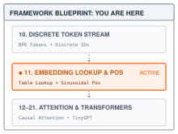
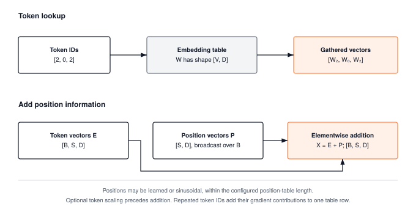
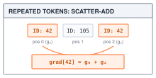
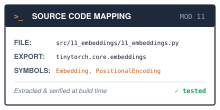
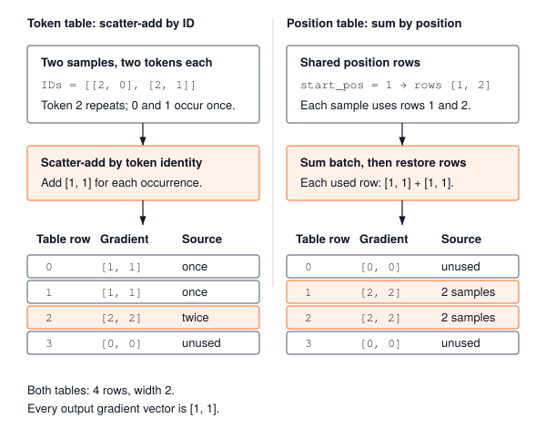

# Embeddings and Positional Encoding: Turning Token IDs into Vectors {#sec-embeddings}

::: {.column-margin}
{width="100%" fig-alt="TinyTorch execution datapath blueprint highlighting Module 11 Embeddings as the active subsystem."}

*Framework Blueprint: Module 11 projects discrete token integers into dense continuous geometry and encodes sequential ordering.*
:::


Discrete token IDs are arbitrary categorical integers with no intrinsic geometric relationship; token 1542 is not mathematically "closer" to token 1543 than to token 50000. Feeding raw integers into linear layers incorrectly imposes ordinal magnitude on categorical labels. To enable semantic reasoning, discrete token IDs must be mapped into continuous, high-dimensional vector spaces where geometric distance reflects semantic similarity, complemented by positional encodings that supply critical sequence order.

From a framework and systems standpoint, an **embedding layer** is functionally a hardware memory gather operation: a sparse lookup into a large weight table of shape $(V, D)$. Implementing embedding layers in an ML runtime introduces distinct architectural considerations:
1. **Gather instead of one-hot projection**: Looking up embedding rows directly rather than multiplying by a one-hot matrix with a column for every vocabulary entry, which would build $V$ values per token to select one row.
2. **Gradient routing via scatter-add**: During the backward pass, gradients for repeated token IDs within a batch must be accumulated into shared embedding rows with an unbuffered scatter-add (`np.add.at`), because a plain indexed `+=` counts a repeated ID only once.
3. **Positional encoding injection**: Adding learned or fixed sinusoidal coordinate vectors to token representations to restore sequence position information destroyed by permutation-invariant architectures.

This chapter constructs TinyTorch's embedding subsystem, converting discrete token sequences into continuous representation tensors $(B, S, D)$ ready for self-attention in @sec-attention.

{#fig-embeddings-pipeline}

---

## The Problem

::: {.column-margin}
**↩ Jump back:** @sec-tokenization
*Discrete token ID integers serve as row indices into the embedding weight table.*
:::


Suppose we skip the table and feed the integer straight into a `Linear` layer. The layer computes $w \cdot 1542$ for the token `"dog"` and $w \cdot 1543$ for whatever token happens to sit next to it in the vocabulary, and $w \cdot 50000$ for a token many thousands of slots away. The network is being told that adjacent IDs have similar magnitudes and that larger IDs should scale the same feature more strongly. Token IDs are labels, not quantities; the order the tokenizer assigned them carries no meaning, and any arithmetic on the raw integer invents a meaning that is not there.

The textbook fix is the one-hot vector that @sec-losses used for targets. Represent token $i$ as a vector of length $V$ with a $1$ in slot $i$ and zeros elsewhere, then multiply by a weight matrix. Every token is now equally far from every other, which is the right starting point, and a `Linear` layer can learn from it. The cost is the problem. With a vocabulary of $V = 50{,}257$ and a modest batch of 1,024 tokens, the one-hot input is $1{,}024 \times 50{,}257 \approx 51$ million floats, about 206 MB, of which exactly 1,024 are nonzero. The matrix multiply that follows, against a $50{,}257 \times 768$ weight matrix, performs about 39 billion multiplications, and only one in every 50,257 of them is by something other than zero.

The second problem appears once the integers are gone. Take the two sentences *"the dog bit the man"* and *"the man bit the dog"*. Their token vectors are the same five rows in a different order. Any operation that treats its inputs as a set, such as summing them or averaging them, produces identical output for both sentences.

```python
import numpy as np

rows = {"the": [1.0, 0.0], "dog": [0.0, 1.0],
        "bit": [1.0, 1.0], "man": [0.5, 0.5]}
s1 = ["the", "dog", "bit", "the", "man"]
s2 = ["the", "man", "bit", "the", "dog"]
sum1 = sum(np.array(rows[w]) for w in s1)
sum2 = sum(np.array(rows[w]) for w in s2)
print(sum1, sum2, np.array_equal(sum1, sum2))
# [3.5 2.5] [3.5 2.5] True
```

Unmasked self-attention preserves the rows rather than summing them away, but without positional information it follows any permutation of those rows. Swapping two tokens swaps their outputs; it does not tell the mechanism which came first. @sec-attention will compute interactions between rows, so each row needs to carry the association between a token and its position.

---

## The Idea

::: {.column-margin}
**↪ Jump ahead:** @sec-attention
*Continuous sequence representation tensors $(B, S, D)$ feed scaled dot-product attention.*
:::


::: {.column-margin}
{width="100%"}
*Scatter-add backward routing for repeated token IDs.*
:::

### A table, not a multiply

Take a three-row table `W = [[1, 2], [3, 4], [5, 6]]`. Token 2 selects `[5, 6]`; the sequence `[2, 0, 2]` selects `[[5, 6], [1, 2], [5, 6]]`. A one-hot row `[0, 0, 1]` multiplied by `W` produces the same `[5, 6]`, because it discards the first two rows and keeps the third. Repeating a token repeats its current vector; the lookup does not change the table.

Write the one-hot vector for token $i$ as $\mathbf{e}_i$, a row vector of length $V$, and the weight matrix as $W$ with shape $V \times D$, where $D$ is the width of the vectors the rest of the network will use. The product picks out one row:

$$\mathbf{x}_i = \mathbf{e}_i W = W[i, :]$$

Every term in the sum is zero except the one where the $1$ sits, so the product *is* row $i$. Nobody needs to build the one-hot vector or run the multiply. An `Embedding` layer stores $W$ and, given an ID, copies row $i$ out of it. The gather itself performs no arithmetic on the row values; it moves $D$ floats from one place to another. An indexed read of this kind, which pulls selected rows out of a larger array, is called a **gather**.

The rows are ordinary parameters. They start random, and gradient descent moves them. Because the forward pass only touched the rows that were looked up, only those rows receive a gradient. If a batch contains only three occurrences of token 42, row 42 receives the sum of three gradients, one from each place it was used; the other $V - 1$ rows receive zero. With other tokens present, their rows receive their own contributions. The backward pass is the mirror of the gather, a **scatter-add**: take each output gradient and add it into the row it came from.

Nothing in the table says that `"dog"` and `"cat"` should be near each other. That closeness emerges from training, because the loss pushes tokens that appear in similar contexts toward rows that produce similar predictions. The table only makes closeness *possible*, by giving the model $D$ continuous numbers per token instead of one categorical label.

### Position is a second table

The simplest way to tell the network where a token sits is a second table, $P$, with shape $S_{\max} \times D$, one row per position up to some maximum length $S_{\max}$. The vector for token $i$ at position $t$ is the sum of the two rows:

$$\mathbf{x}_{i,t} = W[i, :] + P[t, :]$$

Now `"dog"` at position 1 and `"dog"` at position 4 differ by $P[1, :] - P[4, :]$. The individual rows contain different token-position pairs for the two sentences. Summing the rows immediately would still lose order: the sum of token rows and the sum of position rows are unchanged by the swap. Attention must use the combined rows before any such reduction. The addition broadcasts across a batch, since every sequence in the batch uses the same position rows.

There are two ways to fill $P$. The first is to learn it, exactly like $W$. The second, from [Vaswani et al. (2017)](https://arxiv.org/html/1706.03762v7), is to fill it once with a sine and cosine formula and never train it. For an even embedding width, that formula makes the row for position $t + \Delta$ a fixed rotation of the row for position $t$, whatever $t$ is, and that one property is what the production schemes at the end of this chapter build on. I save the formula itself for the code that fills the table, where the reason for each piece of it is easier to see.

---

## The Code

::: {.column-margin}
{width="100%" fig-alt="Source code mapping card for Module 11 Embeddings showing file path, exported package, and tested primitives."}

*Source Code Mapping: Module 11 extracts embedding table lookup and sinusoidal positional encodings directly from the working repository.*
:::

### The embedding table

Consider the same $V = 50{,}257$, $D = 768$ table and batch of 1,024 token IDs used in The Problem. The one-hot route allocates about 206 MB for its input and performs about 39 billion multiplications. A gather instead selects 1,024 rows of width 768. These are analytical counts, not measured timings; they identify the work avoided without assuming a particular machine or matrix-multiplication library.

For a contiguous float32 table, row $i$ starts $i \times D \times 4$ bytes into the buffer. Selecting it copies $D$ values, or 3,072 bytes at this width. The batch therefore contains about 3.1 MB of selected values. This is the payload size, not the total memory traffic of TinyTorch: NumPy creates the indexed result, and the Tensor constructor copies the result into its own storage. The lookup is constant-time with respect to vocabulary size for a fixed width, but moving one row still costs $O(D)$.

Module 11 follows the pattern of every layer since @sec-activations: an operation that does the work on arrays, and a layer that owns the table and calls it. The operation is the interesting half, because its backward routes each output gradient to the row that supplied its values. Three things to watch for: the one-line gather, the way the indices travel, and the scatter-add.



`weight[self.indices]` is NumPy's fancy indexing, and it does exactly what the math says. The indices are not an input to the operation, they are a parameter of it, passed as `indices=` when the layer calls `apply` and stored on the node; the table is the only input, so it is the only tensor the graph records, which is right, because nothing differentiates with respect to a token ID. `indices` can be a flat array of $S$ IDs or a $B \times S$ batch; the result has one extra trailing dimension of size $D$ either way.

The backward is where the operation earns its class. Here is the trap. The obvious way to send gradients back to the table is `grad_weight[indices] += grad_output`, and for the sequence `[2, 0, 3]` it works. For `[2, 0, 2]` it silently gives the wrong number. NumPy evaluates that line as a read, an add, and a write, so the two gradients for row 2 are both added to the *original* row and the second write overwrites the first. Row 2 ends up with one gradient instead of two, and nothing warns you. @sec-autograd's rule that a tensor used twice receives two contributions has to hold for table rows as well, which is why the method uses `np.add.at`. That is the scatter-add. For every flattened index it adds the matching gradient row into `grad_weight`, and repeated indices accumulate instead of racing. Rows that were never looked up stay zero. Notice what the method allocates, though. `grad_weight` is a full $V \times D$ array, 154 MB at the example dimensions, of which a batch of 1,024 tokens fills at most 1,024 rows. We pay to zero it and pay again when the optimizer reads it. The production bridge below shows what PyTorch's `sparse=True` does about that.

::: {#chk-embeddings-scatter-add-race .callout-check title="Sanity Check: The Silent Overwrite in Naive Indexing"}
Why is `grad_weight[indices] += grad_output` one of the most insidious bugs in autograd implementations? In Python and NumPy, `a[idx] += b` is syntactic sugar for `a[idx] = a[idx] + b`. When the same token ID appears multiple times in a single batch (e.g. `[2, 0, 2]`), NumPy reads row 2 once, computes the sum with the first gradient, and writes it back; then reads the unchanged original row 2, adds the second gradient, and writes it back—clobbering the first gradient! The backward pass executes without throwing any error or warning, but silently drops gradient signal for repeated tokens. Only atomic accumulation (`np.add.at` or CUDA atomic adds) guarantees correct mathematical accumulation.
:::

{#fig-embedding-gather-scatter fig-alt="Diagram showing forward index gather into vocabulary rows and backward scatter-add gradient accumulation preventing race conditions."}

The layer holds the table, initialized with the Xavier-uniform bound $\sqrt{6/(V+D)}$ used in the source, checks the IDs, and calls the operation.



The IDs arrive as a `Tensor`, because that is what the loader of @sec-dataloader hands over. Its storage is float32, so `forward` first checks that every value is finite and integer-valued, then checks the range `0 <= ID < vocab_size`, and only then converts the array to integer indices. A value such as `1.5` raises `ValueError`; it is not rounded down to token 1. Negative values are rejected too, preventing NumPy from interpreting `-1` as the last vocabulary row. The table is created with `requires_grad=True` because `apply` records an operation only when an input requires a gradient. Without that flag the layer would return the same forward values while losing the path that teaches the table.

The state boundary is small. `Embedding.weight` persists across calls; the integer index array belongs to the lookup node for one call. `Embedding.forward` validates the IDs, then `EmbeddingFunction.apply(weight, indices=...)` constructs that node, gathers the rows, and returns a Tensor whose backward path leads to `weight`. Forward changes neither the IDs nor the table. Backward accumulates into `weight.grad`; the optimizer of @sec-optimizers is the component that later changes `weight.data`. The returned data does not share storage with the table, even though its gradient remains connected to it.

### The sinusoidal table

The two occurrences of token 2 still have identical vectors after the gather. A position row makes them distinguishable before @sec-attention introduces interactions between tokens. @sec-transformers will place this composition at the front of its transformer model.

A learned `PositionalEncoding` owns $S_{\max} \times D$ parameters. For $S_{\max}=1{,}024$ and $D=768$, that is 786,432 values. With positions numbered from zero, row $t$ only receives a contribution from a sequence containing position $t$; in ordinary full-sequence training that requires at least $t+1$ tokens. Later rows may therefore see less data. A requested position beyond `max_seq_len - 1` has no row at all. This limit comes from the allocated table, even if every training sequence was shorter.

A fixed formula offers a different trade-off. It can compute a row for a new position without training another parameter, although the row still needs computation and storage. The sinusoidal construction uses pairs of sine and cosine values. For position $t$ and dimension pair $(2k, 2k+1)$:

$$P[t, 2k] = \sin(\omega_k t), \qquad P[t, 2k+1] = \cos(\omega_k t), \qquad \omega_k = \frac{1}{10000^{2k/D}}$$

Here $\omega_k$ is the angular frequency of pair $k$, and the frequencies fall off geometrically. Pair 0 has $\omega_0 = 1$ and completes a cycle every $2\pi \approx 6$ positions; for large even $D$, the last pair approaches $\omega=1/10000$ and changes much more slowly over a few thousand positions. Think of a clock with $D/2$ hands, each turning slower than the one before. The fast hands distinguish neighboring positions, the slow hands distinguish distant ones, and the full row combines all these phases. The period of one pair is not a period of the whole table, and the formula alone does not guarantee that a trained model will generalize to longer contexts.

The table is a plain function of two integers. It builds the frequencies once, writing $10000^{-2k/D}$ as $\exp(-2k \ln 10000 / D)$, then fills even columns with sines and odd columns with cosines, with a guard for an odd width so the last column is not left empty.





`position * div_term` multiplies a column of positions by a row of frequencies, so each entry is one position times one frequency. NumPy broadcasting does the work of a double loop. Row 0 is always `[0, 1, 0, 1, ...]`, because $\sin 0 = 0$ and $\cos 0 = 1$; that is a quick sanity check when something looks wrong. `create_sinusoidal_embeddings` wraps the array in a `Tensor` without `requires_grad`, so the table does not require gradients and `EmbeddingLayer.parameters()` excludes it. The implementation still allocates only `max_seq_len` rows; evaluating the formula at a larger position would require extending that allocation. Both fixed and learned tables occupy $4S_{\max}D$ bytes of float32 value storage here, but only learned positions need parameter gradients and optimizer state.

Two properties of the formula are worth keeping, because the production schemes lean on both. First, for even $D$, each sine and cosine pair has length exactly one, so every row of $P$ has length $\sqrt{D/2}$ and adding it to a token row shifts that row by the same fixed amount at every position. Second, also for even $D$, the row for position $t + \Delta$ is a fixed linear function of the row for position $t$, one that depends on the offset $\Delta$ and not on $t$. Within each pair, the angle-addition identities for sine and cosine give

$$\begin{bmatrix} P[t+\Delta, 2k] \\ P[t+\Delta, 2k+1] \end{bmatrix} = \begin{bmatrix} \cos(\omega_k \Delta) & \sin(\omega_k \Delta) \\ -\sin(\omega_k \Delta) & \cos(\omega_k \Delta) \end{bmatrix} \begin{bmatrix} P[t, 2k] \\ P[t, 2k+1] \end{bmatrix}$$

With the displayed sine-first coordinate order, the $2 \times 2$ matrix is a rotation by $-\omega_k \Delta$ under the usual counterclockwise-positive convention. A layer that wants to ask "what is $\Delta$ positions back from me" can therefore learn a single fixed matrix instead of a separate rule for every absolute position. That is the property The Idea promised, and the production bridge returns to rotation-based position information after the additive mechanism is complete.

### The positional layer

For a batch of two sequences with two tokens each and $D=2$, the token vectors have shape `(2, 2, 2)`. A position slice of shape `(2, 2)` supplies just four values. Reshaping it to `(1, 2, 2)` tells addition to reuse those same values for both sequences. An explicit `np.tile` would first duplicate them into eight values. At larger sizes that duplication becomes costly: tiling positions for eight sequences of 2,048 tokens at $D=4{,}096$ would materialize about 268 MB before the addition even starts.

NumPy broadcasting avoids materializing that batch-sized position operand. It does not make the whole TinyTorch path allocation-free. `Tensor` slicing and reshaping return wrappers with their own copied storage, and addition allocates the output. What is avoided is the explicit $B \times S \times D$ tiled position table, not every copy of the smaller $S \times D$ slice.

The backward is where the broadcast has to be undone. Row $t$ of the table was added to position $t$ of every sequence in the batch, so it was used $B$ times, and @sec-autograd's rule is that a value used $B$ times collects $B$ gradient contributions. The output gradient therefore has to be summed over the batch axis before it can land in the table, and the slice that picked `seq_len` rows out of the table has to be undone as well, so that the gradient lands in the right rows and the rest stay zero. Module 11 writes none of that. Its learned `PositionalEncoding` slices the table with `Tensor` indexing, reshapes with `Tensor.reshape`, and adds with `+`, three operations @sec-autograd already knows how to reverse: `Add` reduces the broadcast batch axis with `_reduce_broadcast_grad`, `Reshape` restores the $(S, D)$ shape, and `Slice` scatters the rows back into a zero table. The layer's job is only to use tensor operations and stay out of the way.



Before those three operations, `PositionalEncoding.forward` requires a 3D `(batch, seq, embed)` input with the configured embedding width. It also checks that `start_pos` is a nonnegative integer and `start_pos + seq_len <= max_seq_len`; an invalid range raises `ValueError` before slicing. These checks establish an unambiguous contract even where NumPy could broadcast an unintended shape. The argument `start_pos=1`, for example, selects rows 1 and 2 for a two-token call. @sec-memoization will use that offset when processing only a new suffix of a sequence.

The reshape must remain a Tensor operation. Rewrapping `pos_embeddings.data` in a fresh Tensor would produce the same forward values but create a new leaf, cutting the learned table out of the graph. Preserving a gradient connection is distinct from sharing array storage. The current `reshape` copies values through its wrapper and still records how gradients return to the original parameter.

### Putting the two tables together

The last step is wiring the tables together, and this is where @sec-transformers picks up. `EmbeddingLayer` owns a token table and one of three position choices: a learned `PositionalEncoding`, the fixed sinusoidal table, or nothing. Its `forward` is written in a separate cell and attached to the class.





Calling `layer(tokens, start_pos)` enters `EmbeddingLayer.__call__`, then the attached `emblayer_forward`. A one-dimensional `(S,)` input is temporarily reshaped to `(1, S)`; a batched `(B, S)` input keeps its shape. The token lookup returns `(B, S, D)`. Optional scaling multiplies those token values by $\sqrt{D}$ before position addition; the default is `False`. The selected position strategy then returns the same shape, and an input that lacked a batch axis has that temporary axis removed. Thus the caller gets `(S, D)` or `(B, S, D)` to match its input.

`parameters()` always returns the token table and includes the position table only when it is learned. The sinusoidal branch deliberately wraps its selected position values in a fresh constant Tensor; it has no position parameter to train, while addition still carries gradients into the token branch. With `pos_encoding=None`, the layer skips position addition entirely. @sec-transformers constructs this layer with learned positions and unscaled token embeddings. Its initializer makes no promise that token magnitudes dominate position magnitudes: the token bound depends on $V+D$, while the learned-position bound depends only on $D$.

---

## A Worked Trace

A vocabulary of four tokens and a width of $D = 4$ is small enough to check every number by hand. Fix the table

$$W = \begin{bmatrix}
+0.50 & -0.20 & +0.10 & +0.80 \\
-0.10 & +0.40 & -0.30 & +0.20 \\
+1.20 & +0.10 & -0.50 & -0.40 \\
+0.30 & -0.90 & +0.70 & +0.00
\end{bmatrix}$$

and feed it the sequence `[2, 0, 3]` with sinusoidal positions. With $D = 4$ there are two frequency pairs, $\omega_0 = 1/10000^{0} = 1$ and $\omega_1 = 1/10000^{2/4} = 0.01$, so position $t$ produces the row $[\sin t, \cos t, \sin 0.01t, \cos 0.01t]$. @Tbl-embedding-pe-trace runs the three positions through both tables.

| $t$ | ID | $d$ | $W[\mathrm{ID},d]$ | $P[t,d]$ | Sum |
| ---: | ---: | ---: | ---: | ---: | ---: |
| 0 | 2 | 0 | $+1.20$ | $0.00$ | $+1.20$ |
| 0 | 2 | 1 | $+0.10$ | $1.00$ | $+1.10$ |
| 0 | 2 | 2 | $-0.50$ | $0.00$ | $-0.50$ |
| 0 | 2 | 3 | $-0.40$ | $1.00$ | $+0.60$ |
| 1 | 0 | 0 | $+0.50$ | $0.84$ | $+1.34$ |
| 1 | 0 | 1 | $-0.20$ | $0.54$ | $+0.34$ |
| 1 | 0 | 2 | $+0.10$ | $0.01$ | $+0.11$ |
| 1 | 0 | 3 | $+0.80$ | $1.00$ | $+1.80$ |
| 2 | 3 | 0 | $+0.30$ | $0.91$ | $+1.21$ |
| 2 | 3 | 1 | $-0.90$ | $-0.42$ | $-1.32$ |
| 2 | 3 | 2 | $+0.70$ | $0.02$ | $+0.72$ |
| 2 | 3 | 3 | $+0.00$ | $1.00$ | $+1.00$ |

: **Gather and position addition**: The sequence `[2, 0, 3]` with $D=4$, one row per dimension $d$. Values are rounded to two decimal places. {#tbl-embedding-pe-trace tbl-colwidths="[8,8,8,26,25,25]"}

The fast pair (dimensions 0 and 1) already differs noticeably between positions 0, 1, and 2; the slow pair (dimensions 2 and 3) has barely moved from $[0, 1]$. That is the clock with two hands, one turning a hundred times faster than the other.

For the backward pass, take the loss to be the sum of every entry in the output, so the gradient arriving at each of the three output rows is all ones. In the script below, lines 6--15 configure `EmbeddingLayer` with the $4 \times 4$ trace weights. Line 17 feeds the sequence `Tensor([[2, 0, 3]])`, producing output `h` of shape `(1, 3, 4)` verified in lines 18--21 against @tbl-embedding-pe-trace. In line 24, `h.sum().backward()` propagates through the gather. Scatter-add routes row 0's gradient to $W[2, :]$, row 1's to $W[0, :]$, and row 2's to $W[3, :]$. Lines 25--28 confirm that `W_grad` holds ones in rows 0, 2, and 3 and zeros in row 1, while `layer.pos_encoding.grad` is `None` (sinusoidal encodings have no learned parameters). In lines 30--33, clearing gradients and running repeated token sequence `[[2, 0, 2]]` verifies that row 2 accumulates to twos (`[[1]*4, [0]*4, [2]*4, [0]*4]`), which naive in-place addition `grad_weight[indices] += ...` fails to compute correctly.

```python
import numpy as np
from tinytorch.core.tensor import Tensor
from tinytorch.core.embeddings import EmbeddingLayer
import tinytorch.core.autograd

W_data = np.array([[+0.50, -0.20, +0.10, +0.80],
                   [-0.10, +0.40, -0.30, +0.20],
                   [+1.20, +0.10, -0.50, -0.40],
                   [+0.30, -0.90, +0.70, +0.00]], dtype=np.float32)

layer = EmbeddingLayer(
    vocab_size=4, embed_dim=4, max_seq_len=8, pos_encoding='sinusoidal'
)
# Replace the random initialization with the trace table.
layer.token_embedding.weight.data[:] = W_data

h = layer(Tensor([[2, 0, 3]]))  # one sequence in a batch of one
print(h.shape, np.round(h.data[0], 2))  # (1, 3, 4) and the Sum column
assert np.allclose(h.data[0, 0], [1.20, 1.10, -0.50, 0.60], atol=1e-2)
assert np.allclose(h.data[0, 1], [1.34, 0.34, 0.11, 1.80], atol=1e-2)
assert np.allclose(h.data[0, 2], [1.21, -1.32, 0.72, 1.00], atol=1e-2)

# Summing all entries makes the upstream gradient all ones.
h.sum().backward()
W_grad = layer.token_embedding.weight.grad
print(W_grad)  # rows 0, 2, 3 are ones; row 1 is zeros
assert np.array_equal(W_grad, [[1]*4, [0]*4, [1]*4, [1]*4])
assert layer.pos_encoding.grad is None

layer.token_embedding.weight.grad = None
layer(Tensor([[2, 0, 2]])).sum().backward()
assert np.array_equal(
    layer.token_embedding.weight.grad, [[1]*4, [0]*4, [2]*4, [0]*4]
)
```

### Two routes back to learned tables

The sinusoidal case has no position gradient. To see the extra route for learned positions, use a two-sequence batch `[[2, 0], [2, 1]]`, width 2, and `start_pos=1`. Give token rows 0, 1, and 2 the values `[1, 2]`, `[3, 4]`, and `[5, 6]`. Position rows 1 and 2 are `[10, 20]` and `[30, 40]`. The first sequence becomes `[[15, 26], [31, 42]]`; the second becomes `[[15, 26], [33, 44]]`.

For the loss `output.sum()`, all four output rows receive `[1, 1]`. The token branch groups these gradients by ID, so token row 2 receives `[2, 2]`, rows 0 and 1 each receive `[1, 1]`, and row 3 stays zero. The position branch groups them by sequence position. Adding the two batch contributions reduces a `(2, 2, 2)` gradient to `(1, 2, 2)` with values `[[[2, 2], [2, 2]]]`. Reshape removes the leading axis, and slice-backward places those two rows into position rows 1 and 2. Position rows 0 and 3 stay zero. In the listing below, lines 1--5 initialize both parameter tables. Line 7 executes the forward pass with `start_pos=1`, verified in lines 8--10. In line 11, `output.sum().backward()` routes gradients along both branches simultaneously: line 12 validates `weight.grad` while line 13 validates `positions.grad`.

```python
learned = EmbeddingLayer(4, 2, max_seq_len=4, pos_encoding='learned')
weight, positions = learned.parameters()
weight.data[:] = [[1, 2], [3, 4], [5, 6], [7, 8]]
positions.data[:] = [[0, 0], [10, 20], [30, 40], [50, 60]]
before = [parameter.data.copy() for parameter in learned.parameters()]

output = learned(Tensor([[2, 0], [2, 1]]), start_pos=1)
assert output.shape == (2, 2, 2)
assert np.array_equal(output.data, [[[15, 26], [31, 42]],
                                    [[15, 26], [33, 44]]])
output.sum().backward()
assert np.array_equal(weight.grad, [[1, 1], [1, 1], [2, 2], [0, 0]])
assert np.array_equal(positions.grad, [[0, 0], [2, 2], [2, 2], [0, 0]])
for parameter, original in zip(learned.parameters(), before):
    assert np.array_equal(parameter.data, original)
```

The final assertion in lines 14--15 separates differentiation from learning. Forward read both tables, and backward filled their `.grad` arrays, but neither changed their values. Passing those parameters to an optimizer and calling `step()` is what would change the tables. Clearing gradients before the next training step prevents contributions from unrelated batches from accumulating together.

The destinations are compared in @fig-embedding-gradient-routes. Token rows group contributions by identity; position rows group them by the position used in the call.

{#fig-embedding-gradient-routes fig-alt="Two panels trace token IDs 2, 0, 2, 1 and shared position rows 1 and 2 into four-row gradient tables. Token row 2 receives [2, 2], while position rows 1 and 2 each receive [2, 2]."}

---

## From TinyTorch to Production

PyTorch's `torch.nn.Embedding` exposes the same $V \times D$ weight table and gather, with options TinyTorch does not implement. `padding_idx` excludes a designated row from lookup gradients and initializes it to zero by default; a caller may explicitly assign another value. `max_norm` may renormalize selected rows in place during forward, changing the read-only state contract of our lookup. `sparse=True` returns a sparse weight gradient, so optimizer compatibility must be checked. These contracts are documented in the [PyTorch embedding reference](https://docs.pytorch.org/docs/2.14/generated/torch.nn.Embedding.html).

A dense gradient allocates values for every row. With $V=50{,}257$ and $D=768$, its float32 values occupy about 154 MB even when a batch uses only 1,024 IDs. The selected rows contain at most about 3.1 MB of values; a sparse representation must also store their indices and handle repeated IDs. TinyTorch keeps the full zero-filled array so that scatter-add and the existing optimizers remain easy to inspect. A zero gradient from this lookup also does not guarantee an unchanged row after every optimizer step: weight decay or momentum from earlier steps may still move it.

::: {#nbk-embeddings-row-gather-bandwidth .callout-notebook title="Napkin math: the bytes moved by a gather"}
For $B=8$, $S=2{,}048$, $D=4{,}096$, and a hypothetical 2-byte weight format, selected values occupy $BSD \times 2 = 134{,}217{,}728$ bytes. A kernel must at least read the source values and write its output; if both transfers reach the same memory interface, that is about 268 MB before indices or other work. At an assumed sustained 2 TB/s, dividing those bytes by the rate gives about $134\ \mu\text{s}$. This is a bandwidth model, not a TinyTorch timing or a hardware guarantee. TinyTorch uses float32 storage and creates additional arrays, while caching, repeated IDs, and allocation costs can change actual traffic. A bottleneck claim requires measurement of the whole workload.
:::

::: {#psp-embeddings-sparse-gather-scatter .callout-production title="Production Bridge: Sparse Embeddings and Sharded Tables"}
At industrial scale with vocabularies of $256{,}000$ tokens (such as Gemma and LLaMA 3) and hidden dimensions of $4{,}096$, the embedding table alone contains over 1 billion parameters ($>4\text{ GB}$ in FP32). Generating a dense $V \times D$ gradient tensor per micro-batch wastes gigabytes of memory on zeros. Production frameworks solve this with `sparse=True` (returning a `torch.sparse_coo_tensor` holding only active rows) or dedicated distributed embedding tables (such as TorchRec or Megatron-LM tensor parallel vocabulary sharding), communicating only the gathered rows across GPU nodes.
:::

A different way to reduce persistent storage is **weight tying**, which uses the input table again to compute output scores as $\mathbf{h}W^T$. The [original GPT-2 implementation](https://raw.githubusercontent.com/openai/gpt-2/master/src/model.py) gathers from `wte` at the input, adds a separately learned `wpe` table, and multiplies the final hidden rows by `wte` transposed at the output. Sharing that parameter saves a second $V \times D$ table. It also gives the table a second gradient path; the claim that only looked-up rows receive gradients applies to the gather operation, not to every possible use of a shared weight.

Position schemes change where the position signal enters the model. The comparison in @tbl-position-encodings separates the source implementation from a later alternative.

| Scheme | Where it acts | Parameters | Length limit | Used by |
| :--- | :--- | :--- | :--- | :--- |
| Sinusoidal (Vaswani et al., 2017) | Added to the token vector | None | Allocated table in TinyTorch | Original Transformer |
| Learned table | Added to the token vector | $S_{\max} \times D$ | Allocated table | TinyTorch GPT, GPT-2 |
| Rotary (RoPE) | Rotates query and key vectors inside attention | None for the rotation | Formula can extend; model limits remain | RoFormer |

: **Position information enters at different points**: Fixed formulas avoid learning a row for every position, but do not guarantee successful inference at unseen sequence lengths. {#tbl-position-encodings tbl-colwidths="[24,28,14,16,18]"}

[Rotary position embedding (RoPE)](https://arxiv.org/html/2104.09864v5) rotates pairs of coordinates in query and key vectors, two projections of a token vector that @sec-attention will introduce. Their dot product retains both tokens' content, while its positional factor depends on their relative offset. This uses the same sine/cosine angle-addition identities studied here, but changes the attention computation rather than adding a second table to the input. Evaluating a rotation at a larger position does not by itself guarantee that a model trained on shorter sequences will work there. TinyTorch's `EmbeddingLayer` implements learned and sinusoidal addition, not RoPE.

Three practical checks follow from the reference. Keep token IDs paired with the tokenizer that assigned them. Include the token table and any learned position table in the optimizer's parameter list. Check position capacity before a call: both position strategies in `EmbeddingLayer` raise `ValueError` when the requested interval exceeds their allocated table. A sinusoidal table can be regenerated at a greater length without learning new rows, but that storage change and the model's ability to use longer inputs are separate questions.

---

## Summary

Module 11 turns IDs into vectors by selecting rows from a persistent token table, optionally scaling them, and adding rows selected by sequence position. A `(B, S)` input returns `(B, S, D)` values. The gather node keeps the integer IDs so backward can sum all occurrences into the right token rows; learned positions instead collect batch contributions through addition, reshape, and slice. Forward and backward preserve parameter values, while backward accumulates parameter gradients for the optimizer. Fixed sinusoidal positions occupy storage but are excluded from `parameters()`.

The contract passed to @sec-attention is a sequence of $D$-wide rows that already carry token and position information. Changing another token in the sequence does not yet change a row. Attention will add that missing interaction, using the rows to decide which other rows to read.

---

## Further reading

- Mikolov et al. (2013), [Efficient estimation of word representations in vector space](https://arxiv.org/abs/1301.3781), *arXiv*. Learned word vectors whose geometry reflects usage, trained apart from any downstream model.
- Vaswani et al. (2017), [Attention is all you need](https://arxiv.org/abs/1706.03762), *NeurIPS*. The sinusoidal position table this chapter builds, and the learned alternative.

## Exercises

1. For a $4 \times 3$ table $W$ and the ID sequence `[2, 0, 2]`, build the $3 \times 4$ one-hot matrix by hand, compute the product with $W$ using `np.dot`, and confirm it equals `W[[2, 0, 2]]`. Count the multiplications each method performs, and repeat the count for $V = 50{,}257$.

2. Add a `padding_idx` argument to `Embedding` so that the named row is initialized to zero and receives no gradient, and verify with a sequence that contains the padding ID three times. Then replace `np.add.at` in `EmbeddingFunction.backward` with `grad_weight[indices] += ...` and explain, using the `[2, 0, 2]` case, what goes wrong.

3. With $D = 4$, build `_compute_sinusoidal_table(16, 4)` and find, for offset $\Delta = 1$, the two $2 \times 2$ rotation matrices that map row $t$ to row $t + 1$ in each coordinate pair. Check numerically that the same two matrices work for every $t$ from 0 to 14. Then fit such a matrix to the first few rows of a randomly initialized learned `PositionalEncoding(max_seq_len=16, embed_dim=4)` and test it on the remaining rows. Explain why learned positions are not constrained to satisfy the rotation identity.

4. Reuse the two-sequence learned-position trace with `scale_embeddings=True`. Predict which parameter gradients change and by what factor, then check every row. Repeat with `start_pos=2` and explain which position rows receive gradients. Finally request `start_pos=3`; identify the bound that fails before running the call.
