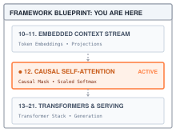
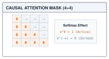
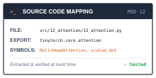

# Attention Mechanisms: Scaled Dot-Product and Causal Masking {#sec-attention}

::: {.column-margin}
{width="100%" fig-alt="TinyTorch execution datapath blueprint highlighting Module 12 Attention as the active subsystem."}

*Framework Blueprint: Module 12 implements scaled dot-product attention and multi-head projection with lower-triangular causal masking.*
:::


Fixed-window convolutions and sequential recurrent networks struggle to model long-range context and dynamic token interactions. A word's meaning in natural language depends heavily on distant context: in *"the server crashed because it overheated"*, resolving what *"it"* refers to requires the model to route information dynamically across the sequence. **Scaled dot-product attention** solves this by allowing every token to dynamically query, weigh, and aggregate representations from all other tokens in parallel.

In modern PyTorch, scaled dot-product attention is invoked in a single functional call:

```python
import torch
import torch.nn.functional as F

# Batch of 1, 4 heads, sequence length 8, head dimension 16
q = torch.randn(1, 4, 8, 16)
k = torch.randn(1, 4, 8, 16)
v = torch.randn(1, 4, 8, 16)

# Scaled dot-product attention with causal autoregressive masking
out = F.scaled_dot_product_attention(q, k, v, is_causal=True)
print("Attention output shape:", out.shape)  # (1, 4, 8, 16)
```

Underneath that compact functional call, the runtime coordinates multiple linear algebra stages:
1. **The quadratic all-to-all similarity matrix ($Q K^T$):** The engine multiplies query and key projections across all heads simultaneously, materializing an $(S \times S)$ score matrix per head. This creates the characteristic $O(S^2)$ quadratic memory and compute footprint that defines transformer scaling.
2. **Variance scaling ($1/\sqrt{d_k}$):** As the head dimension $d_k$ grows, dot products scale proportionally in variance. Scaling by $1/\sqrt{d_k}$ keeps logits in a moderate range, preventing Softmax from saturating into near-zero gradients.
3. **Causal autoregressive masking:** In generative decoders, future tokens must remain invisible. The runtime injects an upper-triangular mask of $-\infty$ prior to Softmax, forcing future attention probabilities to exactly zero without branching logic.

This chapter builds TinyTorch's multi-head causal attention engine, laying the core communication mechanism that powers the Transformer architecture in @sec-transformers. Before building the multi-head projection pipeline, we must inspect why naive row averaging fails to capture contextual relationships.

---

## The Problem

::: {.column-margin}
**↩ Jump back:** @sec-embeddings
*Input sequence vectors project into query, key, and value subspaces.*
:::


After embedding lookup a sequence is a matrix $X$ with one row per token and $D$ columns. The `Linear` and activation layers in a token-wise network process those rows independently. The convolution from @sec-convolutions mixed neighboring spatial positions through a fixed window, but this sequence computation needs weights that can change with the contents of the entire input.

The obvious fix is to let every token see a summary of the whole sequence. The simplest summary is the average of all rows, and it fails immediately.

```python
X = [[1.0, 0.0], [0.0, 1.0], [1.0, 1.0]]      # three tokens, two features each
avg = [sum(col) / len(X) for col in zip(*X)]  # one summary for the whole sequence
print([avg for _ in X])
# three identical rows of [0.666..., 0.666...]; every token receives the same vector
```

Averaging gives every token the identical vector, so a pronoun receives as much of *because* as of *machine*, and every output receives the same mixture of positional signals. A learned weight for each pair of positions is no better. The noun that *it* refers to can change from sentence to sentence; the right weights depend on what the tokens say, not on where they sit. A fixed table also imposes a maximum sequence length and does not adapt its weights to the input.

The operation we need has three properties. The mixing weights must be computed from the token contents themselves. They must form a proper set of proportions, non-negative and summing to one, so a token can commit most of its attention to one source. The whole computation must also be expressible as matrix arithmetic so that all tokens compute their weights at once instead of one after another. Generation adds a fourth requirement, which we meet in @sec-milestone-2: a token that will be predicted from its predecessors must not be allowed to read from its successors while training.

::: {.column-margin}
**↪ Jump ahead:** @sec-memoization
*Evaluating attention across expanding prefixes incurs $O(S^2)$ recomputation; the KV cache eliminates it.*
:::

---

## The Idea

::: {.column-margin}
{width="100%"}
*Causal attention mask setting future tokens to $-\infty$.*
:::

### Queries, keys, and values

Before introducing three new names, consider one row choosing between two sources. Let its selection vector be $[0,2]$ and the sources advertise $[1,1]$ and $[1,0]$. The dot products are $2$ and $0$, so the first source is preferred. Dividing by $\sqrt{2}$ and applying softmax gives weights of approximately $[0.8044,0.1956]$. If the sources carry $[2,1]$ and $[0,3]$, the retrieved mixture is $[1.6089,1.3911]$. The vectors used to choose a source and the content retrieved from it have different jobs.

The selection vector is the **query**, each advertisement is a **key**, and the retrieved content is a **value**. Attention is a lookup in which every token can play all three roles. From each token's row $x_t$ we compute three vectors with three learned weight matrices; the projections also include biases, omitted here to keep the notation short:

- a query $q_t = x_t W_q$, what this token is looking for ("I am a pronoun; where is my noun?");
- a key $k_t = x_t W_k$, what this token advertises about itself ("I am a singular noun");
- a value $v_t = x_t W_v$, the content this token hands over if someone selects it.

The score between query $i$ and key $j$ is their dot product $q_i \cdot k_j$, which depends on both their lengths and their alignment; perpendicular vectors have score zero. Stacking the queries into a matrix $Q$ and the keys into $K$ (each of shape $S \times d_k$, where $S$ is the sequence length and $d_k$ the width of a query) gives all $S^2$ scores in one product, $Q K^T$. A softmax across each row turns the scores for query $i$ into proportions that sum to one, the normalization introduced in @sec-activations, applied across the candidate keys. The output for token $i$ is the weighted sum of the values, so the whole mechanism is

$$\text{Attention}(Q, K, V) = \text{softmax}\!\left( \frac{Q K^T}{\sqrt{d_k}} + M \right) V$$

where $V$ is the $S \times d_v$ matrix of values and $M$ is a mathematical mask of zeros and negative infinities, and the division by $\sqrt{d_k}$ is the scaling that gives the mechanism its name. Every quantity here is a matrix of shape $S \times S$ or $S \times d$, and every operation is a matrix multiply, an elementwise scale, an elementwise add, or a row-wise softmax. That is why attention runs in parallel across all tokens where earlier sequence models had to walk the sequence one step at a time. The three weight matrices are what make it learnable; the network is free to decide what each token should ask and advertise.

### Why divide by $\sqrt{d_k}$

Suppose the entries of $q$ and $k$ are independent with mean zero and variance one. Their dot product is a sum of $d_k$ products, each with mean zero and variance one, so by the same variance argument @sec-layers made for a layer's fan-in, the sum has variance $d_k$ and standard deviation $\sqrt{d_k}$. The spread of the scores grows with the width of the head, and a softmax fed scores spread too far apart collapses toward a nearly one-hot vector with very small derivatives. Dividing every score by $\sqrt{d_k}$ divides the variance by $d_k$ and restores unit variance whatever the head width. The numbers for what goes wrong without it are beside the line of code that does the division.

### Causal masking

During generation the model predicts token $t+1$ from tokens $1$ through $t$. If it were allowed to read token $t+1$ while training, it would learn to copy rather than predict, and at generation time there would be nothing to copy. The rule is that query $i$ may attend to key $j$ only when $j \le i$, which the formula represents by adding a mask $M$ before softmax. The implementation instead replaces forbidden scores directly with negative infinity:

$$M_{i,j} = \begin{cases} 0 & j \le i \quad \text{(past and present, allowed)} \\ -\infty & j > i \quad \text{(future, forbidden)} \end{cases}$$

For four tokens the mask is zero on and below the diagonal and $-\infty$ above it:

$$M = \begin{pmatrix} 0 & -\infty & -\infty & -\infty \\ 0 & 0 & -\infty & -\infty \\ 0 & 0 & 0 & -\infty \\ 0 & 0 & 0 & 0 \end{pmatrix}$$

Because $e^{-\infty} = 0$, a masked position contributes nothing to the softmax denominator and receives exactly zero weight.[^fn-float-mask-values] TinyTorch accepts a binary mask, with `1` for an allowed key and `0` for a forbidden key. Each query must retain at least one allowed key; a row with none has no probability distribution to normalize and raises `ValueError`.

[^fn-float-mask-values]: In 32-bit floating point, using $-\infty$ directly (`float("-inf")`) is mathematically exact since $e^{-\infty} = 0.0$ under IEEE 754. In 16-bit floating point (`float16` or `bfloat16`), production frameworks often clamp masked values to large finite negative numbers like $-10^4$ (or `torch.finfo(dtype).min`) to prevent downstream NaN anomalies during intermediate kernel reductions.


### Several heads at once

One attention pattern is one answer to "who looks at whom." A pronoun wants to find its noun; a verb wants its subject; a closing bracket wants its opening one. Multi-head attention runs $H$ of these patterns side by side. It splits the $D$ model dimensions into $H$ slices of width $d_k = D / H$, lets each head attend using only its slice of $Q$, $K$, and $V$, concatenates the $H$ outputs back into a $D$-wide row, and mixes them with one more learned matrix $W_o$. The model gets $H$ independent routing decisions per token instead of one, and the code section shows why the slicing, rather than $H$ full-width copies, is what makes that affordable.

In @fig-attention-engine, $B$ counts sequences in the batch, $H$ counts heads, $S$ counts tokens, and $d$ is the width of each head. Each batch item and head runs the same score-to-mixture path independently.

{#fig-attention-engine width="100%"}

---

## The Code

::: {.column-margin}
{width="100%" fig-alt="Source code mapping card for Module 12 Attention showing file path, exported package, and tested primitives."}

*Source Code Mapping: Module 12 extracts scaled dot-product attention, causal mask application, and MultiHeadAttention directly from the working repository.*
:::

A caller enters through `MultiHeadAttention.forward(x, mask)` with shape `(B, S, D)`. The layer projects the rows, splits their feature axis into heads, calls `scaled_dot_product_attention`, merges the results, and applies its output projection. The inner function has five stages: scores, scale, mask, softmax, and value mixing. The following helpers explain those stages before returning to the outer layer. All differentiable operations come from earlier modules, so the backward rules from @sec-autograd supply the gradients.

### The score matrix

For the two-token example, $QK^T$ produces a $2 \times 2$ matrix. Entry `(i, j)` records how query `i` scores key `j`; row `i` therefore lists all the sources that output row `i` can read. At sequence length $S$, this becomes $S^2$ entries per head. A recurrent network[^fn-recurrent-network-serial] instead carries one state forward a token at a time. Its next state depends on the previous state, whereas attention scores for a supplied sequence can be computed together.

Nested Python loops could compute the same dot products, but a matrix product states the complete operation in one call. This lets NumPy use its matrix-multiplication implementation and avoids a Python call for every scalar product. TinyTorch still performs all the score arithmetic; expressing it as a matrix operation changes how the work is executed.

[^fn-recurrent-network-serial]: **Recurrent network** (RNN): a sequence model that keeps a single hidden state vector and updates it once per token, $h_t = \tanh(W_h h_{t-1} + W_x x_t)$, so the state at position $t$ depends on the state at $t-1$. This recurrence introduces a dependency between adjacent positions, so their state updates cannot all run independently.



The helper contains two operations from @sec-tensors. `transpose(-2, -1)` swaps the last two axes and preserves the leading axes. For a single head, `(S, d_k)` becomes `(d_k, S)`, making `Q.matmul(K_t)` a product with shape `(S, S)`. For a batch of heads, `(B, H, S, d_k)` becomes `(B, H, d_k, S)`, and the product has shape `(B, H, S, S)`. This batched path uses `np.matmul`. The returned transpose owns its buffer in TinyTorch; it does not expose a shared view of `K`.

### Softmax by rows

Each row of the score matrix belongs to one query, so each row needs its own softmax over keys. Direct exponentiation can overflow for large scores. Module 12 reuses `Softmax()(scores, dim=-1)`, which subtracts the maximum of each row before exponentiating. For a row containing an allowed finite score, the largest shifted entry is zero, its exponential is one, and the denominator is positive. Forbidden entries remain negative infinity and contribute zero. The mask validation is what rules out the undefined all-negative-infinity case.

The implementation makes separate NumPy passes to find the maximum, shift the scores, exponentiate, sum, and divide. These passes operate on a fully materialized score tensor. The production bridge will return to the memory cost of keeping and revisiting that tensor.

### The causal mask

@sec-milestone-2 trains a next-token predictor, and the loss at position $t$ scores a prediction of token $t+1$. That only works if position $t$'s output was computed without reading token $t+1$. @sec-memoization leans on the same guarantee from the other side. It generates one token at a time and reuses the keys and values of earlier positions, which is valid only because an earlier position's output never depended on anything after it. The naive way to keep the future out is to run the model once per prefix, $S$ forward passes for a sequence of $S$ tokens, a thousand passes for 1,024 tokens to get what one masked pass gives.

Setting a forbidden score to zero does not exclude it. Softmax over `[0.7071, 0.0]` gives approximately `[0.67, 0.33]`, so the forbidden key still receives a third of the weight. Subtracting a large finite constant is also insufficient for an unrestricted score range. A forbidden score of $10^{10}$ remains large after subtracting $10^9$. Replacing the score with negative infinity enforces exclusion independently of its previous finite value.



The mask arrives as ones and zeros, with the same convention as `np.tril(np.ones((S, S)))`. `_apply_mask` first rejects nonbinary entries, broadcasts the mask to the score shape, and checks that each query has an allowed key. `scores.masked_fill(allowed == 0, MASK_VALUE)` then returns a new tensor with blocked scores replaced by `float("-inf")`. It preserves the input scores and records the operation for backward. The rule from @sec-autograd passes gradients at allowed positions and zeros them at forbidden positions. The mask itself is a fixed choice of connectivity, not a trainable parameter.

{#fig-causal-attention-engine width="100%" fig-alt="Causal attention engine diagram showing multi-head projection split, score matrix computation, upper-triangular -inf masking, softmax normalization, and value matrix mixture."}

### Scores, scale, mask, softmax, mix

The inner attention function puts the helpers in execution order. Its caller supplies already projected $Q$, $K$, and $V$; it returns both the mixed values and the weights used to mix them. Before composing the stages, the remaining helper supplies the scale factor.

The variance argument predicts a score standard deviation of $8$ when $d_k=64$. We can see the consequence without a random experiment. Softmax over `[24.0, -8.0, 0.0]` assigns approximately $3.8 \times 10^{-11}$ to the last entry and almost all the mass to the first. Dividing those scores by $8$ gives `[3.0, -1.0, 0.0]`, whose weights are approximately `[0.936, 0.017, 0.047]`. The diagonal softmax derivative is $p_i(1-p_i)$, so moving away from zero and one leaves more room for the scores to change during learning. Scaling limits saturation; it does not guarantee a particular distribution after training.



```{=latex}
\newpage
```



`d_k` is read from the last axis of `Q`, so the function works at both the full feature width and the per-head width. The returned weights make the routing visible, while the output retains two gradient routes: through the final matrix product to `V`, and through softmax, masking, scaling, and scores to `Q` and `K`. Rewrapping `output.data` in a fresh tensor would preserve its numbers while breaking those routes. This forward call does not modify its input tensors or update parameters; backward accumulates gradients, and an optimizer performs the later parameter update.

### The projections

The formula takes $Q$, $K$, and $V$ as given, but the sequence only provides $X$. The naive move is to use $X$ for all three. Then the score between tokens $i$ and $j$ is $x_i \cdot x_j$, which equals $x_j \cdot x_i$, so the raw score in each direction is identical, although row-wise softmax can still assign different weights because its denominators differ, and one vector has to serve as the question, the advertisement, and the content at once. Using the input directly would give this attention calculation no projection parameters of its own. Three learned matrices give the network three different linear views of the same token, and a fourth, $W_o$, mixes the heads back together. That is four $D \times D$ matrices, 2.36 million weights per layer at $D = 768$, the $4D^2$ term in @sec-transformers's parameter count, plus four bias vectors that Module 12 gets for free by building each projection as a @sec-layers `Linear`.

The projection weights must also begin at a controlled scale. Under the independent unit-variance input model, multiplying by a $D \times D$ matrix of unit-variance weights would give each projected coordinate variance $D$. Module 12 instead inherits `Linear`'s weight standard deviation $1/\sqrt{D_{\text{in}}}$ from @sec-layers. For these square projections, the variance estimate becomes $D \times (1/D)=1$. This explains why the projection initialization and the attention score scaling solve different parts of the same problem; neither replaces the other.





The constructor requires positive integer dimensions and rejects an `embed_dim` not divisible by `num_heads`. Its persistent state consists of four `Linear` layers. `parameters()` returns their eight parameter tensors, weight then bias for `q_proj`, `k_proj`, `v_proj`, and `out_proj`, without copying those parameters. Passing this list to an optimizer therefore updates the same tensors used on the next forward call.

### The heads

The Idea said a pronoun, a verb, and a closing bracket each want a different routing pattern, and a width-$768$ layer can provide twelve such patterns. The naive way to get twelve patterns is twelve full-width attention layers side by side, each with its own four $768 \times 768$ matrices. That is 28.3 million weights per layer instead of 2.36 million, and twelve times the score arithmetic, $12 \times S^2 \times D$ multiply-adds. The mechanism that makes twelve heads cost what one head costs is the slice. Project once at full width, cut each of $Q$, $K$, and $V$ into twelve strips of 64 columns, run attention on each strip, and concatenate. The score work is $H \times S^2 \times d_k = S^2 \times D$, the same as a single head, and each head uses a distinct output-column slice of the projection matrices.







The projections run once at full width. `_split_heads` reshapes `(B, S, D)` to `(B, S, H, d_k)` and swaps the middle axes, so the attention function receives `(B, H, S, d_k)`. There is no Python loop over heads. A supplied three-dimensional mask `(B, S, S)` becomes `(B, 1, S, S)` and broadcasts across heads; a shared `(S, S)` mask can broadcast directly. The constructor's divisibility check ensures that every feature belongs to exactly one head.

After attention, `_merge_heads` reverses the axis swap and combines the head and feature axes. The output projection then mixes information across heads and returns `(B, S, D)`. Split and merge preserve the association between a token and its features, but each `reshape` and `transpose` returns a tensor with its own storage in TinyTorch. Forward creates these temporary activations without changing the input or the four projection layers.

::: {.column-margin}
**Core Invariant: Head Split Origami**\
$$(B, S, D) \xrightarrow{\text{reshape}} (B, S, H, d_k) \xrightarrow{\text{transpose}(1, 2)} (B, H, S, d_k)$$\
*Placing head dimension before sequence turns multi-head attention into a single batched 2D GEMM.*
:::

{#fig-head-split-origami width="100%" fig-alt="Diagram of coordinate origami: (B, Seq, D_model) reshapes and transposes to Head 0 and Head 1 subspaces, enabling batched Q @ K.T matrix multiplication."}


---

## A Worked Trace

Two tokens with $d_k = 2$ are enough to see every step. Take

$$\mathbf{Q} = \begin{bmatrix} 1 & 0 \\ 0 & 2 \end{bmatrix}, \quad \mathbf{K} = \begin{bmatrix} 1 & 1 \\ 1 & 0 \end{bmatrix}, \quad \mathbf{V} = \begin{bmatrix} 2 & 1 \\ 0 & 3 \end{bmatrix}, \quad \mathbf{M} = \begin{bmatrix} 1 & 0 \\ 1 & 1 \end{bmatrix}$$

so that $\sqrt{d_k} = \sqrt{2} \approx 1.4142$. Row 0 belongs to token 0 and may only see itself; row 1 belongs to token 1 and may see both. The mask is written the way Module 12 takes it, ones where looking is allowed, and `_apply_mask` replaces each score whose mask entry is zero with $-\infty$.

| Step | Operation | Token 0 (row 0) | Token 1 (row 1) |
| :--- | :--- | :--- | :--- |
| 1 | Scores $Q K^T$ | $[1.0,1.0]$ | $[2.0,0.0]$ |
| 2 | Divide by $\sqrt{2}$ | $[0.7071, 0.7071]$ | $[1.4142, 0.0]$ |
| 3 | Replace blocked scores | $[0.7071, -\infty]$ | $[1.4142, 0.0]$ |
| 4 | Softmax per row | $[1.0, 0.0]$ | $[0.80443,0.19557]$ |
| 5 | Weights $\cdot V$ | $[2.0,1.0]$ | $[1.6089,1.3911]$ |

: Scaled dot-product attention with a causal mask on a two-token sequence, one row per token. {#tbl-attention-trace tbl-colwidths="[8,22,35,35]"}

The first score in row 1 is $[0,2]\cdot[1,1]=2$. After scaling, its exponential is $e^{1.4142}\approx4.11325$, compared with $e^0=1$ for the other key. Dividing by their sum, $5.11325$, produces the row's weights. Their value mixture is $0.80443[2,1]+0.19557[0,3]=[1.6089,1.3911]$. This is the same selection introduced in The Idea, now placed inside a complete two-query call.

Token 0's second score was $0.7071$ before masking, a perfectly respectable value, and the mask removed it entirely; the forbidden key receives exactly zero weight. Token 1 puts $80\%$ of its weight on token 0 because its query $[0, 2]$ aligns with key $[1, 1]$ and is orthogonal to key $[1, 0]$. The following assertions in the first listing reproduce @tbl-attention-trace step-by-step from the module. In lines 8--11, `Q`, `K`, `V`, and lower-triangular mask `M` are defined. Line 12 computes raw dot-product scores ($QK^T$), scaled by $1/\sqrt{2}$ in line 13. Line 14 applies the causal mask, replacing forbidden entries with $-\infty$ (verified by `isneginf` in line 17). Line 15 invokes `scaled_dot_product_attention(Q, K, V, mask=M)`, and lines 18--20 confirm that attention weights `w` ($[1, 0]$ and $[0.80443, 0.19557]$) and output values `out` ($[2, 1]$ and $[1.6089, 1.3911]$) agree with the manual trace.

```python
import numpy as np
from tinytorch.core.tensor import Tensor
from tinytorch.core.attention import scaled_dot_product_attention
from tinytorch.core.attention import _compute_attention_scores
from tinytorch.core.attention import _scale_scores, _apply_mask

Q = Tensor([[1.0, 0.0], [0.0, 2.0]])
K = Tensor([[1.0, 1.0], [1.0, 0.0]])
V = Tensor([[2.0, 1.0], [0.0, 3.0]])
M = Tensor(np.tril(np.ones((2, 2))))
raw = _compute_attention_scores(Q, K)
scaled = _scale_scores(raw, 2)
masked = _apply_mask(scaled, M)
out, w = scaled_dot_product_attention(Q, K, V, mask=M)
assert np.allclose(raw.data, [[1.0, 1.0], [2.0, 0.0]])
assert np.isneginf(masked.data[0, 1])
assert np.isfinite(scaled.data).all()  # masking preserved its input
assert np.allclose(w.data, [[1, 0], [0.80443, 0.19557]], atol=1e-5)
assert np.allclose(out.data, [[2, 1], [1.6089, 1.3911]], atol=1e-4)
print(out.data)
```

The layer adds learned projections and head axes to this picture. In the second snippet below, lines 4--6 instantiate `MultiHeadAttention(embed_dim=4, num_heads=2)`, an input sequence `X` of shape `(1, 3, 4)`, and a lower-triangular causal mask `(1, 3, 3)`. Line 7 evaluates `Y = mha(X, mask)`, preserving input dimensions `(1, 3, 4)` in line 8. Lines 10--12 trace the internal projection and head-splitting step `_split_heads`, reorganizing the tensors to shape `(1, 2, 3, 2)` (batch, head, token, strip). Line 13 runs attention over all heads simultaneously. Lines 14--17 isolate head 0's $3 \times 3$ attention weight matrix `w0`, verifying that its rows sum to 1.0 (line 15) and all values above the diagonal are strictly 0.0 (line 16).

```python
from tinytorch.core.attention import MultiHeadAttention

mha = MultiHeadAttention(embed_dim=4, num_heads=2)
X = Tensor(np.eye(3, 4)[None])                  # (1, 3, 4): three one-hot tokens
mask = Tensor(np.tril(np.ones((1, 3, 3))))      # (1, 3, 3)
Y = mha(X, mask)
print(Y.shape)                                  # (1, 3, 4): same shape as X

Qh = mha._split_heads(mha.q_proj(X), 1, 3)      # (1, 2, 3, 2): batch, head, token, strip
Kh = mha._split_heads(mha.k_proj(X), 1, 3)
Vh = mha._split_heads(mha.v_proj(X), 1, 3)
_, w = scaled_dot_product_attention(Qh, Kh, Vh, mask=mask.reshape(1, 1, 3, 3))
w0 = w.data[0, 0]                               # head 0's (3, 3) weights
print(w0.sum(axis=1))                           # approximately [1, 1, 1]
print(np.allclose(np.triu(w0, 1), 0.0))         # True: nothing above the diagonal
```

For this causal mask and finite unmasked scores, the weights sum to one and the upper triangle is zero. These checks establish that the routing weights are valid. A stronger behavioral check asks whether changing a future token can alter an earlier output. The earlier query, its allowed keys, and its allowed values are unchanged, so the earlier output must remain unchanged too.

```python
X_changed = Tensor(X.data.copy())
X_changed.data[0, 2] = [3.0, -2.0, 1.0, 4.0]  # change only the final token
Y_changed = mha(X_changed, mask)
assert np.allclose(Y.data[:, :2], Y_changed.data[:, :2], atol=1e-6)
assert np.allclose(w.data.sum(axis=-1), 1.0)
assert np.allclose(np.triu(w.data, 1), 0.0)
```

The same argument will apply block by block in @sec-transformers because its remaining operations act on each token separately. Causality therefore becomes a property of the complete model rather than only of one weight matrix.

---

## From TinyTorch to Production

The reference keeps the complete score matrix because it makes the computation easy to inspect. Its storage grows quadratically with sequence length. This is a consequence of having one score for every query-key pair, even though the final output has only one feature vector per query.

::: {#nbk-attention-quadratic-vram-wall .callout-notebook title="Napkin math: the quadratic attention memory wall"}
Consider $H=12$ heads of width $d_k=64$, a batch of $B=8$ sequences, and four bytes per element. These are array-size estimates, not measured peak memory.

- At $S=2{,}048$, the three projected tensors occupy $3BHSd_k \times 4 = 150{,}994{,}944$ bytes, approximately $151$ MB.
- The score matrix alone occupies $BHS^2 \times 4 = 1{,}610{,}612{,}736$ bytes, approximately $1.61$ GB. A separately stored weight matrix has the same size.
- Quadrupling the context to $S=8{,}192$ quadruples projection storage to approximately $604$ MB but multiplies score storage by sixteen, to approximately $25.8$ GB.

These counts exclude parameters, gradients, other activations, and intermediate copies. They establish how the arrays scale, without claiming that their sum is the complete memory requirement.
:::

[FlashAttention](https://arxiv.org/abs/2205.14135) changes how attention uses memory. It partitions the calculation into blocks that fit in small, fast on-chip storage, reducing transfers to and from the GPU's larger main memory. For each query it maintains a running maximum and normalization sum, allowing later key blocks to join the same softmax calculation. The output can therefore be accumulated without storing a complete $S \times S$ score matrix. This is exact attention in its mathematical formulation, with possible floating-point differences from a different evaluation order. Tiling reduces intermediate storage and memory traffic; dense attention still scores all allowed query-key pairs.

::: {#psp-attention-flashattention-tiling .callout-production title="Production Bridge: FlashAttention SRAM Tiling and Online Softmax"}
In modern GPU architectures, memory bandwidth to high-bandwidth memory (HBM) is orders of magnitude slower than on-chip SRAM cache (e.g. ~3 TB/s HBM vs ~19 TB/s SRAM on NVIDIA H100). Standard attention materializes the $S \times S$ score matrix in HBM, reads it back for softmax, writes the probabilities to HBM, and reads them again to multiply by $V$. FlashAttention tiles $Q$, $K$, and $V$ into small SRAM blocks, computes attention using the online softmax algorithm (tracking running max $m_i$ and normalizer $\ell_i$), and accumulates output vectors entirely within SRAM registers without ever writing the quadratic intermediate matrix to DRAM.
:::

The [PyTorch scaled-dot-product attention interface](https://docs.pytorch.org/docs/stable/generated/torch.nn.functional.scaled_dot_product_attention.html) can select optimized or math implementations according to the input and available backends. Its boolean mask uses `True` for allowed entries, while a floating-point mask is an additive score bias. TinyTorch instead accepts only a binary allow-mask even though its Tensor storage is float32. PyTorch's function also returns only the mixed output; TinyTorch returns `(output, weights)` to make the mechanism inspectable. These interface differences matter when translating a test. A production causal option specifies the connectivity without requiring the caller to construct a square mask, but it does not by itself guarantee a particular backend.

| | Module 12 | FlashAttention-style execution |
| :--- | :--- | :--- |
| Scores | Full `(B, H, S, S)` array | Blocks used while accumulating outputs |
| Softmax | Separate NumPy passes across each row | Running maximum and normalization sum |
| Causal connectivity | Binary mask; blocked scores replaced with $-\infty$ | Enforced inside the block computation |
| Returned weights | Full probability tensor | Not required to produce the mixed output |
| Intermediate score storage | Quadratic in $S$ | No full square score tensor |

: The same attention calculation can use different intermediate storage. {#tbl-attention-bridge tbl-colwidths="[22,38,40]"}

The comparison in @tbl-attention-bridge concerns execution and storage. It does not add FlashAttention to this NumPy implementation. For either approach, valid probability rows sum to one and a causal output cannot depend on later input tokens. Comparisons should allow for floating-point rounding and should use probabilities before any production attention dropout, since dropout changes individual row sums.

A separate opportunity appears during generation. Under causal attention, adding a token does not change the keys and values already computed for earlier tokens. @Sec-memoization will introduce the state and lifetime needed to reuse them. That cache removes repeated projection work but still leaves the new query to attend over its growing prefix. The attention computation and the storage decision remain distinct mechanisms.

::: {#psp-attention-gqa-mqa .callout-perspective title="Systems Perspective: From MHA to Multi-Query and Grouped-Query Attention"}
Standard Multi-Head Attention (MHA) pairs each query head with its own dedicated key and value heads ($H_q = H_k = H_v$). While computationally expressive, storing separate KV vectors per head for long contexts causes the KV cache to overwhelm accelerator DRAM during generation. **Multi-Query Attention** (MQA; Shazeer, 2019) collapses all heads to a single shared key/value projection ($H_k = H_v = 1$), reducing KV cache memory by $H\times$ at the cost of modest model capacity. Modern frontier models (LLaMA 3, Mistral, Gemma) adopt the optimal middle ground: **Grouped-Query Attention** (GQA; Ainslie et al., 2023), grouping $H_q$ query heads into $G$ key/value partitions ($H_k = H_v = G$, typically $G = 8$), slashing KV memory traffic while retaining full multi-head modeling accuracy. @sec-memoization explores this cache lifecycle in depth.
:::


---

## Summary

Module 12 computes scores, divides by the square root of the query width, replaces blocked scores with negative infinity, normalizes across keys, and mixes the values. `MultiHeadAttention` supplies four learned projections around that function. Its head split and merge preserve token order, and its output has the same `(B, S, D)` shape as its input. Forward preserves the input and parameter values; the graph records the operations needed for backward.

For a valid binary mask and finite unmasked scores, each weight row sums to one and forbidden keys receive zero weight. An all-blocked row is rejected. These are the local checks behind the stronger causal contract: changing a future input cannot change an earlier output. @Sec-transformers will combine this token-mixing layer with per-token transformations, normalization, and residual connections to build a complete predictor.

---

## Further Reading

- **Bahdanau, Cho, and Bengio** (2015). "[Neural machine translation by jointly learning to align and translate](https://arxiv.org/abs/1409.0473)." *ICLR*. Attention as learned, data-dependent alignment, before transformers.
- **Vaswani et al.** (2017). "[Attention is all you need](https://arxiv.org/abs/1706.03762)." *NeurIPS*. Scaled dot-product and multi-head attention in the form this chapter implements.
- **Dao et al.** (2022). "[FlashAttention: fast and memory-efficient exact attention with IO-awareness](https://arxiv.org/abs/2205.14135)." *NeurIPS*. Computing the same result without storing the full score matrix this chapter keeps.
