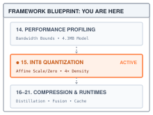
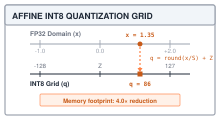
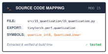

# INT8 Quantization: Compressing Floats into 8-Bit Integers {#sec-quantization}

::: {.column-margin}
{width="100%" fig-alt="TinyTorch execution datapath blueprint highlighting Module 15 Quantization as the active subsystem."}

*Framework Blueprint: Module 15 compresses 32-bit floats into 8-bit integers, quadrupling cache line density while maintaining numerical precision.*
:::


Standard neural network training uses 32-bit floating-point (FP32) arithmetic, but serving large models on edge devices and production servers is heavily constrained by memory capacity, memory bandwidth, and power consumption. Post-training quantization (PTQ) addresses these limits by representing 32-bit floating-point weights and activations as 8-bit integers (INT8). Packed one byte per value, INT8 weights need a quarter of the FP32 storage. Whether they also run faster depends on hardware with integer matrix units, and whether accuracy survives depends on how well the integer grid covers each tensor's values.

From a systems and framework perspective, quantization maps continuous real numbers onto discrete integer grids through affine transformations:
1. **Affine quantization arithmetic**: Deriving scale ($S$) and zero-point ($Z$) parameters ($q = \text{round}(x/S) + Z$) across symmetric and asymmetric mapping schemes.
2. **Integer accumulation**: How an integer matrix multiply widens 8-bit products into 32-bit accumulators to prevent overflow, shown in a book-only comparison against TinyTorch's float path.
3. **Dequantization and calibration**: Scaling integers back to floating point, choosing each tensor's range from sample data, and measuring the error against the FP32 result.

This chapter constructs TinyTorch's quantization engine. It simulates INT8 by keeping integer codes in float32 arrays and multiplying in float32, so it measures numerical fidelity and models the packed storage a real INT8 runtime would use, without realizing that saving itself.

::: {#fig-quantization-geometry fig-env="figure" fig-pos="htb" fig-cap="**Quantization and storage**: A scale and zero point map floats to integer codes and reconstruct rounded values. Packed storage uses one byte per code; TinyTorch wraps codes in float32 arrays." fig-alt="Three boxes connect floating-point values, affine integer codes from minus 128 through 127, and reconstructed floats. Separate boxes distinguish packed storage from TinyTorch float32 execution."}

:::

---

## The Problem

::: {.column-margin}
**↩ Jump back:** @sec-profiling
*Applying operational intensity to determine when weight memory traffic dominates FP32 inference.*
:::


A 32-bit float costs 4 bytes. That is the whole problem, and a napkin shows how much it hurts. A single square linear layer with 4096 inputs and 4096 outputs holds $4096 \times 4096 = 16{,}777{,}216$ weights, which is 67 MB in FP32. Generating one token multiplies one activation vector by that matrix, so the processor must stream all 67 MB through memory to do $2 \times 4096 \times 4096 \approx 33.5$ million arithmetic operations. That is 0.5 operations per byte, the arithmetic intensity @sec-profiling taught us to compute, which makes weight bandwidth a plausible bottleneck when the weights must be fetched from main memory. At a hypothetical sustained memory bandwidth of 100 GB/s, those bytes alone imply a 0.67 ms lower bound per token per layer. Faster arithmetic cannot lower this traffic bound. Packing the weights addresses the byte count; batching and reuse address how often those bytes must cross memory.


::: {#nbk-quantization-int8-memory-compute-gains .callout-notebook title="Napkin math for a 4096 by 4096 layer"}
- Weights: $16{,}777{,}216$. FP32 storage: $67.1$ MB. INT8 storage: $16.8$ MB.
- If a kernel reads packed codes directly, weight bytes streamed per generated token drop by $4\times$; at the assumed $100$ GB/s the corresponding lower bound drops from $671\ \mu\text{s}$ to $168\ \mu\text{s}$.
- Arithmetic operations per token are unchanged at $33.5$ million. Counting weight bytes alone, the intensity rises from $0.5$ to $2.0$ operations per byte. Whether memory still limits execution depends on the machine and kernel.
:::

The first attempt fails on the four small weights from the opening. Casting truncates each value toward zero:

```python
weights = [0.0123, -0.0871, 0.0456, -0.0012]
print([int(w) for w in weights])   # every weight becomes 0
```

The integers $-128$ through $127$ are perfectly good for counting, but the weights do not live on that grid. Quantization is the trick of moving them onto it.

---

## The Idea

::: {.column-margin}
**↪ Jump ahead:** @sec-compression
*Combining weight quantization with knowledge distillation for compound model compression.*
:::


### One scale and one zero point

::: {.column-margin}
{width="100%"}
*Affine INT8 quantization: continuous FP32 values project onto 256 discrete bins with scale $S$ and zero-point $Z$.*
:::

Consider `[0.0, 0.5, 1.0]`. Its endpoints are one unit apart. Dividing that interval into 255 steps gives a step width of $1/255$. Code $-128$ represents zero, code $127$ represents one, and the midpoint rounds to code $0$, which reconstructs as $128/255 \approx 0.50196$. The middle value changes slightly; it no longer disappears. The step width and the code assigned to zero are the two numbers needed to repeat this mapping for another tensor.

Take a tensor whose values lie between $x_{\min}$ and $x_{\max}$. Stretch that interval so that it includes $0.0$ (if the values are all positive, as the output of a ReLU is, the interval grows down to zero), and then spread it evenly over the 256 codes a signed byte can hold. The width of one step is the **scale**:

$$S = \frac{x_{\max} - x_{\min}}{255}$$

Divide every value by $S$ and the tensor spans 255 steps. Shifting it so that $x_{\min}$ lands on $-128$ takes one integer offset, the **zero point** $Z$, which is the code that represents $0.0$:

$$Z = \text{round}\!\left(-128 - \frac{x_{\min}}{S}\right), \qquad q = \text{clamp}\!\left(\text{round}\!\left(\frac{x}{S} + Z\right),\; -128,\; 127\right)$$

Here $x$ is the original float and $q$ is its 8-bit code. Rounding the zero point can put an endpoint code just outside the byte, so the clamp is necessary even for the observed range. A grid chosen from different data may require much larger clipping. Stretching the interval to include zero keeps $Z$ inside the byte, but it can enlarge the step substantially for a narrow interval far from zero. The reconstruction bound must use that enlarged interval. To get a float back, undo the shift and the division:

$$\hat{x} = (q - Z) \times S$$

The hat marks that $\hat{x}$ is a reconstruction, not the original. For values in the range used to construct this grid, reconstruction differs by at most half a step in exact arithmetic:

$$|x - \hat{x}| \le \frac{S}{2} = \frac{x_{\max} - x_{\min}}{510}$$

The bound describes individual values inside the observed range, with an additional floating-point rounding error in the implementation. It does not bound the model's prediction error, nor does it apply to later inputs outside a frozen calibration range. Within its scope, it is about $0.2\%$ of the zero-inclusive range, regardless of the tensor's size. The bound is also the warning. It is relative to the range, not to $x$. A weight of $0.001$ in a tensor whose values span $[-1, 1]$ is rounded to the grid step $S \approx 0.0078$, and comes back as $0$. Small values in a tensor with one large outlier are where quantization loses information.

A signal-to-noise ratio turns the per-value bound into one number for the whole tensor. If rounding errors are spread evenly across $[-S/2, S/2]$, their root-mean-square value is $S/\sqrt{12}$. A signal that fills the range uniformly has root-mean-square value $(x_{\max} - x_{\min})/\sqrt{12}$, and the ratio of the two, expressed in decibels, is

$$\text{SNR} = 20 \log_{10} \frac{x_{\max} - x_{\min}}{S} = 20 \log_{10} \left(2^b - 1\right) \approx 6.02\,b \ \text{dB}$$

for a grid of $b$ bits. Eight bits give $20 \log_{10} 255 \approx 48.1$ dB, and each added bit adds about 6 dB, because it doubles the number of steps. The figure is a ceiling, not a prediction. Real weight tensors cluster near zero rather than filling their range, so their signal power falls below the uniform case while the noise, which is set by the step, does not; one outlier that stretches the range lowers the ratio for every other value. How much ratio a given model can tolerate is a property of that model, and only an accuracy measurement settles it.

This mapping is called **asymmetric** because the grid does not have to be centered on zero; it is the form Module 15 uses. The **symmetric** special case takes $x_{\min} = -x_{\max}$, so that $Z = 0$ and the formulas lose a term; it wastes codes when a tensor is all positive, which is why the general form earns its extra integer. A tensor of all one value has no range at all, and the module handles it with a separate branch that encodes every element as code $0$ and lets $Z$ and $S$ carry the constant.

![**Affine quantization grid and zero-point alignment**: Continuous float32 values across dynamic range $[x_{\min}, x_{\max}]$ are discretized into 256 uniform integer bins ($q \in [-128, 127]$). Scale $S$ specifies step size, zero-point $Z$ aligns real value $0.0$ to an exact integer code, and clamping prevents out-of-range overflow, bounding reconstruction error to $\le S/2$.](assets/images/diagrams/15_affine-quantization-grid.svg){#fig-affine-quantization-grid fig-alt="Diagram showing continuous float32 dynamic range mapped into 256 discrete int8 bins with scale S, zero point Z, and reconstruction error bounds."}

### A scale shared by the whole tensor

A shared scale also explains how a kernel could multiply the integer codes. TinyTorch's layer first reconstructs float32 operands; the following identity will let us check that path against a separate integer calculation. Write the reconstructed activation row and weight matrix in terms of their codes, $\hat{x} = S_x (Q_x - Z_x)$ and $\hat{W} = S_W (Q_W - Z_W)$. Their product factors:

$$\hat{y} = \hat{x} \hat{W}^{T} = (S_x S_W)\,\big((Q_x - Z_x)(Q_W - Z_W)^{T}\big)$$

For this equation, the weight matrix has one output per row; the source Linear stores its transpose with shape `[in_features, out_features]`. Everything inside the last parentheses is integer arithmetic: subtract each zero point from its codes, which is still an integer, then take the dot products. The two scales are ordinary floats, and their product can rescale each accumulated output once. A single scale per tensor makes this factorization possible. The stored codes fit in a byte, but subtracting zero points and summing products require wider integers. The book-only integer function below will make those intermediate types explicit.

Everything in this chapter happens after training, with no gradient in sight. It is **post-training quantization**, a transformation of a finished model. Weight-only conversion needs the weights; static activation quantization also needs representative calibration inputs.

---

## The Code

::: {.column-margin}
{width="100%" fig-alt="Source code mapping card for Module 15 Quantization showing file path, exported package, and tested primitives."}

*Source Code Mapping: Module 15 extracts affine INT8 quantization, dynamic range calibration, and integer matrix multiplication directly from the working repository.*
:::

### Quantize and dequantize

Start with the weights, because they are the bytes we are trying to shrink. The 4096 by 4096 layer from The Problem holds 16.8 million floats. A packed representation needs one integer code per value and enough information to reconstruct the float grid. Everything else in the chapter sits on this pair of functions, and @sec-compression will change the number of matrix entries after this chapter changes their precision.

The Problem already showed the naive version. Cast each weight to an integer and every one of them, being smaller than 1 in magnitude, becomes 0. A packed integer layer would occupy 16.8 MB for its weights and would compute nothing but its bias. The grid must distinguish these small floats despite having only 256 codes. The scale is the answer. Measure the zero-inclusive range, divide by its grid step, add the zero point, and round. The weights now spread across the whole byte, and each one comes back to within $S/2$ of where it started.

`quantize_int8` does the measuring, dividing, shifting, rounding, and clamping.

::: {lst-cap="**Encoding one tensor**: Source excerpt from Module 15."}

:::

Steps 3 through 6 are the formulas from The Idea, in order. The initial validation rejects empty arrays and nonfinite values, since neither supplies a usable finite range. Step 2 is the case the formulas cannot handle, a tensor with no range, which the module encodes as all zeros and lets the scale and zero point reconstruct. Step 3 is the one that is easy to skip and wrong to skip: without it, an all-positive tensor puts $Z$ below $-128$, the clamp on the next line silently moves it, and every value comes back shifted. The comments say so because a student who removes the line sees no error, only worse accuracy. The constant branch has a different invariant. For a positive constant `c`, it chooses `scale = abs(c)`, `zero_point = -1`, and all-zero codes, so reconstruction gives `(0 - (-1)) * abs(c) = c`. A negative constant uses zero point `+1`; zero itself uses scale one and zero point zero. Putting the magnitude in the scale preserves fractional constants such as `0.25`. Testing exact equality of the extrema also matters: a tiny nonconstant interval still needs a grid, not a branch that discards its variation. The general branch uses float64 intermediates for division, so a positive scale too small for float32 does not become zero before rounding. Reconstruction uses the same wider intermediate and clips to the finite float32 endpoints before returning a new Tensor. These choices preserve the finite range supported by the original Tensor; they do not change its storage type.

::: {lst-cap="**Reconstructing float32 values**: Source excerpt from Module 15."}

:::

Run the pair on three numbers.

::: {lst-cap="**Three values on one grid**: Codes and reconstructed values share the same shape."}
```python
import numpy as np
from tinytorch.core.tensor import Tensor
from tinytorch.perf.quantization import quantize_int8, dequantize_int8, QuantizedLinear

x = Tensor(np.array([0.5, -0.3, 0.1], dtype=np.float32))
q, scale, zero_point = quantize_int8(x)
print(q.data, scale, zero_point)          # [127. -128.    0.] 0.003137... -32
print(dequantize_int8(q, scale, zero_point).data)   # [0.4988 -0.3012  0.1004]
```
:::

The range is $[-0.3, 0.5]$, so the scale is $0.8 / 255 = 0.003137$ and the zero point is $\text{round}(-128 + 0.3 / 0.003137) = -32$. The code for $0.1$ is $\text{round}(31.875 - 32) = 0$, which is the zero point doing its job: $0.1$ is not zero, but it sits 32 steps above the value represented by the zero point, and the grid records that. Every reconstruction is within $S/2 \approx 0.0016$ of its original, as the bound promised. One thing to notice about the printout is that the codes print as `127.` with a decimal point. `quantize_int8` does produce an `int8` array, but it hands the array to `Tensor`, and @sec-tensors's `Tensor` stores its arrays as float32. So in this NumPy framework the codes occupy four bytes each the moment they are wrapped, and the memory saving is accounted for by `memory_usage` below rather than realized in RAM. The byte saving needs a container that preserves the integer dtype. Neither function mutates its input; each returns a new Tensor, along with grid metadata in the quantizer's case.

The constant case can be checked independently of the general rounding bound:

::: {lst-cap="**Constant tensors**: The scale and zero point recover fractional constants from all-zero codes."}
```python
for value in (0.0, 0.25, -0.5):
    original = Tensor([value, value])
    codes, scale, zero = quantize_int8(original)
    restored = dequantize_int8(codes, scale, zero)
    assert np.array_equal(restored.data, original.data)
    assert np.all(codes.data == 0)
    print(value, scale, zero)
# 0.0 1.0 0
# 0.25 0.25 -1
# -0.5 0.5 1
```
:::

`calibrate` widens the observed input range to include zero before checking equality, so its constant branch applies only to all-zero samples. A constant positive calibration set uses the ordinary grid from zero to that value. Both routes must preserve small nonzero magnitudes; replacing their equality test with a broad absolute tolerance would erase valid inputs.

### The quantized layer

A packed integer layer would keep its weight codes in one byte each and consume them directly. TinyTorch keeps float32 arrays for compatibility with the Tensor implemented earlier, so `QuantizedLinear` cannot provide that storage reduction. Reading the class is still useful because it separates three moments that an inference implementation must handle: choosing the weight grid at construction, choosing an input grid during calibration, and applying those grids during each forward pass.

A reconstruction buffer has a cost. If a hypothetical packed layer reads 16.8 MB of codes, writes 67.1 MB of reconstructed weights, and then reads that entire buffer for the multiply, those three array operations involve about 151 MB. This is an accounting example, not measured memory-bus traffic; caches and buffer reuse affect actual transfers. TinyTorch also stores the codes in float32, so this packed-code count does not describe its allocation. A deployment kernel must preserve the storage advantage while arranging the multiply. The production bridge returns to that choice.

That leaves the activations, which have a scale of their own in the product and no obvious place to get it from. For weights, the range is known the moment training ends; look at the matrix and take its minimum and maximum. Activations depend on the input, so their range is not known until the input arrives. There are two honest options. **Dynamic quantization** computes $S_x$ and $Z_x$ from each input as it comes, which measures the current range but still rounds values and costs a pass over the activations before every multiply. **Static quantization** runs a few representative inputs through the model offline, records the range the layer sees, and freezes that as the layer's input grid. This offline step is called **calibration**, and the recorded range is only as good as the samples were representative.

`QuantizedLinear` is built from an existing `Linear`. It quantizes the weights once, at construction, and the bias too, each with its own scale and zero point. These code arrays are independent of the original parameters. The wrapper also keeps an `original_layer` reference for memory accounting; changing the original weights later does not recompute its codes. Initially `input_scale` and `input_zero_point` are `None`, so inputs remain unrounded until `calibrate` sets both fields. The following four excerpts are methods of this same class.

::: {lst-cap="**Saving weight and bias codes**: Source excerpt from Module 15."}

:::

`calibrate` receives a list of input Tensors. Flattening them combines their observed values into one range, so every feature shares one input scale. The extrema are widened to include zero. The all-zero case uses scale one and zero point zero; otherwise the same affine-grid formulas determine the two fields. This method returns no converted samples. Its lasting effect is the new input grid.

::: {lst-cap="**Choosing the input grid**: Source excerpt from Module 15."}

:::

That stored state selects the branch at the start of `forward`. The method can now expose rounding and saturation using a grid measured on different inputs.

::: {lst-cap="**Executing the simulated layer**: Source excerpt from Module 15."}

:::

Read `forward` in call order. If an input grid exists, it rounds and clamps `x` using that grid, then calls `dequantize_int8` to create a float32 reconstruction. It independently reconstructs the stored weight codes, calls `x.matmul(weight_fp32)`, and adds a reconstructed bias if present. For input shape `[batch, in_features]` and weight shape `[in_features, out_features]`, the returned Tensor has shape `[batch, out_features]`. None of these steps changes the stored codes or recalibrates the grid. Inputs outside the calibrated range saturate at the edge of the byte; the drift trace below shows how this changes the output.

`memory_usage` estimates one byte per weight and bias code plus eight metadata bytes per quantized array: a float32 scale and a four-byte zero point. A layer with a bias needs two such pairs.

::: {lst-cap="**Counting modeled packed bytes**: Source excerpt from Module 15."}

:::

The report counts a hypothetical packed parameter format. It excludes Python objects, the actual float32 code arrays, the retained `original_layer`, and temporary reconstruction buffers. The input-grid fields are also outside this parameter-storage count. These boundaries matter most for small layers, where metadata can exceed the code bytes.

The integer identity can be checked against the same layer without changing Module 15. It quantizes the input on the fly, subtracts both zero points, takes the dot products in 32-bit integers, and rescales once per output.

::: {lst-cap="**An integer arithmetic comparison**: This book-only function widens codes before taking dot products."}
```python
def int8_forward(layer: QuantizedLinear, x: Tensor) -> np.ndarray:
    """The integer path: codes in, one rescale out. Not in Module 15."""
    q_x, x_scale, x_zero = quantize_int8(x)
    lhs = q_x.data.astype(np.int32) - x_zero                              # [rows, in]
    rhs = layer.q_weight.data.astype(np.int32) - layer.weight_zero_point  # [in, out]
    acc = lhs @ rhs                                                       # int32 dot products
    y = acc * (x_scale * layer.weight_scale)                              # one float multiply per output
    if layer.q_bias is not None:
        y = y + dequantize_int8(layer.q_bias, layer.bias_scale, layer.bias_zero_point).data
    return y
```
:::

One detail matters for the accumulator. After the zero points are subtracted each operand spans up to 255, so one product can reach $255 \times 255 = 65{,}025$, and a dot product over $K$ inputs sums $K$ of them. A 32-bit accumulator holds up to $2{,}147{,}483{,}647$, enough for $K$ up to about $33{,}000$ inputs at the worst case; a 16-bit accumulator cannot hold even one worst-case product. This book function uses 32-bit accumulation, as does the integer-kernel design it models. NumPy's `int32` does it here, and the trace checks that the sums stay far from the edge. This function is an arithmetic demonstration, not a packed or optimized kernel: its NumPy operands are int32 arrays, and it allocates them on every call.

### Quantizing a whole model

A two-layer model introduces a dependency that a single layer does not have. In `Sequential(Linear(4, 8), ReLU(), Linear(8, 2))`, a calibration input of shape `[1, 4]` must pass through the first Linear and ReLU before it can calibrate the second Linear, whose input shape is `[1, 8]`. Passing raw samples to both layers would measure the wrong distribution and even the wrong feature count.

`quantize_model` walks the container in order. It collects a layer's calibration inputs through the prefix already converted, constructs a `QuantizedLinear`, and assigns the replacement to `model.layers[i]`. For a nested container, it collects that container's input samples and recurses. The call returns `None`; the supplied model now owns the replacements. Copy the model first when a separate baseline is needed. A standalone Linear has no containing slot to replace, so the function rejects it and directs callers to `QuantizedLinear(linear)`.

::: {lst-cap="**Replacing layers in container order**: Source excerpt from Module 15."}

:::

The ordering is in the loop itself. Layer `i` is replaced before the loop reaches layer `i + 1`, so when the helper below runs calibration data forward through layers `0` to `i - 1`, it runs through the quantized versions, and layer `i` is calibrated on the activations it will actually receive.

::: {lst-cap="**Measuring the converted prefix**: Source excerpt from Module 15."}

:::

The helper calls preceding layers in inference mode when their `forward` accepts `training`. This disables @sec-layers's Dropout, including Dropout inside a nested Sequential. Otherwise the frozen grid would describe randomly masked training activations. `_quantize_single_layer` then constructs the wrapper and, when samples were supplied, calls `calibrate`.

The `max_samples` cap selects at most ten items from the supplied list; an item may itself be a batch. `calibrate` scans their flattened values and saves only the scale and zero point, not the samples. Extra items past the cap do not influence this grid. An empty or nonfinite calibration set raises an error. Representative coverage matters more than a universal sample count, so a held-out comparison must check for missed ranges.

The wrapper named `Quantizer.quantize_model` has a different contract from the standalone function shown here. It returns parameter artifacts and modeled packed-storage statistics without replacing layers or calibrating activations. Its report includes a scale and zero point for each parameter array. Calling the wrapper is therefore insufficient to change model execution.

---

## A Worked Trace

A 2 by 2 weight matrix and a 2-element input are enough to check every step by hand.

$$W = \begin{bmatrix} 1.27 & -0.638 \\ 0.253 & -1.019 \end{bmatrix}, \qquad x = \begin{bmatrix} 0.5 & -0.3 \end{bmatrix}$$

The weights range from $-1.019$ to $1.27$, so $S_W = 2.289 / 255 = 0.008976$ and $Z_W = \text{round}(-128 + 1.019 / 0.008976) = \text{round}(-14.48) = -14$.

Dividing by the scale, adding the zero point, and rounding gives $1.27 / 0.008976 - 14 = 127.48 \to 127$, $-0.638 / 0.008976 - 14 = -85.08 \to -85$, $0.253 / 0.008976 - 14 = 14.18 \to 14$, and $-1.019 / 0.008976 - 14 = -127.52 \to -128$.

The input ranges from $-0.3$ to $0.5$, so $S_x = 0.8 / 255 = 0.003137$ and $Z_x = \text{round}(-128 + 0.3 / 0.003137) = -32$. Then $0.5 / 0.003137 - 32 = 127.4 \to 127$ and $-0.3 / 0.003137 - 32 = -127.6 \to -128$.

$$Q_W = \begin{bmatrix} 127 & -85 \\ 14 & -128 \end{bmatrix}, \qquad Q_x = \begin{bmatrix} 127 & -128 \end{bmatrix}$$

Subtracting the zero points gives the integer operands, $Q_x - Z_x = [159, -96]$ and, row by row, $Q_W - Z_W = [141, -71]$ and $[28, -114]$. The accumulators and the rescale by $S_x S_W = 2.816 \times 10^{-5}$ give the two outputs in @tbl-int8-quant-trace, alongside the exact float result.

| Output | Exact FP32 | Accumulator | Rescaled INT8 result | Error |
| :--- | :--- | :--- | :--- | :--- |
| $y_0$ | $0.5(1.27) + (-0.3)(-0.638) = 0.8264$ | $159(141) + (-96)(-71) = 29{,}235$ | $29{,}235 \times 2.816 \times 10^{-5} = 0.8233$ | $-0.0031$ |
| $y_1$ | $0.5(0.253) + (-0.3)(-1.019) = 0.4322$ | $159(28) + (-96)(-114) = 15{,}396$ | $15{,}396 \times 2.816 \times 10^{-5} = 0.4336$ | $+0.0014$ |

: One INT8 linear layer traced against exact FP32 arithmetic. {#tbl-int8-quant-trace tbl-colwidths="[10,28,24,26,12]"}

The first output is off by $0.003$, about a third of a percent, and the trace shows where it came from. The reconstructions are $\hat{x} = [0.4988, -0.3012]$ and, for the first row of $W$, $[1.2657, -0.6373]$; using the unrounded grid values in the product gives approximately $0.8233$. Each is within its $S/2$ bound, $0.0016$ for the input and $0.0045$ for the weights, and on this row their errors pushed the same direction. A packed copy of the four weights would take 4 code bytes plus 8 metadata bytes, rather than 16 FP32 bytes. The two-element bias adds its own code bytes and metadata. For the complete tiny layer, `memory_usage()` therefore reports 24 original bytes and 22 modeled bytes, only $1.09\times$ compression. Metadata becomes relatively small for large arrays; `memory_usage` on the 4096 by 4096 layer from The Problem reports 67,125,248 bytes against 16,781,328, a ratio of 4.0.

The class should first agree with the four weights traced by hand. In the listing below, line 4 defines the $2 \times 2$ weight matrix, loaded into `Linear(2, 2)` in lines 5--7 (transposed to match input-by-output storage convention). Line 9 wraps it in `layer = QuantizedLinear(linear)`. In lines 10--12, `layer.q_weight.data.T`, `layer.weight_scale`, and `layer.weight_zero_point` print the exact quantized integer codes ($[[127, -85], [14, -128]]$), scale factor ($0.008976$), and zero-point offset ($-14$) derived above.

Line 14 supplies the two-element test vector $x = [0.5, -0.3]$. Line 15 computes the baseline FP32 reference `[[0.8264, 0.4322]]`. In line 16, `layer.forward(x)` executes the dequantize-in-float path, yielding `[[0.82404, 0.43267]]`. In line 17, `int8_forward(layer, x)` executes the pure INT8 integer accumulation path, producing `[[0.8233, 0.4336]]` matching @tbl-int8-quant-trace.

::: {lst-cap="**Checking the two-output layer**: Weight-only and input-rounded paths produce different results."}
```python
from tinytorch.core.layers import Linear
from tinytorch.perf.quantization import QuantizedLinear

W = np.array([[1.27, -0.638], [0.253, -1.019]], dtype=np.float32)   # rows are outputs
linear = Linear(2, 2)
linear.weight.data[:] = W.T
linear.bias.data[:] = 0.0

layer = QuantizedLinear(linear)
print(layer.q_weight.data.T, layer.weight_scale, layer.weight_zero_point)
# [[ 127.  -85.]
#  [  14. -128.]] 0.008976... -14

x = Tensor(np.array([[0.5, -0.3]], dtype=np.float32))
print(x.data @ W.T)                 # [[0.8264 0.4322]]  exact
print(layer.forward(x).data)        # [[0.82404 0.43267]]  weights rounded, float multiply
print(int8_forward(layer, x))       # [[0.8233 0.4336]]  integer path: both operands rounded
```
:::

The module's uncalibrated `forward` (line 16) rounds only the weights, so it lands closer to the exact answer on this example than `int8_forward` (line 17), which rounds both operands. The two functions model different inference paths. After `calibrate`, the module also rounds its inputs, but onto the stored grid rather than a grid measured from each new input. Comparisons must state which of these paths they used; otherwise an apparent improvement can come from changing the experiment.

We can follow the same layer through its calibration state change. The samples `[[0.4, -0.2]]` and `[[0.1, 0.5]]` have a combined range of $[-0.2, 0.5]$. `calibrate` stores $S_x = 0.7/255 \approx 0.0027451$ and $Z_x = -55$. It leaves the weight and bias codes unchanged. The later input `[[2.0, -1.5]]` is outside this recorded range in both coordinates.

::: {lst-cap="**A frozen calibration grid**: Later inputs outside the observed range saturate."}
```python
layer.calibrate([Tensor([[0.4, -0.2]]), Tensor([[0.1, 0.5]])])
x_drift = Tensor([[2.0, -1.5]])
scale, zero = layer.input_scale, layer.input_zero_point
raw_codes = np.round(x_drift.data.astype(np.float64) / scale + zero)
codes = np.clip(raw_codes, -128, 127)
print(raw_codes, codes)             # [[ 674. -601.]] [[ 127. -128.]]
print(dequantize_int8(Tensor(codes), scale, zero).data)
# [[ 0.49961 -0.20039]]
print(layer.forward(x_drift).data)   # [[0.76006 0.33064]]
print(x_drift.data @ W.T)           # [[3.497   2.0345]]
```
:::

The large discrepancy occurs before matrix multiplication. Clamping makes `2.0` behave like approximately `0.49961` and `-1.5` like `-0.20039`. The half-step bound for values inside the calibration interval cannot protect these out-of-range inputs. `forward` keeps the same scale afterward; it does not widen the range in response to this call. Calling `calibrate` again would replace the grid, while constructing a fresh wrapper would restore the uncalibrated path.

A calibration comparison must hold the weights fixed. The following experiment builds one model and copies it for both paths, so the only changed condition is whether the input grid was calibrated. The explicit generator initializes the weight arrays as well as the inputs; the constructor's separate random state cannot change the experiment.

::: {lst-cap="**Comparing calibration paths**: Copies of one model isolate the effect of the input grid."}
```python
import copy
from tinytorch.core.layers import Sequential
from tinytorch.core.activations import ReLU
from tinytorch.perf.quantization import quantize_model

rng = np.random.default_rng(0)
inputs = Tensor(rng.standard_normal((16, 4)).astype(np.float32))
calibration = [Tensor(rng.standard_normal((1, 4)).astype(np.float32)) for _ in range(8)]
original = Sequential(Linear(4, 8), ReLU(), Linear(8, 2))
for parameter in original.parameters():
    parameter.data[:] = rng.standard_normal(parameter.shape) * 0.1
reference = original(inputs).data.copy()
for name, data in (("weights only", None), ("calibrated inputs", calibration)):
    model = copy.deepcopy(original)
    quantize_model(model, data)
    error = np.abs(model(inputs).data - reference).max()
    print(name, f"{error:.7f}")
# weights only 0.0006070
# calibrated inputs 0.0019063
```
:::

The first run isolates weight rounding. The second includes rounding and possible saturation of the inputs to each layer. `_collect_layer_inputs` runs the calibration samples through the already converted prefix, so the second layer observes the output of the quantized first layer. Neither path promises a universal error ordering. To explain a larger calibrated error, inspect which inference activations fall outside the recorded ranges instead of attributing every difference to weight precision.

---

## From TinyTorch to Production

PyTorch 2.9 provides a direct comparison through its eager-mode `torch.ao.quantization` API. The following version-specific example selects dynamic quantization for `Linear` layers. PyTorch's documentation directs new development toward torchao; the older API remains useful here because its conversion closely matches the layer replacement we just read. [PyTorch 2.9 quantization documentation](https://docs.pytorch.org/docs/2.9/quantization.html).

::: {lst-cap="**A versioned production comparison**: This PyTorch 2.9 call converts Linear layers."}
```python
import torch
import torch.ao.quantization as tq

model_fp32 = torch.nn.Sequential(torch.nn.Linear(4096, 4096))
model_int8 = tq.quantize_dynamic(model_fp32, {torch.nn.Linear}, dtype=torch.qint8)
```
:::

The default in this exact call is per-tensor weight quantization. In the PyTorch 2.9 source, a set of layer types with `dtype=torch.qint8` selects `default_dynamic_qconfig`, whose weight observer uses `torch.per_tensor_symmetric`. Per-channel weights are a separate configuration, `per_channel_dynamic_qconfig`, which assigns a scale per output channel. That option limits the influence of an outlier to its own channel; it is not the default selected by the example. [Conversion selection](https://github.com/pytorch/pytorch/blob/v2.9.0/torch/ao/quantization/quantize.py#L497-L510), [weight observer](https://github.com/pytorch/pytorch/blob/v2.9.0/torch/ao/quantization/observer.py#L1908-L1910), and [configuration definitions](https://github.com/pytorch/pytorch/blob/v2.9.0/torch/ao/quantization/qconfig.py#L157-L188) make the distinction explicit.

The storage and execution changes remain the important contrast with TinyTorch. The converted layer passes packed quantized weights to a quantized backend rather than dequantizing a full float32 weight array before every multiply, as its [forward method](https://github.com/pytorch/pytorch/blob/v2.9.0/torch/ao/nn/quantized/dynamic/modules/linear.py#L44-L61) shows. Static quantization adds an offline calibration pass to choose activation grids. As in `QuantizedLinear.calibrate`, those grids describe the data observed during calibration; they cannot guarantee that future inputs stay within the same range.

An integer dot product is only one deployment design. A weight-only kernel can keep activations in floating point and decode small groups of packed weights immediately before using them. The important distinction from TinyTorch is where expansion happens. Expanding a full weight matrix into a separate float32 array creates a large temporary buffer; consuming small decoded groups within the multiply can avoid that buffer. The benefit still depends on the kernel and workload, and cannot be inferred from the code width alone.

A finer grouping also changes accuracy. Giving each output channel or small weight group its own scale prevents one outlier from coarsening the grid for the entire tensor, at the cost of more metadata and rescaling work. With 4-bit codes there are only 16 levels, so this choice becomes more consequential. Training with rounding simulated in the forward pass is another option, called quantization-aware training.[^fn-ste-qat] These are extensions to the grid mechanism, not paths implemented by Module 15.

::: {#psp-quantization-hardware-tensor-cores .callout-production title="Production bridge: INT8 / FP8 Tensor Cores and CUTLASS GEMM"}
TinyTorch simulates affine quantization by mapping floats to integer steps and dequantizing back to float32 before matrix multiplication. In production acceleration runtimes (e.g., NVIDIA TensorRT, vLLM, and CUTLASS):

1. **Native Integer Execution**: Accelerators execute integer matrix multiplications ($D = A_{\text{int8}} \times B_{\text{int8}}$) directly on hardware Tensor Cores using the `mma.sync.aligned.m16n8k32.row.col` PTX instruction. Intermediate products accumulate in 32-bit integer registers (`int32`) before a single epilogue instruction applies floating-point scale factor multiplication and bias addition.
2. **FP8 and Microscaling**: Modern architectures (NVIDIA Hopper H100, Ada Lovelace, and Blackwell) extend sub-byte quantization to FP8 (`E4M3` for activations, `E5M2` for gradients) and block-scaled INT4/FP4 microscaling formats (e.g., MXFP4), providing 2--4$\times$ higher throughput than FP16 without requiring non-trivial zero-point tracking arithmetic.
:::

| | TinyTorch `QuantizedLinear` | PyTorch 2.9 dynamic Linear | Weight-only design |
| :--- | :--- | :--- | :--- |
| Weight storage | INT8-range codes in float32 arrays | Packed quantized weights | Packed codes with group metadata |
| Input grid | Optional fixed calibration grid | Chosen during inference | Activations stay floating point |
| Multiply | Reconstruct full weight array, then float32 matmul | Quantized backend operation | Decode weight groups as needed |
| Evidence of benefit | Rounding error and modeled bytes | Requires workload measurements | Requires workload measurements |

: Storage and execution are separate choices. {#tbl-quantization-production-comparison tbl-colwidths="[18,29,27,26]"}

The comparison in @tbl-quantization-production-comparison keeps two contracts separate. The grid defines which values can be reconstructed and what rounding or saturation changes. The execution format defines which bytes are allocated and which arithmetic the kernel performs. TinyTorch gives us a readable reference for the first contract. Its modeled storage report must not substitute for a measurement of the second.

Three things are worth looking for in your own work. When a quantized model loses accuracy, find the tensor whose largest magnitude is far from its typical magnitude, because that is where the grid is too coarse, and ask whether per-row or per-group scales fix it before reaching for training. When a quantized model is not faster, check whether the kernel actually consumes integers or dequantizes first, and whether the workload was memory-bound to begin with; smaller stored weights alone do not establish a speedup for a multiply limited by arithmetic. Check how far inference activations wander outside the calibration range before freezing that grid.

[^fn-ste-qat]: **Straight-through estimator**: the rule that lets gradients flow through a rounding step during training. Rounding has zero derivative almost everywhere, so backpropagation would stop at it; the estimator pretends the derivative is one, so the optimizer can update the underlying floating-point weights despite the discrete forward operation. The backward rule is an approximation to guide training, not the derivative of rounding.

---

## Summary

`quantize_int8` returns integer-range codes plus a scale and zero point without changing the original tensor. `dequantize_int8` reconstructs their float32 values. For a value within the observed range, the reconstruction error is bounded by half a grid step, apart from floating-point rounding. The bound concerns that value, not the network's output, and it does not protect inputs outside a frozen calibration range.

`QuantizedLinear` snapshots weight and bias codes at construction. Calibration changes only its input-grid state; forward reconstructs the operands, multiplies in float32, and returns a new output. `quantize_model` replaces layers in container order, using inference-mode activations from the already converted prefix to calibrate each replacement. The separate integer trace explains how scales can be factored out of dot products, but it is not the module's execution path. Packed code bytes and metadata are modeled; the Tensor arrays still occupy float32 storage. @sec-compression changes the other factor in the storage calculation, the number of entries a layer needs, rather than the precision of each entry.

---

## Further reading

- Jacob et al. (2018), [Quantization and training of neural networks for efficient integer-arithmetic-only inference](https://arxiv.org/abs/1712.05877), *CVPR*. The affine scheme with a scale and zero point that this chapter implements, and the integer arithmetic it enables.
- Nagel et al. (2021), [A white paper on neural network quantization](https://arxiv.org/abs/2106.08295), *arXiv*. Post-training quantization in practice, including per-channel scales and outliers.
- Gholami et al. (2021), [A survey of quantization methods for efficient neural network inference](https://arxiv.org/abs/2103.13630), *arXiv*. The wider design space, from uniform grids to mixed precision.

## Exercises

1. **Outliers.** Quantize `Tensor(np.array([0.01, 0.02, -0.015, 0.03, 8.0]))` with `quantize_int8` and dequantize it. Which values survive, and what does the reconstruction of `0.01` come back as? Then quantize the first four values without the `8.0` and compare. Write one sentence explaining why per-row scales help.

2. **Accumulator width.** Use input `[[0.0, 1.0]]`, a Linear weight array `[[0.0], [1.0]]`, and zero bias. Predict the zero points and the centered operands in `int8_forward`. Then change both operand casts to `np.int16` and compare results. Explain why the dot product overflows even though the original float answer is one, and why widening must happen before subtracting the zero point.

3. **Calibration drift.** Repeat the drift trace, then recalibrate the same layer with an additional sample `Tensor([[2.0, -1.5]])`. Predict which fields change and which remain fixed. Check the new codes and output for the drift input. Finally compare the old and new grids on `Tensor([[0.01, -0.01]])`; explain the trade-off between a wider range and a finer step.

4. **Calibration state and ownership.** Build `Sequential(Dropout(1.0), Linear(1, 1))` with weight one and bias zero. Compare its inference output for `Tensor([[0.2]])` before and after `quantize_model(model, [sample])`. Explain why `_collect_layer_inputs` passes `training=False`. Then change the retained original Linear's weight to two and predict whether the replacement's code changes. Check both predictions.

5. **Metadata cost.** Compare the modeled storage of `QuantizedLinear(Linear(1, 1))` with `QuantizedLinear(Linear(32, 16))`. Count code bytes and both metadata pairs by hand, then check `memory_usage()`. Also sum `p.data.nbytes` over each wrapper's `parameters()`. Explain why the packed-storage estimate and the actual array-byte count answer different questions.
