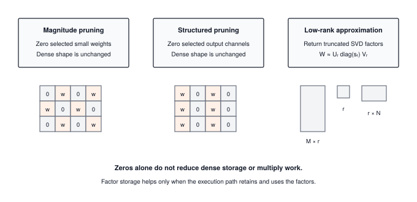
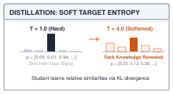
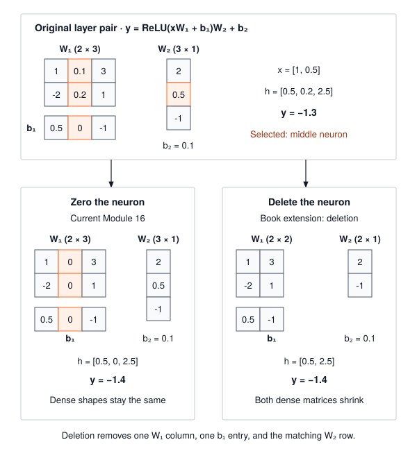

# Model Compression: Pruning, Low-Rank SVD, and Distillation {#sec-compression}

::: {.column-margin}
{width="100%" fig-alt="TinyTorch execution datapath blueprint highlighting Module 16 Compression as the active subsystem."}

*Framework Blueprint: Module 16 transfers teacher dark knowledge to a compact student network via softened probability distributions.*
:::


Quantization shrinks each stored number; compression reduces how many numbers a model keeps or computes with. Pruning zeroes the weights or whole neurons that matter least, low-rank factorization replaces a weight matrix with two thin ones, and knowledge distillation trains a small student to match a large teacher's full output distribution, including the probabilities it assigns to wrong classes.

From a framework and systems standpoint, each technique raises a different question:
1. **Pruning and representation**: Zeroing individual weights by magnitude, or whole neurons by the norm of their weights, and recognizing that a zeroed weight in a dense array saves neither storage nor arithmetic until the representation changes.
2. **Low-rank factorization**: Truncating a singular value decomposition, and computing the rank below which the two factors store and multiply fewer numbers than the matrix they replace.
3. **Distillation loss**: Softening teacher and student logits with a temperature $T > 1$ and combining their Kullback-Leibler (KL) divergence with the ordinary cross-entropy. TinyTorch omits the optional $T^2$ factor, so changing $T$ also changes the gradient scale.

This chapter implements TinyTorch's compression tools and measures what each one changes, since a smaller parameter count is a saving only when storage or execution actually uses fewer numbers.

::: {#fig-compression-spectrum fig-env="figure" fig-pos="htb" fig-cap="**Compression representations**: Both pruning functions preserve dense array dimensions. Low-rank approximation returns three factors; a caller must retain and use them to benefit from their smaller storage." fig-alt="Three panels show scattered zero weights, zeroed output columns, and SVD factors with shapes M by r, r, and r by N."}

:::

---

## The Problem

::: {.column-margin}
**↩ Jump back:** @sec-losses
*Temperature-scaled Kullback-Leibler (KL) divergence transfers dark knowledge from teacher to student.*
:::


Start with weights `[[1, 0.1, 3], [-2, 0.2, 1]]`. Removing the three smallest magnitudes zeros `0.1`, `0.2`, and the first `1`; a stable ranking resolves the tie between the two entries of magnitude one. The matrix remains $2 \times 3$, and `x @ W` still computes three outputs. A small magnitude is a candidate for removal, but its effect also depends on the input and the weights that follow it.

Do that to a $4096 \times 4096$ layer and then look at what the computer sees. The array still has 16.8 million cells. In FP32 it still occupies 67.1 MB, and a packed INT8 representation would still occupy 16.8 MB. A zero takes the same number of bytes as any other value. The forward pass $Y = XW$ still performs $2 \times 4096 \times 4096 \approx 33.5$ million floating-point operations per token (counting a multiply and an addition separately), because the multiply loop does not check for zeros before it multiplies. The dense operation count and allocation are unchanged; elapsed time remains a measurement for @sec-profiling's profiler.

::: {#lst-compression-zero-storage lst-pos="H" lst-cap="**Zeroing leaves dense storage unchanged**: The assertions check the state contract described in the surrounding text."}
```python
import numpy as np

W = np.array([[1.0, 0.1, 3.0], [-2.0, 0.2, 1.0]], dtype=np.float32)
before = W.nbytes
order = np.argsort(np.abs(W).ravel(), kind="stable")
W.flat[order[:3]] = 0
assert np.array_equal(W, [[0, 0, 3], [-2, 0, 1]])
assert W.shape == (2, 3) and W.nbytes == before == 24
```
:::

A sparse format such as compressed sparse row[^fn-csr-sparse-format] stores nonzero values with their positions. At 80 percent sparsity, the large matrix needs about 3.4 million values and as many column indices. With four bytes for each value and index, this is about 26.8 MB, plus the row-position array. The value-only estimate of a $5\times$ reduction becomes roughly $2.5\times$ after indexing. A sparse multiplication must interpret these positions, so its runtime depends on the pattern, batch size, and implementation. TinyTorch's dense NumPy multiplication does not consume such a format. Deleting whole hidden units provides another route: rebuild smaller dense arrays that the existing `Linear` can use.

[^fn-csr-sparse-format]: **Compressed sparse row (CSR)**: a storage format that keeps three arrays, the nonzero values, the column index of each one, and the position where each row starts. It only saves memory once fewer than roughly half the entries are nonzero, because every stored value drags an index along with it.

::: {.column-margin}
**Core Invariant: CSR Index Metadata Breakeven**\
$$\text{Memory}_{\text{CSR}} = \text{NNZ} \times (\text{sizeof}(V) + \text{sizeof}(I)) + (M + 1) \times \text{sizeof}(P)$$\
*Because each nonzero requires an explicit column index, CSR only saves memory when sparsity exceeds $\approx 66\%$.*
:::

{#fig-csr-three-arrays fig-alt="Diagram comparing a dense 3x3 grid with 66% zeros against CSR 3-array representation showing values, col_indices, and row_ptr arrays."}


---

## The Idea

::: {.column-margin}
**↪ Jump ahead:** @sec-capstone
*Integrating distilled student models into the final production optimization pipeline.*
:::


The three weight transformations make different commitments. A mask identifies values to remove, neuron deletion changes neighboring shapes together, and factorization changes the multiplication itself.

### Unstructured pruning: zero the small weights

Magnitude pruning picks a threshold $\theta$ and replaces every weight with

$$W_{\text{sparse}} = W \odot M, \qquad M_{i,j} = \begin{cases} 1 & |W_{i,j}| \ge \theta \\ 0 & |W_{i,j}| < \theta \end{cases}$$

where $\odot$ multiplies element by element and $M$ is the binary mask. A percentile threshold can miss the intended count when magnitudes tie. The module instead ranks entries and selects the requested number, with a stable tie order. On its own it does not change the shape, so the dense allocation and arithmetic count are unchanged. We build it anyway, and the first listing in The Code says what it is good for.

### Structured pruning: delete whole neurons

@sec-layers's `Linear` stores its weight as inputs by outputs and computes $y = xW + b$, so a hidden neuron in a two-layer network is one column of the first weight matrix, one entry of its bias, and one row of the second weight matrix. Delete all three together and the network still computes a valid function, just with one fewer hidden unit. If $W_1$ is $D \times H$ and $W_2$ is $H \times K$, removing neuron $j$ turns them into $D \times (H-1)$ and $(H-1) \times K$. Both matrices are now smaller dense arrays, and the ordinary matrix multiply from @sec-layers runs on them unchanged.

The question is which neurons to delete. The simplest score is the norm of the neuron's incoming weights, the length of column $j$ of $W_1$ measured either as a sum of absolute values (L1) or as the root of a sum of squares (L2); Module 16 uses L2, the deletion function in The Code uses L1, and on the worked trace they agree. For bounded inputs, a column of small weights contributes little to the preactivation, but its bias can still produce a large activation. The score ignores that bias and does not establish that removal is harmless. Ranking columns by that norm and keeping the top fraction is the whole algorithm. It is a crude score, because it ignores how much the next layer relies on that neuron, and the worked trace below shows exactly when it misjudges.

### Low-rank factorization: replace the matrix with two thin ones

For a concrete example, the $3 \times 3$ matrix filled with $4/3$ can be represented by a column $[1,1,1]^T$ times a row $[4/3,4/3,4/3]$. Six stored numbers reproduce nine entries because all columns point in the same direction. Its rank is one, the number of independent column directions. Low-rank factorization seeks a few such directions that reproduce a more general matrix approximately.

Every $M \times N$ matrix can be written as a sum of simple pieces. The **singular value decomposition** says

$$W = U \Sigma V^T = \sum_{i=1}^{\min(M,N)} \sigma_i \, u_i v_i^T$$

where each $u_i$ is a column of $U$ (length $M$), each $v_i$ is a column of $V$ (length $N$), the columns of $U$ are mutually perpendicular unit vectors and so are the columns of $V$, and $\Sigma$ is a diagonal matrix holding the **singular values** $\sigma_1 \ge \sigma_2 \ge \dots \ge 0$. Each term $u_i v_i^T$ is an outer product, a column times a row, which is an $M \times N$ matrix of rank one. The SVD sorts the pieces so the largest come first.

Keeping only the first $r$ terms gives the rank-$r$ approximation

$$
\begin{gathered}
W \approx W_r = \sum_{i=1}^{r} \sigma_i \, u_i v_i^T = W_A W_B, \\
W_A = U_r \sqrt{\Sigma_r} \in \mathbb{R}^{M \times r}, \qquad
W_B = \sqrt{\Sigma_r} V_r^T \in \mathbb{R}^{r \times N}.
\end{gathered}
$$

where $U_r$ holds the first $r$ columns of $U$, $V_r$ the first $r$ columns of $V$, and $\sqrt{\Sigma_r}$ splits each $\sigma_i$ evenly across the two factors. The split is a convention that keeps the two factors at similar scale. For a `Linear` weight stored as inputs by outputs, $M$ is the input width and $N$ the output width, and the layer becomes two linear layers in sequence, one with weight $W_A$ that maps $M$ inputs to $r$, then one with weight $W_B$ that maps $r$ to $N$ outputs.

Two facts make this useful. First, the Eckart-Young theorem (1936) says $W_r$ is the best rank-$r$ approximation there is, and its error is exactly the part you dropped:

$$\|W - W_r\|_F = \sqrt{\sum_{i=r+1}^{\min(M,N)} \sigma_i^2}$$

where $\|\cdot\|_F$ is the Frobenius norm.[^fn-frobenius-svd-error] You can read the error off the singular values before deciding on $r$. Second, the parameter count changes from $M \times N$ to $r \times (M + N)$, and so does the multiply count, because computing $x W_A$ and then multiplying the result by $W_B$ costs $2r(M+N)$ operations instead of $2MN$.[^fn-svd-activation-traffic]

[^fn-frobenius-svd-error]: **Frobenius norm**: the square root of the sum of the squares of every entry, which is the ordinary vector length applied to a matrix as if it were one long vector. For the $3 \times 3$ matrix in the worked trace it is $\sqrt{18} \approx 4.24$, so a reconstruction error of $1.41$ means about a third of the matrix's "length" was dropped.
[^fn-svd-activation-traffic]: **Activation traffic in low-rank factorization**: While factorizing $W \in \mathbb{R}^{M \times N}$ into $W_A \in \mathbb{R}^{M \times r}$ and $W_B \in \mathbb{R}^{r \times N}$ strictly reduces parameter storage and multiply-accumulate FLOPs for $r < \frac{MN}{M+N}$, it introduces an intermediate hidden activation tensor $h = x W_A \in \mathbb{R}^{B \times r}$ for batch size $B$. In unfused execution runtimes, $h$ must be written to DRAM or L2 cache after the first GEMM and reloaded for the second GEMM. If $B$ is large, the memory bandwidth consumed by streaming intermediate activations can offset the weight traffic savings, making operator fusion of $x W_A W_B$ or kernel chaining essential.

{#fig-svd-rank-breakeven fig-alt="Left panel shows singular value scree plot. Right panel shows parameter count scaling with rank r, crossing the original uncompressed line at the breakeven rank."}

### Distillation: teaching the small model from the large one

::: {.column-margin}
{width="100%"}
*Soft target entropy: higher temperature $T=4$ uncovers dark knowledge in non-target class distributions.*
:::

Pruning and factorization both approximate the original computation and can reduce accuracy. The usual repair is to train the smaller model for a while afterward, and one way to guide that training is **knowledge distillation** (Hinton, Vinyals, and Dean, 2015). Instead of training the small *student* only on the true labels, you also train it to match the full output distribution of the large *teacher*.

The loss has two parts. The hard part is the ordinary cross-entropy from @sec-losses between the student's prediction and the true label. The soft part compares the student's and teacher's softmax outputs after both sets of logits are divided by a **temperature** $T > 1$, which flattens the distributions so the small probabilities become visible. The comparison is the Kullback-Leibler divergence, $\sum_k p_k \log (p_k / q_k)$, which is zero when the two distributions agree and grows as they separate. A weight $\alpha$ mixes the two:

$$\mathcal{L} = \alpha \, \mathrm{KL}\!\left(p_{\text{teacher}}^{(T)} \,\|\, p_{\text{student}}^{(T)}\right) + (1 - \alpha)\, \mathrm{CE}\!\left(p_{\text{student}}, y\right)$$

::: {#nbk-compression-distillation-overhead .callout-notebook title="Napkin math: memory overhead of dual-model distillation"}
Knowledge distillation trains a compact student model, but the training run must host two networks simultaneously:

- **Teacher State**: The full-scale teacher model (e.g., 12-layer GPT, 120M parameters) runs in inference mode. While gradients and optimizer moment buffers are omitted, its weights ($120\text{M} \times 4\text{ B} = 480\text{ MB}$) and forward activations must reside in memory.
- **Student State**: The compact student model (e.g., 4-layer GPT, 15M parameters) requires weights ($60\text{ MB}$), autograd activation graphs ($120\text{ MB}$), gradients ($60\text{ MB}$), and AdamW momentum buffers ($120\text{ MB}$).
- **Logit Buffers**: Both teacher and student produce vocab-sized logit arrays $(B, S, V)$. For $B=16, S=1024, V=32000$, each logit tensor spans $16 \times 1024 \times 32000 \times 4\text{ B} \approx 2.1\text{ GB}$.

Dual forward passes and high-dimensional KL divergence evaluations require substantial temporary memory headroom before the compressed student can be deployed standalone.
:::

Module 16 defaults to $T = 3$ and $\alpha = 0.7$. Both terms average over examples after summing over classes, so duplicating a batch leaves the objective unchanged. The soft term here omits the optional temperature-squared multiplier; changing temperature therefore changes both the target distribution and its gradient scale.[^fn-distillation-temperature-squared] The training loop still uses @sec-training's forward, backward, and update sequence, with the teacher held fixed.

[^fn-distillation-temperature-squared]: **The $T^2$ scaling factor in knowledge distillation**: In the high-temperature limit ($T \to \infty$), the Taylor expansion of softened softmax probabilities yields $p_i \approx \frac{1}{K} + \frac{z_i - \bar{z}}{K T}$. Differentiating the KL divergence between teacher and student softened distributions with respect to student logit $z_i$ produces $\frac{\partial \mathcal{L}_{\text{KL}}}{\partial z_i} \approx \frac{1}{K T^2} (z_i - v_i)$, where $v_i$ is the teacher logit. Because the gradient magnitude decays quadratically ($1/T^2$) as logits are flattened, Hinton et al. (2015) multiply the soft loss term by $T^2$ to keep the gradient scale and the balance between hard cross-entropy and soft distillation invariant to temperature adjustments. TinyTorch intentionally omits $T^2$ to preserve code transparency, requiring users to adjust $\alpha$ or learning rate when modifying $T$.

---

## The Code

::: {.column-margin}
{width="100%" fig-alt="Source code mapping card for Module 16 Compression showing file path, exported package, and tested primitives."}

*Source Code Mapping: Module 16 extracts knowledge distillation loss, magnitude pruning, and low-rank approximation directly from the working repository.*
:::

Everything below works on @sec-layers's `Linear` and `Sequential` and @sec-autograd's `Tensor`. `Linear` keeps its weight as an `(in_features, out_features)` array and computes `x @ weight + bias`, and every shape comment follows that layout.

### Measuring and creating unstructured sparsity

Every compression claim starts with a number. A paper reports that a model is 80 percent sparse, a pruning pass has to prove it removed what it was asked to, and the 2:4 recipe in the production bridge begins by asking which two weights in every group of four are smallest. All of that needs one function that counts zeros and one that makes them.

The obvious count divides zeros by all parameters, biases included. @sec-layers's `Linear` initializes its biases to zero, so on a fresh two-layer model with 64 inputs, 128 hidden units, and 10 outputs, that count reports 1.4 percent sparsity, 138 zeros out of 9,610 parameters, before anything has been pruned. That number describes all-parameter sparsity, but it does not measure the weight sparsity this chapter is trying to change. The obvious pruning pass has a subtler flaw. It thresholds each layer on its own, which forces exactly 80 percent out of every layer whether that layer's weights are uniformly tiny or uniformly large.

The module counts weight matrices only and ranks their entries together, so that a layer whose weights are small gives up more of them than a layer whose weights are large.



The `len(param.shape) > 1` test is the whole bias exclusion, and the result is a percentage, not a fraction; on the fresh model above it reports `0.0`. Pruning gathers the same matrices, selects the smallest `int(sparsity * count)` entries globally, and zeros those entries in place.



The stable global sort gives a deterministic rule for ties. `prune_mask` has one position per weight across the model; the loop slices that flat mask back into each parameter's original shape using `offset`. Assigning through `param.data[mask]` changes the existing arrays, and the return value is the same model object. Biases are untouched. Existing zeros participate in the ranking, so a request below the current sparsity does not restore weights. These are the invariants a caller can check without measuring accuracy or speed. The mask is temporary: an ordinary optimizer update can make a zeroed weight nonzero again because this function installs no persistent training mask.

### Structured pruning: deleting neurons across a layer pair

In the two-input, three-hidden-unit pair used below, removing the middle hidden unit means removing column 1 of the first weight and row 1 of the second. Zeroing only the first column and its bias suppresses that unit under ReLU, but the arrays still have their original shapes. This is the distinction between Module 16's pruning operation and the book's deletion extension.

Zeroing their weights is `magnitude_prune` again, with the zeros arranged in whole columns instead of scattered. That is what the module's `structured_prune` does, and it does it on purpose, so that `measure_sparsity` can see its work and so that the next step, the shape change, is a separate decision.



The routine walks nested `Sequential` containers in execution order to collect their `Linear` layers. It then excludes the final linear layer when there is more than one, preserving the classifier head. A standalone or single-layer linear model is the explicit exception and is pruned directly. The separate `compress_model` convenience path validates its configuration before mutation and rejects low-rank replacement because rebuilding layers is not implemented there.

For each selected layer, `np.linalg.norm(weight, axis=0)` reduces over input rows and leaves one L2 score per output column. `int(num_channels * prune_ratio)` sets the removal count, and stable `argsort` picks the lowest scores, including a deterministic order for ties. The assignments zero those columns and the matching bias entries. No outgoing rows are removed. With ReLU next, the zeroed preactivation becomes zero; with a sigmoid it becomes $0.5$, so the same mask would not silence the unit.

The shape change must preserve how the two layers connect. A hidden unit occupies one column of $W_1$, one entry of $b_1$, and one row of $W_2$. The book function below takes both layers, retains the same ordered neuron indices in all three places, and constructs a new pair. On a $4096 \to 16384 \to 4096$ pair, retaining 12,288 hidden units changes the weights to $4096 \times 12288$ and $12288 \times 4096$. Their total weight count drops by 33,554,432, or about 134 MB in float32, without a sparse decoder.

::: {#lst-compression-delete-helper lst-pos="H" lst-cap="**Deleting a neuron across adjacent layers**: Matching survivor indices keep the two new layers connected without sharing parameters with the original pair."}
```python
from tinytorch.core.tensor import Tensor
from tinytorch.core.layers import Linear, Sequential

def prune_neurons(first: Linear, second: Linear, keep: int):
    """Delete hidden neurons between two Linear layers; return the new pair. Not in Module 16."""
    if first.out_features != second.in_features:
        raise ValueError("Hidden dimensions must match")
    if not isinstance(keep, (int, np.integer)) or not 1 <= keep <= first.out_features:
        raise ValueError("keep must be an integer within the hidden width")
    w1, w2 = first.weight.data, second.weight.data     # [D, H] and [H, K]
    scores = np.sum(np.abs(w1), axis=0)                # L1 norm of each column
    survivors = np.sort(np.argsort(scores, kind="stable")[-keep:])    # top-`keep`, in order

    new_first = Linear(first.in_features, keep, bias=first.bias is not None)
    new_first.weight = Tensor(w1[:, survivors].copy(), requires_grad=True)
    if first.bias is not None:
        new_first.bias = Tensor(first.bias.data[survivors].copy(), requires_grad=True)
    new_second = Linear(keep, second.out_features, bias=second.bias is not None)
    new_second.weight = Tensor(w2[survivors, :].copy(), requires_grad=True)
    if second.bias is not None:
        new_second.bias = Tensor(second.bias.data.copy(), requires_grad=True)
    return new_first, new_second
```
:::

`np.sort` on the survivor indices keeps the neurons in their original order. Advanced indexing and the Tensor constructor create new storage; copying the output bias as well ensures that training the returned pair cannot mutate the original pair. The module scores by L2 and this function by L1, and both select the same middle neuron in the worked trace. Construct a new optimizer for the returned parameters before recovery training, since an existing optimizer still holds the original objects.

### Low-rank factorization

Column scores can miss redundancy between columns. The all-$4/3$ matrix introduced earlier has no zero column, yet one direction describes it exactly. The same possibility motivates examining the singular values of a larger trained projection. The reconstruction error determines which directions can be discarded, while storage arithmetic determines whether the retained factors are smaller than the original matrix.

::: {#nbk-compression-svd-breakeven-rank .callout-notebook title="Napkin math: the break-even rank"}
Factorizing $W \in \mathbb{R}^{M \times N}$ into $W_A \in \mathbb{R}^{M \times r}$ and $W_B \in \mathbb{R}^{r \times N}$ saves parameters only when

$$r \times (M + N) < M \times N \quad\Longleftrightarrow\quad r < \frac{MN}{M+N}.$$

For a square $4096 \times 4096$ layer the break-even rank is $4096^2 / 8192 = 2048$, half the full rank. At $r = 256$ the count drops from $16{,}777{,}216$ to $256 \times 8192 = 2{,}097{,}152$, an $8\times$ reduction in weight entries and matrix-multiplication arithmetic. These counts describe the two folded factors, excluding the unchanged bias and the new intermediate activation. Whether the accuracy survives depends on how fast the singular values of that particular layer decay, which is a property of the trained weights, not of the method.
:::

The naive way to choose $r$ is trial. Pick a rank, factorize, retrain, measure, and repeat, with a training run per guess. Eckart-Young removes the guessing from the reconstruction side. One SVD returns every singular value, and the error at every $r$ reads off the tail of that list before a single factor is built. Whether the accuracy survives is still a question for fine-tuning, but you go into it knowing how much of the matrix you dropped.

The module's function does the SVD and the truncation and stops there.



The function validates `rank_ratio` in $(0,1]$ and computes `max(1, int(rank_ratio * min(M, N)))`. This fraction refers to the maximum possible rank, not the matrix's measured numerical rank. A ratio of $0.5$ on a $3 \times 3$ matrix therefore keeps one term. NumPy returns singular values in descending order and its third result is already $V^T$, so the function selects columns of $U$, entries of `S`, and rows of $V^T$. Each slice is copied. A view would keep the full SVD backing array alive and defeat the storage reduction.


The returned arrays have shapes $(M,r)$, $(r,)$, and $(r,N)$ and own $r(M+N+1)$ values. This three-factor representation saves storage when $r < MN/(M+N+1)$. It does not modify the input matrix or any layer. The book extension below folds the singular values into two factors, reducing that count to $r(M+N)$, and places the original bias after the second multiplication. Reconstructing the full matrix first would lose the storage benefit.

::: {#lst-compression-factor-helper lst-pos="H" lst-cap="**Building a forward path from SVD factors**: Two new linear layers consume the folded factors and preserve the output bias."}
```python
from tinytorch.perf.compression import low_rank_approximate

def factorize_linear(layer: Linear, rank_ratio: float):
    """Replace one Linear(N -> M) with Linear(N -> r) then Linear(r -> M). Not in Module 16."""
    U, S, Vt = low_rank_approximate(layer.weight.data, rank_ratio)   # weight is [N, M]
    root = np.sqrt(S)
    inner = Linear(layer.in_features, len(S), bias=False)
    inner.weight = Tensor(U * root, requires_grad=True)             # [N, r], column i scaled by sqrt(sigma_i)
    outer = Linear(len(S), layer.out_features, bias=layer.bias is not None)
    outer.weight = Tensor(root[:, None] * Vt, requires_grad=True)   # [r, M], row i scaled by sqrt(sigma_i)
    if layer.bias is not None:
        outer.bias = Tensor(layer.bias.data.copy(), requires_grad=True)
    return Sequential(inner, outer)
```
:::

Because @sec-layers's weight is inputs by outputs, `inner` maps the input width to $r$ and `outer` maps $r$ to the output width. At `rank_ratio=1.0`, the pair reproduces the original output up to floating-point error; at lower ranks, the omitted singular directions can change it. Both weights and the copied output bias belong to the returned model. The original layer remains available for comparison, and the caller must replace it explicitly in the enclosing model.

### The distillation loss

Each approximation above can alter the model's predictions. The pruned pair in the worked trace moves its output by $0.1$ on a single input; a $4096 \times 4096$ layer cut to rank 256 loses whatever sits in singular values 257 through 4096. Recovery training can reduce that error, and the question is what objective to train on.

Fine-tuning the small model on the labels alone hands it one number per example, the index of the correct class. The large model knows more than that. Show it a picture and its logits might be $[6, 2, 0]$ for cat, dog, and car, which softmax turns into $0.98$, $0.018$, and $0.002$. The ranking of the wrong answers, dog far ahead of car, is information the label throws away, and at $T = 1$ it is nearly invisible anyway. Divide the logits by $T = 3$ first and the same three become $0.715$, $0.188$, and $0.097$, a distribution a student can actually be trained to match.

The loss has a soft term and a hard term. The soft term is the KL divergence from the teacher's tempered softmax to the student's, the hard term is @sec-losses's cross-entropy, and $\alpha$ mixes them. The module packages the two models and the two constants in a class whose only real method is the loss.



Follow `distillation_loss` from its arguments to its return value. The two logit tensors must have matching `(batch, classes)` shapes. A label vector may arrive as a NumPy integer array or as a `Tensor`, whose storage converts even class IDs to float32. The method checks that each ID is finite, integral, and in range before converting it to an indexing dtype. A matrix of target probabilities takes the other branch, which checks nonnegative entries and a unit row sum. These checks distinguish a malformed target from a model that merely predicts the wrong class.

The next lines establish which model learns. `log_softmax(student_logits / self.temperature)` uses the operations from @sec-losses and @sec-autograd and retains a path back to the student. `Tensor(teacher_logits.data)` constructs a new leaf without gradient tracking, so the teacher distribution becomes a constant even if its forward pass recorded a graph. Multiplying that constant distribution by `teacher_log_probs - student_log_probs` implements KL in the teacher-to-student direction. The class sum produces one loss per example; the final mean produces one scalar for the batch. The hard term follows the same reduction convention at temperature one. Taking `.data` from the student at this point would leave the numerical loss looking reasonable while disconnecting the computation that trains it.

The method returns a scalar `Tensor`, ready for `backward()`. Its stable `log_softmax` path does not use the NumPy `_kl_divergence` and `_cross_entropy` helpers beneath it; those helpers support the module's analysis table. With identical teacher and student logits, the soft term is zero and only the hard term remains. Duplicating every example leaves both terms unchanged. The trace below checks the gradient, teacher immutability, and batch-duplication invariant in a training step.

---

## A Worked Trace

### Following one distillation update

Use one input, two output classes, and explicitly chosen weights so that the trace has no random initialization hidden in it. In @lst-compression-student-update, lines 7--10 construct `teacher` and `student` linear layers with weights `[[2.0, 0.0]]` and `[[0.0, 0.0]]`. Constructing the optimizer in line 11 before the forward pass enables gradient tracking on the student's parameters. Line 12 initializes `KnowledgeDistillation(teacher, student, temperature=2.0, alpha=0.5)`. In lines 13--15, input `x` evaluates `teacher_logits` while `teacher_before` takes a reference copy.

Lines 17--19 evaluate the combined distillation loss. In line 20, `loss.backward()` executes backpropagation. Lines 21--23 confirm that `student.weight.grad` receives the analytical gradient `[[-0.307765, 0.307765]]` while `teacher.weight.grad` remains `None` (the teacher is not trained). In line 24, `optimizer.step()` updates the student; lines 25--27 verify that student loss decreased while teacher parameters remained strictly frozen. Lines 29--31 confirm that duplicating the input maintains consistent sample-mean loss.

::: {#lst-compression-student-update lst-pos="H" lst-cap="**A distillation update with fixed teacher state**: The assertions check the state contract described in the surrounding text."}
```python
import numpy as np
from tinytorch.core.tensor import Tensor
from tinytorch.core.layers import Linear
from tinytorch.core.optimizers import SGD
from tinytorch.perf.compression import KnowledgeDistillation

teacher = Linear(1, 2, bias=False)
student = Linear(1, 2, bias=False)
teacher.weight.data[:] = [[2.0, 0.0]]
student.weight.data[:] = [[0.0, 0.0]]
optimizer = SGD(student.parameters(), lr=0.1)
kd = KnowledgeDistillation(teacher, student, temperature=2.0, alpha=0.5)
x, labels = Tensor([[1.0]]), Tensor([0])
teacher_logits = teacher(x)
teacher_before = teacher.weight.data.copy()

optimizer.zero_grad()
loss = kd.distillation_loss(student(x), teacher_logits, labels)
before = float(loss.data)
loss.backward()
print(np.round(student.weight.grad, 6))  # [[-0.307765  0.307765]]
assert np.allclose(student.weight.grad, [[-0.307765, 0.307765]], atol=1e-6)
assert teacher.weight.grad is None
optimizer.step()
after = kd.distillation_loss(student(x), teacher_logits, labels)
assert float(after.data) < before
assert np.array_equal(teacher.weight.data, teacher_before)

pair = Tensor([[1.0], [1.0]])
duplicated = kd.distillation_loss(student(pair), teacher(pair), Tensor([0, 0]))
assert np.isclose(duplicated.data, after.data)
```
:::

The teacher's softened probability for class zero is approximately `0.731059`; the student's is `0.5`. The soft contribution to the first logit's gradient is `0.5 * (0.5 - 0.731059) / 2`, and the hard contribution is `0.5 * (0.5 - 1)`. Their sum is `-0.307765`, the value printed by `backward()` in line 21. Subtracting that gradient raises the first student weight and lowers the second, while the teacher stays unchanged. The division by temperature comes from differentiating the softened logits; the batch mean would supply another division for a larger batch. No temperature-squared multiplier cancels either effect in this implementation.

### Deleting one neuron

Take a two-layer network with two inputs, three hidden neurons, and one output, with ReLU between the layers. In @sec-layers's layout the first weight is $2 \times 3$ with one column per hidden neuron, and the second is $3 \times 1$ with one row per hidden neuron:

$$W_1 = \begin{bmatrix} 1.0 & 0.1 & 3.0 \\ -2.0 & 0.2 & 1.0 \end{bmatrix}, \quad b_1 = \begin{bmatrix} 0.5 & 0.0 & -1.0 \end{bmatrix}, \quad W_2 = \begin{bmatrix} 2.0 \\ 0.5 \\ -1.0 \end{bmatrix}, \quad b_2 = 0.1$$

The L1 column norms of $W_1$ are $3.0$, $0.3$, and $4.0$, and the L2 norms are $2.24$, $0.22$, and $3.16$; by either score the middle neuron loses. For the input $x = [1.0, 0.5]$, the hidden activations before pruning are $h = \mathrm{ReLU}(xW_1 + b_1) = \mathrm{ReLU}([0.5, 0.2, 2.5]) = [0.5, 0.2, 2.5]$ and the output is $y = 2.0(0.5) + 0.5(0.2) - 1.0(2.5) + 0.1 = -1.3$. After pruning, $h' = [0.5, 2.5]$ and $y' = 1.0 - 2.5 + 0.1 = -1.4$. The layers shrank from $2 \times 3$ and $3 \times 1$ to $2 \times 2$ and $2 \times 1$, and the output moved by $0.1$.

That $0.1$ is the deleted neuron's activation ($0.2$) times its outgoing weight ($0.5$). Had the outgoing weight been $4.0$ instead, the same deletion would have moved the output by $0.8$ while the column score stayed at $0.3$. The incoming-weight score is blind to what the next layer does with the neuron, which is why production pruning methods score with gradients or with the effect on the loss rather than with weight magnitude alone.

Both functions agree with the hand arithmetic, and running them side by side shows exactly what separates them. `prune_neurons` returns a narrower pair; `structured_prune` zeros the same neuron in place and leaves the shapes alone. The zeroed neuron has a zero bias and a zero column, so its activation is $\mathrm{ReLU}(0) = 0$ and it contributes nothing, which is why the two outputs match.

@Fig-compression-neuron-removal follows the same hidden unit through both weight matrices. The numerical output alone cannot distinguish the zeroed model from the physically smaller one.

::: {#fig-compression-neuron-removal fig-env="figure" fig-pos="H" fig-cap="**Zeroing versus deleting a hidden neuron**: Both changes move the output from −1.3 to −1.4 for the same input. Module 16 preserves dense shapes; the book extension deletes the matching first-layer column, bias entry, and second-layer row." fig-alt="An original layer pair appears above zeroed and deleted variants. The middle first-layer column, its bias, and the middle second-layer row are highlighted. Each panel labels matrix shapes, hidden activations, and output."}

:::

::: {#lst-compression-neuron-trace lst-pos="H" lst-cap="**Comparing zeroing with physical deletion**: The assertions check the state contract described in the surrounding text."}
```python
import numpy as np
from tinytorch.core.tensor import Tensor
from tinytorch.core.layers import Linear, Sequential
from tinytorch.core.activations import ReLU
from tinytorch.perf.compression import structured_prune

first, second = Linear(2, 3), Linear(3, 1)
first.weight.data[:] = [[1.0, 0.1, 3.0], [-2.0, 0.2, 1.0]]
first.bias.data[:] = [0.5, 0.0, -1.0]
second.weight.data[:] = [[2.0], [0.5], [-1.0]]
second.bias.data[:] = [0.1]
x = Tensor(np.array([[1.0, 0.5]], dtype=np.float32))
net = Sequential(first, ReLU(), second)
print(net.forward(x).data)                                     # [[-1.3]]
assert np.allclose(net(x).data, [[-1.3]])

small_first, small_second = prune_neurons(first, second, keep=2)
small = Sequential(small_first, ReLU(), small_second)
print(small.forward(x).data, small_first.weight.data.shape)    # [[-1.4]] (2, 2)
assert np.allclose(small(x).data, [[-1.4]])

structured_prune(net, prune_ratio=1 / 3)
print(first.weight.data)                                       # middle column zeroed
print(net.forward(x).data, first.weight.data.shape)            # [[-1.4]] (2, 3)
assert np.allclose(net(x).data, small(x).data)
```
:::

### Rank-1 approximation of a $3 \times 3$ matrix

Consider the matrix

$$W = \begin{bmatrix} 2 & 1 & 1 \\ 1 & 2 & 1 \\ 1 & 1 & 2 \end{bmatrix}$$

Its singular values are $\sigma_1 = 4$, $\sigma_2 = 1$, $\sigma_3 = 1$. You can check the first one by hand. $W$ times the vector $[1, 1, 1]$ gives $[4, 4, 4]$, so $u_1 = v_1 = [1,1,1]/\sqrt{3}$ with $\sigma_1 = 4$. Keeping only that term,

$$W_1 = \sigma_1 u_1 v_1^T = \frac{4}{3}\begin{bmatrix} 1 & 1 & 1 \\ 1 & 1 & 1 \\ 1 & 1 & 1 \end{bmatrix}, \qquad W - W_1 = \frac{1}{3}\begin{bmatrix} 2 & -1 & -1 \\ -1 & 2 & -1 \\ -1 & -1 & 2 \end{bmatrix}$$

The Frobenius norm of the residual is $\sqrt{3 \cdot (2/3)^2 + 6 \cdot (1/3)^2} = \sqrt{2} \approx 1.41$, and Eckart-Young predicts $\sqrt{\sigma_2^2 + \sigma_3^2} = \sqrt{2}$. The two factors are $W_A = \sqrt{4} \, u_1 \approx [1.155, 1.155, 1.155]^T$ and $W_B = \sqrt{4} \, v_1^T$, the same three numbers as a row. An SVD routine may flip the signs of both $u_1$ and $v_1$; their outer product remains unchanged, so the test must compare the reconstructed matrix rather than assume a sign. Each of the three ranks tells a different story about storage, summarized in @tbl-svd-trace.

| Rank $r$ | Stored values | Returned shapes | Frobenius error | Size vs. original |
| :--- | :---: | :--- | :---: | :---: |
| 3 | 21 | $(3,3), (3,), (3,3)$ | $0$ | $2.33\times$ |
| 2 | 14 | $(3,2), (2,), (2,3)$ | $1$ | $1.56\times$ |
| 1 | 7 | $(3,1), (1,), (1,3)$ | $\sqrt{2}$ | $0.78\times$ |

: **Storage of the returned SVD factors**: Module 16 retains the singular values separately. The original matrix stores nine values; only rank one saves storage in this example. {#tbl-svd-trace tbl-colwidths="[12,18,32,18,20]"}

Rank 2 is larger than the original matrix, as predicted by the three-factor bound $r < 9/7$. Folding `S` into two factors saves another $r$ entries, giving six entries at rank one and twelve at rank two. Keeping the dense original is cheaper than either full-rank representation. Reconstruction error and storage are separate criteria even on this small example.

The following check measures both the reconstruction and the storage returned by the module. The rank ratio is $r / 3$ because the matrix has full rank 3. The error assertion checks the Eckart-Young prediction; the remaining assertions check factor size and ownership.

::: {#lst-compression-svd-trace lst-pos="H" lst-cap="**Checking SVD error and owned storage**: The assertions check the state contract described in the surrounding text."}
```python
from tinytorch.perf.compression import low_rank_approximate

W = np.array([[2.0, 1.0, 1.0],
              [1.0, 2.0, 1.0],
              [1.0, 1.0, 2.0]])
all_sigma = np.linalg.svd(W, compute_uv=False)
print("singular values:", np.round(all_sigma, 3))          # [4. 1. 1.]

for r in (1, 2, 3):
    U, S, Vt = low_rank_approximate(W, r / 3)
    W_r = (U * S) @ Vt
    error = np.linalg.norm(W - W_r)
    predicted = np.sqrt(np.sum(all_sigma[r:] ** 2))
    print(f"rank {r}: kept {np.round(S, 3)}, error {error:.3f}, Eckart-Young predicts {predicted:.3f}")
    assert np.isclose(error, predicted)
    assert U.size + S.size + Vt.size == 7 * r
    assert all(f.flags.owndata for f in (U, S, Vt))
```
:::

Rank 1 gives error $1.414$, rank 2 gives $1.000$, and rank 3 reconstructs the matrix within floating-point tolerance. The ownership assertion checks a separate invariant: small shapes really correspond to small independent factor buffers, rather than views keeping the full SVD allocation alive.

---

## From TinyTorch to Production

The reference pruning functions make one in-place edit. PyTorch's pruning utility instead maintains a mask during subsequent forward passes. Its [pruning tutorial](https://docs.pytorch.org/tutorials/intermediate/pruning_tutorial) describes `weight_orig`, a `weight_mask` buffer, and a forward hook that multiplies them. Removing this reparameterization with `prune.remove` leaves the current masked values in the dense parameter. The distinction matters during recovery training: the active mask can continue suppressing selected connections, whereas TinyTorch's one-time zero assignment allows them to regrow. Neither operation by itself rebuilds narrower matrices.

A sparse execution path can exploit zeros without changing the logical matrix dimensions. For example, PyTorch documents [semi-structured sparse tensors](https://docs.pytorch.org/docs/stable/sparse.html#sparse-semi-structured-tensors) with a restricted pattern, a packed value representation, and metadata identifying retained positions. A 2:4 pattern retains two values in each group of four. Metadata adds storage beyond those values, and supported devices, dtypes, shapes, and operations constrain its use. The relevant comparison is therefore a specific packed representation and its supported multiplication, not a dense matrix that happens to contain zeros. Module 16 implements neither this format nor its kernel.

Low-rank adaptation uses the same thin-matrix arithmetic for a different purpose. [LoRA, by Hu et al.](https://arxiv.org/abs/2106.09685), freezes pretrained weights and trains a low-rank update. In this chapter's inputs-by-outputs layout, the adapted weight is $W + AB$, with $A$ shaped $(M,r)$ and $B$ shaped $(r,N)$, apart from a scaling constant. The update adds $r(M+N)$ trainable values while retaining the $MN$ values of the base. In contrast, `factorize_linear` replaces the base matrix. A small adapter therefore does not imply a smaller base-model allocation. TinyTorch's SVD routine computes an approximation of existing weights; it does not implement LoRA training.

The teacher-student objective transfers directly. [Hinton, Vinyals, and Dean](https://arxiv.org/abs/1503.02531) use softened teacher predictions to guide a student and compensate for the temperature dependence of soft-target gradients with a $T^2$ factor. TinyTorch deliberately leaves that multiplier out. In the local trace, increasing temperature therefore changes both the probabilities and the strength of their contribution relative to the hard labels. A production objective must specify its reductions and scaling just as explicitly; matching the name “distillation” is not enough to establish that two training runs use the same loss.

::: {#psp-compression-structured-vs-unstructured .callout-production title="Production bridge: 2:4 structured sparsity and hardware accelerators"}
Unstructured pruning zeros arbitrary weights but produces random sparsity patterns that standard GEMM hardware cannot accelerate without expensive CSR indexing overhead. Modern production deployments navigate this through hardware-aligned sparsity:

1. **NVIDIA 2:4 Structured Sparsity**: Starting with Ampere (A100) and Hopper (H100), Tensor Cores support native 2:4 structured sparsity. For every block of four consecutive values along a matrix row, exactly two must be zero. The hardware stores only the two nonzero values alongside 2-bit indices per pair, cutting memory storage in half and doubling GEMM arithmetic throughput with minimal accuracy loss.
2. **Channel and Block Pruning**: Serving frameworks (e.g., TensorRT, ONNX Runtime) favor structured pruning, removing entire attention heads, MLP intermediate channels, or transformer blocks. Because shrinking channel dimensions preserves contiguous memory strides and standard BLAS kernels, structured pruning yields guaranteed wall-clock latency reductions without requiring specialized sparse execution engines.
:::

@Tbl-compression-production separates the allocation changes from the execution path they require. A proposed optimization needs both a representation that saves work or storage and a computation that consumes that representation. Prediction error and latency remain measurements on the target workload.

| Method | Stored state | Execution requirement |
| :--- | :--- | :--- |
| TinyTorch pruning | Original dense arrays, with zeros | Existing dense multiplication; no sparse work skipped |
| Packed sparsity | Retained values plus position metadata | A compatible sparse multiplication |
| Neuron deletion | Smaller adjacent weight matrices | Dense multiplication with reduced hidden width |
| Folded SVD factors | Two weights totaling $r(M+N)$ values | Two successive dense multiplications |
| LoRA update | Base $W$ plus $r(M+N)$ update values | Base computation plus update, or a merged dense weight |

: **Representation and execution**: Pruning, factorization, and adaptation change different parts of the state. Smaller stored factors do not establish a latency improvement by themselves. {#tbl-compression-production tbl-colwidths="[22,36,42]"}

---

## Summary

The compression call chain starts by deciding what state changes. `magnitude_prune` ranks weights globally and zeros selected entries in the existing arrays. `structured_prune` selects output columns, including their biases, while preserving the terminal head of a multilayer model. Both retain dense dimensions. The book's `prune_neurons` extension makes the separate shape change across adjacent layers, and its new parameters require a new optimizer.

`low_rank_approximate` returns three independently owned arrays and leaves the input untouched. Their singular values predict matrix reconstruction error, while their sizes determine storage savings. `factorize_linear` folds those values into two new layers so that the forward pass uses the factors. Distillation then provides a scalar loss whose gradient reaches the student and stops at the teacher; accuracy recovery must still be evaluated.

The invariant to carry into @sec-acceleration is that an optimization claim must name the representation, its consumer, and the comparison being measured. Reducing weights addresses only part of a forward pass. @sec-acceleration examines the intermediate activations between operations and whether changing their computation order or lifetime can reduce work without altering the intended result.

---

## Further reading

- Han, Pool, Tran, and Dally (2015), [Learning both weights and connections for efficient neural networks](https://arxiv.org/abs/1506.02626), *NeurIPS*. Magnitude pruning followed by retraining.
- Li et al. (2017), [Pruning filters for efficient ConvNets](https://arxiv.org/abs/1608.08710), *ICLR*. Structured pruning by the norm of each filter's weights, which removes work that zeroed individual weights do not.
- Denton et al. (2014), [Exploiting linear structure within convolutional networks for efficient evaluation](https://arxiv.org/abs/1404.0736), *NeurIPS*. Low-rank approximation of trained layers.
- Hinton, Vinyals, and Dean (2015), [Distilling the knowledge in a neural network](https://arxiv.org/abs/1503.02531), *arXiv*. Temperature-softened targets and the $T^2$ factor this chapter's loss omits.

## Exercises

1. A transformer feed-forward layer maps 4096 inputs to 11008 outputs. Compute its break-even rank both for the three arrays returned by `low_rank_approximate` and for the two folded factors, then check whether $r = 1024$ saves parameters and by how much. Repeat for the $4096 \times 4096$ attention projection and explain why the two answers differ.

2. Extend `prune_neurons` to a `Sequential` of three `Linear` layers with ReLU between them, pruning both hidden widths. Build a random model, run an input through it, prune with `keep` equal to the full width (so nothing is deleted), and confirm the output is unchanged. Then prune to half width and report how far the output moves.

3. Take a matrix that is exactly rank 2 plus a little noise, for example `np.outer(a, b) + np.outer(c, d) + 0.01 * np.random.randn(8, 8)`. Print its singular values, truncate it with `low_rank_approximate` at rank ratios of $1/8$, $2/8$, and $3/8$, and compare the measured Frobenius error with the Eckart-Young prediction at each rank. Where does the curve flatten, and what does that tell you about the right $r$?

4. Wrap the first hidden layer of the neuron trace in a nested `Sequential`. Predict which layer `structured_prune` selects and verify that the final head is unchanged. Then replace ReLU with sigmoid and explain why zeroing an incoming column no longer gives a zero hidden activation.

5. In the distillation trace, predict the student gradient for `alpha=0` and `alpha=1`. Check both with `backward()`. Double the temperature at `alpha=1`, compare the gradient, and explain why changing temperature does more than alter the teacher's probability distribution.
