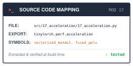
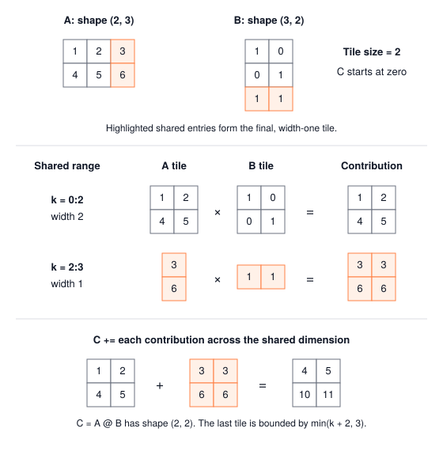

# Acceleration: Kernel Fusion and Cache Tiling {#sec-acceleration}

::: {.column-margin}
{width="100%" fig-alt="TinyTorch execution datapath blueprint highlighting Module 17 Acceleration as the active subsystem."}

*Framework Blueprint: Module 17 eliminates round-trip memory traffic to DRAM by fusing adjacent operators into single-pass kernel loops.*
:::


Elementwise operations such as addition, scaling, and activation functions do little arithmetic per value. In an eager runtime that executes one operation at a time, each operation writes a full intermediate array that the next one reads back, so a chain of them can spend more time moving arrays through memory than computing on them.

In modern PyTorch, compiler backends (like `torch.compile`) automate hardware acceleration by fusing operators into a single compiled kernel:

```python
import torch

# Eager execution: 2 separate kernel launches, 1 intermediate DRAM buffer
def eager_op(x, bias):
    return torch.relu(x + bias)

# Compiled execution: Inductor fuses add + relu into a single pass
compiled_op = torch.compile(eager_op)

x = torch.randn(2048, 2048)
bias = torch.randn(2048)
out = compiled_op(x, bias)
```

Underneath that simple compilation decorator, the runtime executes two fundamental hardware optimizations:
1. **Operator fusion:** In eager execution, `x + bias` writes an entire 16 MB float32 tensor to DRAM, only for `relu` to immediately read those bytes back. Fusing the two operations keeps values in processor registers, eliminating the round-trip memory traffic entirely.
2. **Cache tiling for data reuse:** For matrix multiplication, partitioning large matrices into small blocks ($64 \times 64$) that fit within high-speed L1/L2 cache prevents cache lines from being prematurely evicted to main memory.
3. **Stride-conscious memory access:** Aligning iteration loops with contiguous row-major memory strides prevents the catastrophic cache thrashing caused by strided column-major traversals.

This chapter writes a GELU expressed with fewer temporary Tensors and a tiled matrix multiply in NumPy, then times both. Before building these accelerated patterns, we must inspect the latency penalty that unfused memory traffic and unaligned strides impose on hardware.

::: {#fig-kernel-fusion fig-env="figure" fig-pos="htb" fig-cap="**Three NumPy execution paths**: Vectorized multiplication delegates to a library, the GELU helpers retain different intermediate arrays, and tiled multiplication explicitly accumulates block products. Every comparison checks values before measuring time." fig-alt="Three boxes labeled vectorized matmul, GELU expressions, and tiled matmul point to a shared output-check and measurement box."}
{width="100%"}
:::

---

## The Problem

::: {.column-margin}
**↩ Jump back:** @sec-activations
*Fusing elementwise GELU arithmetic into linear layer buffers eliminates intermediate DRAM traffic.*
:::


Data order provides a second concrete example. A two-row array `[[1, 2, 3], [4, 5, 6]]` stores its rows consecutively in ordinary C order. Walking a row visits adjacent floats; walking a column advances three floats between entries. Both traversals sum to 21. @Lst-acceleration-stride-timing enlarges this pattern so that access order can affect timing.

::: {#lst-acceleration-stride-timing lst-cap="**Access-order experiment**: The same array is traversed by rows and columns."}
```python
import numpy as np
import time

rng = np.random.default_rng(17)
A = rng.standard_normal((2048, 2048)).astype(np.float32)  # about 17 MB

def sum_by_rows(A):
    total = 0.0
    for i in range(A.shape[0]):
        total += A[i, :].sum()      # adjacent values
    return total

def sum_by_cols(A):
    total = 0.0
    for j in range(A.shape[1]):
        total += A[:, j].sum()      # values separated by a row stride
    return total

reference = A.sum(dtype=np.float64)
for f in (sum_by_rows, sum_by_cols):
    np.testing.assert_allclose(f(A), reference, rtol=1e-5, atol=1e-2)
    f(A)                             # warm up once
    t0 = time.perf_counter()
    f(A)
    print(f"{f.__name__}: {(time.perf_counter() - t0) * 1e3:.0f} ms")
```
:::

The script reports timings for the machine running it; neither traversal has a fixed speedup. Their mathematical sums agree, but changing the reduction order can change the last few floating-point digits. The check compares both answers with `A.sum(dtype=np.float64)` before timing. Its tolerance suits this seeded example; other input magnitudes and sizes may need a different bound.

A cache stores recently accessed data near the processor. Main memory transfers chunks called cache lines, so adjacent floats can share one transfer. For example, a hypothetical 64-byte line holds sixteen float32 values. A row walk can use all sixteen; a column walk may use only one before moving to another line. Whether a later access reuses that line depends on the array size and cache behavior. The stride explains a possible cost; it does not measure transferred bytes.

Now look at what a framework does when you write a GELU. @sec-activations introduced the tanh form,

$$\text{GELU}(x) \approx 0.5\,x\left(1 + \tanh\!\left(\sqrt{2/\pi}\,\left(x + 0.044715\,x^3\right)\right)\right),$$

and `unfused_gelu` evaluates it as eight steps: cube, scale, add, scale, tanh, add one, multiply by $x$, and halve. Each step computes a NumPy array and copies it into a `Tensor`. The seven named intermediates stay alive until return. At three inputs this is easy to inspect; at millions of inputs, retaining those full arrays becomes a substantial allocation cost.

Matrix multiplication presents a different opportunity. Each input element contributes to several outputs. For $C=AB$, a row of $A$ is needed for every output column, and a column of $B$ for every output row. Grouping nearby output calculations can make those reuses occur close together in time. We need to track both the accumulation into $C$ and which input blocks each step reads.

---

## The Idea

::: {.column-margin}
**↪ Jump ahead:** @sec-extensions
*The same tiling and fusion compiled to C++ and Triton, then measured against NumPy.*
:::


### One boundary, counted in crossings

Consider a tile product that repeatedly uses the same small blocks. Keeping those blocks in a cache can avoid fetching them from main memory for every arithmetic operation. Registers hold individual working values; caches hold recently accessed chunks; main memory holds the larger arrays. @Tbl-memory-hierarchy describes their roles without assuming a particular processor.

| Level | What it holds | Role in this chapter |
| :--- | :--- | :--- |
| Registers | Values currently used by instructions | Possible home for compiled scalar intermediates |
| Caches | Recently accessed memory chunks | Possible reuse of matrix blocks |
| Main memory | Arrays and other program data | Backing storage for NumPy allocations |

: The memory levels relevant to allocation and reuse. NumPy code chooses arrays and operations; hardware manages which cache lines remain resident. {#tbl-memory-hierarchy tbl-colwidths="[20,35,45]"}

Our model counts requested data separately from measured time. A logical read of an array is an operation's need for its values; it may be served from a cache. An allocated array occupies storage, but allocation alone does not tell us how many bytes crossed a hardware boundary. @sec-profiling's arithmetic intensity divides floating-point work by a stated byte count. Here every such count needs its assumptions attached.

### Intermediate arrays and their lifetime

::: {.column-margin}
{width="100%"}
*Kernel fusion memory ledger: 8 unfused DRAM round-trips ($360\text{ B}$) collapse into 1 streaming fused pass ($40\text{ B}$).*
:::

At $x=1$, the first three GELU steps produce $1$, $0.044715$, and $1.044715$. In `unfused_gelu`, each value occupies the corresponding position in a different array. Naming `temp1`, `temp2`, and `temp3` keeps their `Tensor` objects reachable even after the next step has consumed their values. `Tensor` construction copies the incoming NumPy array, so these are separate owned buffers.

The compact expression avoids retaining seven named `Tensor` copies. It still asks NumPy to compute powers, products, sums, and a hyperbolic tangent on arrays. Python evaluating one expression does not make those array operations into one loop. This distinction lets us study allocation lifetime now and reserve the compiled single-pass alternative for the production bridge.

{#fig-kernel-fusion-traffic width="100%" fig-alt="Diagram comparing DRAM round-trips for unfused multi-pass execution with single-trip register-cached fused kernel execution."}

### Tiling: reuse before eviction

A matrix multiply has the opposite structure. Every output element needs a whole row of $A$ and a whole column of $B$, so the data cannot be consumed in one streaming pass. It can, however, be reused. $C_{ij} = \sum_k A_{ik} B_{kj}$ uses $A_{ik}$ in the computation of every $C_{ij}$ for all $N$ values of $j$, and $B_{kj}$ in every $C_{ij}$ for all $M$ values of $i$. The question is whether those reuses happen while the value is still in fast memory or after it has been evicted and must be fetched again.

Tiling answers by changing the loop order. Instead of computing $C$ one element at a time, compute it one $T \times T$ block at a time. To produce block $(I, J)$ of $C$, walk along $k$ in steps of $T$: fetch the $T \times T$ block of $A$ at $(I, K)$ and the $T \times T$ block of $B$ at $(K, J)$, multiply them, and add the product into the block of $C$. While those two input blocks sit in fast memory, every one of their $T^2$ elements is used $T$ times.

For a simplified input-load model, assume each block product loads its two input blocks once and reuses them internally. Ignore cache reuse between block products and traffic for the output accumulator. When all dimensions divide evenly by $T$, the scalar loop requests $2MNK$ input elements, while the blocked model requests $(M/T)(N/T)(K/T) \times 2T^2 = 2MNK/T$. The factor of $T$ belongs to this model. A real processor may reuse data in either loop, so this is not a measured memory-traffic reduction.

The tile cannot grow without limit. Three blocks must fit in fast memory at once, a block of $A$, a block of $B$, and the block of $C$ being accumulated, so the constraint is

$$3\,T^2 \times 4 \text{ bytes} \le \text{cache size}.$$

For a hypothetical cache budget of 32,768 bytes, the inequality gives $T \le 52$. A tile of 32 fits this three-block budget; a tile of 64 requires 49,152 bytes. The estimate excludes other live data, library workspace, and cache-line effects. Choosing a tile therefore starts with a capacity estimate and ends with measurement, rather than a promise that a particular size is fastest.[^fn-gotoblas-hierarchical-tiling]

[^fn-gotoblas-hierarchical-tiling]: **Hierarchical multi-level tiling and GotoBLAS**: High-performance implementations (such as OpenBLAS, BLIS, and NVIDIA CUTLASS) do not stop at single-level cache tiling. As established by Kazushige Goto and Robert van de Geijn (2008), GEMM is structured as a hierarchy of nested tiles matching hardware memory levels: an outer macro-kernel packs $M_c \times K_c$ panels of $A$ and $K_c \times N_c$ panels of $B$ into the L2/L3 cache, while an inner micro-kernel streams tiny $m_r \times n_r$ blocks directly into CPU SIMD or GPU register files. This eliminates cache evictions during the inner dot products and achieves over 90% of theoretical peak hardware arithmetic throughput.

### Why libraries route through matrix multiply

The BLAS interface that NumPy calls groups its routines into three levels by the shapes they combine, and the levels differ in how much arithmetic each moved value can support. Count float32 values and assume each operand is read once and each result written once.

- **Level 1, vector with vector**, such as AXPY ($y \leftarrow \alpha x + y$) on $n$ elements: $2n$ FLOPs over $3n$ values, or $12n$ bytes, which is $1/6$ FLOP per byte whatever $n$ is.
- **Level 2, matrix with vector**, such as GEMV ($y \leftarrow A x$) with an $n \times n$ matrix: $2n^2$ FLOPs over about $n^2$ values, or $4n^2$ bytes, which is about $1/2$ FLOP per byte.
- **Level 3, matrix with matrix**, GEMM, with $n \times n$ operands: $2n^3$ FLOPs over $3n^2$ values, or $12n^2$ bytes, which is $n/6$ FLOPs per byte and grows with the matrix.

Only Level 3 has an intensity that grows with problem size. That growth is what tiling exploits, and it is the reason a library can bring matrix multiplication close to a machine's arithmetic ceiling while vector routines stay bound by memory. The levels map directly onto this book's workloads. A Linear layer applied to a batch of rows is a GEMM. The same layer applied to one row is a GEMV, which is the cached decode step in @tbl-m2-inference-regimes: each weight is read to perform two floating-point operations.

---

## The Code

::: {.column-margin}
{width="100%" fig-alt="Source code mapping card for Module 17 Acceleration showing file path, exported package, and tested primitives."}

*Source Code Mapping: Module 17 extracts operator fusion, memory traffic accounting, and tiled matrix multiplication directly from the working repository.*
:::

### The two GELUs

The entry point receives a `Tensor` and reads `x.data`. Every intermediate has the same shape as that input because the operations act element by element. `unfused_gelu` first computes `x.data**3`, constructs a new `Tensor` from that array, and binds it to `temp1`. Each following line reads either that temporary's `.data` or the original input. The last line wraps the halved result and returns it; no input is mutated.



The local names keep seven intermediate `Tensor` buffers alive while the output is constructed. Each constructor copies its input into owned float32 storage, so counting just the mathematical operations misses these copies. After return, the local intermediate objects can be released. The caller receives a fresh output with the input's shape. Compare that lifetime with the compact implementation.



The constant `sqrt_2_over_pi` sets the coefficient in the tanh approximation. The expression computes the same formula without wrapping each intermediate in a `Tensor`; only the final `Tensor(result_data)` makes the returned object. NumPy still creates temporary arrays while evaluating the expression. Both functions preserve the input, and neither records the differentiable operations from @sec-autograd.

::: {#lst-acceleration-gelu-timing lst-pos="H" lst-cap="**GELU timing comparison**: Compare the two allocation strategies on the same input."}
```python
import time
import numpy as np
from tinytorch.core.tensor import Tensor
from tinytorch.perf.acceleration import fused_gelu, unfused_gelu

def time_ms(f, x, reps=5):
    f(x)                                        # warm up
    best = float("inf")
    for _ in range(reps):
        t0 = time.perf_counter()
        f(x)
        best = min(best, time.perf_counter() - t0)
    return best * 1e3

x = Tensor(rng.standard_normal((1024, 1024)).astype(np.float32))
print(f"unfused: {time_ms(unfused_gelu, x):.0f} ms")
print(f"fused:   {time_ms(fused_gelu, x):.0f} ms")
assert np.allclose(unfused_gelu(x).data, fused_gelu(x).data, atol=1e-6)
```
:::

In @lst-acceleration-gelu-timing, the names `fused_gelu` and `unfused_gelu` describe how the computation is expressed, not a promise about this timing result. The first constructs one output `Tensor`; the second constructs eight and retains its named intermediates until the function returns. Both evaluate NumPy array operations eagerly, and both can allocate internal temporaries. Their measured difference includes allocation and object-lifetime effects. The operation ledger below separates these measurements from a compiled-kernel model.

There is also a boundary with @sec-autograd. Both helpers read `x.data` and wrap the NumPy result in a fresh `Tensor`, so neither records a backward path to `x`. `tiled_matmul` below has the same boundary. They are forward-computation experiments, not drop-in replacements for differentiable operations in a training model. A training implementation would need a `Function` with a backward rule as well as an efficient forward kernel.

### Tiled matrix multiply

The matrix product in a `Linear` layer needs the whole reduction over its shared dimension. For $A$ of shape $(M,K)$ and $B$ of shape $(K,N)$, the caller expects a fresh $(M,N)$ output. `vectorized_matmul` validates the input ranks and inner dimensions, calls `np.matmul(a.data, b.data)`, and wraps its result. It also supports broadcastable batch axes; `tiled_matmul` deliberately accepts only two-dimensional inputs.

Take $A=[[1,2,3],[4,5,6]]$ and $B=[[1,0],[0,1],[1,1]]$. With a tile size of 2, the first two terms of each inner product contribute `[[1,2],[4,5]]`. The final term contributes `[[3,3],[6,6]]`. The result must include both contributions. This small example exposes the state that the tiled implementation must maintain.

The function allocates `C` as zeros before the loops. Each input slice is a NumPy view into `a.data` or `b.data`; the code reads those views and adds the block product into a slice of `C`. The inputs remain unchanged. Returning `Tensor(C)` copies the accumulator into the output's owned storage.



The validation checks establish the contract: two matrices, matching inner dimensions, and a positive integer tile size. The mechanism is the three loops at the end. They walk over blocks of rows of $C$, blocks of columns of $C$, and blocks of the shared dimension, and the body multiplies one block of $A$ by one block of $B$ and accumulates into one block of $C$. The `min` calls let the last tile along each edge be smaller than `tile_size` when the matrix dimension is not a multiple of it, which tile sizes 1 and 2 in @lst-acceleration-small-product exercise. The invariant belongs to the innermost loop: before each `k0` iteration, the output slice contains the contributions from all earlier slices of the shared dimension. `+=` adds the next contribution. Replacing it with `=` would keep only the last block product, and tests where the shared dimension fits in one tile would miss that error. After the loop, every part of the inner product has contributed exactly once.

::: {#lst-acceleration-small-product lst-cap="**Partial-tile check**: Small integer-valued matrices permit exact result checks."}
```python
from tinytorch.perf.acceleration import tiled_matmul, vectorized_matmul

A = Tensor([[1, 2, 3], [4, 5, 6]])
B = Tensor([[1, 0], [0, 1], [1, 1]])
expected = np.array([[4, 5], [10, 11]], dtype=np.float32)
for tile_size in (1, 2, 4):
    np.testing.assert_array_equal(tiled_matmul(A, B, tile_size).data, expected)
np.testing.assert_array_equal(vectorized_matmul(A, B).data, expected)
```
:::

The multiply within each block uses NumPy's `@`. NumPy documents that `matmul` uses an optimized BLAS library when possible; BLAS is a collection of compiled linear-algebra routines. The Python loops expose block selection while the library performs each block's arithmetic. [NumPy matmul documentation](https://numpy.org/doc/stable/reference/generated/numpy.matmul.html).

This extra Python loop structure can cost more than one whole-matrix library call. The block size also changes summation order, so larger floating-point examples need numerical tolerances rather than bitwise equality. Measure against `vectorized_matmul` using the same inputs. A faster result is useful only after it satisfies the same numerical contract.

### Convolution as one matrix multiply

@sec-convolutions ended with a trade it could only describe. Module 09's `Conv2d` computes every multiply-add as a separate Python operation, and the chapter modeled im2col as the way out: copy each patch into a row, flatten each filter into a column, and let one matrix multiply do every dot product. Module 17 builds that path into the package, and it is the one place in the module where acceleration reaches a layer a model actually uses.

The chapter model in @sec-convolutions filled the patch matrix one output position at a time, which is still a Python loop over $N H_{\text{out}} W_{\text{out}}$ positions. `im2col` turns the loop around. For kernel element $(i, j)$, the input values it touches at every output position form one strided slice of the padded input, so the function copies $K^2$ slices instead of $N H_{\text{out}} W_{\text{out}}$ patches. For a $3 \times 3$ kernel that is nine copies whatever the image size.



The six-axis buffer `cols` has shape $(N, C, K, K, H_{\text{out}}, W_{\text{out}})$. After the loop, `cols[n, c, i, j, oh, ow]` holds the input value that kernel element $(i, j)$ of channel $c$ multiplies at output position $(oh, ow)$ of image $n$. The transpose moves the three position axes to the front and the reshape flattens the rest, in the order (channel, kernel row, kernel column). That order is the one contract that matters: `weight.reshape(out_ch, -1)` flattens a filter in exactly that order, and a patch matrix with its columns permuted still multiplies without error while pairing the wrong pixels with the wrong weights. The unit test checks it with a two-channel input whose channels are numbered apart.



`im2col_conv2d` is the convolution in three steps. It builds the patch matrix, multiplies it by the transposed filter matrix with the `vectorized_matmul` from earlier in the module, and moves the channel axis from last to second. It reads `.data` and wraps the result in a new `Tensor`, like the other helpers in this chapter, so it computes Module 09's forward pass but records no backward path.

::: {#lst-acceleration-im2col-check lst-pos="H" lst-cap="**The loops are the reference**: The matrix-multiply convolution must reproduce Module 09's output before its timing means anything."}
```python
from tinytorch.core.spatial import Conv2d
from tinytorch.perf.acceleration import im2col_conv2d

conv = Conv2d(3, 16, kernel_size=3, padding=1)
x = Tensor(rng.standard_normal((2, 3, 16, 16)).astype(np.float32))
np.testing.assert_allclose(im2col_conv2d(x, conv.weight, conv.bias, padding=1).data,
                           conv(x).data, atol=1e-5)
```
:::

The module's analysis cell times both versions on two layers. On my machine, a $2 \times 3 \to 16$ layer on $16 \times 16$ images takes 34.4 ms through the loops and 0.044 ms through im2col, and a $2 \times 16 \to 32$ layer takes 339 ms against 0.096 ms, about 780 and 3,500 times faster. The patch matrix is 9.0 times the size of the input in both cases, as the storage count in @sec-convolutions predicted. Neither version does less arithmetic; the difference is whether the multiply-adds run in the interpreter or inside one library call.[^fn-cudnn-implicit-gemm]

[^fn-cudnn-implicit-gemm]: **Implicit GEMM in production convolution libraries**: While explicit `im2col` lowers convolution to standard Level 3 GEMM, materializing the patch matrix $X_{\text{col}}$ in DRAM incurs a severe $K^2$ memory footprint penalty ($9\times$ expansion for $3 \times 3$ kernels). Production acceleration libraries (such as NVIDIA cuDNN and oneDNN) circumvent this via *implicit GEMM*: instead of constructing $X_{\text{col}}$ in memory, GPU thread blocks compute patch index arithmetic on the fly inside register address calculations. Each thread loads the appropriate image pixel directly into shared memory or registers as needed by the matrix multiply, gaining GEMM computational efficiency without allocating any intermediate buffer.

### Training through im2col

A convolution that only runs forward can evaluate a CNN but not train one. In matrix form the forward pass is $Y = X_{\text{col}} W + b$, with $X_{\text{col}}$ the patch matrix and $W$ the flattened filters. Writing $G$ for the output gradient in the same row layout, the matrix-multiply rule from @sec-autograd gives $\partial W = X_{\text{col}}^{\top} G$ and $\partial X_{\text{col}} = G W^{\top}$, two matrix multiplies of the same size as the forward pass, and $\partial b$ is a column sum of $G$. The one step that is not a matrix multiply turns $\partial X_{\text{col}}$ into a gradient for the image. Every pixel was copied into several rows, so its gradient is the sum of the gradients of its copies. That is col2im.



`col2im` walks the same kernel offsets and strided slices as `im2col`, with the copy turned into `+=`. Within one offset the slice touches each pixel at most once, so the in-place add is safe; across offsets, the adds are what combine overlapping patches. Assignment instead of addition would keep only the last patch's gradient for each pixel, and the unit test catches it by sending a gradient of one from every patch entry and checking that the $3 \times 3$ example comes back as the coverage counts `[[1,2,1],[2,4,2],[1,2,1]]`. A second test checks the defining property of a transpose, $\langle \text{im2col}(x), c\rangle = \langle x, \text{col2im}(c)\rangle$, for random $x$ and $c$ with stride and padding.

`Im2colConv2dFunction` puts the three gradients into the same `Function` shape as Module 09's `Conv2dFunction`. Its forward pass saves the patch matrix and the flattened filters; its backward pass uses them.



Keeping `self.cols` alive until backward holds the $K^2$-times-larger buffer for every convolution in a model until its gradient is computed. Rebuilding it from the saved input would trade that memory for a second `im2col`. The unit test compares all three gradients with Module 09's loops on the same weights, and the module test checks that one SGD step moves the weights the same way on both paths. On my machine a full training step on the $2 \times 16 \to 32$ layer takes 1,201 ms through the loops and 0.25 ms through `Im2colConv2dFunction`, about 4,800 times faster.

---

## A Worked Trace

### GELU values and an operation ledger

Run the unfused GELU on five inputs, $x = [-2, -1, 0, 1, 2]$, and record every intermediate. Values are rounded to five places. The final columns count logical whole-array reads and writes for the mathematical operations only, excluding constructor copies, internal temporaries, and cache behavior. Five float32 values occupy 20 bytes.

| Step | Expression | $x = -1$ | $x = 1$ | $x = 2$ | Reads | Writes |
| :---: | :--- | :---: | :---: | :---: | :---: | :---: |
| 1 | $t_1 = x^3$ | $-1.00000$ | $1.00000$ | $8.00000$ | 1 | 1 |
| 2 | $t_2 = 0.044715\,t_1$ | $-0.04472$ | $0.04472$ | $0.35772$ | 1 | 1 |
| 3 | $t_3 = x + t_2$ | $-1.04472$ | $1.04472$ | $2.35772$ | 2 | 1 |
| 4 | $t_4 = \sqrt{2/\pi}\,t_3$ | $-0.83356$ | $0.83356$ | $1.88119$ | 1 | 1 |
| 5 | $t_5 = \tanh(t_4)$ | $-0.68238$ | $0.68238$ | $0.95460$ | 1 | 1 |
| 6 | $t_6 = 1 + t_5$ | $0.31762$ | $1.68238$ | $1.95460$ | 1 | 1 |
| 7 | $t_7 = x\,t_6$ | $-0.31762$ | $1.68238$ | $3.90920$ | 2 | 1 |
| 8 | $y = 0.5\,t_7$ | $-0.15881$ | $0.84119$ | $1.95460$ | 1 | 1 |
| | **Operation total** | | | | **10** | **8** |
| | **Ideal compiled total** | | | | **1** | **1** |

: Intermediate values for three of the five inputs. The last row gives a hypothetical compiled single-pass baseline; neither TinyTorch helper implements that baseline. {#tbl-fusion-trace tbl-colwidths="[8,26,14,14,14,12,12]"}

At $x=1$, the result is approximately $0.84119$, matching the tanh GELU computation. @Tbl-fusion-trace accounts for eighteen logical array passes, or 360 bytes, before Tensor copies. A hypothetical implementation that reads each input once and writes each output once accounts for 40 bytes. The ratio of nine compares two models, not the measured traffic of the two NumPy helpers, as analyzed in \ref{nbk-acceleration-dram-traffic-ledger}.

::: {#nbk-acceleration-dram-traffic-ledger .callout-notebook title="Napkin math: DRAM byte traffic ledger for unfused vs. fused operations"}
Track the byte traffic for an elementwise sequence over an $N$-element float32 array ($N = 10^6$, array footprint $4\text{ MB}$):

- **Unfused Sequence (8 distinct operations)**:
  - Step 1: $x^3 \implies 1\text{ read} + 1\text{ write} = 8\text{ MB}$
  - Step 2: $0.044715 \cdot t_1 \implies 1\text{ read} + 1\text{ write} = 8\text{ MB}$
  - Step 3: $x + t_2 \implies 2\text{ reads} + 1\text{ write} = 12\text{ MB}$
  - Step 4: $\sqrt{2/\pi} \cdot t_3 \implies 1\text{ read} + 1\text{ write} = 8\text{ MB}$
  - Step 5: $\tanh(t_4) \implies 1\text{ read} + 1\text{ write} = 8\text{ MB}$
  - Step 6: $1 + t_5 \implies 1\text{ read} + 1\text{ write} = 8\text{ MB}$
  - Step 7: $x \cdot t_6 \implies 2\text{ reads} + 1\text{ write} = 12\text{ MB}$
  - Step 8: $0.5 \cdot t_7 \implies 1\text{ read} + 1\text{ write} = 8\text{ MB}$
  - Total unfused DRAM traffic: $10\text{ reads} + 8\text{ writes} = 18\text{ passes} \times 4\text{ MB} = 72\text{ MB}$.
- **Fused Kernel (1 streaming pass)**:
  - Load $x_i$ once from memory into an on-chip register file ($1\text{ read} = 4\text{ MB}$).
  - Evaluate all intermediate powers, products, and tanh within local register banks (zero DRAM traffic).
  - Write final output $y_i$ once back to main memory ($1\text{ write} = 4\text{ MB}$).
  - Total fused DRAM traffic: $1\text{ read} + 1\text{ write} = 2\text{ passes} \times 4\text{ MB} = 8\text{ MB}$.

The reduction in physical memory bus traffic is exactly $72\text{ MB} / 8\text{ MB} = 9.0\times$. For memory-bandwidth-bound operators, this $9\times$ byte reduction translates directly into an order-of-magnitude wall-clock speedup.
:::

@Lst-acceleration-gelu-ledger reproduces the values and checks the output against `fused_gelu`. In lines 1--3, constants and the 5-element test vector `x` are declared. Lines 5--12 step through the 8 operations sequentially, recording intermediate arrays and tracking logical array reads and writes. Lines 14--15 print each stage's values corresponding to @tbl-fusion-trace. In lines 17--21, total memory traffic is computed (360 bytes unfused vs. 40 bytes ideal compiled). Line 22 asserts the theoretical $9.0\times$ traffic reduction, and line 23 confirms bitwise agreement between the step-by-step trace `y` and `fused_gelu(Tensor(x)).data`.

::: {#lst-acceleration-gelu-ledger lst-pos="H" lst-cap="**GELU intermediate ledger**: Record values and modeled reads and writes."}
```python
SQRT_2_OVER_PI = np.float32(np.sqrt(2.0 / np.pi))
COEFF = np.float32(0.044715)
x = np.array([-2.0, -1.0, 0.0, 1.0, 2.0], dtype=np.float32)
steps = []
t1 = x ** 3;                    steps.append(("t1", t1, 1, 1))
t2 = COEFF * t1;                steps.append(("t2", t2, 1, 1))
t3 = x + t2;                    steps.append(("t3", t3, 2, 1))
t4 = SQRT_2_OVER_PI * t3;       steps.append(("t4", t4, 1, 1))
t5 = np.tanh(t4);               steps.append(("t5", t5, 1, 1))
t6 = 1.0 + t5;                  steps.append(("t6", t6, 1, 1))
t7 = x * t6;                    steps.append(("t7", t7, 2, 1))
y = 0.5 * t7;                   steps.append(("y",  y,  1, 1))

for name, val, r, w in steps:
    print(f"{name:2s} {np.round(val, 5)}  reads={r} writes={w}")

array_bytes = x.nbytes                                  # 20 bytes
unfused = sum(r + w for _, _, r, w in steps) * array_bytes
ideal_compiled = 2 * array_bytes
print(f"operation ledger: {unfused} B, ideal compiled: {ideal_compiled} B, "
      f"ratio {unfused / ideal_compiled:.1f}x")
assert unfused / ideal_compiled == 9.0
assert np.allclose(y, fused_gelu(Tensor(x)).data)
```
:::

### Tiling: which blocks are loaded

Return to the $(2,3)$ by $(3,2)$ product from The Code with `tile_size=2`. There is one output tile, but two iterations along the shared dimension. Initially `C=[[0,0],[0,0]]`. At `k0=0`, the product of the $(2,2)$ slices adds `[[1,2],[4,5]]`. At `k0=2`, `min(k0+2,3)` gives 3, so the final slices have shapes $(2,1)$ and $(1,2)$. Their product adds `[[3,3],[6,6]]`, leaving `C=[[4,5],[10,11]]`.

@Fig-tiled-matmul-accumulation shows why both contributions belong to the same output tile.

::: {#fig-tiled-matmul-accumulation fig-env="figure" fig-pos="H" fig-cap="**Accumulation across the shared dimension**: With tile size two, the first shared tile contributes [[1,2],[4,5]], and the final one-element tile contributes [[3,3],[6,6]]. Adding both produces AB = [[4,5],[10,11]]." fig-alt="A two-by-three matrix and a three-by-two matrix are partitioned along their shared dimension into a width-two tile and a highlighted width-one tile. Their products are [[1,2],[4,5]] and [[3,3],[6,6]]. Starting from zero, C adds both contributions to reach [[4,5],[10,11]]."}
{width="100%"}
:::

The `+=` is essential. Assignment would discard the first contribution and return `[[3,3],[6,6]]`. An input whose shared dimension fits in one tile would hide that mistake. @Lst-acceleration-partial-trace checks both contributions independently before comparing their sum with the source function.

::: {#lst-acceleration-partial-trace lst-pos="H" lst-cap="**Two contributions to one tile**: Check both products before accumulating them."}
```python
first = A.data[:, :2] @ B.data[:2, :]
last = A.data[:, 2:3] @ B.data[2:3, :]
np.testing.assert_array_equal(first, [[1, 2], [4, 5]])
np.testing.assert_array_equal(last, [[3, 3], [6, 6]])
np.testing.assert_array_equal(first + last, tiled_matmul(A, B, 2).data)
```
:::

We can count the input blocks requested without pretending to observe the cache. @Lst-acceleration-load-model sums block sizes under the simplified load model from The Idea. Partial tiles use their actual dimensions.

::: {#lst-acceleration-load-model lst-pos="H" lst-cap="**Input-load model**: Count block requests without measuring cache traffic."}
```python
def count_tile_loads(M, N, K, T):
    loads = 0
    for i0 in range(0, M, T):
        for j0 in range(0, N, T):
            for k0 in range(0, K, T):
                di = min(T, M - i0); dj = min(T, N - j0); dk = min(T, K - k0)
                loads += di * dk + dk * dj          # one block of A, one of B
    return loads

def count_naive_loads(M, N, K):
    return M * N * 2 * K                            # a row and a column per output

for (n, T) in [(4, 2), (4, 4), (1024, 32), (1024, 64)]:
    naive, tiled = count_naive_loads(n, n, n), count_tile_loads(n, n, n, T)
    print(f"n={n:5d} T={T:3d}  naive={naive:>12,}  tiled={tiled:>12,}  "
          f"ratio={naive / tiled:.0f}")
assert count_naive_loads(4, 4, 4) == 128 and count_tile_loads(4, 4, 4, 2) == 64
```
:::

At $n=1024$ and $T=64$, this model counts 2,147,483,648 scalar input requests against 33,554,432 blocked input requests. Multiplying by four gives about 8.6 GB against 134 MB of logical input data. The model excludes output reads and writes, and real cache traffic can differ. Both algorithms still compute the same 1,073,741,824 multiply-add pairs.

### im2col: which pixels land in which row

Take one $3 \times 3$ image holding the values 1 through 9 and a $2 \times 2$ kernel with stride 1. There are four output positions, and at kernel offset $(0, 0)$ the strided slice is the top-left $2 \times 2$ block `[[1,2],[4,5]]`, one value per position. Offset $(0,1)$ gives `[[2,3],[5,6]]`, offset $(1,0)$ gives `[[4,5],[7,8]]`, and offset $(1,1)$ gives `[[5,6],[8,9]]`. Reading the four slices at position $(0,0)$ in offset order gives its patch `[1,2,4,5]`; the other positions give `[2,3,5,6]`, `[4,5,7,8]`, and `[5,6,8,9]`. The center value 5 appears in all four rows, which is the storage cost in miniature: nine input values became sixteen matrix entries.

---

## From TinyTorch to Production

A compiled fused kernel can compute all eight GELU steps on one element before advancing to the next. A kernel is a compiled numerical routine; fusion combines operations that would otherwise run separately. Registers can hold the scalar intermediates, so those intermediates need not become full arrays. This is the hypothetical two-pass baseline in the worked trace, whereas the TinyTorch helpers remain eager NumPy computations.

PyTorch's performance guide describes combining pointwise operations through TorchInductor and `torch.compile`. Such a compiler examines a computation larger than one individual array operation, which lets it choose where to retain intermediates. Whether it fuses a particular chain depends on the supported operations and backend, as examined in \ref{psp-acceleration-torch-compile-inductor}. [PyTorch performance tuning guide](https://docs.pytorch.org/tutorials/recipes/recipes/tuning_guide.html).

::: {#psp-acceleration-torch-compile-inductor .callout-production-bridge title="Production bridge: PyTorch 2.0 TorchInductor and Triton kernel fusion"}
In standard eager execution (both PyTorch eager mode and TinyTorch), each operator dispatches an isolated C++ or CUDA kernel. Intermediate tensors are written to high-bandwidth device memory (HBM/DRAM) and immediately read back by the next kernel, consuming memory bandwidth and incurring kernel launch overhead.

PyTorch 2.0 addresses this with `torch.compile` and **TorchInductor**:

- **Graph Tracing**: TorchDynamo captures Python bytecode and extracts a clean computational graph of PyTorch operations without user code modification.
- **Pattern Matching and Fusion**: TorchInductor inspects operator chains (such as linear + bias + GELU, or multi-step elementwise activations) and fuses them into a single loop nest.
- **Code Generation**: Inductor generates C++ OpenMP kernels (with SIMD vectorization for CPU) or OpenAI **Triton** kernels (for GPU).
- **Register Storage**: Intermediate results ($x^3$, intermediate products, hyperbolic tangents) are preserved entirely within processor registers and L1 cache lines, eliminating DRAM memory bus traffic completely.
:::

| | TinyTorch helpers | Compiled fused alternative |
| :--- | :--- | :--- |
| Execution | NumPy evaluates successive array operations | One routine may evaluate a supported chain |
| Intermediate storage | Temporary arrays; extra retained Tensor copies in `unfused_gelu` | Scalar intermediates may stay in registers |
| Multiplication | Explicit Python blocks or one library call | Tuned library or compiled blocking strategy |
| Validation | Compare outputs, shapes, and timing | The same checks, plus compiler-specific constraints |

: The production alternative changes who schedules the operations and where intermediates can live. It does not make NumPy expression syntax a fusion guarantee. {#tbl-fusion-tiling-production tbl-colwidths="[22,39,39]"}

The alternatives in @tbl-fusion-tiling-production preserve the need to validate outputs. The load models help form a performance hypothesis, but the hardware still sets the limits. A roofline ridge occurs at peak arithmetic throughput divided by memory bandwidth, using compatible units and precision. For a hypothetical 10 TFLOP/s processor with 100 GB/s bandwidth, the ridge is 100 FLOPs per byte. An operation at 20 FLOPs per byte remains below that ridge; there is no universal intensity threshold that makes every operation compute bound.

Tiling and fusion also consume resources. Larger blocks require more working storage, and a long fused chain can need more simultaneously live values. Copies, cache reuse, arithmetic, and dispatch overhead all affect elapsed time. The practical sequence remains the module's sequence: establish numerical equivalence, state a model of the expected saving, and measure the same workload on both paths.

---

## Summary

`unfused_gelu` retains seven intermediate Tensor copies, while `fused_gelu` constructs only the final Tensor around an eagerly evaluated NumPy expression. Both return a fresh array with the input shape and leave the input unchanged. Neither records an autograd path. The operation ledger explains a possible production fusion opportunity without claiming that either helper realizes its ideal memory traffic.

`tiled_matmul` allocates a zero accumulator and adds one block product per shared-dimension tile. Before each inner iteration, the accumulator contains every earlier contribution; after the final iteration, it contains the complete product. Partial tiles change slice sizes, not that invariant. The returned Tensor owns a copy of the accumulator. Timing this mechanism against one `vectorized_matmul` call exposes the cost of Python blocking around library arithmetic.

`im2col` copies $K^2$ strided slices into a patch matrix whose columns follow the order in which a filter flattens, and `im2col_conv2d` turns Module 09's seven loops into one call to `vectorized_matmul`. It reproduces `Conv2d` exactly and pays for it with a patch matrix about $K^2$ times the input. `col2im` reverses the copy with an accumulation, and `Im2colConv2dFunction` combines the two into a convolution that trains through two matrix multiplies and a scatter-add, with gradients that match Module 09's loops.

@sec-memoization moves from data reused inside one operation to results reused across calls. During text generation, earlier keys and values can remain valid when one new token arrives. A cache makes that lifetime explicit and introduces a new obligation: reuse only state that belongs to the current generation.

---

## Further reading

- Goto and van de Geijn (2008), [Anatomy of high-performance matrix multiplication](https://doi.org/10.1145/1356052.1356053), *ACM TOMS*. The blocking that turns Level 3 reuse into speed on real caches.
- Chen et al. (2018), [TVM: an automated end-to-end optimizing compiler for deep learning](https://arxiv.org/abs/1802.04799), *OSDI*. A compiler that performs the operator fusion this chapter expresses by hand.
- Jouppi et al. (2017), [In-datacenter performance analysis of a tensor processing unit](https://arxiv.org/abs/1704.04760), *ISCA*. The definitive look at how specialized hardware structures like systolic arrays accelerate the exact matrix multiplication loops we built.
- Lawson et al. (1979), [Basic Linear Algebra Subprograms for Fortran usage](https://doi.org/10.1145/355841.355847), *ACM TOMS*. The original BLAS interface behind the three levels above.
