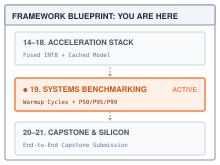
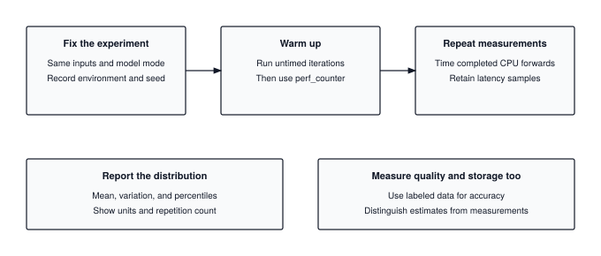
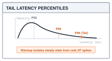
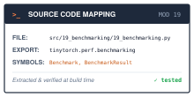

# Benchmarking: Measuring a Speedup You Can Trust {#sec-benchmarking}

::: {.column-margin}
{width="100%" fig-alt="TinyTorch execution datapath blueprint highlighting Module 19 Benchmarking as the active subsystem."}

*Framework Blueprint: Module 19 establishes experimental rigour: discarding cold-start caches, measuring percentiles, and auditing throughput.*
:::


Performance claims in machine learning systems, such as *"this optimization provides a $3\times$ speedup"*, cannot be checked without a stated, reproducible benchmarking method. Naive timing using basic wall-clock timers produces misleading results contaminated by Python interpreter overhead, cache cold starts, asynchronous execution queues, and operating system noise.

In production engineering, a reliable benchmark protocol requires explicit synchronization and statistical aggregation:

```python
import torch
import time

x = torch.randn(2048, 2048)

# 1. Warm-up iterations: prime caches and trigger JIT/library compilation
for _ in range(5):
    _ = x @ x

# 2. Synchronized monotonic measurement
times = []
for _ in range(20):
    t0 = time.perf_counter()
    _ = x @ x
    times.append((time.perf_counter() - t0) * 1000)  # Convert to ms

print(f"Median: {torch.tensor(times).median():.2f} ms")
```

Underneath that careful loop, a valid systems benchmark enforces several physical and statistical controls:
1. **Warmup isolation:** Untimed initial iterations prime instruction and data caches, trigger one-time allocator pools, and allow dynamically loaded BLAS routines to configure threads, preventing cold-start outliers from skewing steady-state performance.
2. **High-resolution monotonic timing:** Using hardware monotonic counters (`time.perf_counter()`) avoids the clock slews and negative durations that plague calendar wall-clock timers (`time.time()`).
3. **Distributional reporting over single-number averages:** Measuring variance across multiple runs reveals tail latency spikes (P90, P99) caused by operating system context switching, memory garbage collection, and thermal throttling.

This chapter builds TinyTorch's benchmarking suite, establishing the rigorous empirical measurement standards required for the Capstone evaluation in @sec-capstone. Before building our harness, we must inspect the common traps that make naive timing misleading.

{#fig-benchmarking-pipeline width="100%"}

---

## The Problem

::: {.column-margin}
**↩ Jump back:** @sec-memoization
*Benchmarking cached versus uncached autoregressive generation under strict warmup controls.*
:::


The script below is how most people time a model the first time, and it is wrong in three separate ways. The model is a stand-in that sleeps instead of multiplying, so the intended delays are explicit and you can run it without any other TinyTorch class.

```python
import time

class ToyModel:
    """Stands in for a real model: slow once, then fast, with a periodic stall."""
    def __init__(self):
        self.calls = 0

    def forward(self, x):
        self.calls += 1
        if self.calls == 1:
            time.sleep(0.040)      # one-time setup: allocate, load, compile
        if self.calls % 25 == 0:
            time.sleep(0.010)      # something else grabbed the CPU
        time.sleep(0.005)          # the steady-state work
        return x

model = ToyModel()
t0 = time.perf_counter()
model.forward(None)
t1 = time.perf_counter()
print(f"latency: {(t1 - t0) * 1000:.1f} ms")
```

The first call requests 40 ms of setup sleep plus 5 ms of steady work, totaling 45 ms before timer and scheduling overhead. That is the first flaw. A real model may also pay first-call costs, such as initializing a numerical library or bringing data into a processor cache. In the toy, comparing the 45 ms cold call with a 5 ms warm call creates an apparent 9x speedup without changing the model at all.

The second flaw is that one measurement is one sample. Even after warmup, the same forward pass does not take the same time twice. The operating system schedules other work, the caches hold different contents, the clock frequency drifts. In any 100 consecutive calls after the first, the toy requests 5 ms of sleep on 96 calls and 15 ms on four calls; observed durations also include scheduling delays. A single timing that happens to catch a stall reports a model three times slower than it is; a single timing that misses every stall reports a model that never stalls.

The third flaw appears once you do repeat the measurement and average it. The napkin version is enough to feel it. If 99 requests take 5.0 ms and one stalls for 500 ms, the mean is 9.95 ms, a number no single request ever experienced. The mean is pulled up by the one outlier and tells you neither what a typical request costs nor how bad the worst ones are. Latency is not symmetric noise around a center; it has a floor and a long right tail, and the average hides both.

The timer here surrounds completed NumPy work on the CPU. A device that accepts work into a queue needs a different timing boundary: the host call may finish before the computation does. The production bridge returns to that distinction after the reference loop is clear.

---

## The Idea

::: {.column-margin}
**↪ Jump ahead:** @sec-capstone
*The multi-axis scorecard: evaluating accuracy retention, compression ratio, and runtime speedup.*
:::


Treat a latency measurement as a sample from a distribution, and design the benchmark so that the distribution you sample is the one you care about. That single reframing produces every rule in the chapter.

### Warmup

For a sustained inference comparison, the distribution of interest is steady state, the cost once the model is loaded and running. An application concerned with startup must measure cold latency separately. Cold runs come from a different distribution, one that includes setup, and mixing the two corrupts every summary you compute. The fix is to run the model several times and throw those timings away, so that the list you keep is drawn from the distribution you meant to measure.

### Repetition and the shape of the distribution

::: {.column-margin}
{width="100%"}
*Latency distribution anatomy: tail percentiles $P_{95}$ and $P_{99}$ capture system stalls that the mean obscures.*
:::

After warmup, run the model $N$ times and keep every timing $t_1, \dots, t_N$. Two summaries are familiar. The **mean** $\bar{t}$ is the sum divided by $N$, and the **standard deviation** $s$ measures how far a typical timing sits from the mean:

$$\bar{t} = \frac{1}{N} \sum_{i=1}^N t_i, \qquad s = \sqrt{\frac{1}{N - 1} \sum_{i=1}^N (t_i - \bar{t})^2}$$

The mean and standard deviation remain valid summaries of asymmetric data, but neither tells us directly where the slowest requests lie. Latency often has that asymmetry. Nothing can run faster than the floor, and occasional stalls push a few timings far above it, so the histogram has a sharp left edge and a long right tail. For such a distribution the useful summaries come from sorting.

A **percentile** is a position in the sorted list. Sort the $N$ timings in ascending order, and the $p$-th percentile $P_p$ is the value at a fractional index $p$ percent of the way through that sorted list. Three percentiles carry most of the meaning:

- **$P_{50}$**, the median, is what a typical request costs. Half the runs were faster, half slower. Moving a few already-large observations farther upward leaves the median unchanged, making it useful for typical request cost.
- **$P_{95}$** and **$P_{99}$** are the **tail latency**, the cost seen by the slowest 5 and 1 percent of requests. A promise that 99 percent of requests finish within 20 ms is a bound on $P_{99}$. It concerns a fraction of requests, not a fixed group of users.[^fn-sla-latency-target]

[^fn-sla-latency-target]: **SLA** (service-level agreement): a written promise about a service's behavior, such as "99 percent of requests complete within 20 ms." A benchmark that reports only the mean cannot determine whether that percentile promise is met.

When $p$ percent of the way through the list falls between two entries, TinyTorch interpolates linearly between them, the same convention NumPy uses by default. With seven sorted timings, $P_{50}$ sits at position $0.5 \times 6 = 3$, exactly the fourth entry, while $P_{95}$ sits at position $5.7$, seven tenths of the way from the sixth entry to the seventh. The worked trace does this arithmetic by hand.

{#fig-latency-anatomy-distribution width="100%" fig-alt="Left panel shows cold-start warmup runs discarded before steady state. Right panel shows right-skewed probability density histogram with p50, p95, and p99 markers."}

### How many runs

A percentile is only as trustworthy as the number of samples behind it. $P_{99}$ describes an event that happens once per hundred runs, so twenty runs can easily miss that upper tail entirely. An interpolated percentile still exists, but provides little evidence about a rare event. The napkin math in \ref{nbk-benchmarking-sample-size-tail-latencies} turns that intuition into a concrete sample count.

::: {#nbk-benchmarking-sample-size-tail-latencies .callout-notebook title="How many runs does a P99 need?"}
A run exceeds the true 99th percentile with probability $p = 0.01$. The chance that $N$ runs contain no such event is $(1 - p)^N$, so the chance of seeing at least one is $1 - (1 - p)^N$. Asking for a 95 percent chance of catching at least one tail event gives

$$1 - 0.99^N \ge 0.95 \quad\Longrightarrow\quad N \ge \frac{\ln 0.05}{\ln 0.99} \approx \frac{-2.996}{-0.01005} \approx 298.07.$$

Round up to **299 runs** to meet the inequality. This calculation concerns observing at least one tail event, assuming independent samples. It does not establish a precise percentile estimate: one event gives little evidence about the tail's shape. `MLPerf.run_standard_benchmark` defaults to 100 runs, while `Benchmark` defaults to 10 measured runs. Both are classroom starting points; repeat the experiment and collect more samples before interpreting its $P_{99}$ as a service guarantee.
:::

### Throughput

Latency is the cost of one request. **Throughput** is how many samples the model finishes per second, which is what matters when requests arrive in batches. Over the measured window it is total samples over total time, with $B$ the batch size and the timings in milliseconds:

$$\text{Throughput} = \frac{N \cdot B}{\sum_{i=1}^N t_i} \times 1000 \quad \text{samples per second}$$

A batch of 32 that takes 40 ms has a worse latency than a batch of 1 that takes 5 ms and four times the throughput: 800 rather than 200 samples per second. The two numbers answer different questions. The module's MLPerf-style path assumes one example per input and reports `1000 / mean_latency_ms`; for a batched harness experiment, compute samples per second using the batch size explicitly.

The formula is a special case of **Little's law**, which relates three averages for any system in steady state: the number of items in the system $L$ equals their arrival rate $\lambda$ times the time each spends inside, $W$ (Little, 1961). Rearranged, throughput is $\lambda = L / W$. A harness that runs one batch at a time holds $L = B$ samples and keeps each for one batch latency, so its throughput is $B / \bar{t}$, the formula above. The law needs no assumption about how requests arrive, which makes it a check on any reported pair of numbers. A server that claims 800 samples per second at 40 ms per request must be holding about 32 requests at once. Raising throughput at a fixed latency therefore means holding more work concurrently, through larger batches or more parallel streams, and when latency grows with batch size, as it does here, the gain is less than the batch size suggests.

### Fairness

One more rule follows from the same model. A comparison is fair only when both sides are measured under the same conditions, which means the same input, the same machine, the same warmup and run counts, and the same statistic on each side. Compare a median against a mean, or a warm run against a cold one, and the ratio you get is a property of the measurement rather than of the models.

---

## The Code

::: {.column-margin}
{width="100%" fig-alt="Source code mapping card for Module 19 Benchmarking showing file path, exported package, and tested primitives."}

*Source Code Mapping: Module 19 extracts benchmark timing harnesses, latency percentile metrics, and MLPerf compliance directly from the working repository.*
:::

Read the core path first: `Benchmark.run_latency_benchmark` produces a list of durations, and `BenchmarkResult` summarizes that list. Compare one unchanged baseline with one candidate before introducing multiple candidates or a statistical test. The module's suite combines several metrics and plots comparisons; it cannot repair mismatched workloads or establish statistical significance from a plot.

We build four pieces. A percentile function does the sorting and interpolation. `BenchmarkResult` holds every timing from one run and computes the summaries. `Benchmark` performs the warmup-then-measure loop. The `MLPerf` class turns a result and an accuracy into a verdict. The latency harness constructs a TinyTorch `Tensor` and passes it to the model's `forward` method. The MLPerf-style loop also accepts `predict` or a callable, but every route must return predictions that the accuracy phase can interpret.

### Percentiles by hand

The median and tail comparisons in this chapter are positions in a sorted list. A bound on individual decode-step latency needs a percentile of those steps; a bound on the whole request instead needs whole-request timings. A report that the KV cache made the typical step faster needs $P_{50}$ before and after. So the first thing to understand is the function that reads those positions.

The naive way is to sort the timings and index with the truncated position, `s[int(0.95 * n)]`. On the seven timings of the worked trace that returns 18.40 ms for $P_{95}$, the stall itself, where NumPy reports 14.44 ms. Neither number is wrong in the abstract, but different conventions can produce substantially different values on a small sample. A comparison must name and use one convention consistently. NumPy treats the position as fractional and interpolates linearly between the two entries it falls between. The module's `BenchmarkResult.percentile` calls `np.percentile` for exactly that reason; here is the same rule written out, as book code, so that the arithmetic in the trace has something to point at.

```python
def percentile(values, p):
    """The value p percent of the way through the sorted list (NumPy's linear rule). Book code."""
    s = sorted(values)
    pos = (p / 100) * (len(s) - 1)   # fractional index into the sorted list
    lo = int(pos)                    # the entry at or below that position
    hi = min(lo + 1, len(s) - 1)     # the entry above it (clamped at the end)
    return s[lo] + (s[hi] - s[lo]) * (pos - lo)
```

Notice that `pos` runs from 0 to `len(s) - 1`, so $P_0$ is the minimum and $P_{100}$ is the maximum, and that when `pos` lands on a whole number the interpolation term vanishes and the function returns a timing that actually happened. This is the linear interpolation rule used by the module. The book helper assumes a nonempty list and $0 \le p \le 100$.

### The result container

@sec-capstone measures a baseline and an optimized model and asks how the median moved and how the tail moved. Both answers come from the same list of timings, and so does the verdict at the end of this chapter. A report that someone else will read has to be able to show that list.

@sec-profiling's `Profiler.measure_latency` returns the median of its internal timings. That compact result answers a typical-cost question, but it cannot recover a tail percentile afterward. Module 19 therefore calls the profiler with one measured iteration at a time and retains those individual results. Seven durations, including a stall, remain seven observations rather than one median. `BenchmarkResult` keeps that raw list and computes summaries from it.



`BenchmarkResult(name, values)` invokes `__post_init__`. That method rejects an empty list and stores the count, mean, sample standard deviation, median, and extrema. `percentile(p)` computes its answer on demand. Treat `values` as a finished record: the constructor retains the supplied list rather than copying it. Appending later would leave the stored mean and count unchanged while changing the next percentile result.

The confidence interval uses $1.96\,s/\sqrt{N}$ on either side of the mean. Under suitable sampling assumptions, this normal approximation describes uncertainty in the estimated mean; it is not a range containing 95 percent of requests. With a small or strongly skewed sample it can be poorly calibrated, and the single-sample case collapses to one point because variability cannot be estimated. The raw list is what permits a reader to assess these limitations or compute another summary.

### The harness

The harness supplies the repeated observations needed to compare models. For a @sec-memoization decoder, its usefulness depends on the caller holding the prefix and generation lengths fixed. It automates repetition; the caller still decides which workload to repeat and how many observations the claim needs.

The cold timing in the opening included 40 ms of setup. `Benchmark` separates setup from the measurements it returns. Its constructor defaults to five warmup runs and ten measured runs; the example below explicitly requests ten and one hundred. No fixed warmup count guarantees stabilization, and ten timings provide little evidence about rare stalls. The constructor records those counts, the model references, and basic platform metadata.



Task accuracy requires a model-provided `evaluate(dataset)` result. Synthetic accuracy probes are available only with explicit `simulate=True`, are labeled as simulated, and cannot support a deployment recommendation. A failed probe raises instead of receiving a plausible default score. The memory benchmark reports the profiler's traced allocation peak even for small runs; it does not substitute a parameter-byte estimate for that measurement. Neither quantity is total process memory or memory traffic.

The suite assigns each model a unique result key once. Unnamed models become `model_0`, `model_1`, and so forth; colliding names receive suffixes. Every metric reuses those keys, so a copied name cannot overwrite another model's measurement. `BenchmarkSuite.run_full_benchmark(input_shape=...)` and `analyze_optimization_techniques(..., input_shape=...)` pass the same requested shape to latency and memory measurement. For `Linear(10, 2)`, a representative batch might have shape `(2, 10)`; the default `(1, 28, 28)` is not inferred from the dataset and will not fit that layer.

The `system_info` is the beginning of the reproducibility habit the bridge insists on; it travels with every result as metadata. The measuring loop reuses @sec-profiling's timer for the warmup and then times every run on its own.



Follow one model through the loop. It creates one random input tensor outside the timed region, then calls the profiler with the requested warmup count and one additional measured iteration. That duration is discarded too. Each following profiler call uses zero warmup and one iteration, so the returned list contains exactly `measurement_runs` durations in milliseconds. With five warmups and ten retained measurements, the model receives sixteen forwards: five warmups, one discarded timing, and ten retained timings.

The input is reused within that model's measurements, but a new random tensor is drawn for the next model. Equal shapes therefore do not guarantee identical values across candidates. The harness also retains the model objects: a forward that updates a counter or cache keeps that state into the next call. It neither resets a KV cache nor selects evaluation mode for the caller. Set the desired mode and define the state boundary first. Repeated cached decoding must reproduce the same prefix and generation lengths, using @sec-memoization's cache lifetime rules; otherwise later timings measure progressively longer requests.

The toy makes that state visible through `calls`. Run the following example to inspect actual durations on your machine.

```python
from tinytorch.perf.benchmarking import Benchmark

toy = ToyModel()
toy.name = "toy"                                    # the harness labels results by this
bench = Benchmark(models=[toy], datasets=[], warmup_runs=10, measurement_runs=100)
result = bench.run_latency_benchmark(input_shape=(1, 4))["toy"]
print(result)
print(f"p50 {result.percentile(50):.2f}  p95 {result.percentile(95):.2f}  p99 {result.percentile(99):.2f}  max {result.max_val:.2f}")
```

The toy receives 111 calls: ten warmups, one discarded timing, and one hundred retained measurements. Calls 25, 50, 75, and 100 stall, so four retained observations include an extra 10 ms. If sleep durations exactly matched their requests, the measured list would contain 96 values of 5 ms and four of 15 ms: mean 5.4 ms, median 5 ms, $P_{95}=5$ ms, and $P_{99}=15$ ms. These are predictions from the toy's schedule, not claimed measurements of a laptop. Real timings include overhead and additional delays. Compare the observed list with that pattern before interpreting a changed percentile.

### The verdict

A benchmark ends in a decision, and @sec-capstone needs two kinds. The first is absolute. A model going into a service is asked to meet a latency bound, and the bound is about the slow requests, so it is a bound on $P_{99}$. The second is relative. Quantization in @sec-quantization, pruning in @sec-compression, and fusion in @sec-acceleration each change the numbers a model produces, some by rounding and some by removing weights outright, and a speedup is worth reporting only if the model still works afterward.

The naive verdict compares means and never asks about accuracy. It passes a model that averages 5 ms and stalls to 30 ms on every hundredth request, which is the request the user remembers. And it declares an INT8 model twice as fast without asking whether the rounding cost it accuracy, which would make it a different model rather than a faster one. The fix is two bars that both have to clear, latency and accuracy, and a fixed protocol around them so that two submissions can be compared. The module's classroom `MLPerf` class holds four task configurations inspired by MLPerf Tiny, each with an input shape, an accuracy target, and a latency bound. Passing this local check is not an official MLPerf result. Its timing loop uses a context manager that reads the clock on the way in and the way out.





This loop warms up on the first `max(1, num_runs // 10)` inputs, then times one forward per input and retains the outputs for accuracy scoring. Retaining a prediction also retains whatever storage that output owns until scoring finishes; this is an evaluation loop, not a peak-memory measurement. The standard benchmark then builds the inputs, runs both phases, and applies the two bars.



The returned dictionary reports the mean and several percentiles, but the latency decision reads $P_{99}$. Accuracy comes from the following helper.



Read its checks before its final average. For a binary task, each output must contain two finite real class scores, or one probability in $[0,1]$. For image classification it must contain exactly ten finite scores. A vector or a singleton batch such as `(1, 2)` is accepted; a batch containing several examples is not silently flattened. The helper rejects NaNs and invalid shapes before choosing a class. Labels must be integer class indices, one per input, within the task's class range.

For scores `[[0.2, 0.8]]`, removing the singleton batch leaves `[0.2, 0.8]`; `argmax` selects class 1. Comparing that prediction with label 1 contributes one correct answer. A single binary probability uses a threshold of 0.5 instead. Agreement count divided by input count is the accuracy. This path makes invalid numerical output an error rather than a plausible class-zero prediction.

Without supplied labels, the class draws synthetic labels from its seed and sets `synthetic_labels=True`. Such a run always has `compliant=False`, even if a small sample happens to exceed the accuracy threshold. Supplying labels enables the local decision, but cannot prove their provenance: the caller must supply independent ground truth. Here, as book code, are the two numerical bars on an already-validated `BenchmarkResult`, plus a relative comparison. These helpers assume finite measured values, positive latency denominators, and task accuracies in $[0,1]$; they do not validate a dataset or replace the module's input checks.

```python
def check_compliance(result, accuracy, max_latency_ms, min_accuracy):
    """A fast model that is wrong does not pass. Both bars, or neither. Book code."""
    latency_ok = result.percentile(99) <= max_latency_ms
    accuracy_ok = accuracy >= min_accuracy
    return {
        "p99_ms": round(result.percentile(99), 2),
        "latency_ok": latency_ok,
        "accuracy_ok": accuracy_ok,
        "compliant": latency_ok and accuracy_ok,
    }

def compare(baseline, optimized, baseline_acc, optimized_acc, retain=0.99):
    """Speedup at the median and at the tail, valid only if accuracy held. Book code."""
    return {
        "speedup_p50": round(baseline.percentile(50) / optimized.percentile(50), 2),
        "speedup_p99": round(baseline.percentile(99) / optimized.percentile(99), 2),
        "keeps_accuracy": optimized_acc >= retain * baseline_acc,
    }
```

Notice that `check_compliance` reads $P_{99}$ and never the mean, so a model that is fast on average but stalls too often fails. `compare` reports the speedup twice, at the median and at the tail, because an optimization can improve one without the other. Removing work can shorten typical execution while unrelated scheduling stalls remain. The relative retention threshold is a policy chosen for this book. The capstone owns its separate classroom event policy through `OlympicEvent` and `qualifies_event`; those rules do not alter the measurements produced here. Official benchmark requirements depend on the task and scenario; neither this helper nor the module implements their complete protocol.

---

## A Worked Trace

The trace uses ten invented durations for one model to make the bookkeeping visible. Interpret them as a harness run with two warmups, one discarded timing, and seven retained measurements. The sixth retained measurement is a stall.

| Run | Latency (ms) | Naive script | TinyTorch protocol | What happened |
| :--- | :--- | :--- | :--- | :--- |
| 1 | 48.20 | included | discarded (warmup) | cold start: allocation, first touch of memory |
| 2 | 14.50 | included | discarded (warmup) | caches still filling |
| 3 | 7.10 | included | discarded timing | first profiler call's timing |
| 4 | 5.12 | included | measured ($i = 1$) | steady state |
| 5 | 5.08 | included | measured ($i = 2$) | steady state |
| 6 | 4.95 | included | measured ($i = 3$) | steady state |
| 7 | 5.20 | included | measured ($i = 4$) | steady state |
| 8 | 5.10 | included | measured ($i = 5$) | steady state |
| 9 | 18.40 | included | measured ($i = 6$) | stall: the OS ran something else |
| 10 | 5.05 | included | measured ($i = 7$) | steady state |

: Ten runs of one model under the naive script and under the TinyTorch protocol. {#tbl-bench-trace tbl-colwidths="[8,16,16,22,38]"}

An unfiltered repeated loop averages all ten, and the sum $48.20 + 14.50 + 7.10 + 5.12 + 5.08 + 4.95 + 5.20 + 5.10 + 18.40 + 5.05 = 118.70$ divided by 10 gives $11.87$ ms, more than twice the steady-state cost, with the cold start alone contributing 4.3 ms of the excess.

The protocol keeps runs 4 through 10, sorted: $[4.95, 5.05, 5.08, 5.10, 5.12, 5.20, 18.40]$, with $N = 7$ and positions 0 through 6, as listed in @tbl-bench-trace.

- **Mean**: $48.90 / 7 = 6.99$ ms, still inflated by the stall.
- **$P_{50}$**: position $0.5 \times 6 = 3$, the fourth entry, $5.10$ ms. This is the steady-state cost.
- **$P_{95}$**: position $0.95 \times 6 = 5.7$, so $5.20 + 0.7 \times (18.40 - 5.20) = 5.20 + 9.24 = 14.44$ ms.
- **$P_{99}$**: position $0.99 \times 6 = 5.94$, so $5.20 + 0.94 \times 13.20 = 17.61$ ms.
- **Throughput**: $7 / 0.0489 \text{ s} = 143.1$ samples per second.

Constructing the container checks that the hand arithmetic agrees with the implementation. In line 3, `raw` lists the ten recorded durations from @tbl-bench-trace. Line 5 builds `naive = BenchmarkResult("naive", raw)`, which naively includes cold-start and setup artifacts, printing a distorted mean of $11.87$ ms in line 8. In line 6, `protocol = BenchmarkResult("protocol", raw[3:])` discards the two warmups and initial profiler timing. Lines 9--12 print the true steady-state metrics: median $P_{50} = 5.10$ ms, $P_{95} = 14.44$ ms, $P_{99} = 17.61$ ms, and throughput of 143.1 samples/sec. Lines 13--15 assert exact agreement with the manual calculations.

```python
from tinytorch.perf.benchmarking import BenchmarkResult

raw = [48.20, 14.50, 7.10, 5.12, 5.08, 4.95, 5.20, 5.10, 18.40, 5.05]

naive = BenchmarkResult("naive", raw)             # all ten runs
protocol = BenchmarkResult("protocol", raw[3:])   # setup observations discarded

print(f"naive mean:   {naive.mean:.2f} ms")
print(f"protocol p50: {protocol.percentile(50):.2f} ms  (median attribute: {protocol.median:.2f})")
print(f"protocol p95: {protocol.percentile(95):.2f} ms")
print(f"protocol p99: {protocol.percentile(99):.2f} ms")
print(f"throughput:   {protocol.count / (sum(protocol.values) / 1000):.1f} samples/s")
assert abs(naive.mean - 11.87) < 0.01
assert abs(protocol.percentile(50) - 5.10) < 0.01
assert abs(protocol.percentile(99) - 17.61) < 0.01
```

For these seven observations, the median is 5.10 ms (line 9) and the interpolated $P_{99}$ is 17.61 ms (line 11). Seven observations cannot establish what one future request in a hundred will experience. The trace checks the percentile arithmetic; a repeated experiment must supply the evidence for a tail-latency claim.

The accuracy path needs a separate trace, with labels fixed independently of the model. Use a small synthetic task: label an input 1 when the sum of its first two entries is positive, otherwise 0. Pad the remaining audio-shaped input with zeros. The four chosen pairs sum to $-3, 3, -1, 1$, so the labels are `[0, 1, 0, 1]`.

```python
import numpy as np
from tinytorch.core.tensor import Tensor
from tinytorch.perf.benchmarking import MLPerf

class SumClassifier:
    def forward(self, x):
        total = float(x.data[0, :2].sum())
        return Tensor([[-total, total]])  # shape (1, 2)

pairs = [(-2, -1), (2, 1), (-2, 1), (2, -1)]
inputs = []
for pair in pairs:
    data = np.zeros((1, 16000), dtype=np.float32)
    data[0, :2] = pair
    inputs.append(Tensor(data))
labels = np.array([0, 1, 0, 1], dtype=np.int64)
report = MLPerf().run_standard_benchmark(
    SumClassifier(), "keyword_spotting", test_inputs=inputs, labels=labels
)
assert report["num_runs"] == 4
assert report["accuracy"] == 1.0
assert report["synthetic_labels"] is False
assert report["compliant"] == report["latency_met"]
```

The first input produces scores `[3, -3]` and selects class 0; the second produces `[-3, 3]` and selects class 1. All four predictions agree with the independent rule, so accuracy is 1.0. The run count becomes four because supplied inputs determine it, regardless of the default argument. Latency remains a machine measurement and is not assigned a fixed expected value.

This checks scoring and orchestration on a known rule, not keyword-spotting quality. The field `synthetic_labels=False` means labels were supplied; it does not certify that the data represents real audio. Replacing one output with `[NaN, NaN]` must raise `ValueError` before a report is returned. Replacing the input and label lists with a held-out task dataset is what turns a pipeline check into a task evaluation.

---

## From TinyTorch to Production

A CUDA operation can return control to the CPU while its work is still queued on the GPU. To time completed computation with a CPU clock, synchronize before the start reading and after the model call, before the end reading. Alternatively, record CUDA events[^fn-cuda-event-gpu-timer] around the device work and wait for completion before reading elapsed time, as highlighted in \ref{chk-benchmarking-cuda-synchronize}. These are different timing boundaries from TinyTorch's completed CPU forwards. PyTorch's [CUDA semantics documentation](https://docs.pytorch.org/docs/stable/notes/cuda.html#asynchronous-execution) explains this distinction; its [benchmark timer](https://docs.pytorch.org/docs/stable/benchmark_utils.html) supplies warmups, replication, and accelerator synchronization.

::: {#chk-benchmarking-cuda-synchronize .callout-checkpoint title="Checkpoint: The asynchronous CUDA execution timing pitfall"}
A common benchmarking trap occurs when measuring accelerator code using standard CPU timers:

```python
# FAULTY BENCHMARK: Measures CPU kernel launch dispatch, NOT GPU execution!
t0 = time.perf_counter()
output = model(inputs)  # Enqueues kernels asynchronously to device stream
t1 = time.perf_counter()
print(f"Latency: {(t1 - t0) * 1000:.2f} ms")  # Phantom speedup: reports 0.05 ms!
```

Because device driver kernel launches return asynchronously to the host, `t1` records when the command was enqueued, not when computation completed.

**The Fix**:
Synchronize host execution before and after the timed region:
```python
# CORRECT BENCHMARK:
torch.cuda.synchronize()
t0 = time.perf_counter()
output = model(inputs)
torch.cuda.synchronize()
t1 = time.perf_counter()
```
Or record timestamps directly on device streams via `torch.cuda.Event(enable_timing=True)`.[^fn-cuda-event-overhead-vs-sync]
:::

[^fn-cuda-event-gpu-timer]: **CUDA event**: a marker recorded in a GPU stream, the ordered queue of device work. With timing enabled, two completed events provide elapsed time between their positions in that stream. Work from other streams or gaps between submitted operations can still affect the interval.
[^fn-cuda-event-overhead-vs-sync]: **CUDA events versus host synchronization**: Calling `torch.cuda.synchronize()` on the CPU blocks the host thread until the GPU has completely drained all submitted command queues. While necessary before reading CPU clocks, doing so inside a per-layer loop artificially flushes the GPU hardware execution pipeline, preventing the overlap of kernel launches and memory transfers. Using `torch.cuda.Event(enable_timing=True)` records GPU clock cycle timestamps asynchronously within the stream without halting execution; host synchronization is deferred until after the entire benchmark window concludes.

A more complete experiment also varies and records its conditions. Repeating the same setup at different times can reveal interference that one long run hides. Interleaving baseline and candidate measurements can reduce the effect of a slow change in machine load. Neither a warmup nor a fixed random seed guarantees a stable machine, as detailed in \ref{psp-benchmarking-environment-noise}, so preserve the raw observations and report the comparison procedure.

::: {#psp-benchmarking-environment-noise .callout-production-bridge title="Production bridge: environmental isolation and hardware governor controls"}
In real production and edge benchmarking environments, unpredictable performance jitter often stems from dynamic OS and power management rather than algorithmic code:

- **CPU Frequency Scaling**: Dynamic voltage and frequency scaling (DVFS) governors like Linux `powersave` or `ondemand` ramp clock frequencies dynamically. Rigorous server benchmarking pins governors to constant frequencies:
  ```bash
  sudo cpupower frequency-set --governor performance
  ```
- **Thermal Throttling**: Sustained compute heats processor silicon, causing hardware safety governors to throttle clock multipliers midway through benchmark loops. Monitor die temperature and allow inter-run cooling pauses.
- **Core Pinning and Thread Affinity**: Preemptive OS scheduler migrations move threads across cores, invalidating L1/L2 caches. Pin benchmark processes to isolated cores using `taskset` or `numactl`:
  ```bash
  taskset -c 0-3 python3 benchmark_inference.py
  ```
:::

More samples support uncertainty analysis. A bootstrap[^fn-bootstrap-confidence-interval] can show how a statistic varies across resampled observations, but it cannot invent rare stalls absent from the measured list. The statistic itself must match the question. Python's [`timeit` documentation](https://docs.python.org/3/library/timeit.html#timeit.Timer.repeat) recommends considering the minimum as a lower bound on small-snippet execution cost under interference. An application latency claim instead needs the delays its users experience, including the tail.

MLPerf formalizes workloads, quality checks, and measurement scenarios for comparisons across systems.[^fn-mlperf-inference-paper] TinyTorch borrows the original four task categories from MLPerf Tiny, which targets small, resource-constrained devices.[^fn-mlperf-tiny-paper] It does not reproduce the official datasets, quality metrics, or complete protocols. The [Tiny benchmark description](https://mlcommons.org/benchmarks/inference-tiny/) defines that suite's scope, while the [Inference submission guide](https://docs.mlcommons.org/inference/submission/) describes the checks accompanying an official inference submission. A TinyTorch `compliant=True` remains a local classroom verdict.

[^fn-mlperf-inference-paper]: Vijay Janapa Reddi et al., ["MLPerf Inference Benchmark"](https://arxiv.org/abs/1911.02549), *International Symposium on Computer Architecture (ISCA)*, 2020.
[^fn-mlperf-tiny-paper]: Colby Banbury et al., ["MLPerf Tiny Benchmark"](https://datasets-benchmarks-proceedings.neurips.cc/paper_files/paper/2021/hash/da4fb5c6e93e74d3df8527599fa62642-Abstract-round1.html), *NeurIPS Datasets and Benchmarks Track*, 2021.
[^fn-bootstrap-confidence-interval]: **Bootstrap**: sample with replacement from the measured observations, recompute the statistic, and repeat to examine its spread. Its usefulness depends on whether those observations and the resampling scheme represent the experiment; resampling cannot recover unobserved tail events.

| Concern | TinyTorch benchmark classes | PyTorch / MLPerf practice |
| :--- | :--- | :--- |
| Clock | `time.perf_counter` on the CPU, read through `Profiler` or `precise_timer` | CUDA events, or `synchronize()` before reading the CPU clock |
| Warmup | `Benchmark`: 5 warmups plus 1 discarded timing; `MLPerf`: at least 1 warmup, otherwise a tenth of the runs | Warmup and replication configured for the workload |
| Repetition | `Benchmark`: 10; `MLPerf`: 100, unless supplied inputs set the count | Counts chosen for measurement uncertainty or prescribed by benchmark rules |
| Statistic reported | mean, std, median, min, max, an approximate interval on the mean, percentiles on demand | Summary and scoring rule depend on the experiment |
| Accuracy floor | `MLPerf`: local task target; `Benchmark`: caller-supplied evaluation | Task-specific quality target with prescribed validation data |
| Reproducibility | Per-model input reused; counts and basic platform metadata recorded; caller controls mode and state | Full hardware and software configuration logged with every result |

: What changes between the classroom harness and production measurement, and what does not. {#tbl-bench-bridge tbl-colwidths="[20,35,45]"}

The comparison in @tbl-bench-bridge preserves the chapter's central contract: a report must explain what completed, what was retained, and which statistic was compared. A production experiment adds workload-specific execution boundaries and validation, rather than making a classroom sample authoritative by collecting more of it. The reporting discipline extends beyond ML; Hoefler and Belli discuss reproducible performance experiments and the evidence needed to interpret their results.[^fn-hoefler-twelve-ways]

[^fn-hoefler-twelve-ways]: Torsten Hoefler and Roberto Belli, ["Scientific Benchmarking of Parallel Computing Systems: Twelve Ways to Tell the Masses When Reporting Performance Results"](https://htor.ethz.ch/publications/img/hoefler-scientific-benchmarking.pdf), *SC*, 2015.

---

## Summary

The latency harness creates an input, warms the model, discards one additional timing, and retains one duration per measured forward. `BenchmarkResult` keeps those observations and computes summaries; the mean describes average cost, the median describes typical cost, and a tail percentile describes a high position in the sorted sample. A small sample can demonstrate that arithmetic without establishing a rare-event guarantee.

The MLPerf-style path adds predictions and labels to the timing loop. It validates their shapes and values, counts agreements, and checks both accuracy and $P_{99}$ against local thresholds. Synthetic labels cannot pass that local check, and supplied labels still need independent provenance. @sec-capstone uses these measurement habits to compare combinations of optimizations under its own event policy. Preserve the baseline, control input shape and model state, check quality on the same data, and compare the same named statistic before combining another mechanism.

---

## Further reading

- Georges, Buytaert, and Eeckhout (2007), [Statistically rigorous Java performance evaluation](https://doi.org/10.1145/1297027.1297033), *OOPSLA*. Warmup, repeated runs, and confidence intervals for timing in a managed runtime.
- Mattson et al. (2020), [MLPerf training benchmark](https://arxiv.org/abs/1910.01500), *MLSys*. What a fair machine learning benchmark must fix: the task, the quality target, and the rules.
- Reddi et al. (2020), [MLPerf inference benchmark](https://arxiv.org/abs/1911.02549), *ISCA*. Latency percentiles and serving scenarios for inference.
- Banbury et al. (2021), [MLPerf Tiny benchmark](https://arxiv.org/abs/2106.07597), *NeurIPS*. Standardizing benchmarks for deeply embedded systems and microcontrollers, where memory constraints dictate optimization choices.
- Little (1961), [A proof for the queuing formula $L = \lambda W$](https://doi.org/10.1287/opre.9.3.383), *Operations Research*. The law relating concurrency, throughput, and latency used above.
