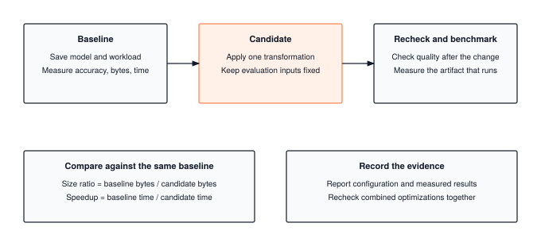
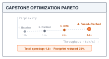
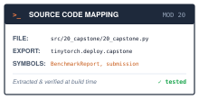

# The Capstone: From an Optimization to a Checkable Report {#sec-capstone}

::: {.column-margin}
{width="100%" fig-alt="TinyTorch execution datapath blueprint highlighting Module 20 Capstone as the active subsystem."}

*Framework Blueprint: Module 20 synthesizes training, profiling, quantization, and caching into a verified production optimization report.*
:::


Real-world machine learning systems engineering is never about applying a single optimization in isolation; it is an exercise in multi-objective trade-offs. An optimization that doubles inference speed is unacceptable if it degrades model accuracy below acceptable limits. Similarly, a compression technique that reduces storage is worthless if it introduces excessive runtime latency. The systems engineer must synthesize multiple optimizations into a coherent, balanced production pipeline.

From a framework and systems standpoint, the Capstone integrates the full optimization arsenal developed across Part III:
1. **End-to-end optimization pipeline**: Systematically combining profiling, INT8 post-training quantization, knowledge distillation, and KV cache memoization on TinyGPT.
2. **Pareto frontier analysis**: Mapping the multi-dimensional trade-offs between model accuracy retention, storage compression ratios, and inference latency speedups.
3. **Verification and scorecard reporting**: Enforcing strict verification gates to ensure optimized models produce valid predictions that pass classroom and production quality thresholds.

This chapter guides the student through the complete optimization and benchmarking of TinyGPT, synthesizing the principles of the entire TinyTorch curriculum.

{#fig-capstone-stack fig-alt="Baseline model and workload lead to a transformed candidate and a quality and timing check. Lower panels compare against the same baseline and record measured evidence."}

---

## The Problem

::: {.column-margin}
**↩ Jump back:** @sec-quantization
*Synthesizing INT8 quantization, distillation, and KV caching into a coherent serving pipeline.*
:::


Consider a baseline that gets four of four labels right. Zeroing an output weight makes the candidate predict class zero for every input, so only two answers remain correct. The storage ratio is still 1.0 because a zero occupies the same float32 slot as any other value. If the timing improves, that result must travel with the accuracy loss and unchanged storage count. The report in @fig-capstone-stack keeps those quantities separate.

Combining transformations creates another reporting trap. Suppose four separate experiments against one baseline produce speedups of 2.0x, 1.5x, 1.3x, and 4.2x. Their product is 16.4x, but these ratios do not reveal whether the transformations remove the same work. They cannot establish the speed of the combined model.

The napkin version of the failure is Amdahl's law.[^fn-amdahl-stack] Say matrix multiplies take 70 percent of a decode step and everything else takes 30 percent. Speed the multiplies up by 10x and the step takes $0.30 + 0.70 / 10 = 0.37$ of its old time, a 2.7x speedup. Speed them up infinitely and the step still takes 0.30 of its old time. A lever that shrinks one term of a sum can never buy more than that term's share of the total, and once it has bought most of it, the next lever on the same term buys almost nothing.

[^fn-amdahl-stack]: **Amdahl's law**: if a fraction $f$ of the total time is sped up by a factor $k$, the overall speedup is $1 / \big((1 - f) + f / k\big)$. The limit as $k \to \infty$ is $1 / (1 - f)$, the ceiling set by the part that was left alone.

The product can also underestimate a combination. Suppose a 100-millisecond task spends 40 milliseconds in each of two routines and 20 milliseconds elsewhere. Making either routine four times faster gives a solo time of 70 milliseconds, or a 1.43x speedup. Improving both gives 40 milliseconds, or 2.5x, greater than the product of the two solo ratios, about 2.04x. The missing information is which work each transformation changes.

---

## The Idea

::: {.column-margin}
**↪ Jump ahead:** @sec-milestone-3
*The Torch Olympics: deploying optimized candidate models against strict competitive scoring gates.*
:::


### Three terms in a decode step

@sec-profiling bounded the time of one operation by the larger of two costs, the bytes it must move divided by memory bandwidth and the arithmetic it must do divided by peak throughput. It then noted a third floor for small operations. A separate operation also incurs dispatch overhead: the work of invoking the routine, preparing its arguments, and returning control. The size of that overhead depends on the runtime. Many small operations can spend more time in dispatch than in moving operands or computing results. Those three costs are the cost model of this chapter:

$$T_{\text{step}} = \max\!\left(\frac{Q}{B_{\text{peak}}},\; \frac{F}{P_{\text{peak}}}\right) + n_{\text{ops}} \cdot c$$

Here $Q$ is the bytes streamed in the step, $F$ the arithmetic operations, $B_{\text{peak}}$ and $P_{\text{peak}}$ the machine's two ceilings from @sec-profiling, $n_{\text{ops}}$ the number of separate operations the step launches, and $c$ the fixed cost of one launch. The maximum is @sec-profiling's roofline; the added term is the launch floor. For this estimate we add a fixed dispatch cost to a roofline bound. That is a modeling assumption, not an execution law: asynchronous host dispatch can overlap device work, and a real trace may require per-operation costs rather than one aggregate maximum.

Each of the four levers acts on one of the three quantities, and that is the whole reason the model has three terms rather than one. INT8 quantization (@sec-quantization) shrinks $Q$, low-rank factorization (@sec-compression) shrinks matrix storage and arithmetic but adds intermediate arrays and products, kernel fusion (@sec-acceleration) shrinks $n_{\text{ops}}$ here, although a fused implementation can also reduce intermediate-memory traffic, and the KV cache (@sec-memoization) changes how $F$ grows with the number of tokens already generated. The Code says how much, lever by lever, next to the line that implements each one.

### When speedups multiply, and when they do not

::: {.column-margin}
{width="100%"}
*Optimization Pareto frontier: balancing speedup, compression ratio, and accuracy retention.*
:::

Ratios measured along a sequence always multiply. If baseline time is 100 milliseconds, the first candidate takes 70, and the second takes 40, then $(100/70)(70/40) = 100/40$. The intermediate time cancels. These are marginal ratios, each comparing a candidate with the immediately preceding configuration.

Solo ratios use a different denominator. Both compare with the unchanged baseline, so their product has no such cancellation. When two transformations act on the same dominant term, their solo factors can happen to predict the combination. Once another cost becomes significant, the estimate changes. Reducing dispatch overhead, for example, can expose byte transfers that barely mattered in the original total. The practical task is to measure the marginal change against the program that will actually precede it.

That last observation is the practical content of the chapter. The marginal speedup a lever appears to deliver depends on the order in which the levers are applied, while this model's total for the full stack does not. Its configuration edits commute; real transformations can change one another's inputs, so reversing quantization and factorization need not produce the same weights. Only the model, or a measurement of the complete stack, gives a number that survives, and the rest of the chapter builds both.

{#fig-stacking-waterfall-amdahl fig-alt="Waterfall chart showing sequential speedups from SVD compression, INT8 quantization, KV caching, and kernel fusion approaching an Amdahl's law serial bottleneck."}

---

## The Code

::: {.column-margin}
{width="100%" fig-alt="Source code mapping card for Module 20 Capstone showing file path, exported package, and tested primitives."}

*Source Code Mapping: Module 20 extracts end-to-end benchmark reporting, optimization comparison, and competition submission generation directly from the working repository.*
:::

Control enters `BenchmarkReport.benchmark_model` with a model, an input Tensor, and integer class labels. The method gathers measurements into `self.metrics`; `generate_submission` combines two reports without running either model again. Validation and event eligibility read that record. Following this path first establishes what a reported improvement means before we estimate which transformation might produce one.

### From model outputs to report state

For inputs of shape `(N, features)`, a classifier must return finite real scores of shape `(N, classes)`. `benchmark_model` first counts parameters and calls `measure_memory`, then runs the full test batch for accuracy. It rejects malformed scores, NaN or infinite values, and labels that are not integer indices into the class axis. These checks precede `argmax`: an array of NaNs can otherwise select class zero and falsely reward a broken model when the labels happen to be zero.



After accuracy, `measure_latency` selects the first sample, warms up with up to five untimed calls, and collects `num_runs` durations, 100 by default. The method then times full-batch forwards in a separate loop. The median batch duration determines throughput; the mean, standard deviation, and median of single-sample durations describe latency. Only after these measurements succeed does it replace `self.metrics` with seven Python numeric values and return that same dictionary. The caller controls model mode and mutable state; the harness does not reset a cache or disable training behavior automatically.

The two timing boundaries answer different questions. A faster batch does not establish lower single-request latency, and the first sample alone does not represent every possible input length. The report also discards the raw durations. A study that needs a latency distribution retains observations with @sec-benchmarking's `BenchmarkResult` rather than inferring a tail percentile from this report's three summaries.



Storage has an equally specific boundary. `measure_memory` sums each parameter array's `nbytes`, unless the model supplies `size_bytes()`. This counts stored parameters, not peak process memory or temporary activations. Zeros still occupy space. Module 20's simulated quantization example supplies a byte counter that includes both rounded float32 code arrays and retained original weights. Packing integer codes would be a different storage representation.

`generate_submission` reads the reports and builds a dictionary with baseline and optional optimized sections. It compares median latency when both reports contain a median, otherwise it compares means. The size ratio is baseline storage divided by candidate storage; the accuracy delta is candidate accuracy minus baseline accuracy. These separate values preserve a trade-off that a single score would hide. System information and the timestamp come from the baseline report's construction. They do not establish that the optimized run used the same machine or data, so the experiment must control those conditions.

The submission keeps references to the report dictionaries; it is not an immutable snapshot. Editing a metric afterward can change the submission while leaving its derived ratios stale. `validate_submission_schema` checks required metrics in both sections, checks optional median, spread, and throughput fields when supplied, and recomputes supplied improvements for consistency. It cannot rerun the models or establish data provenance. `save_submission` only serializes, so the caller should validate the completed record before saving it.

Event eligibility is another explicit check. `qualifies_event(report.metrics, OlympicEvent.LATENCY_SPRINT)` applies the capstone's accuracy floor to an already measured report. The helper validates accuracy, median latency, and stored size before checking the selected event. It leaves the report and submission schema unchanged, and `generate_submission` does not call it automatically. The latency and memory events require accuracy of at least 0.85; the extreme-push event requires 0.80. The accuracy event instead requires median latency below 100 milliseconds and stored size below 10 in the report's MB units. All-around has no extra eligibility floor and no combined ranking formula. This keeps measurement, file validation, and classroom policy visible as separate decisions.


### The machine and the model as a handful of numbers

A report establishes what happened to one candidate. To choose the next candidate, we can estimate which part of a forward pass consumes the most work. Four on/off transformations give sixteen combinations; a small analytical model lets us inspect their interactions before implementing them. Its result remains a hypothesis to test on the chosen workload.

The machine below assumes 200 GB/s of bandwidth, 1000 GFLOP/s of arithmetic throughput, and 5 microseconds of dispatch per modeled operation. These are illustrative inputs, not measurements of this run or promises about NumPy. The model dimensions match the transformer used in @sec-profiling. The four switches represent hypothetical packed weights, factorized matrices, grouped operations, and reused keys and values.

::: {#lst-capstone-model-config lst-pos="H" lst-cap="**Analytical inputs**: Separate stored parameters from the dimensions of a forward call."}
```python
from dataclasses import dataclass, replace

@dataclass
class Machine:
    bandwidth_gbs: float = 200.0  # assumed bandwidth, billions of bytes per second
    peak_gflops: float = 1000.0  # assumed billions of arithmetic operations per second
    launch_us: float = 5.0  # fixed cost of every separate operation

@dataclass
class Config:
    D: int = 128  # embedding width
    L: int = 4  # transformer blocks
    V: int = 1000  # vocabulary
    bytes_per_weight: int = 4  # 4 for FP32, 1 after INT8 quantization
    mlp_rank: int = 0  # 0 keeps the MLP dense; r factorizes it at rank r
    fused: bool = False  # elementwise chains folded into their neighbors
    kv_cache: bool = False  # keys and values kept between steps

def mlp_params(cfg):
    if cfg.mlp_rank == 0:
        return 8 * cfg.D * cfg.D  # D x 4D expand, 4D x D contract
    return 2 * cfg.mlp_rank * (cfg.D + 4 * cfg.D)  # two factor pairs, r(M + N) each

def matmul_params(cfg):
    """Weights a decode step multiplies by: the blocks plus the output head."""
    return cfg.L * (4 * cfg.D * cfg.D + mlp_params(cfg)) + cfg.V * cfg.D

def stored_params(cfg):
    """Stored matrix and embedding parameters, excluding small vectors."""
    return matmul_params(cfg) + cfg.V * cfg.D
```
:::

`mlp_params` applies @sec-compression's factorization count to both MLP matrices. At rank $D/4$, their combined count falls from $8D^2$ to $2.5D^2$. `stored_params` adds the whole token embedding table because every row occupies storage. Traffic is different. A forward over `rows` token positions selects only `rows * D` embedding entries, while the dense projections read their weight matrices. The estimate below charges each matrix once per forward, assuming its weights are reused across the rows in that call. Biases, normalization parameters, and position vectors are outside this matrix subtotal; @tbl-tinygpt-params gives the fuller stored count.

### The cost of one decode step

One iteration of generation predicts the next token from a prefix. Its cost changes as the prefix grows, so total time is a sum over iterations, not one measured step multiplied by the response length. Without a cache, a prefix of length `n` sends `n` rows through each projection. With a cache, only the new row is projected, although attention still reads `n` keys and values.

The model accounts for matrix weights, selected embedding rows, linear-layer input and output arrays, and cache reads and writes. Its byte ledger omits attention-score and elementwise intermediates, allocator behavior, and hardware cache effects. It is a partial logical-transfer estimate for comparing these mechanisms, not a traffic counter or a prediction interval. The arithmetic similarly counts matrix products and attention, rather than every scalar operation.

Dispatch needs another assumption. The operation grouping in @tbl-capstone-op-count supplies illustrative unfused and fused counts. These are hypothetical execution groups, not a count of NumPy calls made by `GPT`; Module 17 does not fuse an entire transformer. Factorizing each MLP matrix introduces an additional product, which the code charges as two extra operations per block.

| Piece of one block | Separate operations, unfused | After fusion |
| :--- | :---: | :---: |
| Two LayerNorms (mean, subtract, square, mean, add $\epsilon$, square root, divide, scale, shift, each) | 18 | 2 |
| Attention (three projections with biases, scores, scale, mask, softmax as five steps, weighting, output projection with bias) | 17 | 5 |
| MLP (expand with bias, GELU as eight elementwise steps, contract with bias) | 12 | 2 |
| Two residual adds | 2 | 0 |
| **Per block** | **49** | **9** |
| Outside the blocks (embedding lookup, position add, final LayerNorm, bias-free head) | 12 | 3 |

: **Assumed operation groups**: A hypothetical grouping of dense transformer work before and after fusion. These counts configure the analytical model; they are not a measured TinyTorch execution trace. {#tbl-capstone-op-count tbl-colwidths="[56,22,22]"}

The KV cache is the one lever that does not simply scale a term, so it gets a branch of its own. Without the cache, the step after $t$ tokens re-projects all $t + 1$ tokens through every layer and recomputes attention over all pairs, so $F$ grows linearly with $t$ in the projections and quadratically in attention. With it, the step projects one token and reads the cached keys and values for the other $t$, so $F$ stays flat apart from a small linear attention term while $Q$ picks up a linear term for the cache reads. That branch is the only place the step's position $t$ enters the code.

::: {#lst-capstone-step-cost lst-pos="H" lst-cap="**A partial cost ledger**: Count selected rows, linear arrays, and cache transfers before estimating step time."}
```python
OPS_PER_BLOCK = {False: 49, True: 9}  # unfused, fused
OPS_OUTSIDE   = {False: 12, True: 3}  # embedding, final LayerNorm, head

def step_ms(cfg, m, t):
    """Napkin time to produce the token after t existing tokens."""
    n = t + 1  # tokens the step must look at
    if cfg.kv_cache:
        rows = 1  # only the new token is projected
        attn_flops = 4 * n * cfg.D * cfg.L  # one query against n keys
        kv_bytes = 2 * n * cfg.D * 4 * cfg.L  # read the cached K and V, FP32
    else:
        rows = n  # every token is projected again
        attn_flops = 4 * n * n * cfg.D * cfg.L
        kv_bytes = 0
    flops = 2 * matmul_params(cfg) * rows + attn_flops
    weight_bytes = matmul_params(cfg) * cfg.bytes_per_weight
    embedding_bytes = rows * cfg.D * cfg.bytes_per_weight
    # Four attention projections: 8D input/output entries per row.
    # Two dense MLP projections: 10D; factor pairs add 4r entries.
    linear_entries = cfg.L * (18 * cfg.D + 4 * cfg.mlp_rank)
    linear_entries += cfg.D + cfg.V  # output head input/output
    activation_bytes = 4 * rows * linear_entries  # float32 activations
    cache_writes = 2 * cfg.D * 4 * cfg.L if cfg.kv_cache else 0
    nbytes = weight_bytes + embedding_bytes + activation_bytes
    nbytes += kv_bytes + cache_writes
    ops = cfg.L * OPS_PER_BLOCK[cfg.fused] + OPS_OUTSIDE[cfg.fused]
    if cfg.mlp_rank:
        ops += 2 * cfg.L  # two extra MLP products

    memory_ms = nbytes / (m.bandwidth_gbs * 1e9) * 1e3
    compute_ms = flops / (m.peak_gflops * 1e9) * 1e3
    launch_ms = ops * m.launch_us / 1e3
    return max(memory_ms, compute_ms) + launch_ms

def generation_ms(cfg, m, n_tokens):
    return sum(step_ms(cfg, m, t) for t in range(n_tokens))
```
:::

The cache branch removes a factor of $n$ from projection arithmetic and a factor of $n$ from attention arithmetic. It also reduces embedding and linear activation traffic to one row. In exchange it adds $8nDL$ bytes of cache reads and $8DL$ bytes of cache writes to $Q$. That is the trade @sec-memoization made, arithmetic for bandwidth, and it only pays once $n$ is large enough that the recomputation was the dominant term. `generation_ms` sums the steps, so a generation of 128 tokens is 128 calls with $t$ running from 0 to 127. A profiler on a real serving engine reports the same three terms under the names memory-bound, compute-bound, and launch-bound, and the bridge comes back to that vocabulary.

### The levers and the waterfall

The waterfall places solo and sequential comparisons beside each other. A solo ratio isolates a transformation against the original baseline. A marginal ratio compares with the immediately preceding configuration. Keeping both columns prevents a change in the denominator from being mistaken for a change in the transformation.

Here is the version that survives. Each lever is a one-line edit to the configuration, so a stack is just the levers applied in sequence to one `Config`. INT8 sets `bytes_per_weight` to 1, which divides the weight part of $Q$ by four and leaves $F$ alone. SVD sets `mlp_rank` to $D/4$, replacing the MLP's $8D^2$ weights with $2.5D^2$. Its matrix arithmetic falls with that count, while the extra factor outputs and products add activation traffic and dispatch. Fusion flips the operation count from the left column of @tbl-capstone-op-count to the right. The KV cache flips the branch in `step_ms`. `waterfall` then prints all three views at once, each lever alone, the product of the solo numbers, and the cumulative total as the levers stack in a stated order, so that the product and the stack disagree on the same page.

::: {#lst-capstone-waterfall lst-pos="H" lst-cap="**Marginal and cumulative ratios**: Apply configuration edits in an explicit order without changing the baseline."}
```python
LEVERS = {
    "INT8":     lambda c: replace(c, bytes_per_weight=1),
    "SVD":      lambda c: replace(c, mlp_rank=c.D // 4),
    "fusion":   lambda c: replace(c, fused=True),
    "KV cache": lambda c: replace(c, kv_cache=True),
}

def waterfall(cfg, m, n_tokens, order=LEVERS):
    """Each lever alone against the baseline, then stacked in order."""
    base = generation_ms(cfg, m, n_tokens)
    print(f"baseline {base:9.2f} ms")
    product = 1.0
    for name, lever in order.items():
        alone = base / generation_ms(lever(cfg), m, n_tokens)
        product *= alone
        print(f"  {name:9s} alone {alone:5.2f}x")
    print(f"  product of the solo speedups {product:5.2f}x")
    prev, cur = base, cfg
    for name, lever in order.items():
        cur = lever(cur)
        now = generation_ms(cur, m, n_tokens)
        print(f"  +{name:8s} {now:9.2f} ms  marginal {prev / now:5.2f}x"
              f"  cumulative {base / now:5.2f}x")
        prev = now
```
:::

Two properties make the comparison reproducible. `replace` returns a new configuration and leaves the old one alone, so a lever is a pure function and a stack is function composition; nothing about applying INT8 depends on whether fusion came first, except the number that comes out. `order` is an argument rather than a constant so that the trace can run the same four levers forward and reversed, and show the cumulative total agreeing while every marginal factor moves. The table records a cumulative comparison: each row retains the preceding changes and adds one more. Stating the order makes each marginal ratio interpretable.


---

## A Worked Trace

The first trace follows four labeled inputs into a submission. The second checks the analytical model's arithmetic. The last tests a stateful transformation on a fixed token sequence. They establish different claims, so their results stay separate.

### Four predictions become a submission

Set both matrices of a two-input, two-hidden-unit, two-output `SimpleMLP` to the identity and both biases to zero. The four input rows are positive, so ReLU leaves them unchanged and both linear layers preserve their values. The scores are `[[2, 1], [1, 2], [3, 1], [1, 3]]`; their class indices are `[0, 1, 0, 1]`, exactly the labels. Each layer owns four weights and two biases, so the model stores twelve float32 entries, or 48 bytes.

The candidate is a deep copy. Zeroing its second output weight changes the scores to `[[2, 0], [1, 0], [3, 0], [1, 0]]`. It now predicts `[0, 0, 0, 0]` and gets two of four labels right. The array shapes and byte counts are unchanged. In @lst-capstone-four-predictions below, lines 10--15 set up the four-sample input `X`, labels `y`, and the identity baseline model. Lines 16--17 construct the candidate model with one weight zeroed (`candidate.fc2.weight.data[1, 1] = 0`). Lines 19--22 run 5 benchmark iterations on both models. Lines 23--24 build the candidate report via `generate_submission`. Lines 25--30 assert that accuracy dropped from 1.0 to 0.5 (line 26), parameter count remains 12 (line 27), and accuracy delta is −0.5 (line 30).

::: {#lst-capstone-four-predictions lst-pos="H" lst-cap="**Four predictions and a report**: A weight change preserves array storage but lowers accuracy."}
```python
import copy
import numpy as np
from tinytorch.core.tensor import Tensor
from tinytorch.olympics import (
    SimpleMLP, BenchmarkReport, generate_submission,
    validate_submission_schema, qualifies_event, OlympicEvent,
)

X = Tensor([[2, 1], [1, 2], [3, 1], [1, 3]])
y = np.array([0, 1, 0, 1], dtype=np.int64)
model = SimpleMLP(input_size=2, hidden_size=2, output_size=2)
for layer in (model.fc1, model.fc2):
    layer.weight.data[:] = np.eye(2)
    layer.bias.data[:] = 0
candidate = copy.deepcopy(model)
candidate.fc2.weight.data[1, 1] = 0

baseline = BenchmarkReport("identity_mlp")
optimized = BenchmarkReport("zeroed_output_weight")
baseline.benchmark_model(model, X, y, num_runs=5)
optimized.benchmark_model(candidate, X, y, num_runs=5)
submission = generate_submission(baseline, optimized,
                                 techniques_applied=["zero_one_weight"])
assert baseline.metrics["accuracy"] == 1.0
assert optimized.metrics["accuracy"] == 0.5
assert baseline.metrics["parameter_count"] == 12
assert baseline.metrics["model_size_mb"] * 1024**2 == 48
assert submission["improvements"]["compression_ratio"] == 1.0
assert submission["improvements"]["accuracy_delta"] == -0.5
assert validate_submission_schema(submission)
assert not qualifies_event(optimized.metrics, OlympicEvent.LATENCY_SPRINT)
```
:::

In lines 21--22, `benchmark_model` receives `(4, 2)` scores, reduces the class axis with `argmax`, and counts label agreements over four rows. Its returned metrics describe each model separately. In line 23, `generate_submission` records compression ratio 1.0 and accuracy delta −0.5, while the speedup uses the two measured median latencies. Five repeats keep this trace short; they do not establish a stable performance result.

The final two assertions in lines 31--32 answer different questions. In line 31, the file passes validation because its schema fields and derived comparisons agree. In line 32, the candidate fails the latency event because its accuracy is below 0.85, regardless of its speed. A correct reporting pipeline can reject an optimization; that is the intended result here. After deciding which candidate to retain, `save_submission(submission, path)` records the already validated dictionary.

### The analytical baseline, by hand

Take $D = 128$, $L = 4$, and $V = 1000$. The subtotal contains 914,432 matrix weights and 128,000 token-embedding entries. Those are stored counts. At the first step, `rows = 1`, so the transfer ledger charges $914{,}432 \times 4 = 3{,}657{,}728$ matrix bytes, 512 selected embedding bytes, and 41,376 linear input/output bytes. Its total is 3,699,616 bytes, or 0.0185 milliseconds at the assumed 200 GB/s. Matrix and attention arithmetic contribute 1,830,912 operations, or 0.00183 milliseconds at the assumed 1000 GFLOP/s. The maximum is the byte term. The $4 \times 49 + 12 = 208$ assumed operation groups add 1.040 milliseconds of dispatch, giving `step_ms(Config(), Machine(), 0) = 1.0585` milliseconds.

At the final step, the uncached prefix has 128 rows. The same matrices serve those rows, but selected embeddings contribute 65,536 bytes and linear inputs/outputs contribute 5,296,128 bytes. The total transfer ledger is 9,019,392 bytes, or 0.0451 milliseconds. Arithmetic grows to 267,649,024 operations, or 0.2676 milliseconds, and becomes the larger term. The step estimate is 1.3076 milliseconds. Summing the 128 different steps gives 149.76 milliseconds. The changing row count is why multiplying the first step by 128 would miss part of the cost.

### The waterfall

Running `waterfall(Config(), Machine(), 128)` produces @tbl-capstone-waterfall. Every value is an analytical estimate from the displayed assumptions, not a measured TinyTorch speedup.

| Stage | Total for 128 tokens | Marginal speedup | Cumulative speedup | Lever alone vs. baseline |
| :--- | :---: | :---: | :---: | :---: |
| Baseline FP32, dense, unfused, no cache | 149.76 ms | | 1.00x | |
| + INT8 weights | 149.67 ms | 1.00x | 1.00x | 1.00x |
| + MLP factorized at rank 32 | 148.84 ms | 1.01x | 1.01x | 1.01x |
| + fusion | 40.68 ms | 3.66x | 3.68x | 3.60x |
| + KV cache | 30.63 ms | 1.33x | 4.89x | 1.10x |

: **Estimated composition costs**: Four transformations applied to the analytical model in the stated order. The product of solo speedups is 4.00x; the full-stack estimate is 4.89x. {#tbl-capstone-waterfall tbl-colwidths="[34,17,16,16,17]"}

Most of the initial estimate is the assumed dispatch term. Reducing weight bytes alone barely changes it. Fusion lowers that term, which makes the remaining row-dependent work more consequential. Caching then removes repeated projections and reduces the linear activation traffic to one row, while adding context-dependent reads of stored keys and values.

The order exposes a cost that a parameter count would miss. Reversing `LEVERS` gives marginal factors of 1.10x for caching, 4.93x for fusion, 0.87x for factorization, and 1.03x for INT8, with the same final 30.63 milliseconds. Factorization is a slowdown at that point: its extra products cost dispatch time even though its matrices are smaller. Because the configuration edits commute, the final configuration and total agree in both orders, as summarized in \ref{nbk-capstone-total-speedup-scorecard}. A real pair of transformations may change one another's weights or supported execution path, so this equality is a property of the model, not a general guarantee.

::: {#nbk-capstone-total-speedup-scorecard .callout-notebook title="Napkin math: multi-optimization compounding scorecard"}
Track the compounding gains and theoretical limits of stacking all four optimization levers on TinyGPT ($L=4, D=128, V=1000$ for $S=128$ tokens):

- **Baseline (FP32, Dense, Unfused, Uncached)**:
  - Memory footprint: $4.1\text{ MB}$ parameters.
  - Latency ledger: $149.8\text{ ms}$ ($O(S^2)$ projections + 208 kernel launches/step).
- **+ INT8 Quantization**:
  - Parameter memory: $4.1\text{ MB} \to 1.05\text{ MB}$ ($3.9\times$ compression).
  - Execution speedup: Marginal $1.00\times$ (memory traffic drops, but dispatch dominates).
- **+ Low-Rank SVD Factorization (rank 32)**:
  - Parameter memory: $1.05\text{ MB} \to 0.72\text{ MB}$ ($5.7\times$ total compression).
  - Matrix arithmetic: Reduces MLP FLOPs by $68\%$, marginal speedup $1.01\times$.
- **+ Kernel Fusion (pointwise + LayerNorm)**:
  - Launch overhead: 49 ops/block $\to$ 9 ops/block ($5.4\times$ launch reduction).
  - Latency: Drops from $148.8\text{ ms} \to 40.7\text{ ms}$ (marginal $3.66\times$ speedup).
- **+ KV Caching**:
  - Projection scaling: $O(S^2) \to O(S)$ token evaluation.
  - Latency: Drops from $40.7\text{ ms} \to 30.6\text{ ms}$ (marginal $1.33\times$ speedup).
- **Compounded Total**:
  - Combined speedup: $149.8\text{ ms} / 30.6\text{ ms} = 4.89\times$.
  - Footprint reduction: $4.1\text{ MB} \to 0.72\text{ MB}$ ($5.7\times$ reduction).

Notice the discrepancy: multiplying solo speedups predicts $1.00 \times 1.01 \times 3.60 \times 1.10 = 4.00\times$, whereas sequential compounding achieves $4.89\times$ because fusion uncovers memory bandwidth savings that were previously masked by launch latency.
:::

### Measuring one lever

A cache changes execution order and state, so correctness comes before timing. We use a fixed sequence of token IDs and compare each cached output with the last row of an uncached forward over the same prefix. This is a teacher-forced workload: the next input is fixed rather than sampled from the logits. Both paths therefore perform the same task even if small floating-point differences would lead their samplers to choose different tokens.

::: {#lst-capstone-cache-check lst-pos="H" lst-cap="**Two paths for the same prefixes**: Define the uncached and cached request paths and their timing helper."}
```python
import time
import numpy as np
from tinytorch.core.tensor import Tensor
from tinytorch.core.transformers import GPT
from tinytorch.perf.benchmarking import BenchmarkResult
from tinytorch.perf.memoization import enable_kv_cache, disable_kv_cache

model = GPT(vocab_size=1000, embed_dim=128, num_layers=4,
            num_heads=4, max_seq_len=256)
tokens = np.random.default_rng(7).integers(0, 1000, size=(1, 64))

def uncached_prefixes():
    rows = []
    for stop in range(1, tokens.shape[1] + 1):
        logits = model.forward(Tensor(tokens[:, :stop]))
        rows.append(logits.data[:, -1:, :])
    return np.concatenate(rows, axis=1)

def cached_prefixes(cache):
    cache.reset()
    rows = []
    with cache.generation():
        for pos in range(tokens.shape[1]):
            logits = model.forward(Tensor(tokens[:, pos:pos + 1]),
                                   start_pos=cache.seq_pos)
            cache.advance()
            rows.append(logits.data)
    return np.concatenate(rows, axis=1)

def timed(fn, warmup=3, repeats=15):
    for _ in range(warmup):
        fn()
    durations = []
    for _ in range(repeats):
        start = time.perf_counter()
        fn()
        durations.append((time.perf_counter() - start) * 1000)
    return BenchmarkResult("fixed_prefixes_ms", durations)
```
:::

The driver below checks both request paths before comparing their timings.

::: {#lst-capstone-cache-driver lst-pos="H" lst-cap="**Check before timing**: Reuse the prefix functions to verify equivalent outputs and isolate cache state before measuring the two paths."}
```python
reference = uncached_prefixes()
cache = enable_kv_cache(model)
try:
    candidate = cached_prefixes(cache)
    np.testing.assert_allclose(candidate, reference, rtol=1e-4, atol=1e-5)
    assert cache.seq_pos == tokens.shape[1]
    # A second request must start from an empty cache and reproduce the first.
    np.testing.assert_allclose(cached_prefixes(cache), candidate,
                               rtol=1e-4, atol=1e-5)
    baseline = timed(uncached_prefixes)
    optimized = timed(lambda: cached_prefixes(cache))
    print({"speedup_p50": baseline.median / optimized.median,
           "max_logit_error": float(np.max(np.abs(candidate - reference))),
           "cache_mb": cache.get_memory_usage()["total_mb"],
           "tokens": tokens.shape[1], "runs": optimized.count})
finally:
    disable_kv_cache(model)
```
:::

The `cache.generation()` scope activates cached attention only for the loop and restores the previous mode on exit. The baseline runs outside that scope, so its forwards use ordinary full-prefix attention even while the wrappers remain attached. It does not reset or advance the position; those calls belong to the request driver. The outer `try`/`finally` removes the cache wrappers even if an assertion fails. The reset check guards the boundary between requests; the position-by-position comparison guards the boundary between layers and tokens. Neither check can be replaced by asserting that generation returned the requested number of token IDs.

The report deliberately names `max_logit_error` rather than filling an `accuracy` field with 1.0. Agreement with the reference tests the cache transformation, not whether this untrained model predicts useful text. A task-quality report needs held-out targets and a specified metric. `generate_submission` expects classification accuracy, so this generation experiment reports its own metrics rather than manufacturing an accuracy value to fit that schema.

Timing begins only after the equivalence checks pass. Its ratio describes 64 fixed prefixes, including the same output collection on both paths; it is neither per-token service latency nor sampled generation throughput. The cache reserves 1,048,576 bytes for this model and still allocates temporary prefixes, as @sec-memoization showed. A complete footprint report should separate these reserved buffers from parameter storage and transient allocations. Repeat the experiment across lengths before extrapolating the speedup to a longer response. Fifteen runs provide an initial median comparison, not a reliable service-tail estimate.

---

## From TinyTorch to Production

A production comparison must establish the combined execution path and its costs. The order in which the levers pay off depends on the model, the batch size, the sequence length, and the chip, so serving systems measure the full stack under the traffic they expect and tune from there. The cost model in this chapter is what an engineer sketches before that measurement to decide which lever to try first; it is not a substitute for the measurement.

A production runtime can change the execution path behind the same mathematical model. Fusion groups operations so intermediate values need not pass through separate arrays. Graph replay records a fixed dependency structure and reuses it, reducing repeated work in dispatch.[^fn-cuda-graphs-bridge] Packed weight formats can reduce stored bytes and transfers, but dequantization and kernel support determine the resulting time. None of those benefits follows merely from changing `bytes_per_weight` or `fused` in our model. The executable candidate and its workload must establish the gain.

::: {#psp-capstone-production-pipeline .callout-production-bridge title="Production bridge: industrial inference serving with TensorRT and Triton"}
Moving from classroom Python evaluation to industrial production deployment requires automated optimization graphs and specialized inference engines:

- **Compilation Graphs (TensorRT / OpenVINO)**: Convert PyTorch models into static computation graphs. TensorRT performs vertical fusion (Conv + Bias + ReLU), horizontal fusion (combining parallel Multi-Head Attention projections), and INT8 calibration with hardware Tensor Core kernels.
- **Inference Serving (Triton Inference Server)**: Coordinates multi-model orchestration, dynamic batching (accumulating concurrent incoming requests into mini-batches on the fly), and concurrent model execution across multiple GPUs.
- **CUDA Graphs Integration**: Captures the entire forward execution sequence into an immutable graph launch, reducing per-token CPU-to-GPU dispatch overhead from $10\text{--}20\,\mu\text{s}$ down to sub-microsecond driver triggers.
- **Deployment CI Quality Gates**: Enforces strict regression suites: a candidate container must verify bitwise equivalence, bounded perplexity delta ($\Delta \text{PPL} \le 0.1$), and strict P99 latency SLAs before traffic routing.
:::

Production serving stacks automate this optimization progression (\ref{psp-capstone-production-pipeline}). What carries over unchanged is the arithmetic of stacking. Time is a sum of terms, each lever shrinks one, and the stack's speedup is what the sum says, not the product of solo measurements. Production engineers speak of a workload being launch-bound, memory-bound, or compute-bound, and each of those words names which term is largest at the moment and therefore which lever is worth applying next. That vocabulary is this chapter's cost model with the numbers filled in by a profiler.

The model suggests a transformation by identifying the largest estimated term. After implementing that transformation, the profiler and correctness checks determine whether the expected work disappeared and whether another cost became dominant. The final report records the actual stack, its order, input dimensions, timing statistic, and quality result. Those conditions let a reader distinguish a different workload from a failed reproduction.

---

## Summary

Module 20 turns model execution into a comparison that another reader can check. It validates class scores and labels, measures accuracy, single-sample latency, batch throughput, and stored parameter bytes, then places the resulting values in a report. A submission compares two reports using the same latency statistic, a storage ratio, and an accuracy delta. Validation checks the record's consistency; event eligibility applies a separate rule. The four-row trace passes the first check and fails the second because the candidate loses half its correct predictions.

The analytical model explains why an optimization's marginal gain depends on the work that remains. Its byte ledger distinguishes stored embedding capacity from selected rows and distinguishes uncached prefix rows from a cached single row. The cache experiment then tests real outputs and request state before timing either path. @sec-milestone-3 carries this discipline to a trained model and a held-out workload. The artifact to preserve is the baseline, candidate, workload, and evidence together; a speedup detached from those cannot explain what improved.

---

## Exercises

1. **Trace a reporting failure.** In the four-row classifier, replace the candidate scores with NaNs and predict which validation occurs first. Then restore finite scores, change one label to 2, and repeat. Explain why neither run should produce an accuracy measurement for this two-class task.

2. **Check the record.** Set `improvements["compression_ratio"]` to 2.0 in a copy of the valid submission, and predict the validator's result. Then remove the median field from only one report and generate the submission again. Verify which latency statistic the speedup now compares.

3. **Account for the rows.** For the analytical model, print the matrix, embedding, linear activation, and cache byte terms at prefix lengths 1, 16, and 128, with caching on and off. Change `launch_us` to zero and recompute the waterfall. Explain why saving parameters and saving total time need not rank the transformations in the same order.

4. **Check the request boundary.** Run two different fixed token sequences through the cache experiment. Keep the capacity fixed, reset between sequences, and compare every output row with its uncached prefix. Deliberately omit the reset and explain which state causes the mismatch. Restore the reset before collecting timings; report logit error and request duration without calling agreement with an untrained reference task accuracy.
