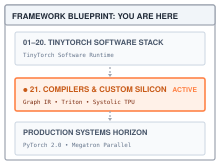
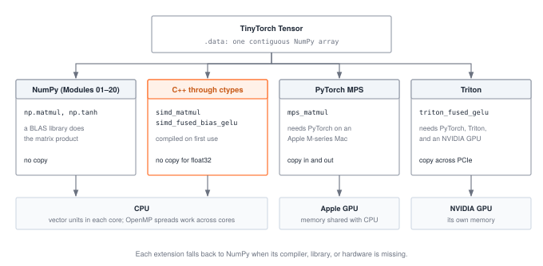
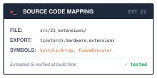

# Extensions: Leaving NumPy {#sec-extensions}

::: {.column-margin}
{width="100%" fig-alt="TinyTorch execution datapath blueprint highlighting the Extensions chapter between the TinyTorch software stack and the hardware."}

*Framework Blueprint: the optional extensions call compiled kernels from TinyTorch, one level below NumPy.*
:::


Every module so far bottoms out in NumPy. When TinyTorch multiplies two matrices, it hands the arrays to `np.matmul`, and a library someone else wrote does the arithmetic. This chapter goes one level down: leaving interpreted Python runtimes to compile and execute custom kernels directly on physical hardware.

In industrial deep learning, writing custom C++ or GPU kernels is bridged through PyTorch's native extension mechanisms:

```python
import torch
from torch.utils.cpp_extension import load_inline

# Compiling and invoking a native C++ extension directly from Python
cpp_source = """
torch::Tensor fused_gelu_cpp(torch::Tensor x) {
    return torch::gelu(x);
}
"""
custom_ext = load_inline(
    name="custom_ext",
    cpp_sources=cpp_source,
    functions=["fused_gelu_cpp"]
)

x = torch.randn(1024, 1024)
out = custom_ext.fused_gelu_cpp(x)
```

Underneath that inline extension, the runtime crosses the boundary between high-level Python and physical machine code:
1. **Foreign Function Interface (FFI) pointer passing:** The runtime extracts the physical DRAM address pointer (`data_ptr`) from the Tensor descriptor and passes it across the language boundary without duplicating memory.
2. **Native machine compilation:** A C++ compiler (such as Clang or GCC) compiles source code into a shared library (`.so` or `.dylib`), emitting vectorized SIMD instructions (AVX-512 or ARM NEON).
3. **Hardware accelerator dispatch:** On GPUs, kernels written in Triton or CUDA bypass interpreted runtime overhead completely, allocating threadblocks and shared memory tiles directly on hardware streaming multiprocessors.

TinyTorch ships three optional extensions in `tinytorch.extensions`: C++ through `ctypes`, Triton on NVIDIA GPUs, and PyTorch MPS on Apple Silicon (@fig-extension-paths). Before building these extensions, we must examine why high-level Python loops forfeit hardware speed and why compiled control is necessary.

{#fig-extension-paths width="100%" fig-alt="A TinyTorch Tensor at the top branches to four routes: NumPy, C++ through ctypes, PyTorch MPS, and Triton. NumPy and C++ run on the CPU, MPS on the Apple GPU, and Triton on an NVIDIA GPU. The two GPU routes copy data in and out. Each extension falls back to NumPy."}

---

::: {.column-margin}
**↩ Jump back:** @sec-acceleration
*`tiled_matmul` and `fused_gelu` expressed tiling and fusion in NumPy; here the same ideas are compiled.*
:::


@sec-acceleration expressed two optimizations in NumPy. `tiled_matmul` walked a matrix product in 64 × 64 blocks, and `fused_gelu` wrote GELU as a single expression. Both still hand every block of arithmetic to NumPy, so neither controls what happens inside a block. Writing the loops in Python instead gives that control and throws away the speed. The function below is a matrix product over Python lists, with the loops in the same order the C++ kernel will use.

```python
def matmul_loops(A, B):
    M, K, N = len(A), len(A[0]), len(B[0])
    C = [[0.0] * N for _ in range(M)]
    for i in range(M):
        for k in range(K):
            a_ik = A[i][k]
            for j in range(N):
                C[i][j] += a_ik * B[k][j]
    return C
```

On a 128 × 128 product it runs at 0.12 billion floating-point operations per second (GFLOP/s) on my machine. A 1024 × 1024 product needs $2 \times 1024^3$, about 2.1 billion, operations, which at that rate would take about 17 seconds. `np.matmul` finishes it in 1.33 ms.

Between those two numbers lies everything a kernel writer controls. That includes the language the loop is compiled from, whether the loop uses the processor's vector units, how the loop order treats the cache, how many cores run, and whether the arithmetic moves to a different processor altogether. The extensions let you change these one at a time and measure each.

## The Idea

::: {.column-margin}
**↩ Jump back:** @sec-tensors
*A Tensor's data is one NumPy array over one block of memory, which is what makes handing it to C possible.*
:::


### Cross the language boundary without copying

A NumPy array of `float32` values is a pointer to a contiguous block of memory plus a shape. Compiled code needs only the pointer and the dimensions. The `ctypes` module in Python's standard library loads a compiled shared library and calls its functions with exactly those arguments. No values are copied as long as the array is already contiguous `float32`; otherwise `np.ascontiguousarray` makes one converted copy first.

The call itself is not free. On my machine a 1 × 1 `simd_matmul` takes 2.4 µs, against 0.33 µs for `np.matmul` on the same arrays, because `ctypes` converts each argument in Python on every call. That fixed cost disappears inside a 1024 × 1024 product and dominates a tiny one.

### Let the compiler use the vector unit

Each CPU core has vector registers that hold several numbers and apply one instruction to all of them. On the ARM cores measured here a NEON register holds four `float32` values, and one fused multiply-add instruction updates all four.[^fn-simd-alignment-cache] A C++ compiler emits these instructions without being asked when a loop's iterations are independent and walk memory in order. The kernel's innermost statement, `c_row[j] += a_ik * b_row[j]`, is written for exactly that. It walks two rows from left to right with one fixed scalar `a_ik`. Compiling the same file with the vectorizer switched off isolates the effect, which comes to a factor of 3.4 (@tbl-extensions-gemm), close to the four lanes of the register.

### Keep the working set in cache

Loop order matters as much as the instructions. In `i, k, j` order the inner loop reads `B` and updates `C` along rows, so consecutive iterations touch consecutive addresses. The kernel also tiles all three loops in blocks of 64, with the same reasoning as `tiled_matmul`. A 64 × 64 tile of `float32` values is 16 KB, and the three tiles in use at once, 48 KB in all, fit in the 128 KB first-level data cache of the cores measured here.

### Fuse only what memory limits

Fusion saves memory traffic. In NumPy, `x + bias` followed by GELU writes the sum to memory and reads it back; a fused loop keeps it in a register. That saving helps only when memory traffic is what limits the loop, and GELU contains a hyperbolic tangent, which costs far more than a load. On a 4096 × 768 array, `x + bias` takes 0.37 ms on my machine and `np.tanh` takes 2.10 ms (@tbl-extensions-gelu). A fused kernel that computes its tangent one element at a time is slower than NumPy's unfused expression, whose `np.tanh` uses the vector unit. Fusion pays off only once the arithmetic inside the fused loop is vectorized as well.

### Move work to a device, and pay for the trip

A GPU runs thousands of arithmetic lanes, but it computes on data in memory it can reach. An NVIDIA GPU has its own memory across a PCIe link, so `triton_fused_gelu` copies `x` to the GPU, runs the kernel, and copies the result back. Apple silicon shares one memory between CPU and GPU. That removes the PCIe link but not every copy, because `mps_matmul` still moves its arrays into buffers the GPU owns and back out. Offloading is worth it only when the time the GPU saves exceeds the time the copies and the launch cost.

::: {#nbk-extensions-offload .callout-napkin-math title="Napkin math: which operations pay for the trip"}
Count the work an operation does for each byte it moves.

- **Matrix multiply**, $n \times n$ by $n \times n$ in `float32`: $2n^3$ operations on $3n^2$ values of 4 bytes each, so $2n^3 / 12n^2 = n/6$ operations per byte moved. For $n = 256$ that is about 43; for $n = 4096$, about 683. The larger the product, the more arithmetic each copied byte pays for.
- **Bias-plus-GELU**, any size: about a dozen arithmetic operations and one tangent per element, on 4 bytes read and 4 bytes written. The ratio does not grow with the array, so a lone GELU seldom pays for its own round trip.

Inside a model the data stays on the device from one layer to the next, so the copies happen once and the kernels run many times. Each call to an extension in this chapter pays the copies again, which is the worst case for offloading.
:::

## The Code

::: {.column-margin}
{width="100%" fig-alt="Source code mapping card for the Extensions chapter: files in tinytorch/extensions/, imported as tinytorch.extensions, hand-written rather than exported."}

*Source Code Mapping: the extensions live in `tinytorch/extensions/` and are the one part of the package not exported from `src/`.*
:::

Everything in this section lives in `tinytorch/extensions/`. Unlike the rest of the package, these files are written by hand rather than exported from `src/`, so they are the files to edit when you experiment.

### Calling the kernel

`simd_matmul` is the Python side of the C++ matrix multiply.



`compile_and_load_simd` returns the loaded library, compiling it first if needed, or `None` if there is no working compiler; in that case the function falls back to `np.matmul`. The two `np.ascontiguousarray` calls guarantee what the C code assumes, one row-major block of `float32` values per matrix, and they cost nothing when the input already has that form. The shape check has to happen here, before the call. C code handed mismatched dimensions does not raise an error; it reads past the end of a buffer. The output is allocated with `np.empty` because the kernel overwrites every element, and `_ptr` passes each array's data pointer as a `float*`.

### Building it where it runs

The library is compiled on the student's machine, not shipped, because the right instructions depend on the processor.



`_compile` makes up to two attempts. The first adds the OpenMP flags if `_openmp_flags` found a runtime; the second builds the same source without them, and the OpenMP pragmas in the kernel are then ignored. The finished library replaces the old one with `os.replace`, which is atomic, so two processes importing TinyTorch at once never load half a file. `_arch_flags` supplies the vector flags for the machine: AVX2 and fused multiply-add on x86, nothing extra on ARM, where NEON is always present. On macOS it adds `-fveclib=Accelerate`, which lets the compiler replace a scalar `std::tanh` in a loop with a vector version from Apple's Accelerate library. `simd_build_info()` reports what the build produced, including the thread count, so a single-threaded build is never mistaken for a parallel one.

### The matrix multiply kernel



The function sits inside an `extern "C"` block in the source file, so its name is not mangled and `ctypes` can find it as `tinytorch_cpp_gemm`. The `__restrict__` qualifiers promise the compiler that `A`, `B`, and `C` do not overlap. Without that promise it would have to assume a store to `C` might change `B` and could not safely vectorize the inner loop.

The kernel zeroes `C`, then visits it in 64 × 64 output tiles. For each output tile at column `sj` and row `si`, the `sk` loop walks the shared dimension one tile at a time and accumulates each tile product into the same block of `C`. The `#pragma omp parallel for collapse(2)` line hands the output tiles, the `(sj, si)` pairs, to different threads when OpenMP is enabled. Each thread owns whole tiles of `C`, so no two threads ever write the same element. The `sk` loop stays inside one thread because every step adds to the same tile.

Inside a tile the loops run in `i, k, j` order, as in `matmul_loops`. The inner loop loads `c_row[j]` and `b_row[j]`, multiplies and adds, and stores `c_row[j]` back, so every fused multiply-add costs two loads and a store. That ratio, not the arithmetic, is what limits this kernel, and it is the first thing a tuned library changes.

### The fused bias-plus-GELU kernel



The kernel treats `X` as one flat array of `total_elements` values whose last axis has length `inner_dim`. `idx % inner_dim` gives the column of each element, and therefore which bias value to add, which is broadcasting written out by hand. Each element is read once, carried through the whole formula in local variables, and written once; the sum `x + bias` never reaches memory.

An earlier version of this kernel computed the tangent as $(e^{2z} - 1)/(e^{2z} + 1)$. In `float32`, $e^{2z}$ overflows to infinity once $z$ exceeds about 44, which happens for inputs above about 10, and infinity divided by infinity is `NaN`. `std::tanh` saturates at $\pm 1$ instead. The regression test for this kernel now feeds it inputs far above 10.

### The same fusion in Triton

A Triton kernel describes the work of one block of elements. Triton compiles it for the GPU and runs one instance, called a program, per block.



`tl.program_id(0)` says which block this program handles, and `offsets` lists its `BLOCK_SIZE` element indices.[^fn-triton-compiler-swizzling] The last block usually extends past the end of the array, so `mask` switches off the lanes that would read or write out of bounds. The bias index is the same modulo as in the C++ kernel. The formula is computed on whole blocks at once, and the tangent comes from the identity $\tanh(z) = 2\sigma(2z) - 1$ because `tl.sigmoid` is available in every Triton release. `tl.store` writes the finished block, which is the only write the kernel makes. The Python wrapper, `triton_fused_gelu`, copies the arrays to the GPU, launches one program per block, and copies the result back. This path needs an NVIDIA GPU, which the machine measured in this chapter does not have, so it has no timing here.

### The Apple GPU path



`mps_matmul` is three lines of PyTorch. `.to("mps")` copies each input into a buffer the GPU owns, `torch.matmul` queues the product on the GPU, and `.cpu()` waits for the GPU to finish and copies the result back. The function is a thin wrapper by design, since the point is not the matrix multiply, which Apple's Metal Performance Shaders library supplies, but what it costs to send work to another processor.

## A Worked Trace

### One tile by hand

Take $A = \begin{pmatrix} 1 & 2 \\ 3 & 4 \end{pmatrix}$ and $B = \begin{pmatrix} 5 & 6 \\ 7 & 8 \end{pmatrix}$. With $M = K = N = 2$, every tile loop runs once, and `i_max`, `j_max`, and `k_max` are all 2, because the only tile is a partial one. @tbl-extensions-gemm-trace follows the two inner loops. Each row adds `a_ik` times one row of `B` to one row of `C`; the vectorized loop does that addition for all of `j` at once.

| `i` | `k` | `a_ik` | `b_row` | `c_row` after the step |
| :---: | :---: | :---: | :---: | :---: |
| 0 | 0 | 1 | $(5, 6)$ | $(5, 6)$ |
| 0 | 1 | 2 | $(7, 8)$ | $(19, 22)$ |
| 1 | 0 | 3 | $(5, 6)$ | $(15, 18)$ |
| 1 | 1 | 4 | $(7, 8)$ | $(43, 50)$ |

: **Inner loops of `tinytorch_cpp_gemm` on a 2 × 2 product.** Row $i$ of $C$ is complete after its last $k$ step, so the rows of $C$ are $(19, 22)$ and $(43, 50)$. {#tbl-extensions-gemm-trace tbl-colwidths="[10,10,14,26,40]"}

For a 130 × 130 product the tile loops start at 0, 64, and 128, so each dimension has two full tiles and one of width 2. There are nine output tiles, the `(sj, si)` pairs that OpenMP would share among threads, and each accumulates three tile products along `sk`, 27 in all. The corner tile computes a 2 × 2 block of `C`, and the `std::min` bounds keep every loop inside the arrays.

### The fused GELU on four values

Feeding the row $x = (1.0, -2.0, 0.5, 3.0)$ with a bias of $0.1$ in every column through `simd_fused_bias_gelu` returns $(0.9506, -0.0545, 0.4354, 3.0974)$. For the first element, `val` is $1.1$, `inner` is $\sqrt{2/\pi}\,(1.1 + 0.044715 \times 1.331) \approx 0.9252$, its tangent is about $0.7283$, and $0.5 \times 1.1 \times 1.7283 \approx 0.9506$. Those intermediates live in registers for one element and are gone before the next.

### The measurements

@tbl-extensions-gemm times a 1024 × 1024 `float32` product five ways. The C++ and tiled results match `np.matmul` to within float32 rounding.

| Implementation | Time | GFLOP/s |
| :--- | ---: | ---: |
| `matmul_loops`, Python (128 × 128 product) | 33.9 ms | 0.12 |
| C++ kernel, vectorizer switched off | 336 ms | 6.4 |
| `simd_matmul` | 99.4 ms | 21.6 |
| `tiled_matmul` from @sec-acceleration | 18.5 ms | 116 |
| `np.matmul` | 1.33 ms | 1,611 |

: **Matrix multiply, 1024 × 1024, on one Apple M5 Max.** Medians of repeated runs; the C++ library is single-threaded. The Python row uses a smaller product because the full one would take about 17 seconds. {#tbl-extensions-gemm tbl-colwidths="[52,24,24]"}

Compiling the loop gains a factor of 50 over Python, and vectorizing it another 3.4. The row below it is humbling. `tiled_matmul`, with its tile loops in interpreted Python, is five times faster than the compiled kernel, because each 64 × 64 tile product it computes is a call to NumPy's library. That library is another fourteen times faster again. Limiting it to one thread did not change its rate on this machine, so the difference is not extra cores. A tuned matrix library keeps a small block of `C` in registers for the whole `k` loop, so each multiply-add needs a fraction of a load instead of two loads and a store. It also packs tiles of `A` and `B` into the order the inner loop reads them.

@tbl-extensions-gelu times bias-plus-GELU on a 4096 × 768 `float32` array, 12.6 MB, the activations of a 768-wide transformer layer for 4,096 tokens.

| Implementation | Time |
| :--- | ---: |
| `fused_gelu` from @sec-acceleration, after `x + bias` | 26.5 ms |
| NumPy expression with `z * z * z` in place of `z ** 3` | 4.33 ms |
| C++ fused kernel, scalar `std::tanh` | 22.1 ms |
| `simd_fused_bias_gelu`, vector tangent | 3.06 ms |
| *Pieces:* `x ** 3` alone | 16.6 ms |
| *Pieces:* `x * x * x` alone | 0.46 ms |
| *Pieces:* `x + bias` alone | 0.37 ms |
| *Pieces:* `np.tanh(x)` alone | 2.10 ms |

: **Bias plus GELU, 4096 × 768, on the same machine.** Medians of repeated runs; outputs agree to within $5 \times 10^{-7}$. {#tbl-extensions-gelu tbl-colwidths="[76,24]"}

The largest single effect has nothing to do with fusion. NumPy computes `x ** 3` through a general power routine that takes 16.6 ms, while `x * x * x` takes 0.46 ms, so rewriting one term of @sec-acceleration's expression speeds it up six times. The fused C++ kernel with a scalar tangent is then five times slower than that NumPy expression. With the vector tangent it is 1.4 times faster. Fusion saved the traffic of the intermediate arrays in both kernels, and only the one whose arithmetic kept pace was able to show it.

@tbl-extensions-mps times `mps_matmul` against `np.matmul` at four sizes. The third column is the GPU product alone, timed with the inputs already on the GPU.

| $n$ | `np.matmul` | `mps_matmul` | GPU product alone |
| ---: | ---: | ---: | ---: |
| 256 | 0.02 ms | 0.72 ms | 0.21 ms |
| 1024 | 1.28 ms | 1.06 ms | 0.37 ms |
| 2048 | 10.4 ms | 2.53 ms | 1.39 ms |
| 4096 | 86.9 ms | 14.2 ms | 10.1 ms |

: **Matrix multiply on the Apple GPU through MPS, same machine**, measured with PyTorch 2.14 installed in a separate environment. `mps_matmul` includes both copies; the last column does not. {#tbl-extensions-mps tbl-colwidths="[16,28,28,28]"}

At $n = 256$ the GPU path is about 30 times slower than NumPy; most of its time is the trip, not the product. The two break even near $n = 1024$, and at $n = 4096$ the GPU path is six times faster even with the copies included. As the napkin math's $n/6$ predicts, the advantage grows with $n$.

## From TinyTorch to Production

::: {.column-margin}
**↩ Jump back:** @sec-milestone-3
*The benchmarking scorecard applies to kernels too: same inputs, checked outputs, measured time.*
:::


The mechanisms here are the ones production frameworks use. What differs is how much of the surrounding system takes part in them.

**Custom operators, not `ctypes`.** A production framework registers a C++ or CUDA kernel with its operator dispatcher; PyTorch documents this as [custom C++ and CUDA operators](https://docs.pytorch.org/tutorials/advanced/cpp_custom_ops.html). A registered operator takes tensors instead of raw pointers, checks devices and dtypes once in C++, can declare a backward function so autograd can differentiate through it, and works under the framework's compiler. The `ctypes` extensions here do none of that. They take NumPy arrays and return NumPy arrays, and TinyTorch's autograd cannot see inside them.

**Libraries for the matrix product.** Frameworks almost never ship their own matrix multiply for a CPU or GPU. They call a tuned library, such as Accelerate, OpenBLAS, or oneMKL on CPUs and cuBLAS or CUTLASS on NVIDIA GPUs, because @tbl-extensions-gemm is typical: a clear, correct, vectorized kernel is still far from what the library achieves. Custom kernels are written for the operations libraries do not cover, most often fused chains like bias-plus-GELU.

**Generated kernels for the fused chains.** As @sec-acceleration described, `torch.compile` finds chains of elementwise operations in a model and generates Triton kernels for them on NVIDIA GPUs. The Triton kernel in this chapter is the kind a compiler writes for you.

**Data that stays on the device.** A framework moves a model's weights to the GPU once and keeps each layer's activations there. Only the inputs and the final results cross back. TinyTorch's Tensor holds a NumPy array, so every GPU extension call is a full round trip, the worst case in @tbl-extensions-mps.

| Layer | TinyTorch extension | Production counterpart |
| :--- | :--- | :--- |
| Calling compiled code | `ctypes` and raw pointers | Operators registered with the framework's dispatcher |
| Matrix multiply | Tiled, vectorized C++ loop | Tuned vendor library |
| Fused elementwise chains | Hand-written C++ and Triton kernels | Kernels generated by a compiler, hand-written for the rest |
| GPU data | Copied in and out on every call | Kept on the device across layers |
| Gradients | None; autograd cannot see inside | Backward functions registered with each operator |

: **What changes between the extensions and a production framework.** The kernels are recognizable; the integration around them is what production adds. {#tbl-extensions-production tbl-colwidths="[22,36,42]"}

## Summary

The extensions take a TinyTorch computation below NumPy in three ways. `simd_matmul` and `simd_fused_bias_gelu` pass NumPy's data pointers to C++ compiled on the student's machine. `triton_fused_gelu` runs the fused kernel as block programs on an NVIDIA GPU. `mps_matmul` sends a product to the Apple GPU. Each checks its inputs before handing over a pointer, because compiled code does not check them, and each falls back to NumPy when it cannot run.

The measurements carry the lesson. Compiling and vectorizing a loop gains a factor of 170 over Python, and a tuned library is still 75 times faster than that loop. Fusion saves memory traffic, but the gain appears only when the arithmetic inside the fused loop keeps up, and on this workload rewriting one power as two multiplications mattered more. Offloading to a GPU pays only once the work is large enough to cover the copies. None of this was visible from the code alone, and all of it was visible from one table of timings.

The invariant to carry out of the book is the one this chapter tested on its own kernels. An optimization has paid off only when its output has been checked against a reference and its time has been measured on the workload that matters.

[^fn-simd-alignment-cache]: Modern SIMD execution units (e.g., 128-bit ARM NEON, 256-bit x86 AVX2, or 512-bit AVX-512) achieve peak throughput when memory operands are naturally aligned to the vector register width (16, 32, or 64 bytes). When an unaligned vector load straddles a 64-byte CPU cache line boundary, the hardware memory subsystem must issue two separate cache access transactions and splice the result in the processor load buffer, incurring throughput penalties. Production BLAS implementations routinely pad matrix row strides to multiples of 64 bytes to guarantee full cache line alignment.

[^fn-triton-compiler-swizzling]: In traditional CUDA C++, the programmer must explicitly partition thread grids, choreograph intra-warp shuffles, manage shared memory (`__shared__`) buffers, and apply hand-tuned index swizzling permutations to avoid bank conflicts across the 32 hardware memory banks. Triton operates at a higher abstraction: the developer writes SPMD block-level tensor algorithms, and the Triton compiler automatically generates coalesced global memory transactions, bank-conflict-free shared memory layouts, and asynchronous copy pipelines (`cp.async` on NVIDIA Ampere/Hopper).

## Further reading

- Goto and van de Geijn (2008), [Anatomy of high-performance matrix multiplication](https://doi.org/10.1145/1356052.1356053), *ACM TOMS*. Register blocking and packing, the two techniques that separate `simd_matmul` from a tuned library.
- Van Zee and van de Geijn (2015), [BLIS: a framework for rapidly instantiating BLAS functionality](https://doi.org/10.1145/2764454), *ACM TOMS*. How a matrix library is built from one small hand-tuned kernel.
- Tillet, Kung, and Cox (2019), [Triton: an intermediate language and compiler for tiled neural network computations](https://doi.org/10.1145/3315508.3329973), *MAPL*. The design behind the block programs in `triton_gelu.py`.
- The Python documentation for [`ctypes`](https://docs.python.org/3/library/ctypes.html), which covers loading libraries, declaring argument types, and passing buffers.
