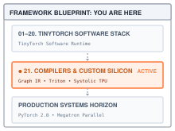
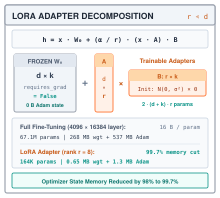
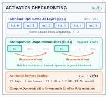
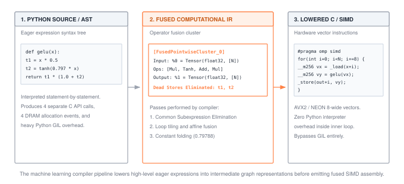
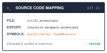
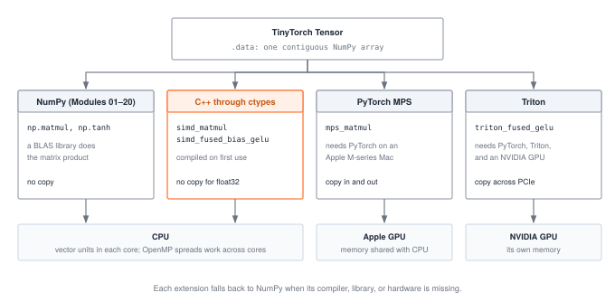
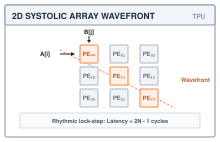

# Extending TinyTorch {#sec-extensions}

::: {.column-margin}
{width="100%" fig-alt="TinyTorch execution datapath blueprint highlighting the Extensions chapter between the TinyTorch software stack and the hardware."}

*Framework Blueprint: the optional extensions connect the core 20-module TinyTorch stack to hardware kernels, compilation, and production memory optimization.*
:::

## The Core Framework and the Extensibility Dilemma

Across Modules 01 through 20 (@sec-tensors through @sec-capstone), the preceding chapters constructed a complete, self-contained deep learning framework from bare silicon concepts up to modern generative AI:

- An n-dimensional array abstraction with arbitrary striding and slicing (@sec-tensors)
- A reverse-mode automatic differentiation tape with topological backpropagation (@sec-autograd)
- Composable parametric layers, activations, loss functions, and optimizers (@sec-layers, @sec-activations, @sec-losses, @sec-optimizers)
- Data ingestion pipelines, multi-headed self-attention, and autoregressive GPT transformers (@sec-dataloader, @sec-attention, @sec-transformers)
- Execution profiling, uniform INT8 quantization, weight pruning, and MLPerf benchmarking (@sec-profiling, @sec-quantization, @sec-compression, @sec-benchmarking)

Every single module in the core operates on a shared, unified execution contract. A `Tensor` encapsulates contiguous memory; a `Function` records forward and backward transformations on the autograd tape; a `Layer` manages trainable parameters; an `Optimizer` executes step updates.

Yet in modern deep learning systems, the core runtime is only the beginning. When neural networks scale to billions of parameters, or when production serving demands microsecond latencies, frameworks face an architectural dilemma:

1. **The Monolithic Framework Trap:** Shoveling every emerging systems optimization (low-rank adapters, activation checkpointing, custom GPU kernels, mixed-precision loss scaling, graph compilers) directly into the core framework causes it to balloon into a brittle monolith where bugs in experimental kernels destabilize the core autograd engine.
2. **The Extensibility Model:** Keep the engine core minimal, stable, and transparent, while exposing strict, first-class extension points. Every specialized optimization lives as an autonomous extension that plugs cleanly into the core contracts.

TinyTorch adopts the extensibility model. The 20 core modules constitute an immutable foundation. Specialized components, including vectorized C++ CPU kernels, Apple MPS dispatch, OpenAI Triton shaders, parameter-efficient fine-tuning, and graph fusion compilers, live in the `tinytorch.extensions` ecosystem.

---

## Why Not Just Use PyTorch? The Minix and xv6 Lesson

A natural question arises: *Why study and build systems extensions in TinyTorch rather than jumping straight into authoring custom extensions for PyTorch or JAX?*

The answer lies in the classic pedagogical tradition of operating systems education: from John Lions' legendary commentary on Unix 6th Edition, to Andrew Tanenbaum's Minix, to MIT's xv6.

When Linus Torvalds wanted to understand how an operating system truly manages physical hardware, he did not begin by modifying a commercial monolith. He studied Minix, a compact microkernel operating system written by Tanenbaum specifically for teaching. Minix was small enough to be held in a single person's head, yet real enough to demonstrate preemptive scheduling, memory management, and system calls. That tactile understanding gave Linus the foundational mental model to author the initial Linux kernel.

Years later, when MIT redesigned its operating systems curriculum (6.828 / 6.1810), it chose xv6, a modern reimplementation of Unix 6th Edition in 10,000 lines of clean ANSI C. When teaching virtual memory and process scheduling, MIT does not ask students to modify the production Linux kernel. Linux contains over 30 million lines of C, thousands of hardware drivers, lock-less read-copy-update (RCU) primitives, and deep architecture-specific macros. Attempting to implement a simple copy-on-write page allocator in Linux forces a student to spend 90% of their time fighting macro definitions, build harnesses, and kernel ABI wrappers before manipulating a page table. In xv6, the abstraction boundaries are razor-sharp: a student can implement copy-on-write or a priority scheduler in 40 lines of clear C and inspect every page table manipulation directly in physical memory.

PyTorch is the Linux kernel of deep learning. It is an industrial engineering masterpiece, but extending it requires navigating the `TORCH_LIBRARY` dispatcher macros, pybind11 ABI translation layers, internal ATen tensor representations (`c10::TensorImpl`), CUDA stream abstractions, and massive multi-repository CMake build graphs. Writing a custom C++ operator in PyTorch requires dozens of lines of framework glue code just to deliver a tensor pointer to a loop.

TinyTorch is the Minix and xv6 of deep learning systems:

- A `Tensor` is directly backed by a contiguous memory buffer.
- A `Function` has exactly two methods: `forward` and `backward`.
- A `Layer` has exactly two methods: `forward` and `parameters()`.
- An `Optimizer` is a clean iterator over parameter tensors.

Implementing Low-Rank Adaptation (LoRA) in TinyTorch requires about 30 lines of Python to reveal how frozen base weights and trainable low-rank adapters interact with the autograd tape. Writing a SIMD GEMM kernel passes memory addresses across a simple C foreign function interface (FFI) without layers of framework obfuscation; the Apple GPU path, by contrast, borrows PyTorch's MPS backend. The FFI path exposes the unadorned reality of the hardware memory subsystem, CPU vector registers, and cache hierarchy.

---

## The Four Native Extension Points

TinyTorch exposes four native extension points that correspond to the four fundamental boundaries of deep learning execution:

1. **The Autograd Boundary (`Function`):** Subclassing `Function` defines custom forward and backward semantics, intercepting the autograd tape to drop or recompute intermediate activations (as in activation checkpointing).

::: {.column-margin}
**↩ Jump back:** @sec-optimizers
*Adam moment state tensors ($m_t, v_t$) and memory consumption during gradient descent.*

**↩ Jump back:** @sec-autograd
*The autograd tape, topological graph traversal, and intermediate tensor lifetimes.*

**↩ Jump back:** @sec-acceleration
*Hardware cache lines, 2D loop tiling, and register residency.*
:::

2. **The Architectural Boundary (`Layer`):** Subclassing `Layer` introduces custom architectural primitives, freezes pre-trained weight matrices by toggling `requires_grad=False`, and exposes low-rank adapter parameters to the optimizer (as in LoRA).
3. **The Training Dynamics Boundary (`Optimizer`):** Interfacing with `optimizer.params` enables custom gradient transformations, loss scaling for mixed-precision arithmetic, gradient clipping, and advanced update rules (such as Lion or Muon).
4. **The Silicon Boundary (Backend FFI):** Extracting contiguous memory pointers from `Tensor.data` enables invoking native compiled C++ shared libraries via `ctypes`, launching GPU kernels in OpenAI Triton, or offloading computation to the Apple Silicon GPU through PyTorch's MPS backend (which requires `torch`).

### Repository Architecture: Core versus Extensions

To preserve stability, TinyTorch enforces a strict structural separation between the core standard library and the extensions ecosystem:

```text
tinytorch/
├── tinytorch/
│   ├── core/           # 20-module core engine
│   │   ├── tensor.py   # Tensor memory & autograd
│   │   ├── autograd.py # Topological tape
│   │   ├── layers.py   # Linear, Sequential, etc.
│   │   ├── losses.py   # MSE & CrossEntropy
│   │   ├── optimizers.py
│   │   ├── dataloader.py
│   │   ├── attention.py
│   │   └── transformers.py
│   ├── perf/           # Baseline profiling
│   │   ├── profiling.py
│   │   └── benchmarking.py
│   └── extensions/     # Contrib ecosystem
│       ├── template.py # Starter template
│       ├── lora.py     # Parameter-efficient adapters
│       ├── checkpoint.py
│       ├── loss_scaler.py
│       ├── compile.py  # Kernel fusion compiler
│       ├── simd_ops.py # Vectorized C++ kernels
│       ├── mps_ops.py  # Apple Silicon MPS
│       └── triton_gelu.py
└── tests/extensions/   # Parity test suite
```

The `tinytorch/core/` and `tinytorch/perf/` directories contain the standard library exported by Modules 01 through 19; Module 20 exports to `tinytorch/olympics.py`. The `tinytorch/extensions/` directory is the open workshop: every optimization lives as an isolated, importable Python or C++ module that plugs into the core boundaries without modifying core source files.

### The Extension Contract and Starter Template

To ensure that every extension functions harmoniously with the rest of the framework, all extensions adhere to the four-part **Extension Contract**:

1. **Systems Framing:** Every extension must clearly state the physical resource bottleneck it resolves (e.g., DRAM capacity, memory bandwidth, vector register utilization, or floating-point underflow).
2. **Tensor and NumPy Interoperability:** Functions must accept either a TinyTorch `Tensor` or a raw NumPy `ndarray`. When passed a `Tensor`, the function must return a `Tensor` (preserving the computation graph if differentiable). When passed a NumPy array, it must return a NumPy array.
3. **Autograd Transparency:** Operations that participate in backpropagation must explicitly define their mathematical derivatives via `Function.forward` and `Function.backward`.
4. **Graceful Fallback:** If a required compiler, runtime library, or physical GPU accelerator is unavailable, the extension must fall back cleanly to a pure-Python or NumPy reference implementation rather than crashing on import.

TinyTorch provides a canonical starter template in `tinytorch/extensions/template.py` that demonstrates all four properties across every native boundary:

1. **Autograd Function Boundary:** When implementing a custom autograd operator, subclass `Function` and implement the forward and backward transformations:



2. **Architectural Layer Boundary:** When authoring a custom neural network module with learnable parameters, subclass `Layer` and register its parameter tensors:



3. **Training Dynamics Boundary:** When modifying parameter gradients prior to the optimizer step (such as threshold clipping or spectral projection), wrap parameter updates in an in-place transformation:



4. **Silicon Kernel Boundary:** When accelerating operations via compiled C++, Triton, or GPU APIs, encapsulate native dispatch behind runtime feature detection with a transparent pure-NumPy fallback:



#### The 5-Step Extension Recipe

Adding a new capability to TinyTorch follows an explicit five-step protocol:

1. **Identify the Boundary:** Map the optimization to `Function` (math/memory), `Layer` (adapters/primitives), `Optimizer` (gradients/moments), or C-ABI `ctypes` / GPU runtime (silicon).
2. **Copy the Template:** Duplicate `tinytorch/extensions/template.py` to `tinytorch/extensions/<feature_name>.py`.
3. **Implement the Contract:** Satisfy the core invariants: handle both `Tensor` and `np.ndarray`, define backward passes for differentiable operations, and fall back to NumPy if hardware compilers or libraries are missing.
4. **Author Unit Tests:** Duplicate `tinytorch/tests/extensions/test_template.py` to `tinytorch/tests/extensions/test_<feature_name>.py` and verify numerical parity against an unoptimized NumPy reference (`np.allclose(out, ref, atol=1e-5)`).
5. **Register Public Symbols:** Export new classes and functional wrappers in `tinytorch/extensions/__init__.py`.

---

## The Flat Extension Catalog

The sections below examine each primary extension in the TinyTorch ecosystem. In keeping with a rigorous systems focus, artificial groupings are avoided: whether an extension optimizes mathematical parameters, memory lifetimes, numerical precision, or physical silicon execution, each appears as a complete, self-contained systems case study.

Each extension establishes:

1. **The Systems Bottleneck:** The physical hardware constraint being hit.
2. **Architectural Strategy:** How the extension bypasses the constraint.
3. **The Implementation:** The actual source code.
4. **The Scorecard:** Quantitative metrics for the efficiency gain, labeled as measured on a stated machine or as analytical counts.

---

### Extension 1: Parameter-Efficient Fine-Tuning (LoRA)

**The Systems Bottleneck:** Fine-tuning large language models by updating all parameters encounters a severe memory wall. Modern adaptive optimizers such as Adam maintain two 32-bit floating-point state tensors per parameter: the first moment vector $m_t$ (momentum) and the second raw moment vector $v_t$ (variance). Each parameter requires 8 bytes of optimizer state, plus 4 bytes for the stored gradient, plus 4 bytes for the weight itself, totaling 16 bytes per parameter. For a 7-billion parameter model, storing Adam optimizer states alone consumes $7 \times 10^9 \times 8 = 56\text{ GB}$ of memory, far exceeding consumer GPU memory before a single activation is allocated.

**Architectural Strategy:** Low-Rank Adaptation (LoRA) freezes the pre-trained weight matrix $W_0 \in \mathbb{R}^{d \times k}$ by setting `requires_grad=False`. It decomposes the weight update $\Delta W$ into the product of two small, low-rank matrices $A \in \mathbb{R}^{d \times r}$ and $B \in \mathbb{R}^{r \times k}$, where the rank $r \ll \min(d, k)$:
$$h = x W_0 + x \Delta W = x W_0 + x A B$$
Because $W_0$ is frozen, the autograd engine allocates gradients and Adam optimizer states solely for $A$ and $B$, drastically reducing optimizer-state memory while restricting each update to rank $r$.

::: {.column-margin}
{width="100%" fig-alt="LoRA low-rank adapter decomposition diagram contrasting frozen base weight W0 with trainable factor matrices A and B, showing over 98 percent Adam optimizer memory reduction."}

*LoRA Rank Decomposition: The pre-trained base weight $W_0$ is frozen ($requires\_grad=False$), eliminating optimizer momentum and variance states. Training is restricted to low-rank matrices $A$ and $B$, slashing Adam memory overhead by over 98 percent.*
:::

**The Implementation:** `LoRALinear` subclasses `Layer`, holds frozen weights, and trains only the low-rank factor matrices:



::: {.callout-tip title="Pause & Predict: The Memory Economics of Freezing Base Weights"}
Suppose you fine-tune a 7-billion parameter language model in 16-bit precision using the Adam optimizer. Each parameter requires 2 bytes for the weight, 2 bytes for the gradient, and 8 bytes for Adam moment states ($m_t$ and $v_t$ in FP32), totaling 12 bytes of training state per parameter (84 GB). If you freeze all base weights and attach a LoRA adapter with rank $r=16$ affecting 0.2% of the parameters (14 million parameters), how much memory do the frozen base weights require? How much memory do the LoRA parameters and their optimizer states require? What is the total reduction in training memory state?
:::

**The Analytical Scorecard:** Consider a standard transformer feedforward projection layer ($d_{\text{in}} = 4096, d_{\text{out}} = 16384$, totaling 67.1 million parameters). @tbl-lora-memory details the parameter counts and memory footprints across adapter ranks compared to full fine-tuning.

| Configuration | Trainable Parameters | Trainable Weight Memory | Adam State Memory | Memory Reduction |
| :--- | ---: | ---: | ---: | ---: |
| Full Fine-Tuning | 67,108,864 | 268.4 MB | 536.9 MB | Reference (0.0%) |
| LoRA ($r = 64$) | 1,310,720 | 5.2 MB | 10.5 MB | 98.0% |
| LoRA ($r = 16$) | 327,680 | 1.3 MB | 2.6 MB | 99.5% |
| LoRA ($r = 8$) | 163,840 | 0.66 MB | 1.31 MB | 99.8% |
| LoRA ($r = 4$) | 81,920 | 0.33 MB | 0.66 MB | 99.9% |

: **Memory footprint of full fine-tuning versus LoRA on a 4096 × 16384 projection layer.** Counted, not measured. Storing Adam optimizer states (8 bytes per parameter) dominates full fine-tuning; LoRA reduces trainable-weight and optimizer-state memory by more than 98%. The frozen base weight (268.4 MB) stays resident in every row. {#tbl-lora-memory tbl-colwidths="[26,22,18,20,14]"}

---

### Extension 2: Activation Checkpointing

**The Systems Bottleneck:** In deep networks, the autograd tape saves intermediate tensor activations produced by every forward layer to evaluate gradient chain rules during backpropagation. For an $L$-layer transformer with sequence length $T$ and hidden dimension $D$, activation memory scales linearly with depth: $O(L \cdot T \cdot D)$. On long sequences or deep architectures, activation memory quickly dwarfs parameter storage and causes out-of-memory (OOM) crashes during training.

**Architectural Strategy:** Activation Checkpointing (or gradient recomputation) discards intermediate forward activations from memory. The forward pass runs inside a `no_grad()` context, caching only the input boundary tensors between major layer blocks. During backpropagation, the forward pass for each block is recomputed dynamically from the cached boundary tensors. By dividing an $L$-layer network into $\sqrt{L}$ segments, activation memory scaling drops from $O(L)$ to $O(\sqrt{L})$, trading a 33% increase in compute for an 80% reduction in peak activation memory.

**The Implementation:** `checkpoint` wraps any forward callable inside a custom `Function`, detaching inputs during the backward pass to seed local recomputation:

::: {.column-margin}
{width="100%" fig-alt="Activation checkpointing diagram contrasting standard O(L) forward activation retention with checkpointed O(sqrt(L)) boundary storage and backward recomputation."}

*Activation Checkpointing: Standard autograd holds all $L$ layer activations in memory. Checkpointing stores only boundary tensors ($O(\sqrt{L})$), recomputing intermediate activations during backpropagation to reduce peak memory by up to 80 percent at a 33 percent compute overhead.*
:::



**The Analytical Scorecard:** @tbl-checkpoint-scaling models activation memory for transformers of increasing depth $L$ ($T = 2048, D = 4096$) with and without activation checkpointing. It assumes 1.05 GB of saved activations per layer and a boundary tensor of $T \cdot D \cdot 4 = 33.6$ MB, so $\sqrt{L}$ segments hold $M = \sqrt{L}\,b + (L/\sqrt{L})\,A$.[^fn-activation-checkpointing-sqrt]

| Layer Depth ($L$) | Standard Forward Memory | Checkpointed Memory | Compute Overhead | Peak Memory Saved |
| ---: | ---: | ---: | ---: | ---: |
| 8 Layers | 8.4 GB | 3.06 GB | +33.3% | 63.5% |
| 16 Layers | 16.8 GB | 4.33 GB | +33.3% | 74.2% |
| 32 Layers | 33.6 GB | 6.13 GB | +33.3% | 81.8% |
| 64 Layers | 67.2 GB | 8.67 GB | +33.3% | 87.1% |

: **Modeled activation memory under activation checkpointing ($T = 2048, D = 4096$, float32).** Standard training scales linearly $O(L)$; checkpointing scales sublinearly $O(\sqrt{L})$ with uniform segments. {#tbl-checkpoint-scaling tbl-colwidths="[18,24,22,18,18]"}

[^fn-activation-checkpointing-sqrt]: **Activation checkpointing trade-offs**: In an $L$-layer neural network, standard autograd retains $L$ activation tensors in memory, scaling as $\mathcal{O}(L)$. Checkpointing segments the model into $k$ subgraphs of length $m = L / k$, storing only the boundary activations. Minimizing total peak memory $M(k) = k + L / k$ yields an optimal segment length $k^* = L^{1/2}$, cutting peak memory from $\mathcal{O}(L)$ to $\mathcal{O}(L^{1/2})$. The cost is exactly one extra forward pass per segment during backpropagation, adding a deterministic $33\%$ computational overhead.

---

### Extension 3: Mixed-Precision Loss Scaling

**The Systems Bottleneck:** Training deep models in 16-bit floating-point (FP16) halves memory consumption and doubles compute throughput. However, IEEE 754 half-precision float16 allocates only 5 bits for the exponent, providing an exponent range of $[-14, 15]$. Its smallest positive normalized number is $2^{-14} \approx 6.1 \times 10^{-5}$, and its absolute minimum subnormal representation is $2^{-24} \approx 5.96 \times 10^{-8}$. Backpropagation gradients in deep neural networks often fall below $10^{-5}$. In raw FP16, these small gradient values silently underflow to exact zero, extinguishing parameter updates and causing training to diverge.

**Architectural Strategy:** Loss scaling multiplies the scalar loss by a large constant factor $S$ (e.g., $S = 65,536 = 2^{16}$) immediately before calling `.backward()`. By the linearity of differentiation:
$$\nabla_\theta (S \cdot \mathcal{L}) = S \cdot \nabla_\theta \mathcal{L}$$
Scaling shifts small gradient values up by 16 bits into the center of the normal FP16 exponent range, completely preventing underflow during backward tape traversal. Before the optimizer applies its parameter update, the gradients are unscaled by dividing by $S$:
$$\nabla_\theta \mathcal{L} = \frac{1}{S} \nabla_\theta (S \cdot \mathcal{L})$$

**The Implementation:** `LossScaler` manages the scaling lifecycle and directly unscales gradients across registered optimizer parameters:



**The Numerical Scorecard:** @tbl-loss-scaler-underflow shows the IEEE 754 rounding behavior of small backpropagation gradients in unscaled FP16 versus scaled FP16.

| True Gradient Magnitude ($\nabla \mathcal{L}$) | Raw FP16 Result | Status | Scaled ($S = 65536$) FP16 | Unscaled Gradient | Error |
| :--- | :--- | :--- | :--- | :--- | :--- |
| $1.0 \times 10^{-3}$ | $1.000 \times 10^{-3}$ | Preserved | $65.536$ | $1.000 \times 10^{-3}$ | 0.0% |
| $5.0 \times 10^{-5}$ | $5.001 \times 10^{-5}$ | Subnormal precision loss | $3.2768$ | $5.000 \times 10^{-5}$ | 0.0% |
| $1.0 \times 10^{-7}$ | $1.192 \times 10^{-7}$ | Subnormal, 19% error | $0.006554$ | $1.000 \times 10^{-7}$ | 0.0% |
| $2.0 \times 10^{-9}$ | $0.0$ | **Silent underflow to zero** | $0.000131$ | $2.000 \times 10^{-9}$ | 0.0% |

: **Numerical stability of gradient propagation under IEEE 754 float16.** Unscaled FP16 rounds values below about $2.98 \times 10^{-8}$ (half the smallest subnormal) to zero; loss scaling preserves gradients across four additional orders of magnitude. {#tbl-loss-scaler-underflow tbl-colwidths="[24,18,22,18,18]"}

---

### Extension 4: Graph Capture and Fusion Compiler

**The Systems Bottleneck:** In dynamic, define-by-run execution, every mathematical operator is an isolated function call that reads its operands from DRAM, computes results in registers, and writes the output tensor back to DRAM. Consider an elementwise chain such as:
$$y = (x + \text{bias}) \cdot \text{scale}$$
In eager execution, two separate kernel invocations occur:

1. $t = x + \text{bias}$ (reads $x$ and $\text{bias}$, writes intermediate tensor $t$ to DRAM)
2. $y = t \cdot \text{scale}$ (reads intermediate tensor $t$ and $\text{scale}$, writes output $y$ to DRAM)
If `bias` and `scale` are full-size arrays of $N$ elements, this sequence reads $4N$ floating-point words ($x$, $\text{bias}$, $t$, $\text{scale}$) and writes $2N$ ($t$, $y$), 24 bytes per element across the memory bus. Because modern processor ALUs compute far faster than memory buses can transfer bytes, eager execution is severely memory-bandwidth bound.

**Architectural Strategy:** A graph compiler intercepts the dynamic define-by-run tape and traces it into a static Intermediate Representation (IR) Abstract Syntax Tree (AST). It then fuses adjacent elementwise operations into a single combined kernel loop (@fig-compiler-fusion). In the fused loop, the intermediate sum $t = x + \text{bias}$ remains in a CPU or GPU register and is multiplied by $\text{scale}$ immediately, writing to DRAM only once.

{#fig-compiler-fusion width="100%" fig-alt="Compilation lowering diagram showing AST capture and fusion into a single loop."}

**The Implementation:** `compile_graph` traces symbolic `TracedNode` objects into a single Python expression string. It demonstrates graph capture; the emitted function still runs NumPy operators, which allocate the intermediate:



**The Analytical Scorecard:** @tbl-fusion-traffic counts DRAM transfers for eager define-by-run execution and for a hypothetical fused loop that keeps $t$ in registers, on the two-operation elementwise chain ($N = 10^7$ float32 elements, 40 MB per full-size tensor). It assumes `bias` and `scale` are full-size arrays.

| Execution Strategy | DRAM Reads | DRAM Writes | Total DRAM Traffic | Bandwidth Saved |
| :--- | :--- | :--- | ---: | ---: |
| Eager Define-by-Run | $x, \text{bias}, t, \text{scale}$ (160 MB) | $t, y$ (80 MB) | 240 MB | Reference (0.0%) |
| Fused Single Loop | $x, \text{bias}, \text{scale}$ (120 MB) | $y$ (40 MB) | 160 MB | **33.3% reduction** |

: **DRAM traffic counts for an elementwise chain with full-size operands.** A fused loop removes the write and reread of $t$, 80 MB of 240 MB, a 33% reduction. If `bias` and `scale` are broadcast scalars, eager traffic is 160 MB and fused traffic 80 MB, a 50% reduction. The Python function that `compile_graph` emits still materializes $t$. {#tbl-fusion-traffic tbl-colwidths="[26,26,20,16,12]"}

---

### Extension 5: Vectorized CPU Execution (SIMD GEMM)

::: {.column-margin}
{width="100%" fig-alt="Source code mapping card for the Extensions chapter: files in tinytorch/extensions/, imported as tinytorch.extensions, hand-written rather than exported."}

*Source Code Mapping: the extensions live in `tinytorch/extensions/` and are written directly rather than exported from `src/`.*
:::

**The Systems Bottleneck:** Python is an interpreted language. Executing matrix multiplication using naive triple-nested Python loops incurs catastrophic bytecode evaluation overhead:

```python
def matmul_loops(A, B):
    M, K, N = len(A), len(A[0]), len(B[0])
    C = [[0.0] * N for _ in range(M)]
    for i in range(M):
        for k in range(K):
            a_ik = A[i][k]
            for j in range(N):
                C[i][j] += a_ik * B[k][j]
    return C
```

On a 128 × 128 product, this loop runs at just 0.12 GFLOP/s. For a standard 1024 × 1024 matrix ($2 \times 1024^3 \approx 2.15\text{ billion FLOPs}$), Python would take approximately 18 seconds. In contrast, NumPy's underlying BLAS library computes it in 1.33 ms.

**Architectural Strategy:** To bridge this gap, `simd_matmul` bypasses the Python interpreter via `ctypes` FFI:

1. **Contiguous Pointer Passing:** Extracts raw memory addresses (`.data.ctypes.data_as`) without copying memory.
2. **Cache-Blocked Tiling:** Tiles the matrix traversal in 64 × 64 blocks, ensuring that active working sets (48 KB) reside inside the 128 KB L1 data cache.
3. **SIMD Vectorization:** Arranges inner loops in $i, k, j$ order so that memory access along `b_row[j]` and `c_row[j]` is contiguous, allowing compiler auto-vectorization (AVX2 on x86, ARM NEON on Apple Silicon).[^fn-simd-register-widths]
4. **OpenMP Multithreading:** Distributes output tiles across CPU cores using `#pragma omp parallel for collapse(2)`.

[^fn-simd-register-widths]: **SIMD register widths across architectures**: A single Instruction Multiple Data (SIMD) register holds multiple adjacent data values: 128-bit ARM NEON holds 4 float32 values, 256-bit AVX2 holds 8 float32 values, and 512-bit AVX-512 holds 16 float32 values. Modern 2D systolic arrays (such as Google TPUs and Apple Neural Engine) expand vector registers into two-dimensional multiply-accumulate matrices, executing outer products in lock-step across hundreds of processing elements without intermediate register writebacks.

**Pedagogical Choice: Why ctypes instead of pybind11?** Modern PyTorch C++ extensions typically rely on pybind11 and `TORCH_LIBRARY` registration macros to bind native operators into Python. While pybind11 provides seamless class wrapping and exception propagation, it also conceals the actual memory boundary behind layers of C++ template metaprogramming. TinyTorch deliberately chooses Python's built-in `ctypes` foreign function interface: by extracting a raw pointer from the underlying buffer (`tensor.data.ctypes.data_as(ctypes.POINTER(ctypes.c_float))`), the developer directly confronts the C-ABI memory contract, pointer aliasing, and 64-byte cache-line alignment without any framework magic in the middle.

**The Implementation:**

The Python wrapper passes array pointers to the compiled C++ library:



The build system dynamically compiles the C++ kernel on the student's machine with architecture-specific vector flags:



The C++ kernel performs tiled, vectorized matrix multiplication:



**A Worked Trace:** Consider $A = \begin{pmatrix} 1 & 2 \\ 3 & 4 \end{pmatrix}$ and $B = \begin{pmatrix} 5 & 6 \\ 7 & 8 \end{pmatrix}$. With $M = K = N = 2$, @tbl-extensions-gemm-trace traces the inner loop step by step. Each row scalar `a_ik` multiplies an entire contiguous row of `B`, accumulating into `c_row`.

| `i` | `k` | `a_ik` | `b_row` | `c_row` after the step |
| :---: | :---: | :---: | :---: | :---: |
| 0 | 0 | 1 | $(5, 6)$ | $(5, 6)$ |
| 0 | 1 | 2 | $(7, 8)$ | $(19, 22)$ |
| 1 | 0 | 3 | $(5, 6)$ | $(15, 18)$ |
| 1 | 1 | 4 | $(7, 8)$ | $(43, 50)$ |

: **Inner loops of `tinytorch_cpp_gemm` on a 2 × 2 product.** Row $i$ of $C$ is complete after its last $k$ step, giving rows $(19, 22)$ and $(43, 50)$. {#tbl-extensions-gemm-trace tbl-colwidths="[10,10,14,26,40]"}

**The Empirical Scorecard:** @tbl-extensions-gemm times a 1024 × 1024 `float32` matrix multiplication across implementations on an Apple M5 Max processor.

| Implementation | Time | GFLOP/s | Speedup vs. Python |
| :--- | ---: | ---: | ---: |
| `matmul_loops`, Python (scaled from 128 × 128) | ≈17.9 s | 0.12 | $1.0\times$ (Baseline) |
| C++ kernel, vectorizer switched off | 336 ms | 6.4 | $53\times$ |
| `simd_matmul` (Vectorized C++) | 99.4 ms | 21.6 | **$180\times$** |
| `tiled_matmul` (NumPy blocks, @sec-acceleration) | 18.5 ms | 116 | $967\times$ |
| `np.matmul` (Accelerate / BLAS) | 1.33 ms | 1,611 | $13,425\times$ |

: **Matrix multiply, 1024 × 1024, on one Apple M5 Max.** `simd_matmul` built without libomp (one thread); `np.matmul` used Accelerate's default threading. Speedups are ratios of GFLOP/s; outputs agree to within float32 rounding. {#tbl-extensions-gemm tbl-colwidths="[46,18,18,18]"}

Compiling the loop gains a factor of 50 over Python, and auto-vectorization adds another factor of 3.4. Notice that vendor BLAS (`np.matmul`) remains 75 times faster than the basic tiled kernel: tuned production libraries employ register-level micro-kernels and memory packing to keep sub-blocks resident in CPU registers rather than reloading from L1 cache.

---

### Extension 6: Operator Fusion in Silicon (`simd_fused_bias_gelu`)

**The Systems Bottleneck:** In transformer feedforward networks, adding a bias vector and applying the Gaussian Error Linear Unit (GELU) activation is executed as two consecutive steps:
$$y = \text{GELU}(x + \text{bias})$$
In NumPy, `x + bias` writes the full intermediate tensor to DRAM and GELU reads it back. For memory-bound elementwise operations, DRAM memory bus bandwidth limits execution throughput.

**Architectural Strategy:** The C++ kernel `simd_fused_bias_gelu` fuses the bias addition, polynomial approximation, and hyperbolic tangent into a single pass over memory. Each element is loaded from $X$, added to the corresponding bias column, transformed through the polynomial approximation, and written directly to the output array. The intermediate sum $x + \text{bias}$ resides exclusively in processor registers. The listing calls scalar `std::tanh`; on macOS the build adds `-fveclib=Accelerate`, which lets the compiler substitute a vector tanh. That flag is the difference between the 22.1 ms and 3.06 ms rows, so the $8.6\times$ gain may not carry over to a build without a vector tanh, such as a default Linux build.

**The Implementation:**



**The Empirical Scorecard:** @tbl-extensions-gelu evaluates performance on a 4096 × 768 `float32` activation tensor (12.6 MB), representing the output of a 768-wide transformer layer across 4,096 tokens.

| Implementation | Time | Speedup |
| :--- | ---: | ---: |
| `fused_gelu` (@sec-acceleration), after `x + bias` | 26.5 ms | $1.0\times$ |
| NumPy expression with `z * z * z` in place of `z ** 3` | 4.33 ms | $6.1\times$ |
| C++ fused kernel, scalar `std::tanh` | 22.1 ms | $1.2\times$ |
| `simd_fused_bias_gelu` (vectorized tangent) | 3.06 ms | **$8.6\times$** |
| *Piecewise breakdown:* `x ** 3` alone | 16.6 ms | - |
| *Piecewise breakdown:* `x * x * x` alone | 0.46 ms | - |
| *Piecewise breakdown:* `x + bias` alone | 0.37 ms | - |
| *Piecewise breakdown:* `np.tanh(x)` alone | 2.10 ms | - |

: **Bias plus GELU, 4096 × 768, on one Apple M5 Max.** Outputs agree to within $5 \times 10^{-7}$. {#tbl-extensions-gelu tbl-colwidths="[62,20,18]"}

Notice the critical systems lesson: rewriting `z ** 3` as `z * z * z` in NumPy yielded a $6\times$ speedup by avoiding general exponentiation routines. Fusing the operation into compiled C++ with vectorized tangent routines yielded a total **$8.6\times$ speedup** over the unfused baseline.

---

### Extension 7: Hardware Accelerator Offloading (MPS & Triton)

**The Systems Bottleneck:** Specialized hardware accelerators (such as Apple Silicon GPUs or NVIDIA GPUs) provide massive parallel throughput. However, moving data to and from the accelerator incurs data transfer latency and bus transfer overhead.

**Architectural Strategy:**

1. **Apple MPS GEMM:** Runs `mps_matmul` through PyTorch's MPS backend (requires `torch`) on the Apple Silicon GPU, not through a C FFI.
2. **OpenAI Triton Fused GELU:** Uses SPMD block-level GPU kernel programming (`triton_fused_gelu`) for NVIDIA GPUs.

**The Implementation:**

::: {.column-margin}
{width="100%" fig-alt="Execution pathways for a TinyTorch Tensor across CPU, Apple MPS GPU, and NVIDIA Triton GPU."}

*Dispatch Pathways: TinyTorch tensors can be evaluated via NumPy, compiled C++ SIMD, Apple MPS, or NVIDIA Triton.*
:::

The Apple MPS wrapper queues matrix multiplication on the Apple GPU:



The Triton kernel executes block programs across streaming multiprocessors on NVIDIA hardware:



::: {#nbk-extensions-offload .callout-notebook title="Napkin Math: Which operations pay for device transfer"}
Count the work an operation does for each byte it moves across the bus:

- **Matrix multiply ($n \times n$ by $n \times n$ in float32):**
  $2n^3$ operations on $3n^2$ values of 4 bytes each:
  $$\text{Arithmetic Intensity} = \frac{2n^3}{12n^2} = \frac{n}{6} \text{ FLOP/byte}$$
  For $n = 256$, arithmetic intensity is $\approx 43$ FLOP/byte. For $n = 4096$, it reaches $\approx 683$ FLOP/byte. The larger the product, the more arithmetic covers transfer latency.

- **Bias-plus-GELU (any size):**
  Approximately a dozen arithmetic operations per element on 8 bytes transferred (4 bytes read, 4 bytes written):
  $$\text{Arithmetic Intensity} \approx \frac{12}{8} = 1.5 \text{ FLOP/byte}$$
  The ratio remains constant regardless of array size. A lone GELU call almost never pays for its own device transfer round-trip.
:::

**The Empirical Scorecard:** @tbl-extensions-mps compares `mps_matmul` against `np.matmul` across matrix dimensions $n$.

| Matrix Dimension ($n$) | `np.matmul` (CPU) | `mps_matmul` (GPU with copies) | GPU Kernel Execution Alone |
| ---: | ---: | ---: | ---: |
| 256 | 0.02 ms | 0.72 ms | 0.21 ms |
| 1024 | 1.28 ms | 1.06 ms | 0.37 ms |
| 2048 | 10.4 ms | 2.53 ms | 1.39 ms |
| 4096 | 86.9 ms | 14.2 ms | 10.1 ms |

: **Matrix multiply on Apple GPU through MPS versus CPU.** At small sizes ($n = 256$), transfer overhead makes GPU offloading $30\times$ slower; at large sizes ($n = 4096$), GPU throughput makes it $6\times$ faster even including round-trip copies. {#tbl-extensions-mps tbl-colwidths="[22,26,26,26]"}

As predicted by the napkin math ($n/6$ FLOP/byte), offloading small matrices loses performance to bus latency. As $n$ reaches 4096, arithmetic intensity dominates, and the GPU executes **$6\times$ faster** than the CPU.

---

## Evaluating an Extension: From Micro-benchmarks to End-to-End Milestones

Authoring a new systems extension requires rigorous verification of correctness, performance benchmarking, and evaluation of real-world impact. In production systems engineering, an optimization cannot be evaluated in a vacuum. TinyTorch provides a structured **3-Tier Evaluation Ladder** from unit verification to full end-to-end model training:

```text
[ Tier 3: Custom Ingestion ]
  └─ Train with Trainer on custom data via DataLoader
     ▲
[ Tier 2: Historical Milestones ]
  └─ Macro-benchmark on Milestone 4 (CNN) & 5 (GPT)
     ▲
[ Tier 1: Micro-benchmarking ]
  └─ Unit parity (pytest) & isolated latency (precise_timer)
```

### Tier 1: Numerical Correctness and Synthetic Micro-benchmarks

Before measuring execution time, numerical correctness must be certified. An incorrect operator must never be optimized:

1. **Unit Test Parity:** Write unit tests in `tests/extensions/test_<name>.py`. Compare forward outputs and backward gradients against a high-precision reference (such as float64 NumPy):
   ```python
   # Verify outputs agree within float32 tolerance
   assert np.allclose(
       out_extension.data, out_reference, atol=1e-5
   )
   ```

2. **Synthetic Micro-benchmarks:** Use @sec-benchmarking's `precise_timer` (for latency) and @sec-profiling's `Profiler.measure_memory` (for traced peak allocation) to isolate the operator across power-of-two shapes ($N \in \{128, 256, 512, 1024, 2048\}$):
   ```python
   from tinytorch.perf.benchmarking import precise_timer
   from tinytorch.perf.profiling import Profiler

   with precise_timer() as t:
       y = my_extension_op(x)
   print(f"Latency:     {t.elapsed * 1000:.2f} ms")

   mem = Profiler().measure_memory(model, (1, 1024))
   print(f"Peak traced: {mem['peak_memory_mb']:.2f} MB")
   ```
   Quantify execution speedup, memory reduction, and arithmetic intensity.

### Tier 2: Macro-benchmarking on Stock Milestones

Isolated micro-benchmarks do not capture end-to-end training dynamics, cache contention, or framework overhead. TinyTorch provides complete, reproducible historical milestones under `milestones/` to evaluate extensions in real network architectures:

1. **Milestone 4: Convolutional Vision (TinyDigits):**
   - *Script:* `milestones/04_1998_cnn/01_lecun_tinydigits.py`
   - *Target Extensions:* Custom activations, loss scalers, or optimizers.
   - *Workflow:* Substitute the custom activation or optimizer into the LeNet-style architecture. Train on the TinyDigits classification task and compare epoch training time and final validation accuracy against standard SGD/Adam.
2. **Milestone 5: Generative Transformers (TinyShakespeare & TinyCopilot):**
   - *Scripts:* `milestones/05_2017_transformer/01_tinygpt_shakespeare.py` (prose), `03_tinycopilot.py` (Python code)
   - *Target Extensions:* Low-rank adaptation, activation checkpointing, custom attention, compiler gating, or fused kernels.
   - *Workflow for LoRA:* Freeze the pre-trained GPT weights and replace attention projection layers with `LoRALinear`. Fine-tune on Shakespearean text or Python code and verify that the adapter achieves comparable cross-entropy loss while updating less than 2% of the parameters.
   - *Workflow for Activation Checkpointing:* Wrap each `TransformerBlock` in `checkpoint()`. Measure traced peak memory with `Profiler.measure_memory` to demonstrate that batch size can be doubled without triggering out-of-memory errors.
3. **Classroom MLPerf-style check (@sec-benchmarking):**
   - *Module:* `tinytorch.perf.benchmarking`
   - *Workflow:* Run `MLPerf().run_standard_benchmark(model, "keyword_spotting", test_inputs=inputs, labels=labels)` to report $p_{50}$, $p_{90}$ (gated), and $p_{99}$ latency, inferences per second, and accuracy against a classroom threshold.

### Tier 3: Custom Datasets and Pipeline Ingestion

Evaluating an extension on domain-specific workloads integrates directly with TinyTorch's ingestion pipeline:

1. **Vision or Tabular Data:** Subclass `Dataset` from `tinytorch.core.dataloader`, implement `__len__()` and `__getitem__()`, and instantiate a `DataLoader`:
   ```python
   from tinytorch.core.dataloader import (
       Dataset,
       DataLoader,
   )

   class CustomArrayDataset(Dataset):
       def __init__(self, features, targets):
           self.x, self.y = features, targets
       def __len__(self):
           return len(self.x)
       def __getitem__(self, idx):
           return self.x[idx], self.y[idx]

   loader = DataLoader(
       CustomArrayDataset(x_data, y_data),
       batch_size=32,
       shuffle=True,
   )
   ```

2. **Text Corpora:** Pass raw text to `Tokenizer` from `tinytorch.core.tokenization` to construct tokenized input-target sequences for autoregressive language modeling.
3. **End-to-End Training:** Pass the loader, model (with the active extension), optimizer, and loss function to `Trainer` (`tinytorch.core.training.Trainer`). Calling `trainer.train_epoch(loader)` once per epoch, and `trainer.evaluate(val_loader)` after it, reports loss and accuracy.

---

## Building on the Foundations: Next-Level Extensions

These seven extensions span key architectural boundaries, establishing clear templates for deeper systems work. Rather than attempting disconnected projects, the most effective path to systems mastery is building directly upon these canonical extension points.

Extending TinyTorch leverages intentionally clean and minimalist interfaces:

- To implement custom forward/backward math or recomputation patterns, subclass `Function` and implement `forward` and `backward`.
- To inject custom parameter adaptations or layer hooks, subclass `Layer` and register parameter tensors.
- To bypass the Python interpreter for custom hardware or low-level kernels, pass contiguous buffer pointers (`tensor.data.ctypes.data_as(...)`) across the `ctypes` foreign function interface.
- To simulate hardware execution, trace tensor shapes and access streams into architectural modeling tools.

Each project below addresses a real systems bottleneck and demonstrates how to resolve it or interface TinyTorch with external systems infrastructure:

### Dynamic Loss Scaling

* **Systems Limitation:** The stock `LossScaler` applies a fixed scale factor ($S = 65,536$). If training encounters large activations, gradient magnitudes can spike, causing multiplied values to exceed the float16 maximum ($65,504$) and overflow to `inf` or `nan`.
* **The Project:** Implement adaptive loss scaling. After calling `loss.backward()`, scan parameter gradients for `np.isinf` or `np.isnan`. If an overflow is detected:
  1. Skip the `optimizer.step()` call to prevent corrupting parameter weights.
  2. Halve the scale factor ($S \leftarrow S / 2$).
  3. Reset a consecutive-success step counter.
  If $M$ consecutive steps complete without any overflow (e.g., $M = 2000$), double the scale factor ($S \leftarrow 2S$) to maintain maximum numerical dynamic range. Evaluate on Milestone 4 or 5 in FP16.

### Register Micro-Tiling

* **Systems Limitation:** Stock `simd_matmul` tiles matrices at the L1 cache level ($64 \times 64$). However, the innermost loop accumulates scalar products back into memory, keeping CPU vector execution units waiting on L1 data cache load-store latency.
* **The Project:** Implement an $8 \times 4$ register micro-kernel in `cpp_simd_gemm.cpp`. Unroll the inner loop so that an $8 \times 4$ block of intermediate accumulation registers is kept alive in CPU vector registers (AVX2/NEON) throughout the $K$-dimension reduction, storing results back to DRAM only when the tile is complete. Benchmark the micro-kernel against `simd_matmul` and quantify the GFLOP/s improvement.

### Model-Wide LoRA Injection Hook

* **Systems Limitation:** Stock `LoRALinear` requires manually instantiating adapter layers in the model definition. In deep models with dozens of projection matrices, manual replacement is tedious and fragile.
* **The Project:** Author an automated helper function `inject_lora(model, target_layers, rank=8)`:
  1. Recursively traverse the model's module hierarchy.
  2. For each layer matching a target name, replace the existing `Linear` layer with a corresponding `LoRALinear` instance initialized with the pre-trained weights.
  3. Set `requires_grad = False` on all non-adapter parameters.
  Test `inject_lora` on Milestone 5's GPT model to demonstrate fine-tuning a full transformer with a single function call.

### FlashAttention and SRAM-Aware Tiling

* **Systems Limitation:** Standard attention (@sec-attention) evaluates $O = \text{softmax}(Q K^T / \sqrt{d_k}) V$ by materializing the full intermediate $S \times S$ attention score matrix in high-bandwidth memory (DRAM). For a sequence length of $S = 4096$ with 32 heads, storing the attention score and weight matrices requires about 4 GB per sequence in float32. The operation is severely memory-bandwidth bound: the processor spends most of its execution cycles reading and writing the $S \times S$ matrix across the memory bus rather than performing floating-point math.
* **The Project:** Implement a custom `FlashAttentionFunction` subclassing `Function`. Tile the $Q, K, V$ matrices into blocks ($B_r \times d$ and $B_c \times d$) sized to fit entirely inside fast on-chip memory (CPU L1/L2 cache or GPU shared memory). Instead of materializing the $S \times S$ matrix, use the **online softmax** algorithm (maintaining running maximum scalars $m_i$ and running sum scalars $l_i$ per row block) to incrementally update the output accumulator $O_i$ as column blocks of $K$ and $V$ stream through:
  $$m_i^{\text{new}} = \max(m_i, \max(S_i)), \quad l_i^{\text{new}} = e^{m_i - m_i^{\text{new}}} l_i + \sum e^{S_i - m_i^{\text{new}}}$$
  $$O_i^{\text{new}} = \text{diag}(e^{m_i - m_i^{\text{new}}}) O_i + e^{S_i - m_i^{\text{new}}} V_j$$
  Once all column blocks have been processed, normalize the output accumulator by dividing each row by its final running sum:
  $$O_i^{\text{final}} = \text{diag}(l_i^{\text{final}})^{-1} O_i$$
  In the backward pass, recompute the attention weights on-the-fly from the cached $Q, K, V$ blocks, completely eliminating the $O(S^2)$ memory footprint. Benchmark the tiled attention function against stock `attention.py` across sequence lengths $S \in \{512, 1024, 2048, 4096\}$ using `precise_timer` and `Profiler.measure_memory`.

{#fig-flashattention-sram-tiling width="100%" fig-alt="Diagram contrasting standard attention DRAM memory wall with FlashAttention SRAM online softmax accumulation."}

### Hardware Simulation and Memory Tracing (SCALE-Sim Integration)

* **Systems Limitation:** Profiling on a host CPU or GPU measures total runtime, but cannot answer architectural design questions: How many multiply-accumulate (MAC) units in a 2D systolic array are actually utilized? Would doubling the on-chip SRAM buffer eliminate DRAM stall cycles? What array aspect ratio ($128 \times 128$ vs $256 \times 64$) achieves optimal utilization for a specific model?

::: {.column-margin}
{width="100%" fig-alt="Two-dimensional systolic array grid illustrating diagonal wavefront dataflow and rhythmic lock-step execution across processing elements."}

*2D Systolic Wavefront: Processing elements stream activation and weight operands in rhythmic lock-step, achieving peak compute density with $2N - 1$ cycle latency.*
:::

* **The Project:** Build an architectural memory-tracing extension that interfaces TinyTorch with **SCALE-Sim** (Systolic CNN Accelerator Simulator) or an equivalent cycle-accurate hardware simulator:
  1. Author a tracer hook or custom `SimulatedLinear` layer that intercepts GEMM operations in TinyTorch models.
  2. For every matrix multiplication $Y = X W$, extract the target dimensions $(M, K, N)$ and generate memory read/write address request streams for matrices $A$, $B$, and $C$.
  3. Export a SCALE-Sim-compatible workload topology file listing layer dimensions and dataflows (e.g., Weight Stationary `WS`, Output Stationary `OS`, or Input Stationary `IS`).
  4. Run the SCALE-Sim simulation from Python via `subprocess` to obtain cycle counts, buffer hit rates, and DRAM bandwidth requirements. Compare the simulated cycles and bandwidth stalls of `TinyGPT` projections across different array dimensions ($32 \times 32$ edge accelerator vs $128 \times 128$ datacenter systolic array).

### The Data Systems Extension: Offline Micro-Datasets and Compiler Gating (TinyVerse)

* **Systems Limitation:** Real-world training loops frequently stall on storage I/O, network deserialization, and multi-process IPC serialization overhead. Furthermore, in generative code models, traditional NLP metrics (like BLEU, ROUGE, or character cross-entropy loss) suffer from the "syntactic illusion": a generated function can achieve low cross-entropy loss while failing basic compiler parsing due to a single missing colon, unmatched delimiter, or invalid indentation.
* **The Project:** Build an end-to-end data systems extension modeled after the TinyVerse dataset architecture:
  1. **Contiguous Binary Layouts:** Package training samples into contiguous memory-mapped serialization buffers (`.pkl` / `.npy` / flat binary) to allow instantaneous, zero-copy batch slicing directly into `Tensor` without CPython object allocation overhead.
  2. **Closed-World Algorithmic Curricula:** Hand-curate and programmatically generate closed-world, syntactically dense micro-corpora (such as `TinyPy` algorithms or `TinyTalks` concept Q&A) sized under 100 KB that saturate single-core CPU training in under 60 seconds without third-party network downloads.
  3. **Compiler-in-the-Loop Evaluation:** Author a live verification hook that streams generated model tokens directly into Python's `ast.parse()` compiler, tracking the **AST Validity Rate (%)** as a strict compiler gate rather than relying solely on loss. Evaluate this data pipeline against Milestone 05 Part 3 (TinyCopilot, `03_tinycopilot.py`), scoring only prompts absent from the training text so the rate measures learned syntax rather than recall.

---

## From TinyTorch to Production

The mechanisms demonstrated in TinyTorch extensions reflect the exact techniques deployed in production deep learning engines. What differs in production is the degree of surrounding infrastructure:

| Dimension | TinyTorch Extension | Production Framework (PyTorch / JAX) |
| :--- | :--- | :--- |
| **Calling Compiled Code** | `ctypes` FFI with raw memory pointers | C++ operators registered with framework dispatcher (`TORCH_LIBRARY`) |
| **Matrix Multiplication** | Tiled, auto-vectorized C++ loop | Vendor-tuned BLAS (cuBLAS, CUTLASS, Accelerate, oneMKL) |
| **Elementwise Fusion** | Hand-written C++ and Triton kernels | JIT compilers (`torch.compile` / Inductor) generating Triton code |
| **Accelerator Memory** | Copied in and out per operator call | Resident on device across layers throughout entire training loop |
| **Autograd Integration** | Manual `Function` forward/backward | Dispatcher-registered backward formulas with automated symbolic differentiation |

: **Architectural differences between TinyTorch extensions and production frameworks.** TinyTorch exposes the bare mathematical and memory contracts; production adds compiler generation and dispatch orchestration. {#tbl-extensions-production tbl-colwidths="[20,38,42]"}

Production systems build atop these contracts through three key architectural evolutions:

1. **Vendor Libraries and Polyhedral Generation:** While `simd_matmul` relies on fixed $64 \times 64$ cache tiling, production GEMM runtimes dispatch to vendor-tuned micro-kernels (NVIDIA cuBLAS, CUTLASS, or Apple Accelerate). These libraries dynamically select tile sizes, pack submatrices into contiguous memory layouts to avoid cache associativity thrashing, and schedule register allocations around pipeline latency.
2. **Persistent Device Memory Pipelines:** TinyTorch extensions copy data between host memory and accelerator buffers on every invocation. Industrial training loops allocate tensor storage directly on high-bandwidth device memory (HBM), keeping weights, activations, and gradient accumulators resident on-chip across thousands of successive training iterations. Host communication is restricted to asynchronous checkpointing and metric reporting.
3. **Automated Compiler Lowering:** Rather than manually authoring separate AST tracers and custom kernels for each operator permutation, production frameworks rely on automated JIT compilation pipelines that synthesize optimal kernels directly from execution graphs.

::: {#psp-production-compiler-dispatch .callout-perspective title="Systems Perspective: From Manual FFI to Modern JIT Compilers"}
In TinyTorch, calling native code relies on the Python `ctypes` Foreign Function Interface (FFI) and explicit manual AST pattern matching. While pedagogically transparent, this approach incurs Python-to-C dispatch latency (~1 to 5 microseconds per call) and requires manual authoring for every fused operator variant.

Modern production engines bridge this gap through multi-tiered compiler infrastructure:

- **Centralized Operator Dispatchers:** Frameworks like PyTorch route operations through a unified runtime dispatcher (`c10::Dispatcher`). The dispatcher inspects tensor metadata (device, memory layout, and autodiff state) to select the optimal implementation without Python interpreter overhead. Custom C++ kernels register once via declarative macros (`TORCH_LIBRARY`) and automatically integrate with autograd and multi-device backends.
- **Dynamic Graph Capture (TorchDynamo):** Imperative Python code is converted into computational graphs at runtime using frame evaluation hooks (PEP 523). TorchDynamo intercepts frame execution, parses standard Python bytecode, and constructs an intermediate FX graph while maintaining fallback compatibility for non-tensor Python control flow.
- **Intermediate Representation Lowering (TorchInductor):** The captured FX graph lowers to a loop-level intermediate representation. TorchInductor analyzes data dependencies, groups compatible elementwise and reduction nodes, allocates shared memory buffers, and generates vendor-specific code, emitting optimized Triton kernels for GPUs and vector-parallel C++ loops for CPUs.

The foundational principle remains invariant across all layers: whether hand-crafted through FFI or synthesized automatically by an optimizing JIT compiler, peak systems efficiency requires eliminating redundant DRAM round-trips, maximizing compute density in fast SRAM and registers, and aligning execution strides with hardware memory hierarchies.
:::



## Summary

The extensions ecosystem expands TinyTorch beyond its core 20 modules into the realm of production systems performance:

- `LoRALinear` freezes base weights and trains rank-$r$ adapters, reducing Adam optimizer state memory by more than 98%.
- `checkpoint` drops intermediate forward activations and recomputes them during backpropagation, reducing peak activation memory scaling from $O(L)$ to $O(\sqrt{L})$.
- `LossScaler` shifts gradient values into the normalized exponent range of IEEE 754 float16, preventing catastrophic gradient underflow during mixed-precision training.
- `compile_graph` traces define-by-run computation into a single fused Python expression, the capture step that a fusion compiler lowers into one loop; for the example chain such a loop would remove a third of DRAM traffic with full-size operands, or half with broadcast scalars.
- `simd_matmul` and `simd_fused_bias_gelu` pass raw memory pointers across `ctypes` to compiled C++ kernels, leveraging cache tiling and CPU SIMD vector registers to deliver up to a $180\times$ speedup over interpreted Python and an $8.6\times$ speedup over unfused activations.
- `mps_matmul` and `triton_fused_gelu` demonstrate hardware accelerator offloading, validating through napkin math why arithmetic intensity ($n/6$ FLOP/byte) dictates when offloading pays for data transfer costs.

The central lesson of this chapter is the empirical invariant of systems engineering: **an optimization is only verified when its numerical outputs match a trusted reference and its performance is measured directly on target hardware.**

---

## Further Reading

- **Goto and van de Geijn** (2008). "[Anatomy of high-performance matrix multiplication](https://doi.org/10.1145/1356052.1356053)." *ACM TOMS*. Register blocking and packing, the two techniques that separate `simd_matmul` from a tuned library.
- **Van Zee and van de Geijn** (2015). "[BLIS: a framework for rapidly instantiating BLAS functionality](https://doi.org/10.1145/2764454)." *ACM TOMS*. How a matrix library is built from one small hand-tuned kernel.
- **Hu et al.** (2021). "[LoRA: Low-Rank Adaptation of Large Language Models](https://arxiv.org/abs/2106.09685)." *ICLR*. The mathematical foundation of parameter-efficient adapter fine-tuning.
- **Chen et al.** (2016). "[Training Deep Nets with Sublinear Memory Cost](https://arxiv.org/abs/1604.06174)." *arXiv*. The original formulation of activation checkpointing.
- **Micikevicius et al.** (2018). "[Mixed Precision Training](https://arxiv.org/abs/1710.03740)." *ICLR*. The analysis of float16 exponent ranges and loss scaling.
- **Tillet, Kung, and Cox** (2019). "[Triton: an intermediate language and compiler for tiled neural network computations](https://doi.org/10.1145/3315508.3329973)." *MAPL*. The design behind the block programs in `triton_gelu.py`.
- **Dao et al.** (2022). "[FlashAttention: Fast and Memory-Efficient Exact Attention with IO-Awareness](https://arxiv.org/abs/2205.14135)." *NeurIPS*. IO-aware tiling algorithms for modern attention.
