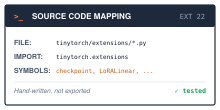
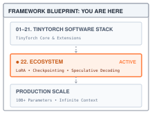

# Extending TinyTorch: The Systems Ecosystem {#sec-ecosystem}

::: {.column-margin}
{width="100%" fig-alt="Source code mapping card for the Ecosystem chapter: files in tinytorch/extensions/, imported as tinytorch.extensions, hand-written rather than exported."}

*Source Code Mapping: the extensions live in `tinytorch/extensions/` and are the one part of the package not exported from `src/`.*
:::

::: {.column-margin}
{width="100%" fig-alt="TinyTorch execution datapath blueprint highlighting the Ecosystem chapter connecting the core framework to production scale."}

*Framework Blueprint: The ecosystem extends the core stack to handle production-scale constraints.*
:::

The core of TinyTorch—its tensor striding, autograd engine, and execution loop—is intentionally kept small. This minimalism is not a limitation; it is an architectural feature.

In traditional machine learning education, students consume massive frameworks as black boxes. In TinyTorch, the framework is the foundation, and you are the architect. Because operations inherit from a clean `Function` base class and neural networks inherit from a clean `Layer` base class, TinyTorch is explicitly designed to be extended. You do not need to rewrite the core engine to test a new systems theory; you only need to plug into it.

To prove this, we will not just describe how TinyTorch can be extended. We will actually implement four of the most important systems extensions in modern machine learning.

## Extension 1: Activation Checkpointing

**The Systems Problem:** In the Autograd chapter, you saw the memory cost of saving tensors for the backward pass. Storing all intermediate activations causes out-of-memory (OOM) errors on large networks.

**The Solution:** Gradient Checkpointing (or activation recomputation) drops the forward activations from memory and recomputes them on the fly during the backward pass. This exact trick allowed models to scale to billions of parameters before multi-GPU training was ubiquitous.

Because TinyTorch exposes `Function` and `no_grad`, we can implement this as a wrapper:

```python
from tinytorch.core.tensor import Tensor, Function
from tinytorch.core.autograd import no_grad

def checkpoint(function, *args):
    class CheckpointFunction(Function):
        def forward(self, *numpy_arrays):
            # Run forward pass WITHOUT tracking gradients to save memory
            with no_grad():
                out_tensor = function(*self.inputs)
            return out_tensor.data

        def backward(self, grad_output):
            # Detach inputs so they act as graph leaves
            detached_inputs = [Tensor(t.data, requires_grad=t.requires_grad) for t in self.inputs]

            # Recompute the forward pass WITH gradients enabled
            recomputed_out = function(*detached_inputs)

            # Trigger the local backward pass
            recomputed_out.backward(Tensor(grad_output))

            # Return the gradients of the inputs
            return tuple(x.grad if x.grad is not None else None for x in detached_inputs)

    return CheckpointFunction.apply(*args)
```

## Extension 2: Parameter-Efficient Fine-Tuning (LoRA)

**The Systems Problem:** Fine-tuning a 10-billion parameter model requires updating 10-billion optimizer momentums. If you use Adam, you need 8 bytes per parameter (momentum + variance), plus 4 bytes for gradients, plus the weights themselves. This saturates GPU memory.

**The Solution:** LoRA freezes the primary weights of the model and injects two small, low-rank matrices ($A$ and $B$) alongside them. We bypass the memory wall of optimizer states because we don't store Adam momentum for the frozen weights.

Because TinyTorch natively registers parameters and respects `requires_grad=False`, we can implement LoRA cleanly:

```python
from tinytorch.core.tensor import Tensor
from tinytorch.core.layers import Layer
import numpy as np

class LoRALinear(Layer):
    def __init__(self, in_features: int, out_features: int, rank: int = 4):
        super().__init__()
        # 1. The frozen pre-trained weights
        self.weight = Tensor(
            np.random.randn(in_features, out_features) / np.sqrt(in_features),
            requires_grad=False
        )
        self.bias = Tensor(np.zeros(out_features), requires_grad=False)

        # 2. The low-rank adapter matrices (these are trained!)
        self.A = Tensor(
            np.random.randn(in_features, rank) / np.sqrt(in_features),
            requires_grad=True
        )
        self.B = Tensor(np.zeros((rank, out_features)), requires_grad=True)

    def forward(self, x: Tensor) -> Tensor:
        # Standard forward pass: x @ W + b
        base = x.matmul(self.weight) + self.bias

        # Adapter forward pass: (x @ A) @ B
        adapter = x.matmul(self.A).matmul(self.B)

        return base + adapter
```

## Extension 3: Graph Capture and Fusion

**The Systems Problem:** TinyTorch (like early PyTorch) uses a dynamic, define-by-run tape. The biggest shift in modern frameworks is capturing that dynamic tape into a static graph (IR) and fusing the operations so they don't bounce back and forth to DRAM.

**The Solution:** We can write a toy compiler that takes a TinyTorch graph and fuses operations into a single loop, demystifying the `torch.compile` era.

```python
class TracedNode:
    def __init__(self, name):
        self.name = name
    def __add__(self, other):
        return TracedNode(f"({self.name} + {other.name})")
    def __mul__(self, other):
        return TracedNode(f"({self.name} * {other.name})")

def compile_graph(func, *input_names):
    # 1. Tracing phase: pass dummy nodes through the function
    traced_inputs = [TracedNode(name) for name in input_names]
    output = func(*traced_inputs)

    # 2. Code generation phase: fuse into a single fast loop
    code = f"def fused_kernel({', '.join(input_names)}):\n"
    code += f"    # Fused by TinyTorch Compiler\n"
    code += f"    return {output.name}\n"
    return code
```

## Extension 4: Mixed Precision Training

**The Systems Problem:** Training in FP16/BF16 halves memory bandwidth requirements. However, small gradient values drop below the smallest positive normal number in FP16, silently underflowing to exactly zero and destroying the backward pass.

**The Solution:** We multiply the loss by a massive constant before calling `.backward()` to prevent underflow, then unscale them before the optimizer step. This is a classic, hard-core systems engineering problem.

```python
from tinytorch.core.tensor import Tensor
from tinytorch.core.optimizers import Optimizer

class LossScaler:
    def __init__(self, scale: float = 65536.0):
        self.scale = scale

    def backward(self, loss: Tensor):
        # Multiply the loss to protect gradients from underflow
        scaled_loss = loss * self.scale
        scaled_loss.backward()

    def unscale_(self, optimizer: Optimizer):
        # Traverse the registered parameters and divide the gradients back down
        for p in optimizer.params:
            if p.grad is not None:
                p.grad = p.grad / self.scale
```

## How Do You Scale This? (Without burning out)

The core book spine (Chapters 1–20) is a perfectly paced semester-long arc. If you keep adding to the core book, it becomes the very thing it's trying not to be: an encyclopedia like the PyTorch codebase itself.

Here is how you scale the curriculum:

1. **The Core vs. The "Contrib" Labs**: Treat the book as the immutable "Standard Library". Treat these new ideas (Distributed, LoRA, Speculative Decoding) as modular "Advanced Labs" or "Extensions" that live outside the main book narrative.
2. **Let your students and TAs build it**: If you have an active classroom or an open-source community, turn these exact ideas into RFCs (Requests for Comment) on GitHub. Tell your best graduate students or Teaching Fellows: "Your final project is to design the TinyTorch LoRA lab."
3. **The "xv6" Model**: MIT's xv6 scaled because professors at other universities wrote assignments for it (like adding a custom scheduler or a new file system). If you keep the core of TinyTorch small, clean, and stable, the community will build the extensions for you.
