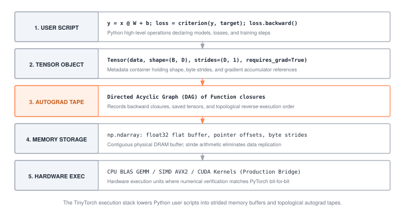

# Conclusion: Building Systems That Learn {.unnumbered #sec-conclusion}

::: {.column-margin}
{width="100%" fig-alt="The complete TinyTorch system stack from silicon DRAM and SIMD registers to high-level Transformer models."}

*The Complete System Stack: From physical DRAM bytes to autoregressive transformers, built entirely from scratch.*
:::

We began TinyTorch with a fundamental premise: you cannot truly understand a machine learning system by treating it as a black box. Deep learning frameworks like PyTorch, JAX, and TensorFlow are often taught through high-level API calls—invoking `nn.Linear`, calling `.backward()`, or wrapping models in `torch.compile()`. To the developer, tensors appear as magical multidimensional entities, autograd feels like symbolic calculus, and GPU acceleration seems like free speed.

Over the course of twenty modules and three competitive milestones, you dismantled that magic. You built a publication-grade, fully functional deep learning framework from bare silicon concepts using only Python and raw NumPy memory buffers. By refusing to take abstractions for granted, you discovered what a machine learning framework actually is: **a specialized operating system designed to manage tensor memory, choreograph dynamic directed acyclic graphs, and saturate parallel hardware compute engines.**

---

## What We Built: The Complete Arc

The architecture of TinyTorch unfolded across four deliberate tiers of progressive disclosure:

### 1. The Core Engine (Part I)
Before a single neuron could fire, you had to define the physical substrate of machine learning:
- **Tensors and Strides (@sec-tensors)**: You proved that multidimensional tensors do not exist in physical hardware. Memory is a flat, one-dimensional ribbon of byte addresses in DRAM. A tensor is simply a coordinate lens defined by a pointer, a shape tuple, and a stride vector. You implemented zero-copy slicing, broadcasting via zero-valued strides, and explicit memory contiguity.
- **Differentiable Layers and Numerical Stability (@sec-activations–@sec-layers, @sec-losses)**: You constructed linear projections, layer normalizations, and loss functions. In doing so, you confronted IEEE 754 floating-point realities, engineering numerically stable Softmax and LogSumExp formulations that prevent catastrophic exponential overflow.
- **Autograd and Dynamic Graph Execution (@sec-autograd)**: You implemented automatic differentiation from first principles. Rather than symbolic algebra or numerical perturbation, you built a reverse-mode automatic differentiation engine using dynamic execution tapes. Gradients flow backwards through an acyclic computational graph via depth-first topological sorting, correctly handling fan-out branches and in-place gradient accumulation.
- **Optimization and Training (@sec-optimizers, @sec-training, @sec-milestone-1)**: You engineered the `AdamW` optimizer, deriving first- and second-moment exponential moving averages with bias corrections and decoupled weight decay. You closed the foundation tier by training `DigitMLP` from scratch to classify handwritten digits, verifying that your home-built autograd engine converges identically to industrial frameworks.

### 2. Deep Architectures (Part II)
With the mathematical and systems engine verified, you scaled the framework to modern perception and language workloads:
- **Spatial Convolutions (@sec-convolutions)**: You implemented 2D spatial feature extraction, contrasting naive nested 6-deep loops with the classic `im2col` matrix transformation that reduces spatial filtering to high-performance general matrix multiplication (GEMM).
- **Tokenization and Discrete Semantics (@sec-tokenization, @sec-embeddings)**: You built a Byte-Pair Encoding (BPE) tokenizer from the ground up, learning how vocabulary tables and byte merges convert raw unicode strings into discrete token IDs, and how embedding tables project discrete categorical indices into continuous vector spaces.
- **Attention and Generative Transformers (@sec-attention, @sec-transformers, @sec-milestone-2)**: You constructed causal multi-head self-attention. You wrestled with coordinate axis permutations (`[Batch, Seq, Heads, Dim]`), lower-triangular causal masking with $-\infty$ additive offsets, and scaled dot-product routing. You stacked these blocks with residual skip connections into `TinyGPT` and generated coherent autoregressive text from a blank prompt.

### 3. Systems, Acceleration, and Verification (Part III)
Building a model is only half the systems discipline; the other half is making it fast, lean, and deployable:
- **Profiling and the Measurement Invariant (@sec-profiling)**: You learned that unmeasured code is un-optimized code. You built a framework profiler that accounts for warmup passes, scheduling jitter, and hardware thermal throttling, isolating true system bottlenecks from measuring artifacts.
- **Quantization and Compression (@sec-quantization, @sec-compression)**: You mapped 32-bit floating-point parameters into 8-bit integer affine codes with scale factors and zero points. You derived why symmetric quantization eliminates integer accumulation cross-terms, and proved why naive magnitude pruning yields zero speedup unless paired with compressed index representations like Compressed Sparse Row (CSR).
- **Kernel Acceleration and KV Cache Memoization (@sec-acceleration, @sec-memoization)**: You broke the memory bandwidth wall. You implemented loop tiling to fit active matrix blocks into L1/L2 cache hierarchies, fused activation chains to eliminate DRAM round trips, and built an autoregressive Key-Value Cache state machine that converted generation from $O(N^2)$ quadratic redundant recomputation to $O(N)$ linear step-by-step lookups.
- **The Torch Olympics and the Pareto Frontier (@sec-capstone, @sec-milestone-3)**: You deployed your optimized models against strict MLPerf-style benchmarks. You proved why single-metric leaderboards are dangerous (exemplified by the degenerate `ZeroModel`), and charted the multi-objective Pareto frontier across accuracy retention floors ($R \ge 0.99$), memory compression ratios ($C$), and empirical inference speedup ($S$).

### 4. Hardware Horizons (Part IV)
Finally, in @sec-extensions, you stepped below the Python interpreter:
- You crossed the language boundary via `ctypes`, passing contiguous float32 buffers directly into compiled C++ SIMD loops on ARM NEON and x86 AVX2.
- You authored GPU block kernels in Triton, exploring SPMD program grids, automatic shared memory bank swizzling, and asynchronous copy pipelining.
- You bridged to Apple Metal Performance Shaders (MPS), uncovering the exact latency break-even point where compute intensity covers the fixed overhead of device memory transfer.

---

## Five Enduring Principles of Machine Learning Systems

As you step from TinyTorch into production frameworks and custom hardware, five universal principles will govern every system you design:

::: {.callout-principle title="Principle 1: Memory Substrates Govern Computational Throughput"}
Tensors are coordinate lenses over linear byte ribbons. In modern hardware, floating-point arithmetic is virtually free, but moving bytes across memory buses is exceptionally expensive. High-performance machine learning engineering is rarely about optimizing arithmetic; it is about maximizing arithmetic intensity—structuring algorithms so that every byte loaded from DRAM into SRAM or register files is reused dozens of times before eviction.
:::

::: {.callout-principle title="Principle 2: Autodiff is an Operational Graph Trace"}
Automatic differentiation is not magic and not symbolic calculus. It is an operational recording of primitive operations executed during a forward pass. Every dynamically captured node represents an allocated memory buffer that must remain pinned until its corresponding backward vector-Jacobian product is computed. Understanding this graph lifecycle is the key to preventing out-of-memory (OOM) errors during training.
:::

::: {.callout-principle title="Principle 3: The Memory Wall Dominates Generative Inference"}
The distinction between compute-bound and memory-bandwidth-bound execution is the central reality of deep learning hardware. Prompt prefill in large language models processes hundreds of tokens in parallel, saturating matrix multiplication units (compute-bound). Autoregressive decoding processes a single token at a time, reading billions of parameter and KV cache bytes just to execute a few thousand arithmetic operations (memory-bandwidth-bound). Every modern serving optimization—from PagedAttention and FlashDecoding to INT4 weight-only quantization—exists solely to alleviate this memory bus bottleneck.
:::

::: {.callout-principle title="Principle 4: No Optimization Exists in Isolation Without Verification"}
A model that runs in zero milliseconds by predicting zero has an infinite speedup and zero utility. A model pruned to 90% sparsity that runs on dense matrix multipliers wastes memory on explicit zeros and saves zero time. Optimization without verification is speculation. Every system transformation must be empirical: measured on identical hardware, tested on identical workloads, and evaluated against strict, non-negotiable accuracy retention floors.
:::

::: {.callout-principle title="Principle 5: High-Level Abstractions Always Leak Performance"}
Python provides productive syntax at the expense of substantial runtime overhead: interpreter dispatch, reference counting, dynamic type resolution, and non-contiguous memory allocations. Production runtimes (PyTorch Inductor, TensorRT, vLLM, ExecuTorch) bypass this overhead by tracing graphs, fusing operator sequences into monolithic kernels, and compiling directly to low-level hardware targets (CUDA, Triton, Metal, C++). When you know what lies beneath the abstraction, you know how to work with the compiler rather than against it.
:::

---

## The Road Ahead: Beyond Single-Node TinyTorch

TinyTorch gave you a complete, inspectable reference implementation of a single-node deep learning engine. Where does the field go from here?

1. **Distributed Training at Planetary Scale**:
   Modern foundation models exceed the memory capacity of any single GPU by orders of magnitude. The principles of tensor striding, autograd tapes, and memory allocation you mastered here extend directly to distributed execution:
   - **Data Parallelism (DDP)**: Replicating the model across workers while computing synchronous all-reduce reductions over gradient buffers.
   - **Tensor Parallelism (Megatron-LM)**: Splitting weight matrices across row and column dimensions within GEMM kernels, communicating intermediate activations across high-speed NVLink interconnects.
   - **Pipeline Parallelism**: Partitioning transformer layers sequentially across separate accelerator nodes and scheduling micro-batches via bubble-minimizing 1F1B (one-forward-one-backward) schedules.
   - **Fully Sharded Data Parallel (FSDP / ZeRO)**: Sharding optimizer states, gradients, and model parameters across the cluster, all-gathering parameters on demand during forward/backward execution and releasing them immediately to maintain minimal memory footprints.

2. **Hardware-Software Co-Design and Custom Silicon**:
   The boundaries between software compilers and hardware architectures have dissolved. Google TPUs, AWS Trainium, and Groq LPUs eschew traditional cache hierarchies in favor of software-managed scratchpad memories and 2D systolic arrays. Writing software for these targets requires the exact systems intuition you developed in @sec-acceleration and @sec-extensions: choreographing data movement so that matrix execution units never starve for operands.

3. **Compiler Lowering and Graph Capture**:
   Modern deep learning frameworks are rapidly becoming optimizing compilers. Systems like `torch.compile` capture computational subgraphs using Dynamo, trace tensor metadata with AOTAutograd, and lower intermediate representations (IR) into hardware-tuned Triton or C++ kernels via Inductor. Because you built `Tensor`, `Function`, and `KVCache` by hand, you can read the generated intermediate representations not as obscure compiler output, but as the direct automated counterpart of the kernels you wrote.

---

## The Builder's Manifesto

When you first opened this book, modern machine learning may have appeared as an impenetrable tower of complex software frameworks, opaque CUDA libraries, and billion-parameter models.

You have now reached the summit by climbing the staircase from the ground floor. You know how a float32 byte is laid out in DRAM. You know how a stride translates a coordinate into a memory offset. You know how an autograd tape tracks forward computations and walks backward through graph topologies. You know how attention masks out the future, how a KV cache eliminates redundant projections, and how integer quantization squeezes neural networks into constrained edge devices.

The black box is gone. The framework is no longer magic.

**It is code. It is systems architecture. And you built it.**
