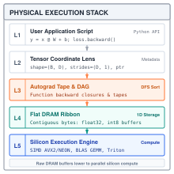
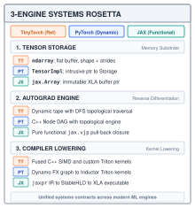

# Conclusion: Building Systems That Learn {.unnumbered #sec-conclusion}

::: {.column-margin}
{width="100%" fig-alt="The 5-layer TinyTorch physical execution stack from user script to silicon execution."}

*The Complete System Stack: From physical DRAM bytes to autoregressive transformers, built entirely from scratch.*
:::

We began TinyTorch with a fundamental premise: you cannot truly understand a machine learning system by treating it as a black box. Deep learning frameworks like PyTorch, JAX, and TensorFlow are often taught through high-level API calls, invoking `nn.Linear`, calling `.backward()`, or wrapping models in `torch.compile()`. To the developer, tensors appear as magical multidimensional entities, autograd feels like symbolic calculus, and GPU acceleration seems like free speed.

Over the course of twenty modules, seven historical milestones, and three synthesis chapters, you dismantled that magic. You built a publication-grade, fully functional deep learning framework from bare silicon concepts using only Python and raw NumPy memory buffers. By refusing to take abstractions for granted, you discovered what a machine learning framework actually is: **a specialized operating system designed to manage tensor memory, choreograph dynamic directed acyclic graphs, and saturate parallel hardware compute engines.**

---

## What We Built: The Complete Arc

The architecture of TinyTorch unfolded across four deliberate tiers of progressive disclosure:

### 1. The Core Engine (Part I)

Before a single neuron could fire, you had to define the physical substrate of machine learning:

- **Tensors and Strides (@sec-tensors)**: You proved that multidimensional tensors do not exist in physical hardware. Memory is a flat, one-dimensional ribbon of byte addresses in DRAM. A tensor is simply a coordinate lens defined by a pointer, a shape tuple, and a stride vector. You worked out the stride arithmetic that turns an index into an offset, saw how a zero-valued stride expresses broadcasting without moving bytes, and separated owning a buffer from laying it out contiguously. TinyTorch's own constructor then takes the opposite path from a production framework and copies on every construction, which is the choice that made the ownership rule simple enough to reason about and the cost visible enough to measure.
- **Differentiable Layers and Numerical Stability (@sec-activations through @sec-layers, @sec-losses)**: You constructed linear projections, layer normalizations, and loss functions. In doing so, you confronted IEEE 754 floating-point realities, engineering numerically stable Softmax and LogSumExp formulations that prevent catastrophic exponential overflow.
- **Autograd and Dynamic Graph Execution (@sec-autograd)**: You implemented automatic differentiation from first principles. Rather than symbolic algebra or numerical perturbation, you built a reverse-mode automatic differentiation engine using dynamic execution tapes. Gradients flow backwards through an acyclic computational graph via depth-first topological sorting, correctly handling fan-out branches and in-place gradient accumulation.
- **Optimization and Training (@sec-optimizers, @sec-training, [Synthesis I](synthesis_01.qmd#sec-milestone-1))**: You engineered the `AdamW` optimizer, deriving first- and second-moment exponential moving averages with bias corrections and decoupled weight decay. You closed the foundation tier by training `DigitMLP` from scratch to classify handwritten digits, verifying that your home-built autograd engine trains a working classifier.

### 2. Deep Architectures (Part II)

With the mathematical and systems engine verified, you scaled the framework to modern perception and language workloads:

- **Spatial Convolutions (@sec-convolutions)**: You implemented 2D spatial feature extraction with the seven nested loops that pick an output position and form its dot product, and you priced what those loops cost. @Sec-acceleration then built the `im2col` lowering that reduces the same filtering to one high-performance general matrix multiplication (GEMM), and timed it against your loops.
- **Tokenization and Discrete Semantics (@sec-tokenization, @sec-embeddings)**: You built a Byte-Pair Encoding (BPE) tokenizer from the ground up, learning how vocabulary tables and byte merges convert raw unicode strings into discrete token IDs, and how embedding tables project discrete categorical indices into continuous vector spaces.
- **Attention and Generative Transformers (@sec-attention, @sec-transformers, [Synthesis II](synthesis_02.qmd#sec-milestone-2))**: You constructed causal multi-head self-attention, wrestling with coordinate axis permutations (`[Batch, Seq, Heads, Dim]`), lower-triangular causal masking with $-\infty$ additive offsets, and scaled dot-product routing. In Milestone 05, you validated basic attention sequence routing on synthetic tasks. You then stacked these blocks into `TinyGPT` (our performance-oriented flagship model), establishing its baseline autoregressive decoding loop on Shakespeare, generating Python source code in TinyCopilot verified by compiler gates, and exposing its quadratic recomputation bottleneck.

### 3. Systems, Acceleration, and Verification (Part III)

Building a model is only half the systems discipline; the other half is making it fast, lean, and deployable:

- **Profiling and the Measurement Invariant (@sec-profiling)**: You learned that unmeasured code is un-optimized code. You built a framework profiler that uses warmup passes and repeated medians to reduce scheduling jitter, isolating true system bottlenecks from measuring artifacts.
- **Quantization and Compression (@sec-quantization, @sec-compression)**: You mapped 32-bit floating-point parameters into 8-bit integer affine codes with scale factors and zero points. You derived why symmetric quantization eliminates integer accumulation cross-terms, and proved why naive magnitude pruning yields zero speedup unless paired with compressed index representations like Compressed Sparse Row (CSR).
- **Kernel Acceleration and KV Cache Memoization (@sec-acceleration, @sec-memoization)**: You broke the memory bandwidth wall. You implemented loop tiling to fit active matrix blocks into L1/L2 cache hierarchies, fused activation chains to eliminate DRAM round trips, and built an autoregressive Key-Value Cache that removes the re-projection of earlier tokens, turning per-step projection work from $O(N)$ into $O(1)$ while each new query still attends over the growing prefix.
- **The MLPerf Optimization Olympics and the Pareto Frontier (@sec-capstone, [Synthesis III](synthesis_03.qmd#sec-milestone-3))**: You measured optimized candidates against their baselines under MLPerf-style discipline, saw why a single-metric ranking rewards the degenerate `ZeroModel`, and computed which candidates lie on the Pareto frontier, comparing them on accuracy retention floors ($R \ge 0.99$), memory compression ratios ($C$), and measured inference speedup ($S$).

### 4. Extensions (Part IV)

Finally, in @sec-extensions, you stepped below the Python interpreter:

- You crossed the language boundary via `ctypes`, passing contiguous float32 buffers directly into compiled C++ SIMD loops on ARM NEON and x86 AVX2.
- You read a Triton kernel as a block-level SPMD program, with `tl.program_id` selecting a block and a mask switching off the lanes that would run past the end of the array. @Sec-extensions notes that the coalesced loads come from adjacent programs reading adjacent addresses; the memory scheduling around them is what the Triton compiler generates for you, which is the point: the kernel in that chapter is the kind a compiler writes.
- You offloaded matrix multiplication to the Apple GPU through PyTorch's MPS backend, uncovering the exact latency break-even point where compute intensity covers the fixed overhead of device memory transfer.

---

## Five Enduring Principles of Machine Learning Systems

As you step from TinyTorch into production frameworks and custom hardware, five universal principles will govern every system you design:

::: {.callout-principle title="Principle 1: Memory Substrates Govern Computational Throughput"}
Tensors are coordinate lenses over linear byte ribbons. In modern hardware, floating-point arithmetic is virtually free, but moving bytes across memory buses is exceptionally expensive. High-performance machine learning engineering is rarely about optimizing arithmetic; it is about maximizing arithmetic intensity, structuring algorithms so that every byte loaded from DRAM into SRAM or register files is reused dozens of times before eviction.
:::

::: {.callout-principle title="Principle 2: Autodiff is an Operational Graph Trace"}
Automatic differentiation is not magic and not symbolic calculus. It is an operational recording of primitive operations executed during a forward pass. Every dynamically captured node represents an allocated memory buffer that must remain pinned until its corresponding backward vector-Jacobian product is computed. Understanding this graph lifecycle is the key to preventing out-of-memory (OOM) errors during training.
:::

::: {.callout-principle title="Principle 3: The Memory Wall Dominates Generative Inference"}
The distinction between compute-bound and memory-bandwidth-bound execution is the central reality of deep learning hardware. Prompt prefill in large language models processes hundreds of tokens in parallel, saturating matrix multiplication units (compute-bound). Autoregressive decoding processes a single token at a time, reading billions of parameter and KV cache bytes just to execute a few thousand arithmetic operations (memory-bandwidth-bound). Modern serving optimizations attack this bottleneck from two directions. FlashDecoding and INT4 weight-only quantization reduce the bytes that must cross the bus, which is the bandwidth problem @sec-profiling taught you to measure. PagedAttention attacks capacity rather than bandwidth: @sec-memoization shows it reclaiming the 60 to 80 percent of high-bandwidth memory that reservation, internal, and external fragmentation waste, bringing that waste under 4 percent. Both directions matter, and confusing them is how a serving system ends up optimizing the wrong resource.
:::

::: {.callout-principle title="Principle 4: No Optimization Exists in Isolation Without Verification"}
A model that runs in zero milliseconds by predicting zero has an infinite speedup and zero utility. A model pruned to 90% sparsity that runs on dense matrix multipliers wastes memory on explicit zeros and saves zero time. Optimization without verification is speculation. Every system transformation must be empirical: measured on identical hardware, tested on identical workloads, and evaluated against strict, non-negotiable accuracy retention floors.
:::

::: {.callout-principle title="Principle 5: High-Level Abstractions Always Leak Performance"}
Python provides productive syntax at the expense of substantial runtime overhead: interpreter dispatch, reference counting, dynamic type resolution, and non-contiguous memory allocations. Production runtimes (PyTorch Inductor, TensorRT, vLLM, ExecuTorch) bypass this overhead by tracing graphs, fusing operator sequences into monolithic kernels, and compiling directly to low-level hardware targets (CUDA, Triton, Metal, C++). When you know what lies beneath the abstraction, you know how to work with the compiler rather than against it.
:::

---

## The Bridge to Industrial Engines: From TinyTorch to PyTorch and JAX

A central philosophy of this book is the **Minix-to-Linux principle** (@sec-extensions): when Linus Torvalds set out to author Linux, he did not begin by deciphering a proprietary, million-line Unix operating system. He studied Andrew Tanenbaum's Minix: a compact teaching kernel small enough to be held completely in mind. Understanding how Minix managed memory, handled interrupts, and scheduled processes gave Linus the foundational mental model to author, debug, and scale Linux.

TinyTorch is the Minix and xv6 of deep learning systems. Industrial engines like PyTorch and JAX comprise tens of millions of lines of C++, CUDA, Python, LLVM compiler backends, and distributed runtime orchestrators. Diving into their codebases without a foundational mental model is overwhelming. But every single abstraction in PyTorch and JAX is a direct architectural descendant of the contracts you built in TinyTorch:

### From TinyTorch to PyTorch

PyTorch's design mirrors TinyTorch's imperative, define-by-run architecture, wrapped in high-performance C++ and JIT compiler dispatch:

- **The Tensor Substrate:** In PyTorch, `torch.Tensor` is a lightweight Python wrapper around the C++ `at::Tensor` class, which holds an intrusive pointer to `c10::TensorImpl`. The fields of `c10::TensorImpl` correspond to what you worked out in @sec-tensors: a pointer to a `c10::Storage` raw byte buffer, an array of dimension sizes, and an array of dimension strides. When you call `.view()` or `.transpose()` in PyTorch, it creates a new `TensorImpl` pointing to the same `Storage` with altered strides, the striding algebra you worked out in @sec-tensors, where TinyTorch deliberately copies instead.
- **The Autograd Graph:** PyTorch's autograd engine (`torch.autograd`) operates identically to TinyTorch's tape (@sec-autograd). When a differentiable tensor participates in an operation, the framework instantiates a C++ `Node` subclassing `torch.autograd.Node` (the production equivalent of TinyTorch's `Function`). The `Node` records the input pointers and saves necessary intermediate tensors on its forward tape. When you invoke `loss.backward()`, PyTorch's `Engine::evaluate` executes a topological depth-first search traversal, invoking `Node::apply()` to propagate vector-Jacobian products backward and accumulate `.grad` tensors.
- **Compiler Lowering and Kernel Fusion:** TinyTorch's `compile_graph` (@sec-extensions) traced define-by-run nodes into a single fused expression, showing the capture step that a real fusion compiler lowers into one loop. PyTorch 2.0's `torch.compile` implements this exact workflow at industrial scale through three coordinated stages:
  1. *TorchDynamo* intercepts Python bytecode at runtime using CPython frame evaluation hooks (`PEP 523`) and extracts computational subgraphs into an FX graph (the industrial counterpart to TinyTorch's `TracedNode`).
  2. *AOTAutograd* traces through the autograd boundary, capturing forward and backward subgraphs before execution.
  3. *TorchInductor* compiles the captured graph, generating optimized OpenAI Triton GPU kernels and OpenMP-parallelized C++ CPU kernels, matching the exact Triton and SIMD patterns you authored in @sec-extensions.

### From TinyTorch to JAX

JAX approaches machine learning systems from a functional, compiler-first philosophy rather than an object-oriented imperative tape:

- **Pure Functions and Immutable Arrays:** While TinyTorch and PyTorch treat tensors as mutable objects with in-place `.grad` accumulation, JAX operates on pure mathematical functions: $y = f(x, \theta)$. A `jax.Array` is immutable, backed directly by an on-device XLA buffer pointer.
- **Vector-Jacobian Products (`vjp`):** JAX does not maintain an object tape on tensor instances. Instead, its reverse-mode autodiff primitive `jax.vjp` takes a Python function $f$ and an input $x$, evaluates the forward pass, and returns the primal output $y$ alongside a *pull-back function* (the VJP). Evaluating the pull-back function with incoming cotangent $\bar{y}$ propagates gradients backward through the chain rule, making explicit the mathematical derivative contract you defined in `Function.backward`. When programmers call the familiar `jax.grad(f)`, JAX simply wraps `jax.vjp(f)` and evaluates the pull-back closure with an incoming cotangent of `1.0` (for scalar loss).
- **Traced IR (`jaxpr`):** When you decorate a function with `@jax.jit`, JAX executes the Python code once using abstract tracer objects (`ShapedArray`). These tracers record every mathematical operation into a linear Directed Acyclic Graph called a **jaxpr** (JAX expression), analogous to TinyTorch's computational graph.
- **Whole-Program Silicon Lowering:** Rather than dispatching kernels operator-by-operator across a Python runtime, JAX lowers the `jaxpr` graph to StableHLO (High-Level Optimizer bytecode) and hands the entire computation graph to the XLA (Accelerated Linear Algebra) compiler. XLA performs whole-program memory layout assignment, inter-operator buffer reuse, and fusion across entire transformer blocks, targeting Google TPUs or NVIDIA GPUs with zero Python interpreter overhead.

### The Structural Rosetta Stone

::: {.column-margin}
{width="100%" fig-alt="The 3-engine systems rosetta stone comparing TinyTorch, PyTorch, and JAX across tensor storage, autograd, and compilation."}

*Three-Engine Architecture: The same systems contracts govern TinyTorch, PyTorch, and JAX.*
:::

@tbl-rosetta-stone bridges each foundational systems boundary across TinyTorch, PyTorch, and JAX.

| Systems Boundary | TinyTorch (Educational Reference) | PyTorch (Industrial Dynamic Engine) | JAX (Industrial Functional Compiler) |
| :--- | :--- | :--- | :--- |
| **Tensor Storage** | NumPy `ndarray` buffer with shape & strides | `c10::TensorImpl` over `c10::Storage` byte buffer | `jax.Array` backed by XLA device memory buffer |
| **Autograd Engine** | Dynamic tape with DFS topological traversal | Dynamic C++ `Engine::evaluate` over `Node` DAG | Pure functional `jax.vjp` returning a pull-back closure |
| **Custom Operator** | Subclass `Function(forward, backward)` | Subclass `autograd.Function` or `TORCH_LIBRARY` | Pure Python function transformed via `jax.custom_vjp` |
| **Graph Capture** | Symbolic `TracedNode` AST capture | TorchDynamo frame evaluation extracting FX graph | Abstract `ShapedArray` tracing extracting `jaxpr` IR |
| **Kernel Lowering** | Hand-written C++ SIMD & Triton kernels | TorchInductor generating Triton & OpenMP C++ | XLA compiling StableHLO to machine code / TPU HLO |
| **Model State** | Stateful `Layer` with `.parameters()` list | Stateful `torch.nn.Module` with `named_parameters()` | Pure functional `PyTree` dictionary of parameter weights |
| **Serving Cache** | Stateful `KVCache` preallocated buffer with write cursor (@sec-memoization) | PagedAttention (vLLM) / Static Tensor Cache | Static shape-padded XLA buffer allocation |

: **The Systems Rosetta Stone: Bridging TinyTorch to Industrial Frameworks.** Every abstraction you authored maps directly to production runtime primitives in PyTorch and JAX. {#tbl-rosetta-stone tbl-colwidths="[16,26,30,28]"}

When you encounter a cryptic PyTorch Dynamo guard error, an ATen stride mismatch during a tensor view operation, a CUDA out-of-memory crash caused by un-checkpointed autograd tape allocations, or an XLA recompilation warning from dynamic shapes, you will not see them as inexplicable framework mysteries. You know the memory ribbons, the topological sorting algorithms, the cache block sizes, and the arithmetic intensities that govern them.

---

## The Road Ahead: Beyond Single-Node TinyTorch

TinyTorch gave you a complete, inspectable reference implementation of a single-node deep learning engine. Where does the field go from here?

1. **Distributed Training at Planetary Scale**:
   Modern foundation models exceed the memory capacity of any single GPU by orders of magnitude. The principles of tensor striding, autograd tapes, and memory allocation you mastered here extend directly to distributed execution:

   - **Data Parallelism (DDP)**: Replicating the model across workers while computing synchronous all-reduce reductions over gradient buffers.
   - **Tensor Parallelism (Megatron-LM)**: Splitting weight matrices across row and column dimensions within GEMM kernels, communicating intermediate activations across high-speed NVLink interconnects.
   - **Pipeline Parallelism**: Partitioning transformer layers sequentially across separate accelerator nodes and scheduling micro-batches via bubble-minimizing 1F1B (one-forward-one-backward) schedules.
   - **Fully Sharded Data Parallel (FSDP / ZeRO)**: Sharding optimizer states, gradients, and model parameters across the cluster, all-gathering parameters on demand during forward/backward execution and releasing them immediately to maintain minimal memory footprints.

2. **Hardware-Software Co-Design and Custom Silicon**:
   The boundaries between software compilers and hardware architectures have dissolved. Google TPUs, AWS Trainium, and Groq LPUs eschew traditional cache hierarchies in favor of software-managed scratchpad memories and 2D systolic arrays. Writing software for these targets requires the exact systems intuition you developed in @sec-acceleration and @sec-extensions: choreographing data movement so that matrix execution units never starve for operands.

3. **Compiler Lowering and Graph Capture**:
   Modern deep learning frameworks are rapidly becoming optimizing compilers. Systems like `torch.compile` capture computational subgraphs using Dynamo, trace tensor metadata with AOTAutograd, and lower intermediate representations (IR) into hardware-tuned Triton or C++ kernels via Inductor. Because you built `Tensor`, `Function`, and `KVCache` by hand, you can read the generated intermediate representations not as obscure compiler output, but as the direct automated counterpart of the kernels you wrote.

4. **Speculative Decoding and Advanced Serving Engines**:
   Autoregressive generation is fundamentally memory-bandwidth bound ($O(1)$ arithmetic intensity per token generated). Speculative decoding breaks this memory wall by pairing a small, fast draft model with a large target model. The draft model speculatively generates a sequence of $K$ candidate tokens at high speed, which the target model verifies in parallel within a single forward pass, converting sequential memory-bound token steps into a compute-dense parallel batch verification. Production engines like vLLM and TensorRT-LLM combine speculative decoding, virtual memory paging for key-value tensors (PagedAttention), and continuous chunked prefill to maximize accelerator saturation.

---

## The Builder's Manifesto

When you first opened this book, modern machine learning may have appeared as an impenetrable tower of complex software frameworks, opaque CUDA libraries, and billion-parameter models.

You have now reached the summit by climbing the staircase from the ground floor. You know how a float32 byte is laid out in DRAM. You know how a stride translates a coordinate into a memory offset. You know how an autograd tape tracks forward computations and walks backward through graph topologies. You know how attention masks out the future, how a KV cache eliminates redundant projections, and how integer quantization squeezes neural networks into constrained edge devices.

The black box is gone. The framework is no longer magic.

**It is code. It is systems architecture. And you built it.**
