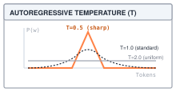
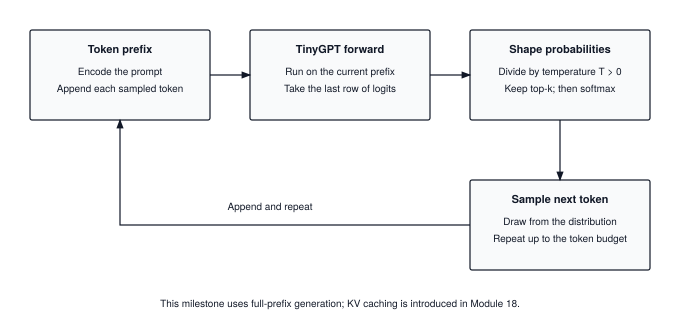
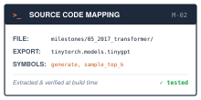

# Milestone II: Convolution, Attention, and Generated Text {#sec-milestone-2}

::: {.column-margin}
{width="100%" fig-alt="TinyTorch execution datapath blueprint highlighting Milestone II Language Model Generation as the active subsystem."}

*Framework Blueprint: Milestone II runs both Part II architectures against a task and a baseline, then closes the generative loop that Part III optimizes.*
:::


Part II built two foundational architectures on the Part I engine: convolutional networks for spatial perception and transformers for dynamic sequence reasoning. This milestone puts each architecture to work against concrete benchmarks, measuring what structural inductive bias buys, and closing the autoregressive loop that turns language models into generative systems.

In modern deep learning, autoregressive text generation is steered through stochastic sampling controls:

```python
import torch
import torch.nn.functional as F

# Next-token autoregressive sampling with temperature and Top-k filtering
def sample_next_token(logits, temperature=0.8, top_k=10):
    scaled_logits = logits / temperature
    top_values, _ = torch.topk(scaled_logits, top_k)
    scaled_logits[scaled_logits < top_values[:, [-1]]] = -float("inf")
    probs = F.softmax(scaled_logits, dim=-1)
    return torch.multinomial(probs, num_samples=1)
```

Underneath that sampling function, the runtime closes the full architecture loop:
1. **Temperature-scaled logit shaping:** Dividing raw next-token logits by temperature $T$ flattens ($T > 1$) or sharpens ($T < 1$) the probability distribution before Softmax, controlling the balance between creative diversity and deterministic fidelity.
2. **Top-$k$ probability truncation:** Masking out the long tail of low-probability vocabulary tokens with $-\infty$ prevents catastrophic non-sequiturs during open-ended generation.
3. **Closing the end-to-end generative cycle:** The sampling loop feeds newly generated token IDs back into the input sequence, creating the autoregressive inference workload that Part III will profile, compress, and accelerate.

This milestone runs across three parts: evaluating convolutional networks against dense MLPs on TinyDigits, testing attention on sequence reasoning tasks, and generating natural language with TinyGPT.

---

## Convolution on TinyDigits

::: {.column-margin}
**↩ Jump back:** @sec-convolutions
*The direct loop implementation this network runs, and the im2col lowering it does not use.*
:::

@sec-milestone-1's `DigitMLP` flattened each 8×8 digit into 64 numbers and learned 2,410 parameters. The CNN script keeps the image an image. One `Conv2d` slides eight 3×3 filters over it, `MaxPool2d` halves each 6×6 feature map to 3×3, and a single `Linear` layer reads the 72 values that remain.



The flatten uses `Tensor.reshape`, so the pooled maps stay on the autograd graph and the loss can reach the filters. Wrapping `out.data` in a new `Tensor` would train the classifier and leave all eight filters at their initial values.

The filters hold $8 \times 3 \times 3 + 8 = 80$ parameters and the classifier $72 \times 10 + 10 = 730$, which makes 810, a third of the MLP's 2,410. Parameters are not work, though. Every filter weight is applied at all 36 positions of its 6×6 output, so one image costs $8 \times 36 \times 9 = 2{,}592$ multiply-accumulates in the convolution and $720$ in the classifier, 3,312 in all. The MLP spends $64 \times 32 + 32 \times 10 = 2{,}368$. Weight sharing moves the budget from stored weights to reused ones.

| Epochs | CNN, 810 parameters | MLP, 2,410 parameters |
| :--- | :--- | :--- |
| 20 | 73.0 to 75.5% | 81.0 to 82.5% |
| 50 | 86.0 to 87.0% | 88.5 to 89.0% |
| 100 | 89.0 to 90.5% | 90.5 to 91.0% |

: Held-out accuracy on the 200 TinyDigits test images for both networks trained the same way, with SGD at learning rate 0.01 and batches of 32. Each cell is the range over five runs that differ only in batch shuffling; one test image is half a percentage point. {#tbl-m2-cnn-vs-mlp tbl-colwidths="[20,40,40]"}

The course materials compare the CNN's 50-epoch result with the MLP milestone's 20-epoch result, which is how they come to announce a win for convolution. At equal budgets there is no win on these images. The MLP leads at every row of @tbl-m2-cnn-vs-mlp, and both networks approach 90 percent. An 8×8 digit has only 64 pixels, so a dense first layer can afford to connect every pixel to every hidden unit, and nothing about the input forces the network to share weights.

Resolution changes that. A dense layer's weight count grows with the number of input values, while a convolutional layer's depends only on filter size and channel counts. For a 32×32 color image, 3,072 input values, the MLP's 32-unit hidden layer would need $3{,}072 \times 32 = 98{,}304$ weights. The same eight 3×3 filters over three input channels need $8 \times 3 \times 3 \times 3 = 216$. That is the constraint LeNet was designed around, and it is the regime of the milestone's optional CIFAR-10 script. On 8×8 digits the constraint does not bind yet. The parameter saving is real and the accuracy gain is not.

The price shows up on the clock. On my machine one training epoch over the 1,000 training images takes 1.48 seconds for the CNN and 0.017 seconds for the MLP, about 87 times longer for 1.4 times the multiply-accumulates. Arithmetic does not explain a gap that size. @sec-convolutions's `_convolve_loops` nests seven Python loops, so each of the 2,592 multiply-accumulates in the convolution is a scalar Python operation, and the backward pass loops again. The MLP's 2,368 run inside two NumPy `matmul` calls per batch. The im2col lowering in @sec-convolutions turns the loops into one matrix multiply, and this measurement is the reason to want it.

---

## Attention on Structured Sequences

::: {.column-margin}
**↩ Jump back:** @sec-attention
*Scaled dot-product attention and the multi-head projections these tasks exercise.*
:::

This section exercises **Milestone 05: The Transformer Era (2017)**. Its canonical script, `01_vaswani_attention.py` (runnable via `tito milestone run 05`), isolates the **basic transformer mechanism**: proving that multi-head attention learns sequence routing and content-dependent permutations without recurrent state. It does not train on prose. Instead, it builds an `AttentionTransformer` from the @sec-embeddings through @sec-transformers pieces: token embeddings, a learned positional table, and two Post-LN blocks with four heads, a ReLU feed-forward layer, and no causal mask, since its tasks need every position to see every other. With a 29-token vocabulary (26 letters, padding, and two task markers) and 64-dimensional embeddings, it has 104,157 parameters.

It puts that model through three tests on six-letter sequences. Reversal maps `PYTHON` to `NOHTYP`. Copying maps `TENSOR` to itself. The mixed task prefixes each sequence with a marker, `[R]` or `[C]`, and the model must reverse or copy depending on which marker it sees. The first two tests share one model, trained on reversal and then on copying; the mixed test starts from fresh weights. A sequence counts as correct only if every position is. The pass thresholds are 95 percent on reversal, 95 on copying, and 90 on the mixed task, and training stops as soon as held-out accuracy crosses the threshold.

The training step, quoted from the script, flattens the model's `[B, S, V]` logits to `B·S` classification rows before the loss, counts completely correct sequences beside the loss, and takes its batches from @sec-dataloader's `DataLoader`.



| Task | Held-out sequences | Epochs to threshold | Sequence accuracy |
| :--- | :--- | :--- | :--- |
| Reversal | 200 | 2 | 97.0 to 99.0% |
| Copying | 200 | 2 | 100% |
| Mixed, by prefix | 300 | 4 | 99.0 to 99.7% |

: Results of the attention milestone over six runs that differ only in batch shuffling. On my machine each epoch takes 0.13 to 0.17 seconds. {#tbl-m2-attention-tasks tbl-colwidths="[28,24,22,26]"}

Two epochs is fast, and the reason is structural. Reversal and copying are fixed permutations of positions. With a learned positional table and no mask, an attention head can learn queries and keys that match output position $i$ to input position $5 - i$, or to $i$ itself, and the value vectors carry the letter across. Copying is easier still, because the residual path already carries each letter straight through. The mixed task is the real test of attention. The permutation now depends on the content of position zero, so every position must read the marker and route accordingly. Starting from fresh weights, like reversal, it needs twice as many epochs, and it is the behavior that a fixed, input-independent mixing of positions cannot express.

The script builds its optimizer list from each component's `parameters()`, including the learned positional table. That table receives gradients and is updated, unlike @sec-embeddings's intentionally fixed sinusoidal table. Checking this registration boundary matters even when a score passes, because a model can learn through its other weights while an omitted component never changes.

Scoring uses `np.argmax`, and here the argmax is exactly right. Reversal has one correct output, so the most probable token is the answer and sampling would only add errors. Having proven the basic transformer on deterministic sequence routing, we now turn to our flagship model: **TinyGPT**. TinyGPT recreates the **2020–2022 Generative LLM Revolution**: the foundational autoregressive transformer architecture behind GPT-3 and ChatGPT. It is our performance-oriented workload designed for open-ended generation, where many continuations are acceptable, always taking the argmax fails, and autoregressive inference creates the quadratic prefix recomputation bottleneck that Part III and the MLPerf milestone will systematically optimize with Key-Value caching, quantization, and kernel acceleration.

---

## The Problem

::: {.column-margin}
**↩ Jump back:** @sec-transformers
*Full-prefix forward passes through TinyGPT's stacked Pre-LN Transformer decoder blocks.*
:::


Take a trained `TinyGPT`, feed it the prompt "TinyTorch is", and do the obvious thing: pick the highest-scoring token, append it, repeat.

```python
# The obvious decoder: always take the argmax
for _ in range(20):
    logits = model.forward(Tensor(np.array([token_ids])))   # [1, S, V]
    next_id = int(np.argmax(logits.data[0, -1]))            # last row, best score
    token_ids.append(next_id)
```

This is **greedy decoding**: always take the highest-scoring continuation. It is reproducible, but it can repeat a pattern. If a model ranks “of” highest after “the” and “the” highest after “of,” this loop keeps selecting the same pair for as long as those rankings persist. Random sampling offers other continuations; it cannot compensate for a model that has learned poor probabilities.

Sampling from the full softmax distribution creates a different trade-off. Suppose five tokens receive probabilities $[0.50, 0.30, 0.10, 0.06, 0.04]$. The final three tokens each look unlikely, yet together they are selected 20 percent of the time. If we want only the first two candidates, we must remove the other three and renormalize the retained probabilities to $[0.625, 0.375]$. This motivates filtering, independent of vocabulary size. Whether removing those candidates improves the text depends on the model and task.

Behind these decoding choices sits a question this book has not yet answered. `TinyGPT` outputs a row of $V$ logits at every position. A classifier in @sec-milestone-1 had one label per image. What is the label for position 7 of a sentence?

---

## The Idea

::: {.column-margin}
**↪ Jump ahead:** @sec-memoization
*Eliminating the redundant $O(S^2)$ key-value recomputation during autoregressive generation.*
:::


::: {.column-margin}
{width="100%"}
*Temperature scaling reshaping logit probabilities ($T \to 0$ vs $T > 1$).*
:::

### The next token is the label

For input IDs $[7, 3, 9, 4]$, take targets $[3, 9, 4, 12]$. At position zero, the model sees 7 and predicts 3; at position one, it sees 7 and 3 and predicts 9. The final row sees all four input tokens and predicts 12. The causal mask lets us compute these four predictions in one pass without allowing a row to read its target.

This next-token rule gives a sequence probability by multiplying conditional probabilities:

$$P(x_1, x_2, \dots, x_n) = \prod_{t=1}^{n} P(x_t \mid x_1, \dots, x_{t-1})$$

Here $x_t$ is the token at position $t$ and $P(x_t \mid x_1, \dots, x_{t-1})$ is the model's probability for it given everything before it. The causal mask from @sec-attention guarantees that the logits at position $t$ were computed from tokens $1$ through $t$ only, so the row of logits at position $t$ is a prediction of $x_{t+1}$. The training target is therefore the input sequence shifted left by one token. A window of $S$ tokens gives $S$ separate predictions in one forward pass, and the loss is the cross-entropy of @sec-losses averaged over all $B \times S$ positions in the batch.

### The generation loop

Generation reuses the same forward pass with no labels. Encode the prompt into token IDs. Run the model. Take the last row of logits, the prediction for the token after the prompt. Choose a token from it. Append that token to the sequence and run the model again on the longer sequence. The loop below stops after a fixed number of tokens. Stopping on an end-of-sequence token would require reserving and training such a token, then testing for its ID in the loop; this small corpus does neither. That is the whole model of generation; what it costs per iteration is a question for the code.

{#fig-milestone2-loop width="100%"}

{#fig-teacher-forcing-grid width="100%" fig-alt="Matrix grid contrasting parallel teacher forcing training with autoregressive token-by-token generation."}

### Temperature

The choice inside the loop controls how strongly we prefer the largest scores. Let $\mathbf{z} \in \mathbb{R}^V$ be the last row of logits and $T > 0$ a scalar called the **temperature**. Dividing the logits by $T$ before the softmax gives

$$P_i = \frac{\exp(z_i / T)}{\sum_{j=1}^{V} \exp(z_j / T)}$$

where $P_i$ is the probability of token $i$. At $T = 1$ this is the ordinary softmax and the model's distribution is used as trained. Below 1 the gaps between logits grow, so the largest logit takes more of the mass and the output becomes more predictable. Above 1 the gaps shrink and the mass spreads out.

The limits are worth holding in mind. As $T \to 0$, every gap $z_i - z^*$ between a token and the maximum logit $z^*$ is divided by a vanishing number, so every non-maximum exponent goes to $-\infty$ and the distribution collapses onto the argmax. With a unique maximum, greedy decoding is the zero-temperature limit. Tied maxima share probability in the positive-temperature limit; our explicit zero branch instead selects the first maximum. As $T \to \infty$, every $z_i / T \to 0$, all exponents become equal, and $P_i \to 1/V$, a uniform draw over the vocabulary.

### Top-$k$

Temperature reshapes the distribution but never removes the tail. **Top-$k$ filtering** does. Keep the $k$ largest logits and set every other logit to $-\infty$:

$$z_i' = \begin{cases} z_i & \text{if } z_i \text{ is among the } k \text{ largest} \\ -\infty & \text{otherwise} \end{cases}$$

Since $\exp(-\infty) = 0$, the discarded tokens have exactly zero probability after the softmax, and the remaining $k$ probabilities are renormalized to sum to one.[^fn-top-p-nucleus] With $k = 2$ on the five-token example above, the 20 percent tail vanishes. For distinct logits in exact arithmetic, temperature and top-$k$ commute. Dividing by a positive $T$ does not change which $k$ logits are largest, so applying either first gives the same distribution.

[^fn-top-p-nucleus]: In addition to fixed-count top-$k$, production systems frequently use **nucleus sampling** (top-$p$; Holtzman et al., 2020), which dynamically retains the smallest set of tokens whose cumulative probability reaches threshold $p$ (e.g., $p=0.9$). Unlike top-$k$, top-$p$ automatically expands its candidate pool when predictions are uncertain (flat distribution) and contracts to a single token when confident (peaked distribution).


---

## The Code

::: {.column-margin}
{width="100%" fig-alt="Source code mapping card for Milestone II Language Model Generation showing file path, exported package, and tested primitives."}

*Source Code Mapping: Milestone II extracts the autoregressive token generation loop, temperature scaling, and top-k sampling directly from the working repository.*
:::

### Picking one token

Every token a language model writes passes through one decision: given $V$ scores, which token comes next? A chat server makes that decision for every token of every reply, so it belongs in a function of its own, with the knobs as arguments. The Problem showed the choice this function makes explicit: select the maximum, sample from every candidate, or sample from a restricted set.

There are two quieter ways to get it wrong, and both are arithmetic rather than statistics. The first is overflow. Logits come out of a real model in float32, and `exp` overflows float32 past about 88.7. A logit of 10 is ordinary. Divide it by a temperature of 0.1 and it is 100, `exp(100)` is `inf`, and the whole probability vector comes back `nan`. The second is the cost of finding the top $k$. The obvious way is to sort all $V$ logits and take the last $k$. A full sort orders every candidate even though the filter only needs the value at the cutoff. That extra ordering work repeats for every generated token.

So the sampler has three jobs. Reshape the distribution with temperature and top-$k$ as the previous section defined them. Find the $k$-th largest logit without sorting. And take the softmax in a form that cannot overflow, which is the shift-by-the-maximum trick @sec-losses already built.

```python
import numpy as np

def sample_next_token(logits, temperature=1.0, top_k=None, rng=None):
    """Pick one token ID from a vector of logits."""
    rng = rng or np.random.default_rng()
    z = np.asarray(logits, dtype=np.float64)
    if z.ndim != 1 or len(z) == 0 or not np.isfinite(z).all():
        raise ValueError("logits must be a nonempty, finite vector")
    if not np.isfinite(temperature) or temperature < 0:
        raise ValueError("temperature must be finite and nonnegative")
    if top_k is not None and (not isinstance(top_k, (int, np.integer)) or top_k <= 0):
        raise ValueError("top_k must be a positive integer or None")
    if temperature == 0:
        return int(np.argmax(z))

    if top_k is not None and top_k < len(z):
        kth_largest = np.partition(z, -top_k)[-top_k]   # the k-th biggest value
        z = np.where(z < kth_largest, -np.inf, z)        # drop everything below it

    with np.errstate(over="ignore", under="ignore"):
        z = (z - np.max(z)) / temperature
        exp_z = np.exp(z)
    probs = exp_z / exp_z.sum()
    return int(rng.choice(len(probs), p=probs))
```

The sampler separates the discrete zero-temperature case from the probability calculation. At zero it returns `argmax` exactly; at a positive temperature it subtracts the maximum before division, so the largest scaled logit is zero. Negative values may underflow after exponentiation, but no positive exponent can overflow. The vector must contain finite scores and the temperature must be finite and nonnegative. These are caller-visible conditions rather than silent substitutions.

::: {#chk-milestone2-temperature-zero .callout-check title="Sanity Check: Division by Zero at Zero Temperature"}
Why can an implementation never directly evaluate $\mathbf{z} / T$ when $T = 0$? Mathematically, $T \to 0$ collapses the Boltzmann distribution onto the argmax (greedy decoding). In IEEE 754 floating-point arithmetic, however, dividing a finite logit by `0.0` produces `inf` or `nan`, causing the subsequent softmax subtraction and exponential to fail catastrophically. A robust generation harness must explicitly branch on `temperature == 0` and return `int(np.argmax(logits))` directly, bypassing the floating-point softmax division entirely.
:::

`np.partition(z, -top_k)[-top_k]` finds the cutoff without fully sorting the vocabulary. `np.where` discards every score below that cutoff before the shifted softmax and random draw. Ties at the cutoff survive, so this implementation may retain more than $k$ tokens; with distinct logits it retains exactly $k$. The module's own sampler uses the same temperature rule without the top-$k$ filter.



The module helper also validates temperature, returns `argmax` at zero, and centers the logits in float64 before dividing at positive temperatures. Its local `np.errstate` permits very negative scaled values to become $-\infty$, contributing zero probability. It reads `probs[0]`, so it samples for one sequence at a time. The book helper adds top-$k$, explicit logit-vector validation, and a caller-supplied random generator.

### The loop

The loop is the part a user sees. Type a prompt into a chat window, and what comes back, one token at a time, is this function running on a server. `TinyGPT.forward` returns logits for every position of its input, so the obvious loop is short: run the model on everything so far, pick a token from the last row, append it, repeat. Two versions of that loop look right and are not. One decodes the growing sequence to a string each step and re-encodes it for the next forward pass. BPE merges depend on their neighbors (@sec-tokenization), so the tokenizer can split the text differently from how the model produced it, and the model ends up conditioning on tokens it never emitted. The other feeds the whole history without limit. The positional table from @sec-embeddings has `max_seq_len` rows, and a context past that capacity is rejected.

The loop is also more expensive than it looks, and I want the number in front of you before @sec-memoization removes much of the repeated work. Every iteration runs the full context through the model to read one row of logits. With a 12-token prompt and 20 new tokens, the contexts are 12, 13, and so on up to 31 tokens long, so 430 rows go through the model to produce 20 tokens, about 21 rows of work per token. All but one of those rows in every iteration recomputes something the previous iteration already computed. We accept that here. The fix is to keep integer IDs rather than strings, crop the context to the model's window, and, in @sec-memoization, cache what the past rows produced.

Run the following book-code blocks in order after the sampler definition; together they import the framework, define the helpers, train a model, and generate text.

```python
from tinytorch.core.tensor import Tensor
from tinytorch.core.tokenization import BPETokenizer
from tinytorch.core.transformers import TinyGPT
from tinytorch.core.losses import CrossEntropyLoss
from tinytorch.core.optimizers import AdamW
import tinytorch.core.autograd

def generate_text(model, tokenizer, prompt, max_new_tokens=50,
                  temperature=0.8, top_k=40, max_context=32, rng=None):
    """Autoregressively extend a prompt, one token per forward pass."""
    token_ids = tokenizer.encode(prompt)
    if not token_ids:
        raise ValueError("prompt must encode to at least one token")
    if not 0 < max_context <= model.max_seq_len:
        raise ValueError("max_context must fit the model's position table")

    for _ in range(max_new_tokens):
        context = token_ids[-max_context:]                   # at most this many position rows will be read
        logits = model.forward(Tensor(np.array([context])))  # [1, S, V]
        last_row = logits.data[0, -1, :]                     # prediction for the next token
        token_ids.append(sample_next_token(last_row, temperature, top_k, rng))

    return tokenizer.decode(token_ids)
```

Notice what the loop does not do. It never looks at any logit row except the last one, even though the model computed all $S$ rows; that waste is the 430-row number above. It re-encodes nothing; token IDs accumulate as integers and are decoded once at the end. And it crops the context to `max_context`, which must be positive and no larger than the model's `max_seq_len`. Cropping forgets tokens outside the window and restarts the retained context at position zero. That is an explicit bounded-context policy, not the same computation as attention over an arbitrarily long history. The module's generation method has the same forward/sample/append structure, but rejects requests that would exceed its position table rather than cropping them.



It takes and returns a `Tensor` of token IDs, so the caller does the encoding and decoding. It feeds the whole history every step with no crop, so every context actually passed to `forward` must fit `max_seq_len`. The method conservatively requires the prompt plus all requested new tokens to fit `max_seq_len`, including the final sampled token. Before entering the loop it rejects an empty prompt, an invalid token count, or a request beyond that capacity. Each sampling call checks the temperature. Each iteration also concatenates a fresh ID array; caching attention state in @sec-memoization addresses the repeated model computation, a separate cost from managing this ID history. `generate_text` is this loop with the crop, the top-$k$, and the tokenizer at both ends.

### Building the training pairs

@sec-milestone-1 trained a classifier, and the habit a classifier teaches is one example per input: a window of tokens in, one label out. Carry that habit over to a language model and it throws away almost everything the forward pass produced. `TinyGPT.forward` returns a row of logits at every one of the $S$ positions, and the causal mask has already made each row an honest prediction of the token after it. Score only the last row, and a 32-token window yields one training signal for a full forward pass. Score all of them, and the same pass yields 32. The transformer forward pass is unchanged; the loss now scores 32 positions instead of one. This is what the old name **teacher forcing**[^fn-teacher-forcing-windows] means: during training the model reads the true previous tokens rather than its own guesses, and every position is graded at once.

The label for position $t$ is the token at position $t + 1$, so the target sequence is the input sequence shifted left by one. That is all `make_windows` has to build. Cut the token stream into chunks of $S + 1$, hand out the first $S$ tokens as the input and the last $S$ as the target, and every window carries its own labels.

```python
def make_windows(token_ids, seq_len):
    """Slice one token stream into (input, target) pairs shifted by one."""
    if not isinstance(seq_len, int) or seq_len <= 0:
        raise ValueError("seq_len must be a positive integer")
    if len(token_ids) <= seq_len:
        raise ValueError("stream needs at least seq_len + 1 tokens")
    inputs, targets = [], []
    for start in range(len(token_ids) - seq_len):
        chunk = token_ids[start : start + seq_len + 1]   # seq_len + 1 tokens
        inputs.append(chunk[:-1])                        # first seq_len
        targets.append(chunk[1:])                        # last seq_len
    return np.array(inputs, dtype=np.int64), np.array(targets, dtype=np.int64)
```

Each chunk is one token longer than the window so that the input and target overlap on all but their ends; @tbl-m2-window-trace in the worked trace shows it on six tokens. The windows start at every position, so consecutive windows overlap on all but one token. For a stream of 1,000 tokens and `seq_len=32`, that is nearly a thousand windows and about 62,000 stored integers for a corpus of 1,000, a 62-fold blow-up. On the five sentences below it is nothing. A larger loader can retain one token stream and copy only the windows needed for the current batch. Sampling starting positions then changes the selection policy without requiring every overlapping window to exist in memory at once. Exercise 3 takes the first step in that direction.

[^fn-teacher-forcing-windows]: **Teacher forcing**: training a sequence model by feeding it the true tokens up to position $t$ and grading its prediction for $t + 1$, rather than feeding it its own earlier predictions. With a causal mask, every position in a window can be trained this way in one forward pass.

### The training run

Now the Part I loop gets a language model in the middle. Every piece is already built: `BPETokenizer` (@sec-tokenization) turns the corpus into one token stream, `make_windows` turns the stream into pairs, `TinyGPT` (@sec-transformers) turns a batch of windows into $[B, S, V]$ logits, and `CrossEntropyLoss` (@sec-losses) and `AdamW` (@sec-optimizers) do what they did in @sec-milestone-1. This final block uses the imports and helpers defined above.

One seam does not fit. @sec-losses's `CrossEntropyLoss` takes a matrix of $[N, C]$ logits and a vector of $N$ integer labels, and the model hands back a three-dimensional block. The obvious repair is a Python loop over positions that calls the loss once per position and adds the results. With $B = 16$ and $S = 32$ that is 512 loss calls per step, each building its own softmax and its own slice of the autograd graph, for a quantity that is one mean over 512 numbers. The better repair uses the fact from the previous subsection: every position is its own prediction problem, so there is no reason the loss should know which positions came from which window. Reshape $[B, S, V]$ to $[B \cdot S, V]$ and $[B, S]$ to $[B \cdot S]$, and one loss call scores all 512 predictions. TinyTorch's `Tensor.reshape` copies into a new owned buffer, as @sec-tensors explained, but preserves the operation in the autograd graph. The benefit here is one loss call with the right batch interpretation, not a claim of zero data movement.

```python
corpus = [
    "TinyTorch is an educational framework for machine learning systems.",
    "A machine learning framework is built from first principles.",
    "Tensors own NumPy arrays and track their shapes.",
    "Autograd walks the computation graph in reverse to compute gradients.",
    "Attention lets tokens exchange information across a sequence.",
]

tokenizer = BPETokenizer(vocab_size=320)          # the corpus's characters, then merges while pairs remain
tokenizer.train(corpus)
stream = []
for line in corpus:
    stream += tokenizer.encode(line)              # append IDs; word-final tokens carry boundaries

SEQ_LEN, BATCH = 32, 16
inputs, targets = make_windows(stream, SEQ_LEN)

model = TinyGPT(vocab_size=len(tokenizer.vocab), embed_dim=64,
                num_heads=4, num_layers=2, max_seq_len=SEQ_LEN)
loss_fn = CrossEntropyLoss()
opt = AdamW(model.parameters(), lr=3e-3, weight_decay=0.01)

initial_loss = None
for epoch in range(200):
    for start in range(0, len(inputs), BATCH):
        x = Tensor(inputs[start:start + BATCH])
        y = Tensor(targets[start:start + BATCH])
        logits = model.forward(x)                                   # [B, S, V]
        B, S, V = logits.data.shape
        loss = loss_fn(logits.reshape(B * S, V), y.reshape(B * S))  # every position is an example
        if initial_loss is None:
            initial_loss = float(loss.data)
        loss.backward()
        opt.step()
        opt.zero_grad()

print("vocabulary, tokens, windows:", len(tokenizer.vocab), len(stream), len(inputs))
print("first and final loss:", initial_loss, float(loss.data))
print(generate_text(model, tokenizer, "TinyTorch is", max_new_tokens=20,
                    max_context=SEQ_LEN, rng=np.random.default_rng(0)))
```

The one line that is new relative to @sec-milestone-1 is the reshape, the same one the attention script makes. A classifier hands the loss $B$ rows and $B$ labels; a language model hands it $B \cdot S$ of each. Nothing else in the loop changes, and that is the point: the engine of Part I did not know it was training a classifier, and it does not need to know it is training a language model now. The important boundary is between the model's sequence-shaped output and the loss's list of independent classification rows.

Two ways to write that reshape look the same and are not. `logits.reshape(B * S, V)` is a `Tensor` method from @sec-tensors, so the reshaped logits stay on the autograd graph and the loss reaches the weights. `Tensor(logits.data.reshape(B * S, V))` wraps the raw array in a fresh `Tensor` with no history, so `loss.backward()` finds nothing behind the loss, the optimizer moves nothing, and the loss prints the same number every epoch. I wrote the second one first. The loss sat at 5.62 for ten epochs before I noticed, and that flat line is the failure to check for when a language model refuses to learn.

A useful reference loss is $\ln V$, the cross-entropy of a uniform prediction assigning every token probability $1/V$. A randomly initialized model need not predict uniformly, so its first loss need not equal this value. The printed vocabulary size uses the tokenizer's actual vocabulary, not its requested target of 320. The window builder rejects a stream too short to supply even one input/target pair.

This run checks composition. A falling loss shows that the model can fit its training windows; it does not establish generalization. Five sentences provide only a small set of continuations, so generated text may largely reproduce them. There is no document-separator token: concatenating the encoded sentences teaches a transition from the end of one sentence to the start of the next. For a larger experiment, reserve separate text for evaluation and decide explicitly how document boundaries should be represented.

---

## A Worked Trace

Take a five-token vocabulary with raw logits $\mathbf{z} = [4.0, 2.0, 1.0, 0.0, -2.0]$ and push it through the sampler at several settings. Each column of @tbl-sampling-shaping-trace is one call to `sample_next_token` stopped just before the random draw.

| Token | Logit $z_i$ | $T = 1.0$ | $T = 0.5$ | $T = 2.0$ | Top-$k = 2$, $T = 0.8$ |
| :--- | :--- | :--- | :--- | :--- | :--- |
| A ("the") | $+4.0$ | $82.92\%$ | $97.93\%$ | $56.30\%$ | $92.41\%$ |
| B ("a") | $+2.0$ | $11.22\%$ | $1.79\%$ | $20.71\%$ | $7.59\%$ |
| C ("this") | $+1.0$ | $4.13\%$ | $0.24\%$ | $12.56\%$ | $0$ (filtered) |
| D ("of") | $0.0$ | $1.52\%$ | $0.03\%$ | $7.62\%$ | $0$ (filtered) |
| E ("cat") | $-2.0$ | $0.21\%$ | $0.00\%$ | $2.80\%$ | $0$ (filtered) |
| Entropy (bits) | | $0.88$ | $0.16$ | $1.74$ | $0.39$ |

: Probabilities the sampler draws from for one logit vector under four settings. {#tbl-sampling-shaping-trace tbl-colwidths="[18,14,17,17,17,17]"}

Reading across a row shows what each knob does. Cooling to $T = 0.5$ doubles every logit gap, and token A goes from 83 percent to 98 percent. Heating to $T = 2.0$ halves the gaps and the tail token E, which had a 1-in-500 chance, now has a 1-in-36 chance. Top-$k = 2$ sends C, D, and E to exactly zero and splits their mass between A and B in proportion to $\exp(z_A / T)$ and $\exp(z_B / T)$. The entropy row summarizes how spread out each distribution is: $H=-\sum_i p_i\log_2 p_i$, with zero-probability terms contributing zero. A deterministic choice has zero entropy. At $T = 0.5$ the 0.16 bits are close to deterministic; at $T = 2.0$ the 1.74 bits approach the $\log_2 5 \approx 2.32$ bits of a uniform draw.

The following calculation in the listing below reconstructs the probability columns before the random draw. In line 4, `z = np.array([4.0, 2.0, 1.0, 0.0, -2.0])` defines the raw logit vector. In `shaped_probs` (lines 6--10), lines 7--8 clamp sub-top-$k$ logits to $-\infty$ via `np.partition`, and lines 9--10 perform stabilized softmax division scaled by `temperature`. The loop in lines 12--16 prints formatted probability percentages matching @tbl-sampling-shaping-trace. Lines 18--19 confirm via `np.isclose` that cooled sampling ($T=0.5$) concentrates $97.93\%$ mass on token A, while top-$k=2, T=0.8$ concentrates $92.41\%$ on token A.

```python
import numpy as np
np.set_printoptions(suppress=True)

z = np.array([4.0, 2.0, 1.0, 0.0, -2.0])

def shaped_probs(z, temperature=1.0, top_k=None):
    if top_k is not None:
        z = np.where(z < np.partition(z, -top_k)[-top_k], -np.inf, z)
    e = np.exp((z - np.max(z)) / temperature)
    return e / e.sum()

for label, p in [("T=1.0", shaped_probs(z, 1.0)),
                 ("T=0.5", shaped_probs(z, 0.5)),
                 ("T=2.0", shaped_probs(z, 2.0)),
                 ("top-k=2, T=0.8", shaped_probs(z, 0.8, top_k=2))]:
    print(f"{label:16s}", np.round(p * 100, 2))

assert np.isclose(shaped_probs(z, 0.5)[0] * 100, 97.93, atol=0.01)
assert np.isclose(shaped_probs(z, 0.8, top_k=2)[0] * 100, 92.41, atol=0.01)
```

The training side has a trace too, and it is even smaller. Slice the token stream $[7, 3, 9, 4, 12, 5]$ with `make_windows(stream, seq_len=4)`:

| Window | Input | Target |
| :--- | :--- | :--- |
| 0 | $[7, 3, 9, 4]$ | $[3, 9, 4, 12]$ |
| 1 | $[3, 9, 4, 12]$ | $[9, 4, 12, 5]$ |

: Input and target windows for a six-token stream with `seq_len=4`. {#tbl-m2-window-trace tbl-colwidths="[20,40,40]"}

Position 2 of window 0 holds token 9, and its target is 4, the token that follows 9 in the stream. The causal mask ensures that the logits at that position were computed from $[7, 3, 9]$ alone, so the model is being asked the only fair question: given these three tokens, what comes next?

---

## From TinyTorch to Production

The loop in this milestone recomputes the entire retained context at each step. A server can instead retain attention keys and values from earlier steps, the mechanism developed in @sec-memoization. Only after introducing that cache can later model calls process a single new token while still attending to the past. The comparison in @tbl-m2-inference-regimes describes this cached execution, not `generate_text` as written. It counts one multiply and one add as two floating-point operations (FLOPs), and assumes each matrix weight is read once per forward call.

During **prefill**, the prompt's $S$ tokens go through the model in one pass, and every weight matrix is multiplied against $S$ rows at once. Each weight loaded from memory participates in $2S$ floating-point operations, so there is more opportunity to reuse a loaded weight. During cached **decode**, the projections for new content process a single row while attention reads stored keys and values. At batch size one, each matrix weight then performs little arithmetic per use. The current loop processes many rows again, so its arithmetic and memory costs differ. Whether a measured run is limited by bandwidth or arithmetic also depends on sequence length, batch size, and implementation; @sec-profiling introduces measurement before @sec-memoization changes the execution.

| | Prefill (the prompt) | Decode (each new token) |
| :--- | :--- | :--- |
| Tokens per forward pass | All $S$ prompt tokens at once | One |
| Shape of each weight multiply | $[S \times D] \cdot [D \times D]$ | $[1 \times D] \cdot [D \times D]$ |
| Arithmetic per weight loaded | $2S$ FLOPs per weight | 2 FLOPs per weight |
| Potential pressure | Arithmetic across prompt rows | Weight and cache reads for each new row |

: The two phases of generation and why they stress different parts of the hardware. {#tbl-m2-inference-regimes tbl-colwidths="[30,35,35]"}


::: {#nbk-m2-autoregressive-memory-bandwidth .callout-notebook title="Napkin math: a weight-read budget"}
Consider a hypothetical cached decoder with 7 billion parameters stored at 2 bytes each. Suppose every generated token requires reading those weights once through a memory interface that can deliver 2 TB/s, using decimal units.

- Weight bytes per token: $7 \times 10^9 \times 2 = 14$ GB.
- Minimum time for those reads: $14 / 2000 = 0.007$ seconds, or 7 ms.
- Corresponding ceiling from weight reads alone: $1 / 0.007 \approx 143$ tokens/s.

This is a conditional estimate, not a TinyTorch measurement. It excludes attention-cache traffic, intermediate arrays, scheduling, and arithmetic. Batching requests can reuse a weight read across several rows; retaining weights in faster memory changes the traffic assumption. @sec-profiling develops tools for checking such assumptions against a measured workload.
:::

::: {#psp-milestone2-speculative-decoding .callout-production title="Production bridge: speculative decoding and batched serving"}
In industrial serving engines such as vLLM and TensorRT-LLM, memory bandwidth bottlenecks during autoregressive decoding are mitigated through two primary strategies:

1. **Continuous Batching**: Decoupling sequence arrivals and dynamically packing tokens from independent requests into unified matrix multiplications, amortizing weight read bandwidth across concurrent users.
2. **Speculative Decoding**: Running a lightweight draft model (e.g., 1B parameters) ahead to propose candidate sequences of $K$ tokens, followed by a single forward pass of the target model (e.g., 70B parameters) to verify all $K$ candidates in parallel. Because the target model evaluates $K$ tokens concurrently, its execution shifts toward the compute-bound regime of prompt prefill, achieving 2--3$\times$ decode speedups without altering output distributions.
:::

The useful distinction is between work we repeat and work every new token still requires. A cache can reuse earlier attention keys and values, but the new token still needs its own projections, attention calculation, and vocabulary scores. Cropping changes which history is available; caching is intended to preserve the result while reusing prior state. We keep the uncached loop here as the reference against which @sec-memoization can check that claim.

A serving system often reports the delay until the first output token separately from the delay between later tokens. The first includes processing the prompt; later steps extend an existing sequence. Neither delay identifies a bottleneck by itself. To decide whether fewer bytes, less arithmetic, or a different execution schedule will help, we must first measure the computation we actually run. That is @sec-profiling's task.

---

## Summary

This milestone ran both Part II architectures against a task and a baseline, then turned the `TinyGPT` of @sec-transformers into a system that trains on plain text and writes text back—reproducing the generative pretraining foundation behind modern LLMs like ChatGPT. On 8×8 digits, convolution matched a dense network with a third of the parameters but no accuracy gain, and cost about 87 times the training time because its loops run in Python; its advantage grows with input size. Attention learned fixed permutations in two epochs and a content-dependent choice between them in four, which is the routing a fixed mixing of positions cannot do. Generation is the case with no single right answer.

For text, training needs no labels beyond the text itself, because the target at every position is the next token, and one forward pass over a window of $S$ tokens yields $S$ training examples that the causal mask keeps honest. Generation is a loop that runs the model, reads the last row of logits, samples one token, and appends it. Inside that loop, temperature divides the logits to sharpen or flatten the distribution, and top-$k$ sets the tail to exactly zero; greedy decoding is the zero-temperature limit and can produce repetitive continuations. The invariant of this implementation is that each sampled token is appended as an ID and every subsequent forward pass recomputes the retained context. Its cost grows with the number of context rows; cached one-row decoding is a later implementation. @sec-profiling measures where the time goes before choosing an optimization.

---

## Further reading

- LeCun et al. (1998), [Gradient-based learning applied to document recognition](https://doi.org/10.1109/5.726791), *Proceedings of the IEEE*. The convolutional network the first part of this milestone scales down.
- Vaswani et al. (2017), [Attention is all you need](https://arxiv.org/abs/1706.03762), *NeurIPS*. The architecture the attention tasks exercise.
- Radford et al. (2019), [Language models are unsupervised multitask learners](https://cdn.openai.com/better-language-models/language_models_are_unsupervised_multitask_learners.pdf), *OpenAI Technical Report*. GPT-2 and generative pretraining.
- Brown et al. (2020), [Language models are few-shot learners](https://arxiv.org/abs/2005.14165), *NeurIPS*. GPT-3 and emergent capabilities from scale.
- Holtzman et al. (2020), [The curious case of neural text degeneration](https://arxiv.org/abs/1904.09751), *ICLR*. Why greedy decoding repeats itself and how sampling choices change generated text.
