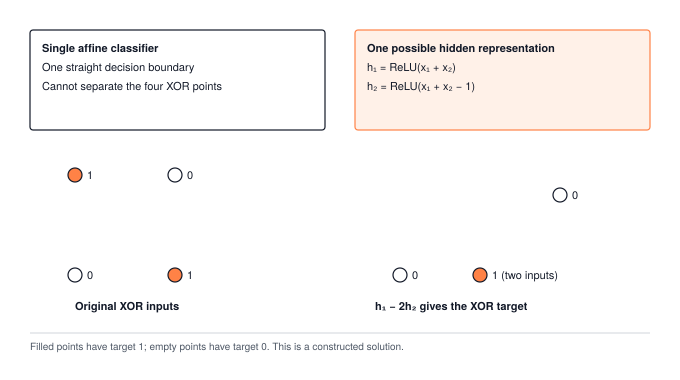
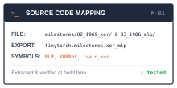
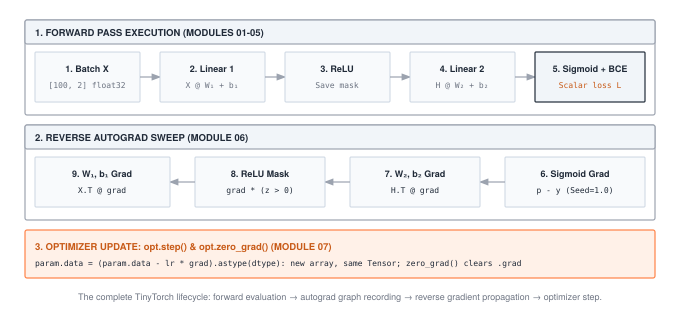
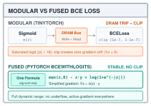

# Synthesis I: From Perceptrons to Rumelhart's MLP {#sec-milestone-1 .unnumbered}

::: {.column-margin}
{width="100%" fig-alt="TinyTorch execution datapath blueprint highlighting Synthesis I MLP Synthesis as the active subsystem."}

*Framework Blueprint: Synthesis I synthesizes all Part I mechanisms into a complete neural network to solve the non-linear XOR boundary.*
:::


### The History and the Problem

In 1958, Frank Rosenblatt introduced the perceptron, sparking initial optimism for trainable artificial intelligence. But in 1969, Marvin Minsky and Seymour Papert proved mathematically that single-layer perceptrons could not learn the non-linear XOR (exclusive or) decision boundary. A single linear hyperplane cannot separate points whose positive labels sit on opposite diagonals in coordinate space. Because real-world classification boundaries are fundamentally non-linear, this limitation paralyzed neural network research and precipitated the first "AI Winter," halting funding and progress for more than a decade.

### The Multi-Layer Breakthrough

The resolution required folding the coordinate space itself. In 1986, Rumelhart, Hinton, and Williams demonstrated that multi-layer perceptrons (MLPs) equipped with non-linear hidden units, trained through reverse-mode automatic differentiation (backpropagation), could resolve the XOR crisis. Hidden layers project inputs into transformed intermediate representations where previously inseparable patterns become linearly separable.

### What Was Solved

By chaining affine projections with non-linear activations and executing exact reverse-mode gradient updates through computational graphs, neural networks acquired the capacity to learn non-linear decision boundaries autonomously. Synthesis I integrates Modules 01 through 08 (`tinytorch/core/tensor` through `tinytorch/core/training`) to construct and train that complete multi-layer network, verifying that our foundational engine resolves the historical crisis that once halted the field.

In modern deep learning, creating a multi-layer perceptron to learn non-linear decision surfaces is trivial:

```python
import torch
import torch.nn as nn

# The multi-layer perceptron that resolves the XOR crisis
mlp = nn.Sequential(
    nn.Linear(2, 4),
    nn.ReLU(),
    nn.Linear(4, 1)
)

x = torch.tensor([[0., 0.], [0., 1.], [1., 0.], [1., 1.]])
predictions = mlp(x)
print("Predictions shape:", predictions.shape)  # (4, 1)
```

Underneath that short declaration, the framework synthesizes multiple core mechanisms into a single learning machine:

1. **Geometric space warping:** The hidden layer projects the 2D input coordinates into a 4D hidden subspace, where the non-linear ReLU activation bends and folds the coordinates so a final linear hyperplane can cleanly separate the classes.
2. **Modular container pipelining:** The `Sequential` container automatically threads activations forward and routes training signals across parameter layers.
3. **Multi-layer backward chain rule:** Autograd stitches multiple affine transformations and non-linear gates into an end-to-end graph, computing exact parameter gradients across depth.

This milestone synthesizes the foundations of TinyTorch into a complete working deep learning system, demonstrating that our modular kernel can learn non-linear representations from scratch. Before validating our multi-layer network, we must inspect the mathematical barrier that blocked early single-layer perceptrons.

{#fig-milestone1-history width="100%"}

---

::: {.column-margin}
**↩ Jump back:** @sec-layers
*Composing Linear layers and ReLU activations to bend representation space.*
:::


## Part 1: The 1958 Perceptron (Forward Pass Without Training)

Frank Rosenblatt's 1958 perceptron is one `Linear` layer feeding one squashing function (`Sigmoid`). With Modules 01 through 03 in hand, the model class fits in about a dozen lines of Python, and the rest of this excerpt draws the data and runs one forward pass:

```python
# milestones/01_1958_perceptron/01_rosenblatt_forward.py (trimmed)
import numpy as np
rng = np.random.default_rng()
from tinytorch.core.tensor import Tensor        # Module 01: YOU built this!
from tinytorch.core.layers import Linear        # Module 03: YOU built this!
from tinytorch.core.activations import Sigmoid  # Module 02: YOU built this!

class Perceptron:
    def __init__(self, input_size=2, output_size=1):
        self.linear = Linear(input_size, output_size)
        self.activation = Sigmoid()

    def forward(self, x):
        x = self.linear(x)
        x = self.activation(x)
        return x

    def __call__(self, x):
        return self.forward(x)

# in main():
cluster1 = rng.normal([2, 2], 0.5, (5, 2))   # Class 1: top-right
cluster2 = rng.normal([-2, -2], 0.5, (5, 2)) # Class 0: bottom-left
X = np.vstack([cluster1, cluster2]).astype(np.float32)
y = np.array([1, 1, 1, 1, 1, 0, 0, 0, 0, 0], dtype=np.float32)  # True labels

import tinytorch.core.layers as _layers
_layers.rng = np.random.default_rng()

model = Perceptron(input_size=2, output_size=1)

input_tensor = Tensor(X)
predictions = model(input_tensor)

pred_classes = (predictions.data > 0.5).astype(int).flatten()
accuracy = (pred_classes == y).mean()
```

Running this forward pass (`tito milestone run 01`) draws two clusters of five points each, centered at $(2, 2)$ for class 1 and $(-2, -2)$ for class 0, and scores them with a perceptron whose weights are random. Neither the data nor the weights are seeded. The script replaces the layers module's seeded generator, so every run draws a new line. The accuracy can land anywhere from 0% to 100%. The clusters are separable, so a random line often gets every point right or every point backwards, and neither outcome is learning. The forward pass computes without error, but because the weights are drawn randomly from initialization, the decision boundary lands at an arbitrary orientation. Since the accuracy is luck, the script grades the arithmetic instead: it recomputes $\sigma(XW + b)$ in NumPy from the model's own weights and exits with status 1 if your `Linear` and `Sigmoid` disagree.

This demonstrates the foundational lesson of deep learning systems: **a forward pass alone does not produce intelligence**. Writing model architectures is straightforward; making them learn requires loss functions, automatic differentiation, and optimizers (@sec-losses through @sec-training).

---

## Part 2: The 1969 XOR Crisis (Linear Separability Limits)

Can we fix the perceptron simply by choosing the weights by hand? For linearly separable clusters, yes: picking $w_1 = 1, w_2 = 1, b = 0$ separates the script's two clusters, centered at $(-2,-2)$ and $(2,2)$, with 100% accuracy.

In 1969, Marvin Minsky and Seymour Papert published their famous critique showing that for non-linear boundaries, no weight configuration exists that can separate the data.[^fn-minsky-papert-ai-winter] XOR (exclusive or) is the smallest function that defeats the single-layer perceptron. It outputs 1 when its two inputs differ and 0 when they agree: $(0,0) \to 0$, $(0,1) \to 1$, $(1,0) \to 1$, and $(1,1) \to 0$. The two positive corners sit on one diagonal and the two negative corners on the other. Draw any line you like through the square and at least one corner ends up on the wrong side.

[^fn-minsky-papert-ai-winter]: Minsky and Papert proved that single-layer perceptrons of limited order cannot compute global predicates such as parity (XOR is its two-input case) and connectedness. The authors acknowledged that multilayer networks escape these limits, but they doubted that a practical learning procedure for them would be found; they did not prove that none existed. Their book is often credited with contributing to a decline in neural network funding that lasted until Rumelhart, Hinton, and Williams popularized backpropagation in 1986.

The script in `milestones/02_1969_xor/01_xor_crisis.py` tests several candidate lines before the proof. It builds the perceptron from the existing modules, sets two weights and one bias by hand, and scores the four rows:

```python
# milestones/02_1969_xor/01_xor_crisis.py (trimmed)
import numpy as np
from tinytorch import Tensor, Linear, Sigmoid

XOR_INPUTS = np.array([
    [0.0, 0.0],
    [0.0, 1.0],
    [1.0, 0.0],
    [1.0, 1.0]
])

XOR_TARGETS = np.array([
    [0.0],  # 0 XOR 0 = 0
    [1.0],  # 0 XOR 1 = 1
    [1.0],  # 1 XOR 0 = 1
    [0.0],  # 1 XOR 1 = 0
])

class SingleLayerPerceptron:
    def __init__(self):
        self.linear = Linear(2, 1)
        self.sigmoid = Sigmoid()

    def set_weights(self, w1, w2, b):
        # Weight shape is (in_features, out_features) = (2, 1)
        self.linear.weight.data[...] = [[w1], [w2]]
        self.linear.bias.data[...] = b

    def __call__(self, x):
        return self.sigmoid(self.linear(x))

def evaluate_on_xor(model):
    X = Tensor(XOR_INPUTS)
    predictions = model(X)
    pred_classes = (predictions.data > 0.5).astype(int)
    accuracy = (pred_classes == XOR_TARGETS).mean()
    return accuracy, predictions.data.flatten()

# in main(), the first four of ten hand-picked lines:
model = SingleLayerPerceptron()
configurations = [
    (1.0, 1.0, -0.5, "Diagonal line (positive slope)"),
    (1.0, 1.0, -1.5, "Diagonal line (shifted)"),
    (-1.0, 1.0, 0.0, "Diagonal line (negative slope)"),
    (1.0, -1.0, 0.0, "Diagonal line (other direction)"),
]
for i, (w1, w2, b, description) in enumerate(configurations):
    model.set_weights(w1, w2, b)
    accuracy, preds = evaluate_on_xor(model)
```

The four settings score 75, 25, 75, and 75 percent. The code uses `> 0.5`, so a score exactly at zero belongs to class zero; the proof uses the opposite tie convention. Neither convention makes XOR separable. The full script tries ten hand-picked lines and one hundred random ones, and the best of the 110 gets three rows out of four. Notice what is absent. There is no optimizer and no loss in this script, and it needs only modules 01 through 03. The failure is not a training failure. No weight setting represents all four labels, so changing the training procedure cannot repair this model. The script checks every one of those 110 forward passes against the same arithmetic in NumPy, and it treats a line that scores all four rows as a bug: a single layer that "solves" XOR can only come from broken code, so the milestone exits with status 1.

## The Idea

::: {.column-margin}
**↪ Jump ahead:** @sec-transformers
*Scaling from 2-layer MLPs to deep, autoregressive Transformer foundation models.*
:::

::: {.callout-tip title="Pause & Predict: The Dimensionality of Separation"}
A single-layer perceptron operates in 2D space and fails on XOR because no single straight line can isolate the two positive diagonal points. If you project 2D coordinates into a 4D space using a linear layer without an activation, can a hyperplane separate XOR? Why does a non-linear activation like ReLU fundamentally change what is geometrically separable?
:::


### Why one line cannot do it

The proof fits in four lines. For the perceptron to get every row right, its weights must satisfy all four conditions at once:

$$\begin{aligned}
(0,0) \to 0 &\implies b < 0 \\
(0,1) \to 1 &\implies w_2 + b \ge 0 \\
(1,0) \to 1 &\implies w_1 + b \ge 0 \\
(1,1) \to 0 &\implies w_1 + w_2 + b < 0
\end{aligned}$$

Adding the second and third lines gives $w_1 + w_2 + 2b \ge 0$. Adding the first and fourth gives $w_1 + w_2 + 2b < 0$. No numbers satisfy both, so no perceptron computes XOR. In the vocabulary of the field, XOR is not linearly separable.[^fn-linearly-separable-xor]

[^fn-linearly-separable-xor]: **Linearly separable**: a labeled set of points is linearly separable when one straight line (in higher dimensions, one flat plane) puts every positive point on one side and every negative point on the other. AND and OR are linearly separable with two inputs; XOR is the smallest function that is not, which is why it became the test case.

### A hidden layer folds the plane

The escape is to stop classifying the raw inputs and classify a transformed version of them instead. Insert a layer of neurons between input and output, each computing its own `Linear` sum followed by a ReLU, and let the output neuron draw its line in the space of those hidden values. Two hidden units are enough for XOR, and a specific pair makes the mechanism visible. Both read the same sum $s = x_1 + x_2$:

$$h_1 = \text{ReLU}(s), \qquad h_2 = \text{ReLU}(s - 1), \qquad y = h_1 - 2h_2$$

::: {.column-margin}
{width="100%" fig-alt="XOR 2D input space folded into hidden space via ReLU, making the decision boundary linearly separable."}

*A hidden layer folds the 2D plane: ReLU projects non-separable XOR vertices into a separable 3-point geometry.*
:::

Unit $h_1$ switches on as soon as at least one input is on. Unit $h_2$ switches on only when both are. The output neuron rewards $h_1$ and punishes $h_2$ hard enough that the two cancel exactly when both inputs are on. Follow the four corners into the hidden plane and the fold appears. Corner $(0,0)$ lands at $(0, 0)$, both positive corners land on the same point $(1, 0)$, and corner $(1,1)$ lands at $(2, 1)$. The two positive rows, which no line could isolate in the input square, are now a single point with the negatives on either side of it along the $h_1$ axis, and the line $h_1 - 2h_2 = 0.5$ separates them. ReLU did the work. A layer without it would compose two linear maps into one linear map, and the plane would stay flat.

### How the hidden weights receive a learning signal

The hand-built weights establish that a solution exists. Training must find a solution using only the targets at the output. A hidden neuron has no label of its own, but its effect on the loss passes through the output layer. @sec-autograd supplies the mechanism: the tape records the hidden `Linear`, the ReLU, and the output `Linear` as ordinary operations. `loss.backward()` applies the chain rule along that path until every participating hidden weight has a gradient. The worked trace below follows one such gradient before relying on a full training run.

## The Code

### The XOR network and its data

The XOR truth table itself is a complete finite task, so fitting its four rows is a valid first integration check. The solved script adds a second demand: nearby inputs should receive the same labels. It draws twenty-five samples around each corner with Gaussian noise of standard deviation 0.1, giving one hundred points, then shuffles them. These samples encourage the decision boundary to hold over a neighborhood. Testing the exact corners checks the intended truth table, while a separate draw of noisy inputs would test generalization within the chosen noise model.

::: {.column-margin}
{width="100%" fig-alt="Source code mapping card for Milestone I MLP Synthesis showing file path, exported package, and tested primitives."}

*Source Code Mapping: Milestone I combines Modules 01–07 to build and train a multi-layer perceptron from scratch.*
:::

The model is the two-layer shape from The Idea with two changes from the hand-built construction. The hidden layer has four units rather than two. Two units suffice when choosing the weights analytically, but additional units give gradient descent more possible active paths from a random start; the next subsection shows what happens when the slack runs out. The hidden units use ReLU rather than the sigmoid of the 1986 paper, because @sec-activations showed that a sigmoid passes at most a quarter of the gradient through and ReLU passes the gradient unchanged on its positive branch and blocks it on its negative branch. After the output layer comes a sigmoid, and the reason is the loss. Binary cross-entropy, the two-class form of @sec-losses's cross-entropy, scores a probability against a 0 or 1 target, and a `Linear` layer emits any real number, so the sigmoid is what turns the score into something the loss can read.

```python
# adapted from milestones/02_1969_xor/02_xor_solved.py (corner loop and forward pass condensed)
import numpy as np
from tinytorch import Tensor, Linear, ReLU, Sigmoid, BinaryCrossEntropyLoss, SGD

rng = np.random.default_rng(7)

def generate_xor_data(n_samples=100):
    per_corner = n_samples // 4
    xs, ys = [], []
    for (a, b), target in [((0, 0), 0), ((0, 1), 1), ((1, 0), 1), ((1, 1), 0)]:
        xs.append(rng.standard_normal((per_corner, 2)) * 0.1 + np.array([a, b]))
        ys.append(np.full((per_corner, 1), float(target)))
    X, y = np.vstack(xs), np.vstack(ys)
    order = rng.permutation(n_samples)
    return Tensor(X[order]), Tensor(y[order])

class XORNetwork:
    def __init__(self, hidden_size=4):
        self.hidden = Linear(2, hidden_size)
        self.relu = ReLU()
        self.output = Linear(hidden_size, 1)
        self.sigmoid = Sigmoid()

    def __call__(self, x):
        return self.sigmoid(self.output(self.relu(self.hidden(x))))

    def parameters(self):
        return self.hidden.parameters() + self.output.parameters()
```

The model is seventeen numbers: a 2 by 4 weight matrix and 4 biases in the hidden layer, a 4 by 1 weight matrix and 1 bias in the output layer. Notice `parameters()`. `XORNetwork` is a plain Python class, not a @sec-layers `Layer`, so nothing walks its attributes for it; it has to hand the optimizer the concatenation of the two layers' lists itself. That list is all the optimizer ever learns about the model's structure. A production container can discover these tensors automatically; the optimizer still receives parameter references, not a description of the forward computation.

### The loop

The first call inside the loop is `model(X)`. Recording is already enabled because the `Linear` layer constructors initialize weights and biases with `requires_grad=True`. The optimizer holds references to the four parameter tensors and tracks their update buffers. Forward, loss, backward, step, and clear then follow the cycle from @sec-training. The step that is easiest to drop is the clear. @sec-autograd's `backward()` adds into `.grad` rather than assigning to it, so if the gradients are not cleared between one backward pass and the next, the next update uses accumulated gradients from different parameter values. That changes the update direction as well as its magnitude. Nothing needs to raise an error, so comparing one controlled update is a better diagnostic than waiting for the loss to fail.

The training function below writes that cycle directly. It returns the model for the next experiment; the full milestone script returns a history dictionary for its display. The XOR class exposes `__call__`, which this loop uses. `Trainer._forward` instead calls a model's `forward` method, so handing this exact class to `Trainer` would require providing that method. The manual loop makes this interface boundary visible.

```python
def train_network(model, X, y, epochs=500, lr=0.5):
    loss_fn = BinaryCrossEntropyLoss()
    optimizer = SGD(model.parameters(), lr=lr)
    for epoch in range(epochs):
        predictions = model(X)                 # forward
        loss = loss_fn(predictions, y)         # loss
        loss.backward()                        # backward, through the hidden layer
        optimizer.step()                       # update
        optimizer.zero_grad()                  # clear, ready for the next epoch
        if (epoch + 1) % 100 == 0:
            accuracy = ((predictions.data > 0.5).astype(int) == y.data).mean()
            print(f"epoch {epoch + 1:3d}  loss {float(loss.data):.4f}  accuracy {accuracy:.0%}")
    return model

import tinytorch.core.layers as layers
layers.rng = np.random.default_rng(11)         # see below

X, y = generate_xor_data(100)
model = train_network(XORNetwork(hidden_size=4), X, y)
```

The trailing `zero_grad()` is valid here because the freshly constructed parameters begin with `grad=None`, and every iteration clears after its update. Calling this function on a model with existing gradients would require clearing before the first forward pass as well. The printed predictions and loss belong to the forward pass before the update; measuring the updated model would require another forward pass. The script also reseeds the random number generator that `Linear` uses for its initial weights.[^fn-seed-xor-init] Initialization determines which ReLU paths are initially active. With only four hidden units, some random starts put a unit permanently on the dead side of its ReLU, and a run can settle at 75 percent accuracy with one corner near probability 0.5. Inspecting hidden pre-activations and gradients distinguishes the dying ReLU failure from a broken backward path. The default seed, 11, is chosen so that the output layer alone cannot solve the task: its initial hidden features do not separate the four corners, so the hidden layer has to learn. The script therefore passes only when the trained model gets all four truth-table rows right, the hidden layer received a nonzero gradient, and the hidden weights moved by at least a quarter of their initial norm. A seeded run repeats exactly, so a failure at the default seed points at the code, not at luck. Only a run started with a different `--seed` can land on the 75 percent plateau with correct code, which happens for about one seed in six.

::: {#chk-symmetry-breaking-initialization .callout-checkpoint title="Checkpoint: Symmetry breaking in hidden layer initialization"}
If all weights in a hidden layer are initialized to identical values (such as all zeros or all ones), every hidden unit computes the exact same forward pre-activation and receives the exact same gradient during `backward()`. The units update identically and remain clones forever, effectively reducing an $N$-unit hidden layer to a single unit.

Non-zero randomized initialization (such as He/Kaiming normal) is required to break permutation symmetry across neurons.
:::

[^fn-seed-xor-init]: **Seed**: the starting value of a pseudo-random number generator. Two runs with the same seed draw the same sequence of "random" numbers, which makes a training run reproducible; two runs with different seeds start from different initial weights and can end in different places.

With that seed, the excerpt starts at loss 0.7468 and 38 percent accuracy, reaches 100 percent accuracy by epoch 100 at loss 0.1773, and ends after 500 epochs at loss 0.0060. Fed the four exact corners, the trained network answers 0.005, 0.996, 0.997, and 0.002. These values check that the seeded training path reaches a solution; the hand-built trace below explains why such a solution exists.

{#fig-milestone1-kernel-trace width="100%" fig-alt="Schematic of one XOR training iteration showing forward Linear, ReLU, Linear, and Sigmoid with BCE loss, followed by backward gradient steps and the optimizer update."}

### Digits

The third script moves from a truth table to images, and three things have to change for the same two-layer shape to cope. TinyDigits ships with the repository as two pickled arrays: 1,000 training images and 200 test images in the bundled split used here, each 8 by 8 pixels with values normalized to the interval from 0 to 1, labeled 0 through 9. An 8 by 8 image flattens to a 64-vector, the hidden layer has 32 units, and the output has 10, one per digit.

The first change is the output. A digit classifier has ten answers, not two, and the two-class trick of one sigmoid and one probability does not stretch to cover it; ten separate sigmoids would give ten probabilities that need not sum to one and ten losses with nothing tying them together. @sec-losses's `CrossEntropyLoss` takes the ten raw scores and an integer label and does the softmax and the logarithm inside, with the max shift that keeps a score of 100 from overflowing float32. The model therefore emits ten raw scores, there is no sigmoid, and the prediction is the index of the largest score.

The second change is how the data arrives. XOR feeds all one hundred points through the network at once, giving one gradient step per epoch. With 1,000 digit images, `DataLoader` batches of 32 produce 32 steps per epoch: 31 full batches and a final batch of eight. Each `CrossEntropyLoss` averages over the current batch, including that shorter final batch. Twenty epochs therefore make 640 updates. The loader changes how often parameters move without changing the model's forward interface.

The third change is what we measure. Training loss checks whether updates fit the examples presented to the optimizer. Held-out accuracy checks predictions on other examples from the same dataset. Neither substitutes for the other, and a high held-out score on a small dataset does not establish general digit recognition. The listing reports held-out accuracy so the two roles stay distinct; repeatedly tuning settings to this split would turn it into validation data and require a fresh test split.
```python
# adapted from milestones/03_1986_mlp/01_rumelhart_tinydigits.py (loading, evaluation, and display condensed)
import pickle
import numpy as np
from tinytorch import Tensor, Linear, ReLU, CrossEntropyLoss, SGD
from tinytorch.core.dataloader import TensorDataset, DataLoader

def load_split(name):                                   # paths relative to the repo root
    with open(f"datasets/tinydigits/{name}.pkl", "rb") as f:
        d = pickle.load(f)                              # {"images": (N, 8, 8), "labels": (N,)}
    return Tensor(d["images"].astype(np.float32)), Tensor(d["labels"].astype(np.int64))

train_images, train_labels = load_split("train")
test_images, test_labels = load_split("test")

class DigitMLP:
    def __init__(self, input_size=64, hidden_size=32, num_classes=10):
        self.fc1 = Linear(input_size, hidden_size)
        self.relu = ReLU()
        self.fc2 = Linear(hidden_size, num_classes)

    def __call__(self, x):
        if len(x.data.shape) > 2:                       # (N, 8, 8) -> (N, 64)
            x = x.reshape(x.shape[0], -1)
        return self.fc2(self.relu(self.fc1(x)))

    def parameters(self):
        return [self.fc1.weight, self.fc1.bias, self.fc2.weight, self.fc2.bias]

def evaluate_accuracy(model, images, labels):
    predictions = np.argmax(model(images).data, axis=1)
    return 100.0 * (predictions == labels.data).mean()

model = DigitMLP()
train_loader = DataLoader(TensorDataset(train_images, train_labels),
                          batch_size=32, shuffle=True)
loss_fn = CrossEntropyLoss()
optimizer = SGD(model.parameters(), lr=0.01)

for epoch in range(20):
    for batch_images, batch_labels in train_loader:
        logits = model(batch_images)
        loss = loss_fn(logits, batch_labels)
        loss.backward()
        optimizer.step()
        optimizer.zero_grad()
    print(f"epoch {epoch + 1:2d}  test accuracy {evaluate_accuracy(model, test_images, test_labels):.1f}%")
```

`DigitMLP.__call__` changes an `(N, 8, 8)` batch to `(N, 64)` before the first `Linear`. The reference `Tensor.reshape` wraps the NumPy result in a new Tensor, which owns copied float32 storage. It also records the reshape when a gradient connection is needed. Reconstructing a Tensor directly from `.data` would discard that connection; using the Tensor operation keeps the example safe if a trainable image transform later precedes the classifier. `parameters()` returns the four original parameter tensors, so an update changes the same weights the next forward pass reads.

The model has $64 \times 32 + 32 + 32 \times 10 + 10 = 2{,}410$ parameters, or 9,640 bytes of float32 parameter data. The bundled training images occupy $1{,}000 \times 64 \times 4 = 256{,}000$ bytes before Tensor and Python overhead. Dataset variants and random initialization change the learning curve, so the split sizes can be checked directly with `train_images.shape` and `test_images.shape`. A useful run records those sizes, the seed, the loss, and held-out accuracy. The invariant under test is that batches reach the loss and the resulting gradients reach both layers, not that every run attains a particular percentage. The script still sets a floor. It exits with status 1 when test accuracy falls below 75%, well under the roughly 82% a working implementation reaches.

## A Worked Trace

The hand-built two-unit network from The Idea is small enough to run in your head, and running it is the fastest way to see the fold. The listing is plain Python with no framework, so it runs anywhere.

```python
corners = [(0, 0), (0, 1), (1, 0), (1, 1)]
targets = [0, 1, 1, 0]

def relu(v):
    return v if v > 0 else 0.0

for (x1, x2), t in zip(corners, targets):
    s = x1 + x2                      # both hidden units read the same sum
    z1, z2 = s, s - 1.0        # pre-activations
    h1, h2 = relu(z1), relu(z2)      # the fold
    y = h1 - 2 * h2              # output neuron
    print(f"x=({x1},{x2})  z=({z1:+.1f},{z2:+.1f})  h=({h1:.1f},{h2:.1f})  y={y:.1f}  target={t}")
```

In lines 1 to 2, `corners` and `targets` define the four XOR vertices. Inside the loop (lines 7 to 12), line 8 forms $s = x_1 + x_2$ and line 9 computes the two pre-activations $z_1 = s$ and $z_2 = s - 1.0$. Line 10 applies the ReLU activation ($h_1, h_2$), creating the space-fold where $(0, 1)$ and $(1, 0)$ both collapse to $(1.0, 0.0)$. Line 11 combines the hidden units via $y = h_1 - 2h_2$, and line 12 prints the output matching @tbl-xor-numerical-trace.

| Input $(x_1, x_2)$ | Target | Pre-activation $(z_1, z_2)$ | Hidden $(h_1, h_2)$ | Output $y = h_1 - 2h_2$ |
| :--- | :--- | :--- | :--- | :--- |
| $(0, 0)$ | 0 | $(0.0, -1.0)$ | $(0.0, 0.0)$ | $0.0$ |
| $(0, 1)$ | 1 | $(1.0, 0.0)$ | $(1.0, 0.0)$ | $1.0$ |
| $(1, 0)$ | 1 | $(1.0, 0.0)$ | $(1.0, 0.0)$ | $1.0$ |
| $(1, 1)$ | 0 | $(2.0, 1.0)$ | $(2.0, 1.0)$ | $0.0$ |

: **A constructed XOR solution**: The hand-built two-unit network on the four XOR corners. The two positive rows collapse onto the same hidden point. {#tbl-xor-numerical-trace tbl-colwidths="[18,10,26,22,24]"}

The hidden column in @tbl-xor-numerical-trace matches the construction in @fig-milestone1-history. Rows two and three are identical after the ReLU, and row four is the only one where $h_2$ is nonzero, so the output neuron only has to subtract it away. Every number is exact, which is what makes this a good first check when your own `Linear` and `ReLU` produce something surprising.

The hand-built fold establishes representational capacity. A separate one-example backward trace establishes how a hidden weight receives credit. In lines 1 to 5 of the backward script below, `trace_model` is configured with deterministic weights ($W_h = \mathbf{1}_{2\times 2}$, $W_o = [1.0, -1.0]^T$) and zero biases. Lines 6 to 7 prepare the optimizer and clear gradients. In line 8, binary cross-entropy loss is computed on input `[[1.0, 0.0]]` with target `[[1.0]]`. Line 9 calls `loss.backward()`, propagating through the linear-ReLU-linear graph. Lines 10 to 11 print the resulting weight gradients: `output.weight.grad` is `[[-0.5], [-0.5]]`, and `hidden.weight.grad` is `[[-0.5, 0.5], [0.0, 0.0]]`. Line 12 performs the parameter update `optimizer.step()`, and line 13 confirms that the first row of hidden weights adjusts to `[[1.05, 0.95], [1.0, 1.0]]`.

```python
trace_model = XORNetwork(hidden_size=2)
trace_model.hidden.weight.data[:] = [[1.0, 1.0], [1.0, 1.0]]
trace_model.hidden.bias.data[:] = 0.0
trace_model.output.weight.data[:] = [[1.0], [-1.0]]
trace_model.output.bias.data[:] = 0.0
optimizer = SGD(trace_model.parameters(), lr=0.1)
optimizer.zero_grad()
loss = BinaryCrossEntropyLoss()(trace_model(Tensor([[1.0, 0.0]])), Tensor([[1.0]]))
loss.backward()
print(trace_model.output.weight.grad)      # [[-0.5], [-0.5]]
print(trace_model.hidden.weight.grad)      # [[-0.5, 0.5], [0.0, 0.0]]
optimizer.step()
print(trace_model.hidden.weight.data)      # [[1.05, 0.95], [1.0, 1.0]]
```

The output matmul multiplies the incoming $-0.5$ gradient by its saved weights, yielding hidden gradients of $-0.5$ and $+0.5$. Both ReLU inputs are positive, so both gradients pass through. The hidden matmul forms the outer product with the saved input $(1, 0)$: the first row updates while the second receives zero. The hidden layer needs no target of its own; its derivative follows the exact path influencing the supervised output. Increasing the first hidden activation raises the output through its positive weight, whereas decreasing the second raises it through its negative weight. Gradient descent applies both adjustments, verifying graph composition and parameter identity before extended training.

The trained four-unit network finds a fold of its own. Feeding the four exact corners through the seeded model gives the hidden activations in @tbl-xor-learned-fold; they differ from the hand-built construction while preserving its labels.

| Input | Hidden $(h_1, h_2, h_3, h_4)$ | Output score $z$ | Probability $\sigma(z)$ |
| :--- | :--- | :--- | :--- |
| $(0, 0)$ | $(0.00, 0.00, 0.21, 1.71)$ | $-5.38$ | $0.005$ |
| $(0, 1)$ | $(0.00, 0.00, 2.66, 0.00)$ | $+5.60$ | $0.996$ |
| $(1, 0)$ | $(2.45, 0.38, 0.00, 0.16)$ | $+5.92$ | $0.997$ |
| $(1, 1)$ | $(0.00, 2.65, 2.44, 0.00)$ | $-6.04$ | $0.002$ |

: **A learned XOR solution**: Hidden activations of the trained four-unit XOR network at the four corners. The output score is $z = \mathbf{w}_2 \cdot \mathbf{h} + b_2$ with learned weights $\mathbf{w}_2 = (3.59, -4.20, 2.40, -2.98)$ and bias $b_2 = -0.78$. {#tbl-xor-learned-fold tbl-colwidths="[14,36,24,26]"}

The learned units have readable jobs. Unit 1 responds to $(1,0)$ and unit 3 most strongly to $(0,1)$, and both carry positive output weights. Unit 3 also fires for $(1,1)$, so unit 2, which fires almost only for $(1,1)$ and carries the largest negative weight, is how the network cancels that row. Unit 4 fires mainly for $(0,0)$ and is also weighted negative. Nobody told the network to decompose XOR this way. It is one of many folds that work, and a different seed finds a different one.

## From TinyTorch to Production

The corresponding PyTorch experiment uses a container to discover its parameters and a fused loss to consume raw scores. The update loop remains explicit. The conversion below copies the earlier TinyTorch XOR tensors into PyTorch tensors before running the comparison.

```python
import torch, torch.nn as nn

X_torch = torch.tensor(X.data, dtype=torch.float32)
y_torch = torch.tensor(y.data, dtype=torch.float32)
model = nn.Sequential(nn.Linear(2, 4), nn.ReLU(), nn.Linear(4, 1))
loss_fn = nn.BCEWithLogitsLoss()
optimizer = torch.optim.SGD(model.parameters(), lr=0.5)
for epoch in range(500):
    optimizer.zero_grad()
    loss = loss_fn(model(X_torch), y_torch)
    loss.backward()
    optimizer.step()
```

| Piece | TinyTorch milestone | PyTorch |
| :--- | :--- | :--- |
| Model container | `XORNetwork` class with a hand-written `parameters()` | `nn.Sequential`; `parameters()` walks the module tree |
| Output and loss | `Sigmoid` then `BinaryCrossEntropyLoss` with the probability clipped to $[10^{-7}, 1 - 10^{-7}]$ | `BCEWithLogitsLoss`, sigmoid and loss fused into one numerically stable function |
| Weight init | LeCun-scaled normal, seeded from a module-level generator | Uniform within bounds set by input width; seeded by `torch.manual_seed` |
| Loop | Five steps written by hand | Five steps written by hand |
| Batches | `DataLoader` over in-memory arrays, one process | `DataLoader` can configure workers and prefetching |
| Arithmetic | NumPy on the CPU | CPU, or GPU kernels launched per operation |

: **The same update contract in two frameworks**: The XOR and digits experiments in TinyTorch and in PyTorch. {#tbl-milestone1-production-bridge tbl-colwidths="[18,42,40]"}

::: {.column-margin}
{width="100%" fig-alt="Modular loss versus fused BCEWithLogitsLoss comparison showing memory traffic and gradient stability."}

*Modular vs Fused Loss: Separating Sigmoid and BCELoss writes an intermediate probability tensor and clips gradients, whereas BCEWithLogits evaluates one log-sum-exp formula that stays finite without clipping.*
:::

The loss comparison in @tbl-milestone1-production-bridge reveals a crucial trade-off between pedagogical modularity and systems performance. To maintain clear abstraction boundaries, TinyTorch separates the `Sigmoid` activation from the `BCELoss` module. However, executing them as separate operations introduces two significant runtime vulnerabilities:

1. **Numerical instability**: Evaluating $\sigma(z) = 1/(1+e^{-z})$ directly in float32 causes exponentials to saturate for large magnitudes, forcing TinyTorch to manually clip probabilities to $[10^{-7}, 1 - 10^{-7}]$ to prevent $\log(0)$ crashes. While clipping avoids `NaN`, it creates zero gradients on clipped activations, permanently stalling weight updates in saturated regimes.
2. **Intermediate memory traffic**: Separating the operations writes an intermediate probability tensor of shape $(B, 1)$ out to main memory, only to immediately read it back across the bus into the loss kernel.

Production engines address these issues by merging the two operations: `torch.nn.BCEWithLogitsLoss` combines the sigmoid and binary cross-entropy algebra into a single numerically stable expression:
$$\mathcal{L} = \max(z, 0) - z \cdot y + \log(1 + e^{-|z|})$$
This formulation keeps every term finite without epsilon clipping and simplifies the gradient to $\sigma(z) - y$; the [PyTorch loss documentation](https://docs.pytorch.org/docs/stable/generated/torch.nn.modules.loss.BCEWithLogitsLoss.html) attributes its advantage to this log-sum-exp stability. Whether the operations also run as one kernel depends on the backend and compiler.

::: {#psp-universal-approximation-mlp .callout-perspective title="Production Bridge: The Universal Approximation Theorem in practice"}
Cybenko (1989) and Hornik (1991) proved that single-hidden-layer feedforward networks with non-linear activations can approximate any continuous function on compact subsets of $\mathbb{R}^n$ arbitrarily well.

However, the theorem guarantees *representational existence*, not *efficient learnability*: an MLP may require exponentially many hidden neurons ($O(2^n)$) to approximate functions that deep, structured architectures learn with polynomial parameter counts using gradient descent.[^fn-barron-curse-dimensionality]
:::

[^fn-barron-curse-dimensionality]: While the Universal Approximation Theorem guarantees uniform approximation of continuous functions by single-hidden-layer networks, Barron (1993) showed that for functions with a bounded Fourier-moment (Barron) norm, a one-hidden-layer sigmoidal network with $n$ units reaches squared error $O(1/n)$ independent of the input dimension $d$, whereas any linear combination of $n$ fixed basis functions cannot beat order $(1/n)^{2/d}$. Outside that function class, the width a shallow network needs can grow exponentially with $d$.

The core training contract remains invariant: forward passes evaluate parameters, backward passes compute gradients, and optimizers apply updates. Production frameworks alter batching, scheduling, or memory layouts while preserving this contract. When training stalls, systematic diagnosis precedes structural changes: inspect hidden pre-activations, verify backward propagation with deterministic traces, and test initialization seeds before adjusting hyperparameters.

## Summary

Eight core modules now participate in a single unified training loop. The XOR experiment shows how multi-layer networks solve linearly inseparable tasks via non-linear space folding, while the backward trace verifies exact gradient flow across layers without explicit intermediate targets. In @sec-transformers, we discover that the two-layer multi-layer perceptron built in this synthesis never disappears in modern foundation models: it serves as the Feedforward Network (FFN) sublayer in every transformer block, projecting token representations into expanded dimensions before non-linear gating. @sec-convolutions preserves this identical training contract while introducing spatial weight sharing for images.

## Further Reading

- **Rosenblatt** (1958). "[The perceptron: a probabilistic model for information storage and organization in the brain](https://doi.org/10.1037/h0042519)." *Psychological Review*. The single-layer model this milestone starts from.
- **Minsky and Papert** (1969). *Perceptrons: An Introduction to Computational Geometry*, MIT Press. The analysis of what a single linear boundary cannot represent, XOR included.
- **Rumelhart, Hinton, and Williams** (1986). "[Learning representations by back-propagating errors](https://doi.org/10.1038/323533a0)." *Nature*. Backpropagation through a hidden layer, the method that solves XOR here.
