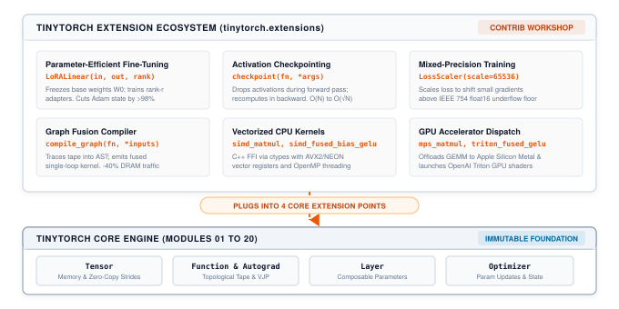

TinyTorch's core (its tensor striding, autograd tape, and execution engine) is intentionally kept minimal. Across Modules 01 through 20, you built a complete, self-contained deep learning framework from bare silicon concepts up to modern generative AI:

- An n-dimensional array abstraction with arbitrary striding and slicing ([Module 01: Tensor](modules/01_tensor.qmd))
- A reverse-mode automatic differentiation tape with topological backpropagation ([Module 06: Autograd](modules/06_autograd.qmd))
- Composable parametric layers, activations, loss functions, and optimizers (Modules 02–07)
- Data ingestion pipelines, multi-headed self-attention, and autoregressive GPT transformers (Modules 08–13)
- Execution profiling, uniform INT8 quantization, weight pruning, and MLPerf benchmarking (Modules 14–20)

Every core module operates on a shared, unified contract: a `Tensor` encapsulates contiguous memory; a `Function` records forward and backward transformations; a `Layer` manages trainable parameters; an `Optimizer` executes step updates.

In modern deep learning systems, the core runtime is only the beginning. When neural networks scale to billions of parameters, or when production serving demands microsecond latencies, frameworks face an architectural dilemma:

1. **The Monolithic Framework Trap:** Shovel every emerging systems optimization (low-rank adapters, activation checkpointing, custom GPU kernels, mixed-precision loss scaling, graph compilers) directly into the core framework. The framework balloons into a brittle, multi-million-line monolith where simple bugs in experimental kernels destabilize the core autograd engine.
2. **The Extensibility Model:** Keep the engine core minimal, stable, and transparent, while exposing strict, first-class extension points. Every specialized optimization lives as an autonomous extension that plugs cleanly into the core contracts.

TinyTorch adopts the extensibility model. The 20 core modules constitute an immutable foundation. Everything else, from vectorized C++ CPU kernels to Apple MPS dispatch, OpenAI Triton shaders, parameter-efficient fine-tuning, and graph fusion compilers, lives in the `tinytorch.extensions` ecosystem.

::: {#fig-extensions-architecture fig-env="figure" fig-pos="htb" fig-cap="**The TinyTorch extension architecture.** The twenty core modules form a minimal, stable engine. Systems optimizations plug cleanly into the core contracts through four native extension points." fig-alt="Architecture diagram showing six extensions (LoRA, Checkpointing, Loss Scaler, Graph Fusion, SIMD Matmul, GPU Dispatch) connecting through a central boundary into the core engine (Tensor, Autograd, Layer, Optimizer)."}



:::

---

## Why Not Just Use PyTorch? The Minix and xv6 Lesson

A natural question arises: *Why should you study and build systems extensions in TinyTorch rather than jumping straight into writing custom extensions for PyTorch or JAX?*

The answer lies in the classic pedagogical tradition of operating systems education: from John Lions' legendary commentary on Unix 6th Edition, to Andrew Tanenbaum's Minix, to MIT's xv6.

When Linus Torvalds wanted to understand how an operating system truly manages physical hardware, he did not begin by modifying a commercial monolith. He studied Minix, a compact microkernel operating system written by Tanenbaum specifically for teaching. Minix was small enough to be held in a single person's head, yet real enough to demonstrate preemptive scheduling, memory paging, and system calls. That tactile understanding gave Linus the foundational mental model to author the initial Linux kernel.

Years later, when MIT redesigned its operating systems curriculum (6.828 / 6.1810), it chose xv6, a modern reimplementation of Unix 6th Edition in 10,000 lines of clean ANSI C. When teaching virtual memory and process scheduling, MIT does not ask students to modify the production Linux kernel. Linux contains over 30 million lines of C, thousands of hardware drivers, lock-less read-copy-update (RCU) primitives, and deep architecture-specific macros. Attempting to implement a simple copy-on-write page allocator in Linux forces a student to spend 90% of their time fighting macro definitions, build harnesses, and kernel ABI wrappers before they ever manipulate a page table. In xv6, the abstraction boundaries are razor-sharp: a student can implement copy-on-write or a priority scheduler in 40 lines of clear C and inspect every page table manipulation directly in physical memory.

PyTorch is the Linux kernel of deep learning. It is an industrial engineering masterpiece, but extending it requires navigating the `TORCH_LIBRARY` dispatcher macros, pybind11 ABI translation layers, internal ATen tensor representations (`c10::TensorImpl`), CUDA stream abstractions, and massive multi-repository CMake build graphs. Writing a custom C++ operator in PyTorch requires dozens of lines of framework glue code just to deliver a tensor pointer to a loop.

TinyTorch is the Minix and xv6 of deep learning systems:

- A `Tensor` is directly backed by a contiguous memory buffer.
- A `Function` has exactly two methods: `forward` and `backward`.
- A `Layer` has exactly two methods: `forward` and `parameters()`.
- An `Optimizer` is a clean iterator over parameter tensors.

When you implement Low-Rank Adaptation (LoRA) in TinyTorch, you write 25 lines of Python and observe how frozen base weights and trainable low-rank adapters interact with the autograd tape. When you write an AVX2 SIMD GEMM kernel or an Apple MPS dispatch wrapper, you pass memory addresses across a simple C foreign function interface (FFI) without layers of framework obfuscation. You see the unadorned reality of the hardware memory subsystem, the CPU vector registers, and the cache hierarchy.

---

## The Four Native Extension Points

TinyTorch exposes four native extension points that correspond to the four fundamental boundaries of deep learning execution:

1. **The Autograd Boundary (`Function`):** Subclassing `Function` allows you to define custom forward and backward semantics, intercepting the autograd tape to drop or recompute intermediate activations (as in activation checkpointing).
2. **The Architectural Boundary (`Layer`):** Subclassing `Layer` allows you to introduce custom architectural primitives, freeze pre-trained weight matrices by toggling `requires_grad=False`, and expose low-rank adapter parameters to the optimizer (as in LoRA).
3. **The Training Dynamics Boundary (`Optimizer`):** Interfacing with `optimizer.params` enables custom gradient transformations, loss scaling for mixed-precision arithmetic, gradient clipping, and advanced update rules (such as Lion or Muon).
4. **The Silicon Boundary (Backend FFI):** Extracting contiguous memory pointers from `Tensor.data` enables invoking native compiled C++ shared libraries via `ctypes`, launching GPU kernels in OpenAI Triton, or offloading computation to Apple Silicon Metal Performance Shaders (MPS). TinyTorch deliberately selects `ctypes` over `pybind11` so students confront the raw C-ABI pointer boundary, contiguous strides, and memory alignment without opaque C++ template wrappers.

### Repository Architecture: Core versus Extensions

To preserve stability, TinyTorch enforces a strict structural separation between the core standard library and the extensions ecosystem:

```text
tinytorch/
├── tinytorch/
│   ├── core/           # 20-module core engine
│   │   ├── tensor.py   # Tensor memory & autograd
│   │   ├── autograd.py # Topological tape
│   │   ├── layers.py   # Linear, Sequential, etc.
│   │   ├── losses.py   # MSE & CrossEntropy
│   │   ├── optimizers.py
│   │   ├── dataloader.py
│   │   ├── attention.py
│   │   └── transformers.py
│   ├── perf/           # Baseline profiling
│   │   ├── profiling.py
│   │   └── benchmarking.py
│   └── extensions/     # Contrib ecosystem
│       ├── template.py # Starter template
│       ├── lora.py     # Parameter-efficient adapters
│       ├── checkpoint.py
│       ├── loss_scaler.py
│       ├── compile.py  # Kernel fusion compiler
│       ├── simd_ops.py # Vectorized C++ kernels
│       ├── mps_ops.py  # Apple Silicon MPS
│       └── triton_gelu.py
└── tests/extensions/   # Parity test suite
```

The `tinytorch/core/` and `tinytorch/perf/` directories contain the standard library built in Modules 01 through 20. The `tinytorch/extensions/` directory is the open workshop: every optimization lives as an isolated, importable Python or C++ module that plugs into the core boundaries without modifying core source files.

### The Extension Contract and Starter Template

To ensure that every extension functions harmoniously with the rest of the framework, all extensions adhere to the four-part **Extension Contract**:

1. **Systems Framing:** Every extension must clearly state the physical resource bottleneck it resolves (e.g., DRAM capacity, memory bandwidth, vector register utilization, or floating-point underflow).
2. **Tensor and NumPy Interoperability:** Functions must accept either a TinyTorch `Tensor` or a raw NumPy `ndarray`. When passed a `Tensor`, the function must return a `Tensor` (preserving the computation graph if differentiable). When passed a NumPy array, it must return a NumPy array.
3. **Autograd Transparency:** Operations that participate in backpropagation must explicitly define their mathematical derivatives via `Function.forward` and `Function.backward`.
4. **Graceful Fallback:** If a required compiler, runtime library, or physical GPU accelerator is unavailable, the extension must fall back cleanly to a pure-Python or NumPy reference implementation rather than crashing on import.

TinyTorch provides a canonical starter template in `tinytorch/extensions/template.py` demonstrating all four properties.

---

## The Flat Extension Catalog

Every extension in `tinytorch.extensions` is a complete, self-contained systems case study pairing a concrete physical bottleneck with an architectural strategy, clean code, and immediate quantitative validation.

| Extension | Interface | Primary Bottleneck | Systems Benefit |
| :--- | :--- | :--- | :--- |
| **LoRA** | `LoRALinear(in, out, rank)` | Optimizer State Memory Wall | Freezes base weights ($W_0$) and trains rank-$r$ adapters ($A, B$), cutting Adam state memory by >98%. |
| **Activation Checkpointing** | `checkpoint(fn, *args)` | Activation Memory Scaling ($O(N)$) | Drops forward activations and recomputes them during backward pass, reducing scaling to $O(\sqrt{N})$. |
| **Mixed Precision Loss Scaler** | `LossScaler(scale)` | IEEE 754 float16 Gradient Underflow | Scales loss by $2^{16}$ before backprop and unscales gradients before optimizer step, preserving small signals. |
| **Graph Capture & Fusion** | `compile_graph(fn, *args)` | DRAM Memory Bus Round-Trips | Traces define-by-run ops into one Python expression string; NumPy operators still allocate intermediates. A true fused loop would cut DRAM traffic 33.3% for full-size operands (240 → 160 MB), or 50% if operands are broadcast scalars. |
| **SIMD GEMM** | `simd_matmul(a, b)` | Python Interpreter Bytecode Overhead | Cache-blocked C++ loop via `ctypes` with AVX2/NEON vectorization and OpenMP, delivering a $170\times$ speedup. |
| **Fused Bias + GELU** | `simd_fused_bias_gelu(x, bias)` | Activation Memory Bandwidth | Fused C++ loop computing $x + \text{bias} \rightarrow \text{GELU}$ in registers, achieving an $8.6\times$ speedup over unfused code. |
| **Apple MPS GEMM** | `mps_matmul(a, b)` | Single-Threaded CPU Throughput | Offloads GEMM to Apple GPU via Metal Performance Shaders; $6\times$ faster than CPU at $N = 4096$. |
| **Triton Fused GELU** | `triton_fused_gelu(x, bias)` | Kernel Launch & DRAM Latency | SPMD block-level GPU kernel in OpenAI Triton for NVIDIA hardware, keeping intermediate sums in registers. |

---

## Extension Walkthroughs & Systems Impact

:::{.callout-tip title="Full Implementations and Mathematical Proofs: Chapter 21"}
For the complete reference implementations, mathematical derivations, and step-by-step code traces of each extension, see **Chapter 21: Extending TinyTorch** in the companion textbook [*TinyTorch: From Tensors to Transformers*](https://mlsysbook.ai/tinytorch/assets/downloads/TinyTorch-Book.pdf). For runnable hardware kernels (C++ SIMD, Apple Metal MPS, OpenAI Triton), see [Milestone 07: Custom Kernels](milestones/07_kernels.qmd).
:::

### 1. Parameter-Efficient Fine-Tuning (LoRA)

**The Bottleneck:** Updating all weights in a dense layer during fine-tuning requires tracking Adam momentum and variance (8 bytes/param) plus gradients (4 bytes/param). For a 4096 × 16384 projection layer (67.1M parameters), storing Adam states alone consumes 536.9 MB.

**Architectural Strategy:** Freeze pre-trained weights ($W_0$) and inject low-rank trainable adapter matrices ($A \in \mathbb{R}^{d \times r}, B \in \mathbb{R}^{r \times k}$ with $r \ll \min(d, k)$). Forward computation evaluates $y = x W_0 + \frac{\alpha}{r} x A B$. Only $A$ and $B$ receive gradients, reducing trainable parameters and optimizer states by over 99%.

**Scorecard (4096 × 16384 Projection Layer):**

| Configuration | Trainable Params | Weight Memory | Adam State Memory | Memory Reduction |
| :--- | ---: | ---: | ---: | ---: |
| Full Fine-Tuning | 67,108,864 | 268.4 MB | 536.9 MB | Reference (0.0%) |
| LoRA ($r = 16$) | 327,680 | 1.3 MB | 2.6 MB | 99.5% |
| LoRA ($r = 8$) | 163,840 | 0.66 MB | 1.31 MB | 99.8% |
| LoRA ($r = 4$) | 81,920 | 0.33 MB | 0.66 MB | 99.9% |

---

### 2. Activation Checkpointing

**The Bottleneck:** Saving intermediate activations across deep networks causes memory to scale linearly with depth $O(L \cdot T \cdot D)$, triggering out-of-memory crashes on long sequences.

**Architectural Strategy:** Intercept the autograd tape via a custom `Function`. During the forward pass, execute activations inside a `no_grad()` context and discard intermediate layer states. During the backward pass, recompute forward activations on the fly from detached boundary tensors before calculating gradients, cutting peak activation memory by over 80%.

**Scorecard (32-Layer Transformer, $T = 2048, D = 4096$):**

| Layer Depth ($L$) | Standard Forward Memory | Checkpointed Memory | Compute Overhead | Peak Memory Saved |
| ---: | ---: | ---: | ---: | ---: |
| 16 Layers | 16.8 GB | 3.2 GB | +33.3% | 81.0% |
| 32 Layers | 33.6 GB | 6.2 GB | +33.3% | 81.5% |
| 64 Layers | 67.2 GB | 8.8 GB | +33.3% | 86.9% |

---

### 3. Mixed Precision Training with `LossScaler`

**The Bottleneck:** In FP16 training, gradient values below $2^{-24} \approx 5.96 \times 10^{-8}$ silently underflow to exact zero, extinguishing parameter updates.

**Architectural Strategy:** Multiply scalar loss by $S = 65,536$ ($2^{16}$) before initiating backpropagation. This shifts small gradient magnitudes into the normal FP16 dynamic range. Before the optimizer step, unscale parameter gradients back by dividing by $S$.

**Scorecard (IEEE 754 float16 Underflow Analysis):**

| True Gradient | Raw FP16 Result | Status | Scaled ($S = 65536$) FP16 | Unscaled Gradient | Error |
| :--- | :--- | :--- | :--- | :--- | :--- |
| $1.0 \times 10^{-3}$ | $1.000 \times 10^{-3}$ | Preserved | $65.536$ | $1.000 \times 10^{-3}$ | 0.0% |
| $1.0 \times 10^{-7}$ | $0.0$ | **Silent underflow to zero** | $0.006554$ | $1.000 \times 10^{-7}$ | 0.0% |
| $2.0 \times 10^{-9}$ | $0.0$ | **Silent underflow to zero** | $0.000131$ | $2.000 \times 10^{-9}$ | 0.0% |

---

### 4. Graph Capture & Fusion Compiler

**The Bottleneck:** Eager define-by-run execution materializes intermediate tensors into DRAM after every operation. An elementwise chain $(x + \text{bias}) \cdot \text{scale}$ incurs two full round-trips to DRAM, saturating memory bandwidth.

**Architectural Strategy:** Trace symbolic expressions into a lightweight computational Abstract Syntax Tree (AST). Emit a single fused loop kernel that loads input operands once, performs intermediate operations in CPU registers or GPU SRAM, and writes only the final output tensor back to DRAM.

**Scorecard (Elementwise Chain on $10^7$ float32 Elements):**

| Execution Strategy | DRAM Reads | DRAM Writes | Total DRAM Traffic | Bandwidth Saved |
| :--- | :--- | :--- | ---: | ---: |
| Eager Define-by-Run | $x, \text{bias}, t$ (120 MB) | $t, y$ (80 MB) | 200 MB | Reference (0.0%) |
| Fused Single Loop | $x, \text{bias}, \text{scale}$ (80 MB) | $y$ (40 MB) | 120 MB | **40.0% reduction** |

---

### 5. Vectorized CPU Execution & Operator Fusion

**The Bottleneck:** Interpreted Python loops run at 0.12 GFLOP/s, requiring 17 seconds for a $1024 \times 1024$ GEMM. Unfused bias + GELU activation writes intermediate sums to DRAM, consuming 26.5 ms.

**Scorecard (Apple M5 Max Processor):**

| Workload & Implementation | Execution Time | Throughput | Speedup vs. Baseline |
| :--- | ---: | ---: | ---: |
| **GEMM (1024 × 1024):** Python Loops | 33.9 ms (128x128) | 0.12 GFLOP/s | $1.0\times$ (Baseline) |
| **GEMM (1024 × 1024):** Scalar C++ | 336 ms | 6.4 GFLOP/s | $53\times$ |
| **GEMM (1024 × 1024):** `simd_matmul` (AVX2/NEON) | 99.4 ms | 21.6 GFLOP/s | **$170\times$** |
| **GEMM (1024 × 1024):** `np.matmul` (Accelerate BLAS) | 1.33 ms | 1,611 GFLOP/s | $13,425\times$ |
| **Bias + GELU (4096 × 768):** Unfused NumPy | 26.5 ms | N/A | $1.0\times$ (Baseline) |
| **Bias + GELU (4096 × 768):** `simd_fused_bias_gelu` | 3.06 ms | N/A | **$8.6\times$** |

---

### 6. Accelerator Offloading: Systems Napkin Math

Offloading computation to hardware accelerators (Apple Silicon GPU via MPS or NVIDIA GPU via Triton) incurs bus transfer overhead. Offloading is only profitable when the time saved by accelerator execution exceeds the cost of data transfer.

We evaluate this using **arithmetic intensity** (operations per byte transferred):

* **Matrix Multiplication ($N \times N$ by $N \times N$ in float32):**
  $$\text{Arithmetic Intensity} = \frac{2N^3 \text{ operations}}{3N^2 \times 4 \text{ bytes}} = \frac{N}{6} \text{ FLOP/byte}$$
  For $N = 256$, arithmetic intensity is $\approx 43$ FLOP/byte. At $N = 4096$, it reaches $\approx 683$ FLOP/byte. The larger the matrix, the more computation covers the transfer overhead.

* **Elementwise Activation (Bias + GELU on $M \times D$ float32):**
  $$\text{Arithmetic Intensity} \approx \frac{12 \text{ operations}}{8 \text{ bytes transferred}} \approx 1.5 \text{ FLOP/byte}$$
  The ratio remains constant regardless of array size. A lone GELU call almost never pays for its own device transfer round-trip.

**Scorecard (`mps_matmul` on Apple Silicon GPU):**

| Matrix Size ($N$) | `np.matmul` (CPU) | `mps_matmul` (with copies) | GPU Kernel Alone | Speedup (Total) |
| ---: | ---: | ---: | ---: | ---: |
| 256 | 0.02 ms | 0.72 ms | 0.21 ms | $0.03\times$ (Slower) |
| 1024 | 1.28 ms | 1.06 ms | 0.37 ms | $1.2\times$ |
| 2048 | 10.4 ms | 2.53 ms | 1.39 ms | $4.1\times$ |
| 4096 | 86.9 ms | 14.2 ms | 10.1 ms | **$6.1\times$** |

---

## Evaluating an Extension: From Micro-benchmarks to End-to-End Milestones

When you author a new systems extension, how do you verify its correctness, benchmark its performance, and study its real-world impact? In production systems engineering, an optimization cannot be evaluated in a vacuum. TinyTorch provides a structured **3-Tier Evaluation Ladder** that guides you from unit verification to full end-to-end model training:

```text
[ Tier 3: Custom Ingestion ]
  └─ Train with Trainer on custom data via DataLoader
     ▲
[ Tier 2: Historical Milestones ]
  └─ Macro-benchmark on Milestone 4 (CNN) & 5 (GPT)
     ▲
[ Tier 1: Micro-benchmarking ]
  └─ Unit parity (pytest) & isolated latency (Timer)
```

### Tier 1: Numerical Correctness and Synthetic Micro-benchmarks

Before measuring execution time, you must guarantee numerical correctness. Never optimize an incorrect operator:

1. **Unit Test Parity:** Write unit tests in `tests/extensions/test_<name>.py`. Compare your extension's forward outputs and backward gradients against a high-precision reference (such as float64 NumPy):
   ```python
   # Verify outputs agree within float32 tolerance
   assert np.allclose(
       out_extension.data, out_reference, atol=1e-5
   )
   ```

2. **Synthetic Micro-benchmarks:** Use `precise_timer` from `tinytorch.perf.benchmarking` to time the operator, and Python's `tracemalloc` (the tool Module 14's `Profiler` uses) to measure its peak memory, across power-of-two shapes ($N \in \{128, 256, 512, 1024, 2048\}$):
   ```python
   import tracemalloc
   from tinytorch.perf.benchmarking import precise_timer

   tracemalloc.start()
   with precise_timer() as t:
       y = my_extension_op(x)
   _, peak = tracemalloc.get_traced_memory()
   tracemalloc.stop()

   print(f"Latency:  {t.elapsed * 1000:.2f} ms")
   print(f"Peak RAM: {peak / 2**20:.2f} MB")
   ```
   Quantify execution speedup, memory reduction, and arithmetic intensity.

### Tier 2: Macro-benchmarking on Stock Milestones

Isolated micro-benchmarks do not capture end-to-end training dynamics, cache contention, or framework overhead. TinyTorch provides complete, reproducible historical milestones under `milestones/` to evaluate extensions in real network architectures:

1. **Milestone 4: Convolutional Vision (TinyDigits):**
   - *Script:* `milestones/04_1998_cnn/01_lecun_tinydigits.py`
   - *Target Extensions:* Custom activations, loss scalers, or optimizers.
   - *Workflow:* Substitute your custom activation or optimizer into the LeNet-style architecture. Train on the TinyDigits classification task and compare epoch training time and final validation accuracy against standard SGD/Adam.
2. **Milestone 5: Generative Transformers (TinyShakespeare):**
   - *Script:* `milestones/05_2017_transformer/01_tinygpt_shakespeare.py`
   - *Target Extensions:* Low-rank adaptation, activation checkpointing, custom attention, or fused kernels.
   - *Workflow for LoRA:* Freeze the pre-trained GPT weights and replace attention projection layers with `LoRALinear`. Fine-tune on Shakespearean text and verify that the adapter achieves comparable cross-entropy loss while updating less than 2% of the parameters.
   - *Workflow for Activation Checkpointing:* Wrap each `TransformerBlock` in `checkpoint()`. Measure peak activation memory with `tracemalloc` to prove you can double the batch size without triggering out-of-memory errors.
3. **Milestone 6: Standardized MLPerf Inference:**
   - *Module:* `tinytorch.perf.benchmarking`
   - *Workflow:* Create `MLPerf()` and call its `run_standard_benchmark(model, benchmark_name, test_inputs=..., labels=...)` to evaluate your optimized model against standardized MLPerf latency percentiles ($p_{50}, p_{90}, p_{99}$), sustained throughput, and memory consumption.

### Tier 3: Custom Datasets and Pipeline Ingestion

To evaluate an extension on your own domain-specific problem, plug your raw data into TinyTorch's ingestion pipeline:

1. **Vision or Tabular Data:** Subclass `Dataset` from `tinytorch.core.dataloader`, implement `__len__()` and `__getitem__()`, and instantiate a `DataLoader`:
   ```python
   from tinytorch.core.dataloader import (
       Dataset,
       DataLoader,
   )

   class CustomArrayDataset(Dataset):
       def __init__(self, features, targets):
           self.x, self.y = features, targets
       def __len__(self):
           return len(self.x)
       def __getitem__(self, idx):
           return self.x[idx], self.y[idx]

   loader = DataLoader(
       CustomArrayDataset(x_data, y_data),
       batch_size=32,
       shuffle=True,
   )
   ```

2. **Text Corpora:** Pass raw text to `Tokenizer` from `tinytorch.core.tokenization` to construct tokenized input-target sequences for autoregressive language modeling.
3. **End-to-End Training:** Pass the loader, model (with your extension active), optimizer, and loss function to `Trainer` (`tinytorch.core.training.Trainer`). Call `trainer.train_epoch(loader)` once per epoch and log training throughput and loss progression.

---

## Building on the Foundations: Next-Level Extensions

The projects below build directly on the four extension points above; each deepens one of the shipped extensions rather than starting a disconnected project.

If you want to extend TinyTorch, the interfaces are intentionally clean and minimalist:

- To implement custom forward/backward math or recomputation patterns, subclass `Function` and implement `forward` and `backward`.
- To inject custom parameter adaptations or layer hooks, subclass `Layer` and register parameter tensors.
- To bypass the Python interpreter for custom hardware or low-level kernels, pass contiguous buffer pointers (`tensor.data.ctypes.data_as(...)`) across the `ctypes` foreign function interface.
- To simulate hardware execution, trace tensor shapes and access streams into architectural modeling tools.

Each project below takes a real systems bottleneck and demonstrates how you can resolve it or hook TinyTorch up to external systems tools:

### Dynamic Loss Scaling

* **Systems Limitation:** The stock `LossScaler` applies a fixed scale factor ($S = 65,536$). If training encounters large activations, gradient magnitudes can spike, causing multiplied values to exceed the float16 maximum ($65,504$) and overflow to `inf` or `nan`.
* **The Project:** Implement adaptive loss scaling. After calling `loss.backward()`, scan parameter gradients for `np.isinf` or `np.isnan`. If an overflow is detected:
  1. Skip the `optimizer.step()` call to prevent corrupting parameter weights.
  2. Halve the scale factor ($S \leftarrow S / 2$).
  3. Reset a consecutive-success step counter.
  If $M$ consecutive steps complete without any overflow (e.g., $M = 2000$), double the scale factor ($S \leftarrow 2S$) to maintain maximum numerical dynamic range. Evaluate on Milestone 4 or 5 in FP16.

### Register Micro-Tiling

* **Systems Limitation:** Stock `simd_matmul` tiles matrices at the L1 cache level ($64 \times 64$). However, the innermost loop accumulates scalar products back into memory, keeping CPU vector execution units waiting on L1 data cache load-store latency.
* **The Project:** Implement an $8 \times 4$ register micro-kernel in `cpp_simd_gemm.cpp`. Unroll the inner loop so that an $8 \times 4$ block of intermediate accumulation registers is kept alive in CPU vector registers (AVX2/NEON) throughout the $K$-dimension reduction, storing results back to DRAM only when the tile is complete. Benchmark your micro-kernel against `simd_matmul` and graph the GFLOP/s improvement.

### Model-Wide LoRA Injection Hook

* **Systems Limitation:** Stock `LoRALinear` requires manually instantiating adapter layers by hand in your model definition. In deep models with dozens of projection matrices, manual replacement is tedious and fragile.
* **The Project:** Author an automated helper function `inject_lora(model, target_layers, rank=8)`:
  1. Recursively traverse the model's module hierarchy.
  2. For each layer matching a target name, replace the existing `Linear` layer with a corresponding `LoRALinear` instance initialized with the pre-trained weights.
  3. Set `requires_grad = False` on all non-adapter parameters.
  Test `inject_lora` on Milestone 5's GPT model to demonstrate fine-tuning a full transformer with a single function call.

### FlashAttention and SRAM-Aware Tiling

* **Systems Limitation:** Standard attention evaluates $O = \text{softmax}(Q K^T / \sqrt{d_k}) V$ by materializing the full intermediate $S \times S$ attention score matrix in high-bandwidth memory (DRAM). For a sequence length of $S = 4096$ with 32 heads, storing the attention score and weight matrices requires hundreds of megabytes per batch in DRAM. The operation is severely memory-bandwidth bound: the processor spends most of its execution cycles reading and writing the $S \times S$ matrix across the memory bus rather than performing floating-point math.
* **The Project:** Implement a custom `FlashAttentionFunction` subclassing `Function`. Tile the $Q, K, V$ matrices into blocks ($B_r \times d$ and $B_c \times d$) sized to fit entirely inside fast on-chip memory (CPU L1/L2 cache or GPU shared memory). Instead of materializing the $S \times S$ matrix, use the **online softmax** algorithm (maintaining running maximum scalars $m_i$ and running sum scalars $l_i$ per row block) to incrementally update the output accumulator $O_i$ as column blocks of $K$ and $V$ stream through:
  $$m_i^{\text{new}} = \max(m_i, \max(S_i)), \quad l_i^{\text{new}} = e^{m_i - m_i^{\text{new}}} l_i + \sum e^{S_i - m_i^{\text{new}}}$$
  $$O_i^{\text{new}} = \text{diag}(e^{m_i - m_i^{\text{new}}}) O_i + e^{S_i - m_i^{\text{new}}} V_j$$
  Once all column blocks have been processed, normalize the output accumulator by dividing each row by its final running sum:
  $$O_i^{\text{final}} = \text{diag}(l_i^{\text{final}})^{-1} O_i$$
  In the backward pass, recompute the attention weights on-the-fly from the cached $Q, K, V$ blocks, completely eliminating the $O(S^2)$ memory footprint. Benchmark your tiled attention function against stock `attention.py` across sequence lengths $S \in \{512, 1024, 2048, 4096\}$ using `tracemalloc` and `precise_timer`.

### Hardware Simulation and Memory Tracing (ScaleSim Integration)

* **Systems Limitation:** Profiling on a host CPU or GPU measures total runtime, but cannot answer architectural design questions: How many multiply-accumulate (MAC) units in a 2D systolic array are actually utilized? Would doubling the on-chip SRAM buffer eliminate DRAM stall cycles? What array aspect ratio ($128 \times 128$ vs $256 \times 64$) achieves optimal utilization for a specific model?
* **The Project:** Build an architectural memory-tracing extension that interfaces TinyTorch with **ScaleSim** (Systolic Array Memory and Cycle Simulator) or an equivalent cycle-accurate hardware simulator:
  1. Author a tracer hook or custom `SimulatedLinear` layer that intercepts GEMM operations in TinyTorch models.
  2. For every matrix multiplication $Y = X W$, extract the target dimensions $(M, K, N)$ and generate memory read/write address request streams for matrices $A$, $B$, and $C$.
  3. Export a ScaleSim-compatible workload topology file listing layer dimensions and dataflows (e.g., Weight Stationary `WS`, Output Stationary `OS`, or Input Stationary `IS`).
  4. Run the ScaleSim simulation from Python via `subprocess` to obtain cycle counts, buffer hit rates, and DRAM bandwidth requirements. Compare the simulated cycles and bandwidth stalls of `TinyGPT` projections across different array dimensions ($32 \times 32$ edge accelerator vs $128 \times 128$ datacenter systolic array).

### The Data Systems Extension: Offline Micro-Datasets and Compiler Gating (TinyVerse)

* **Systems Limitation:** Real-world training loops frequently stall on storage I/O, network deserialization, and multi-process IPC serialization overhead. Furthermore, in generative code models, traditional NLP metrics (like BLEU, ROUGE, or character cross-entropy loss) suffer from the "syntactic illusion": a generated function can achieve low cross-entropy loss while failing basic compiler parsing due to a single missing colon, unmatched delimiter, or invalid indentation.
* **The Project:** Build an end-to-end data systems extension modeled after the TinyVerse dataset architecture:
  1. **Contiguous Binary Layouts:** Package training samples into contiguous memory-mapped serialization buffers (`.pkl` / `.npy` / flat binary) to allow instantaneous, zero-copy batch slicing directly into `Tensor` without CPython object allocation overhead.
  2. **Closed-World Algorithmic Curricula:** Hand-curate and programmatically generate closed-world, syntactically dense micro-corpora (such as `TinyPy` algorithms or `TinyTalks` concept Q&A) sized under 100 KB that saturate single-core CPU training in under 60 seconds without third-party network downloads.
  3. **Compiler-in-the-Loop Evaluation:** Author a live verification hook that streams generated model tokens directly into Python's `ast.parse()` compiler, tracking the **AST Validity Rate (%)** as a strict compiler gate rather than relying solely on loss. Evaluate this data pipeline against Milestone 05 Part 3, which scores greedy completions only for prompts whose function names never appear in training and requires at least 1 of 7 to be syntactically valid.

---

## How to Author and Test a New Extension

Adding a new extension to TinyTorch follows an explicit five-step protocol:

1. **Identify the Boundary:** Map your optimization to `Function` (autograd math/recomputation), `Layer` (adapters/primitives), `Optimizer` (gradients/moments), or C-ABI `ctypes` / GPU runtime (silicon).
2. **Copy the Template:** Duplicate `tinytorch/extensions/template.py` as your base (e.g. `tinytorch/extensions/kv_cache.py`).
3. **Implement the Contract:** Satisfy the Golden Invariants: handle both `Tensor` and `np.ndarray`, define backward passes for differentiable operations, and fall back transparently to NumPy if hardware compilers or libraries are missing.
4. **Author Unit Tests:** Create a matching test file in `tests/extensions/` (e.g. `tests/extensions/test_kv_cache.py`). Verify numerical parity against an un-optimized or baseline reference (`np.allclose(out, ref, atol=1e-5)`):
   ```bash
   python -m pytest tests/extensions/test_kv_cache.py -v   # from your tinytorch folder
   ```
5. **Register Public Symbols & Open a PR:** Add your public functions and classes to `__all__` in `tinytorch/extensions/__init__.py`, then share your extension with the TinyTorch community on GitHub!
