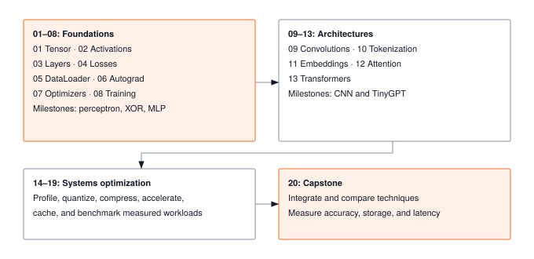
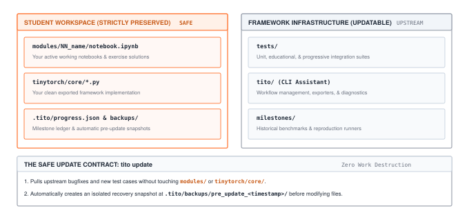
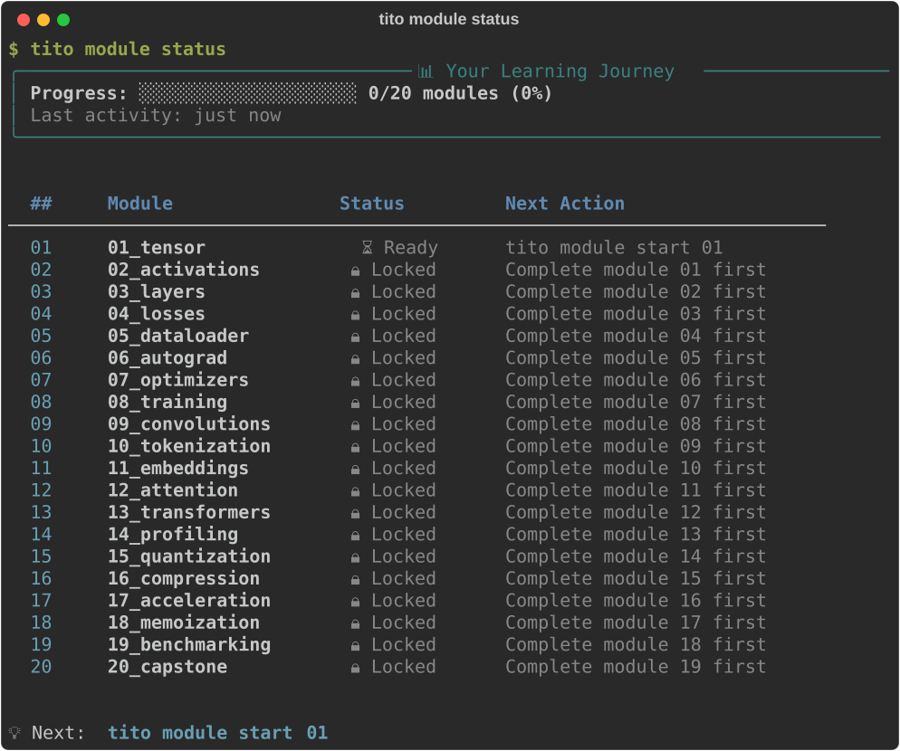

:::{.callout-note title="Prerequisites Check"}
This guide requires **Python programming** (classes, functions, NumPy basics) and **basic linear algebra** (matrix multiplication).
:::

## The Journey

TinyTorch follows a simple pattern: **build modules, unlock milestones, recreate ML history**.

::: {#fig-journey fig-env="figure" fig-pos="htb" fig-cap="**The 20-module learning path.** Foundation modules 01–08 build tensors and training. Architecture modules 09–13 add vision and language models. Optimization modules 14–19 measure and improve workloads. Capstone 20 compares techniques using accuracy, storage, and latency." fig-alt="Foundation modules 01–08 build tensors and training. Architecture modules 09–13 add vision and language models. Optimization modules 14–19 measure and improve workloads. Capstone 20 compares techniques using accuracy, storage, and latency."}



:::

As you complete modules, you unlock milestones that recreate landmark moments in ML history---using YOUR code.

## Step 1: Install and set up (a few minutes)

You need Python 3.10 or newer, git, and a terminal. New to terminals, virtual environments, or Jupyter? The [Glossary](glossary.qmd) starts with a short section on each. Run these from the folder where you keep projects:

:::{.panel-tabset}

## macOS / Linux

```bash
curl -sSL mlsysbook.ai/tinytorch/install.sh | bash
cd tinytorch
source .venv/bin/activate
tito setup
tito system health
```

## Windows

TinyTorch runs on Windows in **Git Bash**, which comes with [Git for Windows](https://git-scm.com/download/win). Install it with the default options, open **Git Bash** from the Start menu, and run:

```bash
curl -sSL mlsysbook.ai/tinytorch/install.sh | bash
cd tinytorch
source .venv/Scripts/activate
tito setup
tito system health
```

## Development Preview (`dev` branch)

To download and test the latest development preview currently on the `dev` branch:

```bash
curl -sSL mlsysbook.ai/tinytorch/install.sh | bash -s -- --dev
cd tinytorch
source .venv/bin/activate
tito setup
tito system health
```

:::

The installer checks for Python and git, downloads TinyTorch into a `tinytorch/` folder, creates a **virtual environment** in `tinytorch/.venv` (a private copy of Python and its packages, so TinyTorch cannot clash with anything else on your machine), and installs everything into it. `tito system health` should then show every item green:

::: {#fig-system-health fig-env="figure" fig-pos="htb" fig-cap="**All-green environment check.** `tito system health` validates your Python installation, virtual environment, core dependencies, Jupyter kernel registration, and package exports." fig-alt="Terminal output of tito system health showing green checkmarks for Python, Virtual Environment, NumPy, Rich, PyYAML, Pytest, Jupytext, nbdev, ipykernel, JupyterLab, and Matplotlib."}


:::

:::{.callout-important title="Every new terminal: activate first"}
The virtual environment is active only in the terminal where you activated it. Each time you open a new terminal, run `cd tinytorch` and `source .venv/bin/activate` (on Windows, `source .venv/Scripts/activate`) before any `tito` command. If you see `tito: command not found`, this is almost always why.
:::

:::{.callout-tip title="Updating an existing installation"}
If a new release is published or your instructor asks you to pull updates, **do not reinstall**. Inside your `tinytorch` directory with the virtual environment activated, run:

```bash
tito update          # or: tito system update
```

`tito` automatically snapshots your progress and notebooks before updating test suites, CLI tools, and starter templates. Your completed work in `modules/`, your exported code, and your progress history are **strictly preserved**.
:::

::: {#fig-workspace-architecture fig-env="figure" fig-pos="htb" fig-cap="**The TinyTorch workspace architecture and data preservation contract.** Student notebooks (`modules/`), exported packages (`tinytorch/core/`), and completion ledgers (`.tito/`) are sovereign and never touched by updates. Upstream test suites and CLI tools update safely with automated pre-update backups." fig-alt="Diagram showing separation between student workspace (protected notebooks, exported code, progress ledger) and framework infrastructure (tests, tito CLI, starter templates) with the safe update contract."}



:::

## Step 2: Your first module (about 4 to 6 hours)

Module 01 builds the tensor, the data structure everything else is made of.

```bash
tito module start 01
```

This creates your notebook, `modules/01_tensor/tensor.ipynb`, and opens it in **Jupyter Lab**, a notebook editor that runs in your browser. Keep the terminal open while you work; closing it stops Jupyter.

In the notebook, run the cells from top to bottom (Shift+Enter runs one cell). Most of the code is already written and explained. You write three functions, marked `# YOUR CODE HERE`, and each is followed by a test cell that tells you whether it works. The [Module 01 page](modules/01_tensor.qmd) lists them and explains the messages you may see.

:::{.callout-note title="Prefer VS Code or Cursor?"}
If you prefer working in VS Code or Cursor instead of a browser tab, open the `tinytorch` directory in your editor, open `modules/01_tensor/tensor.ipynb`, and select the `.venv` kernel (top right in VS Code: *Select Kernel → Python Environments → .venv*).
:::

You can run your tests directly inside the notebook, or from the terminal at any time:

```bash
tito module test 01       # runs your notebook's tests without exporting
```

When all tests in your notebook pass, finalize and export your implementation:

```bash
tito module complete 01
```

`complete` runs your notebook's tests again, copies your code into the `tinytorch` package (this is called **exporting**), runs a second set of tests against the package, and records the module as done. After that your code is importable:

```python
from tinytorch.core.tensor import Tensor  # your implementation
x = Tensor([1, 2, 3])
```

Coming back another day, reopen your notebook with `tito module resume 01`.

## Step 3: Your first milestone

After Module 03, you can run your first milestone. It recreates Rosenblatt's 1958 perceptron with your own tensor, layer, and activation, and it runs only the forward pass: nothing is trained yet, so the weights are random.

```bash
tito milestone run perceptron     # or: tito milestone run 01
```

{#fig-milestone-01-terminal fig-alt="Terminal output of tito milestone run perceptron: the prerequisite check passes for Modules 01 to 03, the forward pass with random weights gets every prediction wrong, and the diagnosis says the random line labels each side backwards."}

Getting it wrong is the point of this milestone. Modules 04 through 08 add the loss, gradients, and training loop that make a network learn, and Milestone 03 shows the difference.

## The Pattern Continues

Because modules are completed in order, each milestone unlocks when you finish one particular module:

| After module | Milestone | What you recreate |
|--------------|-----------|-------------------|
| 03 | Perceptron (1958) | The first neural network, forward pass only |
| 03 | XOR Crisis (1969) | The limit of a single layer |
| 08 | MLP Revival (1986) | Backpropagation solves XOR, then learns handwritten digits |
| 09 | CNN Revolution (1998) | A convolutional network on the same digits |
| 13 | Transformer Era (2017) | Attention on sequence reversal and copying |
| 19 | MLPerf Benchmarks (2018) | Measured optimization of your framework |

: **When each milestone unlocks.** {#tbl-getting-started-milestone-unlocks}

See all milestones and their requirements:

```bash
tito milestone list
```

::: {#fig-milestone-list fig-env="figure" fig-pos="htb" fig-cap="**The historical milestone catalog.** `tito milestone list` displays each milestone's year, historical breakthrough, required modules, and unlocked status." fig-alt="Terminal output of tito milestone list showing milestone cards for Perceptron 1958, XOR Crisis 1969, MLP Revival 1986, CNN Revolution 1998, Transformer Era 2017, and MLPerf 2018."}


:::

## Quick Reference

Here are the commands you'll use throughout your journey:

```bash
# Modules
tito module start <N>       # create the notebook and open it
tito module resume <N>      # reopen it later
tito module complete <N>    # test, export, and record module N
tito module status          # your progress across all modules

# Milestones
tito milestone list         # all milestones and what each needs
tito milestone run <name>   # run one with your code

# Environment
tito system health          # check the setup
tito system update          # update TinyTorch (your work is kept)
tito --help                 # every command
```

::: {#fig-module-status fig-env="figure" fig-pos="htb" fig-cap="**The learning journey dashboard.** `tito module status` tracks progress through all 20 modules, showing ready, locked, and completed states along with your next actionable command." fig-alt="Terminal output of tito module status showing progress bar and module table."}



:::

The [Student Workflow](tito/workflow.qmd) and [Command Reference](tito/commands.qmd) explain the complete workflow and each command in detail.

## Module Progression

TinyTorch has 20 modules in three tiers and a capstone. The hours are estimates; each module page gives its own.

| Tier | Modules | Focus | Estimated time |
|------|---------|-------|----------------|
| **Foundation** | 01-08 | Tensors, layers, losses, data loading, autograd, training | 33-49 hours |
| **Architecture** | 09-13 | Convolutions and the transformer stack | 26-36 hours |
| **Optimization** | 14-19 | Profiling, quantization, compression, acceleration, caching, benchmarking | 25-37 hours |
| **Capstone** | 20 | The Torch Olympics | 6-8 hours |

: **Tiers and estimated time.** {#tbl-getting-started-module-tiers}

In total, 90 to 130 hours. How long that takes depends on your pace:

| Hours a week | 3 | 5 | 10 |
|--------------|---|---|----|
| **Weeks for the whole course** | 30-43 | 18-26 | 9-13 |

: **Calendar time at different weekly paces.** {#tbl-getting-started-pace}

## Join the Community (Optional)

After setup, join the global TinyTorch community:

```bash
tito community login        # Join the community
```

The community features include progress tracking and connecting with other builders.

## Teaching with TinyTorch

Instructors and TAs: assignment tiers, nbgrader, and grading are on the [For Instructors](instructors.qmd) page.
