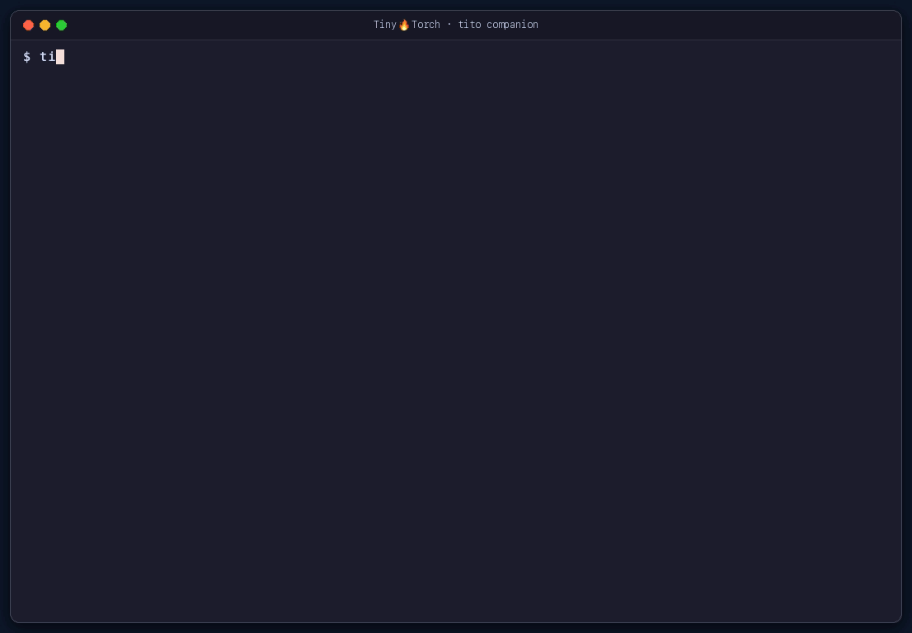
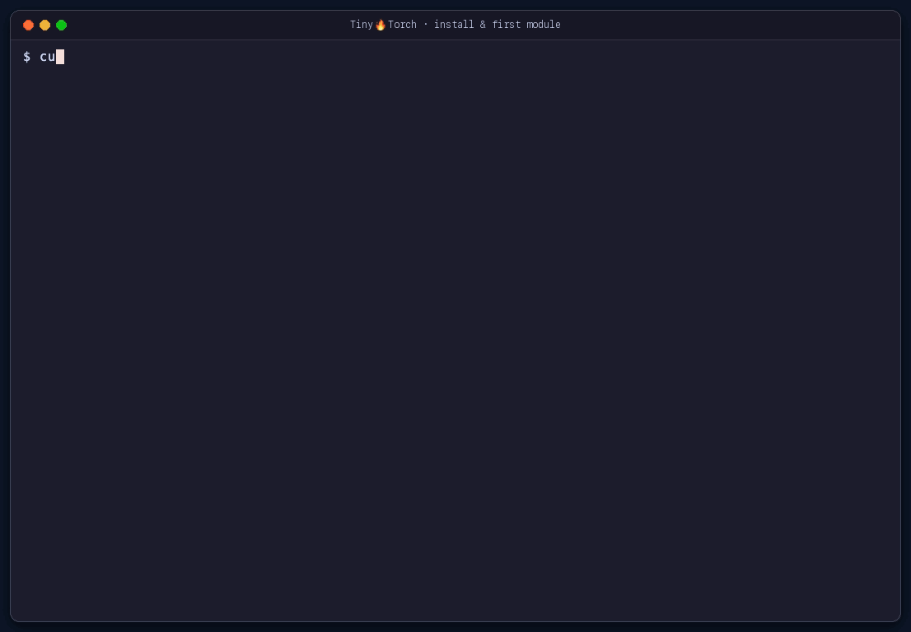
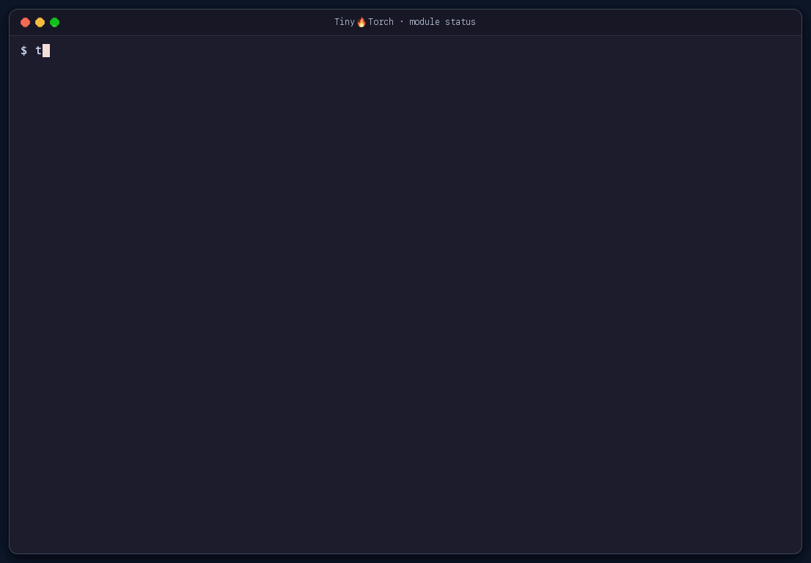
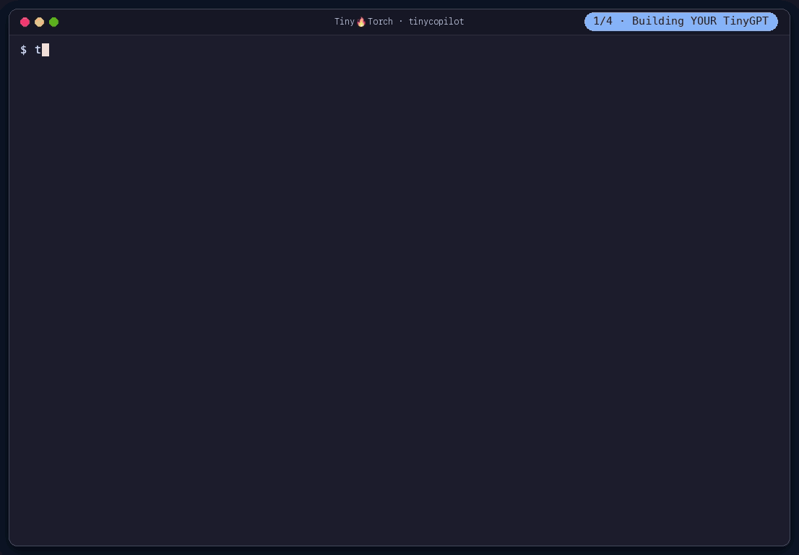
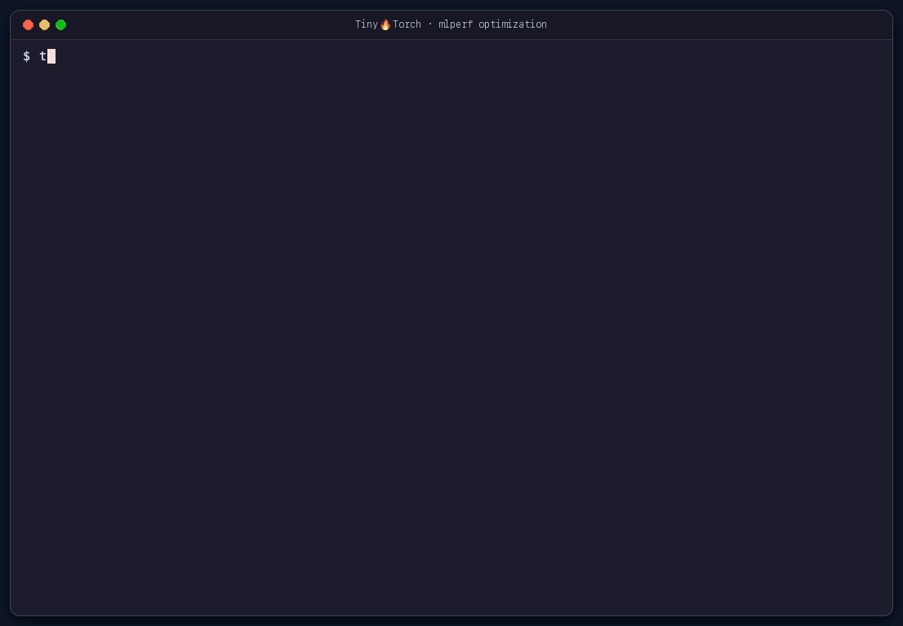
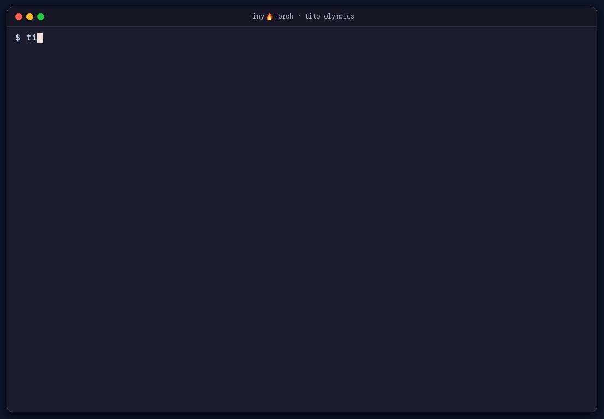

<!--
  Hero hierarchy:
    h1   = "Don't import it. Build it."   (visual hero, quotable, matches pagetitle)
    h2/p = "Build your own ML framework."  (subtitle: describes what h1 means)
-->
```{=html}
<h1 class="hero-gradient-text">Don't import it. Build it.</h1>

<p style="text-align: center; font-size: 1.25rem; margin: 0.25rem 0 0.5rem 0; font-weight: 500; color: #475569;">
Build your own ML framework: from tensors to systems.
</p>

<p style="text-align: center; margin: 0 0 1rem 0;">
<span class="preview-badge">Preview · Classroom release Spring 2027</span>
</p>

<p style="text-align: center; font-size: 1.1rem; margin: 0 auto 1.5rem auto; max-width: 750px;">
An educational framework for building and optimizing ML: understand how PyTorch, TensorFlow, and JAX really work.
</p>

<p style="text-align: center; font-size: 0.95rem; margin: -0.75rem auto 1.5rem auto; max-width: 760px; color: #64748b;">
TinyTorch is usable today for self-paced learning and active course pilots. APIs, instructor packaging, and classroom workflows will continue to stabilize through the Spring 2027 classroom release. Self-study works today; courses adopting TinyTorch before then should expect to pilot it.
</p>

<div style="text-align: center; margin: 0 0 1rem 0;">
<a href="getting-started.qmd" class="btn-tinytorch">Start Building →</a>
</div>
<div style="text-align: center; margin: 0 0 2.5rem 0;">
<a href="https://github.com/harvard-edge/cs249r_book?tab=readme-ov-file#support-this-work" target="_blank" class="star-link">
<span><i class="fa-regular fa-star"></i></span>

<span id="star-count-hero" style="font-weight: 600; white-space: nowrap; flex-shrink: 0;">{{stats.stars}}</span>
<span>stars on GitHub: <strong>add yours</strong> and support free ML education</span>
</a>
</div>

<div class="tt-terminal-showcase" id="terminal-showcase" role="region" aria-label="Interactive Terminal Showcase">
  <div class="tt-carousel-container">
    <div class="tt-carousel-track">
      <!-- Slide 1 -->
      <div class="tt-carousel-slide active" data-index="0">
        <div class="tt-terminal-window" onclick="openTerminalLightbox(0)" title="Click to enlarge terminal execution">
          <span class="tt-zoom-badge">🔍 Click to Zoom</span>
          <video autoplay loop muted playsinline poster="assets/images/demos/tinytorch-06-tito-companion.gif">
            <source src="assets/images/demos/tinytorch-06-tito-companion.mp4" type="video/mp4">
            
          </video>
        </div>
      </div>

      <!-- Slide 2 -->
      <div class="tt-carousel-slide" data-index="1">
        <div class="tt-terminal-window" onclick="openTerminalLightbox(1)" title="Click to enlarge terminal execution">
          <span class="tt-zoom-badge">🔍 Click to Zoom</span>
          <video autoplay loop muted playsinline poster="assets/images/demos/tinytorch-01-install-and-run.gif">
            <source src="assets/images/demos/tinytorch-01-install-and-run.mp4" type="video/mp4">
            
          </video>
        </div>
      </div>

      <!-- Slide 3 -->
      <div class="tt-carousel-slide" data-index="2">
        <div class="tt-terminal-window" onclick="openTerminalLightbox(2)" title="Click to enlarge terminal execution">
          <span class="tt-zoom-badge">🔍 Click to Zoom</span>
          <video autoplay loop muted playsinline poster="assets/images/demos/tinytorch-02-modules-mastery.gif">
            <source src="assets/images/demos/tinytorch-02-modules-mastery.mp4" type="video/mp4">
            
          </video>
        </div>
      </div>

      <!-- Slide 4 -->
      <div class="tt-carousel-slide" data-index="3">
        <div class="tt-terminal-window" onclick="openTerminalLightbox(3)" title="Click to enlarge terminal execution">
          <span class="tt-zoom-badge">🔍 Click to Zoom</span>
          <video autoplay loop muted playsinline poster="assets/images/demos/tinytorch-03-tinygpt-chat.gif">
            <source src="assets/images/demos/tinytorch-03-tinygpt-chat.mp4" type="video/mp4">
            
          </video>
        </div>
      </div>

      <!-- Slide 5 -->
      <div class="tt-carousel-slide" data-index="4">
        <div class="tt-terminal-window" onclick="openTerminalLightbox(4)" title="Click to enlarge terminal execution">
          <span class="tt-zoom-badge">🔍 Click to Zoom</span>
          <video autoplay loop muted playsinline poster="assets/images/demos/tinytorch-04-tinycopilot.gif">
            <source src="assets/images/demos/tinytorch-04-tinycopilot.mp4" type="video/mp4">
            
          </video>
        </div>
      </div>

      <!-- Slide 6 -->
      <div class="tt-carousel-slide" data-index="5">
        <div class="tt-terminal-window" onclick="openTerminalLightbox(5)" title="Click to enlarge terminal execution">
          <span class="tt-zoom-badge">🔍 Click to Zoom</span>
          <video autoplay loop muted playsinline poster="assets/images/demos/tinytorch-05-mlperf-opt.gif">
            <source src="assets/images/demos/tinytorch-05-mlperf-opt.mp4" type="video/mp4">
            
          </video>
        </div>
      </div>

      <!-- Slide 7 -->
      <div class="tt-carousel-slide" data-index="6">
        <div class="tt-terminal-window" onclick="openTerminalLightbox(6)" title="Click to enlarge terminal execution">
          <span class="tt-zoom-badge">🔍 Click to Zoom</span>
          <video autoplay loop muted playsinline poster="assets/images/demos/tinytorch-07-tito-olympics.gif">
            <source src="assets/images/demos/tinytorch-07-tito-olympics.mp4" type="video/mp4">
            
          </video>
        </div>
      </div>
    </div>

    <!-- Active slide caption description -->
    <div class="tt-carousel-caption" id="tt-carousel-caption">
      <strong>Tito CLI Companion &amp; Environment Diagnostics</strong>
    </div>

    <!-- Bottom Controls: Arrows flanking Dots -->
    <div class="tt-carousel-controls">
      <button class="tt-carousel-nav tt-prev" aria-label="Previous Slide">‹</button>
      <div class="tt-carousel-dots" id="tt-carousel-dots" role="tablist" aria-label="Terminal Slides">
        <button class="tt-dot-btn active" data-index="0" role="tab" aria-label="Slide 1: Tito CLI Companion and Diagnostics" aria-selected="true"></button>
        <button class="tt-dot-btn" data-index="1" role="tab" aria-label="Slide 2: Install and Run Milestone 01" aria-selected="false"></button>
        <button class="tt-dot-btn" data-index="2" role="tab" aria-label="Slide 3: 20/20 Module Mastery" aria-selected="false"></button>
        <button class="tt-dot-btn" data-index="3" role="tab" aria-label="Slide 4: TinyGPT Conversational Chat" aria-selected="false"></button>
        <button class="tt-dot-btn" data-index="4" role="tab" aria-label="Slide 5: TinyCopilot Code Generation" aria-selected="false"></button>
        <button class="tt-dot-btn" data-index="5" role="tab" aria-label="Slide 6: MLPerf Benchmarking" aria-selected="false"></button>
        <button class="tt-dot-btn" data-index="6" role="tab" aria-label="Slide 7: TinyTorch Olympics Competition Events" aria-selected="false"></button>
      </div>
      <button class="tt-carousel-nav tt-next" aria-label="Next Slide">›</button>
    </div>
  </div>

  <!-- Zoom Lightbox Modal -->
  <div class="tt-lightbox-modal" id="tt-lightbox-modal" onclick="closeTerminalLightbox(event)" role="dialog" aria-modal="true" aria-label="Enlarged Terminal View">
    <div class="tt-lightbox-content" onclick="event.stopPropagation()">
      <button class="tt-lightbox-close" onclick="closeTerminalLightbox(event)" aria-label="Close Lightbox">✕</button>
      <div class="tt-lightbox-header">
        <span class="tt-dot red"></span>
        <span class="tt-dot yellow"></span>
        <span class="tt-dot green"></span>
        <span class="tt-lightbox-title" id="tt-lightbox-title">Terminal Stream</span>
      </div>
      <div class="tt-lightbox-media">
        <video id="tt-lightbox-video" autoplay loop muted playsinline poster="assets/images/demos/tinytorch-06-tito-companion.gif">
          <source id="tt-lightbox-video-src" src="assets/images/demos/tinytorch-06-tito-companion.mp4" type="video/mp4">
          
        </video>
      </div>
      <div class="tt-lightbox-caption" id="tt-lightbox-caption">Tito CLI Companion &amp; Environment Diagnostics</div>
    </div>
  </div>
</div>

<div class="approach-box" style="margin-top: 3.5rem;">
<div class="approach-grid">
<div class="approach-item">
<span class="approach-icon"><i class="fa-solid fa-screwdriver-wrench"></i></span>
<span class="approach-text"><strong>Build each piece</strong>: Tensors, autograd, attention. No magic imports.</span>
</div>
<div class="approach-item">
<span class="approach-icon"><i class="fa-solid fa-book"></i></span>
<span class="approach-text"><strong>Recreate history</strong>: Perceptron → CNN → TinyGPT → MLPerf & ChatGPT Serving.</span>
</div>
<div class="approach-item">
<span class="approach-icon"><i class="fa-solid fa-bolt"></i></span>
<span class="approach-text"><strong>Understand systems</strong>: Memory, compute, optimization trade-offs.</span>
</div>
<div class="approach-item">
<span class="approach-icon"><i class="fa-solid fa-bullseye"></i></span>
<span class="approach-text"><strong>Debug anything</strong>: OOM, NaN, slow training, because you built it.</span>
</div>
</div>
</div>
```

## Recreate ML History

Walk through ML history by rebuilding its greatest breakthroughs with YOUR TinyTorch implementations. Click each milestone to see what you'll build and how it shaped modern AI.

```{=html}
<div class="ml-timeline-container">
<div class="ml-timeline-line"></div>
<div class="ml-timeline-item left perceptron">
<div class="ml-timeline-dot"></div>
<div class="ml-timeline-content">
<div class="ml-timeline-year">1958</div>
<div class="ml-timeline-title">The Perceptron</div>
<div class="ml-timeline-desc">The first neural network, run forward with your layers</div>
<div class="ml-timeline-tech">Input → Linear → Sigmoid → Output</div>
</div>
</div>
<div class="ml-timeline-item right xor">
<div class="ml-timeline-dot"></div>
<div class="ml-timeline-content">
<div class="ml-timeline-year">1969</div>
<div class="ml-timeline-title">XOR Crisis</div>
<div class="ml-timeline-desc">Minsky & Papert expose limits of single-layer networks</div>
<div class="ml-timeline-tech">Input → Linear → Sigmoid → FAIL!</div>
</div>
</div>
<div class="ml-timeline-item left mlp">
<div class="ml-timeline-dot"></div>
<div class="ml-timeline-content">
<div class="ml-timeline-year">1986</div>
<div class="ml-timeline-title">MLP Revival</div>
<div class="ml-timeline-desc">Backpropagation enables deep learning on TinyDigits</div>
<div class="ml-timeline-tech">Images → Flatten → Linear → ... → Classes</div>
</div>
</div>
<div class="ml-timeline-item right cnn">
<div class="ml-timeline-dot"></div>
<div class="ml-timeline-content">
<div class="ml-timeline-year">1998</div>
<div class="ml-timeline-title">CNN Revolution</div>
<div class="ml-timeline-desc">A LeNet-style convolutional network on handwritten digits</div>
<div class="ml-timeline-tech">Images → Conv → Pool → ... → Classes</div>
</div>
</div>
<div class="ml-timeline-item left transformer">
<div class="ml-timeline-dot"></div>
<div class="ml-timeline-content">
<div class="ml-timeline-year">2017</div>
<div class="ml-timeline-title">Transformer Era</div>
<div class="ml-timeline-desc">Train TinyGPT on Shakespeare, TinyCopilot code generation, and concept Q&A</div>
<div class="ml-timeline-tech">Tokens → Embeddings → Causal Attention + MLP → Sampling</div>
</div>
</div>
<div class="ml-timeline-item right olympics">
<div class="ml-timeline-dot"></div>
<div class="ml-timeline-content">
<div class="ml-timeline-year">2018</div>
<div class="ml-timeline-title">MLPerf to Generative Serving</div>
<div class="ml-timeline-desc">Production optimization &amp; KV-cache generation speedup on TinyGPT</div>
<div class="ml-timeline-tech">Profile → Quantize → Cache → Accelerate</div>
</div>
</div>
<div class="ml-timeline-item left kernels">
<div class="ml-timeline-dot frontier"></div>
<div class="ml-timeline-content">
<div class="ml-timeline-year">2024 <span class="ml-timeline-badge-live"><span class="pulse-dot"></span>PRESENT</span></div>
<div class="ml-timeline-title">Custom Kernels</div>
<div class="ml-timeline-desc">Verify your tiled, fused, and im2col kernels, then time them against C++ SIMD, Apple Metal MPS, and OpenAI Triton</div>
<div class="ml-timeline-tech">Tiling → im2col → Fusion → Native reference kernels</div>
</div>
</div>
</div>
```


## Why Build Instead of Use?

```{=html}
<p style="text-align: center; font-size: 1.3rem; font-style: italic; color: #475569; margin: 0 0 1.5rem 0; max-width: 600px; margin-left: auto; margin-right: auto;">
"Building systems creates irreversible understanding."
</p>
```

:::: {.comparison-grid}

::: {.comparison-bad}
[Traditional ML Education]{.comparison-title}

```python
import torch
model = torch.nn.Linear(784, 10)
output = model(input)
# When this breaks, you're stuck
```

**Problem**: You can't debug what you don't understand.
:::

::: {.comparison-good}
[TinyTorch: Build → Use → Reflect]{.comparison-title}

```python
# BUILD it yourself
class Linear:
    def forward(self, x):
        return x @ self.weight + self.bias

# USE it on real data
loss.backward()  # YOUR autograd
```

**Advantage**: You can debug it because you built it.
:::

::::

## Learning Path

Five progressive stages take you from foundations to production systems, capstone benchmarking, and custom hardware kernels:

:::: {.tier-grid}

::: {.tier-card .tier-foundation}
[**Foundation (01-08)**<br>Tensors, autograd, layers, training loops](tiers/foundation.qmd)
:::

::: {.tier-card .tier-architecture}
[**Architecture (09-13)**<br>CNNs, attention, transformers, GPT](tiers/architecture.qmd)
:::

::: {.tier-card .tier-optimization}
[**Optimization (14-19)**<br>Profiling, quantization, acceleration](tiers/optimization.qmd)
:::

::: {.tier-card .tier-olympics}
[**Torch Olympics (20)**<br>Benchmark and compare your optimized models](modules/20_capstone.qmd)
:::

::: {.tier-card .tier-extensions}
[**Extensions & Kernels (M07)**<br>C++ SIMD, Apple Metal MPS, and Triton GPU shaders](extensions.qmd)
:::

::::

[**About the Course**](preface.qmd) | [**Getting Started**](getting-started.qmd)

## Is This For You?

:::: {.audience-grid}

::: {.audience-card}
[**Students**]{.audience-title}

[Taking ML courses, want to understand what's behind `import torch`]{.audience-desc}
:::

::: {.audience-card}
[**Instructors**]{.audience-title}

[Teaching ML systems with ready-made hands-on labs]{.audience-desc}
:::

::: {.audience-card}
[**Self-learners**]{.audience-title}

[Career changers or hobbyists going deeper than tutorials]{.audience-desc}
:::

::::

**Prerequisites**: Python + basic linear algebra. No ML experience required.


## Join the Community

```{=html}
<div class="community-section">
<p style="color: #f1f5f9; font-size: 1.25rem; margin: 0 0 0.5rem 0; font-weight: 600;">
See learners building ML systems worldwide
</p>
<p style="color: #94a3b8; margin: 0 0 0.75rem 0;">
Add yourself to the map · Share your progress · Connect with builders
</p>
<p style="color: #fbbf24; margin: 0 0 1.5rem 0; font-size: 0.9rem;">
Part of the <a href="https://github.com/harvard-edge/cs249r_book?tab=readme-ov-file#support-this-work" target="_blank" style="color: #fbbf24; text-decoration: underline;">MLSysBook</a> project. Every star helps support free ML education
</p>
<div style="display: flex; gap: 1rem; justify-content: center; flex-wrap: wrap; align-items: center;">
<a href="community.qmd" class="btn-tinytorch">Join the Community</a>
<a href="https://github.com/harvard-edge/cs249r_book" target="_blank" style="display: inline-flex; align-items: center; gap: 0.5rem; background: rgba(255,255,255,0.15); border: 1px solid rgba(255,255,255,0.3); color: #ffffff; padding: 0.75rem 1.5rem; border-radius: 0.5rem; text-decoration: none; font-weight: 600; font-size: 1rem;"><i class="fa-regular fa-star"></i> Star on GitHub <span id="star-count" style="background: rgba(249,115,22,0.3); padding: 0.2rem 0.6rem; border-radius: 1rem; font-size: 0.85rem; color: #fbbf24;">{{stats.stars}}</span></a>
<a href="https://github.com/harvard-edge/cs249r_book/discussions/1076" target="_blank" style="display: inline-block; background: rgba(255,255,255,0.15); border: 1px solid rgba(255,255,255,0.3); color: #ffffff; padding: 0.75rem 2rem; border-radius: 0.5rem; text-decoration: none; font-weight: 600; font-size: 1rem;"><i class="fa-regular fa-comments"></i> Discuss on GitHub</a>
<a href="#" onclick="event.preventDefault(); if(window.openSubscribeModal) openSubscribeModal();" style="display: inline-block; background: rgba(255,255,255,0.15); border: 1px solid rgba(255,255,255,0.3); color: #ffffff; padding: 0.75rem 2rem; border-radius: 0.5rem; text-decoration: none; font-weight: 600; font-size: 1rem;"><i class="fa-regular fa-envelope"></i> Get Updates</a>
</div>
</div>
```

**Next Steps**: [**Quick Start**](getting-started.qmd) (5 min setup) | [**About the Course**](preface.qmd) | [**Community**](community.qmd)
