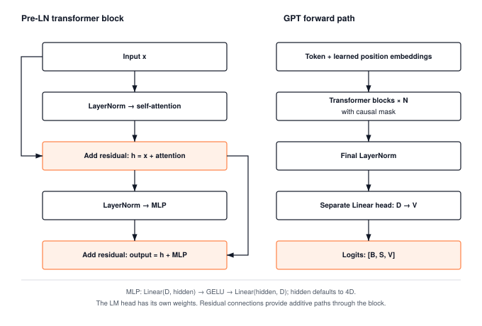

:::{.callout-note title="Milestone Info"}

**Architecture Tier Capstone** | Difficulty: ●●●● | Time: 20–30 min | Prerequisites: Modules 01–08, 10–13
:::

:::{.callout-tip title="What You'll Learn"}

- How autoregressive next-token prediction produces emergent language capabilities
- The mathematical and systems foundation behind ChatGPT (2020–2022)
- How causal self-attention masks turn sequence training into parallel teacher forcing
- Why interactive generation demands systems optimizations like the KV-cache (Module 18)
:::

## Overview

**In 2017, the Transformer replaced recurrence with attention. By 2020–2022, scaling autoregressive transformers produced the generative AI revolution.**

In 2017, Vaswani et al. published *"Attention Is All You Need"*, proving that self-attention alone—with no recurrence and no convolution—could capture long-range sequence dependencies in parallel. In 2020, Brown et al. (OpenAI) published *"Language Models are Few-Shot Learners"* (GPT-3), demonstrating that optimizing a simple objective—**predicting the next token**—on vast text corpora produced emergent reasoning, in-context learning, and conversational abilities without task-specific fine-tuning.

In late 2022, OpenAI launched **ChatGPT**, demonstrating to the entire world that this generative transformer foundation could interact seamlessly with human thought.

Behind ChatGPT sit two foundational pillars:
1. **The Generative Architecture (2017–2020):** A causal, decoder-only transformer trained on next-token cross-entropy loss with teacher forcing.
2. **The Systems Serving Stack (2022):** KV-caching (Module 18), INT8 quantization (Module 15), and hardware acceleration (Module 17) that turn an otherwise memory-bandwidth-choked model into a real-time, interactive service.

In this milestone, you assemble and train **TinyGPT** from scratch on Shakespeare, using exclusively the neural network and autograd primitives you authored across TinyTorch!

## What You'll Build

Milestone 05 runs in two parts:

1. **Part 1 (`01_tinygpt_shakespeare.py` - Default):**
   - **Decoder-Only Architecture (`TinyGPT`)**:
     - Token & Learned Positional Embeddings (Module 11)
     - Causal Multi-Head Self-Attention with lower-triangular masking (Module 12)
     - Feed-Forward MLP with 4× expansion and GELU activation (Modules 02 & 03)
     - Deep Pre-LayerNorm Residual Highway (Module 13)
     - Un-embedding Language Model Projection Head (Module 03)
   - **Autoregressive Generation Pipeline**:
     - Temperature-scaled sampling and top-$k$ token filtering.
2. **Part 2 (`02_vaswani_attention.py` - Attention Proof):**
   - Three synthetic sequence challenges (reversal, copying, prefix-controlled routing) that verify cross-position attention routing in isolation.



## Prerequisites

@tbl-milestone-05-prerequisites lists the modules you need to have completed before starting.

| Module | Component | What It Provides |
|--------|-----------|------------------|
| 01–03 | Tensors & Layers | Tensor, GELU activation, Linear projection |
| 04 | Losses | Multi-dimensional sequence CrossEntropyLoss |
| 05 | DataLoader | TensorDataset and mini-batch DataLoader |
| 06–07 | Autograd & Optimizers | Reverse-mode tape autograd, AdamW optimizer |
| 08 | Training | Trainer loop abstraction |
| 10 | Tokenization | CharTokenizer for character-level vocabulary |
| 11 | Embeddings | Token + Learned Positional Embeddings |
| 12 | Attention | Multi-Head Self-Attention |
| 13 | Transformers | Pre-LN TransformerBlock & generation utilities |

: **Prerequisite modules for the Transformer milestone.** {#tbl-milestone-05-prerequisites}

## Running the Milestone

Before running, ensure you have completed Modules 01–08 and 10–13. Check your progress:

```bash
tito module status
```

Run Part 1 (TinyGPT on Shakespeare) by default:

```bash
tito milestone run 05
# Or using convenience aliases:
tito milestone run transformer
tito milestone run tinygpt
```

**Run Part 2 (Attention Sequence Routing):**

```bash
tito milestone run 05 --part 2
```

**Direct script options:**

```bash
# Rapid test on bundled offline Shakespeare sample:
python3 milestones/05_2017_transformer/01_tinygpt_shakespeare.py --quick

# Custom prompt and temperature:
python3 milestones/05_2017_transformer/01_tinygpt_shakespeare.py --prompt "HAMLET:" --temperature 0.6
```

## Expected Results

@tbl-milestone-05-expected-results records the loss convergence and generation metrics.

| Part | Script | Task | Success Criteria | Time |
|------|--------|------|------------------|------|
| 1 (Default) | `01_tinygpt_shakespeare.py` | Shakespeare Next-Token Prediction | Loss drops from ~3.0 to < 1.0 (PPL < 3.0); generates coherent verse | ~15–20s (12 epochs on CPU) |
| 2 (Optional) | `02_vaswani_attention.py` | Sequence Routing | Passes reversal (>95%), copying (>95%), mixed (>90%) | A few seconds (2–4 epochs) |

: **Expected success criteria and runtime for Milestone 05.** {#tbl-milestone-05-expected-results}

## The Aha Moment: Next-Token Prediction Creates Language

When you train an image classifier, one image maps to one label. If you do that with a language model, a 32-token window produces only a single training signal.

With **teacher forcing** and a **causal mask**, every single position in the window predicts the token that follows it. In one single forward pass, 32 positions are trained simultaneously in parallel:

$$\mathcal{L} = -\frac{1}{S} \sum_{t=1}^{S} \log P(x_{t+1} \mid x_1, \dots, x_t)$$

During autoregressive inference, the model reuses the exact same weights token-by-token:
1. Model forward pass on prompt tokens $\to$ logits $[1, S, V]$
2. Extract the last logit row $\mathbf{z}_{S} \in \mathbb{R}^V$
3. Scale by temperature $T$ and filter out low-probability tails with top-$k$
4. Sample next token ID and append to the prompt
5. Repeat for $N$ tokens

## Your Code Powers This

@tbl-milestone-05-code-powers names the TinyTorch components that power this milestone.

| Component | Your Module | What It Does |
|-----------|-------------|--------------|
| `Tensor` | Module 01 | Strided multi-dimensional data buffer and tape autograd |
| `GELU` | Module 02 | Smooth Gaussian Error non-linearity for transformer MLPs |
| `Linear` | Module 03 | Attention projections ($W_Q, W_K, W_V, W_O$), MLP layers, and LM head |
| `CrossEntropyLoss` | Module 04 | Stable multi-dimensional sequence loss with shift-by-max |
| `DataLoader` | Module 05 | Mini-batch slicing with sequence stride |
| `Autograd` | Module 06 | Exact reverse-mode backpropagation across deep layers |
| `AdamW` | Module 07 | Decoupled weight decay optimizer for transformer stability |
| `Trainer` | Module 08 | Standardized training epoch execution |
| `CharTokenizer` | Module 10 | Character-level tokenization mapping text to vocabulary IDs |
| `EmbeddingLayer` | Module 11 | Token and learned positional embeddings |
| `MultiHeadAttention` | Module 12 | Causal self-attention preventing future information leakage |
| `TransformerBlock` | Module 13 | Pre-LayerNorm residual block combining attention and MLP |
| `generate` | Module 13 | Autoregressive sampling loop with temperature and top-$k$ |

: **TinyTorch components that power the Transformer milestone.** {#tbl-milestone-05-code-powers}

**No PyTorch. No HuggingFace. Just YOUR code.**

## Systems Bridge: The Prefix Bottleneck

When generating 50 tokens from a 10-token prompt:
- Step 1 processes 10 tokens
- Step 2 processes 11 tokens
- Step 50 processes 59 tokens

Across all 50 generation steps, the model evaluates over 1,700 position rows to produce just 50 tokens! Every step redundantly recomputes the Key and Value matrices for tokens that never change.

This $O(S^2)$ prefix recomputation bottleneck is the exact motivation for the **Key-Value Cache (KV-cache)** built in Module 18 and benchmarked in Milestone 06 (MLPerf).

## Read Why

The companion book's chapter *Milestone II: Convolution, Attention, and Generated Text* covers Milestones 04 and 05, comparing convolutional spatial inductive biases with transformer sequence modeling and detailing the autoregressive sampling mathematics. Read it in [*TinyTorch: From Tensors to Transformers*](https://mlsysbook.ai/tinytorch/assets/downloads/TinyTorch-Book.pdf) (PDF).

## What's Next

You've built and trained TinyGPT from scratch. In the **Optimization Tier (Modules 14–19)**, you'll profile its performance bottlenecks (Module 14), quantize weights to INT8 (Module 15), compile operations (Module 17), and implement the KV-cache (Module 18) to accelerate generation before proving it in **Milestone 06: MLPerf Benchmarks**!
