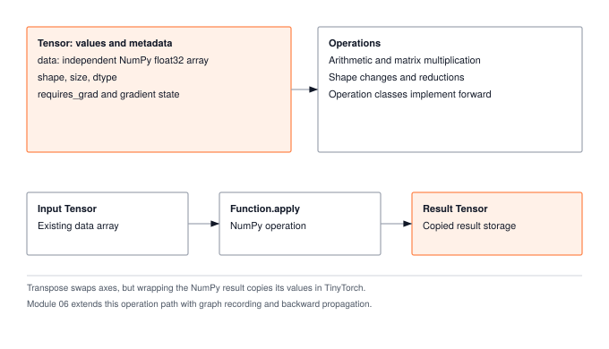

A tensor is an array of numbers with a shape, and every other part of TinyTorch is built on it. In this module you write the `Tensor` class: how it stores its numbers, and how two tensors are added and multiplied. Why its memory layout matters for speed comes later, in the book and in the Optimization tier.

:::{.callout-note title="Module Info"}

**FOUNDATION TIER** | Difficulty: ●○○○ | Time: 4-6 hours | Prerequisites: None

**Prerequisites: None** means exactly that. This module assumes:

- Basic Python (lists, classes, methods)
- Basic math (matrix multiplication from linear algebra)
- No machine learning background required

If you can multiply two matrices by hand and write a Python class, you're ready.
:::



## Overview

Every neural network you have ever used — image classifiers, language models, self-driving perception stacks — is, at runtime, a sequence of operations on one data structure: the tensor. Get the tensor right and the rest of the framework practically writes itself. Get it wrong and every layer above leaks confusion.

In this module you build that data structure from scratch. By the end, your `Tensor` supports arithmetic, broadcasting, matrix multiplication, and shape manipulation — the same surface area you would call on `torch.Tensor`, backed by NumPy instead of CUDA.

## Commands



## Learning objectives

:::{.callout-tip title="By completing this module, you will:"}

- **Implement** the Tensor constructor and the add and matmul operations, then trace how the shape-manipulation and reduction operations build on them
- **Master** broadcasting semantics that enable efficient computation without data copying
- **Understand** computational complexity (O(n³) for matmul) and memory trade-offs (views vs copies)
- **Connect** your implementation to production PyTorch patterns and design decisions
:::

## What you'll build

A `Tensor` carries its values, its shape, and the gradient state later modules fill in. Every operation runs through the same dispatch path (@fig-01_tensor-diag-1).

::: {#fig-01_tensor-diag-1 fig-env="figure" fig-pos="htb" fig-cap="**Tensor values, metadata, and operations.** A Tensor holds an independent NumPy float32 array, shape metadata, and gradient state. Operations dispatch through Function.apply and wrap results in copied storage; Module 06 adds graph recording and backward propagation. Transpose swaps axes, but wrapping the NumPy result copies its values." fig-alt="A Tensor holds an independent NumPy float32 array, shape metadata, and gradient state. Operations dispatch through Function.apply and wrap results in copied storage; Module 06 adds graph recording and backward propagation."}

:::

## What you write



## How you know it works



## When it fails



`AttributeError: 'Tensor' object has no attribute 'shape'`
:   From every unit test. `__init__` stored the array but not its metadata. Set `self.shape`, `self.size`, and `self.dtype` from `self.data` in the constructor; every later operation reads them.

`assert scalar.dtype == np.float32`
:   From `test_unit_tensor_creation`. `__init__` kept NumPy's default dtype, so integer input stays integer. Convert with `np.array(data, dtype=np.float32)`.

`assert np.array_equal(result.data, expected)`
:   From `test_unit_matrix_multiplication`. `MatMul.forward` is not computing row-times-column. Entry `(i, j)` is the dot product of row `i` of `a` with column `j` of `b`, that is `a[i, :]` and `b[:, j]`; an elementwise `a * b` or `b[j, :]` fails here.

## Finished? Read why



## What's next

You now have the universal carrier of every value the rest of the framework will ever compute. A `Tensor` holds the data, knows its shape, and supports the arithmetic that linear algebra and eventually backpropagation depend on.

The next module is [**Module 02: Activations**](02_activations.qmd). It answers a single question: *given a tensor of pre-activations, how do you apply a non-linearity element-wise — and why is that the one operation that lets a deep network represent anything beyond a glorified linear regression?* You will implement ReLU, Sigmoid, Tanh, and Softmax on top of the `Tensor` you just built, treating each one as a pure function from tensor to tensor. Everything works because `__add__`, `__mul__`, broadcasting, and shape preservation are already in place. That is the dividend of getting Module 01 right.

**Next:** [Module 02: Activations](02_activations.qmd)
