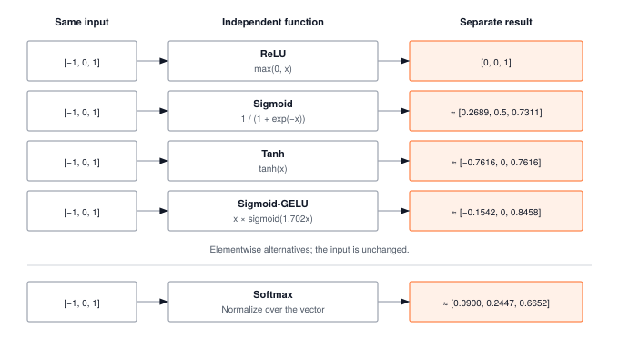

Activations are the first operator in your framework with zero arithmetic intensity: every element is touched once and reused zero times. That makes them pure memory-bandwidth workloads. Stacking them also breaks the linear collapse that would otherwise flatten a hundred layers into one matrix multiply, so both the math and the memory-wall lesson start here.

:::{.callout-note title="Module Info"}

**FOUNDATION TIER** | Difficulty: ●○○○ | Time: 3-5 hours | Prerequisites: 01 (Tensor)

**Prerequisites: Module 01 (Tensor)** means you need:

- Completed Tensor implementation with element-wise operations
- Understanding of tensor shapes and broadcasting
- Familiarity with NumPy mathematical functions

If you can create a Tensor and perform element-wise arithmetic (`x + y`, `x * 2`), you're ready.
:::



## Overview

A neural network without activation functions isn't a neural network — it's a single matrix multiplication wearing a costume. Stack a hundred linear layers, and the composition collapses to one: $W_2(W_1 x) = (W_2 W_1)x$. Depth buys you nothing until you break the linearity.

Activations are how you break it. ReLU zeros out negatives. Sigmoid squashes any real number into $(0, 1)$. Softmax turns raw scores into a probability distribution. Each is just a few lines of math, but together they're what lets a network learn to distinguish a cat from a dog instead of computing one giant linear regression.

You'll build five of them: ReLU, Sigmoid, Tanh, GELU, and Softmax. Along the way you'll meet the chapter's load-bearing insight — *why every production softmax subtracts the max before exponentiating* — and the dead-neuron problem that explains why ReLU's apparent simplicity hides a real failure mode.

## Start and finish



## Learning Objectives

:::{.callout-tip title="By completing this module, you will:"}

- **Implement** five core activation functions (ReLU, Sigmoid, Tanh, GELU, Softmax) with the numerical-stability tricks production frameworks use
- **Explain** why nonlinearity turns a stack of matrix multiplies into a function approximator
- **Quantify** the compute cost of each activation and decide when the extra accuracy of GELU is worth the extra exponentials
- **Map** your implementations onto the corresponding `torch.nn.functional` calls so PyTorch stops feeling like a black box
:::

## What You'll Build

::: {#fig-02_activations-diag-1 fig-env="figure" fig-pos="htb" fig-cap="**Independent activation results for the same input.** Elementwise functions preserve shape, while Softmax normalizes across the vector; GELU uses TinyTorch's sigmoid approximation." fig-alt="Five separate rows apply ReLU, sigmoid, tanh, sigmoid-approximated GELU, and Softmax to [-1, 0, 1], each with its own three-element result."}



:::

**The pattern you'll enable:**

```python
# Transforming tensors through nonlinear functions
relu = ReLU()
activated = relu(x)  # Zeros negatives, keeps positives

softmax = Softmax()
probabilities = softmax(logits)  # Converts to probability distribution (sums to 1)
```

### What You're NOT Building (Yet)

To keep this module focused, you will **not** implement:

- Gradient computation (`backward()` methods are attached in Module 06 via autograd)
- Learnable parameters (activations are fixed mathematical transformations with `parameters() -> []`)
- Advanced variants (LeakyReLU, ELU, Swish — PyTorch ships dozens; you'll build the core five that cover ~95% of real architectures)
- GPU acceleration (your NumPy implementation runs on CPU)

The forward pass is enough to build intuition. Gradients show up in Module 06.

## What you write



## How you know it works



## When it fails



`sigmoid overflowed on extreme inputs (overflow encountered in exp)`
:   From `test_unit_sigmoid`. The direct formula `1 / (1 + np.exp(-x))` overflows for large negative `x`. Compute `z = np.exp(-np.abs(x))`, whose exponent is never positive, and choose `1 / (1 + z)` or `z / (1 + z)` by the sign of `x`.

`Softmax should handle large numbers`
:   From `test_unit_softmax`. Exponentiating the raw scores overflows. Subtract each row's maximum before `np.exp`; the result is unchanged and every exponent is at most zero.

`Each row should sum to 1`
:   From `test_unit_softmax`. The normalizing sum ran over the whole array. Sum along `self.dim` with `keepdims=True`, so each row is divided by its own total.

## Finished? Read why



## What's Next

You now have nonlinearity. You still don't have anything *to* be nonlinear about. ReLU on a raw input vector accomplishes nothing — the network needs a learnable transformation between activations, something with weights and biases that gradient descent can shape.

That's the next module.

:::{.callout-note title="Coming Up: Module 03 — Layers"}

**The question Module 03 answers:** what is `Linear(x)`, exactly, and how does it compose with the activations you just built into the canonical `Linear → activation → Linear → activation → ...` stack that defines an MLP?

You'll implement the `Linear` layer — weight matrix, bias vector, forward pass — and then chain it with your `ReLU` and `Softmax` to build the first thing in this course that deserves to be called a neural network.
:::

**Preview — how your activations get used in future modules:**

@tbl-02-activations-downstream-usage traces how this module is reused by later parts of the curriculum.

| Module | What It Does | Your Activations In Action |
|--------|--------------|---------------------------|
| **03: Layers** | Neural network building blocks | `Linear(x)` followed by `ReLU()(output)` |
| **04: Losses** | Training objectives | Softmax probabilities feed into cross-entropy loss |
| **06: Autograd** | Automatic gradients | `relu.backward(grad)` computes activation gradients |

: **How activations feed into subsequent TinyTorch modules.** {#tbl-02-activations-downstream-usage}
