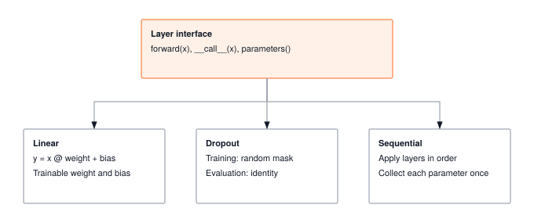

A layer is a function with weights. Three stacked is an MLP; ninety-six is GPT-3. The interface discipline, every layer exposing the same `forward()` and `parameters()`, is what lets the optimizer find your weights, autograd walk your graph, and a future compiler fuse your kernels.

:::{.callout-note title="Module Info"}

**FOUNDATION TIER** | Difficulty: ●●○○ | Time: 5-7 hours | Prerequisites: 01, 02

**Prerequisites: Modules 01 and 02** means you have built:

- Tensor class with arithmetic, broadcasting, matrix multiplication, and shape manipulation
- Activation functions (ReLU, Sigmoid, Tanh, Softmax) for introducing non-linearity
- Understanding of element-wise operations and reductions

If you can multiply tensors, apply activations, and reason about shape transformations, you're ready.
:::



## Overview

A layer is a function with weights. Stack three of them and you have a multi-layer perceptron; stack ninety-six and you have GPT-3. The discipline that makes such composition possible — every layer exposing the same `forward()` and `parameters()` interface — is what you build in this module.

You'll implement four pieces: a `Layer` base class that fixes the interface, a `Linear` layer that applies the learned transformation `y = xW + b`, a `Dropout` layer that prevents overfitting by randomly zeroing activations, and a `Sequential` container that chains layers into networks. Together they're the smallest set of abstractions that lets you write `model = Sequential(Linear(784, 256), ReLU(), Linear(256, 10))` and have it just work.

The payoff is `parameters()`. Once every layer hands its weights to a single list, optimizers (Module 07) and autograd (Module 06) can update them without caring what's inside. PyTorch's `nn.Module` follows the exact same contract — you're building the real abstraction, not a toy version of it.

## Commands



## Learning objectives

:::{.callout-tip title="By completing this module, you will:"}

- **Implement** the Linear and Dropout forward passes, and read how the supplied constructors handle weight initialization and parameter management for gradient-based training
- **Master** the mathematical operation `y = xW + b` and understand how parameter counts scale with layer dimensions
- **Understand** memory usage patterns (parameter memory vs activation memory) and computational complexity of matrix operations
- **Connect** your implementation to production PyTorch patterns, including `nn.Linear`, `nn.Dropout`, and parameter tracking
:::

## What you'll build

::: {#fig-03_layers-diag-1 fig-env="figure" fig-pos="htb" fig-cap="**A shared layer interface.** Linear and Dropout inherit `forward()` and `parameters()` from `Layer`, while Sequential provides the same interface to chain them into networks." fig-alt="Diagram showing the Layer base class interface shared across Linear, Dropout, and Sequential."}



:::

**The pattern you'll enable:**
```python
# Building a multi-layer network
layer1 = Linear(784, 256)
activation = ReLU()
dropout = Dropout(0.5)
layer2 = Linear(256, 10)

# Manual composition for explicit data flow
x = layer1(x)
x = activation(x)
x = dropout(x, training=True)
output = layer2(x)
```

### What you're not building yet

To keep this module focused, you will **not** implement:

- Automatic gradient computation (autograd is a later module)
- Parameter optimization (optimizers are a later module)
- Hundreds of layer types (PyTorch has Conv2d, LSTM, Attention - you'll build Linear and Dropout)
- Automatic training/eval mode switching (PyTorch's `model.train()` - you'll manually pass `training` flag)

**You are building the core building blocks.** Training loops and optimizers come later.

## What you write



## How you know it works



## When it fails



`ValueError: Matrix multiplication shape mismatch: (32, 784) @ (256, 784)`
:   From `test_unit_linear_layer`. `Linear.forward` transposed the weight. TinyTorch stores it as `(in_features, out_features)`, so the forward pass is `x.matmul(self.weight)` with no transpose.

`Inference should pass through unchanged`
:   From `test_unit_dropout_layer`. Dropout ran with `training=False`. Return the input unchanged when `self._should_apply_dropout(training)` is false.

`ValueError: setting an array element with a sequence.`
:   From `test_unit_dropout_layer`. The mask was applied to `x.data` and wrapped in a new `Tensor`. Multiply the tensor itself, `x * mask`, so the operation stays on the path Module 06 will differentiate.

## Finished? Read why



## What's next

:::{.callout-note title="Up next: Module 04, Losses"}

Your layers can produce predictions, but you have no way to say *how wrong* a prediction is. Module 04 introduces loss functions — `MSELoss` for regression, `CrossEntropyLoss` for classification — that turn a prediction and a target into a single scalar. That scalar becomes the signal autograd (Module 06) backpropagates, which optimizers (Module 07) then apply to the very `parameters()` you collected here.
:::

**Next:** [Module 04: Losses](04_losses.qmd)

### How later modules use this one

| Module | What It Does | Your Layers In Action |
|--------|--------------|----------------------|
| **04: Losses** | Quantify prediction error | `loss = CrossEntropyLoss()(model(x), y)` |
| **06: Autograd** | Backpropagate through the stack | `loss.backward()` fills `layer.weight.grad` |
| **07: Optimizers** | Update parameters from gradients | `optimizer.step()` consumes `model.parameters()` |

: **How the Layer abstractions feed into later training modules.** {#tbl-03-layers-downstream-usage}
