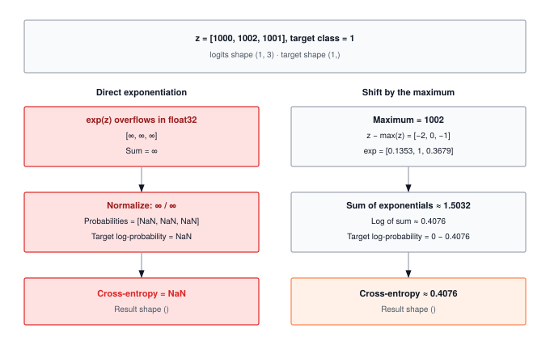

A loss function reduces a full output tensor to a single scalar. That reduction is the only signal the optimizer ever sees. Build the reduction wrong, or apply it to the wrong axis, and every gradient flowing backward through autograd optimizes the wrong objective.

:::{.callout-note title="Module Info"}

**FOUNDATION TIER** | Difficulty: ●●○○ | Time: 4-6 hours | Prerequisites: 01, 02, 03

**Prerequisites:** Modules 01 (Tensor), 02 (Activations), and 03 (Layers) must be completed. This module assumes you understand:

- Tensor operations and broadcasting (Module 01)
- Activation functions and their role in neural networks (Module 02)
- Layers and how they transform data (Module 03)

If you can build a simple neural network that takes input and produces output, you're ready to learn how to measure its quality.
:::



## Overview

A neural network without a loss function is a guess machine. The loss is the single scalar that tells optimization which direction to move — turning a forward pass into a learning step. Get it wrong and training stalls, diverges, or silently optimizes the wrong objective.

In this module you'll implement three losses that cover most supervised learning: **Mean Squared Error** for regression, **CrossEntropy** for multi-class classification, and **Binary Cross-Entropy** for multi-label or binary decisions. Along the way you'll implement the log-sum-exp trick — the one numerical safeguard that separates a softmax that trains from one that returns `nan` on the first batch with large logits.

By the end, you'll know not just *how* to compute each loss, but *why* the choice of loss reshapes what your model learns, and where naive implementations break at production scale.

## Commands



## Learning objectives

:::{.callout-tip title="By completing this module, you will:"}

- **Implement** MSELoss for regression, CrossEntropyLoss for multi-class classification, and BinaryCrossEntropyLoss for binary decisions
- **Master** the log-sum-exp trick for numerically stable softmax computation
- **Understand** computational complexity (O(B×C) for cross-entropy with large vocabularies) and memory trade-offs
- **Analyze** loss function behavior across different prediction patterns and confidence levels
- **Connect** your implementation to production PyTorch patterns and engineering decisions at scale
:::

## What you'll build

::: {#fig-04_losses-diag-1 fig-env="figure" fig-pos="htb" fig-cap="**Stable cross-entropy on large logits.** For logits [1000, 1002, 1001] and target class 1, direct float32 exponentiation overflows. Shifting by the maximum gives [-2, 0, -1], and log-sum-exp yields a finite scalar loss of approximately 0.4076. Cross-entropy negates the target log-probability; decimals are rounded." fig-alt="Two calculation paths share logits of shape (1, 3) and a target of shape (1,). The naive path produces infinite exponentials and NaN. The stable path shifts by 1002, sums exponentials to 1.5032, and obtains scalar loss 0.4076. Displayed decimals are rounded."}



:::

**The pattern you'll enable:**
```python
# Measuring prediction quality
loss = criterion(predictions, targets)  # Scalar feedback signal for learning
```

### What you're not building yet

To keep this module focused, you will **not** implement:

- Class weights (handling imbalanced datasets)
- Label smoothing (regularization technique)
- Advanced loss functions (Focal Loss, Triplet Loss, Contrastive Loss)
- GPU acceleration (your NumPy implementation runs on CPU)

The core three losses are enough to train 95% of machine learning models.

## What you write



## How you know it works



## When it fails



`Expected 0.18000000000000002, got 0.5400000214576721`
:   From `test_unit_mse_loss`. The squared errors were summed. Mean squared error divides by the number of elements: use `np.mean`.

`Uniform predictions should have loss ≈ log(3) = 1.099, got -1.099`
:   From `test_unit_cross_entropy_loss`. The sign is missing. Cross-entropy is the negative mean of the selected log-probabilities.

`Loss should not be NaN with large logits`
:   From `test_unit_cross_entropy_loss`. The log-probabilities came from `np.log(np.exp(...) / ...)`, which overflows. Use `LogSoftmax`, which subtracts the row maximum first.

## Finished? Read why



## What's next

:::{.callout-note title="Coming Up: Module 05 — DataLoader"}

You now have a feedback signal. The next problem is feeding it: a single sample at a time is too slow, an entire dataset at once won't fit in memory, and unshuffled data trains a different model than shuffled data. Module 05 builds the **DataLoader** — batching, shuffling, and iteration — so the loss you just wrote can be averaged over `B` samples per step instead of one.
:::

**Preview — How Your Loss Functions Get Used in Future Modules:**

@tbl-04-losses-downstream-usage traces how this module is reused by later parts of the curriculum.

| Module | What It Does | Your Loss In Action |
|--------|--------------|---------------------|
| **05: DataLoader** | Batching + shuffling | Feeds `(predictions, targets)` pairs into your loss every step |
| **06: Autograd** | Automatic differentiation | `loss.backward()` traces the loss back into parameter gradients |
| **07: Optimizers** | Parameter updates | `optimizer.step()` consumes those gradients to shrink the loss |
| **08: Training** | Complete training loop | `loss = criterion(outputs, targets)` becomes the heartbeat of every epoch |

: **How losses feed into subsequent training modules.** {#tbl-04-losses-downstream-usage}
