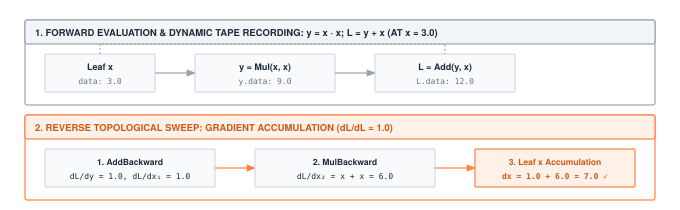

Gradient computation is the single largest source of memory growth during training. Autograd's choices about what to cache during the forward pass, what to recompute on the backward, and when to release tensors decide whether a model fits in VRAM. The runtime you build here is the memory manager for the rest of the system.

:::{.callout-note title="Module Info"}

**FOUNDATION TIER** | Difficulty: ●●●○ | Time: 6-8 hours | Prerequisites: 01-05

You need to be fluent with everything from Modules 01–05:

- Tensor operations (matmul, broadcasting, reductions)
- Activation functions (the source of non-linearity)
- Neural network layers (what gradients will flow through)
- Loss functions (the scalar gradients flow back from)
- DataLoader for batched iteration

If you can hand-compute a forward pass through a small network and explain why we minimize loss, you're ready.
:::



## Overview

A neural network learns by nudging every parameter in the direction that lowers the loss. To find that direction you need a gradient — one number per parameter. A modern model has billions of parameters, so deriving those gradients by hand is not just tedious, it is impossible. Every framework you have ever used — PyTorch, TensorFlow, JAX — solves this with the same trick: automatic differentiation.

In this module you build reverse-mode autograd from scratch. The forward pass records each operation into a small graph; `loss.backward()` walks that graph in reverse, applying the chain rule one operation at a time. When you finish, calling `loss.backward()` on your tensors does the same thing it does in PyTorch — and you will know exactly why.

This is the conceptually hardest module in the Foundation tier. It is also the one that unlocks everything that follows: optimizers, training loops, and any model that learns from data.

## Commands



## Learning objectives

:::{.callout-tip title="By completing this module, you will:"}

- **Trace** the supplied Function base class that enables gradient computation for all operations
- **Follow** how computation graphs track dependencies between tensors during forward pass
- **Master** the chain rule by implementing the backward passes for matrix multiplication, ReLU, and mean squared error
- **Understand** memory trade-offs between storing intermediate values and recomputing forward passes
- **Connect** your autograd implementation to PyTorch's design patterns and production optimizations
:::

## What you'll build

::: {#fig-06_autograd-diag-1 fig-env="figure" fig-pos="htb" fig-cap="**A reverse-mode trace.** For x = 3, the forward graph computes y = x times x = 9 and L = y + x = 12. Backward combines the direct contribution of 1 with two multiply contributions of 3 to give dx = 7." fig-alt="For x = 3, the forward graph computes y = x times x = 9 and L = y + x = 12. Backward combines the direct contribution of 1 with two multiply contributions of 3 to give dx = 7."}



:::

**The pattern you'll enable:**
```python
# Automatic gradient computation
x = Tensor([2.0], requires_grad=True)
y = x * 3 + 1  # y = 3x + 1
y.backward()   # Computes dy/dx = 3 automatically
print(x.grad)  # [3.0]
```

### What you're not building yet

To keep this module focused, you will **not** implement:

- Higher-order derivatives (gradients of gradients)—PyTorch supports this with `create_graph=True`
- Dynamic computation graphs—your graphs are built during forward pass only
- GPU kernel fusion—PyTorch's JIT compiler optimizes backward pass operations
- Checkpointing for memory efficiency—that's an advanced optimization technique

**You are building the core gradient engine.** Advanced optimizations come in production frameworks.

## What you write



## How you know it works



## When it fails



`MatMul.backward grad_a: [[12. 14.] [12. 14.]]`
:   From `test_unit_arithmetic_backward`. The gradient for `a` used `b` as is. For `C = A @ B`, `grad_A = grad_C @ B.T`; transpose the last two axes of `b` (`np.swapaxes(b, -2, -1)`).

`ValueError: matmul: Input operand 1 has a mismatch in its core dimension 0`
:   From `test_unit_tensor_autograd`. The same missing transpose, on non-square shapes, where NumPy cannot even multiply the arrays.

`MSE.backward failed: [-0.125 -0.05 0.05 0.22499999] vs [-0.25 -0.09999999 0.1 0.45]`
:   From `test_unit_loss_backward`. The gradient is off by a constant factor. For the mean of $(p - t)^2$ it is $2(p - t)/N$; a missing 2 halves it and a missing $N$ inflates it.

## Finished? Read why



## What's next

You can now compute a gradient for every parameter in any network you build. That gradient tells you which way is downhill — but it does not tell you how big a step to take, or how to dampen oscillations, or how to adapt the step size per-parameter. That is the optimizer's job.

:::{.callout-note title="Up next: Module 07, Optimizers"}

You'll implement SGD, momentum, and Adam: the rules that turn the `param.grad` tensors produced by `backward()` into actual parameter updates. With autograd plus an optimizer, you have the entire machinery a training loop needs.
:::

**Next:** [Module 07: Optimizers](07_optimizers.qmd)

### How later modules use this one

| Module | What It Does | Your Autograd In Action |
|--------|--------------|------------------------|
| **07: Optimizers** | Update parameters using gradients | `optimizer.step()` uses `param.grad` computed by backward() |
| **08: Training** | Complete training loops | `loss.backward()` → `optimizer.step()` → repeat |
| **12: Attention** | Multi-head self-attention | Gradients flow through Q, K, V projections automatically |

: **How autograd feeds into subsequent optimizer and training modules.** {#tbl-06-autograd-downstream-usage}
