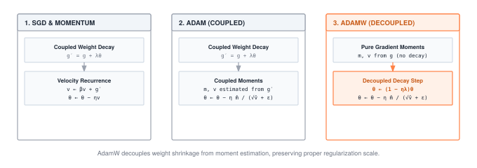

A gradient is a direction, not a step. The optimizer picks a step size, a history window, and a per-parameter scaling rule. Its state, momentum buffers, running second moments, copies of every weight, often costs more memory than the model itself. Choose well and a model converges in an afternoon. Choose poorly and VRAM runs out on epoch one.

:::{.callout-note title="Module Info"}

**FOUNDATION TIER** | Difficulty: ●●○○ | Time: 3-5 hours | Prerequisites: 01-06

**Prerequisites: Modules 01-06** means you need:

- Tensor operations and parameter storage
- DataLoader for efficient batch processing
- Understanding of forward/backward passes (autograd)
- Why gradients point toward higher loss

If you understand how `loss.backward()` computes gradients and why we need to update parameters to minimize loss, you're ready.
:::



## Overview

You have gradients. Now what? An optimizer is the rule that turns a gradient into a parameter update — the difference between a model that converges in an afternoon and one that diverges on the first batch. Picture optimization as hiking in fog: you can feel the slope under your feet but cannot see the valley. Each optimizer is a different strategy for choosing your next step.

You'll build three: SGD with momentum (the foundation), Adam with adaptive per-parameter learning rates (the modern workhorse), and AdamW with decoupled weight decay (the default for transformers). They differ in memory cost, convergence speed, and how forgiving they are when you guess the learning rate wrong — and that last point matters more than most practitioners admit.

## Start and finish



## Learning Objectives

:::{.callout-tip title="By completing this module, you will:"}

- **Implement** SGD with momentum to reduce oscillations and accelerate convergence in narrow valleys
- **Master** Adam's adaptive learning rate mechanism with first and second moment estimation
- **Understand** memory trade-offs (SGD: 2x memory vs Adam: 3x memory) and computational complexity per step
- **Connect** optimizer state management to checkpointing and distributed training considerations
:::

## What You'll Build

::: {#fig-07_optimizers-diag-1 fig-env="figure" fig-pos="htb" fig-cap="**Optimizer state and weight decay.** SGD uses coupled weight decay and optional momentum. Adam forms bias-corrected moments from the gradient plus coupled decay. AdamW forms moments from the gradient and applies weight decay separately." fig-alt="SGD uses coupled weight decay and optional momentum. Adam forms bias-corrected moments from the gradient plus coupled decay. AdamW forms moments from the gradient and applies weight decay separately."}



:::

**The pattern you'll enable:**
```python
# Training loop with optimizer
optimizer = Adam(model.parameters(), lr=0.001)
loss.backward()  # Compute gradients (Module 06)
optimizer.step()  # Update parameters using gradients
optimizer.zero_grad()  # Clear gradients for next iteration
```

### What You're NOT Building (Yet)

To keep this module focused, you will **not** implement:

- Learning rate schedules (that's Module 08: Training)
- Gradient clipping (PyTorch provides this via `torch.nn.utils.clip_grad_norm_`)
- Second-order optimizers like L-BFGS (rarely used in deep learning due to memory cost)
- Distributed optimizer sharding (production frameworks use techniques like ZeRO)

**You are building the core optimization algorithms.** Advanced training techniques come in Module 08.

## What you write



## How you know it works



## When it fails



`assert np.allclose(param2.data, expected_second, rtol=1e-5)`
:   From `test_unit_sgd_optimizer`. The second SGD step is wrong because the momentum buffer did not accumulate. Update it as `momentum * buffer + grad`, then step with the buffer.

`m_hat should equal grad at step 1, got [0.01 0.02]`
:   From `test_unit_adam_update_moments`. No bias correction. Divide `m` by `1 - beta1**t` and `v` by `1 - beta2**t`.

`m_hat should equal grad at step 1, got [inf inf]`
:   From `test_unit_adam_update_moments`. The correction ran before the update count was incremented, so `t = 0` and `1 - beta1**0` is zero. Increment the count first.

## Finished? Read why



## What's Next

:::{.callout-note title="Coming Up: Module 08 - Training"}

You have an optimizer that takes one step. Module 08 wraps it in the loop that takes a million: epochs, validation, checkpointing, learning rate schedules, and early stopping. The question it answers is the one this chapter raised but did not solve — *how do you actually drive a model to convergence without babysitting it?*
:::

**Preview - How Your Optimizers Get Used in Future Modules:**

@tbl-07-optimizers-downstream-usage traces how this module is reused by later parts of the curriculum.

| Module | What It Does | Your Optimizers In Action |
|--------|--------------|---------------------------|
| **08: Training** | Complete training loops | `for epoch in range(10): loss.backward(); optimizer.step()` |
| **09: Convolutions** | Convolutional networks | `AdamW` optimizes millions of CNN parameters efficiently |
| **13: Transformers** | Attention mechanisms | Large models require careful optimizer selection |

: **How optimizers feed into subsequent training modules.** {#tbl-07-optimizers-downstream-usage}
