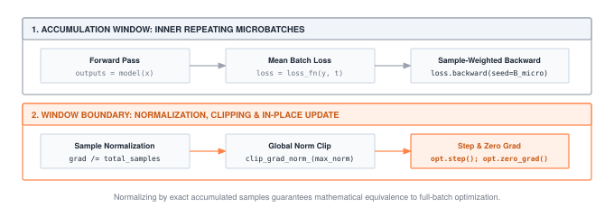

The inner loop is four lines: forward, loss, backward, step. A training system is everything wrapped around it. Schedules, clipping, evaluation modes, and checkpoints are what turn one `step()` into a million without human babysitting. This is where the framework becomes something you can leave running overnight.

:::{.callout-note title="Module Info"}

**FOUNDATION TIER** | Difficulty: ●●○○ | Time: 5-7 hours | Prerequisites: 01-07

This is the capstone of the Foundation Tier. The seven components you built — tensors, activations, layers, losses, dataloader, autograd, optimizers — finally fit together into a Trainer that actually learns.
:::



## Overview

Seven modules of components, none of them yet doing anything together. A tensor on its own does not learn. A layer on its own does not learn. Even autograd plus an optimizer does not learn — somebody has to call them, in order, on real data, again and again. That somebody is the training loop, and you are about to build it.

The loop itself is four lines: forward pass, loss, backward pass, optimizer step. Repeat. The hard part is what production wraps around those four lines. Learning rates need to start high and decay. Gradients sometimes explode and need clipping. Long runs crash and need checkpoints to resume from. Models need separate train and evaluation modes so dropout and batch norm behave correctly. By the end of this module you will have a `Trainer` class that handles all of this — the same architecture PyTorch Lightning and Hugging Face Transformers expose to millions of users, just smaller and yours.

## Learning Objectives

:::{.callout-tip title="By completing this module, you will:"}

- **Implement** a complete Trainer class orchestrating forward pass, loss computation, backward pass, and parameter updates
- **Master** learning rate scheduling with cosine annealing that adapts training speed over time
- **Understand** gradient clipping by global norm that prevents training instability
- **Build** checkpointing systems that save and restore complete training state for fault tolerance
- **Analyze** training memory overhead (4--6$\times$ model size) and checkpoint storage costs
:::

## What You'll Build

Five pieces wrapped around the inner loop: a learning-rate schedule, a gradient clipper, the training loop itself, an evaluation pass, and checkpoint save/load.

::: {#fig-08_training-diag-1 fig-env="figure" fig-pos="htb" fig-cap="**A sample-weighted accumulation window.** Batch-mean losses seed backward with each batch sample count. At the window boundary, gradients are divided by the actual sample count, optionally clipped, and applied before being cleared." fig-alt="Batch-mean losses seed backward with each batch sample count. At the window boundary, gradients are divided by the actual sample count, optionally clipped, and applied before being cleared."}



:::


**Implementation roadmap:**

@tbl-08-training-implementation-roadmap lays out the implementation in order, one part at a time.

| Part | What You'll Implement | Key Concept |
|------|----------------------|-------------|
| 1 | `CosineSchedule` class | Learning rate annealing (fast → slow) |
| 2 | `clip_grad_norm()` function | Global gradient clipping for stability |
| 3 | `Trainer.train_epoch()` | Complete training loop with scheduling |
| 4 | `Trainer.evaluate()` | Evaluation mode without gradient updates |
| 5 | `Trainer.save/load_checkpoint()` | Training state persistence |

: **Implementation roadmap for the Trainer and learning-rate schedule.** {#tbl-08-training-implementation-roadmap}

**The pattern you'll enable:**
```python
# Complete training pipeline (modules 01-07 working together)
trainer = Trainer(model, optimizer, loss_fn, scheduler, grad_clip_norm=1.0)
for epoch in range(100):
    train_loss = trainer.train_epoch(train_data)
    eval_loss, accuracy = trainer.evaluate(val_data)
    trainer.save_checkpoint(f"checkpoint_{epoch}.pkl")
```

### What You're NOT Building (Yet)

To keep the module focused, you will **not** implement:

- Distributed training across multiple GPUs (PyTorch uses `DistributedDataParallel`)
- Mixed-precision training (PyTorch's Automatic Mixed Precision relies on dedicated FP16/BF16 tensor types)
- Exotic schedulers — warmup, cyclic, one-cycle, polynomial decay (production frameworks ship dozens)

**You are building the core training orchestration.** That orchestration is what the rest of the framework plugs into.

## API Reference

The signatures you need to satisfy. Keep this open in a second tab while you implement.

### CosineSchedule

```python
CosineSchedule(max_lr=0.1, min_lr=0.01, total_epochs=100)
```

Cosine annealing learning rate schedule that smoothly decreases from `max_lr` to `min_lr` over `total_epochs`.

@tbl-08-training-schedule-api lists the schedule API.

| Method | Signature | Description |
|--------|-----------|-------------|
| `get_lr` | `get_lr(epoch: int) -> float` | Returns learning rate for given epoch |

: **Method on the CosineSchedule class.** {#tbl-08-training-schedule-api}

### Gradient Clipping

```python
clip_grad_norm(parameters: List, max_norm: float = 1.0) -> float
```

Clips gradients by global norm to prevent exploding gradients. Returns original norm for monitoring.

### Trainer

```python
Trainer(model, optimizer, loss_fn, scheduler=None, grad_clip_norm=None)
```

Orchestrates complete training lifecycle with forward pass, loss computation, backward pass, optimization, and checkpointing.

#### Core Methods

@tbl-08-training-trainer-api lists the core methods on the trainer.

| Method | Signature | Description |
|--------|-----------|-------------|
| `train_epoch` | `train_epoch(dataloader, accumulation_steps=1) -> float` | Train for one epoch, returns average loss |
| `evaluate` | `evaluate(dataloader) -> Tuple[float, float]` | Evaluate model, returns (loss, accuracy) |
| `save_checkpoint` | `save_checkpoint(path: str) -> None` | Save complete training state |
| `load_checkpoint` | `load_checkpoint(path: str) -> None` | Restore training state from file |

: **Core methods on the Trainer class.** {#tbl-08-training-trainer-api}

## Core Concepts

Five ideas. The training loop, epochs vs. iterations, train vs. eval mode, learning rate scheduling, and gradient clipping. Every ML framework — yours, PyTorch, JAX — implements these the same way at the conceptual level.

### The Training Loop

The training loop is a four-step pattern repeated thousands of times: push data through the model (forward pass), measure how wrong it is (loss), compute how to improve each parameter (backward pass), apply the update (optimizer step). Random weights at iteration 0; a network that recognizes digits at iteration 30,000.

Here's the complete training loop from your Trainer implementation:

The code in @lst-08-training-train-epoch makes this concrete.

```{python}
#| label: lst-08-training-train-epoch
#| lst-cap: "**The training loop: zero gradients, set scheduler LR, process batches with sample weighting, and step the optimizer.**"
#| eval: false
def train_epoch(self, dataloader, accumulation_steps: int = 1) -> float:
    """Train for one epoch through the dataset."""
    self.model.training = True
    self.training_mode = True
    self.optimizer.zero_grad()

    # Update scheduler at the start of each epoch so LR is set before training begins
    if self.scheduler is not None:
        current_lr = self.scheduler.get_lr(self.epoch)
        self.optimizer.lr = current_lr
        self.history['learning_rates'].append(current_lr)

    total_loss = 0.0
    total_samples = 0
    pending_samples = 0
    pending = 0  # batches waiting for an optimizer step

    for inputs, targets in dataloader:
        batch_size = inputs.shape[0]
        total_loss += self._process_batch(inputs, targets)
        total_samples += batch_size
        pending_samples += batch_size
        pending += 1

        # Update parameters every accumulation_steps batches
        if pending == accumulation_steps:
            self._optimizer_update(pending_samples)
            pending_samples = 0
            pending = 0
            self.step += 1

    # A short tail (batch count not divisible by accumulation_steps) still gets its step
    if pending > 0:
        self._optimizer_update(pending_samples)
        self.step += 1

    avg_loss = total_loss / max(total_samples, 1)
    self.history['train_loss'].append(avg_loss)
    self.epoch += 1
    return avg_loss
```

Each iteration processes one batch: the model turns inputs into predictions, the loss function scores them against targets, the backward pass fills `.grad` on every parameter, the clipper bounds the global norm, and the optimizer applies the step. Total loss divided by sample count is the average training loss you watch to see convergence.

While this implementation reads like standard sequential Python, scaling this loop to production hardware transforms it into a highly asynchronous, choreographed dance between the host CPU (dispatching kernel instructions) and the target GPU (executing them massively in parallel).

:::{.callout-note title="Systems Implication: CPU/GPU Sync Overhead"}
Innocuous operations like calculating `total_loss += loss.item()` or printing loss values inside the inner loop force a hard synchronization block. The CPU must halt and wait for the GPU to drain its computation queue just to copy a single scalar value back across the PCIe bus. This catastrophic synchronization stalls the entire training pipeline, starving the GPU. High-performance systems meticulously defer, asynchronously accumulate, or strictly periodically sample these metrics to prevent interrupting the compute symphony.
:::

To circumvent hard physical VRAM limits without sacrificing statistical stability, the `accumulation_steps` parameter introduces a profound memory-compute trade-off. If an architecture requires an effective batch size of 128 but the GPU can only harbor 32 samples at a time, setting `accumulation_steps=4` serially accrues gradients over four distinct forward-backward passes. This achieves the mathematically identical optimizer update of a 128-sample batch, trading raw wall-clock time for an artificially expanded memory horizon.

### Epochs and Iterations

Training operates on two timescales: iterations (single batch updates) and epochs (complete passes through the dataset). The hierarchy is what lets you reason about training progress and cost.

An iteration processes one batch: forward, backward, step. With 10,000 samples and batch size 32, one epoch is 313 iterations (10,000 ÷ 32, rounded up). Convergence typically takes dozens to hundreds of epochs, so tens of thousands of iterations.

Scale that up and the implications get real. ImageNet has 1.2M images; batch size 256 and 90 epochs is 421,920 iterations (1,200,000 ÷ 256 × 90). At 250ms per iteration, that's **29 hours** on one GPU. The same arithmetic tells you whether a hyperparameter sweep is feasible or whether you should rent more machines.

Your Trainer tracks both: `self.step` counts total iterations across all epochs, while `self.epoch` counts how many complete dataset passes you've completed. Schedulers typically operate on epoch boundaries (learning rate changes each epoch), while monitoring systems track loss per iteration.

### Train vs Eval Modes

Neural networks behave differently during training versus evaluation. Layers like dropout randomly zero activations during training (for regularization) but keep all activations during evaluation. Batch normalization computes running statistics during training but uses fixed statistics during evaluation. Your Trainer needs to signal which mode the model is in.

The pattern is simple: set `model.training = True` before training, set `model.training = False` before evaluation. This boolean flag propagates through layers, changing their behavior:

The code in @lst-08-training-evaluate makes this concrete.

```{python}
#| label: lst-08-training-evaluate
#| lst-cap: "**`Trainer.evaluate()` flips the model to eval mode, runs forward-only passes inside `no_grad()`, and reports sample-weighted loss and accuracy.**"
#| eval: false
def evaluate(self, dataloader) -> Tuple[float, float]:
    """Evaluate model without updating parameters."""
    self.model.training = False
    self.training_mode = False

    total_loss = 0.0
    correct = 0
    total = 0
    total_samples = 0

    for inputs, targets in dataloader:
        # Forward pass only through _forward, wrapped in no_grad() to prevent memory leaks
        with no_grad():
            outputs = self._forward(inputs)
            loss = self.loss_fn.forward(outputs, targets)

        batch_size = inputs.shape[0]
        total_loss += float(loss.data) * batch_size
        total_samples += batch_size

        # Task-specific evaluation metrics
        if isinstance(self.loss_fn, CrossEntropyLoss):
            predictions = np.argmax(outputs.data, axis=1)
            correct += np.sum(predictions == targets.data)
            total += predictions.size
        elif isinstance(self.loss_fn, BinaryCrossEntropyLoss):
            predictions = outputs.data >= 0.5
            correct += np.sum(predictions == (targets.data >= 0.5))
            total += predictions.size

    avg_loss = total_loss / total_samples if total_samples > 0 else 0.0
    accuracy = correct / total if total > 0 else 0.0

    self.history['eval_loss'].append(avg_loss)
    return avg_loss, accuracy
```

Notice what's missing: no `loss.backward()`, no `optimizer.step()`, no gradient updates. Evaluation measures current model performance without changing parameters. This separation is crucial: if you accidentally left `training = True` during evaluation, dropout would randomly zero activations, giving you noisy accuracy measurements that don't reflect true model quality.

### Learning Rate Scheduling

Learning rate scheduling adapts training speed over time. Early in training, when parameters are far from optimal, high learning rates enable rapid progress. Late in training, when approaching a good solution, low learning rates enable stable convergence without overshooting. Fixed learning rates force you to choose between fast early progress and stable late convergence. Scheduling gives you both.

Cosine annealing uses the cosine function to smoothly transition from maximum to minimum learning rate:

```python
def get_lr(self, epoch: int) -> float:
    """Get learning rate for current epoch."""
    if epoch >= self.total_epochs:
        return self.min_lr

    # Cosine annealing formula
    cosine_factor = (1 + np.cos(np.pi * epoch / self.total_epochs)) / 2
    return self.min_lr + (self.max_lr - self.min_lr) * cosine_factor
```

At epoch 0, `cos(0) = 1` so `cosine_factor = 1.0` and the rate is `max_lr`. At the final epoch, `cos(π) = -1` so `cosine_factor = 0.0` and the rate is `min_lr`. Between those endpoints the curve falls off smoothly — fast at first, slower as it bottoms out.

For `max_lr=0.1`, `min_lr=0.01`, `total_epochs=100`:

```text
Epoch   0:  0.100   (aggressive learning)
Epoch  25:  0.087   (still fast)
Epoch  50:  0.055   (slowing down)
Epoch  75:  0.023   (fine-tuning)
Epoch 100:  0.010   (stable convergence)
```

Your Trainer applies the schedule at the start of each epoch, so every optimizer update in that epoch uses the same scheduled rate:

```python
if self.scheduler is not None:
    current_lr = self.scheduler.get_lr(self.epoch)
    self.optimizer.lr = current_lr
```

This updates the optimizer's learning rate before the next epoch begins, creating adaptive training speed without manual intervention.

### Gradient Clipping

Gradient clipping prevents exploding gradients that destroy training progress. During backpropagation, gradients sometimes become extremely large (thousands or even infinity), causing parameter updates that jump far from the optimum or overflow into NaN. Clipping rescales large gradients to a safe maximum while preserving their direction.

The key insight is clipping by global norm rather than individual gradients. Computing the norm across all parameters `√(Σ g²)` and scaling uniformly preserves the relative magnitudes between different parameters:

The code in @lst-08-training-clip-grad-norm makes this concrete.

```{python}
#| label: lst-08-training-clip-grad-norm
#| lst-cap: "**`clip_grad_norm()` rescales gradients uniformly when the global norm exceeds `max_norm`, preserving their relative magnitudes.**"
#| eval: false
def clip_grad_norm(parameters: Iterable, max_norm: float = 1.0) -> float:
    """Clip gradients by global norm to prevent exploding gradients."""
    parameters = list(parameters)
    if not parameters:
        return 0.0

    # Compute global norm across all parameters
    total_norm = 0.0
    for param in parameters:
        if param.grad is not None:
            grad_data = param.grad if isinstance(param.grad, np.ndarray) else param.grad.data
            total_norm += np.sum(grad_data.astype(np.float64) ** 2)

    total_norm = np.sqrt(total_norm)

    # Scale all gradients if norm exceeds threshold
    if total_norm > max_norm:
        clip_coef = max_norm / total_norm
        for param in parameters:
            if param.grad is not None:
                if isinstance(param.grad, np.ndarray):
                    param.grad = param.grad * clip_coef
                else:
                    param.grad.data = param.grad.data * clip_coef

    return float(total_norm)
```

Consider gradients `[100, 200, 50]` with global norm √(100² + 200² + 50²) ≈ 229. With `max_norm=1.0`, the clip coefficient is `1.0 / 229 ≈ 0.00437`, and every gradient is scaled by it: `[0.437, 0.873, 0.218]`. The new norm is exactly 1.0, but the relative magnitudes survive — the second gradient is still twice the first. Notice also that converting `parameters = list(parameters)` at the start prevents generator exhaustion, so the second scaling pass reliably visits every parameter.

This uniform scaling is crucial. If we clipped each gradient independently to 1.0, we'd get `[1.0, 1.0, 1.0]`, destroying the information that the second parameter needs larger updates than the first. Global norm clipping prevents explosions while respecting the gradient's message about relative importance.

### Checkpointing

Checkpointing saves complete training state to disk, enabling fault tolerance and experimentation. Training runs take hours or days. Hardware fails. You want to try different hyperparameters after epoch 50. Checkpoints make all of this possible by capturing everything needed to resume training exactly where you left off.

A complete checkpoint includes:

The code in @lst-08-training-save-checkpoint makes this concrete.

```{python}
#| label: lst-08-training-save-checkpoint
#| lst-cap: "**`Trainer.save_checkpoint()` atomically pickles training state: parameters, optimizer buffers, scheduler, epoch/step counters, and history.**"
#| eval: false
def save_checkpoint(self, path: str):
    """Save complete training state for resumption via atomic file replace."""
    checkpoint = {
        'epoch': self.epoch,
        'step': self.step,
        'model_state': self._get_model_state(),
        'optimizer_state': self._get_optimizer_state(),
        'scheduler_state': self._get_scheduler_state(),
        'history': self.history,
        'training_mode': self.training_mode
    }

    Path(path).parent.mkdir(parents=True, exist_ok=True)
    tmp_path = f"{path}.tmp"
    with open(tmp_path, 'wb') as f:
        pickle.dump(checkpoint, f)
    os.replace(tmp_path, path)
```

Writing to `f"{path}.tmp"` and renaming atomically with `os.replace` guarantees crash resilience: a failed run or interrupted process never leaves a half-written, corrupt checkpoint where a good checkpoint used to be.

Model state is straightforward: copy all parameter tensors. Optimizer state is more subtle: SGD with momentum stores velocity buffers (one per parameter), Adam stores two moment buffers (first and second moments). Scheduler state captures current learning rate progression. Training metadata includes epoch counter and loss history.

Loading reverses the process:

The code in @lst-08-training-load-checkpoint makes this concrete.

```{python}
#| label: lst-08-training-load-checkpoint
#| lst-cap: "**`Trainer.load_checkpoint()` reverses the save: unpickle, restore counters and history, then rehydrate model, optimizer, and scheduler state.**"
#| eval: false
def load_checkpoint(self, path: str):
    """Restore training state from checkpoint."""
    with open(path, 'rb') as f:
        checkpoint = pickle.load(f)

    self.epoch = checkpoint['epoch']
    self.step = checkpoint['step']
    self.history = checkpoint['history']
    self.training_mode = checkpoint['training_mode']

    # Restore states (simplified for educational purposes)
    if 'model_state' in checkpoint:
        self._set_model_state(checkpoint['model_state'])
    if 'optimizer_state' in checkpoint:
        self._set_optimizer_state(checkpoint['optimizer_state'])
    if 'scheduler_state' in checkpoint:
        self._set_scheduler_state(checkpoint['scheduler_state'])
```

After loading, training resumes as if the interruption never happened. The next `train_epoch()` call starts at the correct epoch, uses the correct learning rate, and continues optimizing from the exact parameter values where you stopped.

### Computational Complexity

Training cost is a function of architecture and dataset size. For a fully connected network with `L` layers of width `d`, the forward pass across a batch of $B$ samples is $O(B \cdot d^2 \cdot L)$ — matrix multiplications dominate. The backward pass has the same asymptotic complexity ($2\times$ forward FLOPs), since autograd revisits every operation. With `N` total samples and batch size `B`, one epoch consists of `N / B` iterations.

Total training cost for E epochs:

```
Work per iteration:    O(B × d² × L) × 2     (forward + backward for B samples)
Iterations per epoch:  N / B
Total iterations:      (N / B) × E
Total complexity:      O(N × E × d² × L)
```

Real numbers make this concrete. A 2-layer network (`d=512`) on 10,000 samples (batch size 32) for 100 epochs:

```text
d² × L              = 512² × 2          = 524,288 ops per sample
Batch operations    = 524,288 × 32      = 16.8M ops per batch
Iterations / epoch  = 10,000 / 32       = 313
Total iterations    = 313 × 100         = 31,300
Total operations    = 31,300 × 16.8M    ≈ 525 billion ops
```

At 1 GFLOP/s (typical CPU), that's about **525 seconds (≈ 9 minutes)**. A GPU at 1 TFLOP/s (1,000$\times$ faster) finishes it in **0.5 seconds**. The arithmetic is exactly why GPUs exist for ML: the workload is dense linear algebra, and a GPU eats dense linear algebra.

Memory complexity is simpler but just as important:

@tbl-08-training-memory-components breaks down the memory footprint component by component.

| Component | Memory |
|-----------|--------|
| Model parameters | d² × L × 4 bytes (float32) |
| Gradients | Same as parameters |
| Optimizer state (SGD) | Same as parameters (momentum) |
| Optimizer state (Adam) | 2× parameters (two moments) |
| Activations | d × B × L × 4 bytes |

: **Memory footprint of model parameters, gradients, and optimizer state.** {#tbl-08-training-memory-components}

Total training memory is typically 4--6$\times$ model size, depending on optimizer. This explains GPU memory constraints: a 1GB model requires 4-6GB GPU memory for training, limiting batch size when memory is scarce.

## Production Context

### Your Implementation vs. PyTorch

Your `Trainer` and PyTorch's training stack (Lightning, Hugging Face `Trainer`) share the same architecture. Production adds distributed training, mixed precision, dozens of schedulers, and a callback system. The inner loop is identical.

@tbl-08-training-vs-pytorch places your implementation side by side with the production reference for direct comparison.

| Feature | Your Implementation | PyTorch / Lightning |
|---------|---------------------|---------------------|
| **Training Loop** | Manual forward/backward/step | Same pattern, with callbacks |
| **Schedulers** | Cosine annealing | 20+ schedulers (warmup, cyclic, etc.) |
| **Gradient Clipping** | Global norm clipping | Same algorithm, GPU-optimized |
| **Checkpointing** | Pickle-based state saving | Same concept, optimized formats |
| **Distributed Training** | ✗ Single device | ✓ Multi-GPU, multi-node |
| **Mixed Precision** | ✗ FP32 only | ✓ Automatic FP16/BF16 |

: **Feature comparison between TinyTorch Trainer and PyTorch training stacks.** {#tbl-08-training-vs-pytorch}

### Code Comparison

Equivalent training pipelines side by side. Same conceptual flow: build model, attach optimizer and scheduler, hand them to a trainer, loop.

::: {.panel-tabset}
## Your TinyTorch
```python
from tinytorch import Trainer, CosineSchedule, SGD, MSELoss

# Setup
model = MyModel()
optimizer = SGD(model.parameters(), lr=0.1, momentum=0.9)
scheduler = CosineSchedule(max_lr=0.1, min_lr=0.01, total_epochs=100)
trainer = Trainer(model, optimizer, MSELoss(), scheduler, grad_clip_norm=1.0)

# Training loop
for epoch in range(100):
    train_loss = trainer.train_epoch(train_data)
    eval_loss, acc = trainer.evaluate(val_data)

    if epoch % 10 == 0:
        trainer.save_checkpoint(f"ckpt_{epoch}.pkl")
```

## PyTorch Lightning
```python
import torch
from torch.optim.lr_scheduler import CosineAnnealingLR
from pytorch_lightning import Trainer

# Setup (nearly identical!)
model = MyModel()
optimizer = torch.optim.SGD(model.parameters(), lr=0.1, momentum=0.9)
scheduler = CosineAnnealingLR(optimizer, T_max=100, eta_min=0.01)
trainer = Trainer(max_epochs=100, gradient_clip_val=1.0)

# Training (abstracted by Lightning)
trainer.fit(model, train_dataloader, val_dataloader)
# Lightning handles the loop, checkpointing, and callbacks automatically
```
:::

The pieces line up almost one-for-one:

- **Imports** — TinyTorch exposes classes directly; PyTorch uses a deeper module hierarchy. Same concepts, different organization.
- **Model + optimizer** — identical pattern. Both pass `model.parameters()` to the optimizer so it can track what to update.
- **Scheduler** — `CosineSchedule` versus `CosineAnnealingLR`. Different names, same math.
- **Trainer setup** — TinyTorch takes model, optimizer, loss, and scheduler explicitly. Lightning hides them behind a model definition + `Trainer(...)`. Both support `gradient_clip`.
- **Training loop** — TinyTorch makes the epoch loop explicit; Lightning hides it inside `trainer.fit()`. The loop Lightning runs is the loop you wrote.
- **Checkpointing** — TinyTorch requires manual `save_checkpoint()` calls; Lightning checkpoints automatically based on validation metrics.

:::{.callout-tip title="What's Identical"}

The core training loop pattern: forward pass → loss → backward → gradient clipping → optimizer step → learning rate scheduling. When debugging PyTorch training, you'll understand exactly what's happening because you built it yourself.
:::

### Why Training Infrastructure Matters at Scale

The same patterns scale up brutally. Three numbers from production:

- **GPT-3 training**: 175 billion parameters, 300 billion tokens, ~$4.6 million in compute. A single checkpoint is **350 GB** — larger than most laptop SSDs. Checkpoint frequency is a real engineering tradeoff between fault tolerance and storage cost.
- **ImageNet training**: 1.2 million images, 90 epochs is standard. At 250ms per iteration (batch 256), that's **29 hours** on one GPU. Learning rate scheduling is the difference between 75% accuracy (mediocre) and 76.5% (state-of-the-art) — a difference papers are written about.
- **Training instability**: Without gradient clipping, roughly 1 in 50 training runs randomly diverges — gradients explode, outputs go NaN, all progress lost. A 2% failure rate is unacceptable when each run costs thousands of dollars.

Your `Trainer` handles all three of these at educational scale, with the same architecture the production systems use. The numbers get bigger; the loop does not.

## Check Your Understanding

:::{.callout-tip title="Check Your Understanding — Training"}
Before moving on, verify you can articulate each of the following:

- [ ] The CPU/GPU sync overhead introduced by a naive training loop — why `loss.item()` or a print statement inside the inner loop forces the GPU to drain its queue and stalls the whole pipeline.
- [ ] Why gradient accumulation trades wall-clock time for effective batch size without changing peak memory, and why that is exactly the knob you reach for when VRAM is the binding constraint.
- [ ] Why global-norm clipping preserves the *relative* magnitudes of gradients (which individual per-parameter clipping destroys) and why that distinction matters for learning.
- [ ] Why training memory is typically 4--6$\times$ the model size (params + grads + optimizer state + activations) and how that sets the floor on what fits on a single GPU.

If any of these feels fuzzy, revisit the Training Loop and Computational Complexity sections before moving on.
:::

Five systems-thinking questions. They build intuition for the performance characteristics and trade-offs you'll meet again in production ML — usually under a deadline.

**Q1: Training Memory Calculation**

You have a model with 10 million parameters (float32) and use the Adam optimizer. Estimate total training memory required: parameters + gradients + optimizer state. Then compare with SGD.

:::{.callout-tip collapse="true" title="Answer"}

**Adam optimizer:**

- Parameters: 10M × 4 bytes = **40 MB**
- Gradients: 10M × 4 bytes = **40 MB**
- Adam state (two moments): 10M × 2 × 4 bytes = **80 MB**
- **Total: 160 MB** (4$\times$ parameter size)

**SGD with momentum:**

- Parameters: 10M × 4 bytes = **40 MB**
- Gradients: 10M × 4 bytes = **40 MB**
- Momentum buffer: 10M × 4 bytes = **40 MB**
- **Total: 120 MB** (3$\times$ parameter size)

**Key insight:** Optimizer choice changes training memory by 33%. For large models close to the GPU's memory ceiling, SGD is sometimes the only optimizer that fits.
:::

**Q2: Gradient Accumulation Trade-off**

You want batch size 128 but your GPU can only fit 32 samples. You use gradient accumulation with `accumulation_steps=4`. How does this affect:
(a) Memory usage?
(b) Training time?
(c) Gradient noise?

:::{.callout-tip collapse="true" title="Answer"}

**(a) Memory:** No change. Only one batch (32 samples) in GPU memory at a time. Gradients accumulate in parameter `.grad` buffers which already exist.

**(b) Training time:** **4$\times$ slower per update**. You process 4 batches sequentially (forward + backward) before optimizer step. Total iterations stays the same, but wall-clock time increases linearly with accumulation steps.

**(c) Gradient noise:** **Reduced** (same as true batch_size=128). Averaging gradients over 128 samples gives more accurate gradient estimate than 32 samples, leading to more stable training.

**Trade-off summary:** Gradient accumulation exchanges compute time for effective batch size when memory is limited. You get better gradients (less noise) but slower training (more time per update).
:::

**Q3: Learning Rate Schedule Analysis**

Training with fixed `lr=0.1` converges quickly initially but oscillates around the optimum, never quite reaching it. Training with cosine schedule (0.1 → 0.01) converges slower initially but reaches better final accuracy. Explain why, and suggest when fixed LR might be better.

:::{.callout-tip collapse="true" title="Answer"}

**Why fixed LR oscillates:**
High learning rate (0.1) enables large parameter updates. Early in training (far from optimum), large updates accelerate convergence. Near the optimum, large updates overshoot, causing oscillation: update jumps past the optimum, then jumps back, repeatedly.

**Why cosine schedule reaches better accuracy:**
Starting high (0.1) provides fast early progress. Gradual decay (0.1 → 0.01) allows the model to take progressively smaller steps as it approaches the optimum. By the final epochs, lr=0.01 enables fine-tuning without overshooting.

**When fixed LR is better:**
- **Short training runs** (< 10 epochs): Scheduling overhead not worth it
- **Learning rate tuning**: Finding optimal LR is easier with fixed values
- **Transfer learning**: When fine-tuning pre-trained models, fixed low LR (0.001) often works best

**Rule of thumb:** For training from scratch over 50+ epochs, scheduling almost always improves final accuracy by 1-3%.
:::

**Q4: Checkpoint Storage Strategy**

You're training for 100 epochs. Each checkpoint is 1 GB. Checkpointing every epoch costs 100 GB of storage. Checkpointing every 10 epochs risks losing 10 epochs of work if training crashes. Design a checkpointing strategy that balances fault tolerance and storage cost.

:::{.callout-tip collapse="true" title="Answer"}

**Strategy: Keep last N + best + milestones**

1. **Keep last N=3 checkpoints** (rolling window): `epoch_98.pkl`, `epoch_99.pkl`, `epoch_100.pkl` (3 GB)
2. **Keep best checkpoint** (lowest validation loss): `best_epoch_72.pkl` (1 GB)
3. **Keep milestone checkpoints** (every 25 epochs): `epoch_25.pkl`, `epoch_50.pkl`, `epoch_75.pkl` (3 GB)

**Total storage: 7 GB** (vs 100 GB for every epoch)

**Fault tolerance:**

- Last 3 checkpoints: Lose at most 1 epoch of work
- Best checkpoint: Can always restart from best validation performance
- Milestones: Can restart experiments from quarter-points

**Implementation:**
```python
if epoch % 25 == 0:  # Milestone
    save_checkpoint(f"milestone_epoch_{epoch}.pkl")
elif epoch >= last_3_start:  # Last 3
    save_checkpoint(f"recent_epoch_{epoch}.pkl")
if is_best_validation:  # Best
    save_checkpoint(f"best_epoch_{epoch}.pkl")
```

**Production systems** use this strategy plus cloud storage for off-site backup.
:::

**Q5: Global Norm Clipping Analysis**

Two training runs: (A) clips each gradient individually to max 1.0, (B) clips by global norm with `max_norm=1.0`. Both encounter gradients `[50, 100, 5]` with global norm √(50² + 100² + 5²) ≈ 112. What are the clipped gradients in each case? Which preserves gradient direction better?

:::{.callout-tip collapse="true" title="Answer"}

**(A) Individual clipping** (clip each to max 1.0):

- Original: `[50, 100, 5]`
- Clipped: `[1.0, 1.0, 1.0]`
- **Result:** All parameters get equal updates — relative-importance information is destroyed.

**(B) Global norm clipping** (scale uniformly):

- Original: `[50, 100, 5]`, global norm ≈ 112
- Scale factor: `1.0 / 112 ≈ 0.0089`
- Clipped: `[0.45, 0.89, 0.04]`
- New global norm: **1.0** (exactly `max_norm`)
- **Result:** Relative magnitudes preserved — the second parameter still gets a 2× larger update than the first.

**Why (B) is better:**
Gradients encode relative importance: parameter 2 *needs* larger updates than parameter 1. Global-norm clipping bounds the explosion while respecting that signal. Individual clipping flattens the signal, treating every parameter as equally important.

**Verification:** √(0.45² + 0.89² + 0.04²) ≈ 1.0.
:::

## Key Takeaways

- **The inner loop is four lines; the Trainer is everything around them:** Forward, loss, backward, step repeats forever. Production wraps it in schedules, clipping, evaluation modes, and checkpointing — those are what separate a toy loop from a training system.
- **Sync points kill throughput:** A `.item()` call or a print inside the inner loop drags a scalar back across PCIe and halts the GPU. High-performance loops defer metrics or sample them periodically.
- **Gradient accumulation decouples memory from effective batch size:** 32 samples in memory, serially accumulated 4$\times$ gives the mathematically identical update of a 128-batch — trading wall-clock time for an artificially expanded memory horizon.
- **Global-norm clipping preserves gradient *direction* while bounding magnitude:** Individual clipping flattens the signal; global-norm clipping bounds explosions without lying about which parameters need larger updates.
- **Checkpoints are the fault-tolerance boundary:** Saving params + optimizer state + scheduler + epoch makes a 29-hour run resumable. Every minute between checkpoints is a minute you are willing to lose.

**Coming next:** You just shipped the Foundation Tier. Module 09 opens the Architecture Tier with `Conv2d`, `MaxPool2d`, and the structural prior that made computer vision work — while the Trainer you just built keeps driving the loop unchanged.

## Further Reading

For students who want to understand the academic foundations and advanced training techniques:

### Seminal Papers

- **Cyclical Learning Rates for Training Neural Networks** - Smith (2017). Introduced cyclical learning rate schedules and the learning rate finder technique. Cosine annealing is a variant of these ideas.
  - **Systems Implication:** By architecting non-monotonic learning rate schedules that enable significantly faster convergence, this work directly reduced the total end-to-end wall-clock time and the exorbitant compute-hour costs required to train large-scale models on datacenter hardware. [arXiv:1506.01186](https://arxiv.org/abs/1506.01186)

- **On the Difficulty of Training Recurrent Neural Networks** - Pascanu et al. (2013). Analyzed the exploding and vanishing gradient problem, introducing gradient clipping as a robust stabilization solution. The global norm clipping you implemented originates directly from this research.
  - **Systems Implication:** While mathematically stabilizing, global gradient clipping requires an exhaustive reduction operation across *all* parameter gradients. In distributed training, this introduces a mandatory, global cross-GPU communication block (an `AllReduce` operation) that can severely bottleneck the pipeline right before parameter updates. [arXiv:1211.5063](https://arxiv.org/abs/1211.5063)

- **Accurate, Large Minibatch SGD: Training ImageNet in 1 Hour** - Goyal et al. (2017). Demonstrated the mathematical scaling laws linking batch size and learning rate, formalizing linear warmup and distributed gradient accumulation techniques.
  - **Systems Implication:** Provided the rigorous empirical proof that scaling batch sizes linearly allows deep models to be efficiently distributed across massive GPU clusters via Data Parallelism. This high-batch-size regime effectively masks network communication latency behind large, dense matrix multiplications, achieving peak hardware utilization. [arXiv:1706.02677](https://arxiv.org/abs/1706.02677)

### Additional Resources

- **PyTorch Lightning Documentation**: [Training Loop Documentation](https://pytorch-lightning.readthedocs.io/en/stable/common/trainer.html) - See how production frameworks implement the same training patterns you built
- **Weights & Biases Tutorial**: "Hyperparameter Tuning" - Excellent guide on learning rate scheduling and gradient clipping in practice

## What's Next

You just shipped the Foundation Tier. Tensors, autograd, optimizers, dataloader, and a `Trainer` that ties them together — these are the load-bearing pieces of every modern ML framework, and you wrote all of them. The next tier is about *what gets put inside the model*. The training loop you built does not change.

Before moving on, the next three chapters give those Foundation pieces their first real workout. The **Foundation Milestones** — Rosenblatt's 1958 Perceptron, the 1969 XOR Crisis, and the 1986 MLP Revival — are runnable recreations of the experiments that shaped early neural-network history, moving from your forward-pass stack to the full autograd, optimizer, and Trainer pipeline you just finished. You watch your own code fail in the same way Minsky proved it had to, then break through with the same fix Rumelhart shipped. Then, on the far side, Module 09 opens the Architecture Tier.

:::{.callout-note title="Coming Up: Foundation Milestones, then Module 09 — Convolutions"}

First: three Foundation Milestones start with your early layers, expose the XOR limitation, then use your full Trainer for TinyDigits MLP recognition — proof that the framework you built reproduces the history of the field. Then Module 09 opens the Architecture Tier with `Conv2d`, `MaxPool2d`, and `Flatten`: the layers that exploit spatial structure in images and make computer vision possible. Same `Trainer.train_epoch()` you wrote here will train the CNNs you build there, with no code changes. That's the payoff of separating orchestration from architecture.
:::

**Preview — how the Trainer you just built gets reused:**

@tbl-08-training-downstream-usage traces how this module is reused by later parts of the curriculum.

| Module | What It Adds | Your Trainer In Action |
|--------|--------------|------------------------|
| **09: Convolutions** | Spatial layers for images | Same `train_epoch()` trains CNNs unchanged |
| **Milestone: MLP** | Solve XOR and train on TinyDigits | `Trainer` orchestrates the full pipeline |
| **Milestone: CNN** | Complete CIFAR-10 classification | Vision models trained with your infrastructure |

: **How the Trainer gets reused in the Architecture tier modules.** {#tbl-08-training-downstream-usage}

## Get Started

:::{.callout-tip title="Interactive Options"}

- **[Launch Binder](https://mybinder.org/v2/gh/harvard-edge/cs249r_book/main?urlpath=lab/tree/tinytorch/modules/08_training/training.ipynb)** - Run interactively in browser, no setup required
- **[View Source](https://github.com/harvard-edge/cs249r_book/blob/main/tinytorch/src/08_training/08_training.py)** - Browse the implementation code
:::

:::{.callout-warning title="Save Your Progress"}

Binder sessions are temporary. Download your completed notebook when done, or clone the repository for persistent local work.
:::
