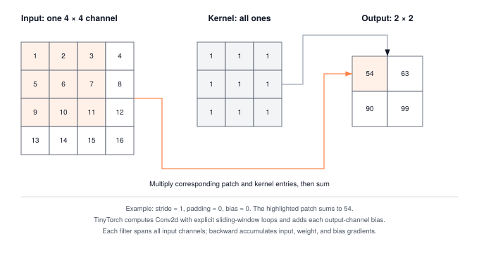

A convolution is a tiled matmul with structured data reuse. That reuse is what lets vision kernels hit near-peak FLOPS on hardware that would stall at fully-connected equivalents. The inductive bias of shared weights is the pedagogical story. The memory access pattern is the systems story.

:::{.callout-note title="Module Info"}

**ARCHITECTURE TIER** | Difficulty: ●●●○ | Time: 6-8 hours | Prerequisites: 01-08

**Prerequisites — Modules 01-08.** You should have:

- Built the complete training pipeline (Modules 01-08)
- Implemented DataLoader for batch processing (Module 05)
- Comfort with parameter initialization, forward/backward passes, and optimization

If you can train an MLP on TinyDigits using your training loop and DataLoader, you're ready.
:::



## Overview

You have just finished the foundations tier. You can train an MLP, run optimization, move batches through a working pipeline. Welcome to the **Architecture Tier**, where the question changes from *can the network learn?* to *what should the network's structure assume about the data?*

Convolution is the answer for images. A photograph has structure that a generic MLP throws away: neighboring pixels matter together, the same edge can appear anywhere in the frame, and shifting a cat one pixel to the left should not require relearning what a cat looks like. A convolutional layer bakes those assumptions in — locality, weight sharing, and translation equivariance — and that *structural prior* is the reason CNNs dominated computer vision for a decade.

In this module you implement `Conv2d`, `MaxPool2d`, and `AvgPool2d` as explicit nested loops. No vectorization tricks, no GPU kernel calls. The loops are the point: they expose where every multiply-accumulate goes and why a single forward pass on a $224{\times}224$ batch costs billions of operations. Once you have felt that cost in code, the optimizations real frameworks pile on top — im2col, Winograd, cuDNN — stop feeling like magic.

## Commands



## Learning objectives

:::{.callout-tip title="By completing this module, you will:"}

- **Implement** Conv2d with explicit 7-nested loops revealing O(B×C×H×W×K²×C_in) computational complexity
- **Master** spatial dimension calculations with stride, padding, and kernel size interactions
- **Understand** receptive fields, parameter sharing, and translation equivariance in CNNs
- **Analyze** memory vs computation trade-offs: pooling reduces spatial dimensions 4x while preserving features
- **Connect** your implementations to production CNN architectures like ResNet and VGG
:::

## What you'll build

::: {#fig-09_convolutions-diag-1 fig-env="figure" fig-pos="htb" fig-cap="**A concrete convolution.** A 4 by 4 input containing 1 through 16 is convolved with a 3 by 3 all-ones kernel, stride 1 and no padding, producing the 2 by 2 output 54, 63, 90, 99. The bias is zero here. TinyTorch computes Conv2d with explicit sliding-window loops, each filter spanning all input channels, and backward accumulates input, weight, and bias gradients." fig-alt="A 4 by 4 input containing 1 through 16 is convolved with a 3 by 3 all-ones kernel, stride 1 and no padding, producing the 2 by 2 output 54, 63, 90, 99."}



:::

**The pattern you'll enable:**
```python
# Building a CNN block
conv = Conv2d(3, 64, kernel_size=3, padding=1)
pool = MaxPool2d(kernel_size=2, stride=2)

x = Tensor(image_batch)  # (32, 3, 224, 224)
features = pool(ReLU()(conv(x)))  # (32, 64, 112, 112)
```

### What you're not building yet

To keep this module focused, you will **not** implement:

- Dilated convolutions (PyTorch supports this with `dilation` parameter)
- Grouped convolutions (that's for efficient architectures like MobileNet)
- Depthwise separable convolutions (advanced optimization technique)
- Transposed convolutions for upsampling (used in GANs and segmentation)
- Optimized implementations (cuDNN uses Winograd algorithm and FFT convolution)

**You are building the foundational spatial operations.** Advanced convolution variants and GPU optimizations come later.

## What you write



## How you know it works



## When it fails



`Expected: ... Got: [[[[5. 6.] [8. 9.]]]]`
:   From `test_unit_conv2d_convolve_loops`. Each window's sum was overwritten instead of accumulated. Use `conv_sum += input_val * weight_val` inside the kernel loops.

`ValueError: Conv2d expected 4D input (batch, channels, height, width), got 3D: (32, 8, 8)`
:   From calling the layer. A batch of grayscale images has no channel axis yet. Reshape to `(32, 1, 8, 8)`; the error message offers both this and the single-image reshape.

`ValueError: Conv2d expected 1 input channels, got 3`
:   From calling the layer. The input's channel axis does not match the `in_channels` the layer was built with. Check the layout is `(batch, channels, height, width)`.

## Finished? Read why



## What's next

:::{.callout-note title="Coming Up — Module 10: Tokenization"}

Convolution is the structural prior for grids of pixels. The next data type — text — is not a grid. It is a discrete sequence with no fixed alphabet, no fixed length, and no notion of intensity. Before any model can read English you have to answer a more basic question: how do you turn a string into numbers a network can multiply against? In Module 10 you implement BPE and BPE tokenizers and meet the first real architectural decision of the language stack: vocabulary.
:::

**How your spatial operations carry forward:**

@tbl-09-convolutions-downstream-usage traces how this module is reused by later parts of the curriculum.

| Module | What it does | Your spatial ops in action |
|--------|--------------|----------------------------|
| **Module 09 Capstone: SimpleCNN** | Complete CNN for image tasks | Stack your Conv2d, BatchNorm2d, and MaxPool2d for classification |
| **Module 17: Acceleration** | Optimize convolution | Replace loops with im2col and vectorized GEMM |
| **Vision Projects** | Object detection, segmentation | Your spatial foundations scale to advanced architectures |

: **How spatial ops feed into later milestone and optimization modules.** {#tbl-09-convolutions-downstream-usage}
