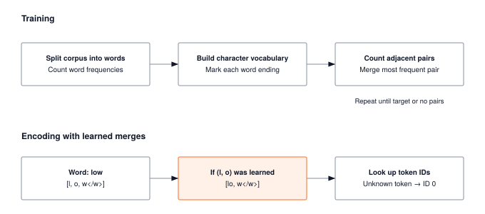

A language model never sees text. It sees token IDs. The vocabulary you pick upstream silently caps sequence length, embedding-table size, and every attention cost downstream. That single design choice is the first systems decision of the language stack.

:::{.callout-note title="Module Info"}

**ARCHITECTURE TIER** | Difficulty: ●●○○ | Time: 4-6 hours | Prerequisites: 01-08

You should have completed the Foundation tier:

- Tensor operations (Module 01)
- Basic neural network components (Modules 02-04)
- Training fundamentals (Modules 05-07)

Tokenization stands largely on its own — it works with strings and dictionaries, not gradients. If you can manipulate Python strings, you're ready.
:::



## Overview

Text isn't the input to a language model. *Tokens* are. Before a single matrix multiply happens inside GPT, every character of your prompt has already been chopped, merged, and looked up in a fixed vocabulary — and that one upstream choice silently decides how long your sequences are, how big your embedding table is, and how much an inference call costs.

In this module you build two tokenizers from scratch: a character-level tokenizer (one character, one token) and a Byte Pair Encoding (BPE) tokenizer that learns subword units from data. Doing both surfaces the central trade-off: small vocabularies yield long sequences and tiny embedding tables; large vocabularies yield short sequences but multi-megabyte embeddings. Attention cost scales quadratically with sequence length, so this trade is rarely close.

By the end you can explain why GPT uses ~50,000 tokens, how tokenizers degrade gracefully on unknown words, and how the vocabulary you pick today caps the throughput of every model you train tomorrow.

## Commands



## Learning objectives

:::{.callout-tip title="By completing this module, you will:"}

- **Implement** the pair-counting and pair-merging steps that drive BPE toward efficient subword representation, and read the supplied character-level tokenizer that trades that efficiency for robust text coverage
- **Understand** the vocabulary size versus sequence length trade-off and its impact on memory and computation
- **Master** encoding and decoding operations that convert between text and numerical token IDs
- **Connect** your implementation to production tokenizers used in GPT, BERT, and modern language models
:::

## What you'll build

::: {#fig-10_tokenization-diag-1 fig-env="figure" fig-pos="htb" fig-cap="**Learned BPE merges.** Training counts words, constructs a character vocabulary, and learns frequent adjacent-pair merges. Encoding applies those merges in order within each word and maps tokens to IDs. Token IDs depend on the trained vocabulary, whose alphabet comes from the corpus; this implementation uses characters with an unknown-token fallback." fig-alt="Training counts words, constructs a character vocabulary, and learns frequent adjacent-pair merges. Encoding applies those merges in order within each word and maps tokens to IDs."}



:::

**The pattern you'll enable:**
```python
# Converting text to numbers for neural networks
tokenizer = BPETokenizer(vocab_size=1000)
tokenizer.train(corpus)
token_ids = tokenizer.encode("Hello world")  # [142, 1847, 2341]
```

### What you're not building yet

To keep this module focused, you will **not** implement:

- GPU-accelerated tokenization (production tokenizers use Rust/C++)
- Advanced segmentation algorithms (SentencePiece, Unigram models)
- Language-specific preprocessing (Unicode normalization, byte-level fallback)
- Tokenizer serialization and loading (PyTorch handles this with `save_pretrained()`)

**You are building the conceptual foundation.** Production optimizations come later.

## What you write



## How you know it works



## When it fails



`Expected 4, got 2`
:   From `test_unit_count_byte_pairs`. Pairs were counted once per word. Each word occurs `freq` times in the corpus, so add `freq` for every pair.

`Expected ['he', 'l', 'l', 'o'+TOK_EOW], got ['he', 'e', 'l', 'l', 'o ']`
:   From `test_unit_merge_pair`. After a merge the scan advanced by one, so the second symbol of the pair was reused. Advance by two after merging.

`Expected 1, got 0`
:   From `test_unit_count_byte_pairs`. The last pair of each word was skipped. Adjacent pairs run over `range(len(tokens) - 1)`.

## Finished? Read why



## What's next

:::{.callout-note title="Up next: Module 11, Embeddings"}

You now have integer token IDs. Integers, however, are *opaque*: ID 142 and ID 143 are no more related than ID 142 and ID 9,001. The next module turns those IDs into **learnable dense vectors** so that "king" and "queen" can sit close together in space, and so that gradients can actually flow through your model. The vocabulary you fixed in this module sets the number of rows in that embedding table — and therefore the bulk of the parameters at the input of every transformer you'll build.
:::

**Next:** [Module 11: Embeddings](11_embeddings.qmd)

### How later modules use this one

| Module | What It Does | Your Tokenization In Action |
|--------|--------------|----------------------------|
| **11: Embeddings** | Learnable lookup tables | `embedding = Embedding(vocab_size=1000, dim=128)` |
| **12: Attention** | Sequence-to-sequence processing | Token sequences attend to each other |
| **13: Transformers** | Complete language models | Full pipeline: tokenize → embed → attend → predict |

: **How tokenization feeds into embeddings, attention, and transformers.** {#tbl-10-tokenization-downstream-usage}
