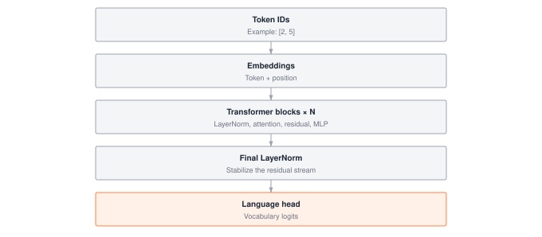

A transformer block's cost profile has two regimes that fight for the same HBM: attention at O(N²) memory in sequence length, and MLPs at O(N · d²) compute in hidden width. Stack twelve blocks and the attention matrices alone can exceed the weight matrices once N crosses a few thousand tokens, which is why every production LLM ships with KV caching, activation checkpointing, and attention kernels tuned for the SRAM hierarchy. This module wires LayerNorm, MLPs, and causal self-attention into a working GPT so you can see exactly which components hit which wall first.

:::{.callout-note title="Module Info"}

**ARCHITECTURE TIER** | Difficulty: ●●●● | Time: 8-10 hours | Prerequisites: 01-08, 10-12

You need tensors, layers, training loops, tokenization, embeddings, and attention already in place. If you can explain how multi-head attention turns queries, keys, and values into a weighted representation, you are ready for this chapter.
:::



## Overview

This is the module where everything snaps together. You have tensors, autograd, layers, a training loop, embeddings, and attention. In this module you wire them into a transformer block, stack the blocks, and end up with a working GPT — the same architecture that powers GPT, Claude, and LLaMA. By the end you can run `model.generate(prompt)` on something you wrote yourself.

A transformer block is a small recipe: layer-normalize, run multi-head attention, add a residual; layer-normalize, run an MLP, add a residual. That is it. Stack twelve of those between an embedding table and a language head, train on next-token prediction, and you have a 60M-parameter language model that produces coherent text.

The patterns you implement here — pre-norm, residual streams, causal masking, 4$\times$ MLPs — are exactly what runs in production at billion-token scale. The optimizations differ; the architecture does not.

## Commands



## Learning objectives

:::{.callout-tip title="By completing this module, you will:"}

- **Implement** layer normalization to stabilize training across deep networks with learnable scale and shift parameters
- **Design** complete transformer blocks combining self-attention, feed-forward networks, and residual connections using pre-norm architecture
- **Build** a full GPT model with token embeddings, positional encoding, stacked transformer blocks, and autoregressive generation
- **Analyze** parameter scaling and memory requirements, understanding why attention memory grows quadratically with sequence length
- **Master** causal masking to enable autoregressive generation while preventing information leakage from future tokens
:::

## What you'll build

@fig-gpt-architecture shows the full GPT stack you will assemble, from token IDs at the top down to vocabulary logits at the language head.

::: {#fig-gpt-architecture}
{fig-alt="GPT forward path from token IDs through token and learned position embeddings, repeated pre-LN transformer blocks, final LayerNorm, and a separate linear language head producing vocabulary logits."}

**The GPT forward path.** Token IDs become embeddings, pass through N pre-LN transformer blocks, and reach the language head as vocabulary logits. Causal attention inside each block permits a position to attend only to its own prefix.
:::

**The pattern you'll enable:**
```python
# Building and using a complete language model
model = GPT(vocab_size=50000, embed_dim=768, num_layers=12, num_heads=12)
logits = model.forward(tokens)  # Process input sequence
generated = model.generate(prompt, max_new_tokens=50)  # Generate text
```

### What you're not building yet

To keep this module focused, you will **not** implement:

- KV caching for efficient generation (production systems cache keys/values to avoid recomputation)
- FlashAttention or other memory-efficient attention (PyTorch uses specialized CUDA kernels)
- Mixture of Experts or sparse transformers (advanced scaling techniques)
- Multi-query or grouped-query attention (used in modern LLMs for efficiency)

**You are building the canonical transformer architecture.** Optimizations come later.

## What you write



## How you know it works



## When it fails



`Mean should be ~0, got -0.9999988079071045`
:   From `test_unit_layer_norm`. The statistics were taken over the batch axis. Layer normalization averages over the features, `axis=-1`, with `keepdims=True`.

`Std should be ~1, got 1.1180284023284912`
:   From `test_unit_layer_norm`. The spread was measured with absolute deviations. Variance is the mean of the squared deviations; divide by `np.sqrt(variance + eps)`.

## Finished? Read why



## What's next

You finished the Architecture Tier. You have a transformer that trains, generates text, and matches the structural blueprint of GPT. Everything from here is about making it *fast, small, and deployable*.

Before that, two milestones take the Architecture Tier on a historical test drive. The **Architecture Milestones** — a LeNet-style CNN on TinyDigits, with optional CIFAR-10 scale-up, and the 2017 Transformer attention test — run your `Conv2d`, `MaxPool2d`, multi-head attention, and `TransformerBlock` on problems those architectures were built to solve. Convolutional networks exploit spatial structure; attention clears sequence-reversal tasks RNNs can't. Both are proof that the layers you just wrote behave the way the original papers claimed.

:::{.callout-note title="Coming Up: Architecture Milestones, then Module 14 — Profiling"}

First: two Architecture Milestones exercise your Conv/Pool layers (TinyDigits, with optional CIFAR-10 scale-up) and your attention stack (sequence tasks) on their landmark problems. Then the Optimization Tier opens with the only honest place to start: measurement. Before you optimize anything, you need to know *where the time goes*. In Module 14 you instrument your transformer's forward pass and answer concrete questions — how much of a step is spent in attention versus the MLP, how memory grows with sequence length on your machine, and which layer is the actual bottleneck. Every optimization in the chapters that follow (quantization, kernel fusion, KV caching) targets a number you measured in Module 14.
:::

**Where your transformer goes from here:**

@tbl-13-transformers-downstream-usage traces how this module is reused by later parts of the curriculum.

| Module | What It Does | Your Transformer In Action |
|--------|--------------|---------------------------|
| **14: Profiling** | Measure performance bottlenecks | `profiler.analyze(model.forward(x))` reveals where time and memory go |
| **15: Quantization** | Reduce precision to 8-bit / 4-bit | Shrink the 90M model to a fraction of its size with minimal accuracy loss |
| **20: Capstone** | Production deployment | Serve your transformer end-to-end with the systems you built |

: **How transformers feed into profiling, quantization, and capstone modules.** {#tbl-13-transformers-downstream-usage}
