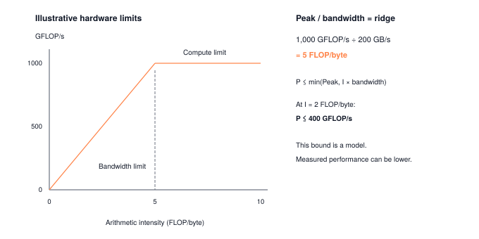

You cannot optimize what you have not measured. Profiling is the systems skill that turns "I think this is slow" into "this layer spends 62% of its time waiting on HBM reads at 5% of peak GFLOP/s." Before you reach for quantization, kernel fusion, or KV caching, you need numbers: parameter count, FLOPs per forward pass, peak activation memory, median latency, and an arithmetic-intensity reading on the roofline. This module builds those instruments end-to-end so every subsequent optimization module has ground truth to point at.

:::{.callout-note title="Module Info"}

**OPTIMIZATION TIER** | Difficulty: ●●○○ | Time: 3-5 hours | Prerequisites: 01-13

**Prerequisites: Modules 01-13** means you should have:

- Built the complete ML stack (Modules 01-08)
- Implemented CNN architectures (Module 09) or Transformers (Modules 10-13)
- Models to profile and optimize

**Why these prerequisites**: You'll profile models built in Modules 01-13. Understanding the implementations helps you interpret profiling results — for example, why attention is memory-bound.
:::



## Overview

You have built a working ML framework. Now you have to make it fast. The Optimization Tier starts here, and it starts with a rule that almost every engineer breaks at least once: **measure before you optimize**. Guess at the bottleneck and you will spend a week speeding up code that was never on the critical path.

This module gives you the instruments. You'll build a profiler that counts parameters, estimates FLOPs, tracks memory, and measures latency with enough statistical rigor that the numbers actually mean something. By the end you can answer the questions every optimization decision rests on: Is this model compute-bound or memory-bound? Which layer dominates? Where will quantization or caching pay off — and where will it waste your time?

Every later module in this tier — quantization, compression, acceleration, KV-caching — depends on the data this profiler produces. Build the instrument first. Then optimize.

## Commands



## Learning objectives

:::{.callout-tip title="By completing this module, you will:"}

- **Implement** a comprehensive Profiler class that measures parameters, FLOPs, memory, and latency
- **Analyze** performance characteristics to identify compute-bound vs memory-bound workloads
- **Master** statistical measurement techniques with warmup runs and outlier handling
- **Connect** profiling insights to optimization opportunities in quantization, compression, and caching
:::

## What you'll build

::: {#fig-14_profiling-diag-1 fig-env="figure" fig-pos="htb" fig-cap="**An illustrative roofline bound.** A peak of 1000 GFLOP/s and bandwidth of 200 GB/s give a ridge at 5 FLOP per byte. At intensity 2, attainable performance is bounded by 400 GFLOP/s; measurements may be lower." fig-alt="A peak of 1000 GFLOP/s and bandwidth of 200 GB/s give a ridge at 5 FLOP per byte. At intensity 2, attainable performance is bounded by 400 GFLOP/s; measurements may be lower."}



:::

**The pattern you'll enable:**
```python
# Comprehensive model analysis for optimization decisions
profiler = Profiler()
profile = profiler.profile_forward_pass(model, input_data)
print(f"Bottleneck: {profile['bottleneck']}")  # "memory" or "compute"
```

### What you're not building yet

To keep this module focused, you will **not** implement:

- GPU profiling (we measure CPU performance with NumPy)
- Distributed profiling (that's for multi-GPU setups)
- CUDA kernel profilers (PyTorch uses `torch.profiler` for GPU analysis)
- Layer-by-layer visualization dashboards (TensorBoard provides this)

**You are building the measurement foundation.** Visualization and GPU profiling come with production frameworks.

## What you write



## How you know it works



## When it fails



`Expected 16384, got 8192`
:   From `test_unit_count_linear_flops`. Each multiply-accumulate counts as two floating-point operations. Multiply by 2.

`High bandwidth should be memory-bound`
:   From `test_unit_analyze_bottleneck`. The comparison is inverted. The heuristic labels a workload memory-bound when `memory_bandwidth_mbs > gflops_per_second * 100`.

## Finished? Read why



## What's next

You now have the instrument. Module 15 picks up the first real optimization it enables: **quantization**.

:::{.callout-note title="Up next: Module 15, Quantization"}

You'll cut FP32 weights down to INT8 — a 4$\times$ memory reduction — and use this profiler to answer the question that decides whether quantization is worth applying: *which layers tolerate reduced precision, and which ones break?* Profile first, quantize second, profile again to verify. You're about to see why this loop is the foundation of every production deployment.
:::

**Next:** [Module 15: Quantization](15_quantization.qmd)

### How later modules use this one

| Module | What It Does | Your Profiler In Action |
|--------|--------------|------------------------|
| **15: Quantization** | Reduce precision to INT8 | `profile_layer()` identifies quantization candidates |
| **16: Compression** | Prune and compress weights | `count_parameters()` measures the compression ratio |
| **17: Acceleration** | Vectorize computations | `measure_latency()` validates the speedup |
| **19: Benchmarking** | Compare across systems | `profile_forward_pass()` produces the comparable numbers |

: **How the profiler feeds into optimization-tier modules.** {#tbl-14-profiling-downstream-usage}
