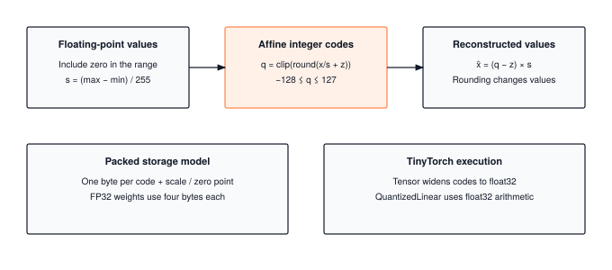

Quantization maps floating-point values onto a limited set of integer codes. Packed INT8 storage uses one byte per code instead of four for FP32. TinyTorch simulates these codes in float32 Tensor arrays and performs float32 arithmetic; the storage sizes it reports describe the packed representation, not the NumPy arrays actually allocated.

:::{.callout-note title="Module Info"}

**OPTIMIZATION TIER** | Difficulty: ●●●○ | Time: 4-6 hours | Prerequisites: 01-14

**Prerequisites: Modules 01-14** means you should have:

- Built the complete foundation (Tensor through Training)
- Implemented profiling tools to measure memory usage
- Understanding of neural network parameters and forward passes
- Familiarity with memory calculations and optimization trade-offs

If you can profile a model's memory usage and explain the cost of FP32 storage, you're ready.
:::



## Overview

Packed INT8 weights can reduce weight storage relative to FP32, with an accuracy trade-off that must be measured. In this module you build quantize/dequantize functions, calibration, `QuantizedLinear`, and model conversion. Codes remain in float32 arrays, so the implementation teaches quantization without promising a smaller checkpoint or faster integer execution.

The math you implement is the same math TensorFlow Lite, PyTorch Mobile, and ONNX Runtime use to fit models on phones, IoT boards, and edge hardware without ever touching the cloud.

## Commands



## Learning objectives

:::{.callout-tip title="By completing this module, you will:"}

- **Implement** asymmetric INT8 quantization: scale, zero-point, and the quantize/dequantize round trip, distinguishing modeled packed bytes from actual storage.
- **Build** calibration that fits scale and zero-point to a real activation distribution from sample inputs.
- **Reason** about quantization error: where it comes from, how it bounds (±scale/2), and why neural networks tolerate it.
- **Connect** your implementation to TensorFlow Lite, PyTorch Mobile, and ONNX Runtime — same math, different kernels.
- **Quantify** the memory–accuracy trade-off across model sizes and quantization choices.
:::

## What you'll build

::: {#fig-15_quantization-diag-1 fig-env="figure" fig-pos="htb" fig-cap="**Integer codes and execution storage.** Floating-point values map to affine integer codes and reconstruct through scale and zero point. Packed storage models one byte per code, but TinyTorch Tensor stores codes as float32 and QuantizedLinear uses float32 arithmetic." fig-alt="Floating-point values map to affine integer codes and reconstruct through scale and zero point. Packed storage models one byte per code, but TinyTorch Tensor stores codes as float32 and QuantizedLinear uses float32 arithmetic."}



:::

**The pattern you'll enable:**
```python
# Simulate quantization and model packed storage
quantize_model(model, calibration_data=sample_inputs)
# Dense arrays remain float32; measure output error and accuracy
```

### What you're not building yet

To keep this module focused, you will **not** implement:

- Per-channel quantization (PyTorch supports this for finer-grained precision)
- Mixed precision strategies (keeping sensitive layers in FP16/FP32)
- Quantization-aware training
- INT8 GEMM kernels (production uses hardware instructions like AVX-512 VNNI)

**You are building per-tensor asymmetric INT8 quantization.** Packed serialization and integer kernels require additional implementations.

## What you write



## How you know it works



## When it fails



`Quantization error 0.166667 exceeds the INT8 bound scale/2 = 0.009804`
:   From `test_unit_quantize_int8`. The range was taken from the data alone. Extend it to include 0.0 before computing the scale, so the zero point fits in the int8 range instead of being clipped.

`ZeroDivisionError: float division by zero`
:   From `test_unit_quantize_int8`. A constant tensor has no range, so the scale is zero. Handle `max == min` separately before dividing.

`Round-trip error too high: 0.38699349761009216`
:   From `test_unit_dequantize_int8`. A zero-point sign is flipped. Quantize with `x / S + Z` and dequantize with `(q - Z) * S`.

## Finished? Read why



## What's next

You have mapped weights onto a quantization grid. Module 16 changes which weights are active. Its pruning functions zero individual weights or whole channels while preserving dense shapes. Sparse storage or structural compaction is needed before zeros translate into smaller allocations or fewer dense operations.

**How quantization composes with what comes next:**

@tbl-15-quantization-downstream-usage traces how this module is reused by later parts of the curriculum.

| Module | What it adds | The stack so far |
|--------|--------------|------------------|
| **16: Compression** | Pruning removes redundant weights | Compare rounded and masked candidates independently |
| **17: Acceleration** | Compare dense execution strategies | Benchmark vectorized and tiled matrix multiplication |
| **20: Capstone** | Deploy the full optimized pipeline | prune → quantize → accelerate → deploy |

: **How quantization stacks with compression, acceleration, and capstone modules.** {#tbl-15-quantization-downstream-usage}
