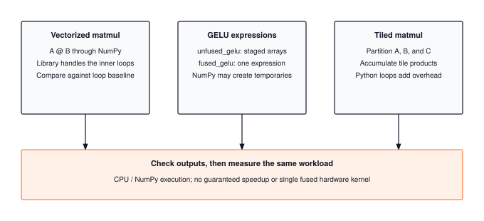

A Python matrix multiplication can spend much of its runtime interpreting loops. This module compares BLAS-backed multiplication with explicit tiling, compares two NumPy GELU implementations, and rewrites Module 09's convolution loops as one matrix multiply. These experiments expose execution overhead and memory reuse, while production kernel fusion provides a comparison beyond the NumPy implementation.

:::{.callout-note title="Module Info"}

**OPTIMIZATION TIER** | Difficulty: ●●●○ | Time: 5-7 hours | Prerequisites: 01-14

**Prerequisites: Modules 01-14** means you need:

- Tensor operations (Module 01) for understanding data structures
- Neural network layers (Module 03) for knowing what to accelerate
- The `Conv2d` layer (Module 09), which your im2col convolution must match
- Training loops (Module 08) for understanding the performance context
- Profiling tools (Module 14) for measuring acceleration gains

If you can multiply matrices and understand why matrix multiplication is expensive, you're ready.
:::



## Overview

Matrix multiplication and element-wise activations stress different parts of a processor. Matrix multiplication can reuse each input many times; activations often do little arithmetic per array element.

You will implement vectorized and tiled multiplication, then compare grouped and staged GELU expressions. NumPy still creates intermediate arrays in the grouped expression. Last, you will lower a convolution to a single matrix multiply with im2col, write its backward pass with col2im so it can train, and measure what that costs in memory. Measure each implementation on your hardware; this module does not guarantee a particular speedup.

## Commands



## Learning objectives

:::{.callout-tip title="By completing this module, you will:"}

- **Implement** vectorized matrix multiplication using optimized BLAS libraries for maximum throughput
- **Distinguish** grouped NumPy expressions from native kernel fusion that can avoid intermediate arrays
- **Lower** a convolution to one matrix multiply with im2col, write its backward pass with col2im, and measure its speed against Module 09's loops and its memory cost
- **Understand** the roofline model and arithmetic intensity to predict performance bottlenecks
- **Analyze** production acceleration strategies for different deployment scenarios (edge, cloud, GPU)
:::

## What you'll build

::: {#fig-17_acceleration-diag-1 fig-env="figure" fig-pos="htb" fig-cap="**NumPy acceleration experiments.** Compare a BLAS-backed matrix multiply, explicit tiled multiplication, and staged or grouped GELU expressions. Check numerical agreement before timing; NumPy expressions can allocate temporaries and do not guarantee a single fused kernel." fig-alt="Compare a BLAS-backed matrix multiply, explicit tiled multiplication, and staged or grouped GELU expressions. Check numerical agreement before timing; NumPy expressions can allocate temporaries and do not guarantee a single fused kernel."}



:::

**The pattern you'll enable:**
```python
# Fast matrix operations using BLAS
output = vectorized_matmul(x, weights)  # Compare against Python loops

# Grouped activation expression
activated = fused_gelu(output)  # NumPy still creates temporary arrays

# Convolution as one matrix multiply
features = im2col_conv2d(images, conv.weight, conv.bias, padding=1)  # same output as conv(images)

# ...and one you can train through
out = Im2colConv2dFunction.apply(images, conv.weight, conv.bias, stride=1, padding=1)
loss.backward()  # gradients match Conv2d's, via two matmuls and col2im
```

### What you're not building yet

To keep this module focused, you will **not** implement:

- GPU kernels (that requires CUDA programming, covered in production frameworks)
- Custom CPU assembly (BLAS libraries already provide this)
- Automatic kernel fusion (compilers like XLA do this automatically)
- Multi-threading control (NumPy handles this via OpenBLAS/MKL)

**You are building the understanding.** Hardware-specific implementations come later.

## What you write



## How you know it works



## When it fails



`Tiled and vectorized results should match`
:   From `test_unit_tiled_matmul`. Each tile product overwrote the output block. Accumulate across the `k` tiles: `C[i0:i1, j0:j1] += A_tile @ B_tile`.

`Columns must be ordered (channel, kernel row, kernel column)`
:   From `test_unit_im2col`. Your patches hold the right numbers in the wrong order, usually because the channel axis ended up last. Transpose the `(N, C, k, k, out_h, out_w)` array with `(0, 4, 5, 1, 2, 3)` so each row is flattened in the same order as `weight.reshape(out_ch, -1)`.

`Differs from Conv2d by up to ...`
:   From `test_unit_im2col_conv2d`. The shapes worked out but the values did not. Check that the flattened weight is transposed to `(C·k·k, out_ch)` before the multiply, and that the result is reshaped to `(N, out_h, out_w, out_ch)` and then transposed to put the channels second.

`Overlapping patches must add up`
:   From `test_unit_col2im`. Your col2im assigns each patch gradient with `=` instead of adding it with `+=`, so a pixel covered by several patches keeps only the last one's gradient.

`weight gradient differs from Conv2d by up to ...`
:   From `test_unit_im2col_conv2d_function`. `self.cols.T @ G` has shape `(C·k·k, out_ch)`; transpose it before reshaping to `(out_ch, C, k, k)`. If the input gradient is the one that differs, check that `grad_output` was moved to `(N, out_h, out_w, out_ch)` before flattening.

## Finished? Read why



## What's next

You have compared implementations of the same operations. Next, reuse results to avoid repeated computation.

:::{.callout-note title="Up next: Module 18, Memoization"}

Acceleration shrinks the cost of every call. **Memoization eliminates the call.** Module 18 builds KV-caching for transformer generation, caches repeated forward passes, and reuses attention patterns so the model never recomputes what it already knows. The two techniques compose: a fused kernel that gets called zero times is the cheapest kernel of all.
:::

**Next:** [Module 18: Memoization](18_memoization.qmd)

### How later modules use this one

| Module | What It Does | Your Acceleration In Action |
|--------|--------------|---------------------------|
| **18: Memoization** | Cache repeated computations | Vectorized operations complement KV reuse |
| **19: Benchmarking** | Systematic performance measurement | `benchmark(vectorized_matmul, sizes=[128, 256, 512])` |
| **20: Capstone** | Complete optimized model | Acceleration throughout model pipeline |

: **How acceleration composes with memoization, benchmarking, and capstone.** {#tbl-17-acceleration-downstream-usage}
