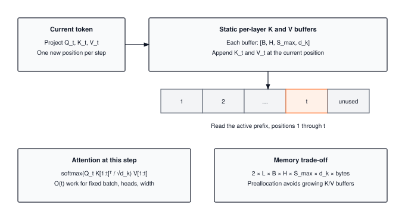

Autoregressive inference recomputes the same attention keys and values for every new token, billions of times across a production fleet. The KV cache is the memoization trick that turns that O(N^2) redundancy into O(N) by trading GPU HBM for saved compute. This module builds the cache, and the fragmentation problem at long context that makes production systems reach for PagedAttention.

:::{.callout-note title="Module Info"}

**OPTIMIZATION TIER** | Difficulty: ●●○○ | Time: 3-5 hours | Prerequisites: 01-14

**Prerequisites: Modules 01-14** means you should be comfortable with:

- Tensor operations, matrix multiplication, and shape manipulation (Module 01)
- Transformer architectures and attention (Modules 12-13)
- Profiling tools (Module 14) to measure speedup

If you understand how transformers compute attention and why it's expensive, you're ready to learn how to make inference dramatically faster.
:::



## Overview

When ChatGPT writes a 100-word response, the naive transformer would recompute the keys and values for every previous token at every step, doing 5,050 K,V projections to produce 100 tokens. Almost all of that work is duplicate. Memoize it once and the cost collapses to 100.

KV caching stores the key and value matrices from past tokens so each new token only computes its own. Across n token positions, this reduces K,V projection work from O(n²) to O(n). Attention still reads the growing history: its work per new token is O(n), and total attention work remains O(n²). End-to-end speedup depends on the workload and implementation.

In this module you build that cache. By the end you will have a `KVCache` class with O(1) updates, a non-invasive hook that retrofits caching onto an existing transformer, and a quantitative grasp of the memory-versus-compute trade you just bought.

## Commands



## Learning objectives

:::{.callout-tip title="By completing this module, you will:"}

- **Implement** the KVCache update and lookup methods that give the cache its O(1) append and its efficient memory reuse
- **Measure** the memory-compute trade-off: accepting O(n) cache storage to reduce K,V projection work from O(n²) to O(n)
- **Understand** why attention still reads a growing history after K,V projections are cached
- **Connect** your implementation to production systems like ChatGPT and Claude that rely on KV caching
:::

## What you'll build

::: {#fig-18_memoization-diag-1 fig-env="figure" fig-pos="htb" fig-cap="**Reuse projections, attend over the prefix.** One token appends K and V to preallocated per-layer buffers. Its query attends over positions 1 through t, so attention work grows with the active prefix. Cache capacity reserves storage for both K and V." fig-alt="One token appends K and V to preallocated per-layer buffers. Its query attends over positions 1 through t, so attention work grows with the active prefix. Cache capacity reserves storage for both K and V."}



:::

**The pattern you'll enable:**
```python
from tinytorch.perf.memoization import enable_kv_cache, _cached_generate

cache = enable_kv_cache(model)
# The teaching helper resets the cache and opens its generation context.
output = _cached_generate(model, prompt_tokens, max_new_tokens=100,
                          temperature=0.0, cache=cache)
```

### What you're not building yet

To keep this module focused, you will **not** implement:

- Multi-batch cache management (production systems handle thousands of concurrent sequences)
- Cache eviction strategies (handling sequences longer than max_seq_len)
- GPU memory optimization (production uses memory pools and paging)
- Speculative decoding (advanced technique that builds on KV caching)

**You are building the core memoization mechanism.** Advanced cache management comes in production deployment.

## What you write



## How you know it works



## When it fails



`Before advance, cache should be empty`
:   From `test_unit_kvcache`. `get` returned the whole preallocated buffer. Slice it to the filled positions, `[:, :, :seq_pos, :]`.

`Cached output at position 1 differs from uncached causal attention`
:   From `test_unit_cached_attention`. `update` wrote every token to the same slot. Write at the current position, `[:, :, seq_pos:seq_pos + 1, :]`.

## Finished? Read why



## What's next

You have eliminated repeated K,V projections. Measuring total generation time will establish whether those savings outweigh cache overhead. To put a real number on what you just built — and to compare it against the other optimizations in this tier — you need disciplined measurement.

:::{.callout-note title="Up next: Module 19, Benchmarking"}

Module 19 builds the measurement infrastructure that lets you say "this optimization gave us 12.4x speedup with 95% confidence" instead of "it seems faster". You'll implement statistical timing, warm-up handling, and Pareto-frontier analysis — the same tools production teams use to validate every optimization in this book, including the KV cache you just wrote.
:::

**Next:** [Module 19: Benchmarking](19_benchmarking.qmd)

### How later modules use this one

| Module | What It Does | Works with Memoization |
|--------|--------------|------------------------|
| **15: Quantization** | Reduce precision to save memory | Lower-precision caches are an extension; this cache stores float32 |
| **17: Acceleration** | Optimize computation kernels | Compare kernel improvements with saved projection work |
| **19: Benchmarking** | Measure end-to-end performance | `Profile cache hit rates and speedup gains` |

: **How memoization stacks with quantization, acceleration, and benchmarking.** {#tbl-18-memoization-downstream-usage}
