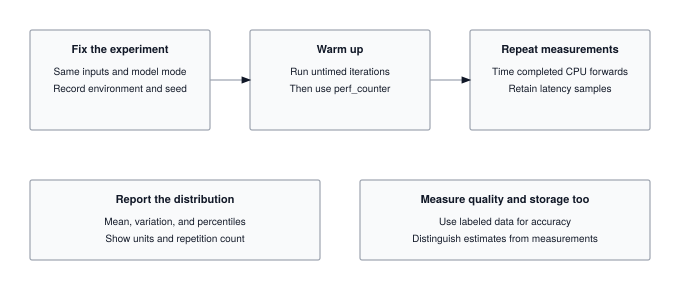

A benchmark is not a number; it is a claim about throughput, latency, and hardware utilization under a specific workload. This module builds the measurement discipline that separates "my model is 2x faster" from "my model is 2x faster on batch=1, input-length=128, FP16, on an A100, with warmup discarded and 95% confidence intervals reported." Every performance claim in an ML paper or an MLPerf submission lives or dies in the harness you write here.

:::{.callout-note title="Module Info"}

**OPTIMIZATION TIER** | Difficulty: ●●●○ | Time: 5-7 hours | Prerequisites: 01-18

This module assumes familiarity with the complete TinyTorch stack (Modules 01-13), profiling (Module 14), and optimization techniques (Modules 15-18). You should understand how to build, profile, and optimize models before tackling systematic benchmarking and statistical comparison of optimizations.
:::



## Overview

"My model is 3x faster!" Faster than what? Measured how? At what input size, on what hardware, after how many warmup runs? Most "speedup" claims dissolve under those four questions — and yours will too if you don't measure with care.

Modules 14-18 gave you optimizations. This module gives you the one tool that tells you which of them actually worked: a benchmarking harness that controls for noise, runs proper warmup, and produces confidence intervals you can defend. It is the same statistical machinery MLPerf uses, written in a few hundred lines you build yourself.

By the end, you will have the evaluation framework that drives the Torch Olympics capstone — and the discipline to never publish a number you cannot justify.

## Commands



## Learning objectives

:::{.callout-tip title="By completing this module, you will:"}

- **Implement** a benchmarking harness with confidence intervals, warmup protocols, and variance control
- **Quantify** trade-offs between accuracy, latency, and memory using Pareto frontiers
- **Diagnose** measurement noise — coefficient of variation, outliers, cold-start effects — before reporting numbers
- **Connect** optimizations from Modules 14-18 into a single comparison workflow for the Torch Olympics capstone
:::

## What you'll build

::: {#fig-19_benchmarking-diag-1 fig-env="figure" fig-pos="htb" fig-cap="**A repeatable benchmark.** Fix inputs, model mode, and environment; warm up, retain repeated latency samples, and report their distribution. Measure quality and storage with clearly labeled assumptions." fig-alt="Fix inputs, model mode, and environment; warm up, retain repeated latency samples, and report their distribution. Measure quality and storage with clearly labeled assumptions."}



:::

**The pattern you'll enable:**

```python
# Compare baseline vs optimized model with statistical rigor
benchmark = Benchmark([baseline_model, optimized_model], datasets=[test_dataset])
latency_results = benchmark.run_latency_benchmark()
# Output: baseline: 12.3ms ± 0.8ms, optimized: 4.1ms ± 0.3ms (67% reduction, p < 0.01)
```

### What you're not building yet

To keep this module focused, you will **not** implement:

- Hardware-specific benchmarks (GPU profiling requires CUDA, covered in production frameworks)
- Energy measurement (requires specialized hardware like power meters)
- Distributed benchmarking (multi-node coordination is beyond scope)
- Automated hyperparameter tuning for optimization (that is Module 20: Capstone)

**You are building the statistical foundation for fair comparison.** The hardware-specific extensions are mechanical once the methodology is right.

## What you write



## How you know it works



## When it fails



`Expected ~0.01s, got 0.0s`
:   From `test_unit_precise_timer`. The timer never recorded the elapsed time. Set `timer.elapsed = time.perf_counter() - timer.start_time` in a `finally` block after the `yield`, so it runs when the `with` block exits.

## Finished? Read why



## What's next

You now have a tool that separates real speedups from noise. Before the Capstone, the next chapter puts the whole Optimization Tier through a historical end-to-end run. The **Optimization Milestone** — MLPerf (2018) — chains your Profiler (Module 14), Quantization (15), Compression (16), Acceleration (17), and KV-Cache (18) into a single measure → optimize → validate loop, the same discipline MLPerf forced onto an industry that previously measured whatever made its hardware look fastest. You measure what your compression and caching actually bought, on your own framework, with every number traceable to code you wrote.

After that, Module 20 — the **Capstone: Torch Olympics** — is where the benchmarking harness earns its keep. You will combine the optimizations from Modules 14-18 (quantization, pruning, fusion, caching), submit results to a public leaderboard, and defend every number against the same statistical scrutiny you just built.

The capstone has no "easy" mode. Every entry is judged by the harness from this chapter — overlapping confidence intervals are not a win, and a faster mean without proper warmup is a disqualification. The discipline you practiced here is the price of admission.

:::{.callout-note title="Up next: Milestone 06 (MLPerf), then Module 20, Torch Olympics"}

First: the MLPerf milestone runs your Profiler → Quantization → Pruning → KV-Cache pipeline on real models, the same measure-optimize-validate loop production teams use. Then Module 20 combines everything from Modules 01-19 to compete in the Torch Olympics: stack optimizations, benchmark them honestly, and chase the fastest, smallest, or most accurate model on the leaderboard.
:::

**Next:** [Milestone 06: MLPerf](../milestones/06_mlperf.qmd), then [Module 20: Torch Olympics](20_capstone.qmd)

### How later modules use this one

| Competition Event | Metric Optimized | Your Benchmark In Action |
|-------------------|------------------|--------------------------|
| **Latency Sprint** | Minimize inference time | `benchmark.run_latency_benchmark()` determines winners |
| **Memory Challenge** | Minimize model size | `benchmark.run_memory_benchmark()` tracks footprint |
| **Accuracy Contest** | Maximize accuracy under constraints | `benchmark.run_accuracy_benchmark()` validates quality |
| **All-Around** | Balanced Pareto frontier | `suite.plot_pareto_frontier()` finds optimal trade-offs |

: **How benchmarking powers each capstone competition event.** {#tbl-19-benchmarking-downstream-usage}
