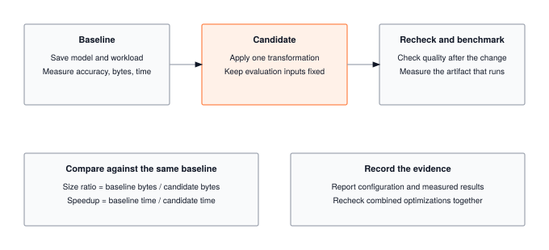

---
aliases:
  - ../tiers/olympics.html
title: "Module 20: Torch Olympics (Capstone)"
module: 20_capstone
notebook: capstone
---

The framework you wrote now has to run end-to-end, on one model, with every optimization stacked and every number defended. The capstone is where profiling, quantization, compression, acceleration, memoization, and benchmarking land on a single inference pipeline and produce an MLPerf-style `results.json` with platform metadata, warmup-controlled latencies, and schema-validated confidence intervals. Optimizations interact at runtime; this is where you measure whether they actually compound on silicon.

:::{.callout-note title="Module Info"}

**CAPSTONE** | Difficulty: ●●●● | Time: 6-8 hours | Prerequisites: All modules (01-19)

This capstone assumes you've built a complete framework end-to-end:

- Core framework (Modules 01-13) — **required**
- Optimization techniques (Modules 14-18) — **recommended**
- Benchmarking methodology (Module 19) — **required**

Parts 1-4 run on Modules 01-13 + 19 alone. Part 4b layers in Modules 14-18 to drive the full baseline-to-optimized workflow; without them, the pipeline degrades to baseline benchmarking only.
:::



## Overview

Nineteen modules in, you have a working ML framework. Tensors, autograd, transformers, quantization, pruning, profiling — every line written by you. The Olympics is where you put it on the scale.

In production ML, an unmeasured claim is no claim at all. This capstone gives your framework the same treatment MLPerf and Papers with Code give a real submission: a baseline measurement, an optimization pass, an apples-to-apples comparison, and a schema-validated artifact someone else can verify. You'll write the benchmarking harness, run it against your own code, and ship a `results.json` that stands on its own.

When you finish, you won't just have a framework. You'll have evidence.

## Commands



## Learning objectives

:::{.callout-tip title="By completing this module, you will:"}

- **Implement** the two-layer MLP that the supplied benchmarking infrastructure measures for accuracy, latency, throughput, and memory
- **Master** the three pillars of reliable benchmarking: repeatability, comparability, and completeness
- **Understand** performance measurement traps (variance, cold starts, batch effects) and how to avoid them
- **Connect** your TinyTorch implementation to production ML workflows (experiment tracking, A/B testing, regression detection)
- **Generate** schema-validated JSON submissions that enable reproducible comparisons and community sharing
:::

## What you'll build

::: {#fig-20_capstone-diag-1 fig-env="figure" fig-pos="htb" fig-cap="**Compare a candidate with its baseline.** Save the baseline and workload, apply one transformation, and recheck quality and runtime on the same inputs. Record measured size and speed ratios, and evaluate combined transformations together." fig-alt="Save the baseline and workload, apply one transformation, and recheck quality and runtime on the same inputs. Record measured size and speed ratios, and evaluate combined transformations together."}



:::

**The pattern you'll enable:**
```python
# Professional ML workflow
report = BenchmarkReport(model_name="my_model")
report.benchmark_model(model, X_test, y_test, num_runs=100)

submission = generate_submission(
    baseline_report=baseline_report,
    optimized_report=optimized_report,
    techniques_applied=["quantization", "pruning"]
)
save_submission(submission, "results.json")
```

### What you're not building yet

Out of scope for this capstone:

- CI/CD pipelines that benchmark on every commit
- Multi-hardware comparison across CPU/GPU/TPU
- Plotting dashboards for accuracy-vs-latency curves
- Leaderboard aggregation across community submissions

You are building the measurement and reporting foundation everything else stands on. Automation and visualization layer on top — but only if the numbers underneath are trustworthy.

## What you write



## The Torch Olympics

Module 20 is also the course's competition. You take your framework, benchmark a baseline and an optimized candidate on the same inputs, and enter the results in five classroom events.

### The Five Classroom Events

Module 20 defines these event names and eligibility checks in `OlympicEvent` and `qualifies_event()`:

| Event | Identifier | Eligibility |
|:---|:---|:---|
| **Latency Sprint** | `LATENCY_SPRINT` | Accuracy at least 85% |
| **Memory Challenge** | `MEMORY_CHALLENGE` | Accuracy at least 85% |
| **Accuracy Contest** | `ACCURACY_CONTEST` | Median latency below 100 ms and reported model size below 10 MiB |
| **All-Around** | `ALL_AROUND` | Valid measurements; compare accuracy, latency, and storage separately |
| **Extreme Push** | `EXTREME_PUSH` | Accuracy at least 80% |

: **Classroom event eligibility implemented in Module 20.** {#tbl-olympic-events}

Every event requires finite accuracy in [0, 1], positive median latency, and positive model storage. The `model_size_mb` field stores array bytes divided by $1024^2$; use that same field when checking the size threshold. The report also measures batch throughput, separately from single-sample latency.


### The Rules of Competition

Use the following practices to make classroom comparisons reproducible:

#### 1. Record the Dataset and Check Event Eligibility
A model that runs in zero milliseconds but predicts randomly is useless. For a TinyDigits classroom challenge, evaluate on the **200-example test split** shipped in `datasets/tinydigits/test.pkl`. The separate training split contains 1,000 examples. Both contain $8 \times 8$ grayscale digits with float32 pixel values already normalized to [0, 1].

`BenchmarkReport.benchmark_model()` evaluates the `X_test` and `y_test` arrays you supply; it does not load a fixed dataset. Record the dataset, split, and preprocessing alongside your results. Module 20's introductory benchmark uses 100 synthetic samples to demonstrate the API, so its results are not TinyDigits accuracy measurements.

#### 2. Build-From-Scratch Invariant
Run your models on the TinyTorch components you built. Use the same evaluation inputs for the baseline and candidate, and document each transformation. Schema validation checks the report structure; it does not inspect model implementations or enforce a classroom policy.

#### 3. Repeatability & Warmup Invariant
`BenchmarkReport` runs untimed warmup forwards before recording single-sample latency. The default is 100 timed runs, with mean, standard deviation, and median latency reported. Batch throughput is timed separately. Keep the model in evaluation mode and compare runs on the same machine; `num_runs` is configurable and must be positive.


### Compare the Measurements

All-Around keeps accuracy, latency, storage, and throughput separate. There is no built-in composite efficiency formula or automatic ranking. When you provide baseline and optimized reports, `generate_submission()` records the latency ratio, storage ratio, and accuracy change. Inspect all three before choosing a candidate.


### TITO CLI Status

The competition CLI is still under development. `tito olympics logo` prints the logo; every other subcommand, `status` included, prints a "coming soon" panel:

```bash
tito olympics logo
tito olympics status
```

CLI commands for running events, submitting results, and viewing a leaderboard are not implemented. Use the Python API below to create a local benchmark report.


### Python API Integration

Use your trained baseline model and evaluation arrays. For TinyDigits, load the shipped test split described in the [datasets guide](../datasets.qmd), flatten each image to 64 features for an MLP, or add a channel axis for a CNN. The pixel values are already in [0, 1].

```python
from tinytorch.olympics import (
    BenchmarkReport,
    OlympicEvent,
    qualifies_event,
    generate_submission,
    validate_submission_schema,
    save_submission,
)
from tinytorch.core.tensor import Tensor

# Supply your trained model, a Tensor of test inputs, and integer test labels.
# Example for an MLP: X_test = Tensor(test_images.reshape(-1, 64))
if hasattr(model, "eval"):
    model.eval()
report = BenchmarkReport(model_name="baseline")
metrics = report.benchmark_model(model, X_test, y_test, num_runs=100)

print(f"Accuracy: {metrics['accuracy'] * 100:.2f}%")
print(f"Median latency: {metrics['latency_ms_median']:.2f} ms")
print(f"Storage field: {metrics['model_size_mb']:.3f}")
print(f"Latency Sprint eligible: {qualifies_event(metrics, OlympicEvent.LATENCY_SPRINT)}")

# Schema validity and event eligibility are separate checks.
submission = generate_submission(
    baseline_report=report,
    student_name="Ada Lovelace",
)
assert validate_submission_schema(submission)
save_submission(submission, "submission.json")
```

To compare an optimized candidate, benchmark it on the same inputs and pass its report as `optimized_report`, along with a `techniques_applied` list. Saving a JSON file is a local operation; it does not upload the results.

## How you know it works



## When it fails



`Expected 283 parameters, got 253`
:   From `test_unit_simple_mlp`. A layer has the wrong input width. `fc2` takes the hidden size, `Linear(hidden_size, output_size)`, because it reads `fc1`'s output.

## Finished? Read why



## What's next

:::{.callout-note title="The framework is finished. The learning isn't."}

Twenty modules ago, `Tensor` was an empty class. Now it has autograd behind it, a transformer on top of it, a quantizer that compresses it, and a benchmark report that proves what it can do. You didn't read about how PyTorch is built. You built it.

The `results.json` you ship from this module is the first artifact in a long career of them. Every system you'll deploy from here forward gets the same treatment: baseline, optimize, measure, justify.
:::

Where to take the framework next:

@tbl-20-capstone-future-directions collects suggested directions for extending the framework beyond the capstone.

| Direction | What to build | What it teaches |
|-----------|---------------|-----------------|
| **Push the optimizers** | Benchmark milestone models (TinyDigits CNN, Transformer) end-to-end through Modules 14-18 | How real optimizations interact under measurement |
| **Scale to a team** | Wire MLflow or Weights & Biases into the same `BenchmarkReport` flow | How professional experiment tracking grows from this same skeleton |
| **Publish results** | Convert your schema into a Papers with Code submission | How reproducibility becomes a community contract |
| **Automate regression detection** | Run the benchmark on every commit in CI | How performance is defended, not just achieved |

: **Suggested directions for extending the framework beyond the capstone.** {#tbl-20-capstone-future-directions}

The last page, [You Built Something Real](../conclusion.qmd), steps back from the code. It looks at what you actually learned by writing all of it: which abstractions paid off, which trade-offs you'll keep meeting, and how this framework you built compares to the production systems that inspired it. Read it with your `results.json` open.
