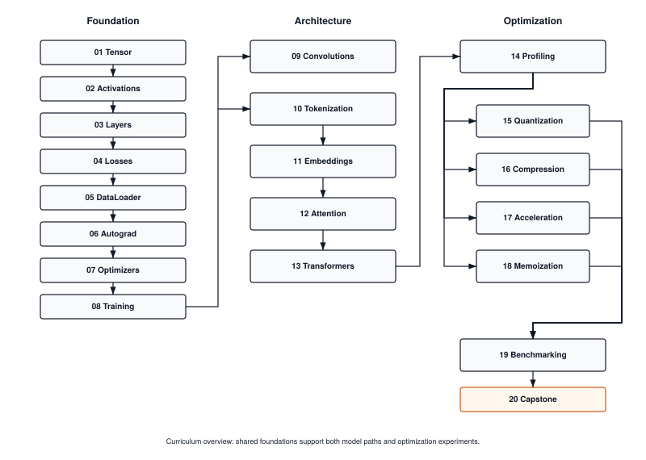

{fig-alt="Terminal output of tito: the TinyTorch banner and a welcome panel listing tito setup, tito module start and complete, tito module status, tito milestone status, the community login and logout commands, tito system health, and tito --help."}

Everyone wants to be an astronaut. Very few want to be the rocket scientist.

Machine learning is no different. Everyone wants to train models, run inference, deploy AI. Few want to understand how the frameworks actually work. Fewer still want to build one.

The world has plenty of users. It does not have enough builders: people who can debug, optimize, and adapt systems when the black box breaks down.

TinyTorch is for the builders.

## A Two-Minute Orientation

::: {.content-visible when-format="html"}

<style>
.pdf-viewer-container {
  margin: 1.5rem 0;
  background: #0f172a;
  border-radius: 1.25rem;
  overflow: hidden;
  box-shadow: 0 4px 20px rgba(0,0,0,0.15);
}
.pdf-header {
  display: flex;
  align-items: center;
  justify-content: space-between;
  padding: 0.75rem 1rem;
  background: rgba(255,255,255,0.03);
}
.pdf-title {
  display: flex;
  align-items: center;
  gap: 0.5rem;
  color: #94a3b8;
  font-weight: 500;
  font-size: 0.85rem;
}
.pdf-title-icon {
  font-size: 1rem;
}
.pdf-subtitle {
  color: #64748b;
  font-weight: 400;
  font-size: 0.75rem;
}
.pdf-toolbar {
  display: flex;
  align-items: center;
  gap: 0.375rem;
}
.pdf-toolbar button {
  background: transparent;
  border: none;
  color: #64748b;
  width: 32px;
  height: 32px;
  border-radius: 0.375rem;
  cursor: pointer;
  font-size: 1.1rem;
  font-weight: 400;
  transition: all 0.15s;
  display: flex;
  align-items: center;
  justify-content: center;
}
.pdf-toolbar button:hover {
  background: rgba(249, 115, 22, 0.15);
  color: #f97316;
}
.pdf-toolbar button:active {
  transform: scale(0.92);
}
.pdf-nav-group {
  display: flex;
  align-items: center;
  gap: 0;
}
.pdf-page-info {
  color: #64748b;
  font-size: 0.75rem;
  padding: 0 0.5rem;
  font-weight: 500;
}
.pdf-zoom-group {
  display: flex;
  align-items: center;
  gap: 0;
  margin-left: 0.25rem;
  padding-left: 0.5rem;
  border-left: 1px solid rgba(255,255,255,0.1);
}
.pdf-canvas-wrapper {
  display: flex;
  justify-content: center;
  align-items: center;
  padding: 0.5rem 1rem 1rem 1rem;
  min-height: 480px;
  background: #0f172a;
}
#pdf-canvas {
  max-width: 100%;
  max-height: 450px;
  height: auto;
  border-radius: 0.5rem;
  box-shadow: 0 4px 24px rgba(0,0,0,0.4);
}
.pdf-progress-wrapper {
  padding: 0 1rem 0.5rem 1rem;
  background: #0f172a;
}
.pdf-progress-bar {
  height: 3px;
  background: rgba(255,255,255,0.08);
  border-radius: 1.5px;
  overflow: hidden;
  cursor: pointer;
}
.pdf-progress-fill {
  height: 100%;
  background: #f97316;
  border-radius: 1.5px;
  transition: width 0.2s ease;
}
.pdf-loading {
  color: #f97316;
  font-size: 0.9rem;
  display: flex;
  align-items: center;
  gap: 0.5rem;
}
.pdf-loading::before {
  content: '';
  width: 18px;
  height: 18px;
  border: 2px solid rgba(249, 115, 22, 0.2);
  border-top-color: #f97316;
  border-radius: 50%;
  animation: spin 0.8s linear infinite;
}
@keyframes spin {
  to { transform: rotate(360deg); }
}
.pdf-footer {
  display: flex;
  justify-content: center;
  gap: 0.5rem;
  padding: 0.75rem 1rem;
  background: rgba(255,255,255,0.02);
  border-top: 1px solid rgba(255,255,255,0.05);
}
.pdf-footer a {
  display: inline-flex;
  align-items: center;
  gap: 0.375rem;
  background: #f97316;
  color: white;
  padding: 0.5rem 1rem;
  border-radius: 2rem;
  text-decoration: none;
  font-weight: 500;
  font-size: 0.8rem;
  transition: all 0.15s;
}
.pdf-footer a:hover {
  background: #ea580c;
  transform: translateY(-1px);
  color: white;
}
.pdf-footer a.secondary {
  background: transparent;
  color: #94a3b8;
  border: 1px solid rgba(255,255,255,0.15);
}
.pdf-footer a.secondary:hover {
  background: rgba(255,255,255,0.05);
  color: #f8fafc;
  border-color: rgba(255,255,255,0.25);
}
.pdf-viewer-container:fullscreen,
.pdf-viewer-container:-webkit-full-screen {
  display: flex;
  flex-direction: column;
  background: #0a0a0f;
}
.pdf-viewer-container:fullscreen .pdf-canvas-wrapper,
.pdf-viewer-container:-webkit-full-screen .pdf-canvas-wrapper {
  flex: 1;
  min-height: auto;
  padding: 1rem;
}
.pdf-viewer-container:fullscreen #pdf-canvas,
.pdf-viewer-container:-webkit-full-screen #pdf-canvas {
  max-height: calc(100vh - 140px);
  max-width: 95vw;
}
@media (max-width: 600px) {
  .pdf-header {
    flex-direction: column;
    gap: 0.5rem;
    padding: 0.625rem 0.75rem;
  }
  .pdf-toolbar button {
    width: 28px;
    height: 28px;
    font-size: 1rem;
  }
  .pdf-canvas-wrapper {
    min-height: 300px;
    padding: 0.5rem;
  }
  #pdf-canvas {
    max-height: 260px;
  }
  .pdf-progress-wrapper {
    padding: 0 0.75rem 0.375rem 0.75rem;
  }
  .pdf-footer {
    flex-direction: row;
    padding: 0.625rem 0.75rem;
  }
  .pdf-footer a {
    padding: 0.4rem 0.75rem;
    font-size: 0.75rem;
  }
}
</style>

<div class="pdf-viewer-container">
<div class="pdf-header">
<div class="pdf-title">
<span class="pdf-title-icon">🔥</span>
<span>TinyTorch Overview</span>

<span class="pdf-subtitle">· AI-generated</span>
</div>
<div class="pdf-toolbar">
<div class="pdf-nav-group">
<button id="pdf-prev" onclick="pdfPrevPage()" title="Previous slide">‹</button>
<span class="pdf-page-info"><span id="pdf-page-num">1</span> / <span id="pdf-page-count">-</span></span>
<button id="pdf-next" onclick="pdfNextPage()" title="Next slide">›</button>
</div>
<div class="pdf-zoom-group">
<button onclick="pdfZoomOut()" title="Zoom out">−</button>
<button onclick="pdfZoomIn()" title="Zoom in">+</button>
</div>
</div>
</div>
<div class="pdf-canvas-wrapper">
<div id="pdf-loading" class="pdf-loading">Loading slides...</div>
<canvas id="pdf-canvas" style="display:none;"></canvas>
</div>
<div class="pdf-progress-wrapper">
<div class="pdf-progress-bar" id="pdf-progress-bar" onclick="pdfProgressClick(event)">
<div class="pdf-progress-fill" id="pdf-progress-fill" style="width: 0%;"></div>
</div>
</div>
<div class="pdf-footer">
<a href="assets/downloads/00_tinytorch.pdf" download>
      ⬇️ Download
</a>

<a href="#" onclick="pdfFullscreen(); return false;" class="secondary">
      ⛶ Fullscreen
</a>

</div>
</div>

<script src="https://cdnjs.cloudflare.com/ajax/libs/pdf.js/3.11.174/pdf.min.js"></script>
<script>
(function() {
  const pdfUrl = 'assets/downloads/00_tinytorch.pdf';
  let pdfDoc = null;
  let pageNum = 1;
  let pageRendering = false;
  let pageNumPending = null;
  let scale = 1.5;
  const canvas = document.getElementById('pdf-canvas');
  const ctx = canvas.getContext('2d');

  pdfjsLib.GlobalWorkerOptions.workerSrc = 'https://cdnjs.cloudflare.com/ajax/libs/pdf.js/3.11.174/pdf.worker.min.js';

  function updateProgress() {
    if (pdfDoc) {
      const progress = (pageNum / pdfDoc.numPages) * 100;
      document.getElementById('pdf-progress-fill').style.width = progress + '%';
    }
  }

  function renderPage(num) {
    pageRendering = true;
    pdfDoc.getPage(num).then(function(page) {
      const viewport = page.getViewport({scale: scale});
      canvas.height = viewport.height;
      canvas.width = viewport.width;

      const renderContext = {
        canvasContext: ctx,
        viewport: viewport
      };
      const renderTask = page.render(renderContext);

      renderTask.promise.then(function() {
        pageRendering = false;
        if (pageNumPending !== null) {
          renderPage(pageNumPending);
          pageNumPending = null;
        }
      });
    });
    document.getElementById('pdf-page-num').textContent = num;
    updateProgress();
  }

  function queueRenderPage(num) {
    if (pageRendering) {
      pageNumPending = num;
    } else {
      renderPage(num);
    }
  }

  window.pdfPrevPage = function() {
    if (pageNum <= 1) return;
    pageNum--;
    queueRenderPage(pageNum);
  };

  window.pdfNextPage = function() {
    if (pageNum >= pdfDoc.numPages) return;
    pageNum++;
    queueRenderPage(pageNum);
  };

  window.pdfZoomIn = function() {
    scale = Math.min(scale + 0.25, 3);
    queueRenderPage(pageNum);
  };

  window.pdfZoomOut = function() {
    scale = Math.max(scale - 0.25, 0.5);
    queueRenderPage(pageNum);
  };

  window.pdfFullscreen = function() {
    const container = document.querySelector('.pdf-viewer-container');
    if (container.requestFullscreen) {
      container.requestFullscreen();
    } else if (container.webkitRequestFullscreen) {
      container.webkitRequestFullscreen();
    } else if (container.msRequestFullscreen) {
      container.msRequestFullscreen();
    }
  };

  window.pdfProgressClick = function(event) {
    if (!pdfDoc) return;
    const bar = document.getElementById('pdf-progress-bar');
    const rect = bar.getBoundingClientRect();
    const clickX = event.clientX - rect.left;
    const percentage = clickX / rect.width;
    const targetPage = Math.max(1, Math.min(pdfDoc.numPages, Math.ceil(percentage * pdfDoc.numPages)));
    if (targetPage !== pageNum) {
      pageNum = targetPage;
      queueRenderPage(pageNum);
    }
  };

  // Keyboard navigation
  document.addEventListener('keydown', function(event) {
    // Only handle if not in an input field
    if (event.target.tagName === 'INPUT' || event.target.tagName === 'TEXTAREA') return;

    if (event.key === 'ArrowLeft' || event.key === 'ArrowUp') {
      event.preventDefault();
      pdfPrevPage();
    } else if (event.key === 'ArrowRight' || event.key === 'ArrowDown' || event.key === ' ') {
      event.preventDefault();
      pdfNextPage();
    }
  });

  pdfjsLib.getDocument(pdfUrl).promise.then(function(pdf) {
    pdfDoc = pdf;
    document.getElementById('pdf-page-count').textContent = pdf.numPages;
    document.getElementById('pdf-loading').style.display = 'none';
    canvas.style.display = 'block';
    renderPage(pageNum);
  }).catch(function(error) {
    document.getElementById('pdf-loading').innerHTML =
      'Unable to load PDF viewer. <a href="' + pdfUrl + '" style="color:#f97316;">Download directly</a>';
  });
})();

</script>

:::

## The Problem

Most people can use PyTorch or TensorFlow. They can import libraries, call functions, train models. But very few understand how these frameworks work: how memory is managed for tensors, how autograd builds computation graphs, how optimizers update parameters. And almost no one has a guided, structured way to learn that from the ground up.

::: {.callout-note}
**Why does this matter?** Because users hit walls that builders do not:

- When your model runs out of memory, you need to understand **tensor allocation**
- When gradients explode, you need to understand the **computation graph**
- When training is slow, you need to understand where the **bottlenecks** are
- When deploying on a microcontroller, you need to know what can be **stripped away**

The framework becomes a black box you cannot debug, optimize, or adapt. You are stuck waiting for someone else to solve your problem.

:::

Students cannot learn this from production code. PyTorch is too large, too complex, too optimized. Fifty thousand lines of C++ across hundreds of files. No one learns to build rockets by studying the Saturn V.

They also cannot learn it from toy scripts. A hundred-line neural network does not reveal the architecture of a framework. It hides it.

## The Solution: AI Bricks

TinyTorch teaches you the **AI bricks**: the stable engineering foundations you can use to build any AI system. Small enough to learn from: bite-sized code that runs even on a Raspberry Pi. Big enough to matter: showing the real architecture of how frameworks are built.

<div class="who-grid">

<div class="who-card" style="border-left: 4px solid #1976d2;">
<strong>📖 MLSysBook</strong>

<p>The <a href="https://mlsysbook.ai">Machine Learning Systems</a> textbook teaches you the <em>concepts</em> of the rocket ship: propulsion, guidance, life support.</p>
</div>

<div class="who-card" style="border-left: 4px solid #0d9488;">
<strong>📘 TinyTorch: The Book</strong>

<p><em>From Tensors to Transformers</em> explains why each piece is built the way it is: the invariants, the memory traces, the napkin math, and the complete reference implementations, to read once yours works.</p>
</div>

<div class="who-card" style="border-left: 4px solid #ff8247;">
<strong>🛠️ TinyTorch: This Site</strong>

<p>Where you actually <em>build</em> the rocket with your own hands: twenty modules and six historical milestones, with tests and the <code>tito</code> CLI.</p>
</div>

</div>

This is how you move from *using* machine learning to *engineering* it: from running code in a notebook to designing the systems that run underneath.

## Who This Is For

<div class="who-grid">

<div class="who-card" style="border-left: 4px solid #9c27b0;">
<strong>Students & Researchers</strong>

<p>Want to understand ML systems deeply, not just use them superficially. If you have wondered "how does that actually work?", this is for you.</p>
</div>

<div class="who-card" style="border-left: 4px solid #4caf50;">
<strong>ML Engineers</strong>

<p>Need to debug, optimize, and deploy models in production. Understanding the systems underneath makes you more effective.</p>
</div>

<div class="who-card" style="border-left: 4px solid #2196f3;">
<strong>Systems Programmers</strong>

<p>You understand memory hierarchies, computational complexity, performance optimization. You want to apply it to ML.</p>
</div>

<div class="who-card" style="border-left: 4px solid #ffc107;">
<strong>Self-taught Engineers</strong>

<p>Can use frameworks but want to know how they work. Preparing for ML infrastructure roles and need systems-level understanding.</p>
</div>

</div>

What you need is not another API tutorial. You need to build.

## What You Need to Start

You do not need to be a machine learning expert, and you do not need to have built a framework before. You need three things.

<div class="who-grid">

<div class="who-card" style="border-left: 4px solid #1976d2;">
<strong>Python</strong>

<p>If you can read and write a function, a loop, and a class, you have enough. There is no C++, no CUDA, no assembly. Everything sits on NumPy, and you will pick up the NumPy you need as you go.</p>
</div>

<div class="who-card" style="border-left: 4px solid #4caf50;">
<strong>The math you already have</strong>

<p>Vectors, matrices, and the chain rule from first-year calculus. That is the whole list. No measure theory, no convex optimization, no proofs. When a derivative shows up, we derive it in code, not on a chalkboard.</p>
</div>

<div class="who-card" style="border-left: 4px solid #ff8247;">
<strong>A machine that turns on</strong>

<p>TinyTorch runs on a laptop. It runs on a Raspberry Pi. The code is small on purpose, so you can hold a module in your head and run it on hardware you already own. No GPU, no cloud account, no four-figure compute bill.</p>
</div>

</div>

If you have used PyTorch and felt like a tourist, this is the ground you were standing on.

## The Journey: Foundation to Production

TinyTorch takes you from a bare tensor to a production-style ML system in twenty modules. They connect like this.

**Three tiers, one system:**

- **Foundation (01-08)** — Build the core machinery. Tensors hold data, activations add non-linearity, layers combine them, losses measure error, DataLoader streams batches, autograd computes gradients, optimizers update weights, training orchestrates the loop.

- **Architecture (09-13)** — Apply the foundation to real problems. The DataLoader from Module 05 feeds data; from there you take one of two paths—convolutions for images, or the transformer stack (Tokenization → Embeddings → Attention → Transformers) for text.

- **Optimization (14-19)** — Make it fast. Profile to find bottlenecks, then apply quantization, compression, acceleration, or memoization. Benchmark to prove the gain.

@fig-module-flow shows how the pieces fit together.

::: {#fig-module-flow}
{fig-alt="Curriculum overview with Foundation modules 01 through 08, Architecture modules 09 through 13, Optimization modules 14 through 19, and Capstone 20. Shared foundations support vision and language models and their optimization experiments."}

**TinyTorch Module Flow.** The 20 modules progress through three tiers. Foundation builds the core ML primitives, Architecture applies them to vision and language tasks, and Optimization makes the result production-ready. All three converge on the capstone.
:::

**Flexible paths:**

```{=html}
<ul class="path-routes">
<li><strong>Vision focus</strong> &mdash; Foundation (01&ndash;08) &rarr; Convolutions (09) &rarr; Optimization (14&ndash;19)</li>
<li><strong>Language focus</strong> &mdash; Foundation (01&ndash;08) &rarr; Tokenization &rarr; Embeddings &rarr; Attention &rarr; Transformers (10&ndash;13) &rarr; Optimization (14&ndash;19)</li>
<li><strong>Full course</strong> &mdash; Both paths &rarr; Capstone (20)</li>
</ul>
```

## What You Will Build

By the end of TinyTorch, you will have implemented:

- A tensor library with broadcasting, reshaping, and matrix operations
- Activation functions with numerical stability considerations
- Neural network layers: linear, convolutional, normalization
- An autograd engine that builds computation graphs and computes gradients
- Optimizers that update parameters using those gradients
- Data loaders that handle batching, shuffling, and preprocessing
- A complete training loop that ties everything together
- Tokenizers, embeddings, attention, and transformer architectures
- Profiling, quantization, and optimization techniques

Not a simulation. The actual architecture of modern ML frameworks, implemented at a scale you can hold in your head.

## Milestones You'll Unlock

As you build, you unlock historical milestones—moments when your code does something that once made headlines:

1. **1958 Perceptron**: Rosenblatt's forward pass, running on your Linear layer with random weights
2. **1969 XOR**: Your single-layer perceptron fails XOR, exactly as Minsky and Papert proved it must
3. **1986 MLP**: Hidden layers and backprop solve XOR, then scale up to handwritten digits (Rumelhart)
4. **1998 CNN**: Your convolutional network classifies images with spatial understanding (LeCun's LeNet-5)
5. **2017 Transformer**: Your attention mechanism solves structured sequence tasks (Vaswani et al.)
6. **2018 MLPerf**: You measure your optimized system with MLPerf's discipline, on classroom workloads

Each milestone activates when you complete the required modules. You're not just learning—you're recreating six decades of ML evolution, one working implementation at a time.

## What You'll Have at the End

Concrete outcomes at each major checkpoint:

@tbl-big-picture-outcomes pins down the concrete outcome you unlock at each checkpoint.

::: {.path-outcomes}

| After Module | You'll Have Built | Historical Context |
|--------------|-------------------|-------------------|
| **01-03** | Perceptron forward pass | Rosenblatt 1958 |
| **01-08** | MLP solving XOR + complete training pipeline | AI Winter breakthrough 1969→1986 |
| **01-09** | CNN with convolutions and pooling | LeNet-5 (1998) |
| **01-08 + 11-13** | GPT model with autoregressive generation | "Attention Is All You Need" (2017) |
| **01-08 + 11-19** | Optimized, quantized, accelerated system | Production ML today |
| **01-20** | MLPerf-style benchmarking submission | Torch Olympics |

: **Concrete outcomes unlocked at each module checkpoint.** {#tbl-big-picture-outcomes}

:::

:::{.callout-tip title="The North Star Build"}
By Module 13 you'll have assembled a GPT-style transformer from your own layers and run it end to end. By Module 20 you'll measure your whole framework with MLPerf's discipline. Every tensor operation, every gradient calculation, every optimization trick: **you wrote it**.
:::

## Choose Your Learning Path

Pick the route that matches your goals and the time you have. Every route starts at Module 01.

| Path | Modules | Time | Suits |
|:-----|:--------|:-----|:------|
| **Full course** | All 20, in order | 90–130 hours | Students, and anyone who wants the whole framework, from tensors to benchmarking |
| **Vision focus** | 01–09, then 14–19 | 64–94 hours | Computer vision and ML ops; you finish with CNNs and measured optimizations |
| **Language focus** | 01–08, then 10–13 | 53–77 hours | NLP and research engineering; you finish with a GPT-style transformer built from your own layers |
| **Instructor sampler** | Read 01, 03, 05, 07, 12 | A few hours | Judging whether the course fits a class you teach |

: **Four ways through the course.** Times are the sums of each module's estimate. {#tbl-about-paths tbl-colwidths="[18,22,16,44]"}

`tito` currently completes modules in numeric order, so on a focused path you still complete the modules in between; the path tells you where to spend your attention.

## How to Learn

Each module follows a **Build-Use-Reflect** cycle: implement from scratch, apply to real problems, then connect what you built to production systems and understand the tradeoffs. Work through Foundation first, then choose your path based on your interests.

<div style="display: grid; grid-template-columns: 1fr 1fr; gap: 1rem; margin: 1.5rem 0;">

<div style="border: 1px solid #e0e0e0; padding: 1rem; border-radius: 0.5rem;">
<strong>Type every line yourself</strong>

<p style="margin: 0.5rem 0 0 0; font-size: 0.9rem; color: #666;">Do not copy-paste. The learning happens in the struggle of implementation.</p>
</div>

<div style="border: 1px solid #e0e0e0; padding: 1rem; border-radius: 0.5rem;">
<strong>Profile your code</strong>

<p style="margin: 0.5rem 0 0 0; font-size: 0.9rem; color: #666;">Use built-in profiling tools. Measure first, optimize second.</p>
</div>

<div style="border: 1px solid #e0e0e0; padding: 1rem; border-radius: 0.5rem;">
<strong>Run the tests</strong>

<p style="margin: 0.5rem 0 0 0; font-size: 0.9rem; color: #666;">Every module ships with tests. When they pass, you have built something real.</p>
</div>

<div style="border: 1px solid #e0e0e0; padding: 1rem; border-radius: 0.5rem;">
<strong>Then read why</strong>

<p style="margin: 0.5rem 0 0 0; font-size: 0.9rem; color: #666;">Once your implementation works, the book chapter explains its design and compares it with PyTorch's.</p>
</div>

</div>

Take your time. The goal is not to finish fast. The goal is to understand deeply.


## Expect to Struggle (That's the Design)

:::{.callout-important title="Getting stuck is not a bug—it's a feature"}
TinyTorch treats productive struggle as a teaching tool. You will debug tensor shape mismatches, trace gradient flow through tangled graphs, and fight for memory inside tight constraints. The friction is intentional. It is your brain rewiring around how ML systems actually work.

**What helps when you're stuck:**

- Run the tests early and often—they're your fastest feedback loop.
- The `if __name__ == "__main__"` blocks show the expected workflow.
- The ML Systems Thinking questions validate that you understood, not just that you typed.
- Each module page lists the real error messages that module prints, and what each one means.

**When to ask for help:**

- After you've run the tests and read the error message carefully.
- After you've tried explaining the problem out loud to a rubber duck.
- If you've been stuck on a single bug for more than thirty minutes.

The goal isn't to never struggle. It's to struggle *productively*, and to leave each module knowing why the working version works.
:::

## The Bigger Picture

TinyTorch is one piece of a larger curriculum, and every piece exists for the same reason: students who only read do not internalize, and students who only code do not generalize. The [Machine Learning Systems](https://mlsysbook.ai) textbook gives you the concepts: how training works, why accelerators matter, what makes inference cheap or expensive. This site and its twenty modules make you build the machinery yourself, and the companion book, [*TinyTorch: From Tensors to Transformers*](https://mlsysbook.ai/tinytorch/assets/downloads/TinyTorch-Book.pdf), explains why each piece is built the way it is, with complete reference implementations to read once yours works. The hardware kits put what you built on real devices, where memory limits, power budgets, and latency stop being abstractions. And StaffML tests whether you can reason about these systems under pressure, the way an interview or a production incident will.

This follows a long tradition in engineering education. You learned electronics by wiring a circuit on a breadboard. You learned architecture by laying out a processor on an FPGA. Operating systems courses have students build a small kernel of their own. You do not understand a system until you have built one. The same tradition runs through systems education: SICP's "build to understand" philosophy, xv6's transparent operating system, Nachos, Pintos. TinyTorch brings it to machine learning, and it grew out of years of teaching these ideas at Harvard and building the open MLSysBook curriculum. The pedagogical principles are detailed in our [research paper](https://arxiv.org/pdf/2601.19107), which positions this work within decades of CS education research.

The next generation of engineers cannot rely on magic. They need to see how everything fits together, from a single tensor allocation up to a full training loop, and feel that the systems running modern AI are not an unreachable tower but something they can open, shape, and rebuild.

That is what TinyTorch offers: the confidence that comes from having built it yourself.

## For Instructors

Every engineering course has a lab, because students learn to build by building. TinyTorch is that lab for machine learning systems, and it is built to be taught. The modules come with tests and autograding so you can guide students as they build, and the instructor hub at [mlsysbook.ai](https://mlsysbook.ai) collects what you need to bring this into a classroom: the AI Engineering Blueprint, lecture slides, a course map, and assessment guides. These materials are still growing, and we welcome ideas and contributions from anyone teaching with them.

Start with [For Instructors](instructors.qmd), which covers assignment tiers, nbgrader, and when to hand out the book.

## Make It Better

TinyTorch is open source, and it is built the way it teaches: in the open, by people who wanted to understand it. Every module, test, and milestone lives in the open, so if you find a bug, an explanation that did not land, or a cleaner way to teach a concept, you can fix it, and the next reader gets the benefit. The students who learn the most from TinyTorch are often the ones who end up improving it.

Found a problem? Built something better? Think a design choice is wrong? Bring it to [mlsysbook.ai/git](https://mlsysbook.ai/git).

*Prof. Vijay Janapa Reddi*<br>
*(Harvard University)*<br>
*2025*

## Start Building

You have the map. Module 01 builds the tensor—the data structure every other module depends on. A few hours from now you'll have a working `Tensor` class and a green test suite, and the path to CNNs, transformers, and an MLPerf-style benchmark will be one module shorter.

**Next step.** Follow the [Quick Start Guide](getting-started.qmd) to set up your environment (2 minutes), complete Module 01: Tensor (4–6 hours), and watch your first tests pass.

The journey from tensors to transformers starts with a single `import tinytorch`.
