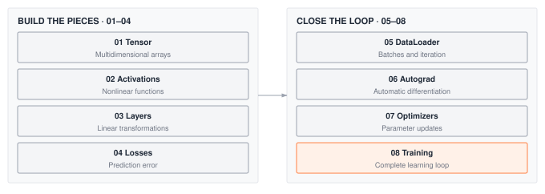
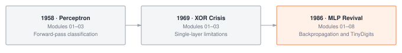

**Build the mathematical core that makes neural networks learn.**


## What You'll Learn

The Foundation tier teaches you how to build a complete learning system from scratch. Starting with basic tensor operations, you'll construct the mathematical infrastructure that powers every modern ML framework—data loading, automatic differentiation, gradient-based optimization, and training loops.

**By the end of this tier, you'll understand:**

- How tensors represent and transform data in neural networks
- Why activation functions enable non-linear learning
- How data loaders efficiently feed training data to models
- How backpropagation computes gradients automatically
- What optimizers do to make training converge
- How training loops orchestrate the entire learning process


## Module Progression

::: {#fig-foundation-deps}
{fig-alt="Foundation progression from Tensor through Activations, Layers, Losses, DataLoader, Autograd, Optimizers, and Training. Each stage builds on earlier modules."}

**Foundation Module Dependencies.** Tensors and activations feed into layers, which connect to losses and dataloader, then autograd, enabling optimizers and ultimately training loops.
:::


## Why This Order?

The Foundation tier follows a deliberate **Forward Pass → Learning → Training** progression that mirrors how neural networks actually work:

### Phase 1: Forward Pass Components (01-04)

**Tensors (01) → Activations (02) → Layers (03) → Losses (04)**

You must build things in the order data flows through them:

1. **Tensors** are the data structure—you can't do anything without them
2. **Activations** transform tensors non-linearly—needed before layers can create interesting functions
3. **Layers** combine tensors and activations into parameterized transformations
4. **Losses** measure how wrong predictions are—needed before you can learn

At this point, you can do a complete forward pass: `input → layer → activation → loss`.

### Phase 2: Learning Infrastructure (05-07)

**DataLoader (05) → Autograd (06) → Optimizers (07)**

Now you need the infrastructure to learn from data:

5. **DataLoader** provides efficient data batching—real training needs this before autograd
6. **Autograd** computes gradients automatically—the engine that makes learning possible
7. **Optimizers** use gradients to update parameters—SGD, Adam, and friends

### Phase 3: Complete Training (08)

**Training (08)** integrates everything into a complete learning loop.

This order isn't arbitrary—it's the minimal dependency chain. You can't build optimizers without autograd (no gradients), can't build autograd without losses (nothing to differentiate), can't build losses without layers (no predictions). Each module unlocks the next.


## Module Details

### 01. Tensor - The Foundation of Everything

**What it is**: Multidimensional arrays with automatic shape tracking and broadcasting.

**Why it matters**: Tensors are the universal data structure for ML. Understanding tensor operations, broadcasting, and memory layouts is essential for building efficient neural networks.

**What you'll build**: A NumPy-backed tensor class supporting arithmetic, reshaping, slicing, and broadcasting—just like PyTorch tensors.

**Systems focus**: Memory layout, broadcasting semantics, operation fusion


### 02. Activations - Enabling Non-Linear Learning

**What it is**: Non-linear functions applied element-wise to tensors.

**Why it matters**: Without activations, neural networks collapse to linear models. Activations like ReLU, Sigmoid, and Tanh enable networks to learn complex, non-linear patterns.

**What you'll build**: Common activation functions with their gradients for backpropagation.

**Systems focus**: Numerical stability, in-place operations, gradient flow


### 03. Layers - Building Blocks of Networks

**What it is**: Parameterized transformations (Linear, Dropout, Sequential) that learn from data.

**Why it matters**: Layers are the modular components you stack to build networks. Understanding weight initialization, parameter management, and forward passes is crucial.

**What you'll build**: Linear (fully-connected) layers with proper initialization and parameter tracking.

**Systems focus**: Parameter storage, initialization strategies, forward computation


### 04. Losses - Measuring Success

**What it is**: Functions that quantify how wrong your predictions are.

**Why it matters**: Loss functions define what "good" means for your model. Different tasks (classification, regression) require different loss functions.

**What you'll build**: CrossEntropyLoss, MSELoss, and other common objectives with their gradients.

**Systems focus**: Numerical stability (log-sum-exp trick), reduction strategies


### 05. DataLoader - Efficient Data Pipelines

**What it is**: Infrastructure for loading, batching, and shuffling training data efficiently.

**Why it matters**: Real ML systems train on datasets that don't fit in memory. DataLoaders handle batching, shuffling, and parallel data loading, which are essential for efficient training.

**What you'll build**: A DataLoader that supports batching, shuffling, and dataset iteration with proper memory management.

**Systems focus**: Memory efficiency, batching strategies, I/O optimization


### 06. Autograd - The Gradient Revolution

**What it is**: Automatic differentiation system that computes gradients through computation graphs.

**Why it matters**: Autograd is what makes deep learning practical. It automatically computes gradients for any computation, enabling backpropagation through arbitrarily complex networks.

**What you'll build**: A computational graph system that tracks operations and computes gradients via the chain rule.

**Systems focus**: Computational graphs, topological sorting, gradient accumulation


### 07. Optimizers - Learning from Gradients

**What it is**: Algorithms that update parameters using gradients (SGD, Adam, AdamW).

**Why it matters**: Raw gradients don't directly tell you how to update parameters. Optimizers use momentum, adaptive learning rates, and other tricks to make training converge faster and more reliably.

**What you'll build**: SGD, Adam, and RMSprop with proper momentum and learning rate scheduling.

**Systems focus**: Update rules, momentum buffers, numerical stability


### 08. Training - Orchestrating the Learning Process

**What it is**: The training loop that ties everything together—forward pass, loss computation, backpropagation, parameter updates.

**Why it matters**: Training loops orchestrate the entire learning process. Understanding this flow—including batching, epochs, and validation—is essential for practical ML.

**What you'll build**: The training-epoch loop at the center of a supplied training framework that adds progress tracking, validation, and model checkpointing.

**Systems focus**: Batch processing, gradient clipping, learning rate scheduling


## What You Can Build After This Tier

::: {#fig-foundation-milestones fig-env="figure" fig-pos="htb" fig-cap="**Foundation milestones.** The Perceptron forward pass requires modules 01 through 03. The XOR crisis milestone requires modules 01 through 03; the MLP training milestone requires 01 through 08 and use the training components students implement." fig-alt="The Perceptron forward pass requires modules 01 through 03. The XOR crisis milestone requires modules 01 through 03; the MLP training milestone requires 01 through 08 and use the training components students implement."}



:::

After completing the Foundation tier, you'll be able to:

- **Milestone 01 (1958)**: Recreate the Perceptron's forward pass with your own layers
- **Milestone 02 (1969)**: Demonstrate the XOR limitation that nearly ended neural-network research
- **Milestone 03 (1986)**: Build multi-layer perceptrons that solve XOR and train on TinyDigits


## Prerequisites

**Required**:

- Python programming (functions, classes, loops)
- Basic linear algebra (matrix multiplication, dot products)
- Basic calculus (derivatives, chain rule)

**Helpful but not required**:

- NumPy experience
- Understanding of neural network concepts


## Time Commitment

**Per module**: 3 to 8 hours; each module page gives its own estimate

**Total tier**: 33-49 hours, the sum of the per-module estimates for modules 01-08

**Recommended pace**: 1-2 modules per week


## Learning Approach

Each module follows the **Build → Use → Reflect** cycle:

1. **Build**: Implement the component from scratch (tensor operations, autograd, optimizers)
2. **Use**: Apply it to real problems (toy datasets, simple networks)
3. **Reflect**: Answer systems thinking questions (memory usage, computational complexity, design trade-offs)


## Next Steps

**Ready to start building?**

```bash
tito module start 01      # opens the Module 01 notebook
tito module complete 01   # runs its tests, exports it, records progress
```

The [Quick Start](../getting-started.qmd) walks through the whole loop once.

**Or explore other tiers:**

- **[ Architecture Tier](architecture.qmd)** (Modules 09-13): CNNs, transformers, attention
- **[ Optimization Tier](optimization.qmd)** (Modules 14-19): Production-ready performance
- **[ Torch Olympics](../modules/20_capstone.qmd)** (Module 20): Compete in ML systems challenges


**[← Back to Home](../index.qmd)** | **[Module Workflow](../tito/workflow.qmd)**
